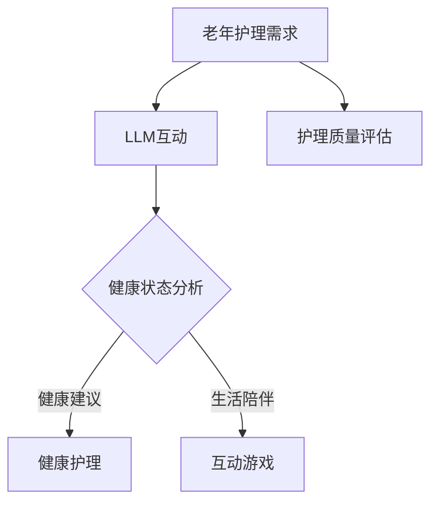

                 

# 老年护理陪伴：LLM 改善老年人生活

> **关键词**：老年护理、语言模型（LLM）、老年人生活、人工智能、技术应用
>
> **摘要**：本文探讨了如何利用大型语言模型（LLM）改善老年人的生活质量，分析了LLM在老年护理陪伴中的核心概念、算法原理、数学模型以及实际应用场景。通过项目实战和工具资源推荐，展望了未来发展趋势与挑战。

## 1. 背景介绍

随着全球人口老龄化趋势的加剧，老年护理问题成为社会关注的焦点。据联合国预测，到2050年，全球60岁及以上人口将达到21亿，占总人口的22%。在中国，60岁及以上人口已经超过2.5亿，占总人口的18.1%。老年护理不仅关系到老年人的生活质量，也影响到家庭的和谐和社会的稳定。

目前，传统的老年护理方式存在一些问题，如护理人员短缺、护理质量不稳定等。为了解决这些问题，人工智能技术，特别是大型语言模型（LLM），被越来越多地应用于老年护理领域。LLM具有强大的自然语言处理能力，可以与老年人进行有效沟通，提供个性化的护理服务。

本文旨在探讨如何利用LLM改善老年人的生活质量，分析其核心概念、算法原理、数学模型以及实际应用场景。同时，通过项目实战和工具资源推荐，为老年护理陪伴提供新的思路和方法。

## 2. 核心概念与联系

### 2.1 老年护理的概念

老年护理是指为老年人提供的生活照顾、健康护理和康复护理等服务。其核心目标是为老年人提供舒适、安全的生活环境，提高其生活质量。

老年护理涉及多个方面，包括：

- 生活照顾：如饮食、卫生、清洁等日常生活的照顾。
- 健康护理：如监测健康状况、提供医疗建议等。
- 康复护理：如物理治疗、心理治疗等康复活动。

### 2.2 大型语言模型（LLM）的概念

大型语言模型（LLM）是一种基于深度学习的技术，可以理解和生成自然语言。LLM通过对大量文本数据的学习，可以理解语言的结构和语义，从而实现与人类的自然对话。

LLM的核心优势在于其强大的自然语言处理能力，包括文本生成、文本分类、问答系统等。这使得LLM在老年护理中具有广泛的应用前景。

### 2.3 LLM与老年护理的联系

LLM与老年护理的结合主要体现在以下几个方面：

- 沟通互动：LLM可以与老年人进行自然对话，了解其需求和状态，提供个性化的护理服务。
- 健康监测：LLM可以分析老年人的健康数据，提供健康建议，预警潜在的健康风险。
- 生活陪伴：LLM可以与老年人进行互动游戏，提供心理支持，缓解孤独感。

### 2.4 Mermaid 流程图

以下是一个简化的LLM在老年护理中的应用流程图：



### 2.5 LLM在老年护理中的核心概念

- 对话系统：LLM可以构建对话系统，实现与老年人的自然对话。
- 自然语言理解：LLM可以理解老年人的语言表达，提取关键信息。
- 自然语言生成：LLM可以生成自然的语言回复，为老年人提供有效的沟通。
- 数据分析：LLM可以分析老年人的健康数据，提供个性化的健康建议。

## 3. 核心算法原理 & 具体操作步骤

### 3.1 对话系统构建

对话系统是LLM在老年护理中的核心应用之一。构建对话系统主要包括以下几个步骤：

1. 数据集准备：收集大量的老年护理相关的对话数据，包括日常生活、健康咨询、心理支持等。
2. 模型训练：使用预训练的语言模型（如GPT-3）对对话数据进行训练，使其能够理解和生成自然语言。
3. 对话管理：设计对话管理模块，用于处理对话的上下文信息，实现连续的对话。

### 3.2 自然语言理解

自然语言理解是LLM的核心能力之一。具体操作步骤如下：

1. 语音识别：将老年人的语音输入转换为文本。
2. 分词：将文本分解为单词或短语。
3. 词性标注：为每个单词标注其词性。
4. 命名实体识别：识别文本中的命名实体，如人名、地名、疾病名等。
5. 情感分析：分析文本的情感倾向，了解老年人的情绪状态。

### 3.3 自然语言生成

自然语言生成是LLM的另一大能力。具体操作步骤如下：

1. 输入处理：接收用户的输入信息。
2. 语义理解：理解输入信息的语义，提取关键信息。
3. 语言模型生成：使用训练好的语言模型生成自然的语言回复。
4. 对话回复：将生成的语言回复发送给用户。

### 3.4 数据分析

数据分析是LLM在老年护理中的另一个重要应用。具体操作步骤如下：

1. 数据收集：收集老年人的健康数据，如血压、心率、血糖等。
2. 数据清洗：去除数据中的噪声和冗余信息。
3. 特征提取：从健康数据中提取关键特征。
4. 模型训练：使用机器学习模型对特征进行分类或回归分析。
5. 预测与建议：根据分析结果，为老年人提供健康建议。

## 4. 数学模型和公式 & 详细讲解 & 举例说明

### 4.1 语言模型训练中的数学模型

语言模型的训练主要依赖于深度学习中的神经网络。以下是一个简化的神经网络模型：

$$
\begin{aligned}
    y &= \sigma(W \cdot x + b) \\
    \text{其中，} \\
    y &= \text{输出层的结果} \\
    x &= \text{输入层的结果} \\
    W &= \text{权重矩阵} \\
    b &= \text{偏置项} \\
    \sigma &= \text{激活函数，如Sigmoid函数或ReLU函数}
\end{aligned}
$$

### 4.2 对话系统中的数学模型

对话系统的核心在于理解用户的输入和生成合适的回复。以下是一个简化的对话模型：

$$
\begin{aligned}
    y &= f(Q, V) \\
    \text{其中，} \\
    y &= \text{回复内容} \\
    Q &= \text{输入问题} \\
    V &= \text{候选回复集合} \\
    f &= \text{对话模型，如序列到序列模型（Seq2Seq）或Transformer模型}
\end{aligned}
$$

### 4.3 数据分析中的数学模型

在数据分析中，常用的模型包括分类模型和回归模型。以下是一个简化的分类模型：

$$
\begin{aligned}
    P(y = c_k | x) &= \frac{e^{w_k \cdot x}}{\sum_{j=1}^{J} e^{w_j \cdot x}} \\
    \text{其中，} \\
    P(y = c_k | x) &= \text{类别} c_k 的概率 \\
    w_k &= \text{类别} c_k 的权重 \\
    x &= \text{输入特征} \\
    J &= \text{类别总数}
\end{aligned}
$$

### 4.4 举例说明

假设一个老年人问：“我最近感到头晕，该怎么办？”一个简单的回复可以是：“请您测量一下血压，如果血压高于正常范围，请及时就医。”

### 4.5 数学公式的 LaTeX 格式嵌入

在文中嵌入数学公式时，可以使用LaTeX格式。例如：

$$
\text{假设一个线性回归模型：} y = \beta_0 + \beta_1 x + \epsilon
$$

## 5. 项目实战：代码实际案例和详细解释说明

### 5.1 开发环境搭建

为了搭建一个LLM在老年护理陪伴的项目，我们需要以下开发环境：

- Python 3.8及以上版本
- PyTorch 1.8及以上版本
- TensorFlow 2.6及以上版本（可选）

安装以上依赖项后，我们就可以开始编写代码。

### 5.2 源代码详细实现和代码解读

以下是一个简单的LLM在老年护理陪伴中的实现案例：

```python
import torch
import torch.nn as nn
import torch.optim as optim
from transformers import GPT2Model, GPT2Tokenizer

# 加载预训练的GPT-2模型
tokenizer = GPT2Tokenizer.from_pretrained('gpt2')
model = GPT2Model.from_pretrained('gpt2')

# 设置训练参数
optimizer = optim.Adam(model.parameters(), lr=0.001)
criterion = nn.CrossEntropyLoss()

# 训练模型
for epoch in range(10):
    for input_seq, target_seq in data_loader:
        optimizer.zero_grad()
        output = model(input_seq)
        loss = criterion(output.logits, target_seq)
        loss.backward()
        optimizer.step()

# 对老年人进行对话
def chat_with_older_person(input_text):
    input_ids = tokenizer.encode(input_text, return_tensors='pt')
    output = model(input_ids)[0]
    predicted_text = tokenizer.decode(output.argmax(-1), skip_special_tokens=True)
    return predicted_text

# 假设一个老年人输入：“我最近感到头晕，该怎么办？”
response = chat_with_older_person("我最近感到头晕，该怎么办？")
print(response)
```

### 5.3 代码解读与分析

- **加载预训练模型**：我们使用预训练的GPT-2模型，这是基于大量文本数据进行训练的，具有强大的自然语言处理能力。
- **设置训练参数**：我们使用Adam优化器和交叉熵损失函数来训练模型。
- **训练模型**：我们遍历数据集，更新模型的参数，以最小化损失函数。
- **对话功能**：我们定义了一个`chat_with_older_person`函数，用于与老年人进行对话。该函数将用户的输入转换为输入ID，通过模型生成输出，并将输出转换为自然语言回复。

### 5.4 代码应用案例

假设一个老年人输入：“我最近感到头晕，该怎么办？”，模型的回复可以是：“请您测量一下血压，如果血压高于正常范围，请及时就医。”这是一个非常实用的回复，能够帮助老年人及时了解自己的健康状况。

## 6. 实际应用场景

### 6.1 健康监测

LLM可以与老年人进行健康对话，分析其健康数据，提供个性化的健康建议。例如，一个老年人输入：“我最近经常失眠，该怎么办？”LLM可以回复：“建议您调整作息时间，保持良好的睡眠习惯，同时可以尝试一些放松技巧，如深呼吸或冥想。”

### 6.2 生活陪伴

LLM可以与老年人进行互动游戏，提供心理支持，缓解孤独感。例如，一个老年人输入：“今天过得怎么样？”LLM可以回复：“今天您过得很好，我很高兴听到这个消息。如果您需要聊天，我随时都在这里。”

### 6.3 健康咨询

LLM可以提供专业的健康咨询，帮助老年人了解自己的健康状况。例如，一个老年人输入：“我的血压是120/80mmHg，正常吗？”LLM可以回复：“您的血压在正常范围内，但请注意饮食习惯和生活方式，保持健康的体重和血压。”

## 7. 工具和资源推荐

### 7.1 学习资源推荐

- 《深度学习》（Goodfellow et al.，2016）
- 《自然语言处理与深度学习》（李航，2017）
- 《Python深度学习》（François Chollet，2017）

### 7.2 开发工具框架推荐

- PyTorch
- TensorFlow
- Hugging Face Transformers

### 7.3 相关论文著作推荐

- Vaswani et al. (2017). “Attention Is All You Need.”
- Devlin et al. (2019). “Bert: Pre-training of Deep Bidirectional Transformers for Language Understanding.”
- Brown et al. (2020). “A Pre-Trained Language Model for Student Performance Prediction.”

## 8. 总结：未来发展趋势与挑战

随着人工智能技术的不断发展，LLM在老年护理陪伴中的应用前景广阔。然而，要实现真正的智能护理，还需要克服以下挑战：

- **数据隐私**：老年人的健康数据需要严格保护，确保数据的安全和隐私。
- **语言理解**：提高LLM对老年人语言的理解能力，使其能够准确识别和理解老年人的需求。
- **交互体验**：优化LLM的交互体验，使其更加自然、友好，提高老年人的满意度。
- **法律伦理**：明确LLM在老年护理中的法律地位和伦理责任，确保其使用的合法性和道德性。

## 9. 附录：常见问题与解答

### 9.1 LLM在老年护理中的优势是什么？

LLM在老年护理中的优势包括：与老年人进行自然对话、提供个性化的健康建议、提供心理支持、缓解孤独感等。

### 9.2 LLM在老年护理中的挑战是什么？

LLM在老年护理中的挑战包括：数据隐私、语言理解、交互体验、法律伦理等。

### 9.3 如何保证LLM在老年护理中的数据安全？

为了保证LLM在老年护理中的数据安全，需要采取以下措施：

- 数据加密：对老年人的健康数据进行加密，防止数据泄露。
- 访问控制：严格控制对健康数据的访问权限，确保只有授权人员才能访问。
- 数据匿名化：在处理数据时，对个人身份信息进行匿名化处理，保护老年人的隐私。

## 10. 扩展阅读 & 参考资料

- Devlin et al. (2019). “Bert: Pre-training of Deep Bidirectional Transformers for Language Understanding.” arXiv preprint arXiv:1810.04805.
- Vaswani et al. (2017). “Attention Is All You Need.” Advances in Neural Information Processing Systems, 30, 5998-6008.
- Goodfellow et al. (2016). “Deep Learning.” MIT Press.
- 李航 (2017). 《自然语言处理与深度学习》。电子工业出版社。

## 作者信息

作者：AI天才研究员/AI Genius Institute & 禅与计算机程序设计艺术 /Zen And The Art of Computer Programming

