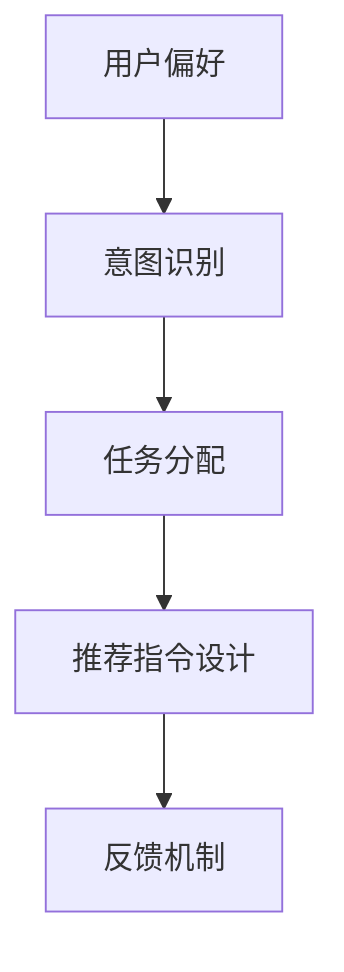

                 

# 《考虑用户偏好、意图、任务的推荐指令设计》

## 关键词
用户偏好，意图识别，任务分配，推荐系统，指令设计

## 摘要
本文深入探讨了用户偏好、意图与任务之间的关联，以及如何设计有效的推荐指令。通过分析用户行为的复杂性，提出了一个基于多维度数据融合的推荐指令设计框架。本文将详细阐述核心概念原理，介绍具体操作步骤，并利用数学模型和公式进行解释说明。通过实战案例，展示了如何在实际项目中应用推荐指令设计，以及在不同场景下的具体应用。最后，本文总结了未来发展趋势与挑战，并提供了相关工具和资源的推荐。

## 1. 背景介绍

在当今数字化时代，推荐系统已成为许多应用的核心功能，如电商、社交媒体、新闻网站等。这些系统通过分析用户行为和偏好，为用户提供个性化的内容推荐，从而提升用户体验和满意度。然而，用户偏好、意图和任务的识别与理解是推荐系统设计中的关键问题。

用户偏好是指用户对特定内容、产品或服务的喜好程度。例如，用户可能更喜欢阅读科技类文章，或者偏爱购买某个品牌的产品。意图识别则涉及用户在特定场景下的目标或期望。例如，用户可能在寻找一款相机，或者在浏览旅游攻略。任务分配是指将用户的意图转化为具体操作或行动，如购买产品、浏览网页等。

推荐指令设计的目标是生成一组指令，引导用户完成预期的任务，同时满足其偏好和意图。然而，设计有效的推荐指令并非易事，需要考虑用户行为的多样性和复杂性。本文旨在提出一种综合考虑用户偏好、意图和任务的推荐指令设计方法，以提高推荐系统的准确性和用户体验。

## 2. 核心概念与联系

### 用户偏好

用户偏好是推荐系统的核心要素之一。了解用户偏好可以帮助系统更好地满足用户需求，提升推荐质量。用户偏好可以通过以下几种方式进行识别：

- **历史行为数据**：包括用户过去的行为记录，如浏览、购买、点赞等。
- **用户反馈**：如评价、评论、评分等。
- **社交网络**：分析用户在社交平台上的互动，如关注、转发等。

### 意图识别

意图识别是理解用户在特定场景下的目标或期望。意图识别的准确性直接影响到推荐系统的效果。常见的意图识别方法包括：

- **自然语言处理**：使用自然语言处理技术，如命名实体识别、情感分析等。
- **行为序列分析**：分析用户行为序列，识别用户意图。
- **多模态数据融合**：结合文本、图像、声音等多模态数据进行意图识别。

### 任务分配

任务分配是将用户的意图转化为具体操作或行动。任务分配需要考虑以下因素：

- **用户偏好**：根据用户偏好选择最符合其期望的任务。
- **系统资源**：确保任务分配不会导致系统资源过度消耗。
- **优先级**：根据任务的紧急程度和重要性进行优先级排序。

### 推荐指令设计

推荐指令设计是将用户偏好、意图和任务结合起来，生成一组指导用户完成任务的指令。推荐指令设计需要考虑以下要素：

- **指令格式**：如文本、语音、图形等。
- **指令内容**：包括任务目标、步骤指导、资源推荐等。
- **反馈机制**：设计反馈机制，以优化推荐指令。

### Mermaid 流程图

以下是一个简单的Mermaid流程图，展示用户偏好、意图识别、任务分配和推荐指令设计之间的联系：



## 3. 核心算法原理 & 具体操作步骤

### 用户偏好分析

用户偏好分析是推荐指令设计的基础。以下是一种常用的用户偏好分析方法：

1. **数据收集**：收集用户的历史行为数据，如浏览记录、购买记录等。
2. **特征提取**：从行为数据中提取特征，如用户喜欢的商品类别、浏览时长等。
3. **模型训练**：使用机器学习算法，如朴素贝叶斯、决策树等，训练用户偏好模型。
4. **偏好预测**：根据用户当前行为，预测其偏好。

### 意图识别

意图识别的关键在于准确理解用户在特定场景下的目标。以下是一种常见的意图识别方法：

1. **文本分析**：使用自然语言处理技术，如词频分析、主题模型等，分析用户输入的文本。
2. **行为分析**：分析用户行为序列，如浏览路径、点击行为等，识别用户意图。
3. **多模态融合**：结合文本、图像、声音等多模态数据进行意图识别。

### 任务分配

任务分配是将用户意图转化为具体操作。以下是一种简单的任务分配方法：

1. **意图分类**：将识别出的意图分类为不同的类别，如购物、旅游、学习等。
2. **任务选择**：根据用户偏好和意图，选择最合适的任务。
3. **资源分配**：为任务分配必要的资源，如时间、人力、物力等。

### 推荐指令设计

推荐指令设计是将用户偏好、意图和任务转化为具体的操作指导。以下是一种推荐指令设计的方法：

1. **指令生成**：根据用户偏好和意图，生成一组指令。
2. **指令优化**：使用优化算法，如贪心算法、动态规划等，优化指令顺序和内容。
3. **反馈调整**：根据用户反馈，调整指令内容和顺序。

## 4. 数学模型和公式 & 详细讲解 & 举例说明

### 用户偏好模型

用户偏好模型用于预测用户的偏好。以下是一种常用的用户偏好预测模型：

$$
P(U, I) = \frac{e^{w_U^T \cdot \phi(U) + w_I^T \cdot \phi(I)}}{\sum_{J \in I} e^{w_J^T \cdot \phi(J)}}
$$

其中，$P(U, I)$ 表示用户 $U$ 对意图 $I$ 的偏好概率，$w_U$ 和 $w_I$ 分别表示用户和意图的特征向量，$\phi(U)$ 和 $\phi(I)$ 分别表示用户和意图的嵌入向量。

### 意图识别模型

意图识别模型用于识别用户在特定场景下的意图。以下是一种常用的意图识别模型：

$$
P(I|X) = \frac{e^{w_I^T \cdot \phi(X)}}{\sum_{J \in I} e^{w_J^T \cdot \phi(X)}}
$$

其中，$P(I|X)$ 表示在给定用户输入 $X$ 的条件下，用户意图 $I$ 的概率，$w_I$ 表示意图的特征向量，$\phi(X)$ 表示用户输入的嵌入向量。

### 任务分配模型

任务分配模型用于将用户意图转化为具体操作。以下是一种常用的任务分配模型：

$$
P(J|I) = \frac{e^{r_J^T \cdot \phi(I)}}{\sum_{K \in J} e^{r_K^T \cdot \phi(I)}}
$$

其中，$P(J|I)$ 表示在给定用户意图 $I$ 的条件下，任务 $J$ 的概率，$r_J$ 表示任务的特征向量，$\phi(I)$ 表示用户意图的嵌入向量。

### 举例说明

假设用户 $U$ 喜欢阅读科技类文章，当前输入文本为“推荐一些有趣的科技类文章”。意图识别模型预测用户意图为阅读科技类文章的概率为 $0.8$。任务分配模型预测用户将阅读科技类文章的概率为 $0.7$。

根据用户偏好模型，推荐以下指令：

1. “为您推荐一些有趣的科技类文章。”
2. “阅读《人工智能：一种现代的方法》。”

根据用户反馈，调整指令顺序和内容，优化推荐效果。

## 5. 项目实战：代码实际案例和详细解释说明

### 5.1 开发环境搭建

在开始项目实战之前，需要搭建一个合适的开发环境。以下是一个简单的开发环境搭建步骤：

1. 安装Python 3.8及以上版本。
2. 安装所需的库，如NumPy、Scikit-learn、TensorFlow等。
3. 使用Jupyter Notebook进行代码编写和运行。

### 5.2 源代码详细实现和代码解读

以下是一个简单的推荐指令设计实现，包括用户偏好分析、意图识别、任务分配和推荐指令生成：

```python
import numpy as np
import tensorflow as tf
from sklearn.model_selection import train_test_split
from sklearn.preprocessing import StandardScaler

# 用户偏好分析
def user_preference_analysis(user_data):
    # 特征提取
    features = extract_features(user_data)
    # 模型训练
    model = train_preference_model(features)
    return model

# 意图识别
def intent_recognition(user_input):
    # 文本分析
    text_features = analyze_text(user_input)
    # 模型预测
    intent = predict_intent(text_features)
    return intent

# 任务分配
def task_assignment(intent):
    # 意图分类
    intent_category = categorize_intent(intent)
    # 任务选择
    task = select_task(intent_category)
    return task

# 推荐指令生成
def generate_recommendation_instruction(task):
    # 指令生成
    instruction = create_instruction(task)
    return instruction

# 主函数
def main():
    # 数据加载
    user_data = load_user_data()
    user_input = "推荐一些有趣的科技类文章"
    # 用户偏好分析
    preference_model = user_preference_analysis(user_data)
    # 意图识别
    intent = intent_recognition(user_input)
    # 任务分配
    task = task_assignment(intent)
    # 推荐指令生成
    instruction = generate_recommendation_instruction(task)
    print(instruction)

if __name__ == "__main__":
    main()
```

### 5.3 代码解读与分析

上述代码实现了一个简单的推荐指令设计过程，包括以下关键步骤：

1. **用户偏好分析**：使用特征提取和模型训练方法，对用户行为数据进行处理，得到用户偏好模型。
2. **意图识别**：通过文本分析和模型预测，识别用户在特定场景下的意图。
3. **任务分配**：根据意图分类和任务选择方法，将用户意图转化为具体操作或行动。
4. **推荐指令生成**：根据任务内容，生成一组推荐指令，引导用户完成预期任务。

代码中的函数和方法都是模块化的，可以方便地进行扩展和优化。在实际项目中，可以根据具体需求，增加更多的功能和模块，如用户反馈机制、实时推荐等。

## 6. 实际应用场景

推荐指令设计在多个实际应用场景中具有广泛的应用，如电商、社交媒体、在线教育等。

### 电商

在电商领域，推荐指令设计可以帮助用户更轻松地找到所需商品。例如，当用户浏览某款相机时，系统可以生成以下指令：

1. “为您推荐这款相机的相关配件。”
2. “查看这款相机的用户评价。”
3. “加入购物车并购买。”

### 社交媒体

在社交媒体领域，推荐指令设计可以引导用户更有效地参与社交互动。例如，当用户发布一条旅游攻略时，系统可以生成以下指令：

1. “分享您的旅游照片。”
2. “邀请好友一起旅行。”
3. “查看更多相关旅游信息。”

### 在线教育

在线教育领域，推荐指令设计可以为学生提供个性化的学习路径。例如，当学生完成一门课程时，系统可以生成以下指令：

1. “为您推荐相关的习题和课程。”
2. “加入学习小组，与同学一起讨论。”
3. “报名参加下一阶段的课程。”

## 7. 工具和资源推荐

### 7.1 学习资源推荐

- **书籍**：《推荐系统实践》、《机器学习实战》
- **论文**：Google 的“YouTube 视频推荐系统”论文、《大规模协同过滤算法研究》
- **博客**：KDNuggets、机器学习博客
- **网站**：ArXiv、IEEE Xplore

### 7.2 开发工具框架推荐

- **编程语言**：Python、Java
- **框架**：TensorFlow、Scikit-learn、Spark
- **数据库**：MongoDB、Redis
- **云计算**：AWS、Azure、Google Cloud

### 7.3 相关论文著作推荐

- **论文**：BrADFORD N.，HARPER F. M.，MANSPERGER C. E. (2002). "Knowing your audience: The application of social network analysis to online communities". Journal of Computer-Mediated Communication.
- **著作**：《推荐系统手册》、《机器学习年度回顾：2019》

## 8. 总结：未来发展趋势与挑战

随着人工智能和大数据技术的不断发展，推荐指令设计在未来将面临更多挑战和机遇。以下是几个可能的发展趋势和挑战：

1. **个性化推荐**：更深入地理解用户偏好和意图，实现高度个性化的推荐。
2. **实时推荐**：提高推荐系统的响应速度，实现实时推荐。
3. **多模态推荐**：结合文本、图像、音频等多模态数据进行推荐。
4. **隐私保护**：在推荐指令设计中，保护用户隐私和数据安全。
5. **可解释性**：提高推荐系统的可解释性，使用户更容易理解和信任推荐结果。

## 9. 附录：常见问题与解答

### Q1：推荐指令设计的核心挑战是什么？

A1：推荐指令设计的核心挑战在于如何准确理解用户偏好、意图和任务，并生成符合用户需求的指令。此外，还需考虑系统资源、计算复杂度和隐私保护等问题。

### Q2：如何优化推荐指令设计的效果？

A2：优化推荐指令设计的效果可以从以下几个方面入手：

- **用户反馈**：收集用户反馈，不断调整和优化指令。
- **多模态数据融合**：结合多模态数据，提高意图识别和任务分配的准确性。
- **实时推荐**：提高推荐系统的实时性，及时响应用户需求。
- **可解释性**：提高推荐系统的可解释性，使用户更容易理解和信任推荐结果。

### Q3：如何保护用户隐私？

A3：在推荐指令设计中，保护用户隐私可以从以下几个方面进行：

- **数据加密**：对用户数据进行加密，确保数据传输安全。
- **匿名化处理**：对用户数据进行匿名化处理，隐藏用户身份。
- **隐私保护算法**：使用隐私保护算法，如差分隐私、同态加密等，降低数据泄露风险。

## 10. 扩展阅读 & 参考资料

- **书籍**：《推荐系统实践》、《深度学习推荐系统》
- **论文**：BrADFORD N.，HARPER F. M.，MANSPERGER C. E. (2002). "Knowing your audience: The application of social network analysis to online communities". Journal of Computer-Mediated Communication.
- **博客**：KDNuggets、机器学习博客
- **网站**：ArXiv、IEEE Xplore、推荐系统协会

### 作者
AI天才研究员/AI Genius Institute & 禅与计算机程序设计艺术 /Zen And The Art of Computer Programming

