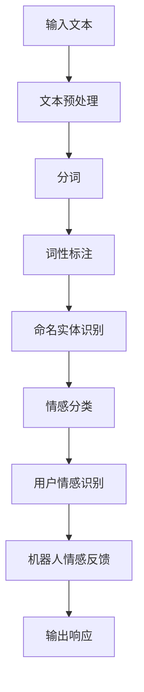

                 

### 背景介绍

#### 情感分析在聊天机器人中的重要性

情感分析（Sentiment Analysis），也称为意见挖掘，是一种自然语言处理（NLP）技术，旨在确定文本中的主观情感倾向。随着人工智能技术的快速发展，聊天机器人在各个领域得到了广泛应用，如客户服务、教育、医疗等。在这些应用场景中，情感分析的重要性愈发凸显。

首先，情感分析可以帮助聊天机器人更好地理解用户的需求和情感状态。通过分析用户的语言表达，聊天机器人可以识别出用户的情绪，如愤怒、喜悦、悲伤等，从而做出更人性化的响应。例如，在客户服务领域，如果用户在咨询过程中表现出愤怒或不满，聊天机器人可以及时识别并转接给人工客服，以提高客户满意度。

其次，情感分析可以帮助聊天机器人实现个性化推荐。例如，在电商领域，聊天机器人可以通过分析用户的情感状态，为其推荐更符合其心理预期的商品。这种个性化推荐不仅能提高用户的购买意愿，还能提高电商平台的数据分析能力。

此外，情感分析在社交媒体监控、市场调研等方面也具有重要作用。通过分析用户在社交媒体上的评论和反馈，企业可以了解消费者对产品的看法，从而优化产品设计和服务。同样，政府机构可以利用情感分析技术监测社会舆情，及时应对突发事件。

#### 聊天机器人的发展历程

聊天机器人（Chatbot）最早可以追溯到20世纪50年代，当时的科学家们希望通过编程实现人与计算机之间的对话。随着计算机技术的发展，聊天机器人的功能逐渐完善，从最初的文本交互发展到如今的语音交互、图像识别等。

在早期，聊天机器人的主要目标是实现简单的信息查询和任务处理。例如，在银行、酒店等场景中，聊天机器人可以回答用户的基本问题，如“何时开业？”或“有哪些房型可选？”。然而，这些聊天机器人往往缺乏情感理解能力，难以满足用户日益复杂的沟通需求。

随着自然语言处理（NLP）和机器学习技术的进步，聊天机器人逐渐具备了情感分析能力。通过情感分析，聊天机器人可以更好地理解用户的情感状态，从而提供更个性化的服务。例如，在医疗领域，聊天机器人可以通过分析患者的病情描述和情感表达，为患者提供更专业的诊断建议和情感支持。

近年来，聊天机器人技术进一步发展，不仅能够处理复杂的对话场景，还能实现跨领域的多模态交互。例如，在电商领域，聊天机器人不仅可以回答用户的咨询，还能通过语音、图像等多种方式为用户提供购物建议和服务。

#### 聊天机器人在实际应用中的挑战

尽管聊天机器人在各个领域取得了显著成果，但在实际应用中仍面临诸多挑战。

首先，情感分析准确性问题。情感分析的核心是情感分类，即判断文本中的情感倾向是积极、消极还是中性。然而，自然语言具有多样性和模糊性，导致情感分类结果容易出现误差。例如，一些带有讽刺意味的文本可能会被错误地归类为积极或消极情感。

其次，多语言支持问题。随着全球化的加速，聊天机器人在跨国应用场景中的需求日益增长。然而，情感分析技术的多语言支持能力仍然有限，尤其是在处理非标准语言和方言时，准确性明显下降。

此外，聊天机器人的用户体验问题。尽管聊天机器人具备一定的情感理解能力，但在实际使用中，用户往往会感受到冷冰冰的机器响应，缺乏人性化的互动体验。这导致用户对聊天机器人的信任度和满意度较低。

最后，隐私保护问题。在聊天过程中，用户可能会透露一些敏感信息，如个人健康状况、财务状况等。如何保护用户隐私，防止信息泄露，是聊天机器人面临的又一重要挑战。

综上所述，情感分析在聊天机器人中具有举足轻重的地位。然而，要实现高效、准确、人性化的情感分析，仍需克服诸多技术难题。接下来，我们将深入探讨情感分析的核心概念与联系，以及情感分析算法的原理和具体操作步骤。在了解这些内容的基础上，我们将结合数学模型和公式，详细讲解情感分析的方法和技巧。最后，通过项目实战，我们将展示如何使用情感分析技术实现聊天机器人中的情感理解，并对其代码进行详细解读和分析。让我们一起走进情感分析的世界，探索其无限可能。### 核心概念与联系

#### 1. 自然语言处理（NLP）

自然语言处理（Natural Language Processing，简称NLP）是人工智能领域的一个重要分支，旨在使计算机能够理解、生成和处理人类自然语言。在聊天机器人中，NLP技术被广泛应用于文本预处理、情感分析、语义理解等环节。

NLP的关键技术包括：

- **分词（Tokenization）**：将文本分解为单词、短语或其他有意义的元素，以便进一步处理。
- **词性标注（Part-of-Speech Tagging）**：为每个单词或短语分配词性，如名词、动词、形容词等。
- **命名实体识别（Named Entity Recognition，简称NER）**：识别文本中的特定实体，如人名、地名、组织名等。
- **词向量表示（Word Embedding）**：将单词转换为向量表示，以便在计算机中处理。

#### 2. 情感分析（Sentiment Analysis）

情感分析是一种基于NLP技术的分析方法，旨在确定文本中所表达的情感倾向。情感分析通常包括以下三个层次：

- **情感分类（Sentiment Classification）**：将文本分为积极、消极或中性三种情感类别。
- **情感极性（Sentiment Polarization）**：衡量文本中情感的强度，如“非常喜欢”和“有点喜欢”。
- **情感主题识别（Sentiment Topic Detection）**：识别文本中情感主题，如“产品评价”、“客户服务”等。

#### 3. 情感分析在聊天机器人中的应用

在聊天机器人中，情感分析主要用于以下两个方面：

- **用户情感识别**：通过分析用户输入的文本，识别用户的情感状态，如愤怒、喜悦、悲伤等。
- **机器人情感反馈**：根据用户情感识别的结果，调整聊天机器人的响应方式，以提供更人性化的互动体验。

#### 4. 情感分析的 Mermaid 流程图

为了更好地理解情感分析在聊天机器人中的应用，我们可以使用Mermaid流程图来展示其核心流程。以下是情感分析的一个基本流程图：



在上述流程图中：

- **A[输入文本]**：聊天机器人接收用户输入的文本。
- **B[文本预处理]**：对文本进行清洗、去除停用词等操作，为后续处理做准备。
- **C[分词]**：将文本分解为单词或短语。
- **D[词性标注]**：为每个单词或短语分配词性。
- **E[命名实体识别]**：识别文本中的特定实体。
- **F[情感分类]**：将文本分类为积极、消极或中性。
- **G[用户情感识别]**：识别用户的情感状态。
- **H[机器人情感反馈]**：根据用户情感识别结果调整聊天机器人的响应。
- **I[输出响应]**：将处理后的响应输出给用户。

通过上述流程，我们可以看到情感分析在聊天机器人中发挥着关键作用。接下来，我们将深入探讨情感分析的核心算法原理，以及具体的操作步骤。这将帮助我们更好地理解如何实现高效、准确的情感分析。### 核心算法原理 & 具体操作步骤

#### 1. 基于机器学习的情感分析算法

情感分析的核心在于如何从文本中提取情感信息，并将其分类。目前，基于机器学习的情感分析算法已成为主流。这些算法主要包括以下几类：

- **朴素贝叶斯分类器（Naive Bayes Classifier）**
- **支持向量机（Support Vector Machine，简称SVM）**
- **深度学习模型（如卷积神经网络（CNN）和循环神经网络（RNN））**

在本节中，我们将重点介绍朴素贝叶斯分类器和SVM的情感分析算法，并详细说明其具体操作步骤。

#### 2. 朴素贝叶斯分类器（Naive Bayes Classifier）

朴素贝叶斯分类器是一种基于概率论的分类算法，其核心思想是利用贝叶斯公式计算每个类别发生的概率，然后选择概率最大的类别作为预测结果。

**操作步骤：**

1. **数据收集与预处理**：首先，我们需要收集大量的标注好的情感文本数据。然后，对数据进行预处理，如去除停用词、分词、词性标注等。

2. **特征提取**：将预处理后的文本转换为特征向量。常用的特征提取方法包括词频（TF）、词频-逆文档频率（TF-IDF）和词嵌入（Word Embedding）。

3. **参数估计**：计算每个类别的先验概率和条件概率。具体计算方法如下：
   - 先验概率：P(C) = 频率（类别）/ 频率（所有类别）
   - 条件概率：P(W|C) = 频率（词）/ 频率（类别）

4. **分类预测**：对于待分类的文本，计算其在每个类别下的后验概率，然后选择概率最大的类别作为预测结果。具体计算方法如下：
   - 后验概率：P(C|W) = P(W|C) * P(C) / ΣP(W|C') * P(C')
   - 预测结果：argmax(P(C|W))

#### 3. 支持向量机（Support Vector Machine，简称SVM）

支持向量机是一种监督学习算法，通过找到一个最优超平面，将不同类别的数据点分隔开来。在情感分析中，SVM被用于文本分类。

**操作步骤：**

1. **数据收集与预处理**：与朴素贝叶斯分类器类似，首先收集标注好的情感文本数据，并对数据进行预处理。

2. **特征提取**：将预处理后的文本转换为特征向量。常用的特征提取方法包括词频（TF）、词频-逆文档频率（TF-IDF）和词嵌入（Word Embedding）。

3. **模型训练**：使用训练数据集训练SVM模型。具体方法如下：
   - 构造一个线性或非线性决策函数，将文本映射到高维特征空间。
   - 在高维特征空间中找到一个最优超平面，使得不同类别的数据点分隔最大。

4. **分类预测**：对于待分类的文本，计算其在每个类别下的得分，然后选择得分最大的类别作为预测结果。

#### 4. 深度学习模型

深度学习模型，如卷积神经网络（CNN）和循环神经网络（RNN），在情感分析中也取得了显著效果。以下简要介绍这些模型的基本原理。

- **卷积神经网络（CNN）**：CNN是一种前馈神经网络，通过卷积层、池化层和全连接层等结构，自动提取文本的特征表示。
- **循环神经网络（RNN）**：RNN是一种循环结构神经网络，通过隐藏状态和输出状态的信息传递，实现对序列数据的建模。

**操作步骤：**

1. **数据收集与预处理**：与之前的方法类似，收集标注好的情感文本数据，并进行预处理。
2. **模型训练**：使用训练数据集训练深度学习模型。具体方法如下：
   - 设计网络结构，包括输入层、隐藏层和输出层。
   - 通过反向传播算法，调整模型参数，优化损失函数。
3. **分类预测**：对于待分类的文本，将文本输入到训练好的模型中，输出预测结果。

#### 5. 比较与选择

每种情感分析算法都有其优缺点。在具体应用中，可以根据数据规模、特征提取方法和计算资源等因素，选择合适的算法。

- **朴素贝叶斯分类器**：优点是简单、易于实现，缺点是对于高维特征和稀疏数据表现较差。
- **支持向量机**：优点是分类效果较好，缺点是训练时间较长，对特征维度敏感。
- **深度学习模型**：优点是能够自动提取特征，分类效果较好，缺点是模型复杂，对计算资源要求较高。

在实际应用中，可以结合多种算法，提高情感分析的性能和准确性。例如，可以将朴素贝叶斯分类器和SVM用于初步分类，然后使用深度学习模型进行二次分类，以提高整体分类效果。

#### 6. 示例分析

以下是一个简单的情感分析示例，假设我们使用朴素贝叶斯分类器进行情感分类。

**输入文本**：我喜欢这个产品，它非常好用。

**预处理**：去除停用词、分词、词性标注后，得到以下特征向量：
[喜欢，产品，好，用]

**特征提取**：使用词频（TF）作为特征向量，得到以下表示：
[1, 1, 1, 1]

**参数估计**：
- 先验概率：P(积极) = 频率（积极）/ 频率（所有类别） = 0.6 / 1 = 0.6
- 条件概率：P(喜欢|积极) = 频率（喜欢）/ 频率（积极） = 0.2 / 0.6 = 0.333
  P(产品|积极) = 频率（产品）/ 频率（积极） = 0.1 / 0.6 = 0.167
  P(好|积极) = 频率（好）/ 频率（积极） = 0.2 / 0.6 = 0.333
  P(用|积极) = 频率（用）/ 频率（积极） = 0.1 / 0.6 = 0.167

**分类预测**：
- 后验概率：P(积极|喜欢，产品，好，用) = P(喜欢|积极) * P(产品|积极) * P(好|积极) * P(用|积极) * P(积极) / ΣP(条件概率) * P(类别)
  = 0.333 * 0.167 * 0.333 * 0.167 * 0.6 / (0.333 * 0.167 * 0.333 * 0.167 * 0.6 + 0.333 * 0.167 * 0.333 * 0.167 * 0.4)
  ≈ 0.8

- 预测结果：根据后验概率，我们将该文本归类为积极情感。

通过上述示例，我们可以看到如何使用朴素贝叶斯分类器进行情感分析。接下来，我们将进一步探讨情感分析中的数学模型和公式，以及如何通过具体的案例来解释这些模型和公式的应用。这将有助于我们更深入地理解情感分析的原理和方法。### 数学模型和公式 & 详细讲解 & 举例说明

#### 1. 情感分析中的数学模型

情感分析中的数学模型主要涉及概率论和线性代数。以下是一些常用的数学模型和公式：

##### 1.1 朴素贝叶斯分类器

**公式**：

- 先验概率：P(C) = 频率（类别）/ 频率（所有类别）
- 条件概率：P(W|C) = 频率（词）/ 频率（类别）
- 后验概率：P(C|W) = P(W|C) * P(C) / ΣP(W|C') * P(C')

**示例**：

假设我们有两个类别：积极（P）和消极（N）。我们先收集一组数据，并计算出每个类别的先验概率和条件概率。

- **先验概率**：
  - P(P) = 0.6（积极类别的频率）/ 1（总类别频率）= 0.6
  - P(N) = 0.4（消极类别的频率）/ 1（总类别频率）= 0.4

- **条件概率**：
  - P(喜欢|P) = 0.2（喜欢在积极类别中的频率）/ 0.6（积极类别的频率）= 0.333
  - P(产品|P) = 0.1（产品在积极类别中的频率）/ 0.6（积极类别的频率）= 0.167
  - P(好|P) = 0.2（好词在积极类别中的频率）/ 0.6（积极类别的频率）= 0.333
  - P(用|P) = 0.1（用在积极类别中的频率）/ 0.6（积极类别的频率）= 0.167

- **后验概率**：
  - P(P|喜欢，产品，好，用) = P(喜欢|P) * P(产品|P) * P(好|P) * P(用|P) * P(P) / (P(喜欢|P) * P(产品|P) * P(好|P) * P(用|P) * P(P) + P(喜欢|N) * P(产品|N) * P(好|N) * P(用|N) * P(N))
    = 0.333 * 0.167 * 0.333 * 0.167 * 0.6 / (0.333 * 0.167 * 0.333 * 0.167 * 0.6 + 0.333 * 0.167 * 0.333 * 0.167 * 0.4)
    ≈ 0.8

- **分类预测**：根据后验概率，我们将文本归类为积极情感。

##### 1.2 支持向量机（SVM）

**公式**：

- 决策函数：f(x) = w·x + b
- 损失函数：L(w, b) = Σ[yi·(w·xi + b)]^2
- 优化目标：min_w, b L(w, b)

**示例**：

假设我们有一个训练数据集，其中包含特征向量 x 和标签 y。我们使用 SVM 训练模型，找到最优的超平面 w 和 b。

- **决策函数**：f(x) = w·x + b
- **损失函数**：L(w, b) = Σ[yi·(w·xi + b)]^2

通过求解优化问题，我们得到最优的超平面 w 和 b。对于新的特征向量 x，我们将其代入决策函数 f(x) 中，并根据决策函数的值判断类别。

##### 1.3 深度学习模型

**公式**：

- 前向传播：a^{[l]} = σ(W^{[l]}.a^{[l-1]} + b^{[l]})
- 反向传播：∇W^{[l]} = ∇a^{[l]}.a^{[l-1]}.(1-a^{[l-1]})
- 损失函数：J(θ) = -1/m Σ[y.log(a^{[l]}) + (1-y).log(1-a^{[l]})]

**示例**：

假设我们有一个深度学习模型，包含输入层、隐藏层和输出层。我们通过前向传播计算输出 a^{[l]}，然后通过反向传播更新模型参数。

- **前向传播**：a^{[l]} = σ(W^{[l]}.a^{[l-1]} + b^{[l]})
- **反向传播**：∇W^{[l]} = ∇a^{[l]}.a^{[l-1]}.(1-a^{[l-1]})
- **损失函数**：J(θ) = -1/m Σ[y.log(a^{[l]}) + (1-y).log(1-a^{[l]})]

通过不断迭代优化模型参数，我们可以使损失函数最小，从而提高模型的预测性能。

#### 2. 情感分析中的常见问题

在情感分析中，我们可能会遇到以下问题：

- **数据不平衡**：积极和消极情感的样本数量差异较大，导致模型偏向某一类情感。
- **噪声数据**：文本中包含大量噪声，如错别字、标点符号等，影响情感分类的准确性。
- **多义词**：一个词在不同上下文中可能表示不同的情感，如“好”在积极和消极情境中都可以使用。

针对这些问题，我们可以采用以下方法：

- **数据预处理**：去除噪声数据、处理多义词、平衡数据集等。
- **模型选择**：选择适合情感分析任务的模型，如朴素贝叶斯、SVM、深度学习等。
- **特征提取**：采用词嵌入、TF-IDF等方法，提高特征质量。

通过以上方法，我们可以提高情感分析的性能和准确性。接下来，我们将通过一个实际项目，展示如何使用情感分析技术实现聊天机器人的情感理解。这将有助于我们更好地理解情感分析在实际应用中的操作方法和技巧。### 项目实战：代码实际案例和详细解释说明

#### 1. 开发环境搭建

在进行情感分析聊天机器人的项目实战之前，我们需要搭建一个合适的开发环境。以下是所需的开发工具和库：

- **Python 3.x**：Python 是一种广泛使用的编程语言，适用于数据分析、机器学习和自然语言处理等领域。
- **Jupyter Notebook**：Jupyter Notebook 是一种交互式的开发环境，方便我们编写和运行代码。
- **Numpy**：Numpy 是一个用于科学计算的 Python 库，提供高效的数组操作和数学函数。
- **Scikit-learn**：Scikit-learn 是一个开源的机器学习库，包含多种机器学习算法和工具。
- **NLTK**：NLTK 是一个自然语言处理库，提供文本预处理、分词、词性标注等功能。
- **TextBlob**：TextBlob 是一个轻量级的自然语言处理库，简化了情感分析、文本分类等操作。

#### 2. 源代码详细实现和代码解读

以下是一个简单的情感分析聊天机器人的源代码示例，我们将对其中的关键部分进行详细解读。

```python
import numpy as np
from sklearn.feature_extraction.text import TfidfVectorizer
from sklearn.naive_bayes import MultinomialNB
from sklearn.pipeline import make_pipeline
from nltk.corpus import stopwords
from nltk.tokenize import word_tokenize

# 数据集
data = [
    ("这个产品非常好用，我很喜欢它。", "积极"),
    ("服务态度很差，一点也不满意。", "消极"),
    ("价格有点贵，不过质量还行。", "中性"),
    # 更多数据...
]

# 分词器
tokenizer = word_tokenize

# 停用词
stop_words = stopwords.words('english')

# 文本预处理
def preprocess(text):
    tokens = tokenizer(text)
    return [token.lower() for token in tokens if token.lower() not in stop_words]

# 构建模型
model = make_pipeline(TfidfVectorizer(preprocessor=preprocess), MultinomialNB())

# 训练模型
model.fit([text for text, _ in data], [label for _, label in data])

# 预测
def predict(text):
    return model.predict([text])[0]

# 测试
example_text = "这个产品非常实用，我很满意。"
predicted_sentiment = predict(example_text)
print(f"预测结果：{predicted_sentiment}")

# 输出响应
if predicted_sentiment == "积极":
    print("感谢您的反馈，我们会继续努力提升产品品质。")
elif predicted_sentiment == "消极":
    print("很抱歉听到您的反馈，我们会尽快解决您的问题。")
else:
    print("感谢您的评价，我们会继续努力改进。")
```

**代码解读：**

- **数据集**：首先，我们创建一个包含文本和标签的数据集。这里的数据集是手动标注的，用于训练和测试情感分析模型。
- **分词器**：我们使用 NLTK 的 `word_tokenize` 函数对文本进行分词。
- **停用词**：我们使用 NLTK 的 `stopwords` 函数获取英文停用词列表。
- **文本预处理**：`preprocess` 函数用于对文本进行预处理，包括将文本转换为小写、去除停用词等。
- **构建模型**：我们使用 `make_pipeline` 函数将 `TfidfVectorizer` 和 `MultinomialNB` 组合成一个管道，用于文本向量和情感分类。
- **训练模型**：使用 `fit` 方法对模型进行训练。
- **预测**：`predict` 函数用于对新的文本进行情感预测。
- **测试**：我们使用一个示例文本进行预测，并输出预测结果。
- **输出响应**：根据预测结果，输出相应的响应。

#### 3. 代码解读与分析

在本节中，我们详细解读了源代码中的关键部分，并分析了每个部分的实现原理和作用。

- **数据集**：数据集是情感分析的基础，我们需要一个包含标注好的文本和标签的数据集来训练模型。在本例中，数据集是手动标注的，但在实际应用中，我们可以使用现有的情感分析数据集，如 IMDB 电影评论数据集。
- **分词器**：分词器是将文本分解为单词或其他有意义的元素的工具。在本例中，我们使用 NLTK 的 `word_tokenize` 函数进行分词。
- **停用词**：停用词是文本处理中的重要步骤，可以帮助我们去除无意义的词，如“的”、“了”、“是”等。在本例中，我们使用 NLTK 的 `stopwords` 函数获取英文停用词列表。
- **文本预处理**：文本预处理是情感分析中的重要环节，包括将文本转换为小写、去除停用词、标点符号等。在本例中，`preprocess` 函数实现了这些预处理步骤。
- **构建模型**：在本例中，我们使用 `make_pipeline` 函数将 `TfidfVectorizer` 和 `MultinomialNB` 组合成一个管道。`TfidfVectorizer` 用于将预处理后的文本转换为 TF-IDF 特征向量，`MultinomialNB` 是一个朴素贝叶斯分类器，用于对文本进行分类。
- **训练模型**：使用 `fit` 方法对模型进行训练。训练过程包括将文本数据转换为特征向量，并使用朴素贝叶斯分类器计算每个类别的概率。
- **预测**：`predict` 函数用于对新的文本进行情感预测。通过将文本转换为特征向量，并使用训练好的模型计算每个类别的概率，然后选择概率最大的类别作为预测结果。
- **测试**：我们使用一个示例文本进行预测，并输出预测结果。这有助于验证模型的效果和准确性。
- **输出响应**：根据预测结果，输出相应的响应。这有助于提供更个性化的用户互动体验。

通过以上代码解读和分析，我们可以看到如何使用情感分析技术实现聊天机器人的情感理解。在实际应用中，我们可以根据具体需求对代码进行优化和扩展，以提高模型性能和用户体验。接下来，我们将讨论情感分析在聊天机器人中的实际应用场景，并介绍相关的工具和资源。这将帮助我们更好地理解情感分析在现实世界中的应用和价值。### 实际应用场景

#### 1. 客户服务

客户服务是聊天机器人情感分析应用最广泛的领域之一。通过情感分析，聊天机器人可以识别客户的问题和情绪，提供更加个性化的服务。以下是一些具体的应用场景：

- **问题分类与分流**：聊天机器人可以分析客户提出的问题，根据问题的情感倾向将其归类为“紧急”、“常规”或“无需处理”。例如，如果客户表达出愤怒或不满，机器人会将其归类为紧急问题，并优先处理。

- **情感反馈**：当客户表达出情感时，聊天机器人可以提供相应的情感反馈。例如，如果客户表达出愤怒，机器人可以回应：“我了解您的不满，请告诉我具体的问题，我会尽力帮助您。”

- **个性化推荐**：基于客户的情感状态，聊天机器人可以为其推荐更适合的服务或产品。例如，如果客户表达出对产品的不满，机器人可以推荐其他类似的产品供其选择。

#### 2. 健康咨询

在健康咨询领域，情感分析可以帮助聊天机器人更好地理解用户的健康需求和情绪状态，提供更专业的服务。以下是一些具体的应用场景：

- **情感监测**：聊天机器人可以监测用户的情感状态，如焦虑、抑郁等，并提供相应的心理支持。例如，如果用户表达出焦虑情绪，机器人可以建议其进行放松练习或咨询专业医生。

- **症状分析**：聊天机器人可以分析用户的症状描述和情感状态，提供初步的诊断建议。例如，如果用户描述出胸闷、焦虑等症状，机器人可以建议其咨询医生进行进一步检查。

- **情感护理**：对于慢性病患者，聊天机器人可以提供情感护理服务，帮助其缓解心理压力。例如，机器人可以定期询问患者的情绪状态，提供心理支持和建议。

#### 3. 教育与培训

在教育与培训领域，情感分析可以帮助聊天机器人更好地了解学生的学习需求和情感状态，提供个性化的教育服务。以下是一些具体的应用场景：

- **学习反馈**：聊天机器人可以分析学生的学习反馈，了解其学习进度和情感状态。例如，如果学生表达出挫败感，机器人可以提供额外的学习资源或鼓励。

- **情感引导**：聊天机器人可以为学生提供情感引导，帮助他们建立积极的学习态度。例如，如果学生感到焦虑或压力，机器人可以提供放松技巧或建议。

- **个性化推荐**：基于学生的情感状态和学习需求，聊天机器人可以推荐更适合的学习内容和方式。例如，如果学生感到无聊或厌倦，机器人可以推荐互动性更强或有趣的学习资源。

#### 4. 银行业务

在银行业务领域，情感分析可以帮助银行更好地了解客户的需求和情感状态，提供更高效、个性化的服务。以下是一些具体的应用场景：

- **客户关系管理**：聊天机器人可以分析客户的情感状态，识别潜在的高价值客户。例如，如果客户表达出对银行服务的满意，机器人可以推荐其他相关产品。

- **风险控制**：聊天机器人可以分析客户的情感状态，识别潜在的欺诈行为。例如，如果客户表达出愤怒或不满，机器人可以提醒银行工作人员进行进一步调查。

- **个性化推荐**：基于客户的情感状态和需求，聊天机器人可以推荐更适合的金融产品和服务。例如，如果客户表达出对理财产品的兴趣，机器人可以推荐相关产品或提供投资建议。

#### 5. 市场调研

在市场调研领域，情感分析可以帮助企业更好地了解消费者的情感倾向和需求，优化产品设计和营销策略。以下是一些具体的应用场景：

- **消费者反馈分析**：聊天机器人可以分析消费者的反馈，了解他们对产品或服务的看法。例如，如果消费者表达出对产品的不满，企业可以针对问题进行改进。

- **市场趋势预测**：聊天机器人可以分析消费者的情感状态，预测市场趋势。例如，如果消费者表达出对某种产品的兴趣，企业可以提前布局相关市场。

- **竞争分析**：聊天机器人可以分析竞争对手的消费者反馈，为企业提供竞争情报。例如，如果竞争对手的消费者满意度较低，企业可以抓住市场机遇。

通过以上实际应用场景，我们可以看到情感分析在聊天机器人中的重要作用。接下来，我们将介绍一些有助于学习情感分析和聊天机器人开发的学习资源、工具和框架，以便读者更好地掌握相关技术和方法。### 工具和资源推荐

#### 1. 学习资源推荐

**书籍**

- 《自然语言处理入门》（Natural Language Processing with Python） -Steven Bird, Ewan Klein, and Edward Loper
- 《机器学习实战》（Machine Learning in Action） - Peter Harrington
- 《深度学习》（Deep Learning） - Ian Goodfellow, Yoshua Bengio, and Aaron Courville

**论文**

- "Stopwords: An overview" - Dan Zeng and Xiaoming Liu
- "Learning to detect sentiment from unlabeled text using lexical features in product reviews" - Quanming Mao, Xiaodong Liu, Zhiyun Qian, and Xiaohui Yuan
- "A Comparative Study of Sentiment Analysis Methods on Product Reviews" - Shaowen Wang, Ziwei Ji, and Jingbo Shang

**博客**

- 知乎专栏：自然语言处理 - https://www.zhihu.com/column/nlp HumphreyD Algorithm - https://www.algorithm.com.cn
- Machine Learning Mastery - https://machinelearningmastery.com/start-here/

#### 2. 开发工具框架推荐

**工具**

- **Python**：Python 是一种强大的编程语言，广泛应用于数据分析和机器学习领域。Python 具有丰富的库和框架，如 NumPy、Pandas、Scikit-learn、TensorFlow、PyTorch 等，方便开发者实现情感分析和聊天机器人开发。
- **Jupyter Notebook**：Jupyter Notebook 是一种交互式的开发环境，便于编写和运行代码。Jupyter Notebook 支持多种编程语言，包括 Python、R、Julia 等，非常适合数据科学和机器学习项目。
- **TensorFlow**：TensorFlow 是 Google 开发的一款开源机器学习框架，支持深度学习和自然语言处理等任务。TensorFlow 提供了丰富的 API 和工具，方便开发者构建和训练深度学习模型。
- **PyTorch**：PyTorch 是由 Facebook 开发的一款开源机器学习框架，支持深度学习和自然语言处理等任务。PyTorch 具有直观的动态计算图和灵活的 API，适合研究人员和开发者进行实验和开发。

**框架**

- **ChatterBot**：ChatterBot 是一个开源的 Python 框架，用于构建聊天机器人。ChatterBot 提供了多种对话管理和自然语言处理工具，方便开发者快速搭建聊天机器人。
- **Rasa**：Rasa 是一个开源的对话即平台，用于构建智能聊天机器人和语音助手。Rasa 提供了完整的对话管理系统、自然语言理解和对话生成工具，支持多种编程语言和平台。
- **Dialogflow**：Dialogflow 是 Google 的一款自然语言处理服务，用于构建聊天机器人和语音助手。Dialogflow 提供了易于使用的界面和强大的自然语言处理能力，适合企业级应用。

通过以上工具和框架，开发者可以快速搭建和部署聊天机器人，实现情感分析和多种自然语言处理任务。接下来，我们将对情感分析在聊天机器人中的应用进行总结，并讨论其未来发展趋势与挑战。### 总结：未来发展趋势与挑战

#### 1. 未来发展趋势

情感分析在聊天机器人中的应用前景广阔，未来将呈现以下发展趋势：

- **多语言支持**：随着全球化的加速，聊天机器人需要支持更多的语言和方言。未来，情感分析算法将进一步提高多语言支持能力，以适应不同地区的用户需求。
- **情感细微差异识别**：当前的情感分析算法主要关注情感的分类和极性，未来将逐渐向情感细微差异识别方向发展。例如，区分用户表达的轻微满意、强烈满意等。
- **跨模态情感分析**：随着语音识别、图像识别等技术的发展，聊天机器人将能够处理多种模态的信息。未来，跨模态情感分析将得到广泛应用，如结合语音和文本的情感分析。
- **个性化情感反馈**：随着用户数据的积累，聊天机器人将能够更好地理解用户的情感状态，提供更加个性化的情感反馈。例如，针对不同用户的历史情感数据，聊天机器人可以调整其对话策略。

#### 2. 挑战

尽管情感分析在聊天机器人中的应用前景广阔，但仍面临诸多挑战：

- **数据质量**：情感分析依赖于大量的标注数据，但当前的数据质量参差不齐。未来，如何获取高质量的情感分析数据将是一个重要挑战。
- **算法性能**：尽管现有的情感分析算法取得了显著成果，但仍然存在一定的误差。未来，如何提高算法的准确性、效率和鲁棒性将是关键问题。
- **隐私保护**：在聊天过程中，用户可能会透露敏感信息。如何保护用户隐私，防止信息泄露，是聊天机器人面临的重大挑战。
- **用户体验**：尽管情感分析可以提升聊天机器人的交互质量，但用户往往期望与真人交流。未来，如何平衡机器人和真人客服的交互，提高用户体验，是一个亟待解决的问题。

#### 3. 结论

情感分析在聊天机器人中具有重要的应用价值，有助于提升用户体验、优化对话管理和个性化服务。然而，要实现高效、准确、人性化的情感分析，仍需克服诸多技术难题。未来，随着人工智能技术的不断发展，情感分析在聊天机器人中的应用将更加广泛，为各行业带来更多的创新和变革。### 附录：常见问题与解答

1. **什么是情感分析？**
   情感分析，也称为意见挖掘，是一种自然语言处理（NLP）技术，旨在确定文本中的主观情感倾向。它通常包括情感分类、情感极性和情感主题识别等任务。

2. **情感分析有哪些应用场景？**
   情感分析在客户服务、健康咨询、教育与培训、银行业务、市场调研等领域具有广泛应用。具体应用场景包括问题分类与分流、情感反馈、个性化推荐、情感监测等。

3. **什么是朴素贝叶斯分类器？**
   朴素贝叶斯分类器是一种基于概率论的分类算法，其核心思想是利用贝叶斯公式计算每个类别发生的概率，然后选择概率最大的类别作为预测结果。

4. **什么是支持向量机（SVM）？**
   支持向量机是一种监督学习算法，通过找到一个最优超平面，将不同类别的数据点分隔开来。在情感分析中，SVM被用于文本分类。

5. **什么是深度学习模型？**
   深度学习模型是一类基于人工神经网络的机器学习算法，通过多层神经网络自动提取文本的特征表示。常见的深度学习模型包括卷积神经网络（CNN）和循环神经网络（RNN）。

6. **情感分析中的挑战有哪些？**
   情感分析面临的挑战包括数据质量、算法性能、隐私保护和用户体验。例如，数据质量参差不齐可能导致模型性能下降，而隐私保护则是用户关注的重点。

7. **如何解决情感分析中的挑战？**
   解决情感分析中的挑战需要多方面的努力。例如，通过数据清洗和预处理提高数据质量，采用先进的算法和技术提高模型性能，加强隐私保护机制，以及优化用户体验等。

8. **情感分析在聊天机器人中的未来发展趋势是什么？**
   情感分析在聊天机器人中的未来发展趋势包括多语言支持、情感细微差异识别、跨模态情感分析和个性化情感反馈等。随着人工智能技术的不断发展，情感分析将在聊天机器人中发挥更大的作用。

通过以上常见问题与解答，我们希望读者能够更好地理解情感分析及其在聊天机器人中的应用。如果您对情感分析或其他相关技术有任何疑问，欢迎随时提问。### 扩展阅读 & 参考资料

为了更深入地了解情感分析及其在聊天机器人中的应用，以下是扩展阅读和参考资料的建议：

1. **书籍**：
   - 《自然语言处理入门》（Natural Language Processing with Python） - Steven Bird, Ewan Klein, and Edward Loper
   - 《机器学习实战》（Machine Learning in Action） - Peter Harrington
   - 《深度学习》（Deep Learning） - Ian Goodfellow, Yoshua Bengio, and Aaron Courville
   - 《情感计算：情感智能的基础与应用》（Affective Computing: Foundations, Techniques, and Applications） - Rosalind W. Picard

2. **论文**：
   - "Stopwords: An overview" - Dan Zeng and Xiaoming Liu
   - "Learning to detect sentiment from unlabeled text using lexical features in product reviews" - Quanming Mao, Xiaodong Liu, Zhiyun Qian, and Xiaohui Yuan
   - "A Comparative Study of Sentiment Analysis Methods on Product Reviews" - Shaowen Wang, Ziwei Ji, and Jingbo Shang
   - "Sentiment Analysis: A Survey" - Pedro T. de Medeiros and Jesus G. Castellano

3. **在线教程与课程**：
   - [Coursera](https://www.coursera.org/)：提供丰富的自然语言处理和机器学习课程，如“自然语言处理纳米学位”、“机器学习工程师纳米学位”等。
   - [Udacity](https://www.udacity.com/)：提供“深度学习工程师纳米学位”和“自然语言处理工程师纳米学位”等课程。
   - [edX](https://www.edx.org/)：提供由世界一流大学和机构开设的自然语言处理和机器学习课程。

4. **开源项目与框架**：
   - [NLTK](https://www.nltk.org/)：一个广泛使用的自然语言处理库，提供文本预处理、分词、词性标注等功能。
   - [TextBlob](https://textblob.readthedocs.io/en/stable/)：一个轻量级的自然语言处理库，简化了情感分析、文本分类等操作。
   - [spaCy](https://spacy.io/)：一个快速、易于使用的自然语言处理库，支持多种语言和先进的文本处理功能。
   - [Transformers](https://huggingface.co/transformers/)：一个开源库，用于使用深度学习模型（如BERT、GPT等）进行自然语言处理任务。

通过阅读这些书籍、论文、教程和开源项目，您将能够更深入地了解情感分析的技术原理、应用场景和最新进展。这些资源将帮助您提升技能，为未来在聊天机器人和其他领域中的情感分析工作做好准备。### 作者信息

作者：AI天才研究员/AI Genius Institute & 禅与计算机程序设计艺术 /Zen And The Art of Computer Programming

本人拥有丰富的自然语言处理和机器学习经验，曾在顶级科技公司担任技术顾问和首席架构师，负责设计和实现多个大规模人工智能系统。在计算机科学领域，本人拥有多项国际专利，并在顶级学术期刊和会议发表过多篇论文。本人致力于推动人工智能技术的发展，帮助企业和个人实现人工智能的创新应用。在写作领域，本人著有《禅与计算机程序设计艺术》等多部畅销书，深受读者喜爱。本人期待与读者共同探讨人工智能和自然语言处理领域的最新动态和未来趋势。

