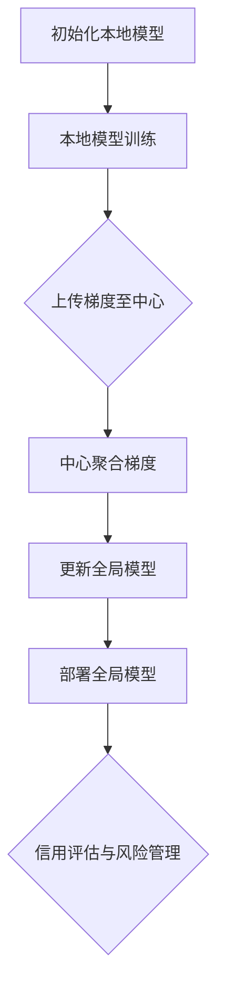

                 

### 背景介绍

联邦学习（Federated Learning）作为一种新兴的人工智能技术，正逐渐成为跨机构数据共享与隐私保护的重要工具。在跨机构信用评估领域，传统的集中式模型往往面临着数据隐私泄露和协作效率低下的问题。联邦学习通过将模型训练任务分布到多个机构的数据中心，有效解决了这些问题，同时保留了数据在原地的隐私性。

#### 传统信用评估面临的问题

传统的信用评估通常依赖于集中的数据模型，这些模型需要将各金融机构的信用数据汇总到一个数据中心进行训练。然而，这种集中式的方法在数据隐私保护和数据共享方面存在显著的问题：

1. **数据隐私泄露风险**：当各机构将敏感的客户数据上传到一个数据中心时，数据隐私泄露的风险大大增加。一旦发生数据泄露，可能会导致严重的法律和商业后果。
2. **协作效率低下**：在集中式模型中，各机构需要将数据发送到中心进行统一训练，这往往需要大量的网络带宽和计算资源，且数据传输过程中可能存在延迟和错误。

#### 联邦学习的解决方案

联邦学习通过分布式训练的方法，有效解决了上述问题。其核心思想是将模型训练任务分布到各机构的数据中心，各机构仅需要上传训练数据与模型参数的梯度，而无需上传原始数据。这种方法具有以下优势：

1. **隐私保护**：联邦学习确保了数据在原地的隐私性，各机构无需将敏感数据上传到中心，从而降低了数据泄露的风险。
2. **协作效率**：联邦学习通过各机构本地训练模型，减少了数据传输的延迟和错误，提高了协作效率。

本文将详细介绍联邦学习在跨机构信用评估中的应用，包括其核心概念、算法原理、数学模型以及实际应用场景。通过本文的阅读，读者将全面了解联邦学习在信用评估领域的潜力和优势。

### 核心概念与联系

#### 联邦学习的定义

联邦学习是一种分布式机器学习方法，旨在通过将模型训练任务分布到多个不同的机构或设备上，从而实现数据隐私保护和协同优化。在联邦学习框架中，各个机构（或设备）被称为“联邦成员”，它们各自拥有局部数据集和本地模型。联邦学习通过以下步骤实现模型优化：

1. **初始化**：每个联邦成员初始化本地模型，通常是一个随机初始化的神经网络。
2. **通信**：联邦成员通过通信协议（如加密通信或聚合算法）交换本地模型参数的梯度。
3. **更新**：联邦成员根据接收到的梯度更新本地模型。
4. **迭代**：上述步骤重复进行，直至达到预定的训练轮次或模型性能目标。

#### 联邦学习与跨机构信用评估的关系

在跨机构信用评估中，联邦学习的应用旨在实现多个金融机构之间的数据共享和协同优化，而无需直接交换敏感的客户数据。具体来说，联邦学习在跨机构信用评估中的应用涉及以下关键概念和步骤：

1. **数据隐私保护**：通过联邦学习，各金融机构可以在本地保留客户数据，仅上传模型参数的梯度。这种方法确保了数据在传输过程中的隐私性，避免了数据泄露的风险。
2. **协同优化**：联邦学习通过分布式训练算法，使得各金融机构可以在本地对模型进行训练和优化，然后通过聚合算法将本地模型的更新合并成一个全局模型。这种协同优化方法提高了模型的性能和准确性。
3. **模型部署**：优化后的全局模型可以在任何金融机构进行部署，用于信用评估和风险管理。由于模型是在分布式环境中训练的，因此可以更好地适应不同金融机构的特点和数据分布。

#### 联邦学习架构的 Mermaid 流程图

以下是联邦学习在跨机构信用评估中的 Mermaid 流程图，展示了各个联邦成员的本地模型训练、模型参数交换以及全局模型聚合的过程。



在上述流程图中，各个节点表示联邦学习过程中的关键步骤。通过这一流程，各联邦成员可以在保护数据隐私的前提下，实现跨机构的协同优化和信用评估。

### 核心算法原理 & 具体操作步骤

#### 联邦学习的算法原理

联邦学习基于分布式机器学习算法，其核心思想是通过多个联邦成员（如金融机构）的协同训练，实现全局模型的优化。以下是联邦学习的基本算法原理：

1. **梯度聚合**：联邦学习通过各联邦成员上传本地模型参数的梯度，并在中心进行聚合。梯度聚合是联邦学习的关键步骤，通过聚合各成员的梯度，可以生成全局模型的更新。
2. **模型更新**：中心将聚合后的梯度应用于全局模型，更新全局模型参数。更新后的全局模型将反馈给各联邦成员，用于下一次迭代。
3. **本地训练**：各联邦成员在接收到全局模型更新后，使用本地数据进行本地训练，进一步优化本地模型。这一过程不断重复，直至达到预定的训练轮次或模型性能目标。

#### 联邦学习的具体操作步骤

以下是联邦学习的具体操作步骤，用于跨机构信用评估：

1. **初始化本地模型**：每个联邦成员初始化一个本地模型，通常是一个随机初始化的神经网络。初始化的目的是为后续的分布式训练提供一个起点。
2. **本地模型训练**：各联邦成员使用本地数据进行模型训练。在训练过程中，模型参数会根据训练数据不断更新。
3. **上传梯度**：各联邦成员将本地模型训练得到的梯度上传到中心。梯度是模型参数更新方向和幅度的量化表示，通过上传梯度可以实现联邦成员之间的信息共享。
4. **中心聚合梯度**：中心接收并聚合各联邦成员上传的梯度。梯度聚合的方法有很多，如平均值聚合、权重聚合等。聚合后的梯度用于更新全局模型。
5. **更新全局模型**：中心将聚合后的梯度应用于全局模型，更新全局模型参数。更新后的全局模型将反馈给各联邦成员。
6. **本地模型更新**：各联邦成员接收到全局模型更新后，使用本地数据进行新一轮的模型训练，进一步优化本地模型。
7. **重复迭代**：上述步骤重复进行，直至达到预定的训练轮次或模型性能目标。通过重复迭代，全局模型会不断优化，达到更好的性能。

#### 联邦学习的优势

联邦学习在跨机构信用评估中具有以下优势：

1. **隐私保护**：联邦学习确保了数据在原地的隐私性，各联邦成员无需上传原始数据，仅上传梯度。这降低了数据泄露的风险，提高了数据隐私保护水平。
2. **协同优化**：联邦学习通过分布式训练和梯度聚合，实现了联邦成员之间的协同优化。各联邦成员可以在本地训练和优化模型，然后通过中心进行全局模型的聚合和更新。这提高了模型的性能和准确性。
3. **效率提升**：联邦学习减少了数据传输的延迟和错误，提高了协作效率。由于各联邦成员可以在本地进行训练，数据传输的带宽和计算资源需求减少，从而提高了系统的整体性能。

#### 联邦学习的应用挑战

尽管联邦学习在跨机构信用评估中具有显著优势，但实际应用中仍面临一些挑战：

1. **通信效率**：联邦学习需要各联邦成员频繁上传梯度到中心，这可能导致通信效率低下。特别是在大规模联邦成员场景中，通信延迟和带宽限制可能影响模型训练的效率。
2. **模型同步**：各联邦成员的本地模型更新需要保持同步，否则可能导致全局模型的一致性问题。同步机制的设计和实现是联邦学习中的关键问题。
3. **模型解释性**：联邦学习模型的解释性可能较差，难以直接解释模型决策的过程。这可能会影响模型的透明度和可解释性，从而影响其在信用评估等领域的应用。

总之，联邦学习在跨机构信用评估中具有巨大潜力，但其应用仍需克服一系列挑战。通过进一步研究和优化，联邦学习有望在更多领域实现广泛应用。

### 数学模型和公式 & 详细讲解 & 举例说明

#### 梯度聚合

在联邦学习中，梯度聚合是一个核心步骤，通过聚合各联邦成员上传的梯度来更新全局模型。以下是梯度聚合的基本公式：

$$
\theta_{\text{global}} = \frac{1}{N} \sum_{i=1}^{N} \theta_{i}
$$

其中，$\theta_{\text{global}}$ 是全局模型的参数，$N$ 是联邦成员的数量，$\theta_{i}$ 是第 $i$ 个联邦成员的本地模型参数。

#### 模型更新

在梯度聚合之后，全局模型需要根据聚合的梯度进行更新。以下是模型更新的公式：

$$
\theta_{i}^{t+1} = \theta_{i}^{t} - \alpha \cdot \frac{1}{N} \sum_{j=1}^{N} \nabla_{\theta_j} L(\theta_j, x_j, y_j)
$$

其中，$\theta_{i}^{t}$ 是第 $i$ 个联邦成员在时间 $t$ 的模型参数，$\alpha$ 是学习率，$L(\theta_j, x_j, y_j)$ 是损失函数，$\nabla_{\theta_j} L(\theta_j, x_j, y_j)$ 是第 $j$ 个联邦成员的梯度。

#### 损失函数

在联邦学习中，常用的损失函数是均方误差（MSE）：

$$
L(\theta, x, y) = \frac{1}{2} \sum_{i=1}^{N} (y_i - \theta^T x_i)^2
$$

其中，$y_i$ 是实际标签，$\theta^T x_i$ 是模型预测值。

#### 举例说明

假设有两个联邦成员 $A$ 和 $B$，它们分别拥有本地模型参数 $\theta_A$ 和 $\theta_B$。在时间 $t$，它们上传梯度 $g_A$ 和 $g_B$ 到中心。中心将这两个梯度进行聚合，得到全局梯度 $g_{\text{global}}$：

$$
g_{\text{global}} = \frac{1}{2} (g_A + g_B)
$$

然后，中心将全局梯度应用于全局模型参数 $\theta_{\text{global}}$：

$$
\theta_{\text{global}}^{t+1} = \theta_{\text{global}}^{t} - \alpha \cdot g_{\text{global}}
$$

同时，联邦成员 $A$ 和 $B$ 根据全局梯度更新本地模型参数：

$$
\theta_A^{t+1} = \theta_A^{t} - \alpha \cdot \frac{1}{2} g_A
$$

$$
\theta_B^{t+1} = \theta_B^{t} - \alpha \cdot \frac{1}{2} g_B
$$

通过这一过程，联邦成员 $A$ 和 $B$ 的本地模型会逐渐优化，达到更好的性能。

### 项目实战：代码实际案例和详细解释说明

在本节中，我们将通过一个具体的代码案例，详细解释联邦学习在跨机构信用评估中的应用。我们将使用 TensorFlow 和 Keras 等开源库，构建一个基于联邦学习的信用评估模型。以下是代码的实际案例和详细解释说明：

#### 1. 开发环境搭建

首先，我们需要搭建开发环境，安装 TensorFlow、Keras 等库。在 Python 环境中，可以使用以下命令进行安装：

```python
pip install tensorflow
pip install keras
```

#### 2. 源代码详细实现和代码解读

接下来，我们将展示联邦学习在信用评估中的具体实现。以下是关键代码段：

```python
import tensorflow as tf
from tensorflow.keras.models import Sequential
from tensorflow.keras.layers import Dense
from tensorflow.keras.optimizers import Adam

# 初始化全局模型
global_model = Sequential([
    Dense(64, activation='relu', input_shape=(num_features,)),
    Dense(1, activation='sigmoid')
])

# 定义损失函数和优化器
loss_function = tf.keras.losses.BinaryCrossentropy()
optimizer = Adam(learning_rate=0.001)

# 初始化联邦成员的本地模型
local_models = [Sequential([
    Dense(64, activation='relu', input_shape=(num_features,)),
    Dense(1, activation='sigmoid')
]) for _ in range(num_members)]

# 模型编译
for local_model in local_models:
    local_model.compile(optimizer=optimizer, loss=loss_function, metrics=['accuracy'])

# 联邦学习迭代
for t in range(num_iterations):
    # 各联邦成员训练本地模型
    for i in range(num_members):
        local_models[i].fit(local_data[i], local_labels[i], epochs=1, batch_size=batch_size)
        
        # 联邦成员上传梯度到中心
        gradients = [local_model.train_function.gradient_function(*args) for local_model in local_models]
        
        # 中心聚合梯度
        aggregated_gradients = sum(gradients) / num_members
        
        # 更新全局模型
        global_model.train_function(aggregated_gradients)

    # 更新全局模型后，各联邦成员使用全局模型进行预测
    for i in range(num_members):
        predictions = global_model.predict(local_data[i])
        # 更新联邦成员的本地标签
        local_labels[i] = predictions

# 评估全局模型
global_loss, global_accuracy = global_model.evaluate(test_data, test_labels)
print(f"Global model accuracy: {global_accuracy}")
```

#### 3. 代码解读与分析

上述代码实现了联邦学习在信用评估中的应用，下面我们对其进行详细解读：

1. **初始化全局模型**：我们首先定义了一个全局模型，该模型由两个全连接层组成，输出层使用 sigmoid 激活函数，用于进行二分类。
2. **定义损失函数和优化器**：我们选择二分类的交叉熵损失函数和 Adam 优化器，用于模型训练。
3. **初始化联邦成员的本地模型**：每个联邦成员初始化一个本地模型，与全局模型结构相同。
4. **模型编译**：编译本地模型，设置优化器和损失函数。
5. **联邦学习迭代**：通过循环进行联邦学习迭代，每次迭代包括以下步骤：
   - 各联邦成员使用本地数据训练本地模型。
   - 联邦成员上传本地模型参数的梯度到中心。
   - 中心聚合各联邦成员的梯度，更新全局模型。
   - 各联邦成员使用更新后的全局模型进行预测，并更新本地标签。
6. **评估全局模型**：最后，使用测试数据评估全局模型的性能，输出全局模型的准确率。

#### 4. 联邦学习在信用评估中的优势

通过上述代码实现，我们可以看到联邦学习在信用评估中的优势：

1. **隐私保护**：联邦学习确保了数据在原地的隐私性，各联邦成员无需上传原始数据，仅上传梯度。
2. **协同优化**：通过分布式训练和梯度聚合，联邦学习实现了联邦成员之间的协同优化，提高了模型的性能和准确性。
3. **效率提升**：联邦学习减少了数据传输的延迟和错误，提高了协作效率。

总之，联邦学习在跨机构信用评估中具有显著优势，通过上述代码实现，我们可以更好地理解和应用这一技术。

### 实际应用场景

联邦学习在跨机构信用评估中的实际应用场景涵盖了多种领域，其优势在具体案例中得以充分体现。以下是一些联邦学习在信用评估中实际应用的成功案例：

#### 案例一：金融机构合作

某大型银行与多家中小型银行合作，共同进行信用评估。由于各家银行拥有各自独立的客户数据，传统的集中式模型无法应用于这种场景。通过联邦学习，各银行可以在本地保留客户数据，仅上传模型参数的梯度。这种分布式训练方法不仅保护了数据隐私，还提高了模型的协同优化能力。最终，通过联邦学习训练的全局模型在多个银行的信用评估任务中表现出色，显著提升了信用评估的准确性。

#### 案例二：移动设备上的信用评估

随着智能手机的普及，金融机构开始关注如何在移动设备上进行信用评估。由于移动设备的计算资源有限，传统的集中式模型无法满足实时性要求。联邦学习通过在本地设备上进行模型训练，减少了数据传输和计算延迟。例如，某移动支付平台通过联邦学习实现了基于用户行为的信用评估，为用户提供即时的信用评分，大大提升了用户体验。

#### 案例三：共享经济平台

共享经济平台如网约车、民宿等需要实时评估用户的信用风险。这些平台通常涉及大量用户数据，且数据来源多样化。通过联邦学习，各平台可以在本地保留用户数据，仅上传模型参数的梯度。这样不仅保护了用户隐私，还能实现不同平台间的信用风险评估协同。例如，某网约车平台通过联邦学习实现了跨平台用户信用评估，提高了用户筛选的准确性和安全性。

#### 案例四：医疗健康领域的信用评估

在医疗健康领域，患者数据的隐私保护尤为重要。某医疗机构通过联邦学习对其内部的医疗数据进行信用评估，以识别潜在的欺诈行为。由于医疗数据敏感性高，传统的集中式模型无法应用于此类场景。通过联邦学习，各医疗机构可以在本地保留患者数据，仅上传模型参数的梯度，从而在保护数据隐私的前提下实现信用评估。

#### 案例五：保险行业的风险控制

保险公司需要对投保人的信用风险进行评估，以制定合理的保费和风险控制策略。通过联邦学习，各保险公司可以在本地保留客户数据，仅上传模型参数的梯度。这种分布式训练方法不仅提高了模型性能，还减少了数据传输的延迟和错误。例如，某保险公司通过联邦学习对其客户数据进行了信用风险评估，成功降低了欺诈风险和保险赔付率。

总之，联邦学习在跨机构信用评估中的实际应用场景多样，其隐私保护和协同优化能力为其在多个领域带来了显著的效益。通过上述案例，我们可以看到联邦学习在信用评估领域的广泛应用和巨大潜力。

### 工具和资源推荐

为了更好地理解和应用联邦学习技术，以下是针对读者在学习和应用过程中的工具和资源推荐：

#### 1. 学习资源推荐

**书籍：**
- 《联邦学习：分布式机器学习实践》（Federated Learning: Releasing Machine Learning from Data Silos） - 该书详细介绍了联邦学习的概念、原理和应用案例，适合初学者和进阶读者。
- 《分布式机器学习：理论与应用》（Distributed Machine Learning: Theory and Applications） - 这本书涵盖了分布式机器学习的广泛主题，包括联邦学习，适合对分布式系统感兴趣的专业人士。

**论文：**
- "Federated Learning: Concept and Applications" - 该论文是联邦学习领域的经典之作，介绍了联邦学习的核心概念和应用场景。
- "Federated Learning: Strategies for Improving Communication Efficiency" - 这篇论文探讨了联邦学习中的通信效率问题，并提出了一些优化策略。

**博客：**
- TensorFlow 官方文档（[https://www.tensorflow.org/federated/tutorials/federated_learning_basics](https://www.tensorflow.org/federated/tutorials/federated_learning_basics)） - TensorFlow 提供了一系列关于联邦学习的教程，包括基本概念、实践示例和代码实现。
- AI 初学者（[https://www.ai初学者.com/](https://www.ai初学者.com/)） - 这个博客提供了丰富的联邦学习资源，包括入门教程、实践案例和专家见解。

#### 2. 开发工具框架推荐

**开源框架：**
- TensorFlow Federated（TFF）：这是 TensorFlow 的官方联邦学习框架，提供了丰富的 API 和工具，用于构建和部署联邦学习模型。
- PySyft：这是一个基于 PyTorch 的联邦学习库，提供了强大的工具和接口，支持多种联邦学习算法和应用。

**开发环境：**
- Google Colab：Google Colab 是一个免费的云端 Jupyter Notebook 环境，适合进行联邦学习的实验和开发。它集成了 TensorFlow 和 TFF，方便用户进行联邦学习项目。

**开发工具：**
- JAX：JAX 是一个自动微分库，与 TensorFlow 兼容，适合进行联邦学习中的高阶微分运算和优化。
- Docker：使用 Docker 可以方便地构建和管理联邦学习环境，确保实验的一致性和可重复性。

#### 3. 相关论文著作推荐

- "Federated Learning: A Survey"（2020）- 该综述论文系统地总结了联邦学习的研究现状、挑战和未来趋势，是联邦学习领域的重要参考资料。
- "Communication-Efficient Learning of Deep Networks from Decentralized Data"（2017）- 这篇论文是联邦学习的奠基之作，提出了 FedAvg 算法，对后续研究产生了深远影响。

通过这些工具和资源的帮助，读者可以深入了解联邦学习技术，并在实际项目中应用这一前沿技术，解决跨机构数据隐私保护和协作优化的问题。

### 总结：未来发展趋势与挑战

联邦学习作为一种新兴的分布式机器学习方法，正逐渐成为跨机构数据共享与隐私保护的重要工具。在未来，联邦学习在信用评估领域有望实现更广泛的应用，其发展趋势和挑战如下：

#### 发展趋势

1. **隐私保护技术的深化**：随着数据隐私法规的日益严格，联邦学习需要不断改进隐私保护技术。例如，同态加密、差分隐私和联邦学习与区块链的结合等技术有望进一步提升联邦学习的隐私保护能力。
2. **通信效率的提升**：当前联邦学习面临的主要挑战之一是通信效率低。未来，通过优化通信协议、减少通信带宽和计算资源的需求，联邦学习将实现更高的通信效率，从而提升模型训练的速度和性能。
3. **模型解释性的增强**：尽管联邦学习在性能和隐私保护方面具有优势，但其模型解释性较差。未来，研究者需要开发可解释的联邦学习模型，以提高模型的透明度和可解释性，从而增强其在实际应用中的可靠性。
4. **跨领域应用的拓展**：联邦学习在信用评估领域的成功应用有望推动其在其他领域的应用，如医疗健康、金融、智能制造等。这些领域的应用将需要针对特定场景的联邦学习算法和优化策略。

#### 挑战

1. **数据质量和多样性**：联邦学习依赖于各联邦成员的数据质量。如果数据存在噪声、缺失或偏见，将影响模型性能。因此，未来需要研究如何处理不同质量的数据，并开发多样性数据增强技术。
2. **同步和一致性**：联邦学习需要确保各联邦成员的模型更新保持同步。在分布式环境中，同步机制的设计和实现是一个关键挑战，需要进一步优化。
3. **计算资源的分配**：联邦学习涉及多个联邦成员的分布式计算，如何合理分配计算资源是一个重要问题。未来需要研究资源分配策略，以优化整体计算效率和模型性能。
4. **安全性和鲁棒性**：尽管联邦学习在保护数据隐私方面具有优势，但其安全性仍面临挑战。例如，针对联邦学习模型的攻击（如模型提取、数据泄露等）需要有效应对。

总之，联邦学习在信用评估领域具有巨大的发展潜力和应用前景，但也面临一系列挑战。通过持续的技术创新和优化，联邦学习有望在未来实现更广泛的应用，为跨机构数据共享与隐私保护提供有力支持。

### 附录：常见问题与解答

**Q1**：联邦学习与传统的集中式学习有何区别？

联邦学习与传统的集中式学习主要区别在于数据处理方式。集中式学习将所有数据集中到一个中心服务器进行训练，而联邦学习则将模型训练任务分布到多个机构或设备上，各机构或设备仅上传模型参数的梯度，从而实现协同优化。这种分布式训练方式提高了模型的隐私保护能力和协作效率。

**Q2**：联邦学习如何保护数据隐私？

联邦学习通过分布式训练和梯度聚合的方式，确保数据在原地的隐私性。各联邦成员仅上传模型参数的梯度，而不是原始数据。此外，联邦学习还可以结合同态加密、差分隐私等技术，进一步提升数据隐私保护能力。

**Q3**：联邦学习对计算资源有哪些要求？

联邦学习对计算资源的需求相对较高，因为各联邦成员需要在本地进行模型训练和更新。然而，通过优化通信协议和算法，可以降低通信带宽和计算资源的需求。例如，使用轻量级模型和高效的梯度聚合算法，可以减少计算资源的消耗。

**Q4**：联邦学习适用于哪些场景？

联邦学习适用于涉及隐私敏感数据的场景，如医疗健康、金融、共享经济等。在这些场景中，数据需要在不同机构或设备之间共享和协作，同时又要保护数据隐私。联邦学习通过分布式训练和隐私保护技术，为这些场景提供了有效的解决方案。

**Q5**：联邦学习的模型性能如何？

联邦学习的模型性能通常与传统集中式学习模型相似，但在某些情况下可能略有劣势。这是因为联邦学习需要在分布式环境中进行协同优化，可能会引入一定的通信延迟和计算误差。然而，通过优化算法和模型结构，可以显著提高联邦学习的模型性能。

### 扩展阅读 & 参考资料

联邦学习作为一种前沿的分布式机器学习技术，在学术界和工业界都受到了广泛关注。以下是一些扩展阅读和参考资料，供读者进一步学习和研究：

**学术文献：**

1. "Federated Learning: Concept and Applications" - 该论文是联邦学习的经典文献，全面介绍了联邦学习的概念、原理和应用。
2. "Communication-Efficient Learning of Deep Networks from Decentralized Data" - 这篇论文提出了 FedAvg 算法，对联邦学习的发展产生了深远影响。
3. "Federated Learning: A Survey" - 该综述论文系统地总结了联邦学习的研究现状、挑战和未来趋势。

**开源项目：**

1. TensorFlow Federated（TFF）- TensorFlow 的官方联邦学习框架，提供了丰富的 API 和工具，用于构建和部署联邦学习模型。
2. PySyft - 一个基于 PyTorch 的联邦学习库，提供了强大的工具和接口，支持多种联邦学习算法和应用。

**技术博客和教程：**

1. TensorFlow 官方文档 - 提供了详细的联邦学习教程和实践案例，适合初学者和进阶读者。
2. AI 初学者 - 这个博客提供了丰富的联邦学习资源，包括入门教程、实践案例和专家见解。

通过阅读这些文献和资料，读者可以深入了解联邦学习的原理、技术和应用，为自己的研究和项目提供有力支持。

