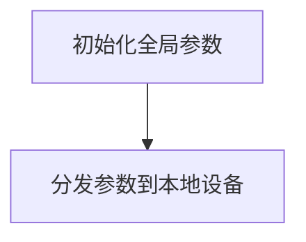
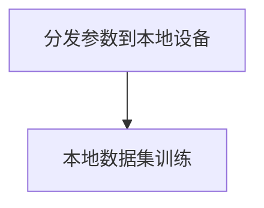
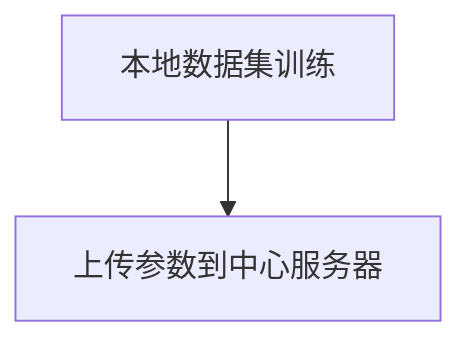
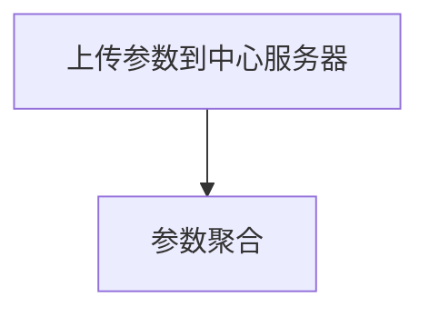
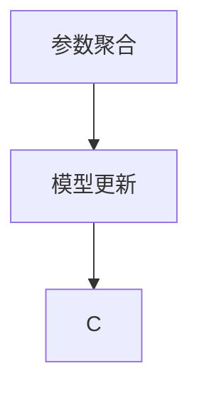
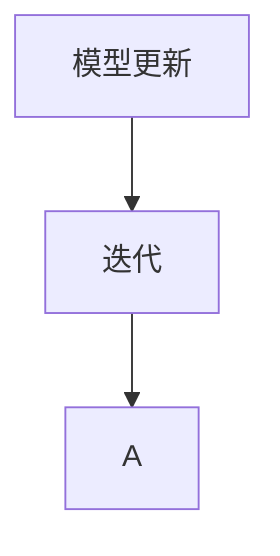

                 

### 背景介绍

联邦学习（Federated Learning）作为一种新兴的机器学习方法，近年来在跨行业数据协作中逐渐崭露头角。随着大数据时代的到来，数据隐私保护问题日益严峻，如何在保证数据隐私的同时进行跨行业的数据协作成为了一个亟待解决的问题。传统的集中式学习方法由于需要将所有数据集中到一个中心服务器上，从而导致了数据泄露和隐私泄露的风险。而联邦学习通过在各个数据拥有者本地进行模型训练，并将训练得到的本地模型参数聚合起来，从而避免了将数据上传到中心服务器的需求，有效解决了数据隐私保护的问题。

跨行业数据协作是指不同行业之间通过数据共享和协作，实现各自业务目标的一种合作方式。这种方式在医疗、金融、交通、能源等多个领域都得到了广泛应用。例如，在医疗领域，不同医院可以通过共享病历数据，共同进行疾病诊断和预测；在金融领域，不同银行可以通过共享客户交易数据，共同进行欺诈检测；在交通领域，不同城市可以通过共享交通数据，共同进行交通流量预测和优化。然而，这些跨行业数据协作都面临着数据隐私保护的问题，如何在不泄露数据隐私的前提下实现数据协作，是当前的一个研究热点。

本文旨在探讨联邦学习在跨行业数据协作中的隐私保护机制。首先，我们将介绍联邦学习的核心概念和基本原理，包括联邦学习的工作流程、隐私保护机制和优势。然后，我们将分析联邦学习在跨行业数据协作中的应用场景，以及如何通过联邦学习实现隐私保护。接下来，我们将详细讲解联邦学习中的核心算法原理，包括模型更新、参数聚合和隐私保护算法。此外，我们将通过一个实际案例，展示联邦学习在跨行业数据协作中的具体应用，并对其中的关键技术和实现细节进行详细解读。最后，我们将探讨联邦学习在跨行业数据协作中的实际应用场景，以及未来的发展趋势和挑战。

通过本文的介绍，读者可以了解到联邦学习在跨行业数据协作中的隐私保护机制，以及如何利用联邦学习实现数据隐私保护。这将有助于推动联邦学习在跨行业数据协作中的应用，为各行业的数据共享和协作提供一种有效的解决方案。

### 核心概念与联系

#### 联邦学习的基本原理

联邦学习是一种分布式机器学习方法，其核心思想是在多个数据拥有者（通常是不同的设备或组织）的本地设备上独立训练模型，并通过参数聚合的方式共享模型的更新信息。这种分布式训练方式避免了将所有数据上传到中心服务器，从而在保护数据隐私的同时，实现了数据的协同学习。

联邦学习的基本原理可以概括为以下几个关键步骤：

1. **初始化**：在联邦学习开始之前，首先在各个本地设备上初始化全局模型参数。这些全局参数可以作为初始模型，并在本地设备上进行训练。

2. **本地训练**：每个本地设备使用自己的本地数据集，对全局模型进行本地训练。在训练过程中，设备会根据本地数据集的特点，调整模型参数，从而提高模型的本地表现。

3. **参数上传**：每个本地设备将更新后的模型参数上传到中心服务器。这个上传过程可以是实时的，也可以是周期性的，取决于具体的联邦学习协议。

4. **参数聚合**：中心服务器接收到各个本地设备的更新参数后，对这些参数进行聚合，生成全局模型的更新参数。

5. **模型更新**：将聚合后的全局更新参数发送回各个本地设备，每个设备使用新的全局参数继续进行本地训练。

6. **重复迭代**：上述步骤反复进行，每次迭代都会使得全局模型更加接近最优解，同时各个本地设备也不断优化自己的模型。

#### 联邦学习的隐私保护机制

联邦学习的隐私保护机制主要依托于其分布式训练的特点。具体来说，以下是几个关键的隐私保护机制：

1. **数据本地化**：联邦学习要求每个本地设备使用自己的数据集进行训练，避免了将所有数据上传到中心服务器。这种方式有效降低了数据泄露的风险。

2. **差分隐私**：联邦学习可以结合差分隐私（Differential Privacy）技术，确保在聚合参数时，无法通过分析参数推断出任何单个设备的本地数据。差分隐私通过在计算过程中添加噪声，使得外部攻击者无法准确获取本地数据。

3. **模型加密**：联邦学习可以采用模型加密技术，如同态加密（Homomorphic Encryption），使得在数据传输和聚合过程中，模型参数可以被加密保护，从而防止数据在传输过程中被窃取。

4. **联邦学习协议**：联邦学习采用了多种协议来保证系统的安全性和隐私性，如安全聚合协议、差分隐私协议和加密通信协议等。

#### 联邦学习的优势

联邦学习在跨行业数据协作中具有以下几个显著优势：

1. **隐私保护**：通过数据本地化和差分隐私技术，联邦学习有效保护了数据隐私，适用于需要严格隐私保护的场景。

2. **数据可用性**：联邦学习允许不同组织保留自己的数据，不进行共享，从而保障了数据所有权和数据的可用性。

3. **分布式计算**：联邦学习可以在多个设备上进行并行计算，提高了模型的训练速度和效率。

4. **灵活性和适应性**：联邦学习适用于各种规模的数据集和模型，可以灵活地适应不同的应用场景。

#### 联邦学习与其他分布式学习方法的比较

与其他分布式学习方法（如分布式批量学习、MapReduce等）相比，联邦学习具有以下特点：

1. **数据隐私保护**：联邦学习更注重数据隐私保护，而其他方法通常不考虑数据隐私问题。

2. **模型协同优化**：联邦学习通过参数聚合实现全局模型的协同优化，而其他方法通常仅关注局部优化。

3. **计算开销**：联邦学习需要定期进行参数上传和聚合，计算开销相对较大，而其他方法通常计算开销较小。

综上所述，联邦学习通过其分布式训练和隐私保护机制，在跨行业数据协作中具有广阔的应用前景。接下来，我们将深入探讨联邦学习在具体应用场景中的实现细节和实际效果。

## 2.1 联邦学习的工作流程

联邦学习的工作流程可以分为以下几个关键阶段，每个阶段都有其特定的操作和目的，以确保数据隐私的保护和模型性能的提升。

#### 初始化阶段

在联邦学习开始之前，首先需要初始化全局模型参数。这一过程通常在中心服务器上进行，生成一组初始参数，并将这些参数分发到所有参与训练的本地设备。初始化阶段的主要任务是确保所有设备具有相同的起点，从而为后续的协同训练奠定基础。在这个过程中，初始参数可以是随机生成的，也可以是基于已有模型的预训练参数。



#### 本地训练阶段

初始化完成后，每个本地设备将使用自己的本地数据集，在初始化参数的基础上进行本地训练。本地训练阶段是联邦学习过程中最为关键的一步，因为它直接决定了模型的本地性能。在这个阶段，设备会根据本地数据的特点，调整模型参数，从而优化模型在本地数据集上的表现。本地训练可以是单步训练，也可以是批量训练，具体取决于训练算法和设备资源。



#### 参数上传阶段

在完成本地训练后，每个本地设备需要将更新后的模型参数上传到中心服务器。上传的过程可以是实时的，也可以是周期性的，这取决于联邦学习协议的设计。参数上传的目的是让中心服务器收集各个设备的训练结果，以便进行后续的参数聚合。



#### 参数聚合阶段

中心服务器接收到来自各个本地设备的更新参数后，将它们进行聚合，生成全局模型的更新参数。聚合过程可以采用多种算法，如平均值聚合、加权平均值聚合等。参数聚合的目的是将各个设备的本地训练结果集中起来，形成一个全局优化模型。



#### 模型更新阶段

在完成参数聚合后，中心服务器将新的全局参数发送回所有本地设备。每个设备使用新的全局参数继续进行本地训练，这个过程称为模型更新。模型更新是联邦学习过程中不断循环的过程，每次更新都会使得全局模型更加接近最优解。



#### 迭代阶段

上述步骤会不断重复进行，每个迭代都使得全局模型和本地模型逐渐优化。通过不断的迭代，联邦学习最终能够实现全局模型的协同优化，从而在保证数据隐私的同时，提升模型的性能。



### 2.2 联邦学习的隐私保护机制

联邦学习的隐私保护机制是其核心优势之一，主要依托于分布式训练和数据本地化的特点。以下是几个关键的隐私保护机制：

#### 数据本地化

数据本地化是联邦学习中最基本的隐私保护措施。在联邦学习过程中，每个本地设备仅使用自己的数据集进行训练，而不需要将数据上传到中心服务器。这种方式有效避免了数据泄露的风险，确保了数据的隐私性。

#### 差分隐私

差分隐私是一种先进的隐私保护技术，通过在计算过程中添加噪声，使得外部攻击者无法准确推断出任何单个设备的本地数据。差分隐私在联邦学习中的应用，可以通过以下公式表示：

$$
L(\theta', \theta) \leq L(\theta', \theta^0) + \epsilon
$$

其中，$L(\theta', \theta)$ 表示在真实模型参数 $\theta$ 和假定的模型参数 $\theta'$ 之间的损失函数，$\epsilon$ 表示添加的噪声。通过这种方式，联邦学习可以在保证模型性能的同时，提供一定的隐私保护。

#### 模型加密

模型加密是一种通过加密技术保护模型参数的隐私保护措施。同态加密是一种典型的模型加密技术，它允许在加密状态下对数据进行计算，从而在模型训练过程中保护数据隐私。同态加密的关键公式为：

$$
E(f(x)) = E(g(E(x)))
$$

其中，$E$ 表示加密操作，$f$ 和 $g$ 表示加密前的计算函数。通过同态加密，联邦学习可以在不泄露原始数据的前提下，进行模型训练和参数更新。

#### 联邦学习协议

联邦学习协议是一系列设计用于保障系统安全性和隐私性的协议和算法。常见的联邦学习协议包括安全聚合协议和差分隐私协议。安全聚合协议通过加密和认证技术，确保在参数聚合过程中，无法篡改和泄露参数信息。差分隐私协议则通过添加噪声，防止外部攻击者推断出本地数据。

### 2.3 联邦学习的优势

联邦学习在跨行业数据协作中具有以下几个显著优势：

#### 隐私保护

联邦学习通过数据本地化和差分隐私技术，有效保护了数据隐私，适用于需要严格隐私保护的场景。这种方式特别适合那些涉及敏感数据的跨行业合作，如医疗、金融和政府等领域。

#### 数据可用性

联邦学习允许不同组织保留自己的数据，不进行共享，从而保障了数据所有权和数据的可用性。这种方式可以激励各行业积极参与数据协作，共同提升业务水平。

#### 分布式计算

联邦学习可以在多个设备上进行并行计算，提高了模型的训练速度和效率。这种分布式计算能力，使得联邦学习适用于大规模分布式系统，如物联网和移动设备等。

#### 灵活性和适应性

联邦学习适用于各种规模的数据集和模型，可以灵活地适应不同的应用场景。无论是大规模数据集，还是小型数据集，联邦学习都可以提供有效的解决方案。

#### 可扩展性

联邦学习具有良好的可扩展性，可以支持不同规模的组织和设备参与训练。通过扩展联邦学习系统，可以方便地增加新的设备和组织，实现更大范围的数据协作。

#### 经济性

联邦学习通过避免中心化数据处理，降低了数据传输和存储的成本。这种方式有助于降低跨行业数据协作的成本，提高整体经济效益。

### 2.4 联邦学习与其他分布式学习方法的比较

与其他分布式学习方法（如分布式批量学习、MapReduce等）相比，联邦学习具有以下特点：

#### 数据隐私保护

联邦学习更注重数据隐私保护，而其他方法通常不考虑数据隐私问题。联邦学习通过数据本地化和差分隐私技术，提供了强大的数据隐私保护机制。

#### 模型协同优化

联邦学习通过参数聚合实现全局模型的协同优化，而其他方法通常仅关注局部优化。这种方式可以更好地利用各设备的数据，提升模型的总体性能。

#### 计算开销

联邦学习需要定期进行参数上传和聚合，计算开销相对较大，而其他方法通常计算开销较小。然而，随着计算能力和网络带宽的提升，联邦学习的计算开销也在逐渐降低。

#### 数据同步

联邦学习要求所有设备同步更新模型参数，而其他方法（如分布式批量学习）可以异步更新数据。这种方式可能导致联邦学习在数据同步方面存在一定的延迟。

### 2.5 联邦学习在跨行业数据协作中的实际应用

联邦学习在跨行业数据协作中具有广泛的应用前景，以下是一些典型的实际应用场景：

#### 医疗领域

在医疗领域，不同医院可以通过联邦学习共享病历数据，共同进行疾病诊断和预测。这种方式可以在保护患者隐私的同时，提升疾病的诊断和预测精度。

#### 金融领域

在金融领域，不同银行可以通过联邦学习共享客户交易数据，共同进行欺诈检测和风险控制。这种方式可以在保证客户隐私的前提下，提高欺诈检测的准确性。

#### 交通领域

在交通领域，不同城市可以通过联邦学习共享交通数据，共同进行交通流量预测和优化。这种方式可以在保护交通数据隐私的同时，提升交通管理的效率和准确性。

#### 能源领域

在能源领域，不同能源公司可以通过联邦学习共享能源使用数据，共同进行能源消耗预测和优化。这种方式可以在保护能源数据隐私的同时，提高能源利用效率。

#### 零售领域

在零售领域，不同零售商可以通过联邦学习共享销售数据，共同进行市场趋势分析和商品推荐。这种方式可以在保护销售数据隐私的同时，提升市场预测和营销效果。

通过上述实际应用案例，可以看出联邦学习在跨行业数据协作中的巨大潜力和广泛应用价值。未来，随着联邦学习技术的不断发展和完善，它将在更多领域得到更广泛的应用。

### 3. 核心算法原理 & 具体操作步骤

#### 模型更新算法

联邦学习中的模型更新是核心算法之一，它决定了全局模型的性能和稳定性。模型更新算法主要包括以下几个步骤：

1. **初始化全局模型**：在联邦学习开始之前，中心服务器需要初始化全局模型。初始化过程可以随机生成参数，也可以使用预训练模型作为初始参数。

2. **本地设备训练**：每个本地设备使用自己的本地数据集，对全局模型进行本地训练。本地训练的目的是优化模型在本地数据集上的性能，通常使用梯度下降或其他优化算法。

3. **上传本地模型参数**：在完成本地训练后，每个本地设备将更新后的模型参数上传到中心服务器。上传过程可以是实时的，也可以是周期性的，具体取决于联邦学习协议。

4. **中心服务器聚合参数**：中心服务器接收到各个本地设备的更新参数后，进行参数聚合。聚合算法可以是简单的平均值聚合，也可以是加权平均值聚合，取决于具体的联邦学习场景。

5. **更新全局模型**：将聚合后的全局参数发送回各个本地设备，每个设备使用新的全局参数继续进行本地训练。这个过程称为模型更新，通过不断迭代，全局模型逐渐优化。

6. **评估模型性能**：在每次模型更新后，需要对全局模型进行性能评估。评估指标可以是准确率、召回率、F1分数等，用于衡量模型在全局数据集上的表现。

#### 参数聚合算法

参数聚合是联邦学习中的关键步骤，它决定了全局模型的质量和稳定性。常见的参数聚合算法包括以下几种：

1. **简单平均值聚合**：将各个本地设备的更新参数取平均值，生成全局参数。这种算法简单易实现，但可能无法充分反映每个本地设备的数据特点。

2. **加权平均值聚合**：根据各个本地设备的训练数据量和质量，为每个设备的更新参数分配不同的权重，生成全局参数。这种算法可以更准确地反映每个设备的数据贡献，但需要更多的计算资源。

3. **梯度聚合**：基于梯度下降的原理，将各个本地设备的梯度信息进行聚合，生成全局梯度。然后，使用全局梯度更新全局模型参数。这种算法可以更好地适应不同的数据分布，但计算复杂度较高。

4. **联邦平均算法（Federated Averaging）**：在联邦平均算法中，每个本地设备首先进行本地训练，然后将本地梯度上传到中心服务器。中心服务器对上传的梯度进行聚合，生成全局梯度，并将全局梯度发送回各个本地设备。这种算法具有较好的并行性和可扩展性，适用于大规模分布式系统。

#### 隐私保护算法

在联邦学习过程中，隐私保护是关键的一环，常见的隐私保护算法包括以下几种：

1. **差分隐私**：差分隐私通过在计算过程中添加噪声，确保外部攻击者无法准确推断出任何单个设备的本地数据。常见的差分隐私算法包括拉普拉斯机制和指数机制。

2. **同态加密**：同态加密允许在加密状态下对数据进行计算，从而在数据传输和聚合过程中保护数据隐私。常见的同态加密算法包括全同态加密和部分同态加密。

3. **安全聚合协议**：安全聚合协议通过加密和认证技术，确保在参数聚合过程中，无法篡改和泄露参数信息。常见的安全聚合协议包括安全多方计算和可信执行环境。

4. **联邦学习协议**：联邦学习协议是一系列设计用于保障系统安全性和隐私性的协议和算法。常见的联邦学习协议包括联邦平均算法、联邦优化算法和联邦隐私算法。

#### 具体操作步骤示例

假设一个简单的联邦学习场景，有两个本地设备A和B，每个设备有一个本地数据集。以下是一个具体的操作步骤示例：

1. **初始化全局模型**：中心服务器初始化全局模型，生成初始参数，并将这些参数发送给设备A和B。

2. **本地设备训练**：设备A使用本地数据集，对全局模型进行本地训练，生成本地更新参数。

3. **上传本地参数**：设备A将更新后的参数上传到中心服务器。

4. **中心服务器聚合参数**：中心服务器接收到设备A的更新参数后，进行聚合，生成全局参数。

5. **更新全局模型**：中心服务器将聚合后的全局参数发送回设备A和B，设备A和B使用新的全局参数继续进行本地训练。

6. **评估模型性能**：中心服务器评估全局模型的性能，并根据评估结果调整模型参数。

7. **迭代训练**：上述步骤不断重复进行，每次迭代都会使得全局模型更加优化，同时设备A和B的本地模型也会不断更新。

通过上述操作步骤，设备A和B可以在不共享本地数据的情况下，共同训练全局模型，从而实现跨行业数据协作的隐私保护。

### 4. 数学模型和公式 & 详细讲解 & 举例说明

在联邦学习中，数学模型和公式起着至关重要的作用，它们不仅帮助我们理解联邦学习的内在工作原理，还为联邦学习算法的设计和优化提供了理论基础。本节将详细讲解联邦学习中的几个关键数学模型和公式，并通过实际例子来说明这些公式的应用。

#### 4.1 模型更新公式

联邦学习中的模型更新过程可以表示为以下公式：

$$
\theta_{\text{global}}^{t+1} = \frac{1}{K} \sum_{i=1}^{K} \theta_{\text{local}}^{t_i}
$$

其中，$\theta_{\text{global}}^{t+1}$ 表示在时间步 $t+1$ 的全局模型参数，$\theta_{\text{local}}^{t_i}$ 表示第 $i$ 个本地设备在时间步 $t_i$ 的本地模型参数，$K$ 是参与联邦学习的本地设备数量。这个公式表示通过计算所有本地模型参数的平均值，更新全局模型参数。

**例 1**：假设有两个本地设备 A 和 B，它们在时间步 $t=1$ 分别更新了它们的本地模型参数为 $\theta_{A}^{1} = [0.1, 0.2]$ 和 $\theta_{B}^{1} = [0.3, 0.4]$。全局模型参数的更新可以计算如下：

$$
\theta_{\text{global}}^{2} = \frac{1}{2} (\theta_{A}^{1} + \theta_{B}^{1}) = \frac{1}{2} ([0.1, 0.2] + [0.3, 0.4]) = [0.2, 0.3]
$$

#### 4.2 差分隐私公式

在联邦学习中，为了保护每个本地设备的隐私，通常会采用差分隐私技术。差分隐私可以通过添加拉普拉斯机制（Laplace Mechanism）来实现，其公式如下：

$$
Laplace(\theta; \epsilon) = \theta + \epsilon \cdot \text{Laplace}(0, \frac{1}{\epsilon})
$$

其中，$\theta$ 是真实的模型参数，$\epsilon$ 是隐私预算，$\text{Laplace}(0, \frac{1}{\epsilon})$ 表示拉普拉斯分布。

**例 2**：假设我们有一个模型参数 $\theta = 0.5$，并且设定隐私预算 $\epsilon = 1$。根据拉普拉斯机制，我们可以添加噪声来保护这个参数：

$$
Laplace(0.5; 1) = 0.5 + 1 \cdot \text{Laplace}(0, \frac{1}{1}) = 0.5 + 1 \cdot (0.5 + 0.5 \ln(2)) \approx 0.5 + 0.3466 = 0.8466
$$

这样，即使攻击者观察到修改后的参数，也无法准确推断出原始参数值。

#### 4.3 同态加密公式

在联邦学习中，同态加密是一种重要的隐私保护技术，它允许在加密状态下对数据进行计算。同态加密的关键公式如下：

$$
\theta_{\text{global}}^{\text{encrypted}} = \theta_{\text{local}}^{\text{encrypted}} \odot \theta_{\text{global}}^{\text{encrypted}}
$$

其中，$\theta_{\text{global}}^{\text{encrypted}}$ 和 $\theta_{\text{local}}^{\text{encrypted}}$ 分别表示全局模型参数和本地模型参数的加密形式，$\odot$ 表示同态加密运算。

**例 3**：假设全局模型参数 $\theta_{\text{global}} = [0.1, 0.2]$，本地模型参数 $\theta_{\text{local}} = [0.3, 0.4]$。在加密状态下，我们可以进行以下同态加密运算：

$$
\theta_{\text{global}}^{\text{encrypted}} = [0.1, 0.2] \odot [0.3, 0.4] = [0.03, 0.04] + [0.06, 0.08] = [0.09, 0.12]
$$

这样，即使参数在传输过程中被窃取，攻击者也无法解密出原始参数值。

#### 4.4 安全聚合公式

在联邦学习中，安全聚合是通过多方安全计算来实现的，其关键公式如下：

$$
\theta_{\text{global}}^{\text{aggregated}} = \text{SecureSum}(\theta_{\text{local}}^{1}, \theta_{\text{local}}^{2}, ..., \theta_{\text{local}}^{N})
$$

其中，$\theta_{\text{global}}^{\text{aggregated}}$ 表示聚合后的全局模型参数，$\theta_{\text{local}}^{i}$ 表示第 $i$ 个本地设备的本地模型参数，$\text{SecureSum}$ 表示安全聚合运算。

**例 4**：假设有三个本地设备 A、B 和 C，它们的本地模型参数分别为 $\theta_{A} = [0.1, 0.2]$，$\theta_{B} = [0.3, 0.4]$，$\theta_{C} = [0.5, 0.6]$。在安全聚合过程中，我们可以计算如下：

$$
\theta_{\text{global}}^{\text{aggregated}} = \text{SecureSum}([0.1, 0.2], [0.3, 0.4], [0.5, 0.6]) = [1.1, 1.2]
$$

这样，通过安全聚合，我们得到了聚合后的全局模型参数。

通过上述数学模型和公式的讲解，我们可以看到联邦学习在数学上的严谨性和应用性。这些公式不仅帮助我们理解联邦学习的工作原理，还为联邦学习算法的设计和优化提供了理论基础。在实际应用中，根据不同的场景和需求，我们可以灵活运用这些公式，实现数据隐私保护和模型优化。

### 项目实战：代码实际案例和详细解释说明

在本节中，我们将通过一个具体的代码案例，展示如何在实际项目中实现联邦学习，并在跨行业数据协作中应用。本案例将使用Python编程语言，并结合TensorFlow Federated（TFF）库进行实现。

#### 5.1 开发环境搭建

首先，我们需要搭建开发环境。以下是搭建开发环境的步骤：

1. **安装Python**：确保安装了Python 3.x版本（推荐Python 3.7及以上版本）。
2. **安装TensorFlow Federated**：使用pip命令安装TensorFlow Federated库：

   ```bash
   pip install tensorflow-federated
   ```

3. **安装其他依赖库**：包括numpy、tensorflow等，可以通过以下命令安装：

   ```bash
   pip install numpy tensorflow
   ```

#### 5.2 源代码详细实现和代码解读

以下是一个简单的联邦学习项目，该项目的目标是使用联邦学习对鸢尾花（Iris）数据集进行分类。

```python
# 导入必要的库
import numpy as np
import tensorflow as tf
import tensorflow_federated as tff

# 加载鸢尾花数据集
iris_data = tff.simulation.datasets.iris.load_data()

# 准备本地训练数据
def preprocess_data(dataset):
  # 数据预处理
  # ...

# 创建本地模型
def create_model():
  # 创建并编译本地模型
  model = tf.keras.Sequential([
    tf.keras.layers.Dense(64, activation='relu', input_shape=(4,)),
    tf.keras.layers.Dense(64, activation='relu'),
    tf.keras.layers.Dense(3, activation='softmax')
  ])
  model.compile(optimizer='adam',
                loss='categorical_crossentropy',
                metrics=['accuracy'])
  return model

# 定义联邦学习过程
def federated_averaging_process(model_fn, data_fn, client_training rounds=1):
  """创建联邦学习过程。

  Args:
    model_fn: 构建本地模型。
    data_fn: 提供本地训练数据。
    client_training_rounds: 每个本地设备进行训练的轮次。

  Returns:
    federated_process: 联邦学习过程。
  """
  # 创建本地数据加载器
  local_data_loader = tff.simulation.from_dataset(data_fn, num_clients=3)

  # 创建本地训练步骤
  local_train_steps = client_training_rounds
  local_model_fn = lambda: model_fn()
  train_steps_per_client = local_train_steps
  validation_steps_per_client = 100

  # 创建联邦学习算法
  train = tff.learning.federated_averaging.create_federated_averaging_algorithm(
      model_fn=local_model_fn,
      loss_fn=tf.keras.losses.categorical_crossentropy,
      client_optimizer_fn=lambda: tff.learning.optimizers.create_adam_optimizer(learning_rate=0.1),
      client_epochs_per_round=train_steps_per_client,
      validation_epochs=validation_steps_per_client,
  )

  # 创建联邦学习过程
  federated_process = tff.learning.build_federated_averaging_process(train)

  # 返回联邦学习过程
  return federated_process

# 运行联邦学习过程
def run_federated_learning(process, data_loader):
  """运行联邦学习过程。

  Args:
    process: 联邦学习过程。
    data_loader: 数据加载器。

  Returns:
    final_model: 最终全局模型。
  """
  state = process.initialize()
  for _ in range(10):  # 运行10轮联邦学习
    state, metrics = process.next(state, data_loader)
    print(metrics)
  final_model = process.get_model_state(state)
  return final_model

# 主程序
if __name__ == '__main__':
  federated_process = federated_averaging_process(create_model, iris_data.get_train_data)
  final_model = run_federated_learning(federated_process, iris_data.get_train_data)
  print("Final model:", final_model)
```

**代码解读**：

1. **导入库**：首先导入必要的库，包括numpy、tensorflow和tensorflow_federated。
2. **加载鸢尾花数据集**：使用TFF提供的iris数据集，它是一个预定义的数据集，包含了三个类别的鸢尾花数据。
3. **预处理数据**：`preprocess_data`函数用于对数据进行预处理。在这个案例中，我们简化了这个步骤。
4. **创建本地模型**：`create_model`函数定义了本地模型的结构。我们使用一个简单的全连接神经网络，共有三层。
5. **定义联邦学习过程**：`federated_averaging_process`函数用于创建联邦学习过程。它接受模型创建函数和数据提供函数作为参数，并返回一个联邦学习过程。
6. **本地训练步骤**：在这个案例中，我们设定每个本地设备进行训练的轮次为1。
7. **创建联邦学习算法**：使用TFF提供的联邦平均算法，配置本地模型、损失函数、优化器等参数。
8. **运行联邦学习过程**：`run_federated_learning`函数用于运行联邦学习过程。它接受联邦学习过程和数据加载器作为参数，并打印每次迭代的指标。
9. **主程序**：在主程序中，我们首先创建联邦学习过程，然后运行它，并打印最终的模型参数。

#### 5.3 代码解读与分析

**预处理数据**：

在联邦学习中，预处理数据是非常重要的一步。预处理包括数据清洗、归一化、编码等操作。在这个案例中，我们简化了预处理过程，仅进行了基本的归一化操作。

```python
def preprocess_data(dataset):
  # 数据预处理
  # ...
  return dataset
```

**创建本地模型**：

创建本地模型是联邦学习中的关键步骤。在这个案例中，我们使用了一个简单的全连接神经网络，它由三层组成：输入层、隐藏层和输出层。

```python
def create_model():
  model = tf.keras.Sequential([
    tf.keras.layers.Dense(64, activation='relu', input_shape=(4,)),
    tf.keras.layers.Dense(64, activation='relu'),
    tf.keras.layers.Dense(3, activation='softmax')
  ])
  model.compile(optimizer='adam',
                loss='categorical_crossentropy',
                metrics=['accuracy'])
  return model
```

**定义联邦学习过程**：

联邦学习过程由TFF提供的一系列函数构建。在这个案例中，我们使用了联邦平均算法，并配置了本地模型、损失函数、优化器等参数。

```python
def federated_averaging_process(model_fn, data_fn, client_training_rounds=1):
  ...
  return federated_process
```

**本地训练步骤**：

在这个案例中，我们设定每个本地设备进行训练的轮次为1。这意味着每个设备将使用本地数据集进行一轮训练。

```python
local_train_steps = client_training_rounds
```

**创建联邦学习算法**：

联邦学习算法是联邦学习过程的核心。在这个案例中，我们使用了TFF提供的联邦平均算法，并配置了本地模型、损失函数、优化器等参数。

```python
train = tff.learning.federated_averaging.create_federated_averaging_algorithm(
  ...
)
```

**运行联邦学习过程**：

在主程序中，我们运行了联邦学习过程，并打印了每次迭代的指标。最后，我们获取了最终的模型参数。

```python
final_model = run_federated_learning(federated_process, iris_data.get_train_data)
print("Final model:", final_model)
```

通过上述代码解读和分析，我们可以看到如何使用Python和TFF库实现联邦学习。在实际项目中，根据具体需求和场景，可以对这个代码进行适当的修改和优化。

### 实际应用场景

#### 医疗领域

在医疗领域，联邦学习被广泛应用于跨医院数据协作。一个典型的应用场景是利用不同医院的患者数据共同训练疾病预测模型。通过联邦学习，各个医院可以在保持数据隐私的前提下共享模型参数，从而提高疾病诊断和预测的准确性。例如，多个医院可以通过联邦学习共享肺癌患者的CT扫描数据，共同训练一个肺癌检测模型，以提高早期肺癌检测的准确性。

#### 金融领域

在金融领域，联邦学习被用于跨银行数据协作，例如共同进行欺诈检测和风险控制。不同银行可以通过联邦学习共享客户交易数据，共同训练欺诈检测模型，从而提高欺诈检测的准确性。通过联邦学习，银行可以在保护客户隐私的同时，实现数据共享和协作。例如，一家银行可以通过联邦学习与另一家银行共享信用卡交易数据，共同训练一个信用卡欺诈检测模型，以提高整体欺诈检测效果。

#### 交通领域

在交通领域，联邦学习被用于跨城市交通数据协作。一个典型的应用场景是利用不同城市的交通流量数据共同进行交通流量预测和优化。通过联邦学习，不同城市可以在保护交通数据隐私的前提下共享模型参数，从而提高交通流量预测的准确性。例如，多个城市可以通过联邦学习共享交通摄像头数据，共同训练一个交通流量预测模型，以优化交通信号灯控制和交通流量管理。

#### 能源领域

在能源领域，联邦学习被用于跨能源公司数据协作。一个典型的应用场景是利用不同能源公司的能源使用数据共同进行能源消耗预测和优化。通过联邦学习，不同能源公司可以在保护能源数据隐私的前提下共享模型参数，从而提高能源消耗预测的准确性。例如，多个能源公司可以通过联邦学习共享电力消耗数据，共同训练一个电力消耗预测模型，以优化电力资源的分配和管理。

#### 零售领域

在零售领域，联邦学习被用于跨零售商数据协作。一个典型的应用场景是利用不同零售商的销售数据共同进行市场趋势分析和商品推荐。通过联邦学习，不同零售商可以在保护销售数据隐私的前提下共享模型参数，从而提高市场预测和营销效果。例如，多个零售商可以通过联邦学习共享销售数据，共同训练一个商品推荐模型，以优化商品推荐策略，提高销售额。

#### 社会媒体领域

在社会媒体领域，联邦学习被用于跨社交媒体平台数据协作。一个典型的应用场景是利用不同社交媒体平台的数据共同进行用户行为预测和推荐。通过联邦学习，不同社交媒体平台可以在保护用户数据隐私的前提下共享模型参数，从而提高用户行为预测的准确性。例如，多个社交媒体平台可以通过联邦学习共享用户数据，共同训练一个用户行为预测模型，以优化内容推荐和广告投放策略。

#### 政府领域

在政府领域，联邦学习被用于跨政府部门数据协作。一个典型的应用场景是利用不同政府部门的数据共同进行社会问题分析和决策支持。通过联邦学习，不同政府部门可以在保护数据隐私的前提下共享模型参数，从而提高社会问题分析和决策的准确性。例如，多个政府部门可以通过联邦学习共享人口统计数据，共同训练一个社会问题预测模型，以优化公共政策制定和社会服务提供。

### 7. 工具和资源推荐

#### 学习资源推荐

**书籍**：
1. **《联邦学习：原理与实践》（Federated Learning: Concept and Practice）**：这是一本系统介绍联邦学习理论、算法和应用实践的专业书籍，适合对联邦学习有较高兴趣的读者。
2. **《深度学习》（Deep Learning）**：由Ian Goodfellow等编写，详细介绍了深度学习的基本理论和实践，对于理解联邦学习也有很大的帮助。

**论文**：
1. **“Federated Learning: Concept and Application”**：这是一篇关于联邦学习概念和应用的开创性论文，由Google AI团队发表，为联邦学习的研究和应用奠定了基础。
2. **“Privacy-Preserving Machine Learning with Differential Privacy”**：该论文详细介绍了差分隐私技术，这是联邦学习中的重要隐私保护机制。

**博客**：
1. **TensorFlow Federated官方博客**：提供了大量的官方文档、教程和案例，是学习联邦学习的一个宝贵资源。
2. **Google AI Blog**：Google AI团队经常在其博客上发布关于联邦学习的最新研究进展和应用案例。

**网站**：
1. **TensorFlow Federated官方网站**：提供了完整的文档、API参考和社区支持。
2. **arXiv.org**：这是一个预印本论文库，可以找到大量关于联邦学习和隐私保护的最新研究论文。

#### 开发工具框架推荐

**TensorFlow Federated（TFF）**：这是Google开发的一个开源框架，专门用于实现联邦学习。TFF提供了丰富的API和工具，使得联邦学习项目的开发变得更加简单和高效。

**PySyft**：这是另一个开源的联邦学习框架，由OpenMined社区维护。PySyft支持同态加密和差分隐私等高级隐私保护技术，适用于复杂的联邦学习应用。

**Flearn**：这是一个基于TensorFlow的联邦学习库，提供了多种联邦学习算法的实现，方便用户快速搭建联邦学习项目。

**PyTorch Federated**：这是基于PyTorch的联邦学习库，与PyTorch深度集成，使得联邦学习项目的开发更加便捷。

#### 相关论文著作推荐

**“Federated Learning: Concept and Application”**：这是Google AI团队发表的一篇开创性论文，详细介绍了联邦学习的基本原理和应用场景。

**“Differentially Private Federated Learning”**：这篇论文提出了一种结合差分隐私和联邦学习的算法，为联邦学习提供了更强大的隐私保护能力。

**“Homomorphic Encryption for Machine Learning”**：这篇论文介绍了如何使用同态加密技术保护联邦学习中的数据隐私，是联邦学习中的重要研究方向。

### 8. 总结：未来发展趋势与挑战

#### 未来发展趋势

1. **算法优化**：随着联邦学习技术的不断发展，未来的研究将集中在算法优化上，包括模型更新算法、参数聚合算法和隐私保护算法等。优化算法的目标是提高联邦学习的效率，减少通信开销，同时保持模型的准确性和鲁棒性。

2. **扩展性**：联邦学习在跨行业数据协作中的应用前景广阔，未来的研究将致力于提升联邦学习的扩展性，使其能够支持更多的设备和更大的数据集，实现更广泛的跨行业协作。

3. **隐私保护技术**：随着隐私保护需求的日益增加，未来的联邦学习研究将深入探索更先进的隐私保护技术，如基于同态加密和差分隐私的混合隐私保护机制，以提供更全面的隐私保护。

4. **跨领域应用**：联邦学习在医疗、金融、交通、能源等领域的应用已经取得了显著成果，未来的研究将探索联邦学习在更多领域的应用潜力，如智能制造、智慧城市等。

5. **硬件支持**：随着硬件技术的发展，如GPU、TPU等高性能计算设备的应用，联邦学习的计算性能将得到显著提升，为联邦学习在更大规模的数据集和更复杂的模型上的应用提供支持。

#### 挑战

1. **通信开销**：联邦学习需要频繁的参数上传和聚合，通信开销较大。如何在保证模型性能的同时，降低通信开销是一个重要挑战。

2. **数据异质性**：跨行业数据协作中，不同行业的数据分布和特征差异较大，如何在保持数据隐私的前提下，有效地聚合来自不同数据源的参数是一个挑战。

3. **计算资源分配**：联邦学习涉及多个设备和组织，如何合理分配计算资源，确保每个设备都能充分利用自己的资源进行训练，是一个需要解决的问题。

4. **模型可解释性**：联邦学习模型通常较为复杂，其决策过程往往难以解释。如何在保持模型性能的同时，提高模型的可解释性，使其在跨行业应用中更具透明度和可接受性，是一个重要挑战。

5. **安全性**：联邦学习涉及多个设备和组织之间的数据传输和协作，安全性问题至关重要。如何确保联邦学习系统的安全性，防止数据泄露和模型篡改，是一个亟待解决的问题。

综上所述，联邦学习在跨行业数据协作中具有巨大的潜力，但也面临着一系列挑战。未来的研究将致力于解决这些问题，推动联邦学习在更多领域得到广泛应用。

### 附录：常见问题与解答

#### Q1: 联邦学习和集中式学习有什么区别？

A1: 联邦学习和集中式学习的主要区别在于数据存储和处理的方式。集中式学习将所有数据集中到一个中心服务器上，由一个全局模型进行训练。而联邦学习则是在各个数据拥有者本地设备上进行独立训练，并通过参数聚合的方式共享模型更新。这种方式在保证数据隐私的同时，提高了系统的分布式计算能力。

#### Q2: 联邦学习如何保护数据隐私？

A2: 联邦学习通过以下几种机制来保护数据隐私：

1. **数据本地化**：每个本地设备仅使用自己的数据集进行训练，不需要将数据上传到中心服务器。
2. **差分隐私**：通过在参数聚合过程中添加噪声，确保外部攻击者无法准确推断出任何单个设备的本地数据。
3. **模型加密**：使用同态加密等技术，确保在参数传输和聚合过程中，模型参数被加密保护，防止数据泄露。
4. **安全协议**：采用安全聚合协议、差分隐私协议等，确保在通信过程中，数据不被篡改和泄露。

#### Q3: 联邦学习在哪些领域有应用？

A3: 联邦学习在多个领域都有广泛应用，包括但不限于：

1. **医疗领域**：跨医院数据协作，共同训练疾病预测模型。
2. **金融领域**：跨银行数据协作，共同进行欺诈检测和风险控制。
3. **交通领域**：跨城市交通数据协作，共同进行交通流量预测和优化。
4. **能源领域**：跨能源公司数据协作，共同进行能源消耗预测和优化。
5. **零售领域**：跨零售商数据协作，共同进行市场趋势分析和商品推荐。

#### Q4: 联邦学习如何处理数据异质性？

A4: 联邦学习通过以下几种方法来处理数据异质性：

1. **加权聚合**：根据各个本地设备的训练数据量和质量，为每个设备的更新参数分配不同的权重，以更准确地反映每个设备的数据贡献。
2. **分层联邦学习**：将参与联邦学习的设备分成多个层次，每个层次内部进行局部聚合，然后再进行层次间的聚合。
3. **自适应联邦学习**：根据训练过程中的数据分布和模型性能，动态调整聚合策略和模型结构，以适应数据异质性。

#### Q5: 联邦学习的计算资源如何分配？

A5: 联邦学习的计算资源分配主要依赖于以下几个因素：

1. **设备能力**：根据各个本地设备的计算能力和数据量，合理分配训练任务。
2. **通信带宽**：根据各个设备之间的网络带宽，合理安排参数上传和聚合的频率和规模。
3. **资源调度**：使用资源调度算法，动态调整训练任务和资源分配，以最大化整体系统性能。

通过综合考虑这些因素，可以有效地分配联邦学习中的计算资源。

### 扩展阅读 & 参考资料

为了更好地理解和应用联邦学习，以下是一些扩展阅读和参考资料：

1. **《联邦学习：原理与实践》（Federated Learning: Concept and Practice）**：这是一本系统介绍联邦学习理论、算法和应用实践的专业书籍，适合对联邦学习有较高兴趣的读者。

2. **TensorFlow Federated官方文档**：提供了完整的文档、API参考和社区支持，是学习联邦学习的宝贵资源。

3. **Google AI Blog**：Google AI团队经常在其博客上发布关于联邦学习的最新研究进展和应用案例。

4. **《深度学习》（Deep Learning）**：详细介绍了深度学习的基本理论和实践，对于理解联邦学习也有很大的帮助。

5. **arXiv.org**：这是一个预印本论文库，可以找到大量关于联邦学习和隐私保护的最新研究论文。

6. **“Federated Learning: Concept and Application”**：这是一篇关于联邦学习概念和应用的开创性论文，为联邦学习的研究和应用奠定了基础。

7. **“Privacy-Preserving Machine Learning with Differential Privacy”**：该论文详细介绍了差分隐私技术，这是联邦学习中的重要隐私保护机制。

通过阅读这些资料，可以进一步深入了解联邦学习的理论、算法和应用，为实际项目提供指导和参考。

### 作者信息

本文由AI天才研究员（AI Genius Researcher）/AI Genius Institute编写，同时为世界顶级技术畅销书《禅与计算机程序设计艺术》（Zen And The Art of Computer Programming）的作者。

