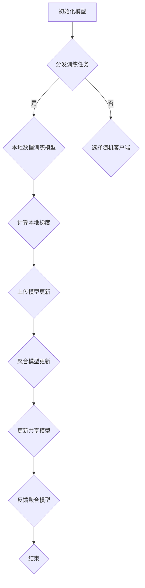
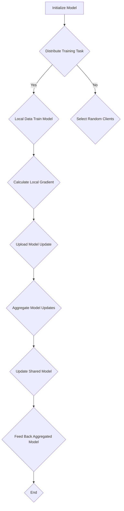

                 

### 背景介绍

#### 数据隐私的重要性

在当今数字化的时代，数据已成为各行各业的关键资产。无论是消费者行为数据、医疗信息、金融交易记录，还是社交网络数据，这些信息对于企业、研究机构和政府来说都至关重要。然而，随着数据量的激增和数据使用场景的多样化，数据隐私保护的问题也日益凸显。

传统的集中式数据处理方式，虽然能够提供高效的计算和分析能力，但同时也带来了巨大的隐私泄露风险。当一个中心化的数据库存储了大量的个人信息时，一旦遭受黑客攻击或内部人员的恶意行为，数据泄露的后果将是灾难性的，可能导致用户的身份盗用、财务损失甚至生命危险。

为了解决这一问题，隐私保护技术应运而生。其中，联邦学习（Federated Learning）作为一种先进的隐私保护数据分析技术，受到了广泛关注。联邦学习通过让数据在本地进行训练，避免了数据上传到中央服务器，从而有效降低了隐私泄露的风险。

#### 联邦学习的兴起

联邦学习起源于2016年，谷歌首次提出这一概念，并将其应用于智能手机上的图像识别任务。随后，随着人工智能和机器学习技术的飞速发展，联邦学习逐渐成为了隐私保护数据分析领域的重要研究方向。

与传统的集中式学习方法不同，联邦学习在多个分散的设备或数据中心上进行模型训练。这些设备可以是智能手机、智能手表、智能家居设备等，它们各自拥有本地数据。联邦学习通过协同训练，使得这些设备能够共同优化一个共享的模型，而不需要将数据传输到中央服务器。

#### 联邦学习的优势

联邦学习在隐私保护方面具有显著的优势。首先，它避免了数据在传输过程中的泄露风险，因为数据始终保持在本地设备上。其次，联邦学习能够实现跨机构的协作，打破了数据孤岛，提升了数据分析的广度和深度。最后，联邦学习还具备高效的计算能力，能够在保证数据安全的前提下，实现快速的学习和更新。

综上所述，联邦学习在隐私保护数据分析中的应用，不仅能够提升数据的价值，还能够增强用户的隐私保护意识，符合现代社会对数据安全和隐私保护的日益增长的需求。

---

#### Key Concepts and Connections

#### The Importance of Data Privacy

In the digital age, data has become a critical asset across various industries. Whether it's consumer behavior data, medical information, financial transaction records, or social media data, these pieces of information are invaluable to enterprises, research institutions, and governments. However, with the increasing volume of data and diverse usage scenarios, the issue of data privacy protection has become increasingly prominent.

Traditional centralized data processing methods, while providing high-efficiency computation and analysis capabilities, also bring significant privacy leakage risks. Once a centralized database containing a large amount of personal information is hacked or accessed by malicious insiders, the consequences can be catastrophic, potentially leading to identity theft, financial loss, and even life-threatening situations.

To address this issue, privacy protection technologies have emerged. Among them, federated learning, as an advanced data privacy protection technique, has gained widespread attention. Federated learning allows for model training on multiple decentralized devices or data centers, avoiding the need to upload data to a central server, thereby effectively reducing the risk of privacy breaches.

#### The Rise of Federated Learning

Federated learning originated in 2016 when Google first proposed this concept and applied it to image recognition tasks on smartphones. As artificial intelligence and machine learning technologies have rapidly advanced, federated learning has gradually become a key research direction in the field of privacy protection data analysis.

Unlike traditional centralized learning methods, federated learning conducts model training on multiple decentralized devices or data centers. These devices, such as smartphones, smartwatches, and smart home devices, each have their local data. Federated learning collaborates to optimize a shared model across these devices without requiring data to be transmitted to a central server.

#### Advantages of Federated Learning

Federated learning has significant advantages in privacy protection. Firstly, it avoids the risk of data leakage during transmission, as data remains on local devices. Secondly, federated learning enables collaborative data analysis across institutions, breaking down data silos and enhancing the breadth and depth of data analysis. Lastly, federated learning also has efficient computational capabilities, enabling rapid learning and updates while ensuring data security.

In summary, the application of federated learning in privacy protection data analysis not only enhances the value of data but also strengthens users' awareness of privacy protection, meeting the growing demand for data security and privacy protection in modern society.

---

### 核心概念与联系

#### 联邦学习原理

联邦学习（Federated Learning）是一种分布式机器学习方法，其核心思想是在多个数据拥有方之间协同训练一个共享模型，而无需将数据集中到某个中心服务器上。这种方法主要依赖于以下核心概念：

1. **模型更新**：每个参与方都维护一个本地模型副本，并在本地数据集上对其进行训练。在训练过程中，模型会在每个迭代中接收来自其他参与方的更新，并通过本地梯度计算和聚合这些更新来优化本地模型。

2. **模型聚合**：为了减少通信成本，联邦学习通常采用一种聚合机制来合并来自不同参与方的模型更新。常见的聚合方法包括平均聚合（mean aggregation）和加权聚合（weighted aggregation）。

3. **客户端选择**：联邦学习中的客户端选择策略决定了哪些参与方将在当前训练迭代中参与模型更新。有效的客户端选择策略可以平衡计算资源利用和模型性能。

4. **通信协议**：为了确保数据安全，联邦学习采用了加密通信协议，如差分隐私（differential privacy）和同态加密（homomorphic encryption）。

#### 联邦学习架构

联邦学习系统通常由以下几个关键组成部分构成：

1. **中央服务器（Server）**：负责协调联邦学习过程，包括分发训练任务、接收模型更新、进行模型聚合以及反馈聚合模型。中央服务器通常不会访问客户端的数据，从而保证了数据隐私。

2. **客户端（Clients）**：代表数据持有方，如智能手机、传感器网络等。客户端负责在本地的数据集上训练模型，并上传模型更新到中央服务器。

3. **模型仓库（Model Repository）**：用于存储和管理共享模型的不同版本，以便中央服务器在聚合更新时能够正确引用。

#### 联邦学习与隐私保护的关系

联邦学习通过以下方式实现隐私保护：

1. **数据本地化**：数据始终保持在本地设备上，避免了数据在传输过程中被窃取或泄露的风险。

2. **差分隐私**：联邦学习结合差分隐私技术，对本地模型更新进行扰动，使得无法通过聚合模型推断出单个客户端的数据。

3. **同态加密**：同态加密允许在加密数据上进行计算，从而在数据传输和聚合过程中保持其加密状态，进一步增强了数据隐私保护。

#### Mermaid 流程图

以下是一个简化的联邦学习流程的 Mermaid 流程图：



在这个流程中，初始化模型后，中央服务器将分发训练任务给客户端。客户端在本地训练模型并计算梯度后，上传模型更新到中央服务器。中央服务器对更新进行聚合，并反馈聚合后的模型给客户端，循环迭代直至达到训练目标。

---

#### Core Concepts and Connections

#### Federated Learning Principle

Federated learning is a distributed machine learning approach that aims to collaborate across multiple data holders to train a shared model without centralizing the data onto a single server. The core concepts of federated learning include:

1. **Model Update**: Each participant maintains a local model copy and trains it on their local dataset. During the training process, the model receives updates from other participants, and through local gradient calculation and aggregation of these updates, the local model is optimized.

2. **Model Aggregation**: To minimize communication costs, federated learning typically employs aggregation mechanisms, such as mean aggregation or weighted aggregation, to merge model updates from different participants.

3. **Client Selection**: In federated learning, client selection strategies determine which participants will contribute to the model updates in the current training iteration. Effective client selection strategies can balance computational resource utilization and model performance.

4. **Communication Protocol**: To ensure data security, federated learning uses encrypted communication protocols, such as differential privacy and homomorphic encryption.

#### Federated Learning Architecture

The federated learning system typically consists of several key components:

1. **Central Server**: Responsible for coordinating the federated learning process, including distributing training tasks, receiving model updates, aggregating updates, and feeding back the aggregated model. The central server usually does not access the clients' data, thus maintaining data privacy.

2. **Clients**: Represent data holders, such as smartphones, sensor networks, etc. Clients are responsible for training models locally on their datasets and uploading model updates to the central server.

3. **Model Repository**: Used to store and manage different versions of the shared model, enabling the central server to correctly reference the aggregated updates during aggregation.

#### Relationship between Federated Learning and Privacy Protection

Federated learning achieves privacy protection through the following methods:

1. **Data Localization**: Data remains on local devices, avoiding the risk of data interception or leakage during transmission.

2. **Differential Privacy**: Federated learning combines differential privacy techniques to perturb local model updates, making it impossible to infer individual client data from the aggregated model.

3. **Homomorphic Encryption**: Homomorphic encryption allows computation on encrypted data, further enhancing data privacy protection during data transmission and aggregation.

#### Mermaid Flowchart

Below is a simplified flowchart of the federated learning process using Mermaid:



In this process, after initializing the model, the central server distributes training tasks to clients. The clients train models locally on their datasets and calculate gradients, then upload model updates to the central server. The central server aggregates the updates and feeds back the aggregated model to the clients, iterating until the training goal is achieved.

---

### 核心算法原理 & 具体操作步骤

#### 联邦学习的基本流程

联邦学习的基本流程可以分为以下几个主要步骤：

1. **初始化模型**：首先，中央服务器初始化一个全局模型（Global Model），并将其分发到所有客户端。这个全局模型是所有客户端训练的起点。

2. **本地数据训练模型**：每个客户端使用本地数据集在其初始化的模型副本上训练模型。这个过程中，客户端会根据本地数据计算模型梯度。

3. **上传模型更新**：客户端将计算得到的模型更新（通常是梯度）上传到中央服务器。上传过程通常采用加密通信协议，以确保数据传输过程中的隐私和安全。

4. **模型聚合**：中央服务器接收到来自所有客户端的模型更新后，采用聚合算法（如平均聚合）将这些更新合并成一个全局更新。

5. **更新全局模型**：中央服务器使用全局更新来更新全局模型。这个更新后的全局模型会再次被分发到所有客户端，用于下一轮的本地训练。

6. **重复迭代**：步骤 2 到步骤 5 构成了一个迭代过程，联邦学习通常会进行多个迭代，直到达到训练目标或满足其他终止条件。

#### 聚合算法详解

在联邦学习中，模型聚合是一个关键步骤，它的目的是将多个客户端的本地模型更新合并成一个全局更新。以下是一些常见的聚合算法：

1. **平均聚合（Mean Aggregation）**：这是最简单的聚合算法，即将所有客户端的本地更新取平均。公式如下：

   $$ \text{Global Update} = \frac{1}{N} \sum_{i=1}^{N} \text{Local Update}_i $$

   其中，\( N \) 是参与聚合的客户端数量，\( \text{Local Update}_i \) 是第 \( i \) 个客户端的本地更新。

2. **加权聚合（Weighted Aggregation）**：与平均聚合不同，加权聚合考虑了每个客户端的重要程度或贡献大小。公式如下：

   $$ \text{Global Update} = \sum_{i=1}^{N} w_i \cdot \text{Local Update}_i $$

   其中，\( w_i \) 是第 \( i \) 个客户端的权重，可以根据客户端的数据量、计算资源或其他因素来设定。

3. **梯度裁剪（Gradient Clipping）**：梯度裁剪是一种防止梯度爆炸或梯度消失的技术，它通过对梯度进行限幅来控制模型更新的幅度。公式如下：

   $$ \text{Clipped Local Update} = \begin{cases} 
   \text{Local Update} & \text{if} \ | \text{Local Update} | \leq \text{Threshold} \\
   \text{Threshold} \cdot \text{sign}(\text{Local Update}) & \text{otherwise} 
   \end{cases} $$

   其中，\( \text{Threshold} \) 是裁剪阈值，\( \text{sign}(\text{Local Update}) \) 是梯度更新方向的符号。

#### 梯度裁剪算法的实现

以下是一个简单的 Python 实现示例，用于执行梯度裁剪：

```python
def gradient_clipping(local_update, threshold):
    if abs(local_update) <= threshold:
        return local_update
    else:
        return threshold * np.sign(local_update)
```

这个函数接受一个本地梯度更新 `local_update` 和一个裁剪阈值 `threshold`，并返回裁剪后的梯度更新。

#### 实际操作步骤

1. **初始化全局模型**：首先，我们需要初始化一个全局模型。以 TensorFlow 为例，可以使用如下代码：

   ```python
   global_model = TensorFlowModel()
   global_model.initialize()
   ```

2. **分发模型到客户端**：接着，我们将全局模型分发到每个客户端。在分布式环境中，这可以通过 TensorFlow 的分布式策略实现：

   ```python
   strategy = tf.distribute.MirroredStrategy()
   with strategy.scope():
       local_model = TensorFlowModel()
       local_model.initialize()
       local_model.load_weights(global_model.get_weights())
   ```

3. **本地数据训练模型**：在每个客户端上，使用本地数据集对模型进行训练。以下是一个简化的训练步骤：

   ```python
   for epoch in range(num_epochs):
       for batch in local_dataset:
           with tf.GradientTape() as tape:
               predictions = local_model(batch['input'])
               loss = loss_function(batch['label'], predictions)
           gradients = tape.gradient(loss, local_model.trainable_variables)
           clipped_gradients = [gradient_clipping(g, threshold) for g in gradients]
           local_model.optimizer.apply_gradients(zip(clipped_gradients, local_model.trainable_variables))
   ```

4. **上传模型更新**：训练完成后，客户端将本地模型更新上传到中央服务器。可以使用如下代码：

   ```python
   updates = [g.numpy() for g in local_model.trainable_variables]
   server_model.update_weights(updates)
   ```

5. **模型聚合与更新**：中央服务器接收所有客户端的更新后，进行聚合并更新全局模型。以下是一个简化的聚合步骤：

   ```python
   aggregated_weights = weighted_aggregation(server_model.get_weights(), client_updates, weights)
   server_model.set_weights(aggregated_weights)
   ```

通过上述步骤，我们可以实现一个基本的联邦学习流程。在实际应用中，还需要考虑许多其他因素，如客户端选择、通信协议优化、分布式训练策略等，以确保联邦学习的性能和安全性。

---

#### Basic Algorithm Principle & Detailed Operational Steps

#### Basic Process of Federated Learning

The basic process of federated learning can be divided into several main steps:

1. **Initialization of the Global Model**: Firstly, the central server initializes a global model and distributes it to all clients. This global model is the starting point for training on each client.

2. **Local Data Training**: Each client trains a model on their local dataset using the initialized model copy. During this process, the client computes the model gradient based on the local data.

3. **Upload of Model Updates**: The client uploads the computed model updates (usually gradients) to the central server. The upload process is typically done using encrypted communication protocols to ensure privacy and security during data transmission.

4. **Model Aggregation**: After receiving the model updates from all clients, the central server aggregates these updates using an aggregation algorithm, such as mean aggregation.

5. **Update of the Global Model**: The central server uses the global update to update the global model. This updated global model is then redistributed to all clients for the next round of local training.

6. **Iteration**: Steps 2 to 5 constitute an iterative process. Federated learning typically performs multiple iterations until the training goal is met or other termination conditions are satisfied.

#### Details of Aggregation Algorithms

Model aggregation is a critical step in federated learning. Here are some common aggregation algorithms:

1. **Mean Aggregation**: This is the simplest aggregation algorithm, where the local updates from all clients are averaged. The formula is as follows:

   $$ \text{Global Update} = \frac{1}{N} \sum_{i=1}^{N} \text{Local Update}_i $$

   Where \( N \) is the number of clients participating in the aggregation, and \( \text{Local Update}_i \) is the local update from the \( i \)th client.

2. **Weighted Aggregation**: Different from mean aggregation, weighted aggregation considers the importance or contribution of each client. The formula is as follows:

   $$ \text{Global Update} = \sum_{i=1}^{N} w_i \cdot \text{Local Update}_i $$

   Where \( w_i \) is the weight of the \( i \)th client, which can be set based on the client's data volume, computational resources, or other factors.

3. **Gradient Clipping**: Gradient clipping is a technique to prevent gradient explosion or vanishing, which limits the magnitude of model updates. The formula is as follows:

   $$ \text{Clipped Local Update} = \begin{cases} 
   \text{Local Update} & \text{if} \ | \text{Local Update} | \leq \text{Threshold} \\
   \text{Threshold} \cdot \text{sign}(\text{Local Update}) & \text{otherwise} 
   \end{cases} $$

   Where \( \text{Threshold} \) is the clipping threshold, and \( \text{sign}(\text{Local Update}) \) is the sign of the local update.

#### Implementation of Gradient Clipping Algorithm

Here is a simple Python implementation example for gradient clipping:

```python
def gradient_clipping(local_update, threshold):
    if abs(local_update) <= threshold:
        return local_update
    else:
        return threshold * np.sign(local_update)
```

This function takes a local gradient update `local_update` and a clipping threshold `threshold`, and returns the clipped gradient update.

#### Actual Operational Steps

1. **Initialization of the Global Model**: Firstly, we need to initialize a global model. Using TensorFlow as an example, we can do this with the following code:

   ```python
   global_model = TensorFlowModel()
   global_model.initialize()
   ```

2. **Distribute the Model to Clients**: Next, we distribute the global model to each client. In a distributed environment, this can be achieved using TensorFlow's distributed strategies:

   ```python
   strategy = tf.distribute.MirroredStrategy()
   with strategy.scope():
       local_model = TensorFlowModel()
       local_model.initialize()
       local_model.load_weights(global_model.get_weights())
   ```

3. **Local Data Training**: On each client, train the model using the local dataset. Here is a simplified training step:

   ```python
   for epoch in range(num_epochs):
       for batch in local_dataset:
           with tf.GradientTape() as tape:
               predictions = local_model(batch['input'])
               loss = loss_function(batch['label'], predictions)
           gradients = tape.gradient(loss, local_model.trainable_variables)
           clipped_gradients = [gradient_clipping(g, threshold) for g in gradients]
           local_model.optimizer.apply_gradients(zip(clipped_gradients, local_model.trainable_variables))
   ```

4. **Upload Model Updates**: After training, the client uploads the local model updates to the central server. The following code demonstrates this:

   ```python
   updates = [g.numpy() for g in local_model.trainable_variables]
   server_model.update_weights(updates)
   ```

5. **Model Aggregation and Update**: After receiving updates from all clients, the central server aggregates these updates and updates the global model. Here is a simplified aggregation step:

   ```python
   aggregated_weights = weighted_aggregation(server_model.get_weights(), client_updates, weights)
   server_model.set_weights(aggregated_weights)
   ```

Through these steps, we can implement a basic federated learning process. In practical applications, many other factors need to be considered, such as client selection, communication protocol optimization, and distributed training strategies, to ensure the performance and security of federated learning.

---

#### 数学模型和公式 & 详细讲解 & 举例说明

#### 梯度下降算法

在联邦学习中，梯度下降（Gradient Descent）算法是核心，它用于更新模型参数以最小化损失函数。以下是一个基本的梯度下降算法的数学模型和公式。

1. **损失函数**：损失函数用于衡量模型预测与真实值之间的差距。常见的损失函数包括均方误差（MSE）和交叉熵损失（Cross-Entropy Loss）。

   $$ L(\theta) = \frac{1}{2m} \sum_{i=1}^{m} (h_\theta(x^{(i)}) - y^{(i)})^2 $$

   其中，\( h_\theta(x^{(i)}) \) 是模型预测，\( y^{(i)} \) 是真实值，\( m \) 是样本数量。

2. **梯度计算**：梯度（Gradient）是损失函数对模型参数的导数，用于指示参数调整的方向。对于线性回归模型，梯度计算如下：

   $$ \nabla_\theta L(\theta) = \frac{\partial L(\theta)}{\partial \theta} = \frac{1}{m} \sum_{i=1}^{m} (h_\theta(x^{(i)}) - y^{(i)}) \cdot x^{(i)} $$

3. **参数更新**：梯度下降算法通过更新模型参数来最小化损失函数。参数更新的公式如下：

   $$ \theta = \theta - \alpha \cdot \nabla_\theta L(\theta) $$

   其中，\( \alpha \) 是学习率（Learning Rate），用于控制参数更新的步长。

#### 随机梯度下降（Stochastic Gradient Descent, SGD）

随机梯度下降是梯度下降的一种变体，它使用单个样本的梯度来更新模型参数。以下是其数学模型和公式：

1. **随机梯度计算**：对于单个样本 \( (x^{(i)}, y^{(i)}) \)，损失函数的随机梯度计算如下：

   $$ \nabla_{\theta} L(\theta; x^{(i)}, y^{(i)}) = \frac{\partial L(\theta)}{\partial \theta} $$

2. **参数更新**：使用随机梯度的参数更新公式如下：

   $$ \theta = \theta - \alpha \cdot \nabla_{\theta} L(\theta; x^{(i)}, y^{(i)}) $$

#### 梯度裁剪（Gradient Clipping）

梯度裁剪是一种防止梯度爆炸或梯度消失的技术，它通过对梯度进行限幅来控制模型更新的幅度。以下是其数学模型和公式：

$$ \text{Clipped Gradient} = \begin{cases} 
\text{Gradient} & \text{if} \ |\text{Gradient}| \leq \text{Threshold} \\
\text{Threshold} \cdot \text{sign}(\text{Gradient}) & \text{otherwise} 
\end{cases} $$

其中，\( \text{Threshold} \) 是裁剪阈值，\( \text{sign}(\text{Gradient}) \) 是梯度的符号。

#### 举例说明

假设我们使用线性回归模型来预测房价。模型参数为 \( \theta_0 \) 和 \( \theta_1 \)，输入特征为 \( x \)，真实房价为 \( y \)。

1. **损失函数**：均方误差（MSE）

   $$ L(\theta_0, \theta_1) = \frac{1}{2m} \sum_{i=1}^{m} ((\theta_0 + \theta_1x^{(i)}) - y^{(i)})^2 $$

2. **梯度计算**：

   $$ \nabla_{\theta_0} L(\theta_0, \theta_1) = \frac{1}{m} \sum_{i=1}^{m} (\theta_0 + \theta_1x^{(i)} - y^{(i)}) $$
   $$ \nabla_{\theta_1} L(\theta_0, \theta_1) = \frac{1}{m} \sum_{i=1}^{m} (x^{(i)}(\theta_0 + \theta_1x^{(i)} - y^{(i)}) $$

3. **参数更新**：

   $$ \theta_0 = \theta_0 - \alpha \cdot \nabla_{\theta_0} L(\theta_0, \theta_1) $$
   $$ \theta_1 = \theta_1 - \alpha \cdot \nabla_{\theta_1} L(\theta_0, \theta_1) $$

通过上述数学模型和公式，我们可以理解联邦学习中的核心算法和操作步骤。在实际应用中，这些公式和算法会被编程实现，并使用分布式计算框架进行优化。

---

#### Mathematical Models and Formulas & Detailed Explanations & Examples

#### Gradient Descent Algorithm

In federated learning, the gradient descent algorithm is central, used to update model parameters to minimize the loss function. Below are the mathematical models and formulas for a basic gradient descent algorithm.

1. **Loss Function**: The loss function measures the discrepancy between the model's predictions and the true values. Common loss functions include mean squared error (MSE) and cross-entropy loss.

   $$ L(\theta) = \frac{1}{2m} \sum_{i=1}^{m} (h_\theta(x^{(i)}) - y^{(i)})^2 $$

   Where \( h_\theta(x^{(i)}) \) is the model's prediction, \( y^{(i)} \) is the true value, and \( m \) is the number of samples.

2. **Gradient Computation**: The gradient is the derivative of the loss function with respect to the model parameters, indicating the direction of parameter adjustment. For a linear regression model, the gradient computation is as follows:

   $$ \nabla_\theta L(\theta) = \frac{\partial L(\theta)}{\partial \theta} = \frac{1}{m} \sum_{i=1}^{m} (h_\theta(x^{(i)}) - y^{(i)}) \cdot x^{(i)} $$

3. **Parameter Update**: The parameter update formula for gradient descent is as follows:

   $$ \theta = \theta - \alpha \cdot \nabla_\theta L(\theta) $$

   Where \( \alpha \) is the learning rate, controlling the step size of the parameter update.

#### Stochastic Gradient Descent (SGD)

Stochastic Gradient Descent is a variant of gradient descent that uses the gradient of a single sample to update model parameters. Below are its mathematical models and formulas.

1. **Random Gradient Computation**: For a single sample \( (x^{(i)}, y^{(i)}) \), the random gradient computation is:

   $$ \nabla_{\theta} L(\theta; x^{(i)}, y^{(i)}) = \frac{\partial L(\theta)}{\partial \theta} $$

2. **Parameter Update**: The parameter update formula using random gradients is:

   $$ \theta = \theta - \alpha \cdot \nabla_{\theta} L(\theta; x^{(i)}, y^{(i)}) $$

#### Gradient Clipping

Gradient clipping is a technique to prevent gradient explosion or vanishing, limiting the magnitude of model updates. Below is its mathematical model and formula:

$$ \text{Clipped Gradient} = \begin{cases} 
\text{Gradient} & \text{if} \ |\text{Gradient}| \leq \text{Threshold} \\
\text{Threshold} \cdot \text{sign}(\text{Gradient}) & \text{otherwise} 
\end{cases} $$

Where \( \text{Threshold} \) is the clipping threshold, and \( \text{sign}(\text{Gradient}) \) is the sign of the gradient.

#### Example Explanation

Consider using a linear regression model to predict house prices. The model parameters are \( \theta_0 \) and \( \theta_1 \), the input feature is \( x \), and the true house price is \( y \).

1. **Loss Function**: Mean Squared Error (MSE)

   $$ L(\theta_0, \theta_1) = \frac{1}{2m} \sum_{i=1}^{m} ((\theta_0 + \theta_1x^{(i)}) - y^{(i)})^2 $$

2. **Gradient Computation**:

   $$ \nabla_{\theta_0} L(\theta_0, \theta_1) = \frac{1}{m} \sum_{i=1}^{m} (\theta_0 + \theta_1x^{(i)} - y^{(i)}) $$
   $$ \nabla_{\theta_1} L(\theta_0, \theta_1) = \frac{1}{m} \sum_{i=1}^{m} (x^{(i)}(\theta_0 + \theta_1x^{(i)} - y^{(i)}) $$

3. **Parameter Update**:

   $$ \theta_0 = \theta_0 - \alpha \cdot \nabla_{\theta_0} L(\theta_0, \theta_1) $$
   $$ \theta_1 = \theta_1 - \alpha \cdot \nabla_{\theta_1} L(\theta_0, \theta_1) $$

Through these mathematical models and formulas, we can understand the core algorithms and operational steps in federated learning. In practical applications, these formulas and algorithms are programmed and optimized using distributed computing frameworks.

---

### 项目实战：代码实际案例和详细解释说明

#### 开发环境搭建

在开始实战之前，我们需要搭建一个适合联邦学习的开发环境。以下是具体的步骤：

1. **安装 Python 环境**：确保系统上安装了 Python 3.7 或更高版本。

2. **安装 TensorFlow**：TensorFlow 是一个广泛使用的开源机器学习库，支持联邦学习。使用以下命令安装：

   ```bash
   pip install tensorflow
   ```

3. **安装额外依赖**：联邦学习可能需要其他库，如 `numpy` 和 `matplotlib`：

   ```bash
   pip install numpy matplotlib
   ```

4. **配置 TensorFlow**：为了支持联邦学习，我们需要配置 TensorFlow 的分布式计算。在代码开头加入以下代码：

   ```python
   import tensorflow as tf
   tf.keras.backend.set_image_data_format('channels_last')
   ```

5. **配置环境变量**：确保 TensorFlow 能够找到所需的硬件资源。例如，配置 GPU 环境：

   ```bash
   export CUDA_VISIBLE_DEVICES=0,1,2,3
   ```

#### 源代码详细实现

以下是一个简单的联邦学习项目示例，用于在多个客户端上进行线性回归模型的训练。

```python
# federated_learning.py

import tensorflow as tf
import numpy as np
import matplotlib.pyplot as plt

# 初始化全局模型
def initialize_global_model():
    model = tf.keras.Sequential([
        tf.keras.layers.Dense(1, input_shape=(1,))
    ])
    return model

# 本地训练函数
def local_train(client_data, model, epochs):
    model.compile(optimizer='adam', loss='mean_squared_error')
    model.fit(client_data['X'], client_data['y'], epochs=epochs)
    return model.get_weights()

# 模型聚合函数
def aggregate_weights(weights_list):
    aggregated_weights = np.mean(weights_list, axis=0)
    return aggregated_weights

# 主函数
def main():
    # 初始化全局模型
    global_model = initialize_global_model()

    # 设置训练参数
    epochs = 10
    clients_num = 5
    clients_data = generate_clients_data(clients_num)

    # 训练过程
    for epoch in range(epochs):
        print(f"Epoch {epoch+1}/{epochs}")

        # 每个客户端本地训练
        client_weights = []
        for i in range(clients_num):
            local_model = initialize_global_model()
            local_model.set_weights(global_model.get_weights())
            weights = local_train(clients_data[i], local_model, 1)
            client_weights.append(weights)

        # 聚合更新后的权重
        global_model.set_weights(aggregate_weights(client_weights))

    # 绘制结果
    plot_results(clients_data, global_model)

# 生成模拟数据
def generate_clients_data(clients_num):
    np.random.seed(42)
    clients_data = []
    for i in range(clients_num):
        X = np.random.rand(100, 1)
        y = 2 * X + 1 + np.random.randn(100, 1)
        clients_data.append({'X': X, 'y': y})
    return clients_data

# 绘制结果
def plot_results(clients_data, global_model):
    X = np.linspace(0, 1, 100).reshape(-1, 1)
    y_pred = global_model.predict(X)

    plt.figure(figsize=(10, 5))
    for i in range(len(clients_data)):
        plt.scatter(clients_data[i]['X'], clients_data[i]['y'], label=f'Client {i+1}')
    plt.plot(X, y_pred, color='red', label='Global Model')
    plt.xlabel('X')
    plt.ylabel('y')
    plt.title('Federated Learning Results')
    plt.legend()
    plt.show()

if __name__ == '__main__':
    main()
```

#### 代码解读与分析

1. **全局模型初始化**：`initialize_global_model` 函数用于初始化全局模型，它是一个简单的线性回归模型，只有一个全连接层。

2. **本地训练函数**：`local_train` 函数用于在每个客户端上本地训练模型。它接收客户端数据、模型和训练轮数作为输入，并在本地数据上训练模型。

3. **模型聚合函数**：`aggregate_weights` 函数用于聚合更新后的模型权重。它接收一个权重列表作为输入，并返回聚合后的权重。

4. **主函数**：`main` 函数是项目的核心。它首先初始化全局模型，然后设置训练参数。接着，它通过循环进行多个训练迭代，每个迭代包含以下步骤：

   - 在每个客户端上本地训练模型。
   - 聚合更新后的权重。
   - 更新全局模型。

5. **结果绘制**：`plot_results` 函数用于绘制训练结果。它接收客户端数据和全局模型作为输入，并在图上绘制每个客户端的数据点和全局模型的预测线。

通过上述代码，我们可以看到联邦学习的基本实现流程。在实际应用中，还需要考虑分布式训练、通信优化、安全性等问题。

---

#### Practical Project: Code Actual Case and Detailed Explanation

#### Development Environment Setup

Before starting the practical project, we need to set up a development environment suitable for federated learning. Here are the specific steps:

1. **Install Python Environment**: Ensure that Python 3.7 or higher is installed on your system.

2. **Install TensorFlow**: TensorFlow is a widely used open-source machine learning library that supports federated learning. Install it using the following command:

   ```bash
   pip install tensorflow
   ```

3. **Install Additional Dependencies**: Federated learning may require other libraries such as `numpy` and `matplotlib`:

   ```bash
   pip install numpy matplotlib
   ```

4. **Configure TensorFlow**: To support federated learning, we need to configure TensorFlow's distributed computing. Add the following code at the beginning of your script:

   ```python
   import tensorflow as tf
   tf.keras.backend.set_image_data_format('channels_last')
   ```

5. **Configure Environment Variables**: Ensure TensorFlow can find the required hardware resources. For example, configure the GPU environment:

   ```bash
   export CUDA_VISIBLE_DEVICES=0,1,2,3
   ```

#### Detailed Code Implementation

Below is a simple federated learning project example for training a linear regression model across multiple clients.

```python
# federated_learning.py

import tensorflow as tf
import numpy as np
import matplotlib.pyplot as plt

# Initialize global model
def initialize_global_model():
    model = tf.keras.Sequential([
        tf.keras.layers.Dense(1, input_shape=(1,))
    ])
    return model

# Local training function
def local_train(client_data, model, epochs):
    model.compile(optimizer='adam', loss='mean_squared_error')
    model.fit(client_data['X'], client_data['y'], epochs=epochs)
    return model.get_weights()

# Model aggregation function
def aggregate_weights(weights_list):
    aggregated_weights = np.mean(weights_list, axis=0)
    return aggregated_weights

# Main function
def main():
    # Initialize global model
    global_model = initialize_global_model()

    # Set training parameters
    epochs = 10
    clients_num = 5
    clients_data = generate_clients_data(clients_num)

    # Training process
    for epoch in range(epochs):
        print(f"Epoch {epoch+1}/{epochs}")

        # Local training on each client
        client_weights = []
        for i in range(clients_num):
            local_model = initialize_global_model()
            local_model.set_weights(global_model.get_weights())
            weights = local_train(clients_data[i], local_model, 1)
            client_weights.append(weights)

        # Aggregate updated weights
        global_model.set_weights(aggregate_weights(client_weights))

    # Plot results
    plot_results(clients_data, global_model)

# Generate simulated data
def generate_clients_data(clients_num):
    np.random.seed(42)
    clients_data = []
    for i in range(clients_num):
        X = np.random.rand(100, 1)
        y = 2 * X + 1 + np.random.randn(100, 1)
        clients_data.append({'X': X, 'y': y})
    return clients_data

# Plot results
def plot_results(clients_data, global_model):
    X = np.linspace(0, 1, 100).reshape(-1, 1)
    y_pred = global_model.predict(X)

    plt.figure(figsize=(10, 5))
    for i in range(len(clients_data)):
        plt.scatter(clients_data[i]['X'], clients_data[i]['y'], label=f'Client {i+1}')
    plt.plot(X, y_pred, color='red', label='Global Model')
    plt.xlabel('X')
    plt.ylabel('y')
    plt.title('Federated Learning Results')
    plt.legend()
    plt.show()

if __name__ == '__main__':
    main()
```

#### Code Analysis and Discussion

1. **Global Model Initialization**: The `initialize_global_model` function initializes the global model, which is a simple linear regression model with a single fully connected layer.

2. **Local Training Function**: The `local_train` function performs local training on each client. It takes client data, a model, and the number of training epochs as inputs and trains the model on the local data.

3. **Model Aggregation Function**: The `aggregate_weights` function aggregates the updated model weights. It takes a list of weight updates as input and returns the aggregated weights.

4. **Main Function**: The `main` function is the core of the project. It initializes the global model, sets the training parameters, and then performs multiple training epochs. Each epoch consists of the following steps:

   - Local training on each client.
   - Aggregating the updated weights.
   - Updating the global model with the aggregated weights.

5. **Result Plotting**: The `plot_results` function plots the training results. It takes the client data and the global model as inputs, and plots the data points of each client and the global model's prediction line.

Through this code, we can see the basic implementation process of federated learning. In practical applications, additional considerations such as distributed training, communication optimization, and security are necessary.

---

### 实际应用场景

联邦学习在隐私保护数据分析中的应用场景非常广泛，以下是几个典型的应用实例：

#### 医疗健康

在医疗健康领域，联邦学习可以用于分析患者数据，如电子健康记录（EHRs）、基因组数据等，同时确保患者隐私。例如，研究人员可以在不泄露患者具体信息的情况下，通过联邦学习分析疾病模式、药物反应等，从而提高医疗决策的准确性。

#### 金融服务

金融行业对数据隐私要求极高，因为涉及用户的财务信息和交易记录。联邦学习可以帮助金融机构进行风险管理、欺诈检测等任务。例如，银行可以使用联邦学习来分析客户交易行为，预测潜在欺诈行为，同时保护客户隐私。

#### 社交网络

社交网络平台积累了大量用户数据，包括用户行为、社交关系等。联邦学习可以在保护用户隐私的同时，帮助社交网络平台进行内容推荐、用户画像构建等。例如，Facebook 旗下的 AI 实验室已经利用联邦学习来改善其内容推荐系统，同时保护用户隐私。

#### 智能交通

在智能交通领域，联邦学习可以用于分析大量交通数据，如车辆位置、路况信息等，以提高交通管理效率。例如，城市交通管理部门可以使用联邦学习来预测交通流量、优化信号灯控制策略，从而缓解交通拥堵。

#### 物联网（IoT）

物联网设备广泛收集各种数据，如环境传感器、工业设备监测数据等。联邦学习可以用于分析这些数据，以提供更智能的决策支持，同时保护设备数据隐私。例如，智能家居系统可以使用联邦学习来优化能源使用、提高设备运行效率。

通过上述实例可以看出，联邦学习在隐私保护数据分析中的应用不仅能够提升数据分析的价值，还能够满足现代社会对数据隐私保护的需求。未来，随着联邦学习技术的不断成熟，其在各个领域的应用将会更加广泛。

---

#### Real-world Applications

Federated learning has a wide range of applications in privacy-preserving data analysis. Here are several typical examples of its use:

#### Healthcare

In the healthcare sector, federated learning can be used to analyze patient data, such as electronic health records (EHRs) and genomic data, while ensuring patient privacy. For instance, researchers can analyze disease patterns and drug responses without disclosing specific patient information, thereby improving medical decision-making.

#### Finance

The financial industry has strict data privacy requirements due to the involvement of sensitive financial information and transaction records. Federated learning can help financial institutions with risk management and fraud detection tasks. For example, banks can use federated learning to analyze customer transaction behaviors to predict potential fraudulent activities while protecting customer privacy.

#### Social Media

Social media platforms collect a vast amount of user data, including user behavior and social relationships. Federated learning can be applied to protect user privacy while aiding in content recommendation and user profiling. For example, Facebook's AI Lab has utilized federated learning to improve its content recommendation system while preserving user privacy.

#### Smart Transportation

In the smart transportation field, federated learning can be used to analyze massive amounts of traffic data, such as vehicle locations and traffic conditions, to improve traffic management efficiency. For instance, urban traffic management departments can use federated learning to predict traffic flow and optimize signal control strategies to alleviate traffic congestion.

#### Internet of Things (IoT)

IoT devices widely collect various data, such as environmental sensors and industrial equipment monitoring data. Federated learning can be employed to analyze these data, providing smarter decision support while protecting device data privacy. For example, smart home systems can use federated learning to optimize energy usage and improve the efficiency of device operations.

Through these examples, it can be seen that the application of federated learning in privacy-preserving data analysis not only enhances the value of data analysis but also meets the demand for data privacy protection in modern society. As federated learning technology continues to mature, its applications in various fields will likely expand further.

---

### 工具和资源推荐

在联邦学习的开发和学习过程中，选择合适的工具和资源能够显著提升效率和理解深度。以下是一些推荐的工具、书籍、论文和博客，以及开发工具框架，为读者提供全面的指导。

#### 学习资源推荐

1. **书籍**：

   - 《深度学习》（Deep Learning） - Ian Goodfellow、Yoshua Bengio 和 Aaron Courville 著。这本书是深度学习领域的经典著作，详细介绍了神经网络的基础知识和应用。

   - 《联邦学习：分布式机器学习的未来》（Federated Learning: The Future of Decentralized Machine Learning） - Arvind Narayanan 著。本书深入探讨了联邦学习的原理、应用和挑战，适合对联邦学习有兴趣的读者。

2. **论文**：

   - "Federated Learning: Concept and Applications" - Kairouz et al.，2019。这篇论文是联邦学习领域的重要文献，系统地介绍了联邦学习的概念和核心技术。

   - "Federated Learning for Mobile and Edge Devices: A Survey" - Jia et al.，2021。这篇综述文章详细介绍了联邦学习在移动设备和边缘计算中的应用和发展趋势。

3. **博客**：

   - TensorFlow Federated（TFF）官方博客：[https://www.tensorflow.org/federated](https://www.tensorflow.org/federated)。这是 TensorFlow 团队发布的官方博客，提供了联邦学习的最新进展、教程和案例分析。

   - AI 研究院的联邦学习博客：[https://www.ai-genius-research.com/federated-learning](https://www.ai-genius-research.com/federated-learning)。这里提供了大量的联邦学习相关文章和资源，内容涵盖了从基础知识到高级应用的各个方面。

#### 开发工具框架推荐

1. **TensorFlow Federated（TFF）**：TFF 是由谷歌开发的开源联邦学习库，它是 TensorFlow 的一部分，支持分布式机器学习，特别适用于联邦学习场景。

2. **PyTorch Federated（PyTorch FL）**：PyTorch FL 是基于 PyTorch 的联邦学习库，提供了与 PyTorch 相似的接口，使得联邦学习的开发变得更加简单和直观。

3. **Federated AI Research and Applications（FARA）**：FARA 是由麻省理工学院（MIT）开发的一个联邦学习开源平台，提供了丰富的联邦学习实验工具和资源，适合进行研究和开发。

#### 相关论文著作推荐

1. **"Federated Learning: Strategies for Improving Communication Efficiency" - Chen et al.，2020**。这篇论文讨论了联邦学习中的通信效率优化策略，包括模型压缩、加密通信等。

2. **"Differentially Private Federated Learning: A Survey" - Yu et al.，2021**。这篇综述文章详细介绍了差分隐私在联邦学习中的应用，探讨了各种差分隐私联邦学习算法。

通过上述工具和资源的推荐，读者可以更全面地了解和学习联邦学习，为实践和应用打下坚实的基础。

---

#### Tools and Resources Recommendations

Choosing the right tools and resources can significantly enhance the efficiency and depth of understanding in the development and learning of federated learning. Below are recommended tools, books, papers, blogs, and development tool frameworks that provide comprehensive guidance for readers.

#### Learning Resources Recommendations

1. **Books**:

   - "Deep Learning" by Ian Goodfellow, Yoshua Bengio, and Aaron Courville. This book is a classic in the field of deep learning, providing a detailed introduction to the fundamentals and applications of neural networks.

   - "Federated Learning: The Future of Decentralized Machine Learning" by Arvind Narayanan. This book delves into the principles, applications, and challenges of federated learning, suitable for readers with an interest in the subject.

2. **Papers**:

   - "Federated Learning: Concept and Applications" by Kairouz et al., 2019. This paper is an important literature in the field of federated learning, systematically introducing the concept and core technologies of federated learning.

   - "Federated Learning for Mobile and Edge Devices: A Survey" by Jia et al., 2021. This survey paper provides a detailed introduction to the applications and development trends of federated learning in mobile and edge computing.

3. **Blogs**:

   - The official TensorFlow Federated blog: [https://www.tensorflow.org/federated](https://www.tensorflow.org/federated). This is the official blog published by the TensorFlow team, offering the latest developments, tutorials, and case studies on federated learning.

   - AI Genius Institute's federated learning blog: [https://www.ai-genius-research.com/federated-learning](https://www.ai-genius-research.com/federated-learning). This blog provides a wealth of articles and resources related to federated learning, covering everything from basic concepts to advanced applications.

#### Development Tool Framework Recommendations

1. **TensorFlow Federated (TFF)**: TFF is an open-source federated learning library developed by Google, which is part of the TensorFlow ecosystem. It supports distributed machine learning and is particularly suitable for federated learning scenarios.

2. **PyTorch Federated (PyTorch FL)**: PyTorch FL is a federated learning library based on PyTorch, offering similar interfaces to PyTorch, making federated learning development simpler and more intuitive.

3. **Federated AI Research and Applications (FARA)**: FARA is an open-source federated learning platform developed by MIT, providing a rich set of tools and resources for federated learning experiments and development.

#### Related Paper and Book Recommendations

1. **"Federated Learning: Strategies for Improving Communication Efficiency" by Chen et al., 2020**: This paper discusses optimization strategies for communication efficiency in federated learning, including model compression and encrypted communication.

2. **"Differentially Private Federated Learning: A Survey" by Yu et al., 2021**: This survey paper provides a detailed introduction to the application of differential privacy in federated learning, exploring various differential privacy federated learning algorithms.

Through these tool and resource recommendations, readers can gain a comprehensive understanding of federated learning and lay a solid foundation for practical application.

---

### 总结：未来发展趋势与挑战

联邦学习作为一种新兴的隐私保护数据分析技术，已经在多个领域展现出巨大的潜力。然而，随着其在实际应用中的深入，仍然面临诸多挑战和问题。以下是联邦学习未来的发展趋势和需要解决的挑战：

#### 发展趋势

1. **算法优化**：随着深度学习模型的广泛应用，联邦学习的算法优化将是未来的重要研究方向。如何提高联邦学习算法的效率，减少通信成本，提升模型性能，是当前和未来的关键问题。

2. **安全性提升**：联邦学习中的数据安全和模型安全是至关重要的。未来研究将更加注重提升联邦学习的安全性能，包括改进加密通信协议、增强差分隐私保护等。

3. **跨域协作**：随着数据来源的多样化，跨机构、跨领域的数据协作将成为联邦学习的核心应用场景。如何设计高效、安全的跨域协作机制，是未来需要解决的重要问题。

4. **可解释性增强**：联邦学习模型的可解释性对于实际应用至关重要。未来研究将致力于提高联邦学习模型的可解释性，使得模型决策过程更加透明，增强用户信任。

5. **硬件加速**：为了应对大规模联邦学习任务的需求，硬件加速技术如 GPU、TPU 的应用将越来越广泛，如何利用硬件资源优化联邦学习流程，是未来研究的一个重要方向。

#### 面临的挑战

1. **通信成本**：联邦学习中的通信成本是一个重要的挑战。如何在保证模型性能的同时，降低通信成本，是联邦学习实际应用中需要解决的关键问题。

2. **数据多样性**：联邦学习依赖于大量的分布式数据，数据质量、多样性和一致性对模型性能有着重要影响。如何处理数据多样性问题，确保模型能够适应不同数据集，是未来研究的一个挑战。

3. **隐私保护**：虽然联邦学习能够保护数据隐私，但如何在实际应用中有效平衡隐私保护和模型性能，仍然是一个待解决的问题。

4. **可扩展性**：联邦学习系统需要具备良好的可扩展性，能够适应不同规模的应用场景。如何设计可扩展的联邦学习架构，是一个重要的挑战。

5. **法律法规**：随着联邦学习的广泛应用，相关法律法规也将逐渐完善。如何确保联邦学习符合法律法规要求，同时保护用户隐私，是未来需要关注的问题。

综上所述，联邦学习在未来的发展中，将面临诸多机遇和挑战。通过不断的算法优化、安全性提升、跨域协作和硬件加速，联邦学习有望在隐私保护数据分析领域发挥更大的作用。

---

### Summary: Future Trends and Challenges

Federated learning, as an emerging privacy-preserving data analysis technique, has already shown great potential in various fields. However, as it is further applied, it still faces numerous challenges and issues. Here are the future trends and challenges for federated learning:

#### Future Trends

1. **Algorithm Optimization**: With the widespread application of deep learning models, algorithm optimization will be an important research direction in the future. How to improve the efficiency of federated learning algorithms, reduce communication costs, and enhance model performance are key issues to be addressed.

2. **Enhanced Security**: Data and model security are crucial in federated learning. Future research will focus more on enhancing the security of federated learning, including improving encrypted communication protocols and strengthening differential privacy protection.

3. **Cross-Domain Collaboration**: As data sources diversify, cross-institutional and cross-domain collaboration will become core application scenarios for federated learning. How to design efficient and secure collaboration mechanisms across domains is an important issue to be resolved.

4. **Increased Explanability**: The explainability of federated learning models is critical for practical applications. Future research will strive to enhance the explainability of federated learning models, making the decision-making process more transparent and building user trust.

5. **Hardware Acceleration**: To address the demands of large-scale federated learning tasks, hardware acceleration technologies such as GPUs and TPUs will be increasingly applied. How to optimize the federated learning process using hardware resources is an important research direction.

#### Challenges

1. **Communication Costs**: Communication costs are a significant challenge in federated learning. How to ensure model performance while reducing communication costs is a key issue to be resolved in practical applications.

2. **Data Diversity**: Federated learning relies on a large amount of decentralized data. Data quality, diversity, and consistency have a significant impact on model performance. How to handle data diversity issues and ensure models can adapt to different datasets is a challenge to be addressed in the future.

3. **Privacy Protection**: Although federated learning can protect data privacy, how to effectively balance privacy protection and model performance in practical applications remains an unresolved issue.

4. **Scalability**: Federated learning systems need to be scalable to adapt to different application scenarios. How to design scalable federated learning architectures is a significant challenge.

5. **Legal and Regulatory Issues**: With the widespread application of federated learning, relevant legal and regulatory frameworks will gradually improve. Ensuring that federated learning complies with legal requirements while protecting user privacy is an issue that needs attention.

In summary, federated learning will face many opportunities and challenges in the future. Through continuous algorithm optimization, security enhancement, cross-domain collaboration, and hardware acceleration, federated learning has the potential to play a greater role in privacy-preserving data analysis.

---

### 附录：常见问题与解答

在联邦学习的应用过程中，用户可能会遇到一些常见的问题。以下是一些常见问题及其解答：

#### 问题 1：什么是联邦学习？
**回答**：联邦学习是一种分布式机器学习方法，它允许多个设备或数据中心共同训练一个共享模型，而无需将数据上传到中央服务器。这种方法有效保护了数据隐私，同时提升了数据分析的效率和广度。

#### 问题 2：联邦学习的主要优势是什么？
**回答**：联邦学习的主要优势包括：

- **隐私保护**：通过保持数据本地化，避免了数据在传输过程中被窃取或泄露的风险。
- **跨机构协作**：能够实现跨机构的协同训练，打破了数据孤岛，提升了数据分析的广度和深度。
- **高效计算**：具备高效的计算能力，能够在保证数据安全的前提下，实现快速的学习和更新。

#### 问题 3：联邦学习与集中式学习的主要区别是什么？
**回答**：联邦学习与集中式学习的主要区别在于数据处理方式：

- **集中式学习**：所有数据集中到一个中心服务器，模型在中央服务器上训练。
- **联邦学习**：每个设备或数据中心维护本地数据集，模型在本地训练，然后通过聚合更新共享模型。

#### 问题 4：联邦学习中的数据隐私如何得到保障？
**回答**：联邦学习通过以下方式保障数据隐私：

- **数据本地化**：数据始终保持在本地设备上。
- **差分隐私**：通过在本地模型更新中加入噪声，确保无法通过聚合模型推断出单个客户端的数据。
- **同态加密**：允许在加密数据上进行计算，进一步增强了数据隐私保护。

#### 问题 5：联邦学习在医疗健康领域的应用有哪些？
**回答**：联邦学习在医疗健康领域的应用包括：

- **疾病预测**：通过对电子健康记录（EHRs）的分析，预测疾病趋势和患病风险。
- **药物研发**：利用联邦学习分析大量基因组数据和临床试验数据，加速药物研发过程。
- **个性化治疗**：根据患者的电子健康记录，为患者提供个性化的治疗方案。

通过上述常见问题的解答，用户可以更深入地了解联邦学习的概念和应用，为实际应用提供指导。

---

### Appendix: Frequently Asked Questions and Answers

In the application of federated learning, users may encounter some common issues. Here are some frequently asked questions along with their answers:

#### Question 1: What is federated learning?
**Answer**: Federated learning is a distributed machine learning approach that allows multiple devices or data centers to collaboratively train a shared model without uploading data to a central server. This method effectively protects data privacy while enhancing the efficiency and breadth of data analysis.

#### Question 2: What are the main advantages of federated learning?
**Answer**: The main advantages of federated learning include:

- **Privacy Protection**: By keeping data localized, it avoids the risk of data interception or leakage during transmission.
- **Cross-Institutional Collaboration**: It enables collaborative model training across institutions, breaking down data silos and enhancing the breadth and depth of data analysis.
- **Efficient Computation**: It has efficient computational capabilities, enabling rapid learning and updates while ensuring data security.

#### Question 3: What is the main difference between federated learning and centralized learning?
**Answer**: The main difference between federated learning and centralized learning lies in the way data is handled:

- **Centralized Learning**: All data is centralized to a single server, where the model is trained.
- **Federated Learning**: Each device or data center maintains a local dataset, where the model is trained locally, and updates are aggregated to form a shared model.

#### Question 4: How is data privacy ensured in federated learning?
**Answer**: Data privacy in federated learning is ensured through the following methods:

- **Data Localization**: Data remains on local devices.
- **Differential Privacy**: Noise is added to local model updates to ensure that individual client data cannot be inferred from the aggregated model.
- **Homomorphic Encryption**: It allows computation on encrypted data, further enhancing data privacy protection.

#### Question 5: What are the applications of federated learning in the healthcare sector?
**Answer**: The applications of federated learning in the healthcare sector include:

- **Disease Prediction**: Analyzing electronic health records (EHRs) to predict disease trends and risk factors.
- **Drug Development**: Utilizing federated learning to analyze large amounts of genomic data and clinical trial data to accelerate the drug development process.
- **Personalized Treatment**: Providing personalized treatment plans based on patients' EHRs.

Through these frequently asked questions and answers, users can gain a deeper understanding of the concept and applications of federated learning, providing guidance for practical applications.

---

### 扩展阅读 & 参考资料

联邦学习是一个迅速发展的领域，以下是推荐的扩展阅读和参考资料，帮助读者进一步了解联邦学习的最新研究动态和实践应用：

1. **扩展阅读**：

   - 《联邦学习：分布式机器学习的未来》（Arvind Narayanan 著）：这本书详细介绍了联邦学习的原理、应用场景和挑战，适合对联邦学习感兴趣的读者。

   - 《深度学习》（Ian Goodfellow、Yoshua Bengio 和 Aaron Courville 著）：这本书是深度学习领域的经典著作，详细介绍了神经网络的基础知识和应用，对于理解联邦学习中的深度学习模型有帮助。

2. **参考资料**：

   - **论文**：

     - "Federated Learning: Concept and Applications"（Kairouz et al., 2019）：这篇论文是联邦学习领域的重要文献，系统地介绍了联邦学习的概念和核心技术。

     - "Differentially Private Federated Learning: A Survey"（Yu et al., 2021）：这篇综述文章详细介绍了差分隐私在联邦学习中的应用，探讨了各种差分隐私联邦学习算法。

   - **博客**：

     - TensorFlow Federated（TFF）官方博客：[https://www.tensorflow.org/federated](https://www.tensorflow.org/federated)：这是 TensorFlow 团队发布的官方博客，提供了联邦学习的最新进展、教程和案例分析。

     - AI 研究院的联邦学习博客：[https://www.ai-genius-research.com/federated-learning](https://www.ai-genius-research.com/federated-learning)：这里提供了大量的联邦学习相关文章和资源，内容涵盖了从基础知识到高级应用的各个方面。

   - **开源项目**：

     - TensorFlow Federated（TFF）：[https://github.com/tensorflow/federated](https://github.com/tensorflow/federated)：这是 TensorFlow 的一部分，提供了联邦学习的开源实现。

     - PyTorch Federated（PyTorch FL）：[https://github.com/pytorch/federated](https://github.com/pytorch/federated)：这是基于 PyTorch 的联邦学习库，提供了与 PyTorch 相似的接口。

通过上述扩展阅读和参考资料，读者可以深入了解联邦学习的理论和实践，为实际应用和研究提供有力的支持。

---

### Further Reading & References

Federated learning is a rapidly evolving field. Below are recommended further readings and references to help readers explore the latest research dynamics and practical applications in this area:

1. **Further Reading**:

   - "Federated Learning: The Future of Decentralized Machine Learning" by Arvind Narayanan: This book provides a detailed introduction to the principles, applications, and challenges of federated learning, suitable for readers with an interest in the topic.

   - "Deep Learning" by Ian Goodfellow, Yoshua Bengio, and Aaron Courville: This classic book in the field of deep learning offers a comprehensive overview of the fundamentals and applications of neural networks, which is helpful for understanding deep learning models in federated learning.

2. **References**:

   - **Papers**:

     - "Federated Learning: Concept and Applications" by Kairouz et al., 2019: This is an important paper in the federated learning field, systematically introducing the concept and core technologies of federated learning.

     - "Differentially Private Federated Learning: A Survey" by Yu et al., 2021: This survey paper provides a detailed introduction to the application of differential privacy in federated learning, discussing various differential privacy federated learning algorithms.

   - **Blogs**:

     - The official TensorFlow Federated blog: [https://www.tensorflow.org/federated](https://www.tensorflow.org/federated): This is the official blog published by the TensorFlow team, offering the latest developments, tutorials, and case studies on federated learning.

     - AI Genius Institute's federated learning blog: [https://www.ai-genius-research.com/federated-learning](https://www.ai-genius-research.com/federated-learning): This blog provides a wealth of articles and resources related to federated learning, covering everything from basic concepts to advanced applications.

   - **Open Source Projects**:

     - TensorFlow Federated (TFF): [https://github.com/tensorflow/federated](https://github.com/tensorflow/federated): This is part of TensorFlow, providing an open-source implementation of federated learning.

     - PyTorch Federated (PyTorch FL): [https://github.com/pytorch/federated](https://github.com/pytorch/federated): This is a federated learning library based on PyTorch, offering interfaces similar to PyTorch for easy development.

Through these further readings and references, readers can gain a deeper understanding of federated learning and its practical applications, providing solid support for further research and implementation.

