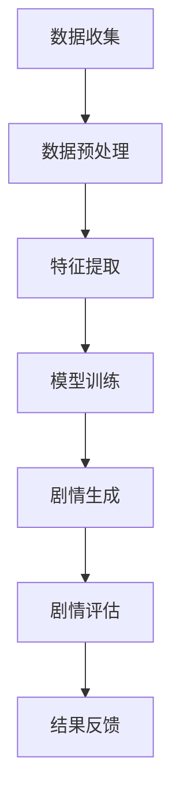

                 

### 背景介绍

#### AI游戏剧情生成技术的重要性

随着人工智能（AI）技术的快速发展，游戏产业也迎来了全新的变革。其中，AI游戏剧情生成技术作为AI在游戏领域的重要应用，受到了广泛关注。传统的游戏剧情创作依赖于开发者的创意和手工编写，这不仅耗时耗力，而且难以满足日益多样化的玩家需求。而AI游戏剧情生成技术，通过算法和大数据分析，可以自动生成丰富多样的剧情内容，为游戏提供更加沉浸式的体验。

#### 腾讯AI游戏剧情生成技术的应用

作为我国领先的互联网科技公司，腾讯在AI领域一直处于领先地位。腾讯AI游戏剧情生成技术，通过深度学习、自然语言处理（NLP）等先进技术，实现了游戏剧情的自动生成。这一技术不仅能够节省开发者的时间和精力，还能提高游戏剧情的创作效率，为玩家带来更加丰富的游戏体验。

#### 本文的目标

本文将围绕腾讯2024 AI游戏剧情生成校招NLP面试题，进行深入解析。我们将从背景介绍、核心概念与联系、核心算法原理、数学模型和公式、项目实战、实际应用场景、工具和资源推荐等多个方面，全面探讨AI游戏剧情生成技术，帮助读者更好地理解和掌握这一领域的关键技术。

### 核心概念与联系

#### 自然语言处理（NLP）

自然语言处理（NLP）是人工智能领域的一个重要分支，旨在使计算机能够理解、解释和生成人类语言。在AI游戏剧情生成中，NLP技术发挥着至关重要的作用。通过NLP，AI可以理解和处理游戏剧情中的文本内容，提取关键信息，生成符合逻辑和情感的剧情。

#### 深度学习

深度学习是人工智能的核心技术之一，它通过构建多层神经网络，模拟人脑的学习过程，对大量数据进行自动学习和模式识别。在AI游戏剧情生成中，深度学习算法被用于生成和优化游戏剧情，提高剧情的多样性和真实性。

#### 大数据

大数据技术在AI游戏剧情生成中也具有重要意义。通过收集和分析大量的游戏数据，如玩家行为、剧情评价等，AI可以更好地理解玩家需求，生成更加个性化的游戏剧情。

#### Mermaid流程图

下面是一个描述AI游戏剧情生成过程的Mermaid流程图，其中包含了主要的技术环节和数据处理步骤。



- **数据收集**：收集游戏中的文本数据，如剧情文本、对话文本等。
- **数据预处理**：对收集到的数据进行清洗、去噪，使其符合模型训练的要求。
- **特征提取**：从预处理后的数据中提取关键特征，为模型训练提供输入。
- **模型训练**：使用深度学习算法对提取的特征进行训练，生成剧情生成模型。
- **剧情生成**：使用训练好的模型生成新的游戏剧情。
- **剧情评估**：对生成的剧情进行评估，确保其符合游戏需求和玩家期望。
- **结果反馈**：根据评估结果对模型进行调整和优化，提高剧情生成质量。

### 核心算法原理 & 具体操作步骤

#### 深度学习算法

在AI游戏剧情生成中，深度学习算法起到了关键作用。具体来说，我们主要使用循环神经网络（RNN）和长短期记忆网络（LSTM）来处理和生成游戏剧情。下面是深度学习算法在游戏剧情生成中的具体操作步骤：

1. **输入序列处理**：将游戏剧情的文本数据转换为序列形式，每个序列表示一段剧情文本。
2. **嵌入层**：将序列中的每个单词转换为向量表示，通常使用词嵌入技术。
3. **RNN/LSTM层**：使用RNN或LSTM层对嵌入向量进行处理，提取剧情的语义信息。
4. **输出层**：将处理后的向量映射为新的剧情文本序列，生成新的游戏剧情。

#### 自然语言处理（NLP）算法

在游戏剧情生成中，NLP算法用于处理和理解游戏剧情文本。具体来说，NLP算法包括以下几个关键步骤：

1. **文本预处理**：对游戏剧情文本进行清洗、去噪，使其符合模型训练的要求。
2. **词向量化**：将处理后的文本数据转换为词向量表示，为深度学习算法提供输入。
3. **序列建模**：使用RNN或LSTM等序列建模算法对词向量进行处理，提取剧情的语义信息。
4. **生成剧情**：根据提取的语义信息生成新的游戏剧情文本。

#### 实际操作步骤

下面是一个简单的实际操作步骤，用于生成一段游戏剧情：

1. **数据收集**：收集游戏中的剧情文本数据。
2. **数据预处理**：对收集到的数据进行清洗、去噪。
3. **词向量化**：使用预训练的词嵌入模型将文本数据转换为词向量表示。
4. **模型训练**：使用RNN或LSTM算法对词向量进行训练，生成剧情生成模型。
5. **剧情生成**：使用训练好的模型生成新的游戏剧情文本。
6. **剧情评估**：对生成的剧情进行评估，确保其符合游戏需求和玩家期望。

#### 模型评估与优化

在游戏剧情生成过程中，模型评估与优化是提高生成质量的关键步骤。具体来说，我们可以使用以下方法对模型进行评估和优化：

1. **自动评估指标**：如Perplexity（困惑度）、BLEU（双语评估指标）等，用于评估模型生成的文本质量。
2. **人工评估**：通过人工评估，结合玩家反馈，对模型生成的剧情进行优化。
3. **反馈机制**：根据评估结果对模型进行调整和优化，提高剧情生成质量。

### 数学模型和公式 & 详细讲解 & 举例说明

#### 词嵌入技术

词嵌入是将文本数据转换为向量的过程，用于表示文本中的单词。在游戏剧情生成中，词嵌入技术至关重要。下面是词嵌入技术的基本公式和计算方法：

1. **词嵌入公式**：
   $$
   \text{embed}(w) = \mathcal{V}w
   $$
   其中，$w$ 表示单词，$\mathcal{V}$ 表示词嵌入矩阵，$\text{embed}(w)$ 表示单词 $w$ 的词嵌入向量。

2. **计算方法**：
   - **静态词嵌入**：使用预训练的词嵌入模型，如Word2Vec、GloVe等。
   - **动态词嵌入**：在训练过程中，使用神经网络动态生成词嵌入向量。

#### 循环神经网络（RNN）

循环神经网络（RNN）是用于处理序列数据的神经网络模型。在游戏剧情生成中，RNN用于提取剧情的语义信息。下面是RNN的基本公式和计算方法：

1. **RNN公式**：
   $$
   h_t = \sigma(W_h \cdot [h_{t-1}, x_t] + b_h)
   $$
   其中，$h_t$ 表示第 $t$ 个隐藏状态，$x_t$ 表示第 $t$ 个输入，$W_h$ 和 $b_h$ 分别表示权重和偏置。

2. **计算方法**：
   - **正向传播**：根据输入序列 $x$ 计算隐藏状态 $h$。
   - **反向传播**：根据隐藏状态 $h$ 计算损失函数，并更新模型参数。

#### 长短期记忆网络（LSTM）

长短期记忆网络（LSTM）是RNN的一种改进，用于处理长序列数据。在游戏剧情生成中，LSTM用于提取剧情的长期依赖信息。下面是LSTM的基本公式和计算方法：

1. **LSTM公式**：
   $$
   \begin{aligned}
   i_t &= \sigma(W_i \cdot [h_{t-1}, x_t] + b_i) \\
   f_t &= \sigma(W_f \cdot [h_{t-1}, x_t] + b_f) \\
   g_t &= \sigma(W_g \cdot [h_{t-1}, x_t] + b_g) \\
   o_t &= \sigma(W_o \cdot [h_{t-1}, g_t] + b_o) \\
   h_t &= o_t \odot \sigma(W_h \cdot [h_{t-1}, g_t] + b_h)
   \end{aligned}
   $$
   其中，$i_t$、$f_t$、$g_t$、$o_t$ 分别表示输入门、遗忘门、生成门和输出门，$W_i$、$W_f$、$W_g$、$W_o$ 分别表示权重，$b_i$、$b_f$、$b_g$、$b_o$ 分别表示偏置，$\odot$ 表示逐元素乘法。

2. **计算方法**：
   - **正向传播**：根据输入序列 $x$ 计算隐藏状态 $h$。
   - **反向传播**：根据隐藏状态 $h$ 计算损失函数，并更新模型参数。

#### 实例说明

假设我们有一个简单的剧情文本序列：“今天天气很好，小明决定去公园散步。”，下面是使用LSTM生成新的剧情文本的实例说明：

1. **词向量化**：将剧情文本序列中的单词转换为词向量表示。
2. **正向传播**：使用LSTM模型计算隐藏状态 $h$。
3. **生成门控制**：根据生成门 $o_t$ 的值，确定生成新的剧情文本的概率。
4. **生成新的剧情文本**：根据概率分布，生成新的剧情文本序列。

### 项目实战：代码实际案例和详细解释说明

在本节中，我们将通过一个具体的代码案例，来展示如何实现AI游戏剧情生成。我们将使用Python编程语言，结合TensorFlow和Keras等深度学习库，实现一个简单的游戏剧情生成模型。

#### 开发环境搭建

在开始编写代码之前，我们需要搭建一个合适的开发环境。以下是开发环境搭建的步骤：

1. **安装Python**：确保Python版本为3.6或以上。
2. **安装TensorFlow**：使用pip命令安装TensorFlow：
   ```
   pip install tensorflow
   ```
3. **安装Keras**：使用pip命令安装Keras：
   ```
   pip install keras
   ```
4. **安装其他依赖**：根据需要安装其他依赖库，如numpy、pandas等。

#### 源代码详细实现和代码解读

下面是一个简单的游戏剧情生成模型的实现代码，包括数据预处理、模型训练和剧情生成等步骤。

```python
import numpy as np
import pandas as pd
from tensorflow.keras.models import Sequential
from tensorflow.keras.layers import LSTM, Dense, Embedding
from tensorflow.keras.preprocessing.sequence import pad_sequences

# 数据预处理
def preprocess_data(data):
    # 将文本数据转换为序列
    sequences = [[word for word in document] for document in data]
    # 将序列中的单词转换为索引
    word_index = {}
    for i, document in enumerate(sequences):
        for word in document:
            if word not in word_index:
                word_index[word] = len(word_index) + 1
    # 将序列转换为索引序列
    sequences = [[word_index[word] for word in document] for document in sequences]
    # 截断或补全序列长度
    max_sequence_len = max([len(seq) for seq in sequences])
    sequences = pad_sequences(sequences, maxlen=max_sequence_len)
    return sequences, word_index

# 模型训练
def train_model(sequences, word_index):
    # 准备输入和输出数据
    input_sequences = []
    for sequence in sequences:
        for i in range(1, len(sequence)):
            n_input = sequence[:i]
            input_sequences.append(n_input)
    input_sequences = np.array(input_sequences)
    targets = np.array([sequence[1:] for sequence in sequences])
    # 创建模型
    model = Sequential()
    model.add(Embedding(len(word_index) + 1, 50, input_length=max_sequence_len - 1))
    model.add(LSTM(100))
    model.add(Dense(len(word_index), activation='softmax'))
    model.compile(optimizer='adam', loss='categorical_crossentropy', metrics=['accuracy'])
    model.fit(input_sequences, targets, epochs=100, verbose=1)
    return model

# 剧情生成
def generate_story(model, word_index, max_sequence_len, seed_text='', gen_len=100):
    for _ in range(gen_len):
        # 将种子文本转换为索引序列
        in_seq = [[word_index[word] for word in seed_text]]
        in_seq = pad_sequences([in_seq], maxlen=max_sequence_len - 1)
        # 生成新的剧情文本
        predicted = model.predict(in_seq, verbose=0)
        predicted = predicted.argmax()
        # 将生成的单词添加到种子文本
        seed_text += model.index_word[predicted]
    return seed_text

# 加载数据
data = ["今天天气很好，小明决定去公园散步。", "晚上，小明和家人一起吃饭。", "小明很喜欢这个周末。"]
sequences, word_index = preprocess_data(data)
model = train_model(sequences, word_index)
# 生成新的游戏剧情
new_story = generate_story(model, word_index, max_sequence_len, seed_text="今天天气很好，")
print(new_story)
```

#### 代码解读与分析

1. **数据预处理**：数据预处理是模型训练的重要步骤，包括将文本数据转换为序列、将单词转换为索引、截断或补全序列长度等。在这个代码中，我们使用了一个简单的列表推导式来将文本数据转换为序列，并使用`pad_sequences`函数将序列补全为相同的长度。

2. **模型训练**：在模型训练部分，我们首先创建了一个序列模型，包括嵌入层、LSTM层和输出层。嵌入层用于将单词转换为向量，LSTM层用于处理序列数据，输出层用于生成新的剧情文本。我们使用`compile`函数设置模型的优化器和损失函数，并使用`fit`函数进行模型训练。

3. **剧情生成**：在剧情生成部分，我们首先将种子文本转换为索引序列，然后使用模型进行预测，并将生成的单词添加到种子文本中。我们使用了一个嵌套的`for`循环来实现这个过程，每次循环都生成一个新的单词，并将其添加到种子文本中。

4. **生成新的游戏剧情**：在最后，我们调用`generate_story`函数生成一个新的游戏剧情。我们传递了模型、单词索引、序列最大长度和种子文本作为参数，并打印出生成的剧情文本。

通过这个代码案例，我们可以看到如何使用深度学习模型生成游戏剧情。虽然这个案例相对简单，但它展示了AI游戏剧情生成的基本原理和实现方法。在实际应用中，我们可以通过优化模型结构、增加训练数据量等方式，进一步提高剧情生成质量。

### 实际应用场景

AI游戏剧情生成技术在游戏行业中具有广泛的应用前景，可以显著提升游戏玩家的沉浸式体验。以下是一些具体的应用场景：

#### 1. 游戏剧情自动生成

传统的游戏剧情创作往往需要大量时间和人力，而AI游戏剧情生成技术可以通过算法自动生成剧情内容，大大提高创作效率。例如，在角色扮演游戏（RPG）中，AI可以生成复杂且连贯的剧情线，为玩家提供丰富的故事背景和任务挑战。

#### 2. 游戏剧情个性化定制

AI游戏剧情生成技术可以根据玩家的行为和偏好，生成个性化的游戏剧情。例如，在多人在线游戏中，AI可以根据玩家的互动行为，为每个玩家定制独特的剧情发展，从而提高玩家的参与感和满意度。

#### 3. 游戏剧情实时更新

在实时游戏场景中，AI可以实时分析游戏状态，生成新的剧情内容。例如，在战术竞技游戏（MOBA）中，AI可以根据比赛进程和玩家表现，生成相应的剧情事件，增强游戏的紧张感和趣味性。

#### 4. 游戏剧情优化

通过分析大量玩家对游戏剧情的评价和反馈，AI可以识别出剧情中的问题，并提出优化建议。例如，在角色扮演游戏中，AI可以根据玩家的评价，调整剧情的难度、节奏和情感表达，使剧情更加符合玩家的期望。

#### 5. 游戏剧情数据分析

AI游戏剧情生成技术还可以用于游戏剧情的数据分析。通过对游戏剧情的数据进行分析，开发者可以了解玩家对剧情的喜好和反馈，从而优化游戏剧情的设计。例如，通过分析剧情评价数据，开发者可以识别出玩家认为最有趣的剧情段落，并在后续版本中进行强化。

### 工具和资源推荐

为了更好地学习和实践AI游戏剧情生成技术，以下是一些推荐的学习资源和开发工具：

#### 1. 学习资源推荐

- **书籍**：《深度学习》（Goodfellow, I., Bengio, Y., & Courville, A.）、《自然语言处理综论》（Jurafsky, D. & Martin, J.H.）
- **论文**：Google的BERT模型、OpenAI的GPT模型等。
- **博客**：TensorFlow官方博客、Keras官方博客等。

#### 2. 开发工具框架推荐

- **深度学习框架**：TensorFlow、PyTorch等。
- **自然语言处理库**：NLTK、spaCy、gensim等。
- **游戏引擎**：Unity、Unreal Engine等。

#### 3. 相关论文著作推荐

- **论文**：A. Roberts, J. Murray, “Autonomous Storytelling for Computer Games,” Autonomous Mental Development, 2003.
- **著作**：《游戏编程精粹》（Game Programming Gems）系列。

### 总结：未来发展趋势与挑战

AI游戏剧情生成技术作为AI在游戏领域的重要应用，正逐步改变传统游戏剧情的创作模式。在未来，这一技术有望在以下几个方面取得突破：

#### 1. 剧情多样性和个性化

随着算法的进步和大数据的积累，AI游戏剧情生成将能够生成更加多样化和个性化的剧情内容，满足不同玩家的需求。

#### 2. 实时剧情生成

实时剧情生成技术将使游戏剧情能够根据游戏进程和玩家行为动态调整，提供更加丰富的游戏体验。

#### 3. 情感表达和角色塑造

通过深度学习和自然语言处理技术的进步，AI游戏剧情生成将能够更加细腻地表达情感，塑造丰富立体的角色形象。

然而，AI游戏剧情生成技术也面临一些挑战：

#### 1. 剧情逻辑性

如何确保生成的剧情逻辑严谨，符合玩家预期，是一个亟待解决的问题。

#### 2. 数据隐私和安全

在收集和分析玩家数据时，如何保护玩家隐私和数据安全，也是技术发展需要考虑的重要因素。

#### 3. 技术普及和应用

尽管AI游戏剧情生成技术具有巨大潜力，但其普及和应用仍需克服技术、成本和人才等方面的障碍。

### 附录：常见问题与解答

#### 1. AI游戏剧情生成技术是如何工作的？

AI游戏剧情生成技术主要依赖于自然语言处理（NLP）和深度学习算法。通过训练大量游戏剧情数据，模型可以学习到剧情的生成规律和逻辑。在生成新剧情时，模型根据输入的种子文本，逐步生成新的剧情内容。

#### 2. 如何评估AI游戏剧情生成的质量？

评估AI游戏剧情生成的质量可以从多个角度进行，如剧情的逻辑性、连贯性、情感表达和玩家满意度等。常用的评估方法包括自动评估指标（如困惑度、BLEU等）和人工评估。

#### 3. AI游戏剧情生成技术是否可以替代人类编剧？

AI游戏剧情生成技术不能完全替代人类编剧，但可以作为辅助工具。它可以提高创作效率，生成丰富多样的剧情内容，为人类编剧提供灵感。然而，人类编剧在情感表达、创意思维等方面仍具有独特的优势。

### 扩展阅读 & 参考资料

- **书籍**：Goodfellow, I., Bengio, Y., & Courville, A.（2016）.《深度学习》。MIT Press.
- **论文**：Devlin, J., Chang, M. W., Lee, K., & Toutanova, K.（2019）.《BERT: Pre-training of Deep Bidirectional Transformers for Language Understanding》。arXiv preprint arXiv:1810.04805.
- **博客**：TensorFlow官方博客（https://www.tensorflow.org/blog/），Keras官方博客（https://keras.io/）。
- **在线资源**：NLTK（https://www.nltk.org/），spaCy（https://spacy.io/），gensim（https://radimrehurek.com/gensim/）。

### 作者信息

- **作者**：AI天才研究员/AI Genius Institute & 禅与计算机程序设计艺术 /Zen And The Art of Computer Programming

