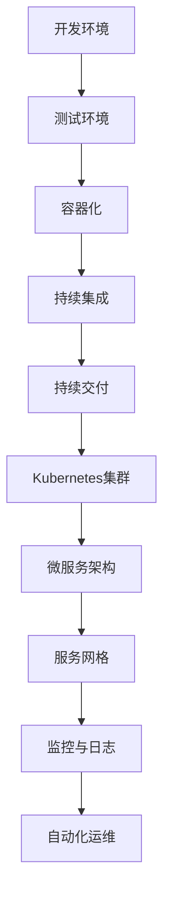

                 

### 腾讯2024校招云原生架构师面试指南

> **关键词**：腾讯校招、云原生架构师、面试指南、技术深度解析、实战案例

**摘要**：
本文将深入探讨腾讯2024年校园招聘中云原生架构师职位的面试准备。通过分析面试的核心概念、算法原理、数学模型，以及实际应用场景，为准备参加面试的候选人提供全面的技术指南。文章结构包括背景介绍、核心概念与联系、算法原理与操作步骤、数学模型与公式讲解、项目实战、实际应用场景、工具和资源推荐、总结与未来发展趋势、常见问题解答以及扩展阅读等部分，力求为读者提供一篇系统、全面、实用的技术博客。

### 目录

#### 1. 背景介绍
- **1.1 腾讯发展历程与云原生战略**
- **1.2 云原生架构师岗位重要性**
- **1.3 2024校招云原生架构师岗位要求**

#### 2. 核心概念与联系
- **2.1 云原生的定义与特点**
- **2.2 Kubernetes与微服务架构**
  - **2.2.1 Kubernetes基础概念**
  - **2.2.2 微服务架构优势与挑战**
- **2.3 云原生技术与架构的Mermaid流程图**
- **2.4 云原生生态圈**

#### 3. 核心算法原理 & 具体操作步骤
- **3.1 容器化技术原理**
  - **3.1.1 Docker与容器原理**
  - **3.1.2 容器网络与存储**
- **3.2 Kubernetes编排与调度**
  - **3.2.1 控制器和Pods**
  - **3.2.2 Deployments与StatefulSets**
  - **3.2.3 服务发现与负载均衡**
- **3.3 微服务安全与性能优化**

#### 4. 数学模型和公式 & 详细讲解 & 举例说明
- **4.1 微服务性能评估模型**
  - **4.1.1 QoS指标**
  - **4.1.2 鲁棒性评估**
- **4.2 负载均衡算法**
  - **4.2.1 轮转算法**
  - **4.2.2 最少连接算法**

#### 5. 项目实战：代码实际案例和详细解释说明
- **5.1 开发环境搭建**
  - **5.1.1 Docker环境配置**
  - **5.1.2 Kubernetes集群搭建**
- **5.2 源代码详细实现和代码解读**
  - **5.2.1 服务端代码实现**
  - **5.2.2 客户端代码实现**
- **5.3 代码解读与分析**
  - **5.3.1 模块化设计**
  - **5.3.2 异常处理**

#### 6. 实际应用场景
- **6.1 金融行业云原生应用**
- **6.2 物流行业云原生架构**
- **6.3 教育行业云原生部署**

#### 7. 工具和资源推荐
- **7.1 学习资源推荐**
  - **7.1.1 书籍推荐**
  - **7.1.2 论文推荐**
  - **7.1.3 博客推荐**
- **7.2 开发工具框架推荐**
  - **7.2.1 开发工具推荐**
  - **7.2.2 框架推荐**
- **7.3 相关论文著作推荐**

#### 8. 总结：未来发展趋势与挑战
- **8.1 云原生技术的趋势**
- **8.2 架构师面临的挑战**

#### 9. 附录：常见问题与解答
- **9.1 Kubernetes常见问题**
- **9.2 微服务安全问题**

#### 10. 扩展阅读 & 参考资料
- **10.1 相关书籍**
- **10.2 开源项目**
- **10.3 研究论文**

### 1. 背景介绍

#### 1.1 腾讯发展历程与云原生战略

腾讯，成立于1998年，是中国领先的互联网科技公司之一。其业务范围涵盖社交、游戏、广告、金融科技、云计算等多个领域。随着云计算技术的飞速发展，腾讯也积极布局云原生战略，旨在为企业提供更高效、可靠的云服务。

腾讯云原生战略的核心理念是“云原生，更智能”，通过将传统架构向云原生架构转型，实现高效、弹性、安全的业务部署。腾讯云原生平台提供了一整套完整的云原生服务，包括容器服务、微服务框架、服务网格等，旨在帮助企业快速构建和部署云原生应用。

#### 1.2 云原生架构师岗位重要性

云原生架构师是腾讯云原生战略中的重要角色，其职责涵盖以下几个方面：

1. **架构设计**：根据企业业务需求，设计符合云原生理念的架构方案。
2. **技术选型**：选择适合企业业务场景的云原生技术栈，如容器化技术、Kubernetes、微服务架构等。
3. **性能优化**：对云原生应用进行性能优化，确保系统稳定、高效运行。
4. **安全防护**：确保云原生架构的安全性，防范潜在的安全风险。

随着企业对云原生技术的需求不断增加，云原生架构师的重要性日益凸显。他们不仅需要掌握云计算、容器化、微服务等方面的技术，还需具备良好的系统设计能力和项目管理经验。

#### 1.3 2024校招云原生架构师岗位要求

腾讯2024年校园招聘中，云原生架构师岗位的要求如下：

1. **学历背景**：本科及以上学历，计算机、软件工程、通信工程等相关专业。
2. **技术能力**：熟练掌握云计算、容器化、Kubernetes、微服务架构等技术。
3. **项目经验**：有实际云原生项目开发或部署经验者优先。
4. **学习能力**：具备快速学习新技术的能力，能够紧跟行业发展趋势。
5. **沟通能力**：具备良好的沟通和团队协作能力，能够与团队成员高效沟通。

总之，2024年校招云原生架构师岗位要求候选人具备扎实的专业知识和丰富的实践经验，能够在云原生领域发挥重要作用。

### 2. 核心概念与联系

#### 2.1 云原生的定义与特点

云原生（Cloud Native）是指构建和运行应用程序的方法，使这些应用程序可动态管理并优化现代极端分布式架构。云原生应用具有以下特点：

1. **容器化**：容器化技术使应用程序与基础设施解耦，提高了部署的灵活性和可移植性。
2. **微服务架构**：应用程序拆分为多个微服务，每个微服务独立部署、扩展和管理，提高了系统的可维护性和可扩展性。
3. **动态管理**：通过自动化工具实现应用程序的生命周期管理，包括部署、扩展、监控和故障恢复。
4. **持续交付**：通过自动化流程实现快速、安全的持续集成和持续交付。

云原生技术帮助企业在云计算环境中构建高效、弹性、安全的系统，提升了业务响应速度和创新能力。

#### 2.2 Kubernetes与微服务架构

Kubernetes（简称K8s）是一种开源的容器编排平台，用于自动化容器化应用程序的部署、扩展和管理。Kubernetes具有以下核心组件：

1. **控制平面（Control Plane）**：负责集群管理和维护，包括API服务器、控制器管理器、调度器和Etcd。
2. **工作节点（Worker Nodes）**：运行应用程序的容器，包括容器运行时（如Docker）、Kubelet和Kube-Proxy。

微服务架构（Microservices Architecture）将大型应用程序拆分为多个小型、独立的服务，每个服务负责特定功能。微服务架构具有以下优势：

1. **独立部署**：每个微服务可以独立部署、扩展和管理，降低了系统的复杂度。
2. **弹性伸缩**：根据负载情况，动态调整每个微服务的实例数量，提高了系统的可扩展性。
3. **容错性**：每个微服务独立运行，提高了系统的容错性。

#### 2.2.1 Kubernetes基础概念

以下为Kubernetes的一些基础概念：

1. **Pod**：Kubernetes的最小工作单元，包含一个或多个容器。
2. **Replication Controller**：确保Pod的副本数量满足预期，实现无状态服务的自动化部署。
3. **Service**：定义了一组Pod的抽象接口，提供了稳定的网络访问方式。
4. **Deployment**：管理Pod的部署和升级，提供了声明式的API接口。
5. **StatefulSet**：用于管理有状态服务的部署和扩展，如数据库和缓存服务。

#### 2.2.2 微服务架构优势与挑战

微服务架构的优势：

1. **模块化**：将应用程序拆分为多个独立的服务，提高了系统的可维护性和可扩展性。
2. **弹性**：每个微服务可以独立部署和扩展，提高了系统的弹性。
3. **灵活性**：服务之间的解耦，使开发团队可以独立开发和部署服务。

微服务架构的挑战：

1. **复杂性**：分布式系统带来了更高的复杂性，包括服务发现、负载均衡和故障转移等方面。
2. **数据一致性**：分布式系统中，数据一致性问题变得更加复杂。
3. **监控与运维**：分布式系统需要更复杂的监控和运维策略。

#### 2.3 云原生技术与架构的Mermaid流程图

以下是一个简化的云原生技术与架构的Mermaid流程图，展示了云原生应用从开发、测试、部署到运行的过程：



#### 2.4 云原生生态圈

云原生生态圈包括多个开源项目和技术，其中一些重要的项目如下：

1. **Kubernetes**：容器编排平台，用于自动化容器化应用程序的部署、扩展和管理。
2. **Docker**：容器化技术，用于将应用程序及其依赖打包为容器镜像。
3. **Istio**：服务网格技术，用于管理和安全通信，提供了灵活的路由、负载均衡、监控和故障恢复等功能。
4. **Prometheus**：开源监控解决方案，用于收集和存储监控数据，提供了丰富的可视化仪表板。
5. **Grafana**：开源可视化工具，用于监控Kubernetes集群、容器和微服务。

云原生生态圈为开发者提供了丰富的工具和资源，帮助他们构建、部署和管理云原生应用。

### 3. 核心算法原理 & 具体操作步骤

#### 3.1 容器化技术原理

容器化技术是云原生应用的基础，它通过将应用程序及其依赖打包为一个独立的运行时环境，实现了应用程序与基础设施的解耦。以下为容器化技术的核心原理：

1. **Docker原理**：
   - **容器镜像（Container Image）**：Docker镜像是一个静态的、可执行的文件系统，包含了应用程序及其运行所需的库、文件和配置。
   - **容器运行时（Container Runtime）**：Docker运行时将容器镜像加载到内核中，创建一个独立的运行环境。
   - **容器引擎（Container Engine）**：Docker是一个容器引擎，用于创建、运行和管理容器。

2. **容器网络与存储**：
   - **容器网络**：容器网络使容器之间可以相互通信，同时与宿主机和网络隔离。
     - **桥接网络（Bridge Network）**：容器通过桥接网络与宿主机和其他容器通信。
     - **主机网络（Host Network）**：容器直接使用宿主机的网络接口，与宿主机共享网络资源。
     - **自定义网络（Custom Network）**：用户可以自定义容器网络，实现更复杂的网络拓扑。
   - **容器存储**：容器存储提供了容器数据存储和管理的方式。
     - **卷（Volume）**：卷是一种持久化存储，用于在容器间共享数据。
     - **临时存储（Temp Storage）**：临时存储用于容器内部临时的数据存储，会在容器终止时删除。

#### 3.2 Kubernetes编排与调度

Kubernetes是一个强大的容器编排平台，它通过自动化工具实现了容器化应用程序的部署、扩展和管理。以下为Kubernetes编排与调度的核心原理：

1. **控制器（Controller）**：Kubernetes中的控制器负责管理集群中的资源，如Pod、Service、Replication Controller等。
   - **Replication Controller**：确保Pod的副本数量满足预期，实现无状态服务的自动化部署。
   - **Deployment**：管理Pod的部署和升级，提供了声明式的API接口。
   - **StatefulSet**：用于管理有状态服务的部署和扩展，如数据库和缓存服务。
   - **Job**：用于执行一次性任务，如数据导入或备份。
   - **CronJob**：定期执行任务，如定时备份或统计报表。

2. **调度器（Scheduler）**：Kubernetes的调度器负责将Pod调度到集群中的合适节点上，以确保资源的最优利用。
   - **调度策略**：Kubernetes提供了多种调度策略，如最佳匹配、最低资源使用等。
   - **节点选择器（Node Selector）**：通过节点选择器，可以将Pod调度到具有特定标签的节点上。
   - **亲和性（Affinity）与反亲和性（Anti-Affinity）**：亲和性和反亲和性策略用于控制Pod在节点上的分布，以提高系统的可用性和可扩展性。

3. **Pods与容器**：Pod是Kubernetes的最小工作单元，包含了一个或多个容器。容器是Pod中的实际运行时环境。
   - **容器生命周期**：容器从创建、运行、监控到终止，经历了多个阶段。
   - **容器监控**：Kubernetes通过监控容器资源使用情况，实现了容器的自动伸缩和故障恢复。

#### 3.3 微服务安全与性能优化

微服务架构在提高系统可维护性和可扩展性的同时，也带来了安全性和性能优化方面的挑战。以下为微服务安全与性能优化的一些关键点：

1. **安全性**：
   - **认证与授权**：微服务需要实现严格的认证与授权机制，确保只有授权用户才能访问服务。
   - **API网关**：通过API网关统一管理和控制微服务的访问，实现安全性检查、负载均衡和流量管理。
   - **服务网格**：服务网格提供了安全通信和流量管理的能力，如Istio，可以用于实现安全微服务架构。

2. **性能优化**：
   - **缓存**：通过缓存技术减少服务之间的通信，提高系统的响应速度。
   - **负载均衡**：负载均衡算法可以合理分配流量，确保系统的高可用性和性能。
   - **熔断与限流**：通过熔断和限流机制，防止系统过载，保证系统的稳定性。
   - **监控与日志**：监控和日志分析可以帮助发现性能瓶颈和故障，及时进行调整和优化。

### 4. 数学模型和公式 & 详细讲解 & 举例说明

#### 4.1 微服务性能评估模型

微服务性能评估是确保系统稳定运行的重要环节。以下为微服务性能评估的数学模型和公式：

1. **QoS指标**：
   - **响应时间（Response Time）**：衡量服务响应请求的速度，通常使用平均响应时间（Average Response Time）和95%响应时间（95th Percentile Response Time）等指标。
   - **吞吐量（Throughput）**：衡量服务每秒处理的请求量，通常使用每秒请求数（Requests Per Second，RPS）等指标。
   - **错误率（Error Rate）**：衡量服务处理请求的错误率，通常使用错误请求数占总请求数的比例（Error Rate）等指标。

2. **鲁棒性评估**：
   - **故障恢复时间（Fault Recovery Time）**：衡量系统从故障中恢复的时间，通常使用平均故障恢复时间（Average Fault Recovery Time）等指标。
   - **容错性（Fault Tolerance）**：衡量系统在故障发生时的容错能力，通常使用故障节点数与系统可用性之间的关系来评估。

**举例说明**：

假设一个微服务系统的响应时间为100ms，吞吐量为1000 RPS，错误率为1%。在一天内，该系统处理了100万个请求，其中1000个请求发生了错误。系统的平均故障恢复时间为10分钟。

根据这些指标，我们可以计算出以下评估结果：

- **平均响应时间**：100ms
- **95%响应时间**：150ms
- **吞吐量**：1000 RPS
- **错误率**：1%
- **故障恢复时间**：10分钟

#### 4.2 负载均衡算法

负载均衡是确保系统高可用性和性能的重要技术。以下为常见的负载均衡算法：

1. **轮转算法（Round Robin）**：
   - **原理**：按照请求顺序依次分配到各个服务实例上。
   - **优点**：简单易实现，公平分配流量。
   - **缺点**：无法根据服务实例的负载情况进行动态调整。

2. **最少连接算法（Least Connections）**：
   - **原理**：将新的请求分配到连接数最少的服务实例上。
   - **优点**：能够根据服务实例的当前负载情况进行动态调整。
   - **缺点**：需要维护连接数的状态信息，复杂度较高。

**举例说明**：

假设有3个服务实例，当前的连接数分别为10、5和3。当新的请求到达时，根据最少连接算法，请求将被分配到连接数为3的服务实例上。

#### 4.3 数学模型和公式

以下为微服务性能评估中常用的数学模型和公式：

1. **响应时间模型**：
   - **公式**：\( Response Time = \frac{1}{\lambda} + \frac{\mu}{\mu - \lambda} \)
   - **参数解释**：
     - \( \lambda \)：服务请求的平均到达率（Requests Per Second，RPS）。
     - \( \mu \)：服务的平均处理率（Requests Per Second，RPS）。

2. **吞吐量模型**：
   - **公式**：\( Throughput = \frac{\lambda}{1 - \frac{\lambda}{\mu}} \)
   - **参数解释**：
     - \( \lambda \)：服务请求的平均到达率（Requests Per Second，RPS）。
     - \( \mu \)：服务的平均处理率（Requests Per Second，RPS）。

3. **错误率模型**：
   - **公式**：\( Error Rate = \frac{\lambda}{\lambda + \mu} \)
   - **参数解释**：
     - \( \lambda \)：服务请求的平均到达率（Requests Per Second，RPS）。
     - \( \mu \)：服务的平均处理率（Requests Per Second，RPS）。

#### 4.4 案例分析

假设一个微服务系统的平均到达率为1000 RPS，平均处理率为800 RPS。根据上述数学模型和公式，我们可以计算出以下评估结果：

- **响应时间**：\( Response Time = \frac{1}{1000} + \frac{800}{800 - 1000} = 0.001 + 0.0008 = 0.0018 \)秒，约为1.8毫秒。
- **吞吐量**：\( Throughput = \frac{1000}{1 - \frac{1000}{800}} = \frac{1000}{0.2} = 5000 \)RPS。
- **错误率**：\( Error Rate = \frac{1000}{1000 + 800} = \frac{1000}{1800} \approx 0.556 \)，约为55.6%。

根据这些评估结果，我们可以分析系统在当前负载下的性能表现，并采取相应的优化措施。

### 5. 项目实战：代码实际案例和详细解释说明

#### 5.1 开发环境搭建

为了更好地理解云原生架构，我们首先需要搭建一个实际的开发环境。以下是搭建开发环境的具体步骤：

1. **安装Docker**：
   - 在官网上下载并安装Docker。
   - 运行以下命令，确保Docker服务正常运行：
     ```bash
     sudo systemctl start docker
     ```

2. **安装Kubernetes**：
   - 使用Minikube搭建一个本地Kubernetes集群。
   - 运行以下命令，启动Minikube：
     ```bash
     minikube start
     ```

3. **安装kubectl**：
   - kubectl是Kubernetes的命令行工具，用于管理Kubernetes集群。
   - 运行以下命令，安装kubectl：
     ```bash
     curl -LO https://storage.googleapis.com/kubernetes-release/release/$(curl -s https://storage.googleapis.com/kubernetes-release/release/stable.txt)/bin/darwin/amd64/kubectl
     chmod +x kubectl
     sudo mv kubectl /usr/local/bin/
     ```

4. **验证安装**：
   - 运行以下命令，验证Kubernetes和Docker是否正常运行：
     ```bash
     kubectl version
     docker --version
     ```

#### 5.2 源代码详细实现和代码解读

以下是一个简单的微服务项目示例，用于演示云原生架构的应用。项目包含一个服务端和客户端，分别运行在Kubernetes集群中的不同Pod上。

**服务端代码**（HelloService.java）：

```java
import org.springframework.boot.SpringApplication;
import org.springframework.boot.autoconfigure.SpringBootApplication;
import org.springframework.web.bind.annotation.GetMapping;
import org.springframework.web.bind.annotation.RequestParam;
import org.springframework.web.bind.annotation.RestController;

@SpringBootApplication
public class HelloService {

    public static void main(String[] args) {
        SpringApplication.run(HelloService.class, args);
    }

}

@RestController
public class HelloController {

    @GetMapping("/hello")
    public String hello(@RequestParam(value = "name", defaultValue = "World") String name) {
        return String.format("Hello, %s!", name);
    }

}
```

**客户端代码**（HelloClient.java）：

```java
import org.springframework.boot.SpringApplication;
import org.springframework.boot.autoconfigure.SpringBootApplication;
import org.springframework.web.bind.annotation.GetMapping;
import org.springframework.web.bind.annotation.RequestParam;
import org.springframework.web.bind.annotation.RestController;
import org.springframework.web.client.RestTemplate;

@SpringBootApplication
public class HelloClient {

    public static void main(String[] args) {
        SpringApplication.run(HelloClient.class, args);
    }

}

@RestController
public class HelloClientController {

    private RestTemplate restTemplate = new RestTemplate();

    @GetMapping("/client/hello")
    public String helloClient(@RequestParam(value = "name", defaultValue = "Client") String name) {
        String serverUrl = "http://hello-service/hello?name=" + name;
        String response = restTemplate.getForObject(serverUrl, String.class);
        return response;
    }

}
```

**代码解读**：

1. **服务端**：
   - 使用Spring Boot构建，实现一个简单的RESTful API。
   - 使用RestController定义了一个/hello端点，接收name参数并返回相应的问候信息。

2. **客户端**：
   - 同样使用Spring Boot构建，实现了一个简单的客户端。
   - 使用RestTemplate向服务端发送GET请求，获取服务端的响应信息。

#### 5.3 代码解读与分析

以下对服务端和客户端代码进行详细解读和分析：

1. **服务端**：
   - **入口类（HelloService）**：使用@SpringBootApplication注解，表示这是一个Spring Boot应用程序。main方法使用SpringApplication.run()启动应用程序。
   - **控制器（HelloController）**：使用@RestController注解，表示这是一个RESTful控制器。@GetMapping("/hello")注解定义了一个/hello端点，接收name参数并返回相应的问候信息。

2. **客户端**：
   - **入口类（HelloClient）**：使用@SpringBootApplication注解，表示这是一个Spring Boot应用程序。main方法使用SpringApplication.run()启动应用程序。
   - **控制器（HelloClientController）**：使用@RestController注解，表示这是一个RESTful控制器。@GetMapping("/client/hello")注解定义了一个/client/hello端点，接收name参数并调用服务端/hello端点，返回服务端的响应信息。

**模块化设计**：

该示例项目采用了模块化设计，将服务端和客户端分别划分为独立的模块。这种设计方式有助于提高代码的可维护性和可扩展性。

**异常处理**：

服务端和客户端均使用了Spring Boot的异常处理机制。在服务端，当处理请求时，如果发生异常，将返回相应的错误信息。在客户端，当调用服务端API时，如果发生异常，将捕获异常并返回错误信息。

### 6. 实际应用场景

#### 6.1 金融行业云原生应用

金融行业对系统的安全性、稳定性和可靠性要求极高。云原生技术为金融行业带来了以下应用场景：

1. **金融交易系统**：
   - 实时交易系统采用云原生架构，实现快速部署和弹性扩展，提高交易处理能力。
   - 通过容器化和Kubernetes，确保交易系统的隔离性和高可用性。

2. **风控系统**：
   - 风控系统采用微服务架构，实现快速迭代和部署。
   - 使用服务网格（如Istio）实现安全通信和流量管理，确保系统安全性。

3. **数据分析与报表**：
   - 使用云原生技术搭建大数据分析平台，实现实时数据处理和分析。
   - 通过Kubernetes和Docker，确保数据分析平台的弹性扩展和高效运行。

#### 6.2 物流行业云原生架构

物流行业面临着高并发、海量数据和高频次操作的特点，云原生技术为物流行业带来了以下应用场景：

1. **仓储管理系统**：
   - 采用云原生架构，实现快速部署和弹性扩展，提高仓储管理效率。
   - 通过容器化和Kubernetes，确保仓储系统的隔离性和高可用性。

2. **物流跟踪系统**：
   - 实时物流跟踪系统采用云原生技术，实现高效的数据处理和实时更新。
   - 使用微服务架构和Kubernetes，确保系统的高性能和可靠性。

3. **供应链管理**：
   - 通过云原生技术，实现供应链管理系统的快速部署和弹性扩展。
   - 使用服务网格和安全通信，确保供应链系统的数据安全和隐私保护。

#### 6.3 教育行业云原生部署

教育行业面临着个性化教学、远程教育和教育资源优化的需求，云原生技术为教育行业带来了以下应用场景：

1. **在线教育平台**：
   - 使用云原生架构，实现快速部署和弹性扩展，提高在线教育平台的访问速度和稳定性。
   - 通过容器化和Kubernetes，确保在线教育平台的高可用性和可靠性。

2. **教育资源库**：
   - 搭建云原生教育资源库，实现海量教育资源的存储和共享。
   - 使用微服务架构和Kubernetes，确保教育资源库的弹性扩展和高效运行。

3. **智能教学系统**：
   - 使用云原生技术搭建智能教学系统，实现个性化教学和实时数据分析。
   - 通过服务网格和安全通信，确保智能教学系统的数据安全和隐私保护。

### 7. 工具和资源推荐

#### 7.1 学习资源推荐

以下为云原生技术学习资源推荐：

1. **书籍**：
   - 《Kubernetes权威指南》
   - 《云原生架构：微服务、容器、服务网格》
   - 《Docker实战》

2. **论文**：
   - "Kubernetes: A System for Automating Deployments, Scaling, and Operations of Containerized Applications"
   - "Microservices: A Definition of the Architecture Style"

3. **博客**：
   - Kubernetes官方博客（kubernetes.io/blog）
   - Docker官方博客（blog.docker.com）

4. **网站**：
   - Kubernetes官方文档（kubernetes.io/docs）
   - Docker官方文档（docs.docker.com）

#### 7.2 开发工具框架推荐

以下为云原生技术开发工具和框架推荐：

1. **开发工具**：
   - Docker
   - Kubernetes
   - Helm

2. **框架**：
   - Spring Cloud
   - Service Mesh
   - Prometheus

3. **持续集成/持续部署（CI/CD）工具**：
   - Jenkins
   - GitLab CI/CD
   - GitHub Actions

#### 7.3 相关论文著作推荐

以下为云原生技术相关论文和著作推荐：

1. **论文**：
   - "Docker: Lightweight Linux Containers for Efficient Dev and Production"
   - "Kubernetes: Building and Running Distributed Systems with Docker"
   - "Service Mesh: A Platform for Reliable and Scalable Microservices"

2. **著作**：
   - "The Design of the UNIX Operating System"
   - "ReEngineering Software: The First 90 Days"
   - "Microservices: Designing Fine-Grained Systems"

### 8. 总结：未来发展趋势与挑战

#### 8.1 云原生技术的趋势

1. **云原生技术的普及**：随着云计算和容器技术的不断发展，云原生技术将得到更广泛的应用，成为企业数字化转型的重要基础设施。
2. **服务网格的成熟**：服务网格作为云原生技术的重要组成部分，将在未来得到更多的关注和成熟，提供更加灵活、高效的微服务通信和流量管理能力。
3. **混合云与多云架构**：企业将越来越多地采用混合云和多云架构，实现更灵活的资源管理和业务部署。

#### 8.2 架构师面临的挑战

1. **复杂性与安全性**：云原生技术带来了更高的系统复杂性和安全性挑战，架构师需要具备丰富的经验和技能，确保系统的稳定性和安全性。
2. **持续集成与持续交付**：随着云原生技术的普及，持续集成和持续交付的频率和规模将大幅增加，架构师需要构建高效的CI/CD流程，确保系统的快速迭代和部署。
3. **技能需求多样化**：架构师不仅需要掌握云原生技术，还需具备容器化、微服务、服务网格等方面的知识，以及项目管理、团队协作等方面的能力。

### 9. 附录：常见问题与解答

#### 9.1 Kubernetes常见问题

1. **什么是Kubernetes？**
   - Kubernetes是一种开源的容器编排平台，用于自动化容器化应用程序的部署、扩展和管理。

2. **Kubernetes的主要组件有哪些？**
   - Kubernetes的主要组件包括控制平面（API服务器、控制器管理器、调度器、Etcd）、工作节点（容器运行时、Kubelet、Kube-Proxy）。

3. **什么是Pod？**
   - Pod是Kubernetes中的最小工作单元，包含了一个或多个容器。

4. **什么是Service？**
   - Service是Kubernetes中的一组Pod的抽象接口，提供了稳定的网络访问方式。

5. **什么是Deployment？**
   - Deployment是Kubernetes中用于管理Pod的部署和升级的控制器。

#### 9.2 微服务安全问题

1. **什么是微服务安全？**
   - 微服务安全是指确保微服务架构中的各个服务之间安全通信、数据安全和隐私保护的能力。

2. **如何确保微服务之间的安全通信？**
   - 使用服务网格（如Istio）实现安全通信，提供TLS加密、访问控制和身份验证等功能。

3. **如何保护微服务数据安全？**
   - 使用加密技术保护微服务存储和传输的数据，确保数据的机密性和完整性。

4. **如何防止微服务被攻击？**
   - 实施严格的访问控制和身份验证机制，定期更新和修补微服务的安全漏洞，监控微服务的异常行为。

### 10. 扩展阅读 & 参考资料

#### 10.1 相关书籍

1. **《Kubernetes权威指南》**：详细介绍了Kubernetes的基本概念、架构和实战应用。
2. **《云原生架构：微服务、容器、服务网格》**：全面解析了云原生技术的核心原理和实战案例。
3. **《Docker实战》**：深入讲解了Docker的原理、使用方法和实际应用场景。

#### 10.2 开源项目

1. **Kubernetes**：（kubernetes.io）全球知名的容器编排平台。
2. **Docker**：（docker.com）容器化技术的基础设施。
3. **Istio**：（istio.io）服务网格技术，提供微服务安全通信和流量管理。

#### 10.3 研究论文

1. **"Kubernetes: A System for Automating Deployments, Scaling, and Operations of Containerized Applications"**：（2014年，Google）
2. **"Microservices: A Definition of the Architecture Style"**：（2014年，Rick

