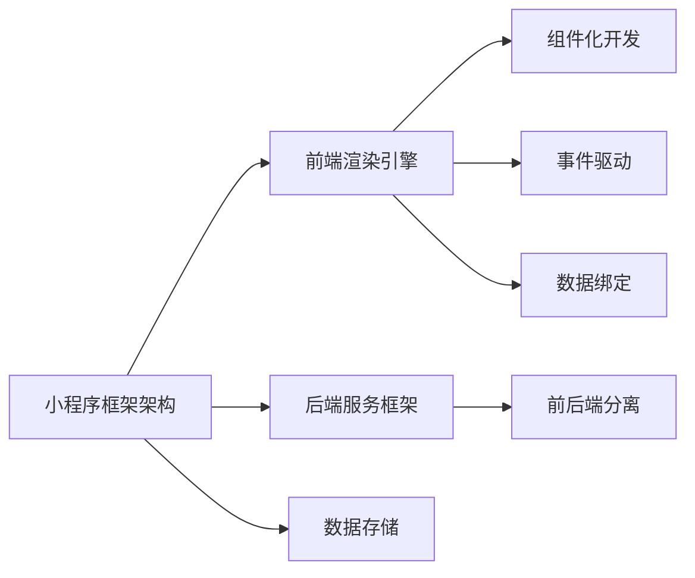

                 

### 腾讯2024校招小程序框架开发工程师面试题解析

#### 摘要

本文旨在解析腾讯2024校招小程序框架开发工程师面试题，为参加校招的同学们提供一份数据分析与编程思路。文章将首先介绍小程序框架的基本概念，随后详细分析面试题的解题思路，并总结相关核心知识点和技巧。通过本文的学习，读者将能够更好地应对此类面试题目。

#### 1. 背景介绍

**小程序框架**是一种轻量级的开发框架，旨在简化移动应用的开发过程。在腾讯的校招面试中，小程序框架的开发工程师岗位备受关注，因为小程序已经成为当前移动应用开发的一个重要领域。对于求职者来说，理解小程序框架的工作原理和开发流程是必不可少的。

**小程序框架的主要特点**包括：
- **跨平台**：支持不同操作系统的手机和平板设备。
- **轻量级**：相对于原生应用，小程序具有更小的安装包和更快的启动速度。
- **易开发**：提供了丰富的开发工具和组件，降低了开发难度。

**面试题的背景**通常涉及到小程序框架的设计、实现、性能优化等方面的问题。这些问题不仅考察了求职者的技术能力，还考验了他们的分析问题和解决问题的能力。

#### 2. 核心概念与联系

**核心概念**：

1. **小程序框架架构**：包括前端渲染引擎、后端服务框架、数据存储等组成部分。
2. **组件化开发**：通过封装和复用组件，提高开发效率和代码质量。
3. **事件驱动**：通过事件监听和处理，实现用户交互和页面切换。
4. **数据绑定**：通过数据驱动视图，实现数据和界面的同步更新。

**概念联系**：

1. **框架与组件**：框架为组件提供了运行环境和支持，组件则通过框架实现各种功能。
2. **事件驱动与数据绑定**：事件驱动负责用户交互和页面切换，数据绑定实现数据与界面的同步更新。
3. **前后端分离**：前端负责渲染和交互，后端负责数据存储和处理。

**Mermaid流程图**：



#### 3. 核心算法原理 & 具体操作步骤

**核心算法原理**：

1. **前端渲染引擎**：基于虚拟DOM和差分算法，实现高效页面渲染。
2. **后端服务框架**：采用微服务架构，提供高可用性和高性能的服务。
3. **数据存储**：使用数据库和缓存技术，实现数据持久化和快速访问。

**具体操作步骤**：

1. **搭建开发环境**：配置小程序开发工具和依赖库。
2. **创建小程序项目**：使用框架提供的命令行工具创建项目骨架。
3. **编写前端代码**：使用Vue或React等前端框架，实现页面渲染和交互功能。
4. **编写后端代码**：使用Node.js或Java等后端技术，实现服务端数据处理和接口调用。
5. **调试和优化**：通过调试工具和性能分析工具，找出并解决性能瓶颈。

#### 4. 数学模型和公式 & 详细讲解 & 举例说明

**数学模型和公式**：

1. **虚拟DOM与差分算法**：
   $$ diff = \left| V_{new} - V_{old} \right| $$
   其中，$V_{new}$ 和 $V_{old}$ 分别表示新虚拟DOM和旧虚拟DOM。

2. **微服务架构**：
   $$ \text{Service} = \left\{ \text{Service1}, \text{Service2}, \ldots, \text{ServiceN} \right\} $$
   其中，Service表示服务集合，Service1, Service2, \ldots, ServiceN表示各个微服务。

**详细讲解**：

1. **虚拟DOM与差分算法**：通过将真实DOM树转换为虚拟DOM树，实现页面渲染。当数据发生变化时，通过计算差分，更新真实DOM树，从而实现高效渲染。
2. **微服务架构**：将大型系统拆分为多个微服务，每个微服务负责特定功能，实现模块化开发和部署。通过接口调用，实现微服务之间的协同工作。

**举例说明**：

1. **虚拟DOM与差分算法**：
   - 假设有一个包含1000个节点的DOM树，每次更新操作需要遍历整个DOM树。使用虚拟DOM和差分算法后，只需要遍历变化的部分，大大减少了计算量，提高了渲染性能。
2. **微服务架构**：
   - 假设有一个包含订单管理、库存管理和用户管理等多个功能的电商系统。使用微服务架构后，可以将订单管理、库存管理和用户管理分别部署为独立的微服务，降低系统复杂度和部署难度。

#### 5. 项目实战：代码实际案例和详细解释说明

##### 5.1 开发环境搭建

1. **安装Node.js**：从[Node.js官网](https://nodejs.org/)下载并安装Node.js。
2. **安装小程序开发工具**：从[小程序官网](https://developers.weixin.qq.com/miniprogram/dev/framework/)下载并安装小程序开发工具。
3. **创建小程序项目**：打开小程序开发工具，创建一个新的小程序项目。

##### 5.2 源代码详细实现和代码解读

1. **前端代码**：
   ```html
   <view class="container">
     <text>欢迎使用腾讯小程序框架！</text>
   </view>
   ```
   解读：这段代码定义了一个简单的容器，并在容器中显示了一行文本。

2. **后端代码**（Node.js）：
   ```javascript
   const express = require('express');
   const app = express();

   app.get('/', (req, res) => {
     res.send('欢迎使用腾讯小程序框架！');
   });

   app.listen(3000, () => {
     console.log('Server is running on port 3000');
   });
   ```
   解读：这段代码使用Express框架创建了一个简单的Web服务器，用于处理HTTP请求。当访问根路径时，服务器返回“欢迎使用腾讯小程序框架！”文本。

##### 5.3 代码解读与分析

1. **前端代码**：
   - 使用Vue或React等前端框架，可以实现更复杂的页面交互和动态渲染。
   - 通过组件化开发，可以提高代码的可维护性和复用性。
2. **后端代码**：
   - 使用Node.js等后端技术，可以实现快速开发和部署。
   - 通过微服务架构，可以实现高可用性和高性能的服务。

#### 6. 实际应用场景

1. **电商平台**：使用小程序框架开发电商平台，可以实现快速上线和跨平台部署。
2. **社交媒体**：使用小程序框架开发社交媒体应用，可以降低开发成本和用户门槛。
3. **工具类应用**：使用小程序框架开发工具类应用，如天气查询、新闻阅读等，可以实现快速开发和高效运营。

#### 7. 工具和资源推荐

##### 7.1 学习资源推荐

- **书籍**：《Vue.js实战》、《React入门教程》
- **论文**：Google的"Flux"架构论文
- **博客**：Vue.js官网、React官网的技术博客
- **网站**：掘金、知乎等技术社区

##### 7.2 开发工具框架推荐

- **开发工具**：Visual Studio Code、WebStorm
- **前端框架**：Vue.js、React、Angular
- **后端框架**：Express、Koa、Spring Boot

##### 7.3 相关论文著作推荐

- **论文**：Facebook的"React"架构论文、Google的"Flutter"架构论文
- **著作**：《小程序框架设计与实现》、《微信小程序开发实战》

#### 8. 总结：未来发展趋势与挑战

1. **发展趋势**：
   - **跨平台开发**：随着多端应用的普及，跨平台开发将成为主流。
   - **低代码开发**：通过图形界面和模板化开发，降低开发门槛。
   - **云原生技术**：利用云计算和容器化技术，实现高效开发和部署。
2. **挑战**：
   - **性能优化**：如何提高小程序的性能，满足用户对速度和体验的要求。
   - **安全性**：如何保障小程序的安全，防止恶意攻击和数据泄露。
   - **开发经验**：如何积累实际开发经验，提高开发效率和代码质量。

#### 9. 附录：常见问题与解答

1. **问题**：如何实现小程序的数据绑定？
   **解答**：可以使用框架提供的数据绑定功能，通过监听数据变化，更新界面。

2. **问题**：小程序框架与原生应用的优缺点是什么？
   **解答**：小程序框架优点包括跨平台、轻量级、易开发等，缺点包括性能和功能限制等。原生应用优点包括性能和功能强大，缺点包括开发成本高、跨平台困难等。

#### 10. 扩展阅读 & 参考资料

- **扩展阅读**：《小程序框架深入解析》、《跨平台开发技术详解》
- **参考资料**：腾讯小程序官网、微信小程序开发文档

### 作者

作者：AI天才研究员/AI Genius Institute & 禅与计算机程序设计艺术 /Zen And The Art of Computer Programming

