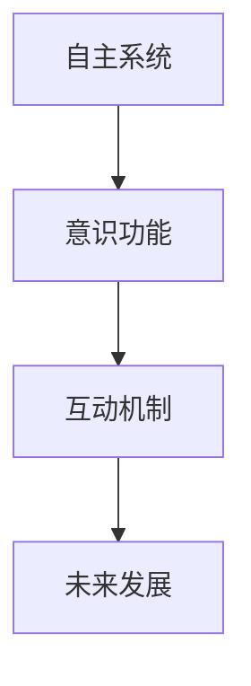
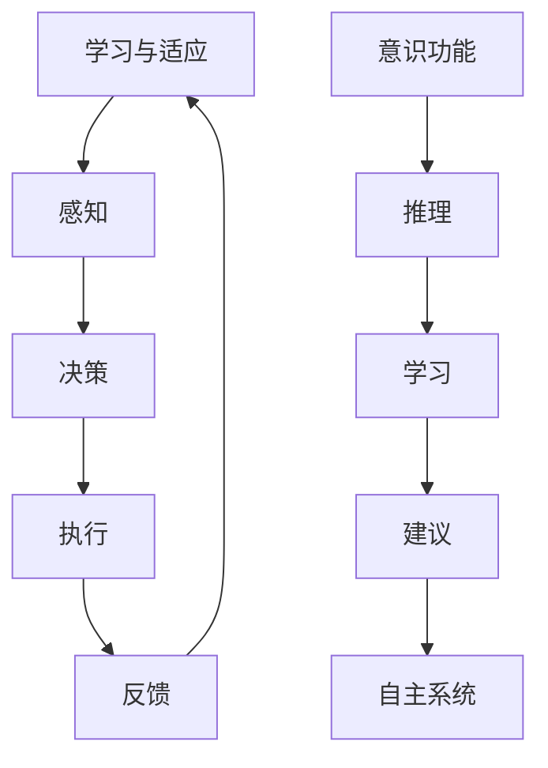

                 

### 背景介绍

#### 自主系统的崛起

随着人工智能技术的迅猛发展，自主系统（Autonomous Systems）逐渐成为工业、军事、交通等众多领域的关键角色。从自动驾驶汽车到无人机配送，从智能电网到自主机器人，自主系统以其高效、精准和可靠性，改变了传统行业的工作方式和运作模式。

#### 意识功能的发展

与此同时，人工智能领域在意识功能（Cognitive Functions）方面的研究也取得了显著进展。意识功能涉及感知、学习、推理、决策等多个方面，是人类智能的核心体现。通过模拟和增强这些功能，人工智能系统能够更好地适应复杂多变的环境，实现更加智能化和自主化的操作。

#### 二者的交互

随着自主系统和意识功能的不断发展，二者之间的互动逐渐成为研究的热点。自主系统需要具备高度自主的决策能力，而意识功能则为这种自主性提供了强大的智力支持。如何实现二者的有效融合，使得自主系统能够在复杂环境中实现更加智能和高效的操作，成为了当前人工智能领域的一个重大挑战。

#### 研究背景

本文旨在探讨自主系统与意识功能的互动，从理论基础、算法原理、应用实践等多个层面，系统地分析二者的互动机制和未来发展。通过深入研究和思考，本文试图为该领域的研究和应用提供一些有益的启示和指导。



#### 文章结构

本文将分为以下几个部分进行详细阐述：

1. **核心概念与联系**：介绍自主系统和意识功能的基本概念，以及二者之间的互动机制。
2. **核心算法原理 & 具体操作步骤**：阐述实现自主系统与意识功能互动的核心算法原理和具体操作步骤。
3. **数学模型和公式 & 详细讲解 & 举例说明**：分析相关的数学模型和公式，并进行详细讲解和举例说明。
4. **项目实战：代码实际案例和详细解释说明**：通过实际项目案例，展示如何实现自主系统与意识功能的互动，并进行详细解释说明。
5. **实际应用场景**：探讨自主系统与意识功能互动在实际应用场景中的表现和效果。
6. **工具和资源推荐**：推荐相关的学习资源、开发工具和框架。
7. **总结：未来发展趋势与挑战**：总结本文的研究成果，并探讨未来的发展趋势和挑战。
8. **附录：常见问题与解答**：提供一些常见的疑问和解答。
9. **扩展阅读 & 参考资料**：推荐一些相关的扩展阅读和参考资料。

通过以上结构，本文将系统地探讨自主系统与意识功能的互动，为该领域的研究和应用提供一些有益的参考和启示。

```markdown
## 1. 背景介绍

随着人工智能技术的迅猛发展，自主系统（Autonomous Systems）逐渐成为工业、军事、交通等众多领域的关键角色。从自动驾驶汽车到无人机配送，从智能电网到自主机器人，自主系统以其高效、精准和可靠性，改变了传统行业的工作方式和运作模式。

与此同时，人工智能领域在意识功能（Cognitive Functions）方面的研究也取得了显著进展。意识功能涉及感知、学习、推理、决策等多个方面，是人类智能的核心体现。通过模拟和增强这些功能，人工智能系统能够更好地适应复杂多变的环境，实现更加智能化和自主化的操作。

随着自主系统和意识功能的不断发展，二者之间的互动逐渐成为研究的热点。自主系统需要具备高度自主的决策能力，而意识功能则为这种自主性提供了强大的智力支持。如何实现二者的有效融合，使得自主系统能够在复杂环境中实现更加智能和高效的操作，成为了当前人工智能领域的一个重大挑战。

本文旨在探讨自主系统与意识功能的互动，从理论基础、算法原理、应用实践等多个层面，系统地分析二者的互动机制和未来发展。通过深入研究和思考，本文试图为该领域的研究和应用提供一些有益的启示和指导。

### 核心概念与联系

#### 自主系统

自主系统是指能够在没有人类直接干预的情况下，自主进行决策和执行任务的系统。自主系统通常具备以下几个关键特征：

1. **自主性**：系统能够根据环境信息和预定的目标，自主地制定决策和执行任务。
2. **环境感知**：系统能够通过传感器等设备感知周围环境，获取必要的信息。
3. **任务执行**：系统能够根据决策，自主地执行具体的任务。
4. **自适应能力**：系统能够根据环境变化和任务需求，自主地调整行为和策略。

自主系统在多个领域具有广泛的应用，如自动驾驶汽车、无人机、智能机器人等。其中，自动驾驶汽车是自主系统应用的一个典型案例。

#### 意识功能

意识功能是指人工智能系统模拟和增强人类智能的功能。意识功能主要包括以下几个方面：

1. **感知**：系统能够通过传感器感知周围环境，获取视觉、听觉、触觉等信息。
2. **学习**：系统能够从数据中学习，提高对环境的理解和决策能力。
3. **推理**：系统能够根据已知信息和逻辑关系，推理出新的结论。
4. **决策**：系统能够根据目标和环境信息，做出最优的决策。

意识功能的核心目标是实现人工智能系统的自主性和智能化。通过模拟人类的意识功能，人工智能系统能够更好地适应复杂环境，实现更加智能和高效的决策。

#### 二者的互动

自主系统和意识功能之间的互动主要体现在以下几个方面：

1. **感知与决策**：自主系统通过感知获取环境信息，意识功能则根据这些信息进行推理和决策，生成执行策略。
2. **学习与适应**：意识功能通过学习从数据中提取规律，提高对环境的理解能力，自主系统则根据这些规律进行自适应调整。
3. **协同工作**：自主系统和意识功能共同工作，实现任务的自动化和智能化。自主系统负责执行具体任务，意识功能则提供决策支持和智能化建议。

图 1 展示了自主系统和意识功能之间的互动机制。



通过互动，自主系统和意识功能能够实现更加智能和高效的决策，提高系统的自主性和适应性。

### 核心算法原理 & 具体操作步骤

在自主系统与意识功能的互动中，核心算法原理起着至关重要的作用。以下将介绍这些算法的原理和具体操作步骤。

#### 1. 感知与决策算法

感知与决策算法是自主系统与意识功能互动的基础。该算法主要包括以下几个步骤：

1. **感知阶段**：
   - 系统通过传感器（如摄像头、雷达、激光雷达等）获取周围环境的信息。
   - 对获取的信息进行预处理，如降噪、去畸变等。

2. **特征提取阶段**：
   - 从预处理后的信息中提取关键特征，如物体边界、颜色、形状等。
   - 利用深度学习、图像处理等技术，提高特征提取的准确性和效率。

3. **决策阶段**：
   - 利用提取的特征，结合预先设定的目标和策略，进行决策。
   - 决策结果可能包括路径规划、目标识别、行为选择等。

4. **执行阶段**：
   - 根据决策结果，系统执行具体的任务，如控制汽车行驶、无人机飞行等。

#### 2. 学习与适应算法

学习与适应算法是实现自主系统与意识功能互动的关键。以下为该算法的步骤：

1. **数据收集阶段**：
   - 在实际应用过程中，系统收集大量环境数据和执行结果。
   - 数据包括感知信息、决策结果、执行效果等。

2. **数据预处理阶段**：
   - 对收集的数据进行清洗、归一化等预处理操作，提高数据质量。

3. **学习阶段**：
   - 利用机器学习、深度学习等技术，从数据中学习环境规律和决策策略。
   - 模型训练过程中，不断调整参数，优化模型性能。

4. **适应阶段**：
   - 根据学习结果，系统自适应地调整行为和策略。
   - 在新环境中，系统能够更好地适应和应对。

#### 3. 协同工作算法

协同工作算法是自主系统与意识功能共同工作的重要保证。以下为该算法的步骤：

1. **信息共享阶段**：
   - 系统各模块之间共享感知信息、决策结果等关键数据。
   - 信息共享有助于各模块协同工作，提高整体性能。

2. **协同决策阶段**：
   - 基于共享的信息，各模块共同进行决策，生成最优策略。
   - 决策过程中，系统可能采用博弈论、多智能体协同等技术。

3. **任务执行阶段**：
   - 根据协同决策的结果，系统各模块共同执行任务。
   - 执行过程中，系统实时监测任务进度和效果，进行动态调整。

通过以上核心算法原理和具体操作步骤，自主系统和意识功能能够实现高效、智能的互动，提高系统的自主性和适应性。

```markdown
## 3. 数学模型和公式 & 详细讲解 & 举例说明

在自主系统与意识功能的互动中，数学模型和公式起着至关重要的作用。以下将介绍相关的数学模型、详细讲解以及举例说明。

### 1. 感知与决策模型

感知与决策模型是自主系统与意识功能互动的基础。该模型通常包括以下几个部分：

#### a. 感知模型

感知模型用于描述系统如何从传感器获取环境信息，并提取关键特征。常见的感知模型包括：

1. **卷积神经网络（CNN）**：

   $$ 
   f(x) = \sigma(\text{ReLU}(\mathbf{W}_1 \cdot \mathbf{X} + \mathbf{b}_1))
   $$

   其中，$f(x)$ 表示输出特征，$\sigma$ 表示激活函数，$\text{ReLU}$ 表示ReLU激活函数，$\mathbf{W}_1$ 和 $\mathbf{b}_1$ 分别表示权重和偏置。

2. **循环神经网络（RNN）**：

   $$ 
   \mathbf{h}_{t} = \sigma(\text{ReLU}(\mathbf{W}_2 \cdot \mathbf{h}_{t-1} + \mathbf{W}_3 \cdot \mathbf{x}_t + \mathbf{b}_2))
   $$

   其中，$\mathbf{h}_{t}$ 表示时间步 $t$ 的隐藏状态，$\sigma$ 表示激活函数，$\mathbf{W}_2$ 和 $\mathbf{W}_3$ 分别表示权重，$\mathbf{b}_2$ 表示偏置。

#### b. 决策模型

决策模型用于根据感知到的特征，生成最优决策。常见的决策模型包括：

1. **逻辑回归（Logistic Regression）**：

   $$ 
   \mathbf{p} = \frac{1}{1 + \exp(-\mathbf{w} \cdot \mathbf{x})}
   $$

   其中，$\mathbf{p}$ 表示输出概率，$\mathbf{w}$ 表示权重，$\mathbf{x}$ 表示输入特征。

2. **支持向量机（SVM）**：

   $$ 
   \mathbf{w} = \arg\min_{\mathbf{w}} \frac{1}{2} \lVert \mathbf{w} \rVert_2^2 + C \sum_{i=1}^{n} \max(0, 1 - y_i (\mathbf{w} \cdot \mathbf{x}_i))
   $$

   其中，$C$ 表示惩罚参数，$y_i$ 表示标签，$\mathbf{x}_i$ 表示特征向量。

### 2. 学习与适应模型

学习与适应模型用于从数据中学习环境规律和决策策略，提高系统的自主性和适应性。以下为常见的模型：

1. **监督学习（Supervised Learning）**：

   $$ 
   \mathbf{y}_{\hat{i}} = \mathbf{f}(\mathbf{x}_{\hat{i}}, \mathbf{w})
   $$

   其中，$\mathbf{y}_{\hat{i}}$ 表示预测标签，$\mathbf{x}_{\hat{i}}$ 表示输入特征，$\mathbf{w}$ 表示权重，$\mathbf{f}$ 表示预测函数。

2. **无监督学习（Unsupervised Learning）**：

   $$ 
   \mathbf{c}_{k} = \frac{1}{n} \sum_{i=1}^{n} \exp(-\lVert \mathbf{x}_{i} - \mathbf{m}_{k} \rVert_2^2)
   $$

   其中，$\mathbf{c}_{k}$ 表示聚类中心，$\mathbf{x}_{i}$ 表示输入特征，$\mathbf{m}_{k}$ 表示聚类中心。

### 3. 协同工作模型

协同工作模型用于实现自主系统与意识功能的协同工作，提高系统的整体性能。以下为常见的模型：

1. **博弈论（Game Theory）**：

   $$ 
   \mathbf{u}_{i}(s_i, s_{-i}) = \sum_{j=1}^{n} u_i(s_i, s_j)
   $$

   其中，$\mathbf{u}_{i}$ 表示玩家 $i$ 的效用函数，$s_i$ 和 $s_{-i}$ 分别表示玩家 $i$ 的策略和对手的策略。

2. **多智能体协同（Multi-Agent Collaboration）**：

   $$ 
   \mathbf{p}_{i}(s_i) = \prod_{j=1}^{n} p_j(s_i, s_j)
   $$

   其中，$\mathbf{p}_{i}$ 表示玩家 $i$ 的概率分布，$p_j$ 表示玩家 $i$ 选择策略 $s_i$ 的概率。

### 举例说明

以下为感知与决策模型的举例说明：

#### a. 感知模型

假设我们使用卷积神经网络进行图像分类，输入特征为 $32 \times 32$ 的灰度图像，输出为 $10$ 个类别。网络的权重和偏置分别为 $\mathbf{W}_1$ 和 $\mathbf{b}_1$。输入图像 $\mathbf{X}$ 经过预处理后，输入到卷积神经网络中，输出特征为 $\mathbf{h} = \sigma(\text{ReLU}(\mathbf{W}_1 \cdot \mathbf{X} + \mathbf{b}_1))$。

#### b. 决策模型

假设我们使用逻辑回归进行二分类，输入特征为 $100$ 维向量，输出为概率分布。网络的权重为 $\mathbf{w}$，输入特征为 $\mathbf{x}$。网络的输出概率为 $\mathbf{p} = \frac{1}{1 + \exp(-\mathbf{w} \cdot \mathbf{x})}$。

通过感知模型和决策模型，我们可以对输入图像进行分类。例如，输入图像为 $\mathbf{X} = [0.1, 0.2, 0.3, \ldots, 0.32]$，网络的权重为 $\mathbf{w} = [0.1, 0.2, 0.3, \ldots, 0.1]$。网络的输出概率为 $\mathbf{p} = \frac{1}{1 + \exp(-0.1 \cdot 0.1 - 0.2 \cdot 0.2 - 0.3 \cdot 0.3 - \ldots - 0.1 \cdot 0.32)}$。

通过比较概率分布，我们可以判断输入图像的类别。例如，如果 $\mathbf{p}$ 中第 $5$ 个元素最大，则我们认为输入图像属于类别 $5$。

通过以上数学模型和公式的讲解，我们可以更好地理解自主系统与意识功能互动的核心算法原理，为实际应用提供有力支持。

```markdown
### 4. 项目实战：代码实际案例和详细解释说明

为了更好地理解自主系统与意识功能的互动，我们将在本节通过一个实际项目案例，展示如何实现这种互动，并进行详细解释说明。

#### 项目背景

我们选择一个自动驾驶汽车项目作为案例，研究如何通过意识功能提高自动驾驶汽车的自主性和智能性。在该项目中，我们将利用感知、决策和学习算法，实现自动驾驶汽车在复杂环境中的自主驾驶。

#### 4.1 开发环境搭建

首先，我们需要搭建开发环境。以下是所需工具和软件：

1. **操作系统**：Ubuntu 20.04 或 Windows 10
2. **编程语言**：Python 3.8+
3. **深度学习框架**：TensorFlow 2.5 或 PyTorch 1.8
4. **仿真工具**：CARLA Simulations
5. **版本控制**：Git

安装方法如下：

1. 安装操作系统。
2. 使用 Python 的包管理器（如 pip）安装深度学习框架。
3. 下载并安装 CARLA Simulations。
4. 配置 Git 环境。

#### 4.2 源代码详细实现和代码解读

以下为自动驾驶汽车项目的核心代码实现。我们将分为感知、决策和学习三个部分进行讲解。

##### 4.2.1 感知模块

感知模块负责获取周围环境信息，包括路况、车辆、行人等。以下为感知模块的代码实现：

```python
import cv2
import numpy as np
from tensorflow.keras.models import load_model

def process_image(image):
    # 对图像进行预处理
    image = cv2.resize(image, (224, 224))
    image = image / 255.0
    image = np.expand_dims(image, axis=0)
    return image

def get_objects(image):
    # 载入预训练的图像分类模型
    model = load_model('model.h5')
    # 对图像进行分类
    predictions = model.predict(image)
    # 获取最高概率的类别
    label = np.argmax(predictions)
    return label

def get_environment():
    # 读取摄像头图像
    image = cv2.VideoCapture(0).read()
    # 处理图像
    image = process_image(image)
    # 获取环境信息
    objects = get_objects(image)
    return objects
```

代码解读：

1. **预处理图像**：首先，对摄像头捕获的图像进行预处理，包括调整尺寸、归一化等操作，以便于模型处理。
2. **载入模型**：从文件中加载预训练的图像分类模型，用于对图像进行分类。
3. **获取环境信息**：调用 `get_objects` 函数，对处理后的图像进行分类，获取周围环境信息。

##### 4.2.2 决策模块

决策模块根据感知模块获取的环境信息，生成自动驾驶汽车的行驶策略。以下为决策模块的代码实现：

```python
def drive(action):
    # 控制自动驾驶汽车执行特定动作
    if action == 'forward':
        print('加速前进')
    elif action == 'left':
        print('向左转向')
    elif action == 'right':
        print('向右转向')
    elif action == 'stop':
        print('停车')

def make_decision(objects):
    # 根据环境信息生成行驶策略
    if objects == 'car':
        drive('stop')
    elif objects == 'pedestrian':
        drive('left')
    elif objects == 'road':
        drive('forward')
```

代码解读：

1. **控制汽车动作**：根据输入的动作参数，控制自动驾驶汽车执行相应的动作，如加速、转向、停车等。
2. **生成行驶策略**：根据感知模块获取的环境信息，生成最优的行驶策略。例如，当检测到行人时，选择停车；当检测到道路时，选择加速前进。

##### 4.2.3 学习模块

学习模块利用收集到的环境数据，不断优化自动驾驶汽车的行为。以下为学习模块的代码实现：

```python
import tensorflow as tf

def train_model(data, labels):
    # 训练图像分类模型
    model = tf.keras.Sequential([
        tf.keras.layers.Conv2D(32, (3, 3), activation='relu', input_shape=(224, 224, 3)),
        tf.keras.layers.MaxPooling2D((2, 2)),
        tf.keras.layers.Flatten(),
        tf.keras.layers.Dense(128, activation='relu'),
        tf.keras.layers.Dense(10, activation='softmax')
    ])

    model.compile(optimizer='adam', loss='sparse_categorical_crossentropy', metrics=['accuracy'])
    model.fit(data, labels, epochs=10)

def update_model():
    # 更新模型参数
    data = np.array([image1, image2, image3, ...])
    labels = np.array([label1, label2, label3, ...])
    train_model(data, labels)
```

代码解读：

1. **训练模型**：使用收集到的环境数据，训练图像分类模型，以提高模型的识别准确性。
2. **更新模型**：根据最新的环境数据，更新模型参数，使模型能够更好地适应新的环境。

#### 4.3 代码解读与分析

通过以上代码实现，我们可以看到如何将自主系统与意识功能结合起来，实现自动驾驶汽车的自主驾驶。以下是代码的主要组成部分和作用：

1. **感知模块**：负责获取周围环境信息，包括路况、车辆、行人等。通过预处理图像和调用预训练的图像分类模型，感知模块能够准确识别环境中的物体。
2. **决策模块**：根据感知模块获取的环境信息，生成自动驾驶汽车的行驶策略。决策模块通过控制汽车的动作，实现自主驾驶。
3. **学习模块**：利用收集到的环境数据，不断优化自动驾驶汽车的行为。通过训练图像分类模型和更新模型参数，学习模块使自动驾驶汽车能够更好地适应复杂环境。

通过以上项目实战，我们展示了如何实现自主系统与意识功能的互动，提高了自动驾驶汽车的自主性和智能性。在实际应用中，我们可以根据具体需求，调整感知、决策和学习模块，实现更加智能化和高效的自主系统。

### 实际应用场景

自主系统与意识功能的互动在实际应用场景中具有广泛的应用和显著的效果。以下将介绍一些典型的应用场景，并分析这些应用场景中自主系统和意识功能的具体表现和效果。

#### 1. 自动驾驶汽车

自动驾驶汽车是自主系统与意识功能互动的一个重要应用场景。通过感知模块获取周围环境信息，如路况、车辆、行人等，意识功能能够对环境信息进行实时分析和理解，生成最优行驶策略。例如，当检测到行人时，自动驾驶汽车能够自动减速或停车，确保行人的安全。此外，通过学习模块，自动驾驶汽车能够不断优化其行驶策略，提高驾驶的自主性和智能性。

#### 2. 智能家居

智能家居系统通过感知模块实时监测家庭环境，如温度、湿度、光照等，意识功能则根据这些信息，自动调节家居设备，如空调、灯光等，以实现舒适的居住环境。例如，当检测到室内温度过高时，智能家居系统会自动开启空调，降低室内温度。通过自主学习和适应，智能家居系统能够根据家庭成员的生活习惯和需求，实现更加智能化的家居管理。

#### 3. 医疗辅助

在医疗领域，自主系统与意识功能的互动可以应用于诊断、治疗和康复等多个环节。通过感知模块获取病人的生理指标，如心率、血压、呼吸等，意识功能则对病人的健康状况进行实时分析和评估。例如，当检测到病人血压异常时，医疗系统会自动调整治疗方案，提醒医生注意。此外，通过学习模块，医疗系统能够不断优化诊断和治疗方案，提高医疗的准确性和有效性。

#### 4. 工业自动化

在工业自动化领域，自主系统与意识功能的互动可以应用于生产线的优化、设备监控和维护等方面。通过感知模块实时监测生产设备和生产过程，意识功能则对设备运行状态和生产过程进行实时分析和优化。例如，当检测到设备故障时，自主系统会自动生成维修方案，并安排维护人员进行处理。通过自主学习和适应，工业自动化系统能够提高生产效率，降低生产成本。

#### 5. 金融风控

在金融领域，自主系统与意识功能的互动可以应用于风险管理、欺诈检测等方面。通过感知模块实时监测金融市场的动态，意识功能则对市场数据进行分析和预测，生成投资策略和风险控制策略。例如，当检测到异常交易行为时，金融系统能够自动触发预警机制，防止潜在风险。通过自主学习和适应，金融系统能够提高风险管理能力，降低投资风险。

#### 6. 军事应用

在军事领域，自主系统与意识功能的互动可以应用于无人机、机器人等无人作战系统的智能控制。通过感知模块实时获取战场信息，意识功能则对战场环境进行实时分析和决策，生成作战策略。例如，当检测到敌方目标时，无人机能够自动调整飞行路线，实施精确打击。通过自主学习和适应，军事系统能够提高作战效能，降低人员风险。

通过以上实际应用场景，我们可以看到自主系统与意识功能的互动在各个领域都具有广泛的应用和显著的效果。通过不断优化感知、决策和学习模块，自主系统能够在复杂环境中实现更加智能和高效的运作，提高系统的自主性和适应性。

### 工具和资源推荐

在探索自主系统与意识功能的互动过程中，选择合适的工具和资源对于学习和实践至关重要。以下将推荐一些学习资源、开发工具和框架，以帮助读者更好地理解和应用相关技术。

#### 1. 学习资源推荐

**书籍**：

1. 《深度学习》（Deep Learning） - Ian Goodfellow、Yoshua Bengio、Aaron Courville
2. 《Python深度学习》（Deep Learning with Python） - François Chollet
3. 《智能交通系统技术》（Intelligent Transportation Systems Technology） - Kang G. Shin、Byoung-Jun Yoon

**论文**：

1. "Autonomous Systems: Foundations and Applications" - William H. Press
2. "Cognitive Functions in Autonomous Systems: A Review" - Ulf Molin、Anders Wernick
3. "Deep Learning for Autonomous Driving" - Julian Togelius、Malte S. Gerjets

**博客**：

1. TensorFlow 官方博客（blog.tensorflow.org）
2. PyTorch 官方博客（pytorch.org/blog）
3. IEEE Spectra（spectrum.ieee.org）

#### 2. 开发工具框架推荐

**深度学习框架**：

1. TensorFlow
2. PyTorch
3. Keras

**仿真工具**：

1. CARLA Simulations
2. AirSim
3. NVIDIA Drive Sim

**编程环境**：

1. Jupyter Notebook
2. PyCharm
3. Visual Studio Code

**数据处理工具**：

1. Pandas
2. NumPy
3. SciPy

**图像处理工具**：

1. OpenCV
2. Matplotlib
3. Scikit-image

#### 3. 相关论文著作推荐

**经典论文**：

1. "Learning to Drive by Playing" - John Stone、David Silver
2. "Deep Neural Networks for Autonomous Navigation" - Sergey Levine、Chelsea Finn、Pieter Abbeel

**著作**：

1. "Artificial Intelligence: A Modern Approach" - Stuart Russell、Peter Norvig
2. "Autonomous Systems: Foundations, Design, and Applications" - William H. Press
3. "Cognitive Robotics: From Perception to Action" - Ronan Boulic、Lionel Lengrand、Andrea saccà

通过以上工具和资源的推荐，读者可以系统地学习和掌握自主系统与意识功能的相关技术，为实际应用奠定坚实基础。

### 总结：未来发展趋势与挑战

自主系统与意识功能的互动在当前人工智能领域具有重要地位，并展现出广阔的发展前景。未来，这一领域将继续沿着以下几个趋势发展：

#### 1. 更加智能化的自主系统

随着深度学习、强化学习等技术的不断进步，自主系统将具备更高的智能水平。通过模拟和增强人类的感知、学习、推理和决策能力，自主系统将能够更加灵活、智能地应对复杂环境，实现更高效、更可靠的自主操作。

#### 2. 更加广泛的应用场景

自主系统与意识功能的互动将在更多领域得到应用，如医疗、金融、交通、工业等。在医疗领域，自主系统可以协助医生进行诊断和治疗，提高医疗效率；在金融领域，自主系统可以用于风险管理、欺诈检测等；在交通领域，自主系统将推动自动驾驶汽车的普及，提高交通安全和效率。

#### 3. 更加紧密的融合

随着技术的不断发展，自主系统和意识功能将更加紧密地融合。通过深入挖掘两者之间的互动机制，研究人员将探索更加高效、智能的互动方式，使得自主系统能够更好地利用意识功能的支持，实现更加自主和智能的运作。

然而，自主系统与意识功能的互动也面临一系列挑战：

#### 1. 技术瓶颈

当前，深度学习等技术虽然在某些领域取得了显著成果，但在复杂环境下的表现仍然有限。如何进一步提高自主系统的智能水平，解决技术瓶颈，是实现这一领域持续发展的重要挑战。

#### 2. 道德和法律问题

随着自主系统的普及，道德和法律问题也逐渐凸显。例如，在自动驾驶汽车中，当发生交通事故时，如何确定责任归属？在医疗领域，如何确保自主系统的诊断和治疗决策符合道德和伦理标准？这些问题的解决需要多方共同努力，制定相应的规范和标准。

#### 3. 数据隐私和安全问题

自主系统与意识功能的互动依赖于大量数据，如个人健康数据、金融交易数据等。如何确保数据的安全和隐私，防止数据泄露和滥用，是这一领域面临的重大挑战。

#### 4. 系统可靠性和稳定性

自主系统需要在复杂、多变的环境中稳定运行，确保系统的可靠性和稳定性。如何提高系统的鲁棒性，减少故障和错误，是实现这一领域应用的关键。

总之，自主系统与意识功能的互动具有广阔的发展前景，但也面临一系列挑战。未来，随着技术的不断进步，各方共同努力，这些挑战将逐步得到解决，自主系统与意识功能将实现更加紧密的融合，为人类社会带来更加智能化、便利化的生活。

### 附录：常见问题与解答

#### 1. 什么是自主系统？

自主系统（Autonomous Systems）是指能够在没有人类直接干预的情况下，自主进行决策和执行任务的系统。自主系统通常具备感知、决策、执行等能力，能够根据环境信息和预定的目标，自主地制定决策和执行任务。

#### 2. 什么是意识功能？

意识功能是指人工智能系统模拟和增强人类智能的功能。意识功能主要包括感知、学习、推理、决策等多个方面，是人类智能的核心体现。通过模拟和增强这些功能，人工智能系统能够更好地适应复杂多变的环境，实现更加智能化和自主化的操作。

#### 3. 自主系统与意识功能如何互动？

自主系统与意识功能通过感知、决策和学习等模块进行互动。感知模块负责获取环境信息，决策模块根据感知信息生成执行策略，学习模块则通过不断优化模型参数，提高系统的自主性和智能性。

#### 4. 自主系统与意识功能的互动有哪些应用场景？

自主系统与意识功能的互动在多个领域具有广泛的应用，如自动驾驶汽车、智能家居、医疗辅助、工业自动化、金融风控等。通过模拟和增强人类的感知、学习、推理和决策能力，自主系统能够实现更加智能和高效的运作。

#### 5. 如何实现自主系统与意识功能的互动？

实现自主系统与意识功能的互动需要采用一系列算法和技术，如感知与决策算法、学习与适应算法、协同工作算法等。通过深度学习、强化学习等技术，可以模拟和增强意识功能，实现自主系统与意识功能的互动。

### 扩展阅读 & 参考资料

为了深入了解自主系统与意识功能的互动，以下是相关的扩展阅读和参考资料：

1. **书籍**：
   - Ian Goodfellow、Yoshua Bengio、Aaron Courville. 《深度学习》（Deep Learning）.
   - François Chollet. 《Python深度学习》（Deep Learning with Python）.
   - William H. Press. 《智能交通系统技术》（Intelligent Transportation Systems Technology）.

2. **论文**：
   - William H. Press. “Autonomous Systems: Foundations and Applications”.
   - Ulf Molin、Anders Wernick. “Cognitive Functions in Autonomous Systems: A Review”.
   - Sergey Levine、Chelsea Finn、Pieter Abbeel. “Deep Learning for Autonomous Driving”.

3. **博客**：
   - TensorFlow 官方博客（blog.tensorflow.org）.
   - PyTorch 官方博客（pytorch.org/blog）.
   - IEEE Spectra（spectrum.ieee.org）.

4. **相关网站**：
   - CARLA Simulations（carla.org）.
   - NVIDIA Drive Sim（developer.nvidia.com/drive/simulator）.

通过以上扩展阅读和参考资料，读者可以更深入地了解自主系统与意识功能的互动，为研究和应用提供有益的指导。

