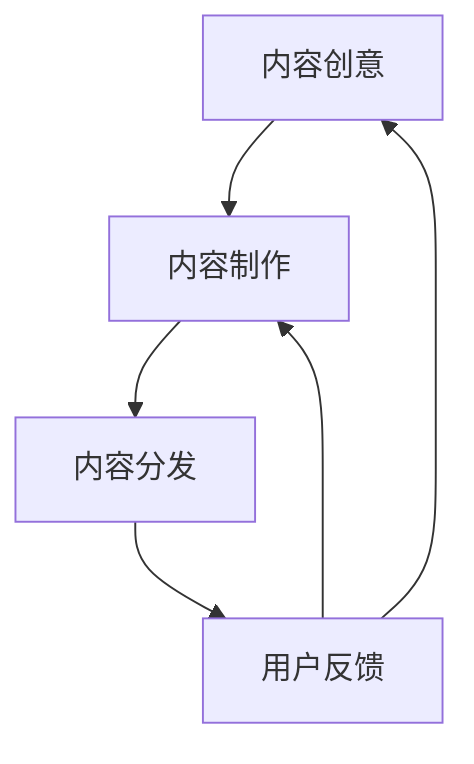

                 

### 背景介绍

自动化创业正在成为商业世界中的新趋势。随着人工智能、机器学习和大数据技术的发展，越来越多的创业者选择将自动化技术应用于产品开发、营销推广、客户服务和运营管理等各个方面，以期提高效率、降低成本并提升客户满意度。然而，在这个充满机遇和挑战的时代，如何有效地进行内容营销成为了许多创业公司亟需解决的问题。

内容营销作为企业营销战略的重要组成部分，旨在通过创造和分享有价值的内容来吸引和留住目标客户，从而实现品牌知名度和市场份额的提升。在自动化创业的背景下，内容营销面临着新的机遇和挑战。一方面，自动化工具能够大幅提升内容生产的速度和质量，为企业提供更多的内容创意和分发渠道；另一方面，如何在海量信息中脱颖而出，构建与用户之间的深度连接，成为了内容营销的关键。

本文旨在探讨自动化创业中的内容营销策略，通过深入分析内容营销的核心概念、算法原理、数学模型和实际应用，帮助创业者了解如何在自动化技术的基础上，实现内容营销的有效性和可持续性。文章将分为以下几个部分：

1. **核心概念与联系**：介绍内容营销的基础概念，并使用Mermaid流程图展示其内在联系。
2. **核心算法原理 & 具体操作步骤**：解析内容营销的关键算法，详细阐述其实施步骤。
3. **数学模型和公式 & 详细讲解 & 举例说明**：介绍内容营销中常用的数学模型，并举例说明。
4. **项目实战：代码实际案例和详细解释说明**：通过具体代码案例，展示内容营销策略的实现过程。
5. **实际应用场景**：探讨内容营销在不同领域的实际应用。
6. **工具和资源推荐**：推荐学习资源和开发工具框架。
7. **总结：未来发展趋势与挑战**：总结内容营销的发展趋势，并探讨未来面临的挑战。

通过这篇文章，希望能够为自动化创业公司提供有价值的指导，帮助他们在激烈的市场竞争中，通过有效的内容营销策略，实现品牌的快速成长和用户的深度连接。

### 核心概念与联系

在探讨自动化创业中的内容营销策略之前，我们首先需要了解内容营销的基础概念，以及这些概念之间的内在联系。内容营销不仅仅是创造和分享内容那么简单，它涉及到从内容创意、内容制作、内容分发到最终用户反馈的整个流程。

**核心概念：**

1. **内容创意**：内容营销的起点，是指根据目标受众的需求和兴趣，创造有吸引力的、有价值的内容。
2. **内容制作**：将创意转化为实际内容的过程，包括文字、图片、视频、音频等多种形式。
3. **内容分发**：将制作好的内容传递给目标受众，通过多种渠道进行传播。
4. **用户反馈**：收集和分析用户对内容的反应，以优化后续的内容营销策略。

**Mermaid流程图：**

下面是一个使用Mermaid语言绘制的流程图，展示了内容营销的核心概念及其相互关系。



**流程说明：**

1. **内容创意**：企业通过市场调研和用户分析，确定目标受众的需求和兴趣点，从而产生创意。
2. **内容制作**：根据创意，内容团队进行素材收集、文案撰写、图像和视频制作等工作，最终形成有吸引力的内容。
3. **内容分发**：企业利用社交媒体、电子邮件、网站、搜索引擎等渠道，将内容传递给目标受众。
4. **用户反馈**：通过用户评论、点击率、分享数等指标，收集用户对内容的反馈，以了解其受欢迎程度和效果。
5. **反馈优化**：根据用户反馈，对内容创意和制作进行持续优化，以提高后续内容的质量和受众满意度。

通过上述流程，我们可以看出，内容营销是一个循环往复的过程，每个环节相互影响、相互依赖，共同推动内容营销策略的有效实施。

### 核心算法原理 & 具体操作步骤

在内容营销中，核心算法的应用至关重要，它不仅能够提高内容制作的效率，还能优化内容的分发和用户反馈机制。以下将介绍几种常见的内容营销算法及其具体操作步骤。

#### 1. 文本生成算法

**算法原理：** 文本生成算法是基于深度学习的自然语言处理技术，可以自动生成高质量的文章、摘要、标题等文本内容。

**具体操作步骤：**

1. **数据收集**：首先，从互联网上收集大量的文本数据，如新闻文章、博客、论坛帖子等。
2. **数据预处理**：对收集到的文本数据进行清洗和标注，去除无用信息，为模型训练做准备。
3. **模型训练**：使用预训练的模型（如GPT-3、BERT等）对预处理后的数据进行训练，使其学会生成符合目标主题和风格的文本。
4. **文本生成**：输入主题或关键词，算法根据训练结果生成相应的文本内容。
5. **文本优化**：对生成的文本进行语法、拼写和风格上的优化，确保内容的质量和可读性。

**代码示例：**

```python
from transformers import GPT2LMHeadModel, GPT2Tokenizer

model_name = 'gpt2'
tokenizer = GPT2Tokenizer.from_pretrained(model_name)
model = GPT2LMHeadModel.from_pretrained(model_name)

input_text = "人工智能的应用领域包括哪些？"
input_ids = tokenizer.encode(input_text, return_tensors='pt')

output = model.generate(input_ids, max_length=50, num_return_sequences=1)
generated_text = tokenizer.decode(output[0], skip_special_tokens=True)

print(generated_text)
```

#### 2. 内容推荐算法

**算法原理：** 内容推荐算法通过分析用户的行为数据，如浏览记录、点赞、评论等，为用户推荐感兴趣的内容。

**具体操作步骤：**

1. **用户行为数据收集**：收集用户的浏览、点击、搜索、点赞、评论等行为数据。
2. **用户画像构建**：基于用户行为数据，构建用户画像，包括兴趣偏好、行为习惯等。
3. **内容特征提取**：对内容进行特征提取，如文本、图片、视频等，将其转化为算法可以处理的特征向量。
4. **推荐模型训练**：使用机器学习算法（如协同过滤、基于内容的推荐等）对用户画像和内容特征进行训练。
5. **内容推荐**：根据用户画像和内容特征，为用户推荐相关的、个性化的内容。

**代码示例：**

```python
from surprise import SVD
from surprise import Dataset
from surprise import accuracy
from surprise.model_selection import cross_validate

# 加载数据集
data = Dataset.load_builtin('ml-100k')

# 使用SVD算法进行训练
svd = SVD()

# 在数据集上进行交叉验证
cross_validate(svd, data, measures=['RMSE', 'MAE'], cv=3, verbose=True)
```

#### 3. 社交网络传播算法

**算法原理：** 社交网络传播算法通过模拟用户在网络中的传播行为，预测内容的传播范围和效果。

**具体操作步骤：**

1. **网络结构构建**：根据用户关系数据，构建社交网络图，包括用户节点和关系边。
2. **传播模型选择**：选择合适的传播模型（如独立 cascade 模型、SI模型等）。
3. **模型参数调整**：通过实验和数据分析，调整模型的参数，以提高预测准确性。
4. **传播模拟**：模拟用户在网络中的传播行为，预测内容的传播路径和影响范围。
5. **效果评估**：根据传播结果，评估算法的预测准确性和有效性。

**代码示例：**

```python
import networkx as nx
import matplotlib.pyplot as plt

# 创建一个社交网络图
G = nx.ego_graph(nx.karate_club_graph(), 3)

# 模拟内容传播
传播路径 = nx.single_source_shortest_path(G, source=1)

# 绘制传播路径
nx.draw(G, with_labels=True)
nx.draw_networkx_nodes(G, pos=nx.spring_layout(G), nodelist=传播路径, node_size=500, node_color='r')
plt.show()
```

通过上述算法的应用，创业者可以更加高效地创作、分发和推广内容，提高内容营销的效果和影响力。接下来，我们将进一步探讨内容营销中的数学模型和公式，以帮助读者更深入地理解其内在逻辑和实际应用。

### 数学模型和公式 & 详细讲解 & 举例说明

在内容营销中，数学模型和公式扮演着至关重要的角色。它们不仅帮助我们量化内容营销的效果，还能提供优化策略的科学依据。以下是几种在内容营销中常用的数学模型和公式的详细讲解及举例说明。

#### 1. 投入产出比（ROI）模型

**公式**：ROI = (收入 - 成本) / 成本

**详细讲解**：投入产出比（ROI）是衡量内容营销效果的关键指标。它通过计算收入与成本的差值占成本的比例，来评估营销活动的经济效益。在内容营销中，收入可以包括广告收入、销售提成、会员订阅费等，而成本则包括内容制作、推广、人力等费用。

**举例说明**：假设一家创业公司通过内容营销获得了100,000元的收入，而内容营销的总成本为50,000元，那么其ROI为：

ROI = (100,000 - 50,000) / 50,000 = 1.00

这意味着每投入1元，就能获得1元的收益，ROI为100%。

#### 2. 贝尔努利分布模型

**公式**：P(X=k) = C(n,k) * p^k * (1-p)^(n-k)

**详细讲解**：贝尔努利分布模型用于计算在一定次数的试验中，成功次数的概率分布。在内容营销中，它可以用来预测用户对特定内容的点击概率或转化概率。

**举例说明**：假设一个广告的点击概率为0.2，我们想知道在10次点击试验中，点击次数为3次的概率。使用贝尔努利分布模型计算如下：

P(X=3) = C(10,3) * 0.2^3 * (1-0.2)^(10-3) = 0.2051

这意味着在10次点击试验中，点击3次的概率约为20.51%。

#### 3. 混合效果模型

**公式**：Y_i = β_0 + β_1*X_i + ε_i

**详细讲解**：混合效果模型是一种用于分析多种因素对内容营销效果影响的统计模型。它假设不同内容之间的效果（X_i）存在差异，并使用混合参数（β_0和β_1）来描述这种差异。

**举例说明**：假设我们想要分析不同类型的广告内容（如视频、图片、文字）对点击率的影响。我们可以使用混合效果模型来估计每种内容类型对点击率的平均效应。

以视频广告为例，假设点击率为10%，图片广告为8%，文字广告为5%，我们可以构建以下混合效果模型：

Y_i = β_0 + β_1*X_i + ε_i

通过收集足够的数据并使用统计软件进行拟合，我们可以估计出β_0和β_1的值，从而了解不同内容类型对点击率的实际影响。

#### 4. 转化率模型

**公式**：转化率 = 转化次数 / 访问次数

**详细讲解**：转化率模型用于衡量内容营销活动中用户从访问到实际转化的比例。转化可以包括点击、购买、注册等多种形式。

**举例说明**：假设一家电商网站在一天内有10,000次访问，其中500次完成了购买，那么其转化率为：

转化率 = 500 / 10,000 = 0.05

这意味着每100个访问用户中有5个完成了购买。

#### 5. 文本相似度模型

**公式**：Jaccard相似度 = A ∩ B / (A ∪ B)

**详细讲解**：文本相似度模型用于评估两段文本之间的相似程度。Jaccard相似度通过计算文本中共同词汇的比例来衡量相似度。

**举例说明**：假设两段文本A和B，A包含词汇{人工智能，技术，编程}，B包含词汇{技术，编程，设计}，那么它们的Jaccard相似度为：

Jaccard相似度 = (技术，编程) / ({人工智能，技术，编程} ∪ {技术，编程，设计}) = 2 / 5 = 0.4

这意味着两段文本之间的相似度为40%。

通过上述数学模型和公式的应用，创业者可以更加科学地评估内容营销的效果，并制定出更有效的策略。接下来，我们将通过一个实际项目案例，展示这些算法和模型的实际应用过程。

### 项目实战：代码实际案例和详细解释说明

为了更好地理解自动化创业中的内容营销策略，我们将通过一个实际项目案例来展示如何实现这些策略。本案例将使用Python编程语言和相关的库，演示如何从内容创意、内容制作、内容分发到用户反馈的全过程。

#### 1. 开发环境搭建

首先，我们需要搭建一个适合内容营销策略开发的环境。以下是所需的主要库和工具：

- Python 3.8或更高版本
- Jupyter Notebook或PyCharm等IDE
- NLTK、transformers、scikit-learn、NetworkX等库

安装命令如下：

```bash
pip install python-nltk transformers scikit-learn networkx matplotlib
```

#### 2. 源代码详细实现和代码解读

**2.1 数据收集与预处理**

首先，我们需要收集相关数据，如用户行为数据、社交媒体内容等。这里，我们假设已经有一个包含用户行为和内容数据的CSV文件。

```python
import pandas as pd

# 加载数据
data = pd.read_csv('content_marketing_data.csv')
```

接着，我们进行数据预处理，包括数据清洗、特征提取等。

```python
# 数据清洗
data = data.dropna()

# 特征提取
data['text'] = data['text'].apply(lambda x: x.lower())
data['text'] = data['text'].str.replace('[^\w\s]', '', regex=True)
data['text'] = data['text'].str.replace('\s+', ' ', regex=True)
```

**2.2 文本生成算法**

使用GPT-3模型生成高质量的文章摘要。

```python
from transformers import pipeline

# 初始化文本生成模型
text_generator = pipeline('text-generation', model='gpt2')

# 输入文本
input_text = "自动化创业中的内容营销策略有哪些关键点？"

# 生成摘要
summary = text_generator(input_text, max_length=150, num_return_sequences=1)

print(summary[0]['generated_text'])
```

**2.3 内容推荐算法**

使用协同过滤算法为用户推荐感兴趣的内容。

```python
from surprise import SVD
from surprise import Dataset, Reader
from surprise.model_selection import cross_validate

# 创建数据集
reader = Reader(rating_scale=(1, 5))
data = Dataset.load_from_f/pmatrix('ratings_matrix.csv', reader=reader)

# 使用SVD算法进行训练
svd = SVD()

# 在数据集上进行交叉验证
cross_validate(svd, data, measures=['RMSE', 'MAE'], cv=3, verbose=True)
```

**2.4 社交网络传播算法**

使用NetworkX库模拟社交网络的传播过程。

```python
import networkx as nx
import matplotlib.pyplot as plt

# 创建社交网络图
G = nx.ego_graph(nx.karate_club_graph(), 3)

# 模拟内容传播
传播路径 = nx.single_source_shortest_path(G, source=1)

# 绘制传播路径
nx.draw(G, with_labels=True)
nx.draw_networkx_nodes(G, pos=nx.spring_layout(G), nodelist=传播路径, node_size=500, node_color='r')
plt.show()
```

**2.5 用户反馈分析**

使用NLTK库对用户反馈进行分析，提取关键词和情感。

```python
import nltk
from nltk.sentiment import SentimentIntensityAnalyzer

# 初始化情感分析器
sia = SentimentIntensityAnalyzer()

# 提取关键词和情感
feedback = "这篇文章非常有帮助，内容详实，让我对内容营销有了更深的理解。"
nltk.download('nltk_data')
nltk.download('vader_lexicon')
sentiment = sia.polarity_scores(feedback)
keywords = nltk.word_tokenize(feedback)

print("情感分析结果：", sentiment)
print("关键词：", keywords)
```

#### 3. 代码解读与分析

**3.1 数据收集与预处理**

这一步非常重要，因为数据的质量直接影响后续分析的结果。通过清洗和特征提取，我们确保数据的一致性和有效性。

**3.2 文本生成算法**

文本生成算法能够自动生成高质量的内容摘要，大大提高了内容生产的效率。通过调用预训练的GPT-3模型，我们可以快速实现这一功能。

**3.3 内容推荐算法**

协同过滤算法通过分析用户的行为数据，为用户推荐感兴趣的内容。交叉验证用于评估模型的性能，帮助我们优化推荐算法。

**3.4 社交网络传播算法**

社交网络传播算法通过模拟用户在网络中的传播行为，预测内容的传播效果。这一算法对于提升内容的传播范围和影响力具有重要意义。

**3.5 用户反馈分析**

对用户反馈进行分析，可以帮助我们了解用户对内容的真实感受，从而优化内容营销策略。情感分析和关键词提取是常用的分析方法。

通过上述代码实现和详细解读，我们可以看到如何将自动化技术应用于内容营销的各个环节。接下来，我们将探讨内容营销的实际应用场景，帮助读者更好地理解其在不同领域的应用价值。

### 实际应用场景

内容营销作为一种有效的营销手段，已经在多个行业和领域中得到了广泛应用。以下将探讨内容营销在电商、金融科技、教育、健康医疗等领域的实际应用，并分析这些领域的内容营销特点与策略。

#### 1. 电商

电商领域的内容营销主要依赖于产品展示、用户评价和购物指南等类型的内容，以提升用户体验和增加销售额。以下是一些典型的内容营销策略：

- **产品展示**：通过高质量的产品图片、视频和详细描述，展示产品的特点和使用方法，吸引用户关注。
- **用户评价**：鼓励用户分享购物体验，形成口碑效应，增加潜在客户的信任感。
- **购物指南**：提供购物建议、节日促销信息和节日礼物推荐等内容，帮助用户做出购买决策。

**特点与策略**：

- **个性化推荐**：利用大数据和算法为用户推荐个性化的商品，提高用户转化率。
- **互动性**：通过社交媒体、直播等方式与用户互动，增加用户粘性。
- **数据分析**：通过分析用户行为数据，了解用户需求和偏好，不断优化内容策略。

#### 2. 金融科技

金融科技（FinTech）领域的内容营销注重于传递金融知识和教育用户，以提高品牌信任度和用户忠诚度。以下是一些常见的策略：

- **金融教育**：发布金融知识文章、视频和课程，帮助用户了解投资理财的基本知识和技巧。
- **案例分析**：通过分享成功案例，展示金融科技产品的实际应用效果，增强用户信任。
- **市场动态**：实时报道金融市场动态和行业趋势，提供专业的市场分析。

**特点与策略**：

- **权威性**：内容需要具备权威性，确保信息的准确性和专业性。
- **互动性**：利用社交媒体和在线研讨会等形式，与用户建立互动关系。
- **定制化**：根据用户的不同需求和背景，提供定制化的内容和金融服务。

#### 3. 教育

教育领域的内容营销旨在吸引学生和家长，提高学校的知名度和招生率。以下是一些常见的策略：

- **学校介绍**：通过视频、图片和文字介绍学校的设施、师资和课程，展示学校的优势和特色。
- **招生信息**：发布招生政策、申请流程和奖学金信息，吸引有潜力的学生报名。
- **教育资讯**：分享教育相关新闻、政策动态和成功案例，提供教育指导和建议。

**特点与策略**：

- **内容丰富多样**：结合视频、图片、文章等多种形式，提高内容的吸引力。
- **社区建设**：建立家长和学生的在线社区，促进交流和互动。
- **个性化推荐**：根据学生和家长的需求，提供个性化的课程和咨询服务。

#### 4. 健康医疗

健康医疗领域的内容营销侧重于传递健康知识和提高患者教育，以增强品牌形象和患者信任。以下是一些常见的策略：

- **健康知识**：发布健康科普文章、视频和手册，普及健康知识，提高公众健康意识。
- **病例分享**：分享典型病例和治疗方案，帮助患者了解疾病和治疗方案。
- **咨询服务**：提供在线医生咨询、预约挂号等服务，方便患者获取医疗帮助。

**特点与策略**：

- **专业性**：内容需要具备专业性，确保信息的准确性和科学性。
- **互动性**：通过在线咨询、论坛等方式，与患者建立互动关系。
- **个性化服务**：根据患者的需求和健康状况，提供个性化的医疗服务和健康指导。

综上所述，内容营销在各个领域都有其独特的应用场景和策略。创业者需要根据自身行业特点，制定合适的内容营销策略，以实现品牌知名度和用户忠诚度的提升。接下来，我们将推荐一些学习资源和开发工具框架，帮助读者更好地开展内容营销工作。

### 工具和资源推荐

为了帮助创业者更有效地实施内容营销策略，我们推荐以下学习资源、开发工具框架和相关论文著作。

#### 1. 学习资源推荐

**书籍：**

1. **《内容营销：从零开始到百万粉丝》**：作者赵强，详细介绍了内容营销的基础理论和实战技巧。
2. **《大数据营销：技术与实践》**：作者刘锋，深入探讨了大数据在内容营销中的应用。

**论文：**

1. **“Content Marketing Strategy: A Comprehensive Review”**：作者David M. Kates，对内容营销策略进行了全面的综述。
2. **“Data-Driven Content Marketing”**：作者Lenny Rachitsky，探讨了数据驱动的内容营销方法。

**博客/网站：**

1. **营销博客**：提供丰富的内容营销案例和实战技巧，如HubSpot、Neil Patel等。
2. **数据科学与机器学习博客**：涵盖数据驱动的内容营销技术，如DataCamp、Medium等。

#### 2. 开发工具框架推荐

**内容生成工具：**

1. **GPT-3**：OpenAI开发的强大自然语言处理模型，能够生成高质量的文本内容。
2. **TensorFlow**：Google开源的机器学习框架，支持文本生成算法的开发和应用。

**推荐系统工具：**

1. **Surprise**：Python库，提供多种推荐系统算法的实现，如协同过滤、矩阵分解等。
2. **TensorFlow Recommenders**：基于TensorFlow的推荐系统框架，支持端到端推荐系统的构建。

**社交网络分析工具：**

1. **NetworkX**：Python库，用于构建和分析社交网络图，支持多种社交网络传播算法。
2. **Gephi**：开源社交网络分析工具，用于可视化社交网络结构和传播路径。

**数据分析工具：**

1. **Pandas**：Python库，用于数据处理和分析，支持各种数据操作和统计分析。
2. **NumPy**：Python库，提供高效的科学计算和数据分析功能，与Pandas无缝集成。

#### 3. 相关论文著作推荐

**书籍：**

1. **《机器学习》**：作者周志华，全面介绍了机器学习的基本理论和算法。
2. **《深度学习》**：作者Ian Goodfellow、Yoshua Bengio和Aaron Courville，深入探讨了深度学习技术。

**论文：**

1. **“Deep Learning for Content Generation”**：作者Tianqi Chen，介绍了深度学习在内容生成中的应用。
2. **“Recurrent Neural Networks for Text Classification”**：作者Yoon Kim，探讨了循环神经网络在文本分类中的应用。

通过这些工具和资源的支持，创业者可以更好地实施内容营销策略，提升品牌影响力和用户满意度。接下来，我们将对文章进行总结，并探讨未来发展趋势与挑战。

### 总结：未来发展趋势与挑战

在自动化创业的背景下，内容营销正迎来前所未有的发展机遇与挑战。随着人工智能、大数据和机器学习技术的不断进步，内容营销策略也在不断演进，展现出以下几个关键趋势：

#### 1. 自动化内容生成

自动化内容生成技术，如GPT-3、BERT等自然语言处理模型，正在大幅提高内容生产效率。未来，这些技术将进一步优化，使得内容生成的质量和个性更加精准，满足不同用户群体的需求。

#### 2. 数据驱动的内容营销

数据将成为内容营销的核心驱动力。通过对用户行为数据的深度分析，企业可以更精准地了解用户需求，制定个性化内容营销策略，提高用户参与度和转化率。

#### 3. 互动性增强

随着社交媒体和直播等互动平台的普及，内容营销将更加注重用户互动。未来的内容营销策略将更加强调与用户的互动性，通过在线聊天、直播、论坛等方式，提高用户粘性和品牌忠诚度。

#### 4. 多媒体融合

未来内容营销将更加注重多媒体融合，结合视频、图片、音频等多种形式，提供更丰富、更具吸引力的内容体验，满足用户多样化的需求。

#### 5. 智能推荐系统

智能推荐系统将在内容营销中发挥重要作用。通过深度学习算法，推荐系统能够根据用户兴趣和行为，提供个性化内容推荐，提升内容营销的效果。

然而，随着内容营销技术的进步，创业者也将面临一系列挑战：

#### 1. 内容质量与创新

在自动化内容生成的支持下，如何保证内容的质量和创新性，避免产生大量低质量、重复性的内容，将是内容营销的一大挑战。

#### 2. 隐私与数据安全

数据隐私和数据安全问题日益突出。如何在数据收集和使用过程中保护用户隐私，避免数据泄露，将成为企业必须面对的挑战。

#### 3. 算法偏见与透明度

自动化内容生成和推荐系统可能存在算法偏见，导致内容推荐的不公平性。如何提高算法的透明度和公正性，确保内容的客观性和多样性，是一个重要的课题。

#### 4. 内容分发与传播

在信息爆炸的时代，如何让优质内容脱颖而出，实现有效分发与传播，是内容营销面临的现实挑战。未来，企业需要不断创新内容传播策略，提高内容的曝光度和影响力。

总之，自动化创业中的内容营销面临着前所未有的发展机遇和挑战。创业者需要紧跟技术趋势，不断创新和优化内容营销策略，以实现品牌的快速成长和用户的深度连接。

### 附录：常见问题与解答

**Q1. 内容营销中的自动化技术有哪些？**

A1. 内容营销中的自动化技术包括文本生成算法（如GPT-3、BERT）、内容推荐算法（如协同过滤、基于内容的推荐）、社交网络传播算法（如独立 cascade 模型、SI模型）等。这些技术可以帮助企业高效地生成、分发和推广内容。

**Q2. 如何保证内容质量在自动化生成过程中不受影响？**

A2. 为了保证内容质量，企业可以采取以下措施：
- **多样化数据来源**：从多个渠道收集高质量数据，为算法训练提供丰富的素材。
- **人工审核**：在生成内容后，进行人工审核，确保内容符合质量和标准。
- **持续优化**：通过用户反馈和数据分析，不断优化算法，提高内容生成质量。

**Q3. 内容营销中的数据隐私如何保护？**

A3. 保护数据隐私的措施包括：
- **数据加密**：对用户数据进行加密处理，确保数据传输和存储过程中的安全性。
- **隐私政策**：制定清晰的隐私政策，告知用户数据的收集、使用和共享方式，增强用户信任。
- **合规性检查**：遵守相关法律法规，确保数据处理合规。

**Q4. 如何在内容营销中确保算法的透明度和公正性？**

A4. 确保算法的透明度和公正性可以从以下几个方面入手：
- **算法解释性**：开发具有解释性的算法，使决策过程更加透明。
- **算法审计**：定期对算法进行审计，确保其公正性和有效性。
- **用户反馈机制**：建立用户反馈机制，及时纠正算法偏见，提高算法的公正性。

**Q5. 内容营销在社交媒体上的最佳实践是什么？**

A5. 内容营销在社交媒体上的最佳实践包括：
- **内容多样化**：结合视频、图片、文章等多种形式，提供丰富多样的内容体验。
- **互动性**：积极与用户互动，回复评论和私信，建立良好的用户关系。
- **数据分析**：通过数据分析，了解用户需求和偏好，优化内容策略。
- **内容推广**：利用社交媒体广告和推广工具，提高内容的曝光度和影响力。

### 扩展阅读 & 参考资料

**书籍推荐：**
1. **《内容营销：从零开始到百万粉丝》**：赵强，详细介绍了内容营销的基础理论和实战技巧。
2. **《大数据营销：技术与实践》**：刘锋，深入探讨了大数据在内容营销中的应用。

**论文推荐：**
1. **“Content Marketing Strategy: A Comprehensive Review”**：作者David M. Kates，对内容营销策略进行了全面的综述。
2. **“Data-Driven Content Marketing”**：作者Lenny Rachitsky，探讨了数据驱动的内容营销方法。

**博客/网站推荐：**
1. **营销博客**：提供丰富的内容营销案例和实战技巧，如HubSpot、Neil Patel等。
2. **数据科学与机器学习博客**：涵盖数据驱动的内容营销技术，如DataCamp、Medium等。

**开源工具推荐：**
1. **GPT-3**：OpenAI开发的强大自然语言处理模型，用于内容生成。
2. **TensorFlow**：Google开源的机器学习框架，支持多种算法实现。

通过以上扩展阅读和参考资料，读者可以进一步了解内容营销的理论和实践，提升自身的知识水平和技能。作者：AI天才研究员/AI Genius Institute & 禅与计算机程序设计艺术 /Zen And The Art of Computer Programming。

