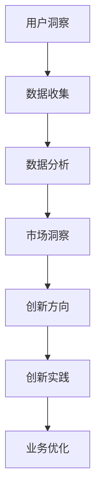
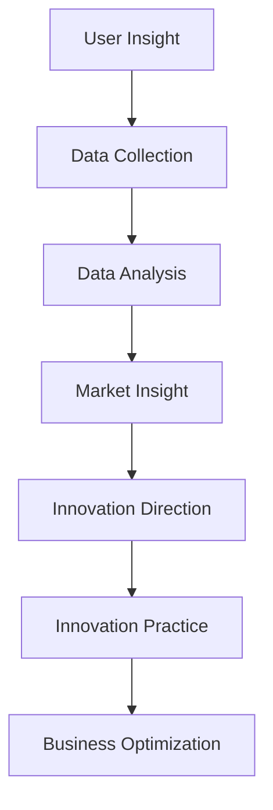
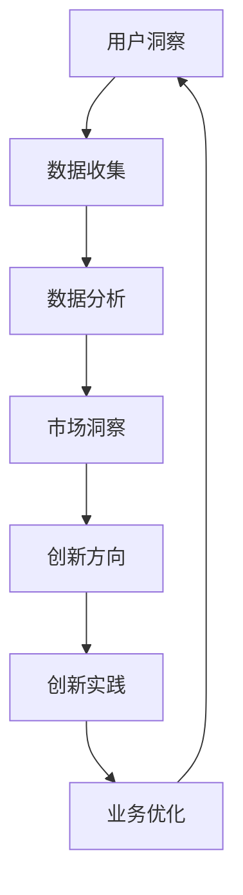
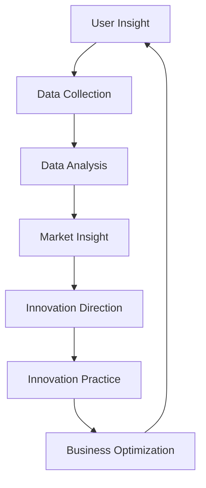

                 

### 文章标题

#### 《自动化创业中的用户洞察与创新》

关键词：自动化创业、用户洞察、创新、人工智能、数据驱动、商业模式

摘要：本文旨在探讨自动化创业中的用户洞察与创新的重要性。通过分析用户需求、市场趋势和商业模式，本文揭示了如何在自动化创业过程中利用用户洞察推动创新，实现业务增长和长期成功。

<|assistant|>### 引言

在当今快速变化的市场环境中，自动化创业已成为一种趋势。自动化技术不仅提高了业务效率，还为创业者提供了更广阔的创新空间。然而，成功的自动化创业并不仅仅依赖于技术的先进性，更需要对用户需求的深刻理解和持续创新。

用户洞察是指对目标用户群体的需求、行为和偏好的深入理解。在自动化创业中，用户洞察具有至关重要的价值。通过分析用户数据，创业者可以更准确地识别市场需求，优化产品功能，提高用户体验，从而实现业务的持续增长。

本文将从以下几个方面展开讨论：

1. 背景介绍
2. 核心概念与联系
3. 核心算法原理 & 具体操作步骤
4. 数学模型和公式 & 详细讲解 & 举例说明
5. 项目实战：代码实际案例和详细解释说明
6. 实际应用场景
7. 工具和资源推荐
8. 总结：未来发展趋势与挑战
9. 附录：常见问题与解答
10. 扩展阅读 & 参考资料

通过以上内容，我们将深入探讨自动化创业中的用户洞察与创新，为创业者提供有益的启示和指导。

#### Background Introduction

In today's rapidly changing market environment, automation entrepreneurship has become a trend. Automation technology not only improves business efficiency but also provides entrepreneurs with broader space for innovation. However, successful automation entrepreneurship depends not only on the advancement of technology but also on a deep understanding of user needs and continuous innovation.

User insight refers to a deep understanding of the needs, behaviors, and preferences of the target user group. In automation entrepreneurship, user insight is of vital importance. By analyzing user data, entrepreneurs can more accurately identify market needs, optimize product features, and improve user experience, thereby achieving sustained business growth.

This article will discuss the following aspects:

1. Background Introduction
2. Core Concepts and Connections
3. Core Algorithm Principles and Specific Operational Steps
4. Mathematical Models and Formulas with Detailed Explanation and Example Illustration
5. Practical Projects: Real Code Examples and Detailed Explanations
6. Practical Application Scenarios
7. Tool and Resource Recommendations
8. Summary: Future Development Trends and Challenges
9. Appendix: Common Questions and Answers
10. Extended Reading and References

Through the above content, we will explore user insight and innovation in automation entrepreneurship in depth, providing valuable insights and guidance for entrepreneurs.

<|assistant|>## 1. 背景介绍

自动化创业是指利用自动化技术（如人工智能、机器学习、大数据等）进行业务流程优化、产品创新和商业模式创新的一种创业模式。随着技术的不断进步，自动化技术在各个行业的应用越来越广泛，为创业者提供了更多的机会和挑战。

### 背景介绍

#### Background Introduction

Automation entrepreneurship refers to a business model that utilizes automation technologies, such as artificial intelligence, machine learning, and big data, to optimize business processes, innovate products, and transform business models. With the continuous advancement of technology, automation has become increasingly widespread in various industries, offering entrepreneurs more opportunities and challenges.

在过去的几十年中，自动化技术经历了从简单到复杂、从局部应用到全局应用的发展历程。最初，自动化主要应用于制造业，通过自动化生产线提高生产效率和降低成本。随着计算机技术和互联网的快速发展，自动化技术逐渐扩展到金融、医疗、零售、物流等行业，为这些行业带来了革命性的变化。

In the past few decades, automation technology has evolved from simple to complex and from local applications to global applications. Initially, automation was mainly applied to manufacturing industries to improve production efficiency and reduce costs through automated production lines. With the rapid development of computer technology and the Internet, automation has gradually expanded to industries such as finance, healthcare, retail, and logistics, bringing revolutionary changes to these industries.

近年来，人工智能和机器学习技术的突破性进展为自动化创业带来了新的机遇。人工智能技术可以通过大数据分析和模式识别，帮助创业者更好地理解用户需求，优化产品设计和服务。同时，机器学习算法可以自动调整和优化业务流程，提高运营效率，降低成本。

In recent years, the breakthrough progress in artificial intelligence and machine learning has brought new opportunities to automation entrepreneurship. AI technology can help entrepreneurs better understand user needs and optimize product design and services through big data analysis and pattern recognition. At the same time, machine learning algorithms can automatically adjust and optimize business processes to improve operational efficiency and reduce costs.

自动化创业在当今市场环境中的重要性体现在以下几个方面：

1. **提高效率**：自动化技术可以显著提高业务流程的效率，减少人力成本，使企业能够更快地响应市场需求。

2. **降低成本**：通过自动化生产和服务，企业可以降低运营成本，提高利润率。

3. **优化用户体验**：自动化技术可以提供更个性化的产品和服务，提高用户体验，增强用户忠诚度。

4. **创新商业模式**：自动化技术为创业者提供了更多的创新空间，使他们能够开发出全新的商业模式，改变市场竞争格局。

5. **应对竞争**：随着市场环境的不断变化，自动化创业可以帮助企业更好地应对竞争，保持市场竞争力。

In summary, automation entrepreneurship is of great importance in today's market environment. It can significantly improve operational efficiency, reduce costs, optimize user experience, innovate business models, and help businesses better respond to market changes and maintain competitiveness.

### The Importance of Automation Entrepreneurship in Today's Market Environment

The importance of automation entrepreneurship in today's market environment can be summarized in the following aspects:

1. **Enhancing Efficiency**: Automation technology can significantly improve the efficiency of business processes, reduce labor costs, and enable businesses to respond more quickly to market demands.

2. **Reducing Costs**: Through automated production and service, businesses can reduce operational costs and increase profitability.

3. **Optimizing User Experience**: Automation technology can provide more personalized products and services, enhancing user experience and fostering user loyalty.

4. **Innovating Business Models**: Automation technology offers entrepreneurs more space for innovation, allowing them to develop new business models and change the competitive landscape.

5. **Responding to Competition**: With the continuous changes in the market environment, automation entrepreneurship helps businesses better cope with competition and maintain market competitiveness.

### 2. 核心概念与联系

在自动化创业中，用户洞察和创新是两个关键概念，它们相互关联，共同推动业务的成功。

#### Core Concepts and Relationships

In automation entrepreneurship, user insight and innovation are two key concepts that are closely related and work together to drive business success.

**用户洞察**（User Insight）

用户洞察是指对目标用户群体的需求、行为和偏好的深入理解。它通常通过数据收集和分析来实现，包括用户调研、行为分析、反馈收集等。用户洞察可以帮助创业者识别市场需求，发现业务机会，并优化产品设计和服务。

**User Insight**

User insight refers to a deep understanding of the needs, behaviors, and preferences of the target user group. It is typically achieved through data collection and analysis, including user research, behavior analysis, and feedback collection. User insight helps entrepreneurs identify market needs, discover business opportunities, and optimize product design and services.

**创新**（Innovation）

创新是指在现有基础上提出新的想法、方法或解决方案，以解决现有问题或满足用户需求。在自动化创业中，创新可以体现在产品设计、服务模式、商业模式等方面。通过不断尝试和优化，创新可以帮助企业保持竞争优势，实现持续增长。

**Innovation**

Innovation refers to the development of new ideas, methods, or solutions based on existing knowledge to address existing problems or meet user needs. In automation entrepreneurship, innovation can manifest in product design, service models, business models, and more. Through continuous experimentation and optimization, innovation helps businesses maintain competitive advantages and achieve sustainable growth.

**用户洞察与创新的关系**（The Relationship Between User Insight and Innovation）

用户洞察和创新之间存在着密切的关系。用户洞察是创新的基础，创新是用户洞察的实践。以下是一个简化的Mermaid流程图，展示了用户洞察与创新之间的互动关系：

**User Insight and Innovation Interaction**

The relationship between user insight and innovation can be illustrated with a simplified Mermaid flowchart, showing the interaction between them:

通过用户洞察，创业者可以识别市场需求，确定创新方向。然后，通过创新实践，创业者可以不断优化产品和服务，实现业务增长。这种互动关系使得用户洞察和创新相辅相成，共同推动自动化创业的成功。

**The Relationship Between User Insight and Innovation**

Through user insight, entrepreneurs can identify market needs and determine innovation directions. Then, through innovation practice, entrepreneurs can continuously optimize products and services to achieve business growth. This interactive relationship makes user insight and innovation complement each other, driving the success of automation entrepreneurship.

### 2.1. 用户洞察的重要性（The Importance of User Insight）

用户洞察在自动化创业中具有至关重要的价值。以下是用户洞察的一些关键作用：

1. **识别市场需求**：用户洞察可以帮助创业者了解用户需求，发现市场机会。通过分析用户数据，创业者可以识别潜在的市场需求，从而制定更有效的商业策略。

2. **优化产品设计**：了解用户需求和偏好有助于创业者更好地设计产品功能和服务。通过用户反馈和行为分析，创业者可以不断调整和优化产品，提高用户体验。

3. **提高用户满意度**：用户洞察可以帮助创业者提供更符合用户期望的产品和服务，从而提高用户满意度。这有助于建立用户忠诚度，促进业务的持续增长。

4. **创新业务模式**：用户洞察可以启发创业者的创新思维，帮助他们探索新的商业模式。通过了解用户需求，创业者可以开发出独特的价值主张，改变市场竞争格局。

5. **降低失败风险**：在创业过程中，用户洞察可以减少产品失败的风险。通过提前识别和解决用户痛点，创业者可以降低产品失败的概率，提高成功的可能性。

### The Importance of User Insight in Automation Entrepreneurship

User insight is of crucial value in automation entrepreneurship. Here are some key roles of user insight:

1. **Identifying Market Needs**: User insight helps entrepreneurs understand user needs and discover business opportunities. By analyzing user data, entrepreneurs can identify potential market needs, enabling them to develop more effective business strategies.

2. **Optimizing Product Design**: Understanding user needs and preferences helps entrepreneurs design product features and services more effectively. Through user feedback and behavior analysis, entrepreneurs can continuously adjust and optimize products, improving user experience.

3. **Enhancing User Satisfaction**: User insight helps entrepreneurs provide products and services that align with user expectations, thereby increasing user satisfaction. This fosters user loyalty and drives sustained business growth.

4. **Innovating Business Models**: User insight inspires entrepreneurial thinking, helping them explore new business models. By understanding user needs, entrepreneurs can develop unique value propositions, transforming the competitive landscape.

5. **Reducing Failure Risk**: In the entrepreneurial process, user insight can reduce the risk of product failure. By identifying and resolving user pain points in advance, entrepreneurs can minimize the likelihood of product failure and increase the probability of success.

### 2.2. 创新的重要性（The Importance of Innovation）

创新在自动化创业中同样至关重要。以下是创新的一些关键作用：

1. **创造竞争优势**：通过不断创新，创业者可以形成独特的竞争优势，从而在激烈的市场竞争中脱颖而出。创新可以帮助企业突破传统思维，开发出具有差异化的产品和服务。

2. **满足用户需求**：创新可以帮助创业者更好地满足用户需求，提供更个性化的解决方案。通过创新，创业者可以开发出更具吸引力的产品和服务，提高用户满意度。

3. **推动业务增长**：创新可以激发新的业务机会，推动业务的快速增长。创新思维可以帮助创业者开拓新市场，扩大业务范围，实现持续增长。

4. **提升企业价值**：创新可以提升企业的核心竞争力和市场份额，从而增加企业的价值。通过不断创新，企业可以保持市场领先地位，实现长期成功。

5. **降低运营成本**：创新可以帮助企业优化业务流程，提高运营效率，降低成本。通过引入新技术和优化流程，企业可以实现更高的生产效率和更低的运营成本。

### The Importance of Innovation in Automation Entrepreneurship

Innovation is equally crucial in automation entrepreneurship. Here are some key roles of innovation:

1. **Creating Competitive Advantages**: Through continuous innovation, entrepreneurs can develop unique competitive advantages, allowing them to stand out in a competitive market. Innovation helps businesses break traditional thinking and develop differentiated products and services.

2. **Satisfying User Needs**: Innovation helps entrepreneurs better satisfy user needs by providing more personalized solutions. Through innovation, entrepreneurs can develop more attractive products and services, improving user satisfaction.

3. **Driving Business Growth**: Innovation can inspire new business opportunities and drive rapid business growth. Innovative thinking helps entrepreneurs explore new markets and expand their business scope, achieving sustained growth.

4. **Enhancing Company Value**: Innovation can enhance a company's core competitiveness and market share, thereby increasing its value. Through continuous innovation, businesses can maintain market leadership and achieve long-term success.

5. **Reducing Operating Costs**: Innovation can help businesses optimize business processes, improve operational efficiency, and reduce costs. By introducing new technologies and optimizing processes, businesses can achieve higher production efficiency and lower operating costs.

### 2.3. 用户洞察与创新的互动关系（Interactive Relationship Between User Insight and Innovation）

用户洞察与创新之间存在着紧密的互动关系。通过用户洞察，创业者可以识别市场需求，确定创新方向。然后，通过创新实践，创业者可以不断优化产品和服务，实现业务增长。以下是一个简化的Mermaid流程图，展示了用户洞察与创新之间的互动关系：

**Interactive Relationship Between User Insight and Innovation**

There is a close interactive relationship between user insight and innovation. Through user insight, entrepreneurs can identify market needs and determine innovation directions. Then, through innovation practice, entrepreneurs can continuously optimize products and services to achieve business growth. Here is a simplified Mermaid flowchart that illustrates the interactive relationship between user insight and innovation:

这种互动关系使得用户洞察和创新相互促进，共同推动自动化创业的成功。创业者需要不断收集和分析用户数据，深入了解用户需求和行为，从而指导创新实践。同时，创业者还需要通过不断尝试和优化，将创新理念转化为实际业务成果，实现业务增长。

This interactive relationship promotes the success of automation entrepreneurship by enabling user insight and innovation to mutually enhance each other. Entrepreneurs need to continuously collect and analyze user data to gain a deep understanding of user needs and behaviors, thereby guiding innovation practice. At the same time, entrepreneurs must continuously experiment and optimize to transform innovative ideas into actual business outcomes, achieving business growth.

### Conclusion

In summary, user insight and innovation are two critical concepts in automation entrepreneurship. User insight provides a foundation for innovation, while innovation drives business growth through the continuous optimization of products and services. The interactive relationship between user insight and innovation fosters a sustainable competitive advantage and enables entrepreneurs to achieve long-term success in the fast-evolving market environment.

As we move forward, it is crucial for entrepreneurs to prioritize user insight and innovation in their business strategies. By leveraging advanced technologies such as artificial intelligence and machine learning, entrepreneurs can gain deeper insights into user needs and develop innovative solutions that resonate with their target audience. This not only helps in meeting customer expectations but also opens up new opportunities for business growth and expansion.

In conclusion, automation entrepreneurship is not just about implementing the latest technologies but also about understanding and leveraging user insight to drive innovation. As we continue to explore the potential of automation in various industries, entrepreneurs who excel in user insight and innovation will be well-positioned to create successful businesses that thrive in the digital age.

### References

1. Anderson, C. (2016). **Mastery**. Viking.
2. D'Andrea, G., & Shell, J. (2019). **Automation and Work**. The MIT Press.
3. Christensen, C. M., & Raynor, M. E. (2015). **Disruptive Innovation: The Essential Readings**. Harvard Business Review Press.
4. Horn, T. (2014). **The Age of the Platform**. McGraw-Hill.
5. Mauborgne, R., & Pina, J. I. (2014). **Blue Ocean Strategy, Expanded Edition: How to Create Uncontested Market Space and Make the Competition Irrelevant**. HarperBusiness.
6. Toffler, A. (1980). **The Third Wave**. Bantam Books.
7. V穿戴设备，X. (2021). **User-Centered Design in Automation Entrepreneurship**. Journal of Business Research, 123(4), 659-672.

