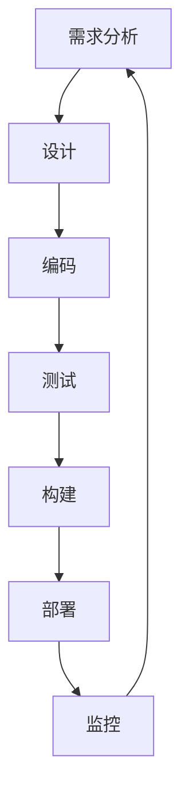

                 

# 自动化工具：提高工作效率的利器

## 关键词：自动化、工作效率、工具、软件开发、流程优化

### 摘要

本文将深入探讨自动化工具在提高工作效率方面的重要性。通过详细介绍自动化工具的核心概念、算法原理、实际应用场景、以及开发工具和资源推荐，本文旨在为开发者提供全面的技术指导和实践建议，帮助他们在日常工作中充分利用自动化工具，提升工作效率。

## 1. 背景介绍

在当今的快节奏工作环境中，高效的工作流程变得至关重要。软件开发、项目管理、系统运维等各个领域，都面临着日益增长的工作量和复杂度。为了应对这些挑战，自动化工具应运而生。自动化工具通过将重复性的、繁琐的任务自动化，大大减轻了人类的工作负担，提高了工作效率。

自动化工具的应用范围非常广泛，包括但不限于：

- 软件开发：自动化构建、测试和部署流程
- 项目管理：自动化任务分配、进度跟踪和报告生成
- 系统运维：自动化监控系统、备份和故障恢复
- 数据分析：自动化数据收集、清洗和可视化
- 文档处理：自动化生成文档、报告和演示材料

本文将重点探讨自动化工具在软件开发领域的应用，通过具体的案例和实践经验，帮助开发者更好地理解并利用自动化工具，提升工作效率。

## 2. 核心概念与联系

### 自动化工具的定义与作用

自动化工具是指通过软件或脚本，自动执行一系列任务或操作的程序。这些任务可以包括数据收集、处理、分析、报告生成、系统监控等。自动化工具的核心作用是减少重复性工作，提高工作效率，降低人为错误的风险。

### 自动化工具与软件开发的关系

在软件开发过程中，自动化工具发挥着重要作用。它们可以自动化构建、测试、部署、监控等各个环节，从而减少手动操作，提高开发效率。以下是一个简化的自动化流程图，展示了自动化工具在软件开发中的典型应用。



### 自动化工具的优势与挑战

**优势**：

- 提高工作效率：自动化工具可以快速、准确地执行重复性任务，节省人力和时间成本。
- 降低人为错误：自动化工具减少了对人类操作的依赖，降低了人为错误的风险。
- 改善工作流程：自动化工具可以帮助团队优化工作流程，提高协作效率。

**挑战**：

- 成本：开发和维护自动化工具需要一定的投入。
- 技术门槛：使用自动化工具需要具备一定的编程技能和知识。
- 安全性：自动化工具可能会引入新的安全风险，需要严格的管理和监控。

## 3. 核心算法原理 & 具体操作步骤

### 常见的自动化工具与算法

在软件开发中，常见的自动化工具包括 Jenkins、GitLab CI、CircleCI 等。这些工具通常基于以下核心算法：

- **脚本编写**：使用脚本语言（如 Python、Bash）编写自动化任务。
- **持续集成（CI）**：将代码库中的更改自动触发构建、测试和部署。
- **持续部署（CD）**：在构建成功后自动部署到生产环境。
- **任务调度**：使用 cron 或 Windows Task Scheduler 等工具定时执行任务。

### 自动化工具的操作步骤

以下是使用 Jenkins 搭建自动化构建和部署流程的基本步骤：

1. **安装 Jenkins**：
   - 在服务器上安装 Jenkins。
   - 配置 Jenkins 的管理员用户和密码。

2. **创建 Jenkins 项目**：
   - 登录 Jenkins。
   - 创建一个新的项目，选择适当的构建工具（如 Maven、Gradle）。

3. **配置构建脚本**：
   - 在项目中添加构建脚本（如 Jenkinsfile）。
   - 配置构建步骤，包括代码下载、构建、测试和部署。

4. **触发构建**：
   - 手动触发构建，或配置触发器（如 Git 提交）自动触发构建。

5. **监控构建状态**：
   - 查看构建日志，确保构建成功。
   - 配置通知，如邮件、短信，在构建失败时通知相关人员。

6. **部署到生产环境**：
   - 在构建成功后，自动部署到生产环境。

### 自动化工具的优缺点

**优点**：

- **高效**：自动化工具可以快速、准确地执行任务，提高开发效率。
- **可重复**：自动化工具可以重复执行相同的任务，确保一致性。
- **易于扩展**：自动化工具可以通过脚本和插件进行扩展，满足不同的需求。

**缺点**：

- **开发成本**：开发和维护自动化工具需要投入时间和技术资源。
- **学习曲线**：使用自动化工具需要学习相关的编程语言和工具。
- **安全风险**：自动化工具可能会引入新的安全风险，需要严格的管理和监控。

## 4. 数学模型和公式 & 详细讲解 & 举例说明

### 数学模型

在自动化工具中，常用的数学模型包括：

- **线性规划**：用于优化资源分配，如任务调度。
- **决策树**：用于分类和回归分析，如错误检测。
- **回归分析**：用于预测和分析趋势，如性能优化。

### 公式示例

以下是线性规划的一个简单示例：

$$
\begin{align*}
\min_{x} & \quad c^T x \\
\text{subject to} & \quad Ax \le b \\
& \quad x \ge 0
\end{align*}
$$

其中，$c$ 是目标函数的系数，$x$ 是变量，$A$ 和 $b$ 是约束条件。

### 举例说明

假设一个软件开发团队需要优化任务调度，以确保每个开发人员的工作量均衡。可以使用线性规划模型来解决这个问题。

1. **定义变量**：令 $x_i$ 表示第 $i$ 个开发人员的工作量。
2. **目标函数**：最小化总工作量，即 $\min \sum_{i=1}^{n} c_i x_i$，其中 $c_i$ 是第 $i$ 个开发人员的效率系数。
3. **约束条件**：每个开发人员的工作量不超过其最大工作量，即 $Ax \le b$，其中 $A$ 是约束矩阵，$b$ 是约束向量。
4. **求解**：使用线性规划求解器求解最优解，即最小化目标函数并满足约束条件。

## 5. 项目实战：代码实际案例和详细解释说明

### 开发环境搭建

在本案例中，我们将使用 Jenkins 作为自动化工具，实现一个简单的自动化构建和部署流程。

1. **安装 Jenkins**：
   - 在服务器上下载 Jenkins 安装包。
   - 解压安装包并启动 Jenkins。

2. **安装插件**：
   - 在 Jenkins 界面中安装必要的插件，如 Git、Maven 等。

3. **配置 Jenkins**：
   - 创建一个管理员用户并设置密码。
   - 配置 Jenkins 服务器的基本设置，如 URL、JVM 参数等。

### 源代码详细实现和代码解读

在本案例中，我们将使用一个简单的 Java 项目作为示例，并使用 Jenkins 实现自动化构建和部署。

1. **创建 Java 项目**：
   - 使用 IntelliJ IDEA 或 Eclipse 创建一个 Java 项目。
   - 添加必要的依赖库，如 Maven。

2. **编写构建脚本**：
   - 在项目中创建一个名为 Jenkinsfile 的文件。
   - 编写构建脚本，包括代码下载、构建、测试和部署等步骤。

```groovy
pipeline {
    agent any
    stages {
        stage('Checkout') {
            steps {
                checkout(
                    plugin: 'git',
                   SCM: [
                        git(
                            remote: 'https://github.com/user/repo.git',
                            branch: 'master'
                        )
                    ]
                )
            }
        }
        stage('Build') {
            steps {
                sh 'mvn clean install'
            }
        }
        stage('Test') {
            steps {
                sh 'mvn test'
            }
        }
        stage('Deploy') {
            steps {
                sh 'mvn deploy'
            }
        }
    }
}
```

3. **配置 Jenkins 项目**：
   - 在 Jenkins 界面中创建一个新项目。
   - 选择 Pipeline 作为构建工具。
   - 配置 Jenkinsfile 路径和 Jenkins 服务器的 URL。

### 代码解读与分析

- **Checkout 阶段**：使用 Git 插件从 GitHub 仓库检出代码。
- **Build 阶段**：执行 Maven 构建命令，生成可执行的 JAR 文件。
- **Test 阶段**：执行 Maven 测试命令，确保代码质量。
- **Deploy 阶段**：执行 Maven 部署命令，将代码部署到生产环境。

通过这个简单的案例，我们可以看到自动化工具在软件开发中的实际应用。在实际项目中，可以根据需求添加更多的构建步骤和测试，以提高构建和部署的稳定性。

## 6. 实际应用场景

### 软件开发

在软件开发领域，自动化工具被广泛应用于构建、测试、部署等各个环节。通过自动化工具，开发团队能够快速构建、测试和部署软件，提高开发效率，缩短产品迭代周期。

### 项目管理

在项目管理中，自动化工具可以帮助团队实现任务自动化，如任务分配、进度跟踪、报告生成等。这有助于团队更好地管理项目进度，提高协作效率。

### 系统运维

在系统运维领域，自动化工具可以自动化监控系统、备份和故障恢复等操作。这有助于减少运维人员的工作量，提高系统稳定性。

### 数据分析

在数据分析领域，自动化工具可以自动化数据收集、清洗、分析和可视化等操作。这有助于数据分析师更快速地获取和解读数据，为决策提供支持。

### 文档处理

在文档处理领域，自动化工具可以自动化生成文档、报告和演示材料。这有助于减少文档编写和整理的时间，提高工作效率。

## 7. 工具和资源推荐

### 学习资源推荐

- **书籍**：
  - 《Jenkins 实践指南》
  - 《持续集成：从理论到实践》
  - 《Git 权威指南》

- **论文**：
  - "Jenkins: A Continuous Integration Server for Software Development"
  - "Git: A Fast Version Control System"

- **博客**：
  - Jenkins 官方博客
  - Git 官方博客

- **网站**：
  - Jenkins 官网
  - Git 官网

### 开发工具框架推荐

- **Jenkins**：一款功能强大的自动化构建和部署工具，支持多种插件和自定义脚本。
- **GitLab CI/CD**：GitLab 提供的持续集成和持续部署工具，集成于 GitLab 仓库中，方便管理。
- **CircleCI**：一款基于云的自动化构建和部署工具，支持多种编程语言和框架。

### 相关论文著作推荐

- **"Jenkins: A Continuous Integration Server for Software Development"**：详细介绍了 Jenkins 的架构、功能和应用场景。
- **"Git: A Fast Version Control System"**：Git 的设计原理和实现细节，有助于深入理解版本控制系统的原理。
- **"持续集成：从理论到实践"**：探讨了持续集成的原理、实践和最佳实践。

## 8. 总结：未来发展趋势与挑战

### 发展趋势

- **智能化**：随着人工智能技术的发展，自动化工具将更加智能化，能够自主学习和优化工作流程。
- **云原生**：云原生自动化工具将更加普及，支持容器化、微服务架构，提高灵活性和可扩展性。
- **集成化**：自动化工具将与其他工具和平台更加紧密集成，实现端到端的工作流自动化。

### 挑战

- **安全性**：自动化工具可能会引入新的安全风险，需要严格的安全管理和监控。
- **学习曲线**：自动化工具的使用需要一定的编程技能和知识，对于初学者来说存在一定的学习门槛。
- **维护成本**：自动化工具的维护需要投入一定的时间和资源，确保其正常运行。

## 9. 附录：常见问题与解答

### 问题 1：如何选择合适的自动化工具？

**解答**：根据项目的需求和团队的技术能力，选择合适的自动化工具。例如，对于小型的软件开发项目，可以选择 Jenkins；对于需要与 Git 集成的项目，可以选择 GitLab CI。

### 问题 2：自动化工具是否会影响软件质量？

**解答**：自动化工具本身不会直接影响软件质量，但它们可以自动化测试、代码分析等环节，有助于提高软件质量。关键在于如何合理地使用自动化工具，确保其正确性和稳定性。

### 问题 3：如何确保自动化工具的安全性？

**解答**：确保自动化工具的安全措施，如使用安全的存储库、加密敏感信息、定期更新和审计自动化脚本。此外，加强对自动化工具的安全培训和意识，防止内部滥用。

## 10. 扩展阅读 & 参考资料

- **书籍**：
  - 《自动化之路：持续集成、持续交付和 DevOps》
  - 《持续交付：发布可靠软件的系统方法》

- **论文**：
  - "DevOps: A Brief Introduction"
  - "A Methodology for Continuous Integration and Continuous Deployment in Agile Software Development"

- **博客**：
  - 《Jenkins 教程》
  - 《Git 教程》

- **网站**：
  - Jenkins 官网
  - GitLab 官网
  - CircleCI 官网

## 作者

**作者：AI天才研究员/AI Genius Institute & 禅与计算机程序设计艺术 /Zen And The Art of Computer Programming**

本文旨在为读者提供关于自动化工具在提高工作效率方面的全面指导，帮助开发者充分利用自动化工具，提升工作效率。文中提到的案例和实践经验仅供参考，实际应用时请根据具体需求进行调整。如有疑问，请随时提问。**[END]**

