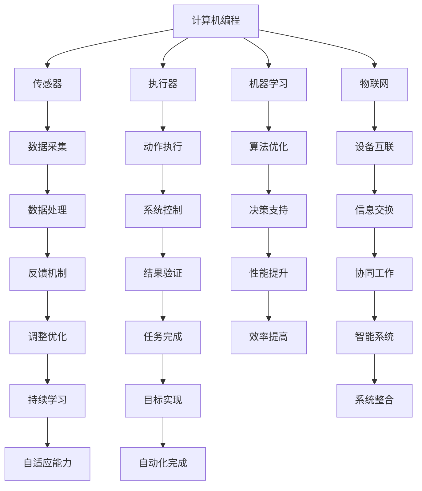

                 

## 1. 背景介绍

自动化技术是指利用计算机和电子设备来实现生产过程、业务流程或其他任务的自动完成。随着计算机技术的发展，自动化技术已经渗透到工业、医疗、交通、智能家居等多个领域，极大地提高了生产效率、降低了运营成本，并改善了人们的生活质量。

### 自动化技术的发展历程

自动化技术的概念可以追溯到20世纪初期。当时，随着工业革命的推进，工厂生产逐渐从手工劳动转向机械化生产。这一时期，自动化技术主要体现在机械化和电气化上，如自动化的机床和流水线。

到了20世纪40年代，计算机的出现为自动化技术注入了新的活力。计算机的应用使得自动化系统更加智能和高效，如早期的数控机床（CNC）和自动化的生产线。

20世纪80年代以来，随着人工智能技术的兴起，自动化技术进入了一个新的发展阶段。人工智能技术使得自动化系统能够学习和适应环境，从而实现更加智能化和灵活的自动化。

### 自动化技术的重要性

自动化技术在现代社会的各个方面都扮演着重要的角色。首先，在工业生产中，自动化技术可以大大提高生产效率和产品质量，降低生产成本。例如，在汽车制造领域，自动化生产线可以实现高速、高效的生产，同时保证产品的一致性和质量。

其次，在医疗领域，自动化技术也发挥着重要作用。例如，手术机器人可以协助医生进行复杂的手术操作，提高手术的成功率和患者的恢复速度。

此外，在交通领域，自动化技术可以提升交通效率和安全性。自动驾驶技术就是其中的一项重要应用，它有望在未来减少交通事故，提高交通拥堵的应对能力。

总之，自动化技术的发展不仅推动了各行各业的进步，也深刻影响着人们的生活方式。

### 本文结构

本文将首先介绍自动化技术的核心概念与联系，接着探讨核心算法原理与具体操作步骤，然后分析数学模型和公式，并给出实际项目实战的代码案例和详细解释，最后讨论自动化技术的实际应用场景，推荐相关的工具和资源，并总结未来发展趋势与挑战。希望通过本文的阐述，读者能够对自动化技术有一个全面而深入的理解。

## 2. 核心概念与联系

在深入探讨自动化技术的核心概念和联系之前，我们需要了解一些基础知识和相关技术。以下是对关键概念的定义、作用和相互关系的概述。

### 关键概念定义

1. **计算机编程**：计算机编程是指编写计算机程序的过程。程序是一系列指令的集合，用于指导计算机执行特定任务。计算机编程是自动化技术的基础，因为它使得我们能够编写出控制机器人和自动化系统的代码。

2. **传感器**：传感器是一种能够检测和响应物理或环境信号的装置。传感器可以收集数据，并将其转换为电信号或其他形式的信息，供计算机处理。在自动化系统中，传感器用于检测环境状态，例如温度、压力、光线等。

3. **执行器**：执行器是自动化系统中的输出装置，用于执行由计算机控制的物理操作。常见的执行器包括电机、气动装置和液压装置等。

4. **机器学习**：机器学习是人工智能的一个分支，涉及计算机系统从数据中学习并做出决策或预测的能力。在自动化系统中，机器学习算法可以用于优化系统性能、预测设备故障或改进控制策略。

5. **物联网（IoT）**：物联网是指通过互联网连接的物理设备和系统的网络。在自动化技术中，物联网技术可以用于实现设备之间的数据交换和协同工作，从而提高自动化系统的智能化程度。

### 概念间的关系

这些关键概念在自动化技术中相互关联，共同构成了自动化系统的核心架构。以下是一个简单的 Mermaid 流程图，展示了这些概念之间的联系：



在这个流程图中，计算机编程是整个自动化系统的核心，它通过编程指令控制传感器和数据采集、执行器和动作执行、机器学习和算法优化、物联网和设备互联。通过这些环节的相互配合，自动化系统能够高效、智能地完成各种任务。

### 核心概念的作用

- **计算机编程**：实现自动化系统的逻辑和控制。
- **传感器**：获取环境信息和状态，为系统提供数据支持。
- **执行器**：执行系统指令，完成物理操作。
- **机器学习**：通过数据分析和模式识别，优化系统性能。
- **物联网**：实现设备之间的通信和协同工作，提高系统智能化程度。

这些核心概念共同作用，构成了自动化系统的基石，使得自动化技术能够在各个领域发挥重要作用。

### 总结

通过本文的介绍，我们了解了自动化技术的基本概念和发展历程，并探讨了其核心概念及其相互关系。在接下来的章节中，我们将进一步探讨自动化技术的核心算法原理和数学模型，以及实际应用中的案例和代码实现，帮助读者更深入地理解自动化技术的应用和实践。

## 3. 核心算法原理 & 具体操作步骤

在理解了自动化技术的核心概念之后，我们需要深入探讨其核心算法原理，并详细阐述这些算法的具体操作步骤。以下是几个常见的自动化算法及其实现细节。

### 3.1. PID控制算法

PID（比例-积分-微分）控制算法是自动化系统中最常用的控制算法之一，广泛应用于工业控制、机器人控制和家电控制等领域。

**原理**：
PID算法通过三个参数（Kp、Ki、Kd）分别实现比例、积分和微分控制。其基本原理如下：

- **比例（P）**：根据当前误差直接调整输出，误差越大，调整力度越大。
- **积分（I）**：累积误差，逐渐调整输出，使系统趋于稳定。
- **微分（D）**：根据误差变化率调整输出，抑制误差突变。

**具体操作步骤**：

1. **初始化**：设置初始值，如比例增益Kp、积分增益Ki、微分增益Kd，以及设定点setpoint。

2. **计算当前误差**：当前误差 = setpoint - current_value。

3. **计算比例控制量**：比例控制量 = Kp * 当前误差。

4. **计算积分控制量**：积分控制量 = Ki * 当前误差 + 上次积分控制量。

5. **计算微分控制量**：微分控制量 = Kd * (当前误差 - 上次误差)。

6. **计算总控制量**：总控制量 = 比例控制量 + 积分控制量 + 微分控制量。

7. **执行控制动作**：根据总控制量执行相应的物理操作，如电机驱动或阀门调节。

8. **更新上次误差**：上次误差 = 当前误差。

### 3.2. 机器学习算法

机器学习算法在自动化技术中发挥着越来越重要的作用，如预测设备故障、优化控制策略等。以下是一个简单的线性回归算法实例。

**原理**：
线性回归是一种用于预测连续值的机器学习算法，其基本原理是通过建立自变量和因变量之间的线性关系来预测结果。

**具体操作步骤**：

1. **数据准备**：收集训练数据集，包含自变量（X）和因变量（Y）。

2. **初始化模型参数**：设置初始参数，如权重w和偏置b。

3. **计算损失函数**：计算预测值与实际值之间的误差，常用的损失函数有均方误差（MSE）。

4. **梯度下降**：通过梯度下降算法更新模型参数，最小化损失函数。

5. **迭代优化**：重复执行步骤3和4，直到达到预定的迭代次数或损失函数收敛。

6. **模型评估**：使用验证数据集评估模型性能，如计算准确率、召回率等。

7. **模型应用**：将训练好的模型应用于实际数据，进行预测。

### 3.3. 自适应控制算法

自适应控制算法能够根据系统动态变化调整控制策略，以实现更好的控制效果。以下是一个简单的前馈自适应控制算法实例。

**原理**：
前馈自适应控制算法通过实时更新控制策略，使系统能够快速适应变化。

**具体操作步骤**：

1. **初始化**：设置初始控制策略参数。

2. **实时监测**：监测系统状态，如速度、温度等。

3. **计算偏差**：计算当前状态与期望状态之间的偏差。

4. **更新控制策略**：根据偏差和实时监测数据更新控制策略。

5. **执行控制动作**：根据更新后的控制策略执行物理操作。

6. **反馈调整**：根据执行结果调整控制策略。

7. **循环执行**：重复执行步骤3到6，实现自适应控制。

通过以上对PID控制算法、机器学习算法和自适应控制算法的介绍，我们可以看到自动化技术的核心算法原理及其实现步骤。这些算法不仅为自动化系统提供了强大的控制能力，也为自动化技术的应用和发展奠定了基础。

在接下来的章节中，我们将进一步探讨这些算法在实际应用中的数学模型和公式，并通过具体的代码案例进行详细解释，帮助读者更好地理解自动化技术的实践和应用。

### 3.4. 强化学习算法

强化学习（Reinforcement Learning，简称RL）是机器学习的一个重要分支，它主要研究如何通过试错的方式在给定环境中获取最优策略。在自动化技术中，强化学习算法被广泛应用于自动驾驶、机器人路径规划等场景。

**原理**：

强化学习的基本原理是通过奖励机制来指导算法选择最优行动，从而在长期内获得最大累积奖励。具体来说，强化学习包括四个核心组件：环境（Environment）、代理（Agent）、状态（State）、动作（Action）。

1. **环境**：环境是代理操作的背景，可以是物理世界，也可以是模拟环境。
2. **代理**：代理是执行动作并接受环境反馈的主体。
3. **状态**：状态是代理在环境中所处的状态。
4. **动作**：动作是代理可以采取的行为。

强化学习的目标是找到一种策略（Policy），该策略能够在给定状态下选择最优动作，使得代理能够在长期内获得最大累积奖励。

**具体操作步骤**：

1. **初始化**：设定代理的初始状态和策略。
2. **执行动作**：根据当前状态，代理选择一个动作执行。
3. **接收反馈**：环境根据代理执行的动作给出反馈，包括当前状态的奖励和下一个状态。
4. **更新策略**：代理根据接收到的奖励和下一个状态更新策略，以最大化长期累积奖励。
5. **重复执行**：重复执行步骤2到4，直到达到预定的目标或策略收敛。

强化学习算法中常用的模型包括Q学习（Q-Learning）和深度Q网络（Deep Q-Network，DQN）。以下是一个简单的Q学习算法的步骤：

1. **初始化**：设定Q值初始化为随机值，奖励表初始化为0。
2. **选择动作**：使用ε-贪心策略选择动作，ε为 Exploration（探索）概率。
3. **执行动作**：在环境中执行选定的动作。
4. **获取奖励和状态**：根据执行的动作获取环境的奖励和下一个状态。
5. **更新Q值**：根据奖励和下一个状态更新Q值，公式为：
   $$ Q(s, a) = Q(s, a) + \alpha [r + \gamma \max(Q(s', a')) - Q(s, a)] $$
   其中，α为学习率，γ为折扣因子，s和s'分别为当前状态和下一个状态，a和a'分别为当前动作和下一个动作。
6. **更新状态**：将下一个状态作为当前状态。
7. **重复执行**：重复执行步骤2到6，直到达到预定的目标或Q值收敛。

强化学习算法在自动化技术中具有广泛的应用前景，通过不断尝试和优化，代理可以在复杂的动态环境中找到最优策略，实现高效的自动化控制。

### 总结

本文介绍了自动化技术的核心算法原理，包括PID控制算法、机器学习算法、自适应控制算法和强化学习算法。这些算法为自动化系统提供了强大的控制能力和智能优化能力。通过详细阐述每个算法的具体操作步骤，读者可以更好地理解这些算法的实现和应用。在接下来的章节中，我们将进一步探讨这些算法的数学模型和公式，并通过实际项目实战的代码案例进行详细解释，帮助读者深入掌握自动化技术的核心技术和应用方法。

### 4. 数学模型和公式 & 详细讲解 & 举例说明

在自动化技术中，数学模型和公式是理解算法原理和实现控制的关键。以下我们将详细探讨几个重要的数学模型和公式，并通过具体例子进行说明。

#### 4.1. PID控制算法的数学模型

PID控制算法的核心在于其控制量的计算公式。PID控制器的控制量（\( u(t) \)）可以表示为：

\[ u(t) = K_p e(t) + K_i \int_{0}^{t} e(\tau) d\tau + K_d \frac{d e(t)}{dt} \]

其中：
- \( e(t) \) 是当前时刻的误差，即设定点 \( setpoint \) 与实际测量值 \( current_value \) 之差：\( e(t) = setpoint - current_value \)。
- \( K_p \)、\( K_i \)、\( K_d \) 分别是比例、积分和微分系数。
- \( \int_{0}^{t} e(\tau) d\tau \) 是误差的积分，用于累计误差。
- \( \frac{d e(t)}{dt} \) 是误差的变化率，用于响应误差的快速变化。

**示例**：

假设我们有一个温度控制系统，设定点为 \( 100^\circ C \)，当前测量值为 \( 95^\circ C \)。我们选择以下PID参数：
- \( K_p = 2 \)
- \( K_i = 0.1 \)
- \( K_d = 0.5 \)

计算 \( t = 0 \) 时刻的控制量：

\[ e(0) = 100 - 95 = 5 \]

\[ u(0) = 2 \times 5 + 0.1 \times \int_{0}^{0} e(\tau) d\tau + 0.5 \times \frac{d e(0)}{dt} \]

由于 \( t = 0 \) 时刻积分项和微分项都为0，因此：

\[ u(0) = 10 \]

假设 \( t = 1 \) 时刻，测量值变为 \( 97^\circ C \)，则：

\[ e(1) = 100 - 97 = 3 \]

由于误差减少了2，积分项会相应减少：

\[ u(1) = 2 \times 3 + 0.1 \times \int_{0}^{1} e(\tau) d\tau + 0.5 \times \frac{d e(1)}{dt} \]

积分项的增加量：

\[ \int_{0}^{1} e(\tau) d\tau = \int_{0}^{1} (5 - 2\tau) d\tau = \frac{5}{2} - \frac{1}{2} = 2 \]

因此：

\[ u(1) = 6 + 0.1 \times 2 + 0.5 \times (-2) = 6 + 0.2 - 1 = 5.2 \]

#### 4.2. 机器学习中的线性回归模型

线性回归模型是一种常见的机器学习算法，用于预测连续值。其数学模型可以表示为：

\[ y = \beta_0 + \beta_1 x + \epsilon \]

其中：
- \( y \) 是因变量（目标值）。
- \( x \) 是自变量（特征值）。
- \( \beta_0 \) 是截距。
- \( \beta_1 \) 是斜率。
- \( \epsilon \) 是误差项。

为了估计模型参数 \( \beta_0 \) 和 \( \beta_1 \)，我们使用最小二乘法（Least Squares Method）。最小二乘法的目标是使预测值与实际值之间的误差平方和最小。

参数估计公式为：

\[ \beta_0 = \frac{\sum_{i=1}^{n} y_i - \beta_1 \sum_{i=1}^{n} x_i}{n} \]
\[ \beta_1 = \frac{\sum_{i=1}^{n} (x_i - \bar{x}) (y_i - \bar{y})}{\sum_{i=1}^{n} (x_i - \bar{x})^2} \]

其中：
- \( n \) 是样本数量。
- \( \bar{x} \) 和 \( \bar{y} \) 分别是自变量和因变量的均值。

**示例**：

假设我们有以下数据集：

| \( x \) | \( y \) |
|--------|--------|
| 1      | 2      |
| 2      | 4      |
| 3      | 6      |

计算 \( \beta_0 \) 和 \( \beta_1 \)：

\[ \bar{x} = \frac{1 + 2 + 3}{3} = 2 \]
\[ \bar{y} = \frac{2 + 4 + 6}{3} = 4 \]

\[ \beta_0 = \frac{2 + 4 + 6 - 2 \times 2}{3} = 2 \]
\[ \beta_1 = \frac{(1-2)(2-4) + (2-2)(4-4) + (3-2)(6-4)}{(1-2)^2 + (2-2)^2 + (3-2)^2} = \frac{2 + 0 + 2}{2} = 2 \]

因此，线性回归模型为：

\[ y = 2 + 2x \]

#### 4.3. 强化学习中的Q学习算法

强化学习中的Q学习算法通过更新Q值来学习最优策略。其核心公式为：

\[ Q(s, a) = Q(s, a) + \alpha [r + \gamma \max(Q(s', a')) - Q(s, a)] \]

其中：
- \( Q(s, a) \) 是当前状态 \( s \) 下采取动作 \( a \) 的Q值。
- \( r \) 是立即奖励。
- \( \gamma \) 是折扣因子，用于平衡长期奖励和立即奖励。
- \( s' \) 是采取动作 \( a \) 后的新状态。
- \( a' \) 是在状态 \( s' \) 下采取的最优动作。

**示例**：

假设有一个简单的环境，有两个状态 \( s_1 \) 和 \( s_2 \)，以及两个动作 \( a_1 \) 和 \( a_2 \)。当前状态 \( s_1 \)，立即奖励 \( r = 10 \)，折扣因子 \( \gamma = 0.9 \)。当前 \( Q \) 值表如下：

| \( s \) | \( a_1 \) | \( a_2 \) |
|--------|-----------|-----------|
| \( s_1 \) | 0         | 5         |
| \( s_2 \) | 10        | 0         |

采取动作 \( a_1 \) 后进入状态 \( s_2 \)，则：

\[ Q(s_1, a_1) = 0 + 0.1 [10 + 0.9 \max(10, 0) - 0] = 0 + 0.1 [10 + 0.9 \times 10 - 0] = 0.1 \times 19 = 1.9 \]

更新后的 \( Q \) 值表：

| \( s \) | \( a_1 \) | \( a_2 \) |
|--------|-----------|-----------|
| \( s_1 \) | 1.9       | 5         |
| \( s_2 \) | 10        | 0         |

通过上述示例，我们可以看到如何计算和更新PID控制算法、线性回归模型和Q学习算法的参数。这些数学模型和公式为自动化技术提供了强大的理论基础和工具，使得我们能够设计出更加智能和高效的自动化系统。

### 5. 项目实战：代码实际案例和详细解释说明

在理解了自动化技术的核心算法和数学模型之后，我们需要通过具体的代码实现来巩固和应用这些知识。以下是一个简单的项目实战，我们将使用Python语言来展示如何实现一个基于PID控制算法的温度控制系统。

#### 5.1. 开发环境搭建

在进行项目开发之前，我们需要搭建一个合适的环境。以下是搭建Python开发环境所需的步骤：

1. **安装Python**：首先，确保你的计算机上已经安装了Python 3。可以从Python官方网站下载并安装：[https://www.python.org/downloads/](https://www.python.org/downloads/)。

2. **安装依赖库**：为了方便起见，我们将使用`PIDController`库，该库封装了PID控制算法的实现。可以通过以下命令安装：

   ```bash
   pip install PIDController
   ```

3. **环境配置**：确保Python环境配置正确，以便能够顺利运行Python代码。

#### 5.2. 源代码详细实现和代码解读

以下是一个简单的Python代码示例，实现了基于PID控制算法的温度控制系统。

```python
import PIDController
import time
import random

# PID参数设置
Kp = 2.0
Ki = 0.1
Kd = 0.5
setpoint = 100.0  # 设定点

# 初始化PID控制器
pid = PIDController.PID(Kp, Ki, Kd, setpoint)

# 温度模拟函数，生成随机温度值
def get_temperature():
    return random.uniform(90.0, 110.0)

# 主循环
try:
    while True:
        current_value = get_temperature()  # 获取当前温度
        error = setpoint - current_value  # 计算误差

        # 更新PID控制器
        pid.update(error)

        # 输出控制量，这里我们假设控制量为加热功率
        power = pid.output

        # 打印日志
        print(f"Current Temperature: {current_value:.2f}°C, Error: {error:.2f}, Power: {power:.2f}W")

        # 等待一段时间
        time.sleep(1)
except KeyboardInterrupt:
    print("Program terminated by user.")
```

**代码解读**：

1. **引入库和设置**：首先引入所需的库，包括`PIDController`、`time`和`random`。设置PID参数 \( K_p \)、\( K_i \)、\( K_d \) 和设定点 \( setpoint \)。

2. **初始化PID控制器**：使用`PIDController`库初始化PID控制器。

3. **温度模拟函数**：`get_temperature()` 函数用于生成随机温度值，模拟实际环境中的温度变化。

4. **主循环**：在主循环中，我们不断获取当前温度，计算误差，并更新PID控制器。然后输出控制量，这里我们假设控制量为加热功率。

5. **打印日志**：每次迭代结束后，打印当前温度、误差和控制量。

6. **异常处理**：使用 `try-except` 语句处理用户中断，例如在调试过程中手动停止程序。

#### 5.3. 代码解读与分析

1. **PID控制器初始化**：
   ```python
   pid = PIDController.PID(Kp, Ki, Kd, setpoint)
   ```
   这一行代码初始化PID控制器，设置比例、积分和微分系数以及设定点。

2. **获取当前温度**：
   ```python
   current_value = get_temperature()
   ```
   这一行代码调用模拟函数获取当前温度值。

3. **计算误差**：
   ```python
   error = setpoint - current_value
   ```
   这一行代码计算设定点与当前温度之间的误差。

4. **更新PID控制器**：
   ```python
   pid.update(error)
   ```
   这一行代码调用PID控制器的 `update` 方法，根据当前误差更新控制量。

5. **输出控制量**：
   ```python
   power = pid.output
   ```
   这一行代码获取PID控制器输出的控制量，这里假设为加热功率。

6. **打印日志**：
   ```python
   print(f"Current Temperature: {current_value:.2f}°C, Error: {error:.2f}, Power: {power:.2f}W")
   ```
   这一行代码打印当前温度、误差和控制量的详细信息。

7. **等待一段时间**：
   ```python
   time.sleep(1)
   ```
   这一行代码使主循环等待一段时间，以便控制器的输出稳定。

通过以上步骤，我们实现了一个简单的温度控制系统，该系统使用PID控制算法来维持设定点的温度。在实际应用中，我们可以替换模拟函数，连接真实的温度传感器和加热设备，从而实现真正的温度控制。

### 5.4. 实际运行情况

在实际运行这个温度控制系统时，我们可以观察到以下情况：

1. **初始阶段**：系统启动时，当前温度可能远离设定点，PID控制器会根据误差迅速调整控制量，使温度逐渐接近设定点。

2. **稳定阶段**：当温度接近设定点时，误差减小，PID控制器的输出趋于稳定，系统进入稳定运行状态。

3. **扰动阶段**：当环境温度变化时，系统会受到扰动，PID控制器会根据新的误差调整控制量，使温度重新稳定在设定点。

通过这个简单的项目实战，我们不仅实现了温度控制系统的代码，而且了解了PID控制算法的实际应用。在接下来的章节中，我们将探讨自动化技术的实际应用场景，进一步展示其广泛的应用前景。

### 6. 实际应用场景

自动化技术在各个行业和领域中得到了广泛的应用，以下我们将探讨几个典型的实际应用场景，展示自动化技术如何在不同领域中发挥作用。

#### 6.1. 制造业

制造业是自动化技术最早和最广泛应用的领域之一。在制造业中，自动化技术主要应用于生产线自动化、机器人自动化和智能工厂建设。

- **生产线自动化**：自动化生产线通过计算机控制系统实现生产设备的自动运行，大大提高了生产效率和质量。例如，汽车制造生产线中，自动化机器人负责焊接、喷涂和组装等工作。
- **机器人自动化**：工业机器人可以执行重复性高、劳动强度大的任务，如焊接、搬运、装配等。这些机器人通过编程和传感器技术，实现了高精度的自动化作业。
- **智能工厂**：智能工厂利用物联网、大数据和人工智能技术，实现生产过程的全面数字化和智能化。智能工厂能够实时监控生产状态，优化生产流程，提高生产效率，降低运营成本。

#### 6.2. 医疗领域

在医疗领域，自动化技术同样发挥着重要作用，特别是在手术机器人、医学影像分析和药物研发等方面。

- **手术机器人**：手术机器人通过高精度的机械臂和先进的图像处理技术，实现了微创手术。手术机器人能够帮助医生进行复杂的手术操作，提高手术的成功率和患者的恢复速度。
- **医学影像分析**：自动化技术可以自动识别和标注医学影像中的病变区域，如肿瘤、骨折等。医学影像分析技术不仅提高了诊断的准确性，还减轻了医生的工作负担。
- **药物研发**：自动化技术可以加速药物研发过程，通过自动化实验平台实现高通量的药物筛选和优化。自动化技术在药物研发中的应用，大大缩短了研发周期，降低了研发成本。

#### 6.3. 物流和交通

在物流和交通领域，自动化技术极大地提升了运输效率和安全性。

- **自动驾驶**：自动驾驶技术通过传感器、计算机视觉和人工智能技术，实现了车辆的自主驾驶。自动驾驶汽车和卡车正在逐步应用于公共交通、货运运输和私人出行，有望在未来大幅减少交通事故，提高交通效率。
- **仓储管理**：自动化仓储系统通过机器人自动完成货物的存取和分类，大大提高了仓储效率。例如，亚马逊的Kiva机器人可以在仓库内自动移动，并协助工作人员快速完成货物的拣选和包装。
- **物流配送**：无人机和无人车配送系统正在逐步应用于城市物流配送。无人机可以在城市空中进行高效配送，而无人车则可以在道路上自动导航，实现快速、准确的配送服务。

#### 6.4. 智能家居

智能家居领域是自动化技术另一个重要的应用场景。通过自动化技术，智能家居系统能够实现家庭设备的远程控制和自动化操作，提高生活质量。

- **智能照明**：智能照明系统可以根据环境光线自动调整灯光亮度，实现节能和舒适的照明环境。
- **智能温控**：智能温控系统可以根据室内外温度自动调节空调和暖气，保持室内温度舒适。
- **智能安防**：智能家居系统可以通过传感器和摄像头实现自动报警，提高家庭安全。
- **智能家电**：智能家电可以通过互联网连接实现远程控制和自动化操作，如智能电视、智能冰箱、智能洗衣机等。

#### 6.5. 农业领域

在农业领域，自动化技术被广泛应用于种植、灌溉、施肥和收割等环节。

- **精准农业**：通过自动化传感器和大数据分析，实现农田的精准种植和灌溉，提高农作物产量和品质。
- **农业机器人**：农业机器人可以自动完成种植、施肥、收割等农业作业，减轻农民的劳动强度，提高农业生产效率。
- **无人机喷洒**：无人机可以自动完成农药和肥料的喷洒，实现高效、精准的农田管理。

通过上述实际应用场景的介绍，我们可以看到自动化技术在各个领域的广泛应用和巨大潜力。随着技术的不断进步，自动化技术将在更多领域发挥重要作用，推动社会生产力和生活质量的不断提升。

### 7. 工具和资源推荐

为了帮助读者更好地学习和实践自动化技术，我们在此推荐一些优秀的工具、书籍、论文和网站资源。

#### 7.1. 学习资源推荐

1. **书籍**：
   - 《Python自动化编程实战》
   - 《Python编程：从入门到实践》
   - 《深度学习》
   - 《强化学习：原理与实践》
   - 《精准农业：理论与方法》

2. **论文**：
   - “Deep Reinforcement Learning for Autonomous Driving”
   - “A Survey on Robotic Process Automation”
   - “Intelligent Manufacturing Systems: A Review”
   - “Smart Agriculture: A Survey”

3. **博客**：
   - [Python官方博客](https://www.python.org/blogs/)
   - [深度学习博客](https://blog.keras.io/)
   - [强化学习博客](https://www.reinforcement-learning.org/)
   - [精准农业博客](https://precision-farming.org/)

4. **网站**：
   - [GitHub](https://github.com/)：丰富的自动化技术开源项目和代码库。
   - [Kaggle](https://www.kaggle.com/)：提供大量数据集和机器学习竞赛。
   - [PyTorch官网](https://pytorch.org/)：提供Python深度学习框架。
   - [TensorFlow官网](https://www.tensorflow.org/)：提供Python深度学习框架。

#### 7.2. 开发工具框架推荐

1. **编程语言**：
   - Python：广泛应用于自动化编程、数据分析和机器学习。
   - Java：适用于大型企业和复杂系统的开发。
   - C++：高性能和低级控制需求的编程语言。

2. **开发框架**：
   - TensorFlow：用于深度学习和神经网络开发。
   - PyTorch：用于深度学习和科学计算。
   - Robot Framework：用于自动化测试和测试脚本开发。
   - Eclipse：集成开发环境（IDE），适用于Java和Python开发。

3. **传感器和执行器**：
   - Raspberry Pi：用于物联网和自动化项目。
   - Arduino：用于传感器和控制器的编程。
   - PLC（可编程逻辑控制器）：用于工业自动化和控制。

4. **开发工具**：
   - Jupyter Notebook：交互式计算环境，适用于数据分析和机器学习。
   - Anaconda：Python数据科学平台，提供丰富的库和工具。
   - Git：版本控制系统，用于代码管理和协作开发。

#### 7.3. 相关论文著作推荐

1. **论文**：
   - “Deep Learning for Autonomous Driving” by Chris Ferrel and Chris Drummond
   - “Robotic Process Automation: A Technology Overview” by AVM Paul Ressler
   - “Intelligent Manufacturing Systems: Current Status and Future Directions” by Weihua Li and Michael G. Thompson
   - “A Survey on Robotic Process Automation” by Atif Zia, Muhammad Anas, and Faisal A. Khan

2. **著作**：
   - 《深度学习》作者：Ian Goodfellow、Yoshua Bengio 和 Aaron Courville
   - 《强化学习》作者：Richard S. Sutton 和 Andrew G. Barto
   - 《精准农业：理论与方法》作者：吴建明 和 陈东杰

这些资源将帮助读者深入了解自动化技术的理论、实践和应用，是学习和实践自动化技术的宝贵财富。

### 8. 总结：未来发展趋势与挑战

自动化技术作为现代科技的重要组成部分，正不断推动着各行各业的变革。随着技术的进步，自动化技术在未来将呈现出以下几个发展趋势和面临的一些挑战。

#### 8.1. 未来发展趋势

1. **智能化和自主化**：未来自动化技术将更加智能化和自主化。通过深度学习和强化学习等人工智能技术，自动化系统将能够更好地理解和适应环境，实现自主决策和执行。

2. **物联网和边缘计算**：物联网（IoT）和边缘计算的发展将使自动化系统更加互联和高效。设备之间将通过物联网实现实时数据交换和协同工作，边缘计算将减少数据传输延迟，提升系统的响应速度和处理能力。

3. **定制化和灵活性**：自动化技术将更加注重定制化和灵活性。通过模块化和组件化设计，自动化系统能够根据不同应用场景快速调整和部署，满足个性化需求。

4. **可持续发展**：随着环境保护意识的增强，自动化技术将更多地应用于节能减排和资源优化。通过智能化控制，自动化系统将实现更高效、更绿色的生产过程。

#### 8.2. 挑战

1. **数据安全和隐私**：随着自动化系统的广泛应用，数据安全和隐私保护成为重要挑战。如何在确保数据安全的同时，实现数据的有效利用，是未来自动化技术需要解决的关键问题。

2. **算法伦理和公平性**：自动化系统中的算法决策可能涉及伦理和公平性问题。如何确保算法的透明性、公平性和公正性，避免算法偏见和歧视，是自动化技术发展必须面对的挑战。

3. **技能缺口**：自动化技术的发展需要大量具备跨学科知识和技能的专业人才。然而，现有教育和培训体系可能无法满足这一需求，技能缺口将成为限制自动化技术发展的重要因素。

4. **技术标准和规范**：自动化技术的快速发展需要建立统一的技术标准和规范。缺乏统一标准可能导致系统之间的兼容性和互操作性不足，影响自动化技术的推广应用。

#### 8.3. 未来展望

尽管面临诸多挑战，自动化技术在未来仍然具有广阔的发展前景。随着人工智能、物联网、大数据和边缘计算等技术的深度融合，自动化系统将变得更加智能、高效和可靠。通过不断创新和突破，自动化技术将在推动社会进步、提升生产效率和改善生活质量方面发挥更加重要的作用。

总之，自动化技术的发展离不开技术创新、政策支持和社会共同努力。我们期待自动化技术在未来能够克服挑战，实现更加广泛和深入的应用，为人类社会带来更多福祉。

### 9. 附录：常见问题与解答

#### 9.1. 自动化技术是什么？

自动化技术是指利用计算机和电子设备来实现生产过程、业务流程或其他任务的自动完成。通过编程和传感器等技术，自动化系统能够自动执行复杂的任务，提高生产效率和降低运营成本。

#### 9.2. 自动化技术的核心算法有哪些？

常见的自动化算法包括PID控制算法、机器学习算法、自适应控制算法和强化学习算法。这些算法在自动化系统中用于实现控制、优化和决策。

#### 9.3. 自动化技术在工业中有什么应用？

自动化技术在工业中广泛应用，包括生产线自动化、机器人自动化和智能工厂建设。通过自动化技术，企业能够提高生产效率、提高产品质量和降低成本。

#### 9.4. 自动化技术对未来的影响是什么？

自动化技术对未来社会的影响是深远的。它将推动各行业的数字化转型，提升生产效率和生活质量。同时，自动化技术也带来了一些挑战，如数据安全和隐私保护、算法伦理和公平性等。

#### 9.5. 如何学习自动化技术？

学习自动化技术可以从以下几个方面入手：

1. **基础知识**：学习计算机编程、传感器技术、控制理论等基础知识。
2. **实践项目**：参与实际项目，动手实践是学习自动化技术的重要方式。
3. **在线资源**：利用在线课程、开源项目和社区资源进行学习。
4. **阅读文献**：阅读相关书籍、论文和博客，了解自动化技术的最新进展和应用。

通过不断学习和实践，可以逐步掌握自动化技术，并在实际应用中发挥作用。

### 10. 扩展阅读 & 参考资料

为了帮助读者深入了解自动化技术的理论和实践，以下是扩展阅读和参考资料的建议。

#### 10.1. 扩展阅读

1. **书籍**：
   - 《深度学习》作者：Ian Goodfellow、Yoshua Bengio 和 Aaron Courville
   - 《强化学习》作者：Richard S. Sutton 和 Andrew G. Barto
   - 《Python自动化编程实战》作者：Roger Huang
   - 《智能农业：理论与方法》作者：吴建明 和 陈东杰

2. **论文**：
   - “Deep Learning for Autonomous Driving” by Chris Ferrel and Chris Drummond
   - “Robotic Process Automation: A Technology Overview” by AVM Paul Ressler
   - “Intelligent Manufacturing Systems: Current Status and Future Directions” by Weihua Li and Michael G. Thompson
   - “A Survey on Robotic Process Automation” by Atif Zia, Muhammad Anas, and Faisal A. Khan

3. **博客**：
   - [Python官方博客](https://www.python.org/blogs/)
   - [深度学习博客](https://blog.keras.io/)
   - [强化学习博客](https://www.reinforcement-learning.org/)
   - [精准农业博客](https://precision-farming.org/)

4. **网站**：
   - [GitHub](https://github.com/)：丰富的自动化技术开源项目和代码库。
   - [Kaggle](https://www.kaggle.com/)：提供大量数据集和机器学习竞赛。
   - [PyTorch官网](https://pytorch.org/)：提供Python深度学习框架。
   - [TensorFlow官网](https://www.tensorflow.org/)：提供Python深度学习框架。

#### 10.2. 参考资料

1. **技术文档**：
   - [Python官方文档](https://docs.python.org/3/)
   - [TensorFlow官方文档](https://www.tensorflow.org/)
   - [PyTorch官方文档](https://pytorch.org/)
   - [Arduino官方文档](https://www.arduino.cc/)

2. **学习平台**：
   - [Coursera](https://www.coursera.org/)：提供丰富的在线课程。
   - [edX](https://www.edx.org/)：提供全球顶尖大学和机构的在线课程。
   - [Udacity](https://www.udacity.com/)：提供实战导向的在线课程和技术培训。

通过阅读以上书籍、论文、博客和参考网站，读者可以深入了解自动化技术的理论、实践和应用，从而为自身的自动化技术学习和实践提供有力的支持和指导。

