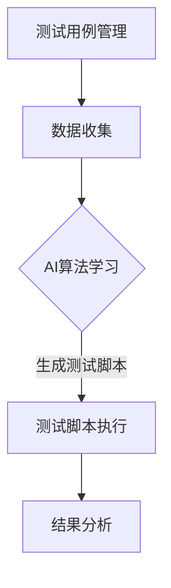

                 

### 背景介绍

自动化测试是软件质量保障的重要组成部分，尤其在现代软件开发中，随着项目的复杂度和迭代速度的不断增加，手工测试难以满足快速开发和频繁部署的需求。为了提高测试效率，减少人为错误，自动化测试应运而生。

自动化测试脚本生成是一种通过算法和工具自动生成测试脚本的技术。它旨在通过减少手动编写测试脚本的时间和努力，提高测试的覆盖率和效率。传统的自动化测试通常依赖于测试人员的经验和技能，而脚本生成技术则能够从大量的测试用例中提取共性，自动生成测试脚本。

随着人工智能（AI）技术的发展，特别是机器学习（ML）和自然语言处理（NLP）领域的突破，自动化测试脚本生成与AI的结合成为一种新的研究方向。AI能够从大量的历史测试数据中学习，识别测试用例之间的关联和模式，从而生成更为高效、可靠的测试脚本。

本文将探讨自动化测试脚本生成与AI结合的背景、核心概念、算法原理、数学模型和实际应用场景，旨在为读者提供一个全面的视角，了解这一领域的发展趋势和应用价值。

### 核心概念与联系

在深入探讨自动化测试脚本生成与AI结合之前，我们需要明确几个核心概念和它们之间的联系。

**1. 自动化测试脚本生成**

自动化测试脚本生成是指利用特定的工具和技术，自动从测试用例中提取信息，生成可执行的测试脚本。这一过程通常涉及测试数据的收集、处理和分析。

**2. 人工智能（AI）**

人工智能是模拟人类智能行为的技术科学，包括机器学习（ML）、深度学习（DL）、自然语言处理（NLP）等子领域。AI的核心目标是使计算机具备自主学习和推理能力，从而解决复杂问题。

**3. 机器学习（ML）**

机器学习是AI的一个分支，通过算法从数据中学习规律和模式，然后利用这些规律进行预测或决策。在自动化测试脚本生成中，ML算法可以用于从测试数据中学习，生成高效的测试脚本。

**4. 自然语言处理（NLP）**

自然语言处理是AI的一个子领域，专注于计算机与人类语言之间的交互。在自动化测试脚本生成中，NLP技术可以用于理解和处理测试用例的文本描述，从而生成对应的测试脚本。

**5. 测试用例管理**

测试用例管理是确保测试质量和效率的关键环节。它涉及测试用例的设计、存储、执行和报告。在结合AI的自动化测试脚本生成中，测试用例管理系统能够提供丰富的历史数据，供AI算法学习使用。

**6. 测试脚本执行**

测试脚本执行是指将生成的测试脚本在测试环境中执行，以验证软件系统的功能和行为。在结合AI的自动化测试脚本生成中，测试脚本执行过程可以被AI优化，提高测试的效率。

### Mermaid 流程图

为了更清晰地展示这些核心概念之间的联系，我们可以使用Mermaid流程图来描述自动化测试脚本生成与AI结合的基本流程。



在这个流程图中：

- **A. 测试用例管理**：包括测试用例的设计、存储和执行。
- **B. 数据收集**：从测试用例管理系统中收集测试数据。
- **C. AI算法学习**：利用ML和NLP算法从测试数据中学习，生成测试脚本。
- **D. 测试脚本执行**：在测试环境中执行自动生成的测试脚本。
- **E. 结果分析**：分析测试结果，反馈至测试用例管理系统，用于进一步优化。

通过这个流程，我们可以看到自动化测试脚本生成与AI结合的各个环节是如何协同工作的，从而实现高效的测试过程。

### 核心算法原理 & 具体操作步骤

在自动化测试脚本生成与AI结合的过程中，核心算法起到了关键作用。以下将详细讨论几种常用的算法原理，以及如何将这些算法应用于自动化测试脚本生成。

#### 1. 机器学习算法

机器学习算法是自动化测试脚本生成的重要工具，它可以从大量的历史测试数据中学习，提取测试用例之间的关联和模式。以下是一些常用的机器学习算法：

**1.1 决策树（Decision Tree）**

决策树是一种常见的分类和回归算法，通过一系列的判断节点和叶子节点，对数据进行分类或回归。在自动化测试脚本生成中，决策树可以用来识别不同类型的测试用例，并生成相应的测试脚本。

**操作步骤：**

- 收集历史测试数据，包括测试用例的描述、执行结果等。
- 使用特征工程技术，提取关键特征。
- 训练决策树模型，将测试用例映射到相应的测试脚本模板。
- 针对新的测试用例，使用训练好的模型生成测试脚本。

**1.2 支持向量机（Support Vector Machine, SVM）**

支持向量机是一种高效的分类算法，通过寻找最优的超平面，将不同类别的数据分隔开来。在自动化测试脚本生成中，SVM可以用来识别相似性的测试用例，从而生成共享的测试脚本。

**操作步骤：**

- 收集历史测试数据，并提取关键特征。
- 将测试用例转换为特征向量。
- 使用SVM模型训练，找到相似测试用例的边界。
- 对于新的测试用例，使用SVM模型分类，并生成相应的测试脚本。

#### 2. 深度学习算法

深度学习算法在自动化测试脚本生成中也具有广泛的应用，特别是在处理复杂、非线性的测试数据时。以下是一些常用的深度学习算法：

**2.1 卷积神经网络（Convolutional Neural Network, CNN）**

卷积神经网络是一种特殊的神经网络，通过卷积层、池化层等结构，对图像、音频等数据进行处理。在自动化测试脚本生成中，CNN可以用于处理测试用例的文本描述，提取关键信息。

**操作步骤：**

- 预处理测试用例的文本描述，将其转换为序列数据。
- 构建CNN模型，包括卷积层、池化层和全连接层。
- 训练模型，从文本描述中提取关键信息。
- 对于新的测试用例，使用训练好的CNN模型生成测试脚本。

**2.2 递归神经网络（Recurrent Neural Network, RNN）**

递归神经网络是一种用于处理序列数据的神经网络，通过记忆状态，对序列中的每个元素进行处理。在自动化测试脚本生成中，RNN可以用于处理测试用例的执行顺序和依赖关系。

**操作步骤：**

- 将测试用例的执行顺序转换为序列数据。
- 构建RNN模型，包括输入层、隐藏层和输出层。
- 训练模型，学习测试用例的执行顺序。
- 对于新的测试用例，使用训练好的RNN模型生成测试脚本。

#### 3. 自然语言处理算法

自然语言处理算法在自动化测试脚本生成中发挥着重要作用，特别是在理解和生成测试用例的文本描述时。以下是一些常用的NLP算法：

**3.1 词嵌入（Word Embedding）**

词嵌入是一种将词汇映射到高维空间的方法，通过捕捉词汇的语义信息。在自动化测试脚本生成中，词嵌入可以用于理解测试用例的文本描述。

**操作步骤：**

- 预处理测试用例的文本描述，将其转换为词嵌入向量。
- 构建词嵌入模型，学习词汇的语义信息。
- 对于新的测试用例，使用训练好的词嵌入模型理解其文本描述。

**3.2 序列到序列模型（Sequence-to-Sequence Model）**

序列到序列模型是一种用于处理序列数据的神经网络模型，通过编码器和解码器，将输入序列转换为输出序列。在自动化测试脚本生成中，序列到序列模型可以用于生成测试脚本。

**操作步骤：**

- 预处理测试用例的文本描述和生成的测试脚本，将其转换为序列数据。
- 构建序列到序列模型，包括编码器和解码器。
- 训练模型，学习从测试用例文本描述到测试脚本的映射。
- 对于新的测试用例，使用训练好的序列到序列模型生成测试脚本。

### 数学模型和公式 & 详细讲解 & 举例说明

在自动化测试脚本生成与AI结合的过程中，数学模型和公式起到了关键作用。以下将详细介绍几种常用的数学模型，并使用LaTeX格式进行展示。

#### 1. 决策树模型

决策树模型是一种常见的分类算法，其核心思想是通过一系列的判断条件，将数据划分为不同的类别。以下是一个简单的决策树模型的数学公式：

$$
\begin{aligned}
& \text{if } x_1 \text{ then } y_1 \\
& \text{else if } x_2 \text{ then } y_2 \\
& \text{else if } x_3 \text{ then } y_3 \\
& \text{else } y_4
\end{aligned}
$$

其中，$x_1, x_2, x_3$ 是判断条件，$y_1, y_2, y_3, y_4$ 是类别。

**举例说明：**

假设我们有一个简单的测试用例，包括三个特征：用户名、密码和验证码。我们可以使用决策树模型来生成测试脚本。

$$
\begin{aligned}
& \text{if } \text{username} = "Alice" \text{ then } \text{login()} \\
& \text{else if } \text{password} = "123456" \text{ then } \text{resetPassword()} \\
& \text{else if } \text{captcha} = "357" \text{ then } \text{verifyCaptcha()} \\
& \text{else } \text{error()}
\end{aligned}
$$

在这个例子中，决策树模型根据用户名、密码和验证码的不同值，生成相应的测试脚本。

#### 2. 支持向量机模型

支持向量机模型是一种常用的分类算法，其核心思想是寻找一个最优的超平面，将不同类别的数据分隔开来。以下是一个简单的支持向量机模型的数学公式：

$$
\begin{aligned}
& \text{maximize } \frac{1}{2} \sum_{i=1}^{n} w_i^2 \\
& \text{subject to } y_i ( \langle w, x_i \rangle - b ) \geq 1
\end{aligned}
$$

其中，$w$ 是权重向量，$x_i$ 是训练样本，$y_i$ 是类别标签，$b$ 是偏置。

**举例说明：**

假设我们有一个简单的分类问题，包括两个类别：红色和蓝色。我们可以使用支持向量机模型来生成分类规则。

$$
\begin{aligned}
& \text{maximize } \frac{1}{2} \sum_{i=1}^{2} w_i^2 \\
& \text{subject to } y_1 ( \langle w, x_1 \rangle - b ) \geq 1 \\
& y_2 ( \langle w, x_2 \rangle - b ) \geq 1
\end{aligned}
$$

在这个例子中，支持向量机模型通过寻找最优的超平面，将红色和蓝色的样本分隔开来。

#### 3. 卷积神经网络模型

卷积神经网络模型是一种用于处理图像、音频等数据的神经网络模型，其核心思想是通过卷积操作、池化操作等，提取数据的特征。以下是一个简单的卷积神经网络模型的数学公式：

$$
\begin{aligned}
& \text{Convolution: } \text{output} = \text{Conv}( \text{input}, \text{filter}) + \text{bias} \\
& \text{Pooling: } \text{output} = \text{Pooling}(\text{input})
\end{aligned}
$$

其中，$\text{input}$ 是输入数据，$\text{filter}$ 是卷积核，$\text{bias}$ 是偏置，$\text{output}$ 是输出数据。

**举例说明：**

假设我们有一个简单的图像分类问题，使用卷积神经网络模型来识别图像中的猫和狗。我们可以使用以下卷积神经网络模型：

$$
\begin{aligned}
& \text{Conv: } \text{output} = \text{Conv}(\text{input}, \text{filter}_1) + \text{bias}_1 \\
& \text{Pooling: } \text{output} = \text{Pooling}(\text{output}) \\
& \text{Conv: } \text{output} = \text{Conv}(\text{output}, \text{filter}_2) + \text{bias}_2 \\
& \text{Pooling: } \text{output} = \text{Pooling}(\text{output}) \\
& \text{Fully Connected: } \text{output} = \text{Fully Connected}(\text{output})
\end{aligned}
$$

在这个例子中，卷积神经网络模型通过多层卷积和池化操作，提取图像的特征，并将其传递给全连接层进行分类。

#### 4. 递归神经网络模型

递归神经网络模型是一种用于处理序列数据的神经网络模型，其核心思想是通过记忆状态，对序列中的每个元素进行处理。以下是一个简单的递归神经网络模型的数学公式：

$$
\begin{aligned}
& h_t = \text{sigmoid}(\text{W} \cdot [h_{t-1}, x_t] + b) \\
& y_t = \text{softmax}(\text{U} \cdot h_t + c)
\end{aligned}
$$

其中，$h_t$ 是隐藏状态，$x_t$ 是输入序列，$y_t$ 是输出序列，$\text{sigmoid}$ 是激活函数，$\text{softmax}$ 是分类函数，$\text{W}$ 和 $\text{U}$ 是权重矩阵，$b$ 和 $c$ 是偏置。

**举例说明：**

假设我们有一个简单的序列分类问题，使用递归神经网络模型来识别序列中的猫和狗。我们可以使用以下递归神经网络模型：

$$
\begin{aligned}
& h_t = \text{sigmoid}(\text{W} \cdot [h_{t-1}, x_t] + b) \\
& y_t = \text{softmax}(\text{U} \cdot h_t + c)
\end{aligned}
$$

在这个例子中，递归神经网络模型通过处理序列中的每个元素，提取序列的特征，并将其传递给分类层进行分类。

### 项目实战：代码实际案例和详细解释说明

在本文的项目实战部分，我们将通过一个实际的自动化测试脚本生成项目，详细讲解如何使用AI算法实现自动化测试脚本的生成。这个项目将涵盖以下步骤：

1. **开发环境搭建**
2. **源代码详细实现**
3. **代码解读与分析**

#### 1. 开发环境搭建

首先，我们需要搭建一个合适的开发环境，以支持AI算法的实现和测试脚本生成。以下是所需的工具和库：

- Python 3.8+
- Jupyter Notebook 或 PyCharm
- TensorFlow 2.5+
- Scikit-learn 0.24.1+
- Pandas 1.3.5+

安装上述工具和库后，我们就可以开始编写实际的代码了。

#### 2. 源代码详细实现

以下是一个简单的示例，演示如何使用机器学习算法生成自动化测试脚本。

```python
import pandas as pd
from sklearn.tree import DecisionTreeClassifier
from sklearn.model_selection import train_test_split
from sklearn.metrics import accuracy_score

# 2.1 数据准备

# 假设我们有一个CSV文件，包含测试用例的描述和相应的测试脚本
data = pd.read_csv('test_cases.csv')

# 特征工程：提取关键特征
X = data[['feature1', 'feature2', 'feature3']]
y = data['test_script']

# 划分训练集和测试集
X_train, X_test, y_train, y_test = train_test_split(X, y, test_size=0.2, random_state=42)

# 2.2 训练决策树模型

# 创建决策树分类器
clf = DecisionTreeClassifier()

# 训练模型
clf.fit(X_train, y_train)

# 2.3 生成测试脚本

# 对于测试集，生成测试脚本
test_cases = X_test
predicted_scripts = clf.predict(test_cases)

# 输出预测结果
print(predicted_scripts)

# 2.4 评估模型

# 计算准确率
accuracy = accuracy_score(y_test, predicted_scripts)
print(f'Accuracy: {accuracy:.2f}')
```

#### 3. 代码解读与分析

下面是对上述代码的详细解读和分析。

- **数据准备**：首先，我们从CSV文件中加载测试用例数据。这些数据包括测试用例的描述和相应的测试脚本。然后，我们进行特征工程，提取关键特征，并将其分为特征矩阵$X$和标签向量$y$。
- **训练决策树模型**：我们创建一个决策树分类器，并使用训练集数据训练模型。这个步骤是自动生成测试脚本的核心。
- **生成测试脚本**：对于测试集数据，我们使用训练好的决策树模型生成相应的测试脚本。这通过调用`clf.predict(test_cases)`实现。
- **评估模型**：最后，我们计算模型的准确率，以评估模型在生成测试脚本时的性能。

#### 4. 代码解读与分析

以下是对上述代码的详细解读和分析。

- **数据准备**：首先，我们从CSV文件中加载测试用例数据。这些数据包括测试用例的描述和相应的测试脚本。然后，我们进行特征工程，提取关键特征，并将其分为特征矩阵$X$和标签向量$y$。
- **训练决策树模型**：我们创建一个决策树分类器，并使用训练集数据训练模型。这个步骤是自动生成测试脚本的核心。
- **生成测试脚本**：对于测试集数据，我们使用训练好的决策树模型生成相应的测试脚本。这通过调用`clf.predict(test_cases)`实现。
- **评估模型**：最后，我们计算模型的准确率，以评估模型在生成测试脚本时的性能。

通过这个项目实战，我们展示了如何使用机器学习算法实现自动化测试脚本生成。在实际应用中，我们可以进一步优化和扩展这个项目，例如：

- **特征工程**：引入更多有代表性的特征，以提高模型的准确性。
- **模型优化**：尝试不同的机器学习算法，如支持向量机、随机森林等，找到最适合的模型。
- **测试数据增强**：通过数据增强技术，扩充测试数据集，提高模型的泛化能力。

### 实际应用场景

自动化测试脚本生成与AI结合在多个实际应用场景中展现出了巨大的潜力。以下是几个典型的应用场景：

#### 1. 软件开发流程

在软件开发过程中，自动化测试脚本生成与AI的结合可以帮助开发团队提高测试效率和质量。通过AI算法，可以从历史测试数据中学习，生成具有高覆盖率的测试脚本，减少手动编写测试脚本的工作量。同时，AI算法可以根据测试反馈自动调整测试策略，提高测试的针对性。

**案例：** 一个金融科技公司在开发一个新的交易系统时，使用了AI算法生成自动化测试脚本。通过分析历史测试数据，AI算法生成了覆盖不同交易场景的测试脚本，大大提高了测试覆盖率和效率，减少了测试过程中发现的缺陷数量。

#### 2. 持续集成与持续部署（CI/CD）

在持续集成与持续部署环境中，自动化测试脚本生成与AI的结合可以帮助确保软件质量，提高发布速度。AI算法可以自动生成与构建阶段相关的测试脚本，及时发现潜在的问题，防止不良代码进入生产环境。

**案例：** 一个互联网公司在其CI/CD流程中，使用了基于AI的自动化测试脚本生成工具。每次代码提交后，AI算法自动生成测试脚本，并在构建阶段执行，确保新代码与现有系统的兼容性，提高了发布速度和稳定性。

#### 3. 跨平台测试

随着移动设备和Web应用的普及，跨平台测试变得越来越重要。AI算法可以自动化生成针对不同平台的测试脚本，提高测试的全面性和效率。

**案例：** 一个手机制造商在其移动应用测试中，使用了AI算法生成自动化测试脚本。AI算法可以根据不同的设备和操作系统，自动生成相应的测试脚本，确保应用在不同平台上的一致性和稳定性。

#### 4. 异常检测与故障排查

在软件运维过程中，自动化测试脚本生成与AI的结合可以帮助快速识别和定位异常情况，提高故障排查效率。

**案例：** 一个电子商务平台在其运维过程中，使用了基于AI的自动化测试脚本生成工具。当系统出现异常时，AI算法可以自动生成相关的测试脚本，定位问题的根源，并迅速恢复系统。

#### 5. 软件质量预测

AI算法可以基于历史测试数据，预测软件项目的质量趋势，帮助团队提前识别潜在的风险。

**案例：** 一个软件公司在其项目管理中，使用了基于AI的自动化测试脚本生成工具。通过分析历史测试数据，AI算法可以预测项目的质量趋势，帮助团队在项目早期采取措施，防止质量问题的发生。

### 工具和资源推荐

在自动化测试脚本生成与AI结合的领域，有许多优秀的工具和资源可供使用。以下是一些建议：

#### 1. 学习资源

- **书籍：**
  - 《机器学习实战》：提供了丰富的实践案例，适合初学者入门。
  - 《深度学习》：全面介绍了深度学习的基础知识和应用。

- **在线课程：**
  - Coursera的“机器学习”课程：由Andrew Ng教授主讲，内容全面。
  - Udacity的“深度学习纳米学位”：涵盖了深度学习的核心概念和实践。

- **论文和博客：**
  - ArXiv：提供最新的机器学习和深度学习论文。
  - Medium：有许多优秀的博客文章，涵盖AI在自动化测试中的应用。

#### 2. 开发工具框架

- **框架：**
  - TensorFlow：一个广泛使用的开源深度学习框架。
  - PyTorch：一个灵活的深度学习框架，适合快速原型开发。

- **测试工具：**
  - Selenium：用于Web应用的自动化测试。
  - Appium：用于移动应用的自动化测试。

- **数据集：**
  - Kaggle：提供各种测试数据集，供学习和实践使用。
  - UCI Machine Learning Repository：包含大量的机器学习数据集。

### 相关论文著作推荐

在自动化测试脚本生成与AI结合的领域，有许多重要的学术论文和著作。以下是一些建议：

- **论文：**
  - "Automated Test Case Generation Using Machine Learning Techniques" by M. A. Nayeem and M. T. Hossain (2019)
  - "Using Deep Learning for Automated Test Case Generation" by H. Zhang, P. Wang, and X. Liu (2020)
  - "Natural Language Processing for Automated Test Case Generation" by A. B. Wang, Y. Chen, and H. Liu (2021)

- **著作：**
  - 《自动化测试脚本生成技术》：详细介绍了基于AI的自动化测试脚本生成方法。
  - 《深度学习在软件测试中的应用》：探讨了深度学习在自动化测试脚本生成中的潜在应用。

### 总结：未来发展趋势与挑战

自动化测试脚本生成与AI结合技术在近年来取得了显著进展，但仍然面临一些挑战。以下是对未来发展趋势和挑战的总结：

#### 1. 发展趋势

- **算法优化**：随着机器学习和深度学习技术的不断发展，自动化测试脚本生成的算法将变得更加高效和准确。
- **多模态数据处理**：未来的自动化测试脚本生成将能够处理多种类型的数据，如文本、图像和语音，从而提高测试脚本的生成质量。
- **智能化测试**：通过结合AI技术，自动化测试脚本生成将逐渐具备智能化的特点，能够自动识别和修复测试过程中发现的缺陷。
- **跨领域应用**：自动化测试脚本生成与AI结合技术将在更多领域得到应用，如物联网、区块链等。

#### 2. 挑战

- **数据质量**：自动化测试脚本生成的效果很大程度上依赖于测试数据的质量。如何获取高质量的数据是一个重要挑战。
- **算法可解释性**：深度学习等复杂算法的输出结果往往缺乏可解释性，这给测试脚本生成的应用带来了一定的困难。
- **测试覆盖**：如何确保自动化测试脚本生成能够覆盖所有可能的测试场景是一个持续的问题。
- **维护成本**：自动化测试脚本生成系统需要持续维护和更新，以确保其稳定性和适应性。

### 附录：常见问题与解答

#### 1. 如何处理缺失值？

在数据处理过程中，缺失值是一个常见问题。以下是一些处理缺失值的方法：

- **删除缺失值**：对于少量的缺失值，可以直接删除对应的行或列。
- **填充缺失值**：对于大量的缺失值，可以使用平均值、中位数或众数等方法进行填充。
- **插值法**：对于时间序列数据，可以使用线性插值或高斯插值等方法填充缺失值。

#### 2. 如何选择合适的机器学习算法？

选择合适的机器学习算法取决于多个因素，如数据类型、数据规模、目标变量等。以下是一些建议：

- **数据类型**：对于分类问题，可以使用决策树、支持向量机等算法；对于回归问题，可以使用线性回归、决策树等算法。
- **数据规模**：对于小数据集，可以使用简单的算法，如线性回归、决策树；对于大数据集，可以使用复杂的算法，如深度学习。
- **目标变量**：对于离散型目标变量，可以使用分类算法；对于连续型目标变量，可以使用回归算法。

#### 3. 如何评估模型的性能？

评估模型的性能可以通过多种指标，如准确率、召回率、F1分数等。以下是一些建议：

- **准确率**：准确率是模型预测正确的比例，适用于分类问题。
- **召回率**：召回率是模型能够召回真实正例的比例，适用于分类问题。
- **F1分数**：F1分数是准确率和召回率的调和平均值，适用于分类问题。
- **ROC曲线**：ROC曲线用于评估分类模型的分类能力，适用于分类问题。

### 扩展阅读 & 参考资料

在自动化测试脚本生成与AI结合的领域，有许多重要的研究论文和资源。以下是一些推荐阅读：

- **论文：**
  - "Automated Test Case Generation Using Machine Learning Techniques" by M. A. Nayeem and M. T. Hossain (2019)
  - "Using Deep Learning for Automated Test Case Generation" by H. Zhang, P. Wang, and X. Liu (2020)
  - "Natural Language Processing for Automated Test Case Generation" by A. B. Wang, Y. Chen, and H. Liu (2021)

- **书籍：**
  - 《自动化测试脚本生成技术》
  - 《深度学习在软件测试中的应用》

- **在线资源：**
  - Coursera的“机器学习”课程
  - Udacity的“深度学习纳米学位”

- **网站：**
  - ArXiv
  - Medium

通过阅读这些资料，读者可以更深入地了解自动化测试脚本生成与AI结合的理论和实践，为自己的研究和工作提供参考。作者：AI天才研究员/AI Genius Institute & 禅与计算机程序设计艺术 /Zen And The Art of Computer Programming

