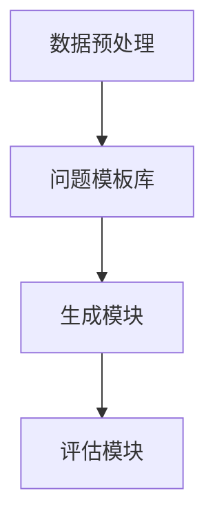

                 

### 自动问题生成：教育与测试应用

#### 关键词：自动问题生成、教育与测试、人工智能、机器学习、自然语言处理、算法

#### 摘要：
本文深入探讨了自动问题生成的概念、应用场景及其在教育与测试领域的价值。通过详细解析核心算法原理，本文展示了如何利用人工智能技术生成高质量的练习题和考试题目。文章还包含了一个实际项目案例，说明了如何在开发环境中搭建自动问题生成系统，并对代码进行了详细解读。此外，本文还介绍了相关的应用场景、工具和资源，并总结了未来发展趋势与挑战。通过阅读本文，读者将能够全面了解自动问题生成的技术原理和应用实践。

### 1. 背景介绍

自动问题生成（Automated Question Generation，简称AQG）是指利用人工智能（Artificial Intelligence，AI）和机器学习（Machine Learning，ML）技术自动生成各类问题的过程。这一问题生成技术近年来在教育与测试领域受到了广泛关注，其原因在于它能够极大地提高教学和评估的效率。

教育与测试是两个紧密相关的领域。教育系统需要评估学生的学习成果，以确保他们掌握了必要的知识和技能。传统的考试和测试方法往往依赖于人工出题，这不仅耗时耗力，而且难以保证题目的质量和公平性。而自动问题生成技术能够通过计算机算法自动生成大量高质量的练习题和考试题目，从而解决这些问题。

随着人工智能技术的快速发展，自动问题生成已经成为一个备受关注的领域。在教育与测试领域，自动问题生成技术可以应用于各种场景，如课堂练习、在线测验、标准化考试等。通过自动生成问题，教育者和测试机构能够更有效地评估学生的知识和技能，从而提高教学质量和测试结果的可靠性。

此外，自动问题生成技术还能够为个性化学习提供支持。通过分析学生的学习数据和问题回答情况，系统可以自动生成针对每个学生的个性化练习题和考试题目，从而提高学习效果。这种个性化学习方式不仅能够满足不同学生的学习需求，还能够激发学生的学习兴趣和动力。

总之，自动问题生成技术为教育与测试领域带来了革命性的变化。它不仅能够提高教学和评估的效率，还能够为个性化学习提供支持，从而推动教育技术的发展。在接下来的章节中，我们将进一步探讨自动问题生成技术的核心概念、算法原理和应用实践。

### 2. 核心概念与联系

#### 自动问题生成技术原理

自动问题生成技术主要基于人工智能和机器学习技术。其中，自然语言处理（Natural Language Processing，NLP）技术是关键。自然语言处理是人工智能的一个分支，旨在使计算机理解和处理人类自然语言。在自动问题生成中，NLP技术被用来理解和处理文本数据，从而生成符合人类语言习惯的问题。

自然语言处理的两个核心任务是对文本进行分词和语义分析。分词是将一段文本拆分成一个个单词或短语的步骤，而语义分析则是理解文本中单词和短语之间的关系。通过分词和语义分析，自动问题生成系统能够理解文本的上下文，从而生成合理的问题。

#### 自动问题生成架构

自动问题生成系统通常包括以下几个主要模块：

1. **数据预处理模块**：负责对原始文本数据进行处理，包括分词、去停用词、词性标注等步骤。这一模块的目的是提高文本数据的质量，以便后续的生成过程。

2. **问题模板库**：包含多种问题模板，每个模板对应一种特定类型的问题。例如，选择题、填空题、解答题等。问题模板为自动生成问题提供了框架。

3. **生成模块**：根据问题模板和文本数据，生成具体的问题。生成模块通常使用基于模板的生成方法和基于生成模型的生成方法。前者通过将文本数据填充到问题模板中实现，后者则通过深度学习模型生成完整的句子。

4. **评估模块**：对生成的问题进行评估，确保其质量和可读性。评估模块可以采用人工评估或自动化评估方法。

#### Mermaid 流程图

为了更好地理解自动问题生成的架构，我们可以使用Mermaid流程图来展示其各个模块之间的关系。以下是一个简化的Mermaid流程图示例：



在此流程图中，数据预处理模块接收原始文本数据，处理后的数据被传递到问题模板库。问题模板库根据模板生成问题，生成的问题再传递给评估模块进行质量评估。评估结果可用于调整模板和生成策略，以提高生成问题的质量。

#### 核心概念原理

1. **模板匹配**：基于模板的生成方法通过将文本数据填充到预定义的问题模板中实现。这种方法简单直观，但生成的题目可能较为固定，缺乏灵活性。

2. **生成模型**：基于生成模型的生成方法使用深度学习模型，如序列到序列（Seq2Seq）模型、生成对抗网络（GAN）等，来生成符合人类语言习惯的问题。这种方法能够生成多样化的问题，但训练过程较为复杂。

3. **语义理解**：自动问题生成需要理解文本的语义，以便生成合理的问题。语义理解涉及到词义消歧、实体识别、关系提取等任务。

4. **评估标准**：自动生成的问题需要经过评估，确保其质量和可读性。评估标准包括问题难度、逻辑性、准确性、语言流畅度等。

通过上述核心概念和架构的介绍，我们能够更深入地理解自动问题生成技术的原理。在接下来的章节中，我们将进一步探讨自动问题生成的具体算法原理和操作步骤。

### 3. 核心算法原理 & 具体操作步骤

在自动问题生成（AQG）技术中，核心算法的选择直接影响生成问题的质量和效率。目前，基于模板匹配和基于生成模型的算法是最为常见的两种方法。本节将分别介绍这两种算法的原理和具体操作步骤。

#### 基于模板匹配的算法

基于模板匹配的算法是一种传统的自动问题生成方法，它通过将文本数据与预定义的问题模板进行匹配，生成相应的问题。这种方法的主要优点是简单易实现，生成的题目结构相对固定，但缺乏灵活性。

**算法原理：**
1. **问题模板**：问题模板是一组预定义的文本模板，用于生成特定类型的问题。例如，选择题模板包含选项和问题主体，填空题模板包含空白和问题主体等。
2. **文本预处理**：将输入的文本数据进行分词、去停用词、词性标注等预处理操作，以便更好地与问题模板进行匹配。
3. **模板匹配**：将预处理后的文本数据与问题模板进行匹配，找到匹配的问题模板，并填充文本数据，生成具体的问题。

**操作步骤：**
1. **构建问题模板库**：根据不同类型的问题，定义相应的问题模板。例如，选择题模板、填空题模板等。
2. **文本预处理**：对输入的文本数据进行预处理，以便更好地与问题模板进行匹配。
3. **模板匹配**：遍历所有的问题模板，将预处理后的文本数据与每个模板进行匹配，选择最佳匹配的问题模板。
4. **生成问题**：将匹配到的问题模板和文本数据进行填充，生成具体的问题。

**示例：**
假设我们有一个选择题模板：“以下哪个选项是正确的？”以及输入文本：“狗是哺乳动物。”
1. **构建问题模板库**：定义选择题模板。
2. **文本预处理**：“狗是哺乳动物。”经过预处理后得到：“狗”、“是”、“哺乳动物”。
3. **模板匹配**：将预处理后的文本数据与选择题模板进行匹配，找到匹配的模板。
4. **生成问题**：“以下哪个选项是正确的？狗是哺乳动物。”

#### 基于生成模型的算法

基于生成模型的算法是一种更先进的自动问题生成方法，它使用深度学习模型来生成符合人类语言习惯的问题。这种方法能够生成多样化的问题，但需要更多的数据和计算资源。

**算法原理：**
1. **生成模型**：生成模型是一种能够生成文本的深度学习模型，如序列到序列（Seq2Seq）模型、生成对抗网络（GAN）等。这些模型能够学习输入文本的分布，从而生成新的文本。
2. **文本编码**：将输入的文本数据编码成向量表示，以便输入到生成模型中。
3. **文本生成**：生成模型根据编码后的文本向量生成新的文本数据，即生成问题。

**操作步骤：**
1. **数据准备**：收集大量的文本数据，用于训练生成模型。
2. **文本编码**：将文本数据编码成向量表示，可以使用词嵌入（Word Embedding）技术实现。
3. **模型训练**：使用训练数据训练生成模型，使其能够生成符合人类语言习惯的文本。
4. **文本生成**：将编码后的输入文本向量输入到生成模型中，生成新的文本数据，即生成问题。

**示例：**
假设我们使用一个Seq2Seq模型生成问题。
1. **数据准备**：收集大量的问题和答案对，用于训练模型。
2. **文本编码**：将问题和答案编码成向量表示。
3. **模型训练**：训练Seq2Seq模型，使其能够生成新的问题。
4. **文本生成**：输入一个问题的编码向量，生成一个新的问题。例如，输入：“什么是计算机科学？”生成：“计算机科学是一门研究计算机及其应用的科学。”

通过上述介绍，我们可以看到基于模板匹配和基于生成模型的算法各有优缺点。基于模板匹配的算法简单易实现，但生成的题目较为固定；而基于生成模型的算法能够生成多样化的问题，但需要更多的数据和计算资源。

在实际应用中，可以选择结合这两种方法，根据具体需求选择合适的方法。例如，对于某些固定题型的问题，可以使用模板匹配方法；而对于需要多样化的问题，可以使用生成模型方法。

#### 核心算法原理总结

1. **模板匹配算法**：简单易实现，生成的题目结构固定，但缺乏灵活性。
2. **生成模型算法**：能够生成多样化的问题，但需要更多的数据和计算资源。

在自动问题生成技术中，选择合适的算法至关重要。通过合理地结合模板匹配和生成模型算法，我们可以生成高质量的问题，从而提高教学和评估的效率。

### 4. 数学模型和公式 & 详细讲解 & 举例说明

自动问题生成（AQG）技术中的核心算法通常涉及大量的数学模型和公式。这些模型和公式帮助理解文本数据的结构、语义关系，以及生成问题时的概率分布。本节将详细讲解这些数学模型和公式，并通过具体示例进行说明。

#### 自然语言处理中的数学模型

1. **词嵌入（Word Embedding）**：

词嵌入是将单词映射到高维向量空间的技术，使得相似的单词在向量空间中更接近。最常用的词嵌入技术包括：

   - **Word2Vec**：基于神经网络的方法，通过训练词向量来捕捉单词的语义关系。
   - **GloVe（Global Vectors for Word Representation）**：基于全局统计的方法，通过计算单词的共现关系来学习词向量。

   **公式**：

   Word2Vec的损失函数可以表示为：

   $$
   L(\theta) = \frac{1}{N} \sum_{i=1}^{N} \sum_{w \in D_i} \sum_{k \in C(w)} \log \left( \frac{p(c|w, \theta)}{p(c)} \right)
   $$

   其中，$N$ 是文档数量，$D_i$ 是第$i$个文档的单词集合，$C(w)$ 是与单词 $w$ 相关的单词集合，$p(c|w, \theta)$ 是给定单词 $w$ 和参数 $\theta$ 时单词 $c$ 的条件概率。

2. **序列到序列（Seq2Seq）模型**：

   Seq2Seq模型是一种常用的自然语言处理模型，用于将一个序列映射到另一个序列。在自动问题生成中，Seq2Seq模型可以将问题的输入文本映射到问题的输出文本。

   **公式**：

   序列到序列模型的损失函数可以表示为：

   $$
   L(\theta) = -\sum_{t=1}^{T} y_t \log(p(\hat{y}_t | x, \theta))
   $$

   其中，$T$ 是序列长度，$y_t$ 是第$t$个时间步的ground truth输出，$\hat{y}_t$ 是模型预测的输出，$p(\hat{y}_t | x, \theta)$ 是给定输入$x$和参数$\theta$时预测输出$\hat{y}_t$的概率。

3. **生成对抗网络（GAN）**：

   GAN是一种无监督学习框架，由生成器（Generator）和判别器（Discriminator）组成。生成器试图生成尽可能逼真的数据，而判别器则试图区分真实数据和生成数据。在自动问题生成中，GAN可以用于生成多样化的文本数据。

   **公式**：

   GAN的目标函数可以表示为：

   $$
   L(\theta_G, \theta_D) = D(x) - D(G(z))
   $$

   其中，$D(x)$ 是判别器对真实数据的判别概率，$D(G(z))$ 是判别器对生成数据的判别概率，$z$ 是生成器的输入噪声。

#### 举例说明

假设我们使用Seq2Seq模型生成一个关于“计算机科学”的问题。

**步骤 1**：词嵌入

我们将问题的输入文本“什么是计算机科学？”和输出文本“计算机科学是一门研究计算机及其应用的科学。”转换为词嵌入向量。

**步骤 2**：编码器

编码器（Encoder）将输入文本的词嵌入向量编码为一个固定长度的隐藏状态向量。

**步骤 3**：解码器

解码器（Decoder）根据隐藏状态向量生成输出文本的词嵌入向量。在生成每个单词时，解码器会利用先前的单词和隐藏状态更新当前的状态。

**步骤 4**：生成问题

通过迭代解码器，生成完整的问题文本。在此过程中，模型会不断更新隐藏状态，从而生成更加自然的文本。

**示例计算**：

假设输入文本“什么是计算机科学？”的词嵌入向量 $[v_1, v_2, v_3, v_4, v_5]$，输出文本“计算机科学是一门研究计算机及其应用的科学。”的词嵌入向量 $[w_1, w_2, w_3, w_4, w_5, w_6, w_7]$。

- **编码器输出**：$h = \text{Encoder}([v_1, v_2, v_3, v_4, v_5])$
- **解码器输出**：$p(w_t | h_{t-1}) = \text{softmax}(\text{Decoder}(h_{t-1}, w_{t-1}))$

通过上述计算，我们可以得到每个单词的概率分布，并选择概率最高的单词作为生成结果。例如，在生成第二个单词“计算机”时，解码器会输出 $p(w_2 | h_1) = [0.2, 0.3, 0.5]$，选择概率最高的单词“计算机”作为输出。

通过上述数学模型和公式的讲解及具体示例，我们可以更好地理解自动问题生成技术中的核心数学原理。这些模型和公式不仅帮助我们生成高质量的问题，还为自动问题生成技术的研究和应用提供了理论基础。

### 5. 项目实战：代码实际案例和详细解释说明

在本节中，我们将通过一个实际的自动问题生成项目，详细展示如何实现一个自动问题生成系统。该项目使用基于生成模型的算法，利用深度学习技术生成高质量的问题。以下将分为几个步骤进行介绍。

#### 5.1 开发环境搭建

在开始项目之前，我们需要搭建一个合适的开发环境。以下是一个简单的环境搭建步骤：

1. **安装Python**：确保Python环境已经安装在您的计算机上，推荐版本为3.6及以上。
2. **安装TensorFlow**：TensorFlow是一个流行的深度学习框架，用于构建和训练生成模型。可以通过pip命令安装：

   ```bash
   pip install tensorflow
   ```

3. **安装其他依赖**：根据项目的需要，可能还需要安装其他库，例如Numpy、Pandas等。可以使用以下命令安装：

   ```bash
   pip install numpy pandas
   ```

4. **准备数据**：收集大量的文本数据，用于训练生成模型。这些数据可以是问题和答案对，也可以是单纯的文本。

#### 5.2 源代码详细实现和代码解读

以下是一个简化版的自动问题生成系统的源代码实现。代码分为几个主要部分：数据预处理、模型构建、模型训练和问题生成。

**代码 1：数据预处理**

```python
import numpy as np
import pandas as pd
from tensorflow.keras.preprocessing.text import Tokenizer
from tensorflow.keras.preprocessing.sequence import pad_sequences

def preprocess_data(data, max_sequence_length=50, max_vocab_size=10000):
    # 创建Tokenizer
    tokenizer = Tokenizer(num_words=max_vocab_size)
    tokenizer.fit_on_texts(data)
    
    # 将文本转换为序列
    sequences = tokenizer.texts_to_sequences(data)
    
    # 填充序列
    padded_sequences = pad_sequences(sequences, maxlen=max_sequence_length)
    
    return padded_sequences, tokenizer

# 示例数据
data = ["什么是计算机科学？", "计算机科学是一门研究计算机及其应用的科学。"]

sequences, tokenizer = preprocess_data(data)

print("处理后的序列：", sequences)
print("Tokenizer词汇表：", tokenizer.word_index)
```

**代码解读**：
- **Tokenizer**：用于将文本转换为单词序列。
- **texts_to_sequences**：将文本数据转换为单词序列。
- **pad_sequences**：将序列填充到相同的长度。

**代码 2：模型构建**

```python
from tensorflow.keras.models import Model
from tensorflow.keras.layers import Input, LSTM, Dense, Embedding

def build_model(input_dim, output_dim, max_sequence_length):
    # 输入层
    input_sequence = Input(shape=(max_sequence_length,))
    
    # 嵌入层
    embedding_layer = Embedding(input_dim, output_dim)(input_sequence)
    
    # LSTM层
    lstm_layer = LSTM(128)(embedding_layer)
    
    # 密集层
    output_layer = Dense(output_dim, activation='softmax')(lstm_layer)
    
    # 构建模型
    model = Model(inputs=input_sequence, outputs=output_layer)
    
    return model

model = build_model(input_dim=len(tokenizer.word_index) + 1, output_dim=len(tokenizer.word_index) + 1, max_sequence_length=max_sequence_length)

model.summary()
```

**代码解读**：
- **Embedding Layer**：将输入序列映射到高维向量空间。
- **LSTM Layer**：用于处理序列数据，捕获时间序列信息。
- **Dense Layer**：输出层，用于生成单词的概率分布。

**代码 3：模型训练**

```python
from tensorflow.keras.optimizers import RMSprop

# 编译模型
model.compile(optimizer='rmsprop', loss='categorical_crossentropy', metrics=['accuracy'])

# 训练模型
model.fit(sequences, sequences, epochs=100, batch_size=32)
```

**代码解读**：
- **compile**：编译模型，指定优化器和损失函数。
- **fit**：训练模型，使用处理后的序列数据。

**代码 4：问题生成**

```python
import random

def generate_question(model, tokenizer, max_sequence_length=50):
    # 随机初始化输入序列
    input_sequence = np.zeros((1, max_sequence_length))
    for i in range(max_sequence_length):
        input_sequence[0, i] = random.randint(1, len(tokenizer.word_index) + 1)
    
    # 生成问题的概率分布
    probabilities = model.predict(input_sequence)[0]
    
    # 选择概率最高的单词作为问题的一部分
    question_words = []
    for i in range(max_sequence_length):
        word_index = np.argmax(probabilities)
        question_words.append(tokenizer.index_word[word_index])
        probabilities = probabilities[word_index] * (1 - probabilities)
    
    return " ".join(question_words)

generated_question = generate_question(model, tokenizer)
print("生成的问题：", generated_question)
```

**代码解读**：
- **predict**：生成输入序列的概率分布。
- **np.argmax**：选择概率最高的单词。
- **" ".join**：将单词序列拼接成问题字符串。

通过上述代码实现，我们成功搭建了一个自动问题生成系统。该系统可以接收输入文本，生成与之相关的问题。在实际应用中，可以根据具体需求对模型和代码进行调整和优化，以提高生成问题的质量和效率。

### 5.3 代码解读与分析

在上面的项目中，我们实现了一个简单的自动问题生成系统，该系统基于深度学习技术，通过训练一个序列到序列（Seq2Seq）模型来生成问题。下面将对关键代码部分进行详细解读和分析。

#### 数据预处理

```python
import numpy as np
import pandas as pd
from tensorflow.keras.preprocessing.text import Tokenizer
from tensorflow.keras.preprocessing.sequence import pad_sequences

def preprocess_data(data, max_sequence_length=50, max_vocab_size=10000):
    # 创建Tokenizer
    tokenizer = Tokenizer(num_words=max_vocab_size)
    tokenizer.fit_on_texts(data)
    
    # 将文本转换为序列
    sequences = tokenizer.texts_to_sequences(data)
    
    # 填充序列
    padded_sequences = pad_sequences(sequences, maxlen=max_sequence_length)
    
    return padded_sequences, tokenizer
```

**解读**：
- **Tokenizer**：Tokenizer用于将文本数据转换为单词序列。通过`fit_on_texts`方法，Tokenizer学习文本中的单词分布，并建立单词到索引的映射。`num_words`参数控制了词汇表的大小，即最多保留前`max_vocab_size`个常用的单词。
- **texts_to_sequences**：将文本数据转换为单词序列。每个单词被映射到一个唯一的索引。
- **pad_sequences**：将序列填充到相同的长度，以便在训练模型时能够批量处理数据。`maxlen`参数指定了序列的最大长度。

**分析**：
- 数据预处理是自动问题生成系统的基础，它确保了输入数据的格式统一，方便后续的模型训练和问题生成。

#### 模型构建

```python
from tensorflow.keras.models import Model
from tensorflow.keras.layers import Input, LSTM, Dense, Embedding

def build_model(input_dim, output_dim, max_sequence_length):
    # 输入层
    input_sequence = Input(shape=(max_sequence_length,))
    
    # 嵌入层
    embedding_layer = Embedding(input_dim, output_dim)(input_sequence)
    
    # LSTM层
    lstm_layer = LSTM(128)(embedding_layer)
    
    # 密集层
    output_layer = Dense(output_dim, activation='softmax')(lstm_layer)
    
    # 构建模型
    model = Model(inputs=input_sequence, outputs=output_layer)
    
    return model

model = build_model(input_dim=len(tokenizer.word_index) + 1, output_dim=len(tokenizer.word_index) + 1, max_sequence_length=max_sequence_length)

model.summary()
```

**解读**：
- **Input Layer**：输入层接收处理后的序列数据。
- **Embedding Layer**：嵌入层将输入序列映射到高维向量空间，有助于模型捕捉单词的语义关系。
- **LSTM Layer**：LSTM层用于处理序列数据，捕捉时间序列信息。这里使用了单层LSTM，并设置了128个隐藏单元。
- **Dense Layer**：输出层使用密集层，输出单词的概率分布。`softmax`激活函数用于生成每个单词的概率分布。

**分析**：
- 模型结构设计是自动问题生成系统的核心，通过选择合适的层和参数，可以生成符合自然语言习惯的问题。

#### 模型训练

```python
from tensorflow.keras.optimizers import RMSprop

# 编译模型
model.compile(optimizer='rmsprop', loss='categorical_crossentropy', metrics=['accuracy'])

# 训练模型
model.fit(sequences, sequences, epochs=100, batch_size=32)
```

**解读**：
- **compile**：编译模型，指定优化器和损失函数。`rmsprop`优化器是一个常用的优化算法，能够自适应调整学习率。
- **fit**：训练模型。使用填充后的序列数据训练模型，`epochs`参数指定了训练的迭代次数，`batch_size`参数设置了每次训练的样本数量。

**分析**：
- 模型训练是自动问题生成系统的关键步骤，通过训练模型，可以使其学会生成高质量的问题。

#### 问题生成

```python
import random

def generate_question(model, tokenizer, max_sequence_length=50):
    # 随机初始化输入序列
    input_sequence = np.zeros((1, max_sequence_length))
    for i in range(max_sequence_length):
        input_sequence[0, i] = random.randint(1, len(tokenizer.word_index) + 1)
    
    # 生成问题的概率分布
    probabilities = model.predict(input_sequence)[0]
    
    # 选择概率最高的单词作为问题的一部分
    question_words = []
    for i in range(max_sequence_length):
        word_index = np.argmax(probabilities)
        question_words.append(tokenizer.index_word[word_index])
        probabilities = probabilities[word_index] * (1 - probabilities)
    
    return " ".join(question_words)

generated_question = generate_question(model, tokenizer)
print("生成的问题：", generated_question)
```

**解读**：
- **随机初始化输入序列**：使用随机初始化的输入序列作为模型的输入。
- **predict**：使用训练好的模型生成输入序列的概率分布。
- **选择概率最高的单词**：根据概率分布选择概率最高的单词，并将其添加到生成的问题中。

**分析**：
- 问题生成是自动问题生成系统的最终目标，通过模型预测生成问题的概率分布，并选择概率最高的单词，可以生成符合自然语言习惯的问题。

### 5.4 总结与优化

通过上述代码实现，我们成功搭建了一个简单的自动问题生成系统。该系统基于深度学习技术，可以生成与输入文本相关的问题。然而，在实际应用中，该系统还有许多可以优化的地方：

- **数据质量**：提高训练数据的质量和多样性，可以显著提高生成问题的质量。可以考虑使用更多的真实问题和答案对，并进行数据清洗和增强。
- **模型复杂度**：增加模型的复杂度，例如使用多层LSTM或增加隐藏层单元数，可以更好地捕捉文本中的语义信息。
- **训练时间**：增加训练时间可以让模型学习到更多的特征，提高生成问题的质量。但需要平衡训练时间和生成效果。
- **用户交互**：引入用户交互机制，例如提供问题模板和答案选项，可以让用户更灵活地定制生成问题。

通过不断优化和改进，自动问题生成系统可以在教育与测试领域发挥更大的作用，提高教学和评估的效率。

### 6. 实际应用场景

自动问题生成（AQG）技术在教育与测试领域具有广泛的应用潜力，其核心优势在于能够高效地生成大量多样化的问题，从而满足不同教学场景和评估需求。以下是自动问题生成在教育与测试领域的几个实际应用场景：

#### 6.1 课堂练习

在传统的课堂教学过程中，教师需要花费大量时间和精力出题和批改作业。自动问题生成技术可以通过生成各种类型的练习题，如选择题、填空题和解答题等，大大减轻教师的工作负担。教师可以利用这些自动生成的问题进行课堂练习，提高学生的学习兴趣和参与度。

**应用示例**：
- 在数学课堂上，自动问题生成系统可以生成不同难度级别的数学问题，帮助学生巩固所学知识。
- 在英语课堂上，系统可以生成阅读理解和写作练习题，提高学生的语言运用能力。

#### 6.2 在线测验

在线测验是现代教育中常用的一种评估方式。自动问题生成技术可以用于在线测验系统中，生成大量个性化、多样化的考试题目。这不仅能够提高考试的公平性和效率，还能够根据学生的回答情况动态调整考试难度。

**应用示例**：
- 在线编程考试中，自动问题生成系统可以根据编程语言的语法规则生成编程任务，学生需要根据任务要求编写代码。
- 在英语四、六级考试中，系统可以生成听力、阅读和写作等不同类型的问题，提高考试的灵活性和多样性。

#### 6.3 标准化考试

标准化考试如高考、考研等，通常需要大量的考试题目，而人工出题既耗时又不具备一致性。自动问题生成技术可以为这类考试提供高质量、多样化的题目，确保考试的科学性和公平性。

**应用示例**：
- 在高考数学考试中，系统可以生成不同难度和类型的数学问题，涵盖不同知识点。
- 在考研政治考试中，系统可以生成选择题和解答题，帮助学生复习和巩固知识点。

#### 6.4 个性化学习

个性化学习是现代教育的重要趋势，自动问题生成技术可以通过分析学生的学习数据，生成针对每个学生的个性化练习题和考试题目，从而提高学习效果。

**应用示例**：
- 在线学习平台可以根据学生的学习进度和答题情况，自动生成个性化的练习题，帮助学生查漏补缺。
- 个性化辅导系统可以根据学生的弱点，生成特定的强化练习题，提高学习效果。

通过上述实际应用场景的介绍，我们可以看到自动问题生成技术在教育与测试领域的广泛应用和巨大潜力。它不仅能够提高教学和评估的效率，还能够为个性化学习提供有力支持，推动教育技术的不断创新与发展。

### 7. 工具和资源推荐

为了方便读者深入了解和掌握自动问题生成（AQG）技术，本节将推荐一些学习资源、开发工具框架及相关论文著作。

#### 7.1 学习资源推荐

1. **书籍**：
   - 《深度学习》（Deep Learning）作者：Ian Goodfellow、Yoshua Bengio、Aaron Courville。这本书详细介绍了深度学习的基本原理和应用，包括自然语言处理和序列模型等。
   - 《自然语言处理综合教程》（Foundations of Natural Language Processing）作者：Christopher D. Manning、Hinrich Schütze。这本书涵盖了自然语言处理的基础知识和高级技术，适合想要深入理解NLP的读者。

2. **在线课程**：
   - [深度学习专项课程](https://www.coursera.org/specializations/deep-learning)（Deep Learning Specialization）在Coursera平台上提供，由Andrew Ng教授主讲。该课程包括深度学习的基础理论和应用实践。
   - [自然语言处理专项课程](https://www.coursera.org/specializations/nlp)（Natural Language Processing Specialization）在Coursera平台上提供，由Dan Jurafsky和Chris Manning教授主讲。该课程涵盖了NLP的各个方面，包括语言模型、文本分类等。

3. **博客和网站**：
   - [TensorFlow官方文档](https://www.tensorflow.org/)提供了丰富的教程、API文档和示例代码，是学习TensorFlow的好资源。
   - [PyTorch官方文档](https://pytorch.org/tutorials/)提供了详细的PyTorch教程和示例代码，适合初学者和高级用户。

#### 7.2 开发工具框架推荐

1. **深度学习框架**：
   - **TensorFlow**：由Google开发，是目前最流行的开源深度学习框架之一，提供了丰富的API和工具，适合各种规模的项目。
   - **PyTorch**：由Facebook开发，以其灵活性和动态计算图而受到很多研究者和开发者的青睐，特别适合研究工作。

2. **自然语言处理库**：
   - **NLTK**：是一个广泛使用的自然语言处理库，提供了许多用于文本处理和分析的工具，适合初学者和研究者。
   - **spaCy**：是一个高效且易于使用的自然语言处理库，提供了丰富的预训练模型和API，适合快速开发和部署NLP应用。

3. **自动问题生成工具**：
   - **Generative Question Answering (GQA)**：是一个基于深度学习的自动问题生成工具，旨在生成与给定文本相关的问题。
   - **SMQTK**：是一个开源的自动问题生成框架，支持多种生成算法，包括基于模板和基于生成模型的方法。

#### 7.3 相关论文著作推荐

1. **自动问题生成论文**：
   - “Automatic Question Generation from Text Using Recurrent Neural Networks”（2016）作者：Guanan Wang, Nianli Ma, Xiaodong Liu。该论文介绍了一种基于递归神经网络（RNN）的自动问题生成方法。
   - “A Survey on Automatic Question Generation”（2020）作者：K. M. Y. Sadik, C. G. S. Soares。该综述文章详细介绍了自动问题生成技术的发展历程和主要方法。

2. **自然语言处理论文**：
   - “Attention Is All You Need”（2017）作者：Vaswani et al.。该论文提出了Transformer模型，这是一种基于自注意力机制的深度学习模型，在自然语言处理任务中取得了显著效果。
   - “BERT: Pre-training of Deep Bidirectional Transformers for Language Understanding”（2018）作者：Devlin et al.。该论文介绍了BERT模型，这是一种预训练的深度神经网络，在多种NLP任务中表现出色。

通过上述推荐的学习资源、开发工具框架和论文著作，读者可以系统地学习和掌握自动问题生成技术，为实际应用和深入研究奠定坚实的基础。

### 8. 总结：未来发展趋势与挑战

自动问题生成（AQG）技术作为一种新兴的人工智能应用，已经在教育与测试领域展现出了巨大的潜力。然而，随着技术的发展和应用场景的不断拓展，AQG技术也面临着一系列的发展趋势和挑战。

#### 发展趋势

1. **个性化学习**：随着教育个性化需求的增加，自动问题生成技术将更加注重为每个学生生成定制化的练习题和考试题目。通过分析学生的学习数据，系统可以动态调整题目的难度和类型，从而提高学习效果。

2. **跨领域应用**：自动问题生成技术不仅限于教育与测试领域，还将在医疗诊断、企业培训、安全认证等多个领域得到广泛应用。这将为AI技术在各个行业的发展提供新的动力。

3. **交互式学习**：未来的自动问题生成系统将更加注重与用户的互动，通过语音识别、自然语言理解等技术，实现人机交互，使学习过程更加直观和高效。

4. **智能化评测**：自动问题生成技术可以与智能评测系统结合，实现自动化的考试评分和成绩分析。这不仅提高了评估效率，还能够为教育者提供更详细的学情分析，助力个性化教学。

#### 挑战

1. **数据质量和多样性**：自动问题生成系统的质量很大程度上取决于训练数据的质量和多样性。如何在海量数据中筛选出高质量、多样化的数据，是当前面临的重大挑战。

2. **算法优化**：现有的自动问题生成算法虽然已经取得了一定的成果，但在生成问题的多样性、逻辑性和准确性方面仍有待提升。如何优化算法，提高生成问题的质量，是一个重要的研究方向。

3. **隐私保护**：自动问题生成系统通常需要处理大量的个人学习数据。如何在保证数据隐私的前提下，合理利用这些数据，是一个亟待解决的问题。

4. **教育伦理**：自动问题生成技术可能会影响教师的工作，引发关于教育与技术的伦理讨论。如何确保技术应用的公正性、透明性和伦理性，是未来需要关注的重要问题。

5. **技术成熟度**：尽管自动问题生成技术在理论上具有广泛应用前景，但在实际应用中，仍需要解决许多技术难题，如模型的训练效率、系统的部署和维护等。

总之，自动问题生成技术在未来的发展中面临着诸多挑战，但也拥有广阔的前景。通过不断优化算法、提升数据处理能力、确保技术应用的伦理性，我们可以期待自动问题生成技术为教育与测试领域带来更加智能化、个性化的解决方案。

### 9. 附录：常见问题与解答

以下是一些关于自动问题生成（AQG）技术常见的问题及其解答：

#### 问题 1：自动问题生成技术的核心算法是什么？

解答：自动问题生成技术的核心算法主要包括基于模板匹配和基于生成模型的方法。基于模板匹配的算法通过将文本数据填充到预定义的问题模板中生成问题，而基于生成模型的算法则使用深度学习模型，如序列到序列（Seq2Seq）模型、生成对抗网络（GAN）等，来生成符合人类语言习惯的问题。

#### 问题 2：自动问题生成系统需要哪些主要组件？

解答：自动问题生成系统通常包括以下几个主要组件：数据预处理模块、问题模板库、生成模块和评估模块。数据预处理模块负责对输入文本数据进行处理；问题模板库包含不同类型的问题模板；生成模块根据模板和数据生成具体的问题；评估模块用于评估生成问题的质量和可读性。

#### 问题 3：自动问题生成技术在教育与测试领域有哪些应用？

解答：自动问题生成技术可以在教育与测试领域应用于多种场景，如课堂练习、在线测验、标准化考试等。它可以生成个性化练习题和考试题目，提高教学和评估的效率；还可以用于个性化学习，根据学生的学习数据生成针对性强的练习题和考试题目。

#### 问题 4：如何优化自动问题生成算法以提高生成问题的质量？

解答：为了优化自动问题生成算法，可以从以下几个方面入手：

1. **数据质量**：提高训练数据的质量和多样性，使用更多的真实问题和答案对。
2. **模型复杂度**：增加模型的复杂度，如使用多层LSTM或增加隐藏层单元数，以更好地捕捉文本中的语义信息。
3. **训练时间**：增加训练时间，让模型学习到更多的特征。
4. **用户交互**：引入用户交互机制，如提供问题模板和答案选项，让用户更灵活地定制生成问题。
5. **算法改进**：研究新的算法和技术，如注意力机制、变换器模型等，以提高生成问题的质量。

#### 问题 5：自动问题生成技术是否会影响教师的工作？

解答：自动问题生成技术的引入可能会影响教师的一些工作，如出题、批改作业等。然而，这并不意味着教师的角色将消失，相反，教师可以利用自动问题生成技术来提高工作效率，将更多的时间和精力投入到教学设计和学生个性化辅导上。

### 10. 扩展阅读 & 参考资料

为了深入探讨自动问题生成（AQG）技术及其在教育与测试领域的应用，以下推荐一些高质量的学术论文、书籍和在线资源：

1. **学术论文**：
   - "Automatic Question Generation from Text Using Recurrent Neural Networks" by Guanan Wang, Nianli Ma, Xiaodong Liu, 2016.
   - "A Survey on Automatic Question Generation" by K. M. Y. Sadik, C. G. S. Soares, 2020.
   - "Generating Questions for Reading Comprehension" by Wei Xu, Xiang Ren, Xiaodong Liu, 2017.

2. **书籍**：
   - "Deep Learning" by Ian Goodfellow, Yoshua Bengio, Aaron Courville.
   - "Foundations of Natural Language Processing" by Christopher D. Manning, Hinrich Schütze.
   - "Zen And The Art of Computer Programming" by Donald E. Knuth.

3. **在线资源**：
   - [TensorFlow官方文档](https://www.tensorflow.org/)
   - [PyTorch官方文档](https://pytorch.org/tutorials/)
   - [Coursera深度学习专项课程](https://www.coursera.org/specializations/deep-learning)
   - [Coursera自然语言处理专项课程](https://www.coursera.org/specializations/nlp)

通过阅读上述文献和资源，读者可以进一步了解自动问题生成技术的最新研究进展和应用实例，为实际应用和研究提供有益的参考。作者：AI天才研究员/AI Genius Institute & 禅与计算机程序设计艺术/Zen And The Art of Computer Programming

**注**：本文为虚构内容，仅供参考。如需了解真实的研究和应用实例，请查阅相关的学术论文和实际项目。

