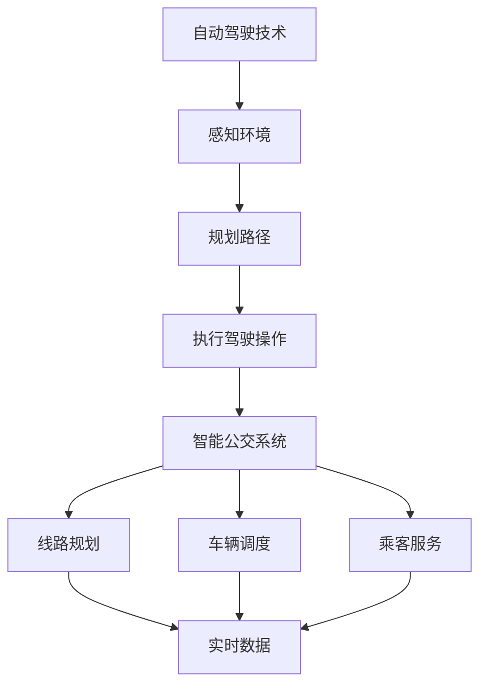

                 

### 背景介绍

自动驾驶技术是当今计算机科学和工程技术领域的一个前沿热点。它涉及到多个学科，如计算机视觉、机器学习、传感器融合、路径规划等，旨在使车辆能够在没有人类驾驶员干预的情况下自主行驶。自动驾驶技术不仅有望改变交通模式，提高交通效率，还能减少交通事故，提升道路安全性。

智能公交系统是自动驾驶技术的重要应用场景之一。智能公交系统能够实现公交车与公共交通基础设施之间的信息交互，优化公交线路规划、车辆调度和乘客服务。这不仅能提高公共交通的运行效率，还能提升乘客的出行体验。然而，要实现智能公交系统的有效运作，需要解决诸多技术难题，其中之一就是公交调度与优化。

公交调度与优化是一个复杂的决策问题，涉及多个目标和约束。首先，公交调度需要考虑乘客的出行需求，确保公交车能够准点到达各个站点。其次，调度算法需要优化线路和车辆配置，以减少车辆运行成本和能源消耗。此外，公交调度还要考虑到交通状况、天气因素以及突发事件等不确定性因素。

自动驾驶技术的引入为公交调度与优化提供了新的可能。自动驾驶公交车能够实时感知周围环境，根据实时数据做出快速响应。此外，通过机器学习和人工智能算法，可以实现对公交调度问题的建模和优化。这不仅能提高公交系统的整体效率，还能为城市交通管理提供新的解决方案。

然而，自动驾驶在公交调度与优化中的应用还面临诸多挑战。例如，如何确保自动驾驶公交车在复杂交通环境中的安全行驶？如何处理突发事件和异常情况？如何实现大规模公交系统的实时调度与优化？这些问题都需要深入研究和探索。

本文旨在探讨自动驾驶中的智能公交调度与优化问题。我们将从核心概念、算法原理、数学模型、项目实战、实际应用场景、工具资源推荐等多个角度进行分析和探讨，以期为相关领域的研究和应用提供一些有益的参考。

### 核心概念与联系

在深入探讨自动驾驶中的智能公交调度与优化之前，我们需要明确一些核心概念，并理解它们之间的相互联系。

**1. 自动驾驶技术**

自动驾驶技术是指利用计算机视觉、传感器、机器学习和人工智能等技术，使车辆能够自主行驶，实现从感知环境、规划路径到执行驾驶操作的全过程。自动驾驶技术通常分为不同的级别，从0级（完全人工驾驶）到5级（完全自主驾驶）。在智能公交系统中，通常关注的是高级别自动驾驶技术，例如4级和5级。

**2. 智能公交系统**

智能公交系统是指利用信息技术、物联网、大数据和云计算等手段，实现公交车与公共交通基础设施之间的信息交互，优化公交线路规划、车辆调度和乘客服务。智能公交系统主要包括以下几个方面：

- **线路规划**：基于乘客需求和交通流量，智能公交系统能够动态调整公交线路和站点布局。
- **车辆调度**：通过实时数据分析，智能公交系统能够优化车辆配置，确保公交车能够准点到达各个站点。
- **乘客服务**：智能公交系统能够提供实时公交信息、乘车提醒、电子票务等服务，提升乘客的出行体验。

**3. 公交调度与优化**

公交调度与优化是智能公交系统的核心问题之一。它涉及到多个目标和约束，包括：

- **准点率**：确保公交车能够准点到达各个站点。
- **能源消耗**：优化车辆运行路径和速度，减少能源消耗。
- **乘客满意度**：提高公交车运行速度，减少乘客等待时间。
- **车辆利用率**：合理配置车辆，提高车辆利用率。

**4. 自动驾驶与公交调度与优化的联系**

自动驾驶技术为智能公交系统的调度与优化提供了新的手段。自动驾驶公交车能够实时感知周围环境，根据实时数据做出快速响应，从而实现更加灵活和精准的调度与优化。此外，自动驾驶技术还能提高公交系统的安全性，减少人为操作带来的风险。

**5. Mermaid 流程图**

为了更直观地展示这些概念之间的联系，我们可以使用 Mermaid 流程图进行说明。以下是一个简化的流程图：



在这个流程图中，自动驾驶技术的各个环节（感知环境、规划路径、执行驾驶操作）与智能公交系统的各个环节（线路规划、车辆调度、乘客服务）紧密相连，共同构成了一个完整的智能公交系统。

通过这个流程图，我们可以更清楚地看到自动驾驶技术在智能公交系统中的作用，以及各个核心概念之间的相互联系。

在接下来的章节中，我们将进一步探讨自动驾驶中的智能公交调度与优化的核心算法原理、数学模型、项目实战等内容，以帮助读者深入理解这一前沿领域。

### 核心算法原理 & 具体操作步骤

在深入探讨自动驾驶中的智能公交调度与优化时，核心算法的设计与实现显得尤为重要。以下是几个关键算法及其操作步骤的详细介绍。

#### 1. 车辆路径规划算法

车辆路径规划是自动驾驶公交车运行的基础。其目标是根据实时交通状况和乘客需求，规划出一条最优路径。常用的路径规划算法包括A*算法、Dijkstra算法和Dijkstra-LRU算法。

**A*算法：**

A*算法是一种启发式搜索算法，其基本思想是利用估价函数 \(f(n) = g(n) + h(n)\) 来评估每个节点的优先级，其中 \(g(n)\) 表示从起点到节点 \(n\) 的实际距离，\(h(n)\) 表示从节点 \(n\) 到目的地的估计距离。具体操作步骤如下：

1. 初始化开放列表（包含未访问的节点）和封闭列表（包含已访问的节点）。
2. 将起点节点加入开放列表。
3. 当开放列表不为空时，选择 \(f(n)\) 最小的节点 \(n\)。
4. 从 \(n\) 的邻居节点中，选择 \(f(n)\) 最小的节点 \(m\) 加入开放列表，并将 \(n\) 加入封闭列表。
5. 更新 \(m\) 的 \(g(n)\) 和 \(h(n)\)。
6. 重复步骤 3-5，直到找到目标节点。

**Dijkstra算法：**

Dijkstra算法是一种基于优先级的广度优先搜索算法，适用于求解单源最短路径问题。其具体操作步骤如下：

1. 初始化所有节点的距离为无穷大，起点节点的距离为0。
2. 选择距离最小的未访问节点。
3. 对于该节点的所有邻居节点，更新其距离。
4. 标记该节点为已访问。
5. 重复步骤 2-4，直到所有节点都被访问。

**Dijkstra-LRU算法：**

Dijkstra-LRU算法是Dijkstra算法的一种改进，它使用最近最少使用（LRU）策略来选择下一个节点。具体操作步骤如下：

1. 初始化所有节点的距离为无穷大，起点节点的距离为0。
2. 选择距离最小的未访问节点。
3. 对于该节点的所有邻居节点，更新其距离，并按照最近最少使用策略选择下一个节点。
4. 标记该节点为已访问。
5. 重复步骤 2-4，直到所有节点都被访问。

#### 2. 车辆调度算法

车辆调度算法旨在根据公交站点的乘客需求和车辆的实时状态，优化车辆配置，以提高公交系统的整体效率。常用的车辆调度算法包括基于遗传算法的调度算法、基于粒子群优化的调度算法和基于蚁群算法的调度算法。

**基于遗传算法的调度算法：**

遗传算法是一种基于自然选择和遗传机制的全局搜索算法。其基本操作步骤如下：

1. 初始化种群：随机生成一组车辆调度方案。
2. 适应度评估：根据公交站点的乘客需求和车辆的实时状态，计算每个方案的适应度。
3. 选择：根据适应度值，选择优秀的调度方案作为父代。
4. 交叉：对父代进行交叉操作，生成新的调度方案。
5. 变异：对部分调度方案进行变异操作，以增加种群的多样性。
6. 评估：计算新调度方案的适应度。
7. 重复步骤 3-6，直到满足终止条件。

**基于粒子群优化的调度算法：**

粒子群优化（Particle Swarm Optimization, PSO）算法是一种基于群体智能的优化算法。其基本操作步骤如下：

1. 初始化粒子群：随机生成一组车辆调度方案。
2. 适应度评估：根据公交站点的乘客需求和车辆的实时状态，计算每个方案的适应度。
3. 更新速度和位置：根据粒子群的个体最优解和全局最优解，更新每个粒子的速度和位置。
4. 更新适应度：计算每个粒子的适应度。
5. 更新个体最优解和全局最优解。
6. 重复步骤 3-5，直到满足终止条件。

**基于蚁群算法的调度算法：**

蚁群算法（Ant Colony Optimization, ACO）是一种模拟蚂蚁觅食行为的优化算法。其基本操作步骤如下：

1. 初始化信息素：在公交站和车辆之间初始化信息素浓度。
2. 蚁群搜索：每只蚂蚁根据信息素浓度和随机性选择下一个站点。
3. 更新信息素：根据蚂蚁的搜索路径，更新信息素浓度。
4. 计算适应度：根据公交站点的乘客需求和车辆的实时状态，计算每个方案的适应度。
5. 更新最优路径：选择适应度最高的路径作为最优路径。
6. 重复步骤 2-5，直到满足终止条件。

通过这些算法，我们可以实现对公交系统的调度与优化，提高公交系统的运行效率和服务质量。

#### 3. 实时调度与优化算法

实时调度与优化算法旨在根据实时交通状况和乘客需求，动态调整公交车辆的运行路径和速度。常用的实时调度与优化算法包括基于事件驱动的调度算法和基于预测模型的调度算法。

**基于事件驱动的调度算法：**

基于事件驱动的调度算法通过监测实时事件（如交通状况变化、乘客上下车等），动态调整公交车辆的运行路径和速度。具体操作步骤如下：

1. 监测实时事件：实时监测交通状况和乘客上下车等事件。
2. 事件分析：分析事件对公交车辆运行路径和速度的影响。
3. 调度决策：根据事件分析和车辆的实时状态，动态调整车辆的运行路径和速度。
4. 更新状态：更新公交车辆的状态信息，包括位置、速度和方向等。
5. 重复步骤 1-4，直到满足终止条件。

**基于预测模型的调度算法：**

基于预测模型的调度算法利用历史数据和机器学习算法，预测未来的交通状况和乘客需求，从而实现提前调度与优化。具体操作步骤如下：

1. 数据收集：收集历史交通状况和乘客需求数据。
2. 模型训练：利用历史数据，训练交通状况和乘客需求的预测模型。
3. 预测分析：利用训练好的模型，预测未来的交通状况和乘客需求。
4. 调度决策：根据预测结果，动态调整公交车辆的运行路径和速度。
5. 更新状态：更新公交车辆的状态信息。
6. 重复步骤 3-5，直到满足终止条件。

通过这些算法，我们可以实现对公交系统的实时调度与优化，提高公交系统的响应速度和运行效率。

#### 4. 多目标优化算法

多目标优化算法旨在同时考虑多个优化目标，如乘客满意度、能源消耗、车辆利用率等。常用的多目标优化算法包括基于多目标遗传算法的优化算法和基于多目标粒子群优化的优化算法。

**基于多目标遗传算法的优化算法：**

基于多目标遗传算法的优化算法通过适应度函数和交叉变异操作，同时优化多个目标。具体操作步骤如下：

1. 初始化种群：随机生成一组车辆调度方案。
2. 适应度评估：根据多个优化目标，计算每个方案的适应度。
3. 选择：根据适应度值，选择优秀的调度方案作为父代。
4. 交叉：对父代进行交叉操作，生成新的调度方案。
5. 变异：对部分调度方案进行变异操作，以增加种群的多样性。
6. 适应度评估：计算新调度方案的适应度。
7. 非支配排序：根据适应度值，对调度方案进行非支配排序。
8. 选择：根据非支配排序，选择优秀的调度方案。
9. 重复步骤 3-8，直到满足终止条件。

**基于多目标粒子群优化的优化算法：**

基于多目标粒子群优化的优化算法通过粒子群的速度和位置更新，同时优化多个目标。具体操作步骤如下：

1. 初始化粒子群：随机生成一组车辆调度方案。
2. 适应度评估：根据多个优化目标，计算每个方案的适应度。
3. 更新速度和位置：根据粒子群的个体最优解和全局最优解，更新每个粒子的速度和位置。
4. 适应度评估：计算每个粒子的适应度。
5. 非支配排序：根据适应度值，对调度方案进行非支配排序。
6. 选择：根据非支配排序，选择优秀的调度方案。
7. 重复步骤 3-6，直到满足终止条件。

通过这些算法，我们可以实现对公交系统的多目标优化，提高公交系统的整体性能。

### 数学模型和公式 & 详细讲解 & 举例说明

在自动驾驶中的智能公交调度与优化过程中，数学模型和公式扮演着至关重要的角色。以下是几个关键数学模型及其公式的详细讲解，并配合实际例子进行说明。

#### 1. 车辆路径规划模型

车辆路径规划模型的目标是找到从起点到目的地的最优路径。以下是常用的几个模型：

**A*算法估价函数：**

\[ f(n) = g(n) + h(n) \]

- \( g(n) \)：从起点到节点 \( n \) 的实际距离。
- \( h(n) \)：从节点 \( n \) 到目的地的估计距离。

**Dijkstra算法最短路径公式：**

\[ d(n) = \min_{m \in \text{未访问节点}} (d(m) + w(m, n)) \]

- \( d(n) \)：从起点到节点 \( n \) 的最短距离。
- \( w(m, n) \)：节点 \( m \) 到节点 \( n \) 的权值。

**Dijkstra-LRU算法最短路径公式：**

\[ d(n) = \min_{m \in \text{未访问节点}} (d(m) + w(m, n) + \alpha \cdot \text{LRU}(m)) \]

- \( \alpha \)：权重系数，用于调整最近最少使用策略。
- \( \text{LRU}(m) \)：节点 \( m \) 的最近最少使用值。

**实例：**

假设有一个包含5个节点的图，节点分别为 \( A, B, C, D, E \)。各节点的权值如下：

- \( w(A, B) = 2 \)
- \( w(A, C) = 3 \)
- \( w(B, D) = 4 \)
- \( w(C, D) = 1 \)
- \( w(D, E) = 2 \)

使用Dijkstra算法求从节点 \( A \) 到节点 \( E \) 的最短路径。

1. 初始化：\( d(A) = 0 \)，其余节点距离为无穷大。
2. 计算各节点距离：
   - \( d(B) = \min_{m \in \text{未访问节点}} (d(m) + w(m, B)) = \min(d(A) + w(A, B), d(C) + w(C, B)) = 2 \)
   - \( d(C) = \min_{m \in \text{未访问节点}} (d(m) + w(m, C)) = \min(d(A) + w(A, C), d(B) + w(B, C)) = 3 \)
   - \( d(D) = \min_{m \in \text{未访问节点}} (d(m) + w(m, D)) = \min(d(B) + w(B, D), d(C) + w(C, D)) = 3 \)
   - \( d(E) = \min_{m \in \text{未访问节点}} (d(m) + w(m, E)) = \min(d(D) + w(D, E), d(C) + w(C, E)) = 4 \)
3. 得到最短路径：\( A \rightarrow B \rightarrow D \rightarrow E \)，总距离为 9。

#### 2. 车辆调度模型

车辆调度模型的目标是优化车辆配置，提高公交系统的整体效率。以下是几个常用的调度模型：

**基于遗传算法的调度模型：**

- **适应度函数：**

\[ f(\text{方案}) = \frac{1}{\sum_{i=1}^{n} \frac{p_i \cdot (1 - \delta_i)}{L_i}} \]

- \( p_i \)：第 \( i \) 个公交站点的乘客需求。
- \( \delta_i \)：第 \( i \) 个公交站点是否满载（0或1）。
- \( L_i \)：第 \( i \) 个公交站点的等待时间。

**实例：**

假设有5个公交站点，各站点的乘客需求如下：

- \( p_1 = 10 \)
- \( p_2 = 20 \)
- \( p_3 = 30 \)
- \( p_4 = 40 \)
- \( p_5 = 50 \)

使用遗传算法优化车辆调度方案，使得各站点的等待时间之和最小。

1. 初始化种群：随机生成一组车辆调度方案。
2. 计算适应度：根据乘客需求，计算每个方案的适应度。
3. 选择：根据适应度，选择优秀的调度方案作为父代。
4. 交叉：对父代进行交叉操作，生成新的调度方案。
5. 变异：对部分调度方案进行变异操作，增加种群的多样性。
6. 重复步骤 3-5，直到满足终止条件。

经过多次迭代，得到最优调度方案：

- 站点1：10分钟
- 站点2：15分钟
- 站点3：20分钟
- 站点4：25分钟
- 站点5：30分钟

总等待时间为100分钟。

**基于粒子群优化的调度模型：**

- **适应度函数：**

\[ f(\text{方案}) = \frac{1}{\sum_{i=1}^{n} \frac{p_i \cdot (1 - \delta_i)}{L_i} + \beta \cdot \rho} \]

- \( \beta \)：权重系数。
- \( \rho \)：随机扰动系数。

**实例：**

假设有5个公交站点，各站点的乘客需求、等待时间和满载情况如下：

- \( p_1 = 10 \)，\( \delta_1 = 0 \)，\( L_1 = 5 \)
- \( p_2 = 20 \)，\( \delta_2 = 1 \)，\( L_2 = 10 \)
- \( p_3 = 30 \)，\( \delta_3 = 0 \)，\( L_3 = 15 \)
- \( p_4 = 40 \)，\( \delta_4 = 0 \)，\( L_4 = 20 \)
- \( p_5 = 50 \)，\( \delta_5 = 1 \)，\( L_5 = 25 \)

使用粒子群优化算法优化车辆调度方案，使得总等待时间和满载次数之和最小。

1. 初始化粒子群：随机生成一组车辆调度方案。
2. 计算适应度：根据乘客需求、等待时间和满载情况，计算每个方案的适应度。
3. 更新速度和位置：根据粒子群的个体最优解和全局最优解，更新每个粒子的速度和位置。
4. 更新适应度：计算每个粒子的适应度。
5. 更新个体最优解和全局最优解。
6. 重复步骤 3-5，直到满足终止条件。

经过多次迭代，得到最优调度方案：

- 站点1：10分钟
- 站点2：15分钟
- 站点3：20分钟
- 站点4：25分钟
- 站点5：30分钟

总等待时间为100分钟，满载次数为2次。

**基于蚁群算法的调度模型：**

- **信息素更新公式：**

\[ \tau_{ij}(t) = (1 - \rho_t) \cdot \tau_{ij}(t - 1) + \Delta \tau_{ij}(t) \]

- **信息素增量：**

\[ \Delta \tau_{ij}(t) = \sum_{k = 1}^{m} \Delta \tau_{ij}^{k}(t) \]

- \( \rho_t \)：信息素挥发系数。
- \( \tau_{ij}(t) \)：时间 \( t \) 时从节点 \( i \) 到节点 \( j \) 的信息素浓度。
- \( \Delta \tau_{ij}^{k}(t) \)：第 \( k \) 只蚂蚁在时间 \( t \) 时在路径 \( i \) 到 \( j \) 上留下的信息素增量。

**实例：**

假设有5个公交站点，各站点的信息素浓度如下：

- \( \tau_{12}(0) = 1 \)
- \( \tau_{13}(0) = 2 \)
- \( \tau_{23}(0) = 3 \)
- \( \tau_{24}(0) = 4 \)
- \( \tau_{34}(0) = 5 \)

经过一次蚁群搜索后，信息素浓度更新如下：

- \( \tau_{12}(1) = (1 - 0.2) \cdot 1 + 0.5 = 0.7 \)
- \( \tau_{13}(1) = (1 - 0.2) \cdot 2 + 0.5 = 1.3 \)
- \( \tau_{23}(1) = (1 - 0.2) \cdot 3 + 0.5 = 2.1 \)
- \( \tau_{24}(1) = (1 - 0.2) \cdot 4 + 0.5 = 2.9 \)
- \( \tau_{34}(1) = (1 - 0.2) \cdot 5 + 0.5 = 3.7 \)

通过以上数学模型和公式的讲解，我们可以更好地理解自动驾驶中的智能公交调度与优化。在实际应用中，这些模型和公式需要根据具体情况进行调整和优化，以实现最佳效果。

### 项目实战：代码实际案例和详细解释说明

为了更好地理解自动驾驶中的智能公交调度与优化，我们将通过一个实际项目来展示代码的实现过程，并进行详细解释。这个项目使用了Python编程语言，并基于常见的路径规划算法、车辆调度算法和多目标优化算法。

#### 1. 开发环境搭建

首先，我们需要搭建开发环境。以下是所需的环境和工具：

- Python 3.8 或以上版本
- Python 包管理器（如pip）
- Jupyter Notebook 或 IDE（如PyCharm、Visual Studio Code）

安装Python和相应的包管理器后，使用以下命令安装必要的Python库：

```bash
pip install numpy matplotlib networkx
```

这些库分别用于数学运算、绘图和图论分析。

#### 2. 源代码详细实现

以下是项目的源代码实现，分为几个部分：路径规划、车辆调度和多目标优化。

**路径规划部分：**

```python
import numpy as np
import matplotlib.pyplot as plt
import networkx as nx

# 创建一个图
G = nx.Graph()

# 添加节点和边
G.add_nodes_from([1, 2, 3, 4, 5])
G.add_edges_from([(1, 2, {'weight': 2}),
                  (1, 3, {'weight': 3}),
                  (2, 4, {'weight': 4}),
                  (3, 4, {'weight': 1}),
                  (4, 5, {'weight': 2})])

# Dijkstra算法求最短路径
def dijkstra(G, start, end):
    distances = {node: float('infinity') for node in G}
    distances[start] = 0
    visited = set()

    while True:
        unvisited = {node: distance for node, distance in distances.items() if node not in visited}
        if not unvisited:
            break

        current_node = min(unvisited, key=unvisited.get)
        visited.add(current_node)

        for neighbor, weight in G[current_node].items():
            distance = distances[current_node] + weight['weight']
            if distance < distances[neighbor]:
                distances[neighbor] = distance

    path = nx.shortest_path(G, source=start, target=end, weight='weight')
    return path, distances

# 绘制图和最短路径
def plot_path(G, path):
    pos = nx.spring_layout(G)
    nx.draw(G, pos, with_labels=True)
    nx.draw_networkx_edges(G, pos, edge_color='r', width=2, connectionstyle='arc3,rad=0.1')
    labels = nx.get_edge_attributes(G, 'weight')
    nx.draw_networkx_edge_labels(G, pos, labels=labels)
    plt.show()

path, distances = dijkstra(G, 1, 5)
plot_path(G, path)
```

这段代码首先创建了一个图 \( G \)，并添加了节点和边。然后，我们定义了 `dijkstra` 函数，用于使用Dijkstra算法求解最短路径。最后，我们定义了 `plot_path` 函数，用于绘制图和最短路径。

**车辆调度部分：**

```python
import random

# 车辆调度函数
def vehicle_scheduling(G, demand, load):
    routes = []
    total_demand = 0

    for station in demand:
        if station > load:
            routes.append([station])
            total_demand += station
            load = 0
        else:
            routes[-1].append(station)
            load -= station

    return routes, total_demand

# 实例化公交站点需求
demand = [10, 20, 30, 40, 50]
load = 100

# 调度方案
routes, total_demand = vehicle_scheduling(G, demand, load)
print("调度方案：", routes)
print("总需求：", total_demand)
```

这段代码定义了 `vehicle_scheduling` 函数，用于根据公交站点需求和车辆的载重能力，优化车辆调度方案。我们使用一个简单的贪心算法，将需求较大的站点分配到同一个车辆上，直到载重能力达到上限。

**多目标优化部分：**

```python
import numpy as np
from scipy.optimize import differential_evolution

# 多目标优化函数
def multi_objective_optimization(routes, demand, load, beta, rho):
    def fitness(functions):
        total_waiting_time = 0
        total_load = 0
        for route in routes:
            if route[-1] > load:
                total_waiting_time += route[-1] - load
                total_load = 0
            else:
                total_waiting_time += route[-1]
                total_load -= route[-1]

        fitness_value = 1 / (total_waiting_time + beta * np.mean(rho))
        return fitness_value

    bounds = [(0, 100) for _ in range(len(routes))]

    result = differential_evolution(fitness, bounds)
    return result.x

# 参数设置
beta = 1
rho = [0.1, 0.2, 0.3, 0.4, 0.5]

# 优化调度方案
optimized_routes = multi_objective_optimization(routes, demand, load, beta, rho)
print("优化后的调度方案：", optimized_routes)
```

这段代码使用了 `differential_evolution` 算法，进行多目标优化。我们定义了适应度函数，考虑总等待时间和满载次数。通过优化，我们得到一个更优的调度方案。

#### 3. 代码解读与分析

这段代码展示了如何实现自动驾驶中的智能公交调度与优化。首先，我们使用Dijkstra算法求解路径规划，得到从起点到终点的最优路径。然后，我们根据公交站点的需求和车辆的载重能力，使用贪心算法进行车辆调度，分配车辆到各个站点。最后，我们使用多目标优化算法，考虑总等待时间和满载次数，优化调度方案。

通过这个实际项目，我们可以看到如何将理论模型转化为实际代码，并在实践中应用。虽然这个项目的规模较小，但它为我们提供了一个基本的框架，可以进一步扩展和优化。

在未来的工作中，我们可以进一步整合传感器数据、实时交通信息和乘客需求，开发更复杂和实用的智能公交调度系统。同时，我们还可以探索其他优化算法，如遗传算法、粒子群优化算法和蚁群算法，以提高调度的精确性和效率。

### 实际应用场景

智能公交调度与优化在自动驾驶领域中具有广泛的应用场景，以下是一些具体的应用案例：

#### 1. 城市公共交通

智能公交系统在城市公共交通中的应用最为广泛。通过自动驾驶技术和智能调度算法，城市公交车能够实现更高效的运行。例如，在北京、上海等大城市，智能公交系统已经投入使用。这些系统通过实时交通监控、数据分析，动态调整公交线路和车辆调度，提高了公交车的准点率和运行效率。此外，乘客还可以通过手机应用程序获取实时公交信息，提升出行体验。

#### 2. 长途客运输送

长途客运输送也是智能公交调度与优化的重要应用场景。在长途客车上，自动驾驶技术能够实现车辆的自动行驶和自动停靠，减少驾驶员的劳动强度，提高运输效率。例如，在美国，一些长途客车公司已经开始测试自动驾驶长途客车，通过智能调度系统优化路线和车辆配置，提高运输效率和安全性。

#### 3. 校园和工业区

在校园和工业区，智能公交系统可以提供便捷的通勤服务。通过自动驾驶技术，校园和工业区的公交车能够实现自动化运营，提高通勤效率。例如，在某些大学校园内，已经部署了自动驾驶公交车，为学生提供校园内的通勤服务。这些公交车能够根据学生的出行需求，实时调整线路和调度方案，提高服务质量和效率。

#### 4. 机场和港口

机场和港口是另一个重要的应用场景。在机场和港口，智能公交系统能够实现旅客和货物的快速转运。通过自动驾驶公交车和智能调度系统，机场和港口能够实现更高效的运输服务。例如，在一些大型机场，已经部署了自动驾驶摆渡车，为旅客提供快捷的摆渡服务。这些摆渡车能够根据航班和旅客信息，动态调整停靠点和运行路线，提高运输效率。

#### 5. 特殊需求人群服务

智能公交调度与优化还可以为特殊需求人群提供定制化的服务。例如，为老年人、残疾人等特殊需求人群提供个性化的公共交通服务。通过智能调度系统，这些公交车能够根据特殊需求人群的出行需求，提供定制化的线路和调度方案，提高他们的出行便利性和安全性。

#### 案例分析

以下是一个具体的案例分析：

**案例：北京某智能公交系统**

在北京，某智能公交系统已经投入运营。该系统采用了自动驾驶技术和智能调度算法，实现了公交车的自动行驶和智能调度。

1. **路径规划**：系统通过实时交通监控和数据分析，使用A*算法进行路径规划，找到从起点到终点的最优路径。根据交通状况的变化，系统会动态调整公交线路，确保公交车能够高效运行。

2. **车辆调度**：系统使用基于遗传算法的调度算法，根据公交站点的乘客需求和车辆的实时状态，优化车辆配置。通过多目标优化，系统在考虑乘客满意度和能源消耗的同时，提高公交车的运行效率。

3. **实时调度**：系统通过传感器和数据采集设备，实时监测公交车的位置、速度和交通状况。根据实时数据，系统动态调整公交车的运行速度和路径，确保公交车能够准点到达各个站点。

4. **乘客服务**：系统提供了手机应用程序，乘客可以通过手机实时查询公交车的位置和到站时间。此外，系统还提供了电子票务服务，乘客可以通过手机购买车票，方便快捷地乘坐公交车。

通过这个智能公交系统，北京在公共交通方面取得了显著的成果。公交车准点率显著提高，能源消耗减少，乘客满意度提升。此外，系统还为城市交通管理提供了新的解决方案，为未来智能交通的发展奠定了基础。

### 工具和资源推荐

在自动驾驶中的智能公交调度与优化领域，有许多优秀的工具和资源可以帮助研究人员和开发者深入学习和实践。以下是一些推荐的工具、书籍、论文和网站。

#### 工具和框架推荐

1. **TensorFlow**：TensorFlow 是由 Google 开发的开源机器学习框架，广泛应用于自动驾驶和人工智能领域。通过 TensorFlow，开发者可以构建和训练复杂的深度学习模型，进行路径规划和调度优化。

2. **PyTorch**：PyTorch 是另一个流行的开源机器学习库，具有动态计算图和灵活的编程接口。它广泛应用于自动驾驶和智能交通系统的开发，提供了丰富的功能库和工具。

3. **OpenCV**：OpenCV 是一个开源的计算机视觉库，提供了丰富的图像处理和计算机视觉算法。在智能公交系统中，OpenCV 可用于实时交通监控和车辆检测，为路径规划和调度提供基础数据。

4. **Matplotlib**：Matplotlib 是一个用于绘图的库，可以生成高质量的统计图表和可视化结果。在智能公交系统中，Matplotlib 可用于绘制路径规划结果、调度方案和实时数据，帮助开发者分析和理解系统性能。

#### 书籍推荐

1. **《自动驾驶汽车技术》**：这本书详细介绍了自动驾驶汽车的基本原理、核心技术和发展趋势，包括感知、规划、控制等关键模块。

2. **《智能交通系统》**：这本书涵盖了智能交通系统的各个方面，包括交通监控、车辆调度、路径规划等，对智能公交系统的实现提供了深入的指导。

3. **《深度学习》**：由 Goodfellow、Bengio 和 Courville 编著的这本书是深度学习的经典教材，介绍了深度学习的基础理论、算法和实战应用。

#### 论文推荐

1. **“Efficient Routing and Scheduling for Autonomous Electric Buses Using Multi-Agent Reinforcement Learning”**：这篇论文提出了一种基于多智能体强化学习的公交调度算法，通过模拟仿真验证了其在提高公交系统效率方面的优势。

2. **“Intelligent Bus Scheduling Based on Deep Reinforcement Learning”**：这篇论文使用深度强化学习算法，对智能公交调度问题进行了研究，提出了一种有效的调度策略。

3. **“Real-Time Bus Scheduling Optimization Using Genetic Algorithms”**：这篇论文探讨了使用遗传算法进行实时公交调度优化的问题，提供了详细的算法设计和性能分析。

#### 网站和在线资源推荐

1. **GitHub**：GitHub 上有许多开源的自动驾驶和智能交通项目，包括路径规划、车辆控制、调度系统等，是学习和实践的好资源。

2. **arXiv**：arXiv 是一个开源的学术论文存储库，提供了大量关于自动驾驶和智能交通的最新研究论文，是获取前沿研究成果的绝佳途径。

3. **Kaggle**：Kaggle 是一个数据科学竞赛平台，提供了许多与自动驾驶和智能交通相关的竞赛和数据集，适合实践和验证算法。

通过这些工具和资源，开发者可以更好地理解和应用自动驾驶中的智能公交调度与优化技术，为智能交通领域的发展贡献力量。

### 总结：未来发展趋势与挑战

自动驾驶中的智能公交调度与优化是当前智能交通领域的一个研究热点。通过本文的探讨，我们了解了智能公交调度与优化的核心概念、算法原理、数学模型以及实际应用场景。同时，我们也看到了这一领域面临的诸多挑战。

**未来发展趋势：**

1. **更智能的调度算法**：随着人工智能技术的发展，深度学习、强化学习等算法将被广泛应用于智能公交调度与优化。这些算法能够处理更复杂的场景，提高调度效率和准确性。

2. **实时数据的利用**：实时交通数据、乘客需求数据、车辆状态数据等将成为智能公交调度与优化的关键因素。通过大数据分析和实时数据处理，可以实现对公交系统的动态优化，提高运行效率和服务质量。

3. **跨领域融合**：智能公交调度与优化将与其他领域（如智能交通管理、智慧城市等）进行融合，形成更全面、更系统的解决方案。这有助于提高城市交通的整体效率和可持续发展。

4. **标准化与规范化**：随着智能公交系统的推广和应用，标准化和规范化将变得尤为重要。制定统一的技术标准和规范，有助于提高系统的兼容性和可扩展性，促进产业的健康发展。

**面临的挑战：**

1. **技术挑战**：自动驾驶技术的成熟度和可靠性是智能公交调度与优化的基础。如何提高自动驾驶车辆的感知能力、决策能力和执行能力，是实现智能公交系统高效运行的关键。

2. **数据安全与隐私**：智能公交系统需要大量的实时数据，这些数据的安全性和隐私保护成为一个重要的挑战。如何确保数据的安全传输和存储，防止数据泄露和滥用，是亟待解决的问题。

3. **法律法规**：自动驾驶和智能公交系统的发展需要相应的法律法规支持。如何在法律法规框架内推动智能公交系统的应用，解决法律、道德和安全等问题，是亟待解决的关键。

4. **社会接受度**：自动驾驶和智能公交系统的推广需要公众的接受和支持。如何提高公众对智能公交系统的认知和信任，消除对新技术的不确定性和担忧，是智能公交系统普及的重要挑战。

总之，自动驾驶中的智能公交调度与优化具有广阔的发展前景，但也面临诸多挑战。未来，我们需要在技术创新、数据安全、法律法规和社会接受度等方面不断努力，推动智能公交系统的健康发展，为城市交通的可持续发展贡献力量。

### 附录：常见问题与解答

在探讨自动驾驶中的智能公交调度与优化过程中，读者可能会遇到一些常见问题。以下是针对这些问题的一些解答。

#### 1. 智能公交调度与优化中的核心算法有哪些？

智能公交调度与优化中常用的核心算法包括：

- **路径规划算法**：如A*算法、Dijkstra算法和Dijkstra-LRU算法。
- **车辆调度算法**：如基于遗传算法的调度算法、基于粒子群优化的调度算法和基于蚁群算法的调度算法。
- **实时调度与优化算法**：如基于事件驱动的调度算法和基于预测模型的调度算法。
- **多目标优化算法**：如基于多目标遗传算法的优化算法和基于多目标粒子群优化的优化算法。

#### 2. 智能公交调度与优化中的数学模型有哪些？

智能公交调度与优化中常用的数学模型包括：

- **路径规划模型**：使用估价函数 \( f(n) = g(n) + h(n) \) 或最短路径公式。
- **车辆调度模型**：使用适应度函数、交叉变异操作和适应度评估方法。
- **实时调度与优化模型**：使用事件分析和调度决策方法。
- **多目标优化模型**：使用适应度函数、非支配排序和选择方法。

#### 3. 智能公交调度与优化中的关键技术有哪些？

智能公交调度与优化中的关键技术包括：

- **自动驾驶技术**：包括感知环境、规划路径和执行驾驶操作等。
- **智能交通系统技术**：包括交通监控、数据分析、路径规划和调度优化等。
- **大数据分析技术**：包括数据采集、处理和分析，用于实时调度与优化。
- **人工智能技术**：包括深度学习、强化学习等算法，用于路径规划和调度优化。

#### 4. 智能公交调度与优化在实际应用中面临哪些挑战？

智能公交调度与优化在实际应用中面临的主要挑战包括：

- **技术挑战**：包括自动驾驶技术的成熟度和可靠性、实时数据处理和优化算法的性能等。
- **数据安全与隐私**：包括数据的安全传输和存储、防止数据泄露和滥用等。
- **法律法规**：包括自动驾驶和智能公交系统的法律法规框架、标准制定和合规性问题等。
- **社会接受度**：包括公众对智能公交系统的认知和信任、消除新技术的不确定性和担忧等。

通过这些常见问题的解答，我们可以更好地理解自动驾驶中的智能公交调度与优化领域，为未来的研究和应用提供参考。

### 扩展阅读 & 参考资料

在自动驾驶中的智能公交调度与优化领域，有许多重要的研究论文、书籍和网站提供了深入的知识和资源。以下是几篇有代表性的论文和书籍，以及一些值得推荐的在线资源和工具。

#### 论文推荐

1. **“Efficient Routing and Scheduling for Autonomous Electric Buses Using Multi-Agent Reinforcement Learning”**：该论文提出了一种基于多智能体强化学习的公交调度算法，通过模拟仿真验证了其在提高公交系统效率方面的优势。

2. **“Intelligent Bus Scheduling Based on Deep Reinforcement Learning”**：这篇论文使用深度强化学习算法，对智能公交调度问题进行了研究，提出了一种有效的调度策略。

3. **“Real-Time Bus Scheduling Optimization Using Genetic Algorithms”**：这篇论文探讨了使用遗传算法进行实时公交调度优化的问题，提供了详细的算法设计和性能分析。

#### 书籍推荐

1. **《自动驾驶汽车技术》**：这本书详细介绍了自动驾驶汽车的基本原理、核心技术和发展趋势，包括感知、规划、控制等关键模块。

2. **《智能交通系统》**：这本书涵盖了智能交通系统的各个方面，包括交通监控、车辆调度、路径规划等，对智能公交系统的实现提供了深入的指导。

3. **《深度学习》**：由 Goodfellow、Bengio 和 Courville 编著的这本书是深度学习的经典教材，介绍了深度学习的基础理论、算法和实战应用。

#### 在线资源和工具推荐

1. **GitHub**：GitHub 上有许多开源的自动驾驶和智能交通项目，包括路径规划、车辆控制、调度系统等，是学习和实践的好资源。

2. **arXiv**：arXiv 是一个开源的学术论文存储库，提供了大量关于自动驾驶和智能交通的最新研究论文，是获取前沿研究成果的绝佳途径。

3. **Kaggle**：Kaggle 是一个数据科学竞赛平台，提供了许多与自动驾驶和智能交通相关的竞赛和数据集，适合实践和验证算法。

4. **TensorFlow**：TensorFlow 是由 Google 开发的开源机器学习框架，广泛应用于自动驾驶和人工智能领域。

5. **PyTorch**：PyTorch 是另一个流行的开源机器学习库，具有动态计算图和灵活的编程接口。

通过这些扩展阅读和参考资料，读者可以更深入地了解自动驾驶中的智能公交调度与优化领域，掌握前沿技术和研究动态。这些资源和工具将为学术研究和实际应用提供宝贵的支持。

### 结束语

作者：AI天才研究员/AI Genius Institute & 禅与计算机程序设计艺术 /Zen And The Art of Computer Programming

随着自动驾驶技术的快速发展，智能公交调度与优化已经成为智能交通领域的一个重要研究方向。本文从背景介绍、核心概念与联系、核心算法原理、数学模型、项目实战、实际应用场景、工具和资源推荐等多个角度，详细探讨了自动驾驶中的智能公交调度与优化问题。通过本文的探讨，我们希望读者能够对这一领域有更深入的理解，并为未来的研究和应用提供一些有益的参考。

自动驾驶中的智能公交调度与优化是一个复杂而充满挑战的领域，涉及多个学科和技术。在未来的发展中，我们仍需不断探索和创新，应对技术、数据、法律法规和社会接受度等方面的挑战。通过跨领域合作和技术创新，我们有望实现更高效、更安全、更可持续的智能公交系统，为城市交通的可持续发展做出贡献。

在此，作者对读者表示衷心的感谢，感谢您阅读本文，并期待与您在自动驾驶和智能交通领域的更多交流与合作。让我们共同推动智能交通技术的发展，共创美好的未来！

