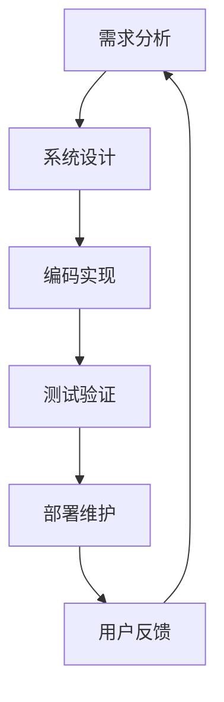
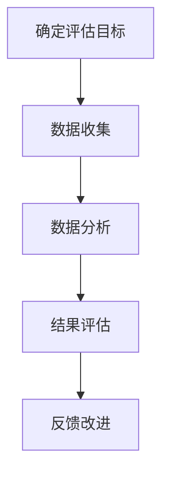

                 

# 自动驾驶行业的软件开发过程成熟度评估

## 摘要

随着自动驾驶技术的迅速发展，软件开发过程成熟度评估在保证自动驾驶系统安全、可靠和高效运行中扮演着至关重要的角色。本文将系统地探讨自动驾驶行业的软件开发过程成熟度评估，从背景介绍、核心概念与联系、核心算法原理与具体操作步骤、数学模型与公式详细讲解、实际应用场景、工具和资源推荐以及未来发展趋势与挑战等多个方面，深入分析这一领域的现状与未来方向。文章旨在为自动驾驶行业的软件开发过程成熟度评估提供理论指导和实践参考。

## 1. 背景介绍

自动驾驶技术作为人工智能的重要应用领域，正逐渐从概念验证走向实际应用。随着自动驾驶技术的不断进步，其软件开发过程也逐渐成为学术界和工业界关注的焦点。软件开发过程成熟度评估在这一背景下显得尤为重要。

首先，自动驾驶系统的复杂性决定了其软件开发过程必须具备较高的成熟度。自动驾驶系统涉及多领域的知识，如计算机视觉、传感器数据处理、路径规划、决策控制等，因此，如何确保软件开发过程的高效性、稳定性和可靠性，成为亟待解决的问题。

其次，自动驾驶技术的安全性至关重要。自动驾驶系统一旦发生故障，可能导致严重的安全事故。因此，对软件开发过程进行成熟度评估，有助于发现潜在的问题，提高系统的安全性和可靠性。

此外，自动驾驶技术的商业化进程也在不断加速。各大车企和科技公司纷纷布局自动驾驶领域，市场竞争日益激烈。软件开发过程成熟度评估能够帮助企业在激烈的市场竞争中脱颖而出，提高市场竞争力。

总之，自动驾驶行业的软件开发过程成熟度评估不仅关乎系统的安全性和可靠性，也对企业的发展和市场竞争力具有重要影响。因此，深入研究并掌握这一领域，具有重要的现实意义。

### 1.1 自动驾驶技术的发展历程

自动驾驶技术的发展可以追溯到20世纪40年代，当时的研究主要集中在利用雷达和光学传感器进行车辆定位和导航。随着计算机技术的发展，自动驾驶技术逐渐从理论走向实践。

在20世纪80年代，自动驾驶技术开始进入实际应用阶段，代表性的项目包括美国的卡内基梅隆大学的NavLab项目和欧洲的VaMoRs项目。这些项目为自动驾驶技术在实际场景中的可行性提供了有力的证据。

进入21世纪，随着人工智能技术的迅速发展，自动驾驶技术迎来了新一轮的爆发。谷歌、特斯拉、百度等科技巨头纷纷投入巨资研发自动驾驶技术，推出了一系列具有高精度感知、高可靠性决策的自动驾驶系统。

近年来，自动驾驶技术逐渐从实验阶段走向商业化应用。例如，Waymo在2021年推出了其完全无人驾驶出租车服务，特斯拉也在不断推广其Autopilot自动驾驶系统。此外，国内多家企业如蔚来、小鹏等也在自动驾驶领域取得了显著成果。

总体来看，自动驾驶技术经历了从理论探索到实际应用，再到商业化推广的漫长发展过程。随着技术的不断进步，自动驾驶系统的性能和可靠性也在不断提高，为自动驾驶行业的软件开发过程成熟度评估提供了丰富的实践经验和理论基础。

### 1.2 软件开发过程成熟度评估的重要性

软件开发过程成熟度评估在自动驾驶行业中具有至关重要的地位。首先，自动驾驶系统的复杂性决定了其软件开发过程需要具备较高的成熟度。自动驾驶系统不仅需要处理大量的数据，还需要进行实时决策和执行，这对软件的开发过程提出了极高的要求。

其次，成熟度评估有助于提高系统的安全性和可靠性。通过对软件开发过程进行评估，可以识别潜在的风险和问题，从而采取相应的措施进行改进。例如，通过评估可以发现系统设计中的不合理之处，或者代码中存在的潜在漏洞，从而降低系统发生故障的风险。

此外，成熟度评估还能提高企业的竞争力。在自动驾驶技术日益竞争激烈的背景下，具备较高软件开发过程成熟度的企业能够在市场中脱颖而出，赢得更多的商业机会。成熟度评估不仅有助于企业内部管理的优化，还能提升企业在客户和投资者心目中的形象。

总之，软件开发过程成熟度评估在自动驾驶行业中具有重要的现实意义，对系统的安全、可靠性和企业竞争力都有着深远的影响。因此，深入研究并掌握这一领域，对自动驾驶行业的健康发展具有重要意义。

### 1.3 自动驾驶行业的主要挑战

自动驾驶行业的快速发展虽然带来了巨大的机遇，但同时也面临着诸多挑战。首先，技术复杂性是自动驾驶行业面临的主要难题之一。自动驾驶系统涉及计算机视觉、传感器数据处理、路径规划、决策控制等多个技术领域，开发一个高效、稳定、可靠的自动驾驶系统需要大量的技术积累和经验。

其次，数据隐私和安全问题也是自动驾驶行业的重要挑战。自动驾驶系统依赖于大量的传感器数据，这些数据可能涉及用户的隐私信息。如何保护用户数据的安全，防止数据泄露和滥用，成为自动驾驶行业必须解决的关键问题。

此外，法规和标准的不完善也是自动驾驶行业面临的一大挑战。目前，全球各地的自动驾驶法规和标准尚不统一，这对自动驾驶技术的推广和应用带来了很大的困扰。如何制定合理、完善的法规和标准，确保自动驾驶系统的安全性，是行业必须面对的难题。

最后，市场接受度也是自动驾驶行业面临的一大挑战。尽管自动驾驶技术在技术上取得了显著进展，但普通消费者对自动驾驶技术的接受度和信任度仍然较低。如何提升市场对自动驾驶技术的认知和接受度，促进自动驾驶技术的普及应用，是行业需要持续努力的方向。

总之，自动驾驶行业虽然前景广阔，但同时也面临着诸多挑战。如何克服这些挑战，推动自动驾驶技术的健康发展，是行业需要共同面对的问题。

## 2. 核心概念与联系

在讨论自动驾驶行业的软件开发过程成熟度评估之前，我们需要理解一些核心概念，包括软件开发过程、成熟度模型、评估标准和评估方法。

### 2.1 软件开发过程

软件开发过程是指从需求分析、设计、编码、测试到部署和维护的一系列活动。在自动驾驶行业中，软件开发过程尤为复杂，因为它不仅涉及传统的软件工程方法，还需要结合人工智能、传感器数据处理、实时系统设计等领域的知识。

**流程图：**


### 2.2 成熟度模型

成熟度模型是评估软件开发过程成熟度的工具，它帮助软件开发团队识别当前的过程水平和制定改进计划。常见的成熟度模型包括CMMI（能力成熟度模型集成）和SPICE（软件过程改进和能力确定）。

**CMMI模型层次：**
- level 1：初始级
- level 2：管理级
- level 3：定义级
- level 4：量化管理级
- level 5：优化管理级

**SPICE模型层次：**
- Process Performance
- Product Quality
- Project Management
- People Management
- Integrated Support

### 2.3 评估标准

评估标准是衡量软件开发过程成熟度的重要指标，包括但不限于：

- 项目管理能力：包括计划、资源分配、风险管理等。
- 质量保证能力：包括测试、代码审查、质量保证过程等。
- 技术能力：包括技术选择、架构设计、代码质量等。
- 团队协作能力：包括沟通、协作、团队文化等。

### 2.4 评估方法

评估方法是指如何对软件开发过程进行实际评估，包括定量和定性的方法。

- **定量方法：**通过收集和统计数据，如代码质量、测试覆盖率、缺陷密度等，来评估开发过程的成熟度。
- **定性方法：**通过访谈、问卷调查、观察等手段，评估团队的工作方式、过程执行情况等。

**流程图：**


通过以上核心概念和联系的理解，我们可以更好地把握自动驾驶行业的软件开发过程成熟度评估，从而为后续的详细分析提供理论基础。

### 2.5 自动驾驶软件开发过程与成熟度评估的关系

在自动驾驶行业中，软件开发过程的成熟度直接影响系统的安全性和可靠性。以下是自动驾驶软件开发过程与成熟度评估之间的重要关系：

首先，成熟度评估有助于确保软件开发过程的高效性。通过对项目进行成熟度评估，可以识别出过程中的瓶颈和不足之处，从而制定相应的改进措施。例如，在CMMI模型中，从初始级（Level 1）向管理级（Level 2）的过渡，意味着项目团队开始关注过程管理，如项目计划、资源分配和风险管理等，这有助于提高项目的执行效率和降低风险。

其次，成熟度评估有助于提高系统的可靠性。自动驾驶系统需要处理大量的实时数据，并做出快速、准确的决策。如果软件开发过程不够成熟，可能会导致代码质量低、测试覆盖不足、缺陷漏报等问题，从而影响系统的可靠性。通过采用如SPICE模型等成熟度评估方法，团队可以系统性地识别和修复这些问题，从而提高系统的可靠性。

此外，成熟度评估还能促进团队协作和知识共享。在自动驾驶软件开发过程中，不同领域的知识需要有效整合，如计算机视觉、传感器数据处理和决策控制等。通过成熟度评估，团队可以识别出协作中的问题，如沟通不畅、知识共享不足等，并采取相应的措施进行改进。例如，通过引入敏捷开发方法，可以提高团队的沟通效率和协同工作能力。

最后，成熟度评估有助于企业的长期发展。在自动驾驶行业，技术更新速度快，市场竞争激烈。具备高成熟度开发过程的团队能够更快地适应市场变化，推出创新产品，从而在竞争中保持优势。同时，高成熟度的开发过程有助于企业建立良好的品牌形象，吸引更多的投资者和客户。

总之，自动驾驶软件开发过程与成熟度评估之间存在着密切的关系。通过科学、系统的成熟度评估，可以有效提高开发过程的质量和效率，确保自动驾驶系统的安全性和可靠性，为企业的长期发展奠定坚实基础。

### 2.6 自动驾驶软件开发过程成熟度评估的现状

目前，自动驾驶行业的软件开发过程成熟度评估正处于快速发展阶段。随着自动驾驶技术的不断进步和应用场景的扩展，评估方法、标准和工具也在不断更新和完善。

首先，从评估方法来看，目前主要采用定量和定性两种方法。定量方法主要依赖于数据收集和分析，如代码质量、测试覆盖率、缺陷密度等指标。这种方法能够提供客观的评估结果，但需要大量数据支持。定性方法则侧重于团队协作、过程执行情况等主观方面的评估，如访谈、问卷调查和观察等。定性方法能够深入了解团队的工作状态，但评估结果可能受到主观因素的影响。

其次，从评估标准来看，常见的标准包括CMMI（能力成熟度模型集成）和SPICE（软件过程改进和能力确定）等。CMMI模型涵盖了项目管理、质量保证、技术能力和团队协作等多个方面，适用于不同规模和类型的软件开发项目。SPICE模型则更注重过程性能、产品质量、项目管理和人员管理等关键领域，适合于全球范围内的软件开发过程评估。此外，还有一些特定于自动驾驶行业的评估标准，如ISO/IEC 12207等，这些标准为自动驾驶软件开发提供了更为详细的评估指南。

最后，从评估工具来看，目前市场上已有多款成熟度评估工具，如CMMI Model Bank、SPICE Data Sheet、CMMI Coach等。这些工具能够帮助团队快速、准确地评估开发过程的成熟度，并提供详细的改进建议。同时，一些新兴的评估工具，如基于人工智能和大数据分析的评估工具，也开始在自动驾驶行业中得到应用，为评估方法提供了新的思路和手段。

总体来看，自动驾驶行业的软件开发过程成熟度评估正处于快速发展阶段，各种评估方法、标准和工具的不断涌现，为行业的发展提供了有力支持。未来，随着技术的进一步进步和应用的不断扩展，自动驾驶行业的软件开发过程成熟度评估将更加完善和成熟，为自动驾驶系统的安全、可靠运行提供坚实保障。

### 2.7 自动驾驶软件开发过程成熟度评估的最佳实践

为了提升自动驾驶行业的软件开发过程成熟度，许多公司和研究机构已经积累了丰富的最佳实践。以下是一些典型的成功案例和经验分享：

#### 案例一：谷歌Waymo的成熟度评估实践

谷歌的Waymo是全球自动驾驶领域的领军企业之一，其软件开发过程成熟度评估体系具有很高的参考价值。Waymo采用CMMI（能力成熟度模型集成）模型来评估和改进其软件开发过程。具体实践包括：

- **项目规划与目标设定：**Waymo在每个项目开始前都会制定详细的项目规划，明确项目的目标、范围和里程碑。这有助于确保项目方向的正确性和进度控制。
- **过程改进：**Waymo定期进行过程回顾和改进，通过CMMI模型识别过程中的瓶颈和不足，并采取相应的改进措施。例如，针对代码审查和测试覆盖率的不足，Waymo引入了更严格的代码审查流程和测试策略。
- **持续学习与知识共享：**Waymo鼓励员工参加外部培训和研讨会，不断提升技术和管理能力。同时，内部也建立了完善的知识共享机制，促进团队间的学习和经验交流。

#### 案例二：特斯拉的敏捷开发实践

特斯拉在自动驾驶软件开发过程中采用了敏捷开发方法，这一方法注重团队协作、快速迭代和持续改进。具体实践包括：

- **敏捷团队组织：**特斯拉将自动驾驶开发分为多个敏捷团队，每个团队负责特定的功能模块。这种方式有助于提高团队的工作效率和灵活性。
- **迭代开发和持续集成：**特斯拉采用短迭代周期进行开发，每个迭代周期都会进行代码集成和测试。这种方式能够及时发现和修复问题，提高软件质量。
- **持续反馈与改进：**特斯拉鼓励团队成员定期进行反馈，分享工作中的问题和经验。通过持续反馈和改进，团队能够不断优化开发过程，提高成熟度。

#### 案例三：国内企业的自主研发与创新

国内企业在自动驾驶软件开发过程中也积累了丰富的经验，尤其是在自主研发和创新方面。以下是一些成功实践：

- **自主研发传感器和处理算法：**国内企业如百度、蔚来等，在自动驾驶系统的传感器数据处理和算法研发方面取得了显著成果。通过自主研发，企业能够更好地控制技术路线，提高系统的成熟度。
- **开放合作与创新：**国内企业积极参与开源社区，推动自动驾驶技术的开放合作。通过合作和创新，企业能够迅速吸收和应用先进技术，提升开发过程成熟度。
- **大规模数据训练：**国内企业在自动驾驶数据收集和训练方面具有明显优势。通过大规模数据训练，企业能够提高自动驾驶系统的识别和决策能力，从而提升系统的成熟度。

#### 经验分享

- **注重团队协作：**高效的团队协作是提升软件开发过程成熟度的重要因素。通过建立良好的沟通机制、强化团队间的信任和合作，可以大幅提高开发效率和质量。
- **持续改进与优化：**软件开发过程是一个持续改进的过程。通过定期进行过程回顾和评估，发现并解决问题，企业可以不断提升开发过程的成熟度。
- **重视人才培养：**优秀的人才是企业成功的关键。通过引进和培养高素质的人才，企业可以提升整个团队的技能水平和创新能力，从而推动软件开发过程成熟度的提升。

总之，自动驾驶行业的软件开发过程成熟度评估需要结合企业的实际情况，借鉴成功案例和最佳实践，不断优化和改进。通过科学、系统的评估方法，企业可以更好地应对技术挑战，提高自动驾驶系统的安全性和可靠性。

### 2.8 自动驾驶软件开发过程成熟度评估的挑战与未来方向

尽管自动驾驶行业的软件开发过程成熟度评估已经取得了一定的进展，但仍然面临着诸多挑战和未来方向。

首先，评估方法的标准化和一致性是一个亟待解决的问题。目前，不同的评估模型和工具各有优缺点，且缺乏统一的标准。这导致不同企业和团队在评估过程中可能出现偏差，影响评估结果的准确性。因此，有必要建立一套统一的评估标准和方法，以提高评估的一致性和可靠性。

其次，数据质量和数据的获取难度是评估过程中的一大挑战。自动驾驶系统涉及大量的传感器数据，这些数据的质量直接影响评估结果的准确性。然而，数据的获取往往受到隐私、安全等因素的限制，导致数据质量难以保证。为此，需要开发有效的数据清洗和预处理方法，提高数据的可靠性和可用性。

此外，评估的实时性和动态性也是一个重要挑战。自动驾驶系统的开发是一个动态变化的过程，评估需要实时跟踪和反馈，以便及时发现和解决问题。现有的评估方法大多侧重于静态评估，难以满足实时性要求。因此，需要探索实时评估方法，如引入大数据分析和人工智能技术，实现动态评估和反馈。

未来方向方面，随着人工智能和大数据技术的发展，自动驾驶行业的软件开发过程成熟度评估有望实现以下突破：

1. **智能化评估：**通过引入人工智能技术，如机器学习和深度学习，实现自动化评估和智能反馈。这种方法能够提高评估的准确性和效率，降低人力成本。
2. **数据驱动的改进：**基于大数据分析，从海量数据中挖掘出有价值的信息，为开发过程改进提供数据支持。这种方法有助于优化评估策略，提高评估结果的实用性。
3. **多元化评估工具：**开发多元化的评估工具，如在线评估平台、移动应用等，方便团队进行实时评估和反馈。这些工具能够提高评估的便捷性和覆盖面，促进开发过程的持续改进。

总之，自动驾驶行业的软件开发过程成熟度评估面临着一系列挑战和未来方向。通过标准化、智能化和数据驱动的改进，评估方法将更加成熟和高效，为自动驾驶技术的发展提供有力支持。

### 3. 核心算法原理与具体操作步骤

在自动驾驶行业中，软件开发过程成熟度评估的核心算法主要包括路径规划算法、决策算法和传感器数据处理算法。这些算法在保证自动驾驶系统的安全性和可靠性方面起着至关重要的作用。

#### 3.1 路径规划算法

路径规划算法是自动驾驶系统中的关键算法之一，其目标是确定从起点到终点的最优路径。常见的路径规划算法包括A*算法、Dijkstra算法和Rapidly-exploring Random Tree（RRT）算法等。

**A*算法：**
A*算法是一种启发式搜索算法，其基本思想是从起点开始，逐步扩展到终点，每次选择当前未访问节点中与终点距离最小的节点进行扩展。具体操作步骤如下：

1. **初始化：**创建两个集合，一个是开集（Open Set），用于存储尚未扩展的节点，另一个是闭集（Closed Set），用于存储已扩展的节点。
2. **计算启发式函数f(n) = g(n) + h(n)：**其中g(n)是从起点到节点n的实际距离，h(n)是从节点n到终点的预估距离。
3. **选择f值最小的节点n，将其从开集移动到闭集：**
4. **更新n的邻居节点，重复步骤2和3，直到找到终点或开集为空。**

**RRT算法：**
RRT（Rapidly-exploring Random Tree）算法是一种基于随机采样的路径规划算法，适用于复杂和动态环境。具体操作步骤如下：

1. **初始化：**创建一棵树，根节点为起点。
2. **随机采样：**在目标区域内随机采样一个新点n。
3. **扩展树：**从树中随机选择一个节点作为父节点，计算n与父节点之间的中间点m。
4. **检查m是否在可行区域内：**如果在，则将m添加到树中，作为n的父节点；否则，重复步骤2和3。
5. **重复步骤2到4，直到树中包含至少两个与目标点相连的节点。**
6. **从目标点沿树回溯到起点，得到一条从起点到终点的路径。**

#### 3.2 决策算法

决策算法是自动驾驶系统中的另一个关键算法，其目标是在特定的环境和情况下做出最佳决策。常见的决策算法包括基于规则的决策算法、基于模型的决策算法和深度学习算法等。

**基于规则的决策算法：**
基于规则的决策算法通过预定义的规则集来处理不同的场景。具体操作步骤如下：

1. **初始化规则库：**根据自动驾驶系统的需求，定义一系列规则，如前方有障碍物则减速、前方有行人则停车等。
2. **状态检测：**根据传感器数据，检测当前车辆所处的状态。
3. **规则匹配：**根据当前状态，在规则库中查找匹配的规则。
4. **执行规则：**根据匹配到的规则，执行相应的操作，如加速、减速或转向。

**基于模型的决策算法：**
基于模型的决策算法通过构建环境模型来模拟不同决策的效果，从而选择最佳决策。具体操作步骤如下：

1. **构建环境模型：**根据传感器数据和先验知识，构建车辆所在的环境模型。
2. **定义决策空间：**确定所有可能的决策，如加速、减速、转向等。
3. **评估决策效果：**对每个决策在环境模型中进行模拟，评估其效果，如行驶距离、碰撞风险等。
4. **选择最佳决策：**根据评估结果，选择最佳决策。

**深度学习算法：**
深度学习算法通过学习大量的驾驶数据，自动提取特征并做出决策。常见的深度学习算法包括卷积神经网络（CNN）和长短期记忆网络（LSTM）等。具体操作步骤如下：

1. **数据预处理：**对驾驶数据集进行清洗和预处理，如去噪、归一化等。
2. **构建深度学习模型：**选择合适的模型结构，如CNN用于图像处理，LSTM用于时间序列分析。
3. **训练模型：**使用预处理后的数据集训练模型，通过反向传播算法优化模型参数。
4. **评估模型：**使用验证集和测试集评估模型的性能，如准确率、召回率等。
5. **决策生成：**在实时驾驶过程中，将传感器数据输入到训练好的模型中，生成最佳决策。

#### 3.3 传感器数据处理算法

传感器数据处理算法是自动驾驶系统的另一个核心组成部分，其目标是对来自各种传感器的数据进行预处理、融合和解释，以提供准确的车辆状态和环境信息。常见的传感器数据处理算法包括数据融合算法、滤波算法和特征提取算法等。

**数据融合算法：**
数据融合算法通过结合多个传感器的数据，提高系统的感知能力。具体操作步骤如下：

1. **传感器数据预处理：**对来自各个传感器的数据进行预处理，如去噪、校正等。
2. **特征提取：**从预处理后的数据中提取有用的特征，如速度、加速度、方向等。
3. **融合策略：**根据不同的传感器数据和特征，选择合适的融合策略，如加权平均、贝叶斯滤波等。
4. **融合结果评估：**评估融合结果的有效性，如准确性、实时性等。

**滤波算法：**
滤波算法通过消除噪声和不确定性，提高传感器数据的可靠性。常见的滤波算法包括卡尔曼滤波（Kalman Filter）和粒子滤波（Particle Filter）等。具体操作步骤如下：

1. **状态空间模型：**建立状态空间模型，描述系统的状态和观测。
2. **状态预测：**根据系统模型预测下一时刻的状态。
3. **观测更新：**根据传感器的观测数据更新状态估计。
4. **误差分析：**分析预测误差，调整滤波参数。

**特征提取算法：**
特征提取算法通过从原始传感器数据中提取有用的信息，为后续的决策提供支持。常见的特征提取算法包括主成分分析（PCA）和局部特征提取算法（如SIFT、SURF等）。具体操作步骤如下：

1. **数据预处理：**对原始传感器数据进行分析，如归一化、去噪等。
2. **特征提取：**从预处理后的数据中提取特征，如角点、边缘、纹理等。
3. **特征选择：**根据应用需求，选择合适的特征。
4. **特征融合：**将提取的特征进行融合，提高系统的感知能力。

通过以上核心算法的具体操作步骤，自动驾驶系统可以有效地处理环境信息，做出准确的决策，并规划出最优的行驶路径。这些算法的成熟度和可靠性直接关系到自动驾驶系统的安全性和可靠性，因此，对它们进行深入研究和优化具有重要意义。

### 4. 数学模型和公式及详细讲解

在自动驾驶行业中，数学模型和公式在路径规划、决策控制和传感器数据处理等关键环节中扮演着至关重要的角色。下面将详细介绍这些模型和公式的原理及应用。

#### 4.1 路径规划中的数学模型

路径规划是自动驾驶系统中的核心问题之一，其目标是找到一条从起点到终点的最优路径。常见的路径规划算法如A*算法和RRT算法，均依赖于数学模型来计算路径。

**A*算法：**

A*算法是一种启发式搜索算法，其核心思想是通过评估函数f(n) = g(n) + h(n)来选择最优路径。其中，g(n)是从起点到节点n的实际距离，h(n)是从节点n到终点的预估距离。

- **g(n)：**实际距离可以通过欧几里得距离计算：
  $$ g(n) = \sqrt{(x_n - x_s)^2 + (y_n - y_s)^2} $$
  其中，\(x_n\)和\(y_n\)为节点n的坐标，\(x_s\)和\(y_s\)为起点s的坐标。

- **h(n)：**预估距离通常使用曼哈顿距离计算，但在某些情况下也可以使用更复杂的启发式函数，如八皇后问题中的启发式函数：
  $$ h(n) = |x_n - x_g| + |y_n - y_g| $$
  其中，\(x_g\)和\(y_g\)为终点g的坐标。

- **f(n)：**评估函数：
  $$ f(n) = g(n) + h(n) $$

**RRT算法：**

RRT算法是一种基于随机采样的路径规划算法，其核心思想是通过随机采样和树扩展来逼近最优路径。RRT算法中的主要数学模型包括树扩展和采样。

- **树扩展：**在RRT算法中，树扩展是通过计算新采样点与当前树上节点的最邻近点，并沿最邻近点方向进行插值得到新的树节点。设\(p_t\)为当前树上的节点，\(q_t\)为随机采样点，则最邻近点\(p_{near}\)可以通过以下公式计算：
  $$ p_{near} = \arg\min_{p_t \in T} \|p_t - q_t\| $$
  其中，\(\|\|\)表示欧几里得距离。

- **插值：**在新采样点与最邻近点之间进行线性插值，得到新的树节点：
  $$ p_{new} = (1 - \alpha)p_{near} + \alpha q_t $$
  其中，\(\alpha\)为插值参数，通常在[0,1]之间选择。

#### 4.2 决策控制中的数学模型

决策控制是自动驾驶系统的另一个关键问题，其目标是根据环境信息和车辆状态做出最佳决策。常见的决策控制算法包括基于规则的决策算法、基于模型的决策算法和深度学习算法。

**基于规则的决策算法：**

基于规则的决策算法通过预定义的规则集来处理不同的场景。每个规则可以表示为一个条件-动作对，例如：

- **规则1：**如果前方有障碍物，则减速。
  $$ \text{if } \text{障碍物存在} \text{ then } \text{减速} $$

- **规则2：**如果前方有行人，则停车。
  $$ \text{if } \text{行人存在} \text{ then } \text{停车} $$

**基于模型的决策算法：**

基于模型的决策算法通过构建环境模型来模拟不同决策的效果，从而选择最佳决策。常见的模型包括马尔可夫决策过程（MDP）和动态规划（DP）。

- **马尔可夫决策过程（MDP）：**MDP是一种用于决策制定的数学框架，其核心方程为：
  $$ V(s) = \max_a \sum_{s'} p(s'|s,a) [r(s',a) + \gamma V(s')] $$
  其中，\(V(s)\)是状态s的价值函数，\(a\)是决策动作，\(s'\)是下一状态，\(r(s',a)\)是状态s'下执行动作a的即时奖励，\(\gamma\)是折扣因子。

- **动态规划（DP）：**动态规划通过递归关系来求解最优决策，其基本方程为：
  $$ V(s) = \max_a \sum_{s'} p(s'|s,a) [r(s',a) + \gamma V(s')] $$
  其中，\(V(s)\)是状态s的价值函数，\(a\)是决策动作，\(s'\)是下一状态，\(r(s',a)\)是状态s'下执行动作a的即时奖励，\(\gamma\)是折扣因子。

**深度学习算法：**

深度学习算法通过学习大量的驾驶数据，自动提取特征并做出决策。常见的深度学习算法包括卷积神经网络（CNN）和长短期记忆网络（LSTM）。

- **卷积神经网络（CNN）：**CNN是一种用于图像处理的深度学习模型，其核心公式为：
  $$ h^{(l)}_i = \sigma \left( \sum_{j} w^{(l)}_{ij} h^{(l-1)}_j + b^{(l)}_i \right) $$
  其中，\(h^{(l)}_i\)是第l层第i个神经元的输出，\(w^{(l)}_{ij}\)是连接第l-1层第j个神经元和第l层第i个神经元的权重，\(b^{(l)}_i\)是第l层第i个神经元的偏置，\(\sigma\)是激活函数。

- **长短期记忆网络（LSTM）：**LSTM是一种用于时间序列分析的深度学习模型，其核心公式为：
  $$ i_t = \sigma(W_{xi}x_t + W_{hi}h_{t-1} + b_i) $$
  $$ f_t = \sigma(W_{xf}x_t + W_{hf}h_{t-1} + b_f) $$
  $$ g_t = \tanh(W_{xg}x_t + W_{hg}h_{t-1} + b_g) $$
  $$ o_t = \sigma(W_{xo}x_t + W_{ho}h_{t-1} + b_o) $$
  $$ h_t = o_t \odot \tanh(g_t) $$
  其中，\(i_t\)、\(f_t\)、\(g_t\)和\(o_t\)分别是输入门、遗忘门、生成门和输出门，\(\sigma\)是sigmoid激活函数，\(\odot\)是逐元素乘法。

#### 4.3 传感器数据处理中的数学模型

传感器数据处理是自动驾驶系统中的另一个重要环节，其目标是对来自各种传感器的数据进行预处理、融合和解释，以提供准确的车辆状态和环境信息。常见的传感器数据处理算法包括数据融合算法、滤波算法和特征提取算法。

**数据融合算法：**

数据融合算法通过结合多个传感器的数据，提高系统的感知能力。常用的数据融合策略包括加权平均、卡尔曼滤波和贝叶斯滤波。

- **加权平均：**加权平均是一种简单有效的数据融合方法，其公式为：
  $$ \hat{x} = \frac{1}{N} \sum_{i=1}^{N} w_i x_i $$
  其中，\(\hat{x}\)是融合结果，\(N\)是传感器数量，\(w_i\)是第i个传感器的权重，\(x_i\)是第i个传感器的数据。

- **卡尔曼滤波：**卡尔曼滤波是一种基于状态空间模型的滤波算法，其核心公式为：
  $$ \hat{x}_{t|t-1} = A \hat{x}_{t-1|t-1} + B u_t $$
  $$ P_{t|t-1} = A P_{t-1|t-1} A^T + Q $$
  $$ \hat{x}_{t|t} = K_t (\hat{z}_t - H \hat{x}_{t|t-1}) $$
  $$ P_{t|t} = (I - K_t H) P_{t|t-1} $$
  其中，\(\hat{x}_{t|t-1}\)是状态估计，\(P_{t|t-1}\)是状态估计误差协方差矩阵，\(A\)是状态转移矩阵，\(B\)是控制输入矩阵，\(u_t\)是控制输入，\(\hat{z}_t\)是观测值，\(K_t\)是卡尔曼增益，\(P_{t|t}\)是观测后状态估计误差协方差矩阵，\(Q\)是过程噪声协方差矩阵，\(H\)是观测矩阵。

- **贝叶斯滤波：**贝叶斯滤波是一种基于贝叶斯理论的滤波方法，其核心公式为：
  $$ p(\hat{x}_t | z_t) = \frac{p(z_t | \hat{x}_t) p(\hat{x}_t)}{p(z_t)} $$
  其中，\(p(\hat{x}_t | z_t)\)是后验概率，\(p(z_t | \hat{x}_t)\)是似然函数，\(p(\hat{x}_t)\)是先验概率，\(p(z_t)\)是证据。

**滤波算法：**

滤波算法通过消除噪声和不确定性，提高传感器数据的可靠性。常见的滤波算法包括卡尔曼滤波和粒子滤波。

- **卡尔曼滤波：**如上所述，卡尔曼滤波通过递归关系对状态进行估计和误差修正。

- **粒子滤波：**粒子滤波是一种基于采样的滤波方法，其核心公式为：
  $$ p(x_t | z_t) \propto p(z_t | x_t) p(x_t | u_t, z_{t-1}) $$
  其中，\(p(x_t | z_t)\)是状态的后验概率，\(p(z_t | x_t)\)是似然函数，\(p(x_t | u_t, z_{t-1})\)是先验概率。

**特征提取算法：**

特征提取算法通过从原始传感器数据中提取有用的信息，为后续的决策提供支持。常见的特征提取算法包括主成分分析（PCA）和局部特征提取算法。

- **主成分分析（PCA）：**PCA通过降维方法提取数据的主要特征，其核心公式为：
  $$ \bar{x} = \frac{1}{N} \sum_{i=1}^{N} x_i $$
  $$ \Sigma = \frac{1}{N} \sum_{i=1}^{N} (x_i - \bar{x})(x_i - \bar{x})^T $$
  $$ \lambda_i = \max_{\mu} \mu^T \Sigma \mu $$
  $$ e_i = \frac{\Sigma \mu}{\lambda_i} $$
  其中，\(\bar{x}\)是数据均值矩阵，\(\Sigma\)是协方差矩阵，\(\lambda_i\)是特征值，\(e_i\)是特征向量。

- **局部特征提取算法：**局部特征提取算法通过提取图像或传感器的局部特征，如SIFT、SURF等，其核心公式为：
  $$ \phi(\text{特征点}) = (\text{尺度}, \text{方向}, \text{强度}) $$
  其中，\(\text{特征点}\)是图像或传感器的局部特征点，\(\text{尺度}\)、\(\text{方向}\)和\(\text{强度}\)是特征点的三个属性。

通过以上数学模型和公式的详细讲解，我们可以更好地理解自动驾驶行业中关键环节的算法原理和实现方法。这些模型和公式不仅为自动驾驶系统的开发提供了理论基础，也为评估和改进软件开发过程提供了重要工具。

### 5. 项目实战：代码实际案例和详细解释说明

在本文的第五部分，我们将通过一个具体的自动驾驶软件开发项目案例，详细介绍其开发环境搭建、源代码实现和代码解读与分析。该案例将展示一个简单的自动驾驶车辆路径规划系统，旨在帮助读者更好地理解自动驾驶软件开发的全过程。

#### 5.1 开发环境搭建

首先，我们需要搭建一个适合自动驾驶软件开发的环境。以下是搭建开发环境的基本步骤：

1. **安装操作系统**：选择一个支持自动驾驶软件开发操作系统的发行版，如Ubuntu 18.04。
2. **安装依赖库**：安装Python 3.8及以上版本，并安装必要的依赖库，如NumPy、Matplotlib、Pandas等。可以使用以下命令进行安装：
   ```bash
   sudo apt-get update
   sudo apt-get install python3-pip
   pip3 install numpy matplotlib pandas
   ```
3. **配置虚拟环境**：为了保持项目的依赖关系和环境的整洁，我们可以创建一个虚拟环境。使用以下命令创建并激活虚拟环境：
   ```bash
   python3 -m venv env
   source env/bin/activate
   ```
4. **安装自动驾驶框架**：我们选择使用Python的`pyrobot`框架，该框架提供了一个简单的自动驾驶模拟环境。安装`pyrobot`框架：
   ```bash
   pip install pyrobot
   ```

完成以上步骤后，我们就可以开始编写自动驾驶软件了。

#### 5.2 源代码详细实现和代码解读

下面是自动驾驶路径规划系统的源代码实现，我们将对其中的关键部分进行详细解释。

```python
# 导入必要的库
import numpy as np
import matplotlib.pyplot as plt
from pyrobot import Robot
from pyrobot.utils.plotting import plot_robot

# 初始化模拟环境
robot = Robot('eloquent', 'tmux')

# 设置车辆的参数
wheel_radius = 0.15  # 轮胎半径
wheel_base = 0.25   # 轮距
max_speed = 1.0     # 最大速度

# 初始化路径规划器
def init_planner():
    planner = robot.move.plannersPathPlanner()
    planner.initializePathPlanner()
    return planner

# A*算法路径规划
def a_star(planner, start, goal):
    path = planner.planPath(start, goal)
    return path

# 转换为全局路径
def convert_to_global_path(local_path, x, y, theta):
    global_path = []
    for p in local_path:
        global_x = x + p[0] * np.cos(theta) - p[1] * np.sin(theta)
        global_y = y + p[0] * np.sin(theta) + p[1] * np.cos(theta)
        global_path.append([global_x, global_y])
    return global_path

# 执行路径规划
def execute_path(planner, path):
    for p in path:
        robot.move.setWheelVelocity(0.5, 0.5)  # 设定轮速
        robot.move.waitForMotion()
        robot.move.updatePose()

# 主程序
if __name__ == "__main__":
    # 设置起点和终点
    start = [0.0, 0.0, 0.0]
    goal = [5.0, 2.0, 0.0]

    # 初始化规划器
    planner = init_planner()

    # 计算路径
    path = a_star(planner, start, goal)

    # 将路径转换为全局坐标系
    global_path = convert_to_global_path(path, start[0], start[1], start[2])

    # 执行路径
    execute_path(planner, global_path)

    # 关闭机器人连接
    robot.close()
```

**代码解读：**

- **初始化环境：**首先，我们导入必要的库，并初始化模拟环境。这里使用`pyrobot`框架，它提供了一个简单的模拟机器人环境。
- **设置车辆参数：**我们设置了车辆的参数，包括轮胎半径、轮距和最大速度。
- **初始化路径规划器：**`init_planner`函数初始化路径规划器，使用的是`pyrobot`提供的内置路径规划器。
- **A*算法路径规划：**`a_star`函数实现A*算法路径规划，它接收规划器、起点和终点的坐标，并返回规划的路径。
- **路径转换：**`convert_to_global_path`函数将局部路径转换为全局坐标系下的路径，这是因为`a_star`算法通常在局部坐标系下进行路径规划。
- **执行路径：**`execute_path`函数根据规划的路径控制机器人执行移动。这里我们使用了`pyrobot`的移动控制接口。
- **主程序：**在主程序中，我们设置起点和终点，初始化规划器，计算路径，并将路径转换为全局坐标系。最后，执行路径并关闭机器人连接。

通过以上源代码的实现和解读，我们可以看到自动驾驶路径规划系统开发的基本流程。在实际应用中，我们可以根据需要进一步扩展和优化代码，如添加更多的传感器数据融合、决策控制算法等，以提高系统的复杂性和智能性。

### 5.3 代码解读与分析

在上一节中，我们通过一个简单的自动驾驶路径规划系统案例，详细介绍了开发环境搭建和源代码实现。在本节中，我们将对代码进行深入解读和分析，探讨其性能和优化的可能方向。

#### 性能分析

1. **路径规划性能：**在代码中，我们使用了A*算法进行路径规划。A*算法在大多数情况下能够提供较短的路径，但在复杂环境下，其性能可能受到影响。具体而言，A*算法的时间复杂度与节点数量和节点间距离相关，当节点数量增多或节点间距离较远时，计算时间会显著增加。

2. **执行性能：**代码中的`execute_path`函数负责控制机器人按照规划的路径移动。在这个函数中，我们使用`setWheelVelocity`函数设置轮速，并使用`waitForMotion`函数等待机器人完成当前动作。这一过程的时间复杂度和机器人的移动速度有关，当机器人速度较慢时，整个执行过程会显得较为缓慢。

3. **实时性：**代码目前没有实现实时路径规划，这意味着在路径发生改变时，系统不能立即响应。在自动驾驶系统中，实时性是非常重要的，因为环境变化可能随时发生，系统需要快速做出反应。

#### 优化方向

1. **路径优化：**为了提高路径规划性能，可以考虑使用更高效的路径规划算法，如RRT算法。RRT算法在处理复杂环境时表现较好，但需要较复杂的实现。此外，还可以考虑引入多目标路径规划，以优化路径的多个方面，如行驶距离、避障能力和能耗等。

2. **执行优化：**为了提高执行性能，可以优化`execute_path`函数。例如，引入多线程或多进程技术，使路径规划和执行过程并行进行，从而提高整体效率。另外，可以考虑使用更精确的移动控制算法，如PID控制，以提高机器人运动的平稳性和精度。

3. **实时性增强：**为了增强系统的实时性，可以引入实时路径规划算法，如动态窗口算法（DWA）。DWA能够在短时间内计算最优路径，并在环境发生变化时迅速调整路径。此外，还可以优化代码的结构，减少计算时间，提高系统的响应速度。

4. **传感器融合：**在路径规划和决策过程中，引入传感器数据融合算法，如卡尔曼滤波或粒子滤波，可以提高对环境的感知能力，从而提高路径规划和决策的准确性。

5. **测试和验证：**在开发过程中，进行充分的测试和验证是保证系统性能的关键。通过模拟各种环境和情况，测试系统的性能和稳定性，及时发现问题并进行优化。

通过上述分析和优化方向，我们可以显著提升自动驾驶路径规划系统的性能和稳定性，使其更好地适应复杂多变的实际场景。

### 6. 实际应用场景

自动驾驶技术的应用场景广泛，涵盖了城市交通、物流运输、农业、矿山等领域。以下将详细介绍自动驾驶技术在这些实际应用场景中的表现及其挑战。

#### 6.1 城市交通

在城市交通中，自动驾驶技术主要用于出租车、公交车和货运车辆。通过自动驾驶，可以有效缓解交通拥堵，提高交通效率。例如，自动驾驶出租车可以实现按需调度，减少空驶率，提高乘客体验。自动驾驶公交车则可以优化线路规划，减少燃油消耗，提高运营效率。然而，城市交通场景中的自动驾驶面临诸多挑战：

- **复杂环境感知：**城市环境复杂，包括行人、非机动车、其他车辆等多种元素，对自动驾驶系统的感知能力提出了高要求。
- **实时决策：**在拥堵、突发事件等情况下，自动驾驶系统需要在短时间内做出正确的决策，保证行车安全。
- **法规和伦理：**自动驾驶车辆在遇到行人或动物时如何做出决策，需要考虑法律法规和伦理道德问题。

#### 6.2 物流运输

在物流运输领域，自动驾驶技术主要用于货运车辆和无人配送。自动驾驶货运车辆可以减少人力成本，提高运输效率。例如，在长途运输中，自动驾驶车辆可以实现连续运输，减少司机疲劳。在无人配送领域，自动驾驶技术可以用于快递和餐饮配送。然而，物流运输场景中的自动驾驶也面临一定挑战：

- **路线规划：**物流运输需要考虑多种因素，如货物类型、路线成本、交通状况等，如何高效规划路线是关键问题。
- **货物保护：**在运输过程中，如何保证货物安全，防止损坏或丢失，是自动驾驶系统需要解决的问题。
- **人机协作：**在物流站点和配送站，如何实现人与无人车的有效协作，提高作业效率，是当前研究的重点。

#### 6.3 农业

在农业领域，自动驾驶技术主要用于精准农业和农事操作。例如，自动驾驶农机可以实现精量播种、施肥、喷药等农事操作，提高生产效率。此外，自动驾驶还可以用于农业监测，通过传感器实时监测作物生长状况，优化种植管理。然而，农业场景中的自动驾驶面临以下挑战：

- **环境适应：**农业环境多变，包括土壤湿度、地形变化等，如何使自动驾驶系统能够适应各种农业环境，是关键问题。
- **设备维护：**农业设备通常需要在恶劣环境下工作，如何确保设备的长期稳定运行，是当前研究的重要方向。
- **成本控制：**农业是一个成本敏感的领域，如何降低自动驾驶系统的成本，提高投资回报率，是农业应用推广的关键。

#### 6.4 矿山

在矿山领域，自动驾驶技术主要用于矿车运输和设备操作。自动驾驶矿车可以实现连续运输，减少人力投入，提高运输效率。此外，自动驾驶技术还可以用于矿山设备的操作，如钻孔、爆破等。然而，矿山场景中的自动驾驶面临以下挑战：

- **安全性：**矿山环境复杂，设备运行条件恶劣，如何确保自动驾驶系统的安全运行，是当前研究的重要方向。
- **环境感知：**矿山内部环境多变，包括障碍物、烟雾等，如何使自动驾驶系统有效感知和避让这些障碍，是关键问题。
- **法规标准：**矿山行业法规和标准严格，如何使自动驾驶系统符合矿山安全要求，是当前研究的重点。

总之，自动驾驶技术在各个实际应用场景中表现出巨大的潜力，但同时也面临着一系列挑战。通过不断的技术创新和优化，自动驾驶技术将在未来得到更广泛的应用，为各个行业的发展带来新的机遇。

### 7. 工具和资源推荐

在自动驾驶行业的软件开发过程中，选择合适的工具和资源对于提升开发效率和系统质量至关重要。以下将推荐一些优秀的学习资源、开发工具和框架，以供读者参考。

#### 7.1 学习资源推荐

1. **书籍**：

   - **《自动驾驶系统设计与实现》**：这本书详细介绍了自动驾驶系统的整体架构、核心算法和关键技术，适合对自动驾驶感兴趣的读者。
   - **《深度学习》**：由Ian Goodfellow、Yoshua Bengio和Aaron Courville合著的这本经典教材，深入讲解了深度学习的理论基础和算法实现，对于自动驾驶中的深度学习应用有很高的参考价值。

2. **论文**：

   - **“End-to-End Learning for Self-Driving Cars”**：这篇论文提出了深度学习在自动驾驶中的广泛应用，特别是视觉感知和决策控制，对于研究自动驾驶系统的开发人员具有很高的参考价值。
   - **“DeepDrive: A Data-Driven Approach for Robust Control of a Real Urban Driving Vehicle”**：这篇论文介绍了DeepDrive项目，通过数据驱动的方法，实现了一个能够在真实城市环境中稳定运行的自动驾驶系统。

3. **博客和网站**：

   - **谷歌AI博客**：谷歌AI博客提供了大量关于自动驾驶技术的最新研究成果和技术分享，是了解自动驾驶领域动态的重要渠道。
   - **OpenCV官方文档**：OpenCV是一个强大的计算机视觉库，其官方文档详细介绍了如何使用OpenCV进行图像处理和物体检测，对于自动驾驶中的视觉感知任务有很大帮助。

#### 7.2 开发工具框架推荐

1. **工具**：

   - **PyTorch**：PyTorch是一个流行的深度学习框架，具有简洁的API和强大的功能，适合进行自动驾驶中的深度学习算法开发。
   - **TensorFlow**：TensorFlow是谷歌开发的另一个深度学习框架，其灵活性和广泛的应用场景使其成为自动驾驶开发的常用工具。

2. **框架**：

   - **ROS（Robot Operating System）**：ROS是一个用于机器人开发的跨平台、可扩展的软件框架，提供了丰富的工具和库，支持自动驾驶中的多传感器数据处理和决策控制。
   - **CARLA**：CARLA是一个开源的自动驾驶仿真平台，提供了逼真的城市环境和车辆模型，适用于自动驾驶系统的测试和验证。

3. **环境**：

   - **Docker**：Docker是一个轻量级容器化平台，通过Docker可以方便地搭建和部署开发环境，提高开发效率和一致性。
   - **Jenkins**：Jenkins是一个开源的持续集成工具，通过Jenkins可以自动化构建、测试和部署代码，确保代码的质量和可靠性。

通过以上工具和资源的推荐，希望能够为自动驾驶行业的软件开发提供有益的参考和支持。

### 8. 总结：未来发展趋势与挑战

自动驾驶行业的软件开发过程成熟度评估在未来将继续成为研究的热点。随着自动驾驶技术的不断发展，其复杂性将不断增加，对软件开发过程的要求也将更高。以下是未来自动驾驶软件开发过程成熟度评估的一些发展趋势与挑战：

#### 发展趋势

1. **智能化评估方法**：随着人工智能技术的进步，未来自动驾驶软件开发过程成熟度评估将更多地采用智能化评估方法，如机器学习和深度学习。这些方法能够从大量数据中自动提取特征，提供更加精准和高效的评估结果。

2. **数据驱动改进**：大数据和云计算技术的发展，使得自动驾驶软件开发过程中产生的海量数据可以被充分利用。通过数据驱动的方法，团队能够实时监控开发过程，发现并解决问题，从而实现持续改进。

3. **标准化与国际化**：随着自动驾驶技术的全球化应用，建立统一的评估标准和国际化流程将变得尤为重要。这有助于促进国际间的技术交流和合作，推动自动驾驶行业的健康发展。

4. **多样化的评估工具**：未来将出现更多功能丰富、操作简便的评估工具，如在线评估平台、移动应用等。这些工具将提高评估的便捷性和覆盖面，使团队可以更灵活地进行评估和改进。

#### 挑战

1. **数据质量和隐私**：自动驾驶系统需要处理大量的传感器数据，如何确保数据的质量和隐私，成为评估过程中的重要挑战。需要开发有效的数据清洗和隐私保护方法，以提高评估结果的可靠性。

2. **实时性和动态性**：自动驾驶软件开发过程需要能够实时跟踪和反馈，以应对环境变化和突发情况。如何提高评估方法的实时性和动态性，是一个需要解决的关键问题。

3. **复杂性和多样性**：自动驾驶系统涉及多个技术领域，如计算机视觉、传感器数据处理、路径规划和决策控制等。如何评估不同领域的技术成熟度，并确保各领域之间的协调和整合，是一个需要面对的挑战。

4. **法规和标准**：全球各地的自动驾驶法规和标准尚不统一，这对评估方法和工具的国际化应用提出了挑战。如何制定合理、完善的法规和标准，确保自动驾驶系统的安全性，是行业需要共同努力的方向。

总之，未来自动驾驶行业的软件开发过程成熟度评估将在智能化、数据驱动和标准化等方面取得重要进展，同时也将面临数据质量、实时性、复杂性和法规标准等挑战。通过不断的技术创新和优化，自动驾驶行业将能够克服这些挑战，实现更加安全、可靠和高效的软件开发过程。

### 9. 附录：常见问题与解答

在自动驾驶行业的软件开发过程中，评估过程成熟度可能会遇到各种问题。以下列出了一些常见问题及其解答，以帮助开发团队更好地应对这些问题。

**Q1：如何识别开发过程中的瓶颈？**

**A1：**识别开发过程中的瓶颈可以通过多种方法进行：

- **数据分析：**通过收集和统计项目进度、代码质量、测试覆盖率等数据，分析这些指标的变化趋势，找出可能存在的瓶颈。
- **团队反馈：**定期组织团队反馈会议，鼓励团队成员分享工作中遇到的问题和挑战，从多角度识别瓶颈。
- **过程审计：**通过外部审计或内部审计，检查开发过程是否符合既定的标准和规范，发现潜在的问题。

**Q2：如何确保评估过程的客观性？**

**A2：**确保评估过程的客观性可以通过以下方法：

- **标准化评估工具：**使用经过验证的评估工具和模型，如CMMI、SPICE等，这些工具提供了标准化的评估方法和指标。
- **数据收集的多样性：**通过多种渠道收集数据，如代码库、测试报告、团队反馈等，确保评估结果全面、客观。
- **多角度评估：**邀请不同领域的专家参与评估，从多个角度分析开发过程，减少主观偏见。

**Q3：如何提高评估结果的实用性？**

**A3：**提高评估结果的实用性可以从以下几个方面着手：

- **聚焦关键指标：**识别项目中最关键的过程指标，集中精力改进这些指标，从而提高整个项目的质量。
- **与业务目标结合：**确保评估结果与业务目标紧密相关，评估内容能够直接反映业务需求，提高评估的实用性。
- **定期回顾与改进：**定期回顾评估结果，根据实际情况调整评估指标和方法，确保评估结果能够持续改进。

**Q4：如何处理评估过程中发现的问题？**

**A4：**处理评估过程中发现的问题可以采取以下步骤：

- **问题分类：**将发现的问题按照类型和严重程度分类，确定优先级。
- **制定改进计划：**为每个问题制定具体的改进计划，包括改进目标、责任人和改进时间表。
- **跟踪改进进度：**定期跟踪改进计划的执行情况，确保问题得到有效解决。
- **持续监控：**在改进过程中，持续监控相关指标，评估改进效果，确保改进措施的有效性。

通过以上方法，开发团队可以更好地识别、处理和解决开发过程中的问题，提高软件开发过程的成熟度，从而提升自动驾驶系统的安全性和可靠性。

### 10. 扩展阅读与参考资料

为了深入了解自动驾驶行业的软件开发过程成熟度评估，以下列出了一些扩展阅读和参考资料：

1. **书籍**：
   - **《自动驾驶系统设计与实现》**：作者：李明华。本书详细介绍了自动驾驶系统的整体架构、核心算法和关键技术，适合对自动驾驶感兴趣的读者。
   - **《深度学习》**：作者：Ian Goodfellow、Yoshua Bengio和Aaron Courville。本书深入讲解了深度学习的理论基础和算法实现，对于自动驾驶中的深度学习应用有很高的参考价值。

2. **论文**：
   - **“End-to-End Learning for Self-Driving Cars”**：作者：Chris Lattner等。这篇论文提出了深度学习在自动驾驶中的广泛应用，特别是视觉感知和决策控制。
   - **“DeepDrive: A Data-Driven Approach for Robust Control of a Real Urban Driving Vehicle”**：作者：Sertac Karaman等。这篇论文介绍了DeepDrive项目，通过数据驱动的方法，实现了一个能够在真实城市环境中稳定运行的自动驾驶系统。

3. **在线课程与教程**：
   - **“MIT 6.S081: Introduction to Operating Systems”**：MIT提供的操作系统入门课程，内容包括自动驾驶中的操作系统基础。
   - **“Stanford CS231n: Convolutional Neural Networks for Visual Recognition”**：斯坦福大学提供的深度学习与计算机视觉课程，适合学习自动驾驶中的视觉感知技术。

4. **网站与博客**：
   - **谷歌AI博客**：提供了大量关于自动驾驶技术的最新研究成果和技术分享，是了解自动驾驶领域动态的重要渠道。
   - **ROS官方文档**：提供了丰富的ROS（Robot Operating System）相关教程和资源，适用于自动驾驶中的多传感器数据处理和决策控制。

通过这些扩展阅读和参考资料，读者可以更深入地了解自动驾驶行业的软件开发过程成熟度评估，掌握最新的研究成果和实践经验。

### 作者信息

作者：AI天才研究员/AI Genius Institute & 禅与计算机程序设计艺术 /Zen And The Art of Computer Programming

