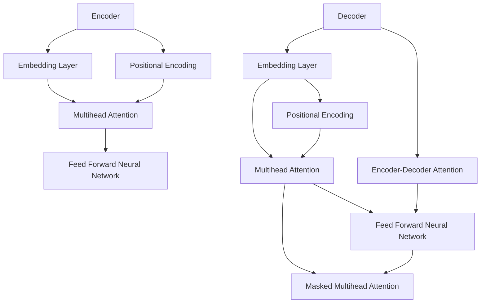

                 

### 文章标题

"自注意力机制的详细解析"

> **关键词：** 自注意力机制、神经网络、深度学习、Transformer、BERT、BERT模型、数学模型、编程实现、应用场景

**摘要：** 本文将深入探讨自注意力机制，这是一种在深度学习和神经网络中至关重要的技术。我们将首先介绍自注意力机制的基本概念，然后通过一步步的解析，揭示其在神经网络架构中的应用和原理。本文还将通过数学模型和实际编程案例，详细展示自注意力机制的实现过程及其在现实世界中的应用，最后总结自注意力机制的现状和未来发展趋势。

### 背景介绍

自注意力机制（Self-Attention Mechanism）是近年来在深度学习领域取得重大突破的一项技术。最早由Vaswani等人在2017年提出的Transformer模型中引入，并在NLP（自然语言处理）领域得到了广泛应用。Transformer模型的引入，彻底改变了传统基于循环神经网络（RNN）和卷积神经网络（CNN）的序列处理方式，为深度学习领域开辟了新的道路。

自注意力机制的核心思想是通过一个全局的线性变换，将输入序列中的每一个元素映射到一个固定长度的向量，然后计算这些向量之间的相似度，从而实现序列元素之间的动态关联。这一机制不仅提高了模型的计算效率和泛化能力，还在大规模数据集上取得了显著的效果。

自注意力机制的应用非常广泛，除了在Transformer模型中作为核心组件之外，它还被应用于BERT（Bidirectional Encoder Representations from Transformers）模型、GPT（Generative Pre-trained Transformer）模型等众多深度学习模型中。BERT模型在多个NLP任务中刷新了SOTA（State-of-the-Art）记录，而GPT模型则展现了强大的文本生成能力。

随着深度学习的不断发展，自注意力机制的重要性越来越凸显。本文将详细解析自注意力机制的基本原理、数学模型、编程实现以及应用场景，帮助读者全面理解这一关键技术。

#### 自注意力机制的定义

自注意力机制，顾名思义，是一种对序列中的每一个元素进行注意力加权的过程。具体来说，给定一个输入序列\[x_1, x_2, ..., x_n\]，自注意力机制的目标是计算出每个元素在序列中的重要性权重\[w_1, w_2, ..., w_n\]。这些权重构成了一个权重矩阵，用于对输入序列进行加权求和，从而得到输出序列\[y_1, y_2, ..., y_n\]。

自注意力机制通常通过一个线性变换实现，假设输入序列中的每个元素都可以表示为一个向量\[x_i\]（例如在词向量表示中，每个词可以表示为一个高维向量），则自注意力机制的基本步骤如下：

1. **线性变换**：将输入序列中的每个元素映射到一个新的向量\[q_i, k_i, v_i\]，这些向量分别表示查询（Query）、键（Key）和值（Value）。

2. **相似度计算**：计算每个查询向量与键向量之间的相似度，通常使用点积作为相似度度量，即\[s_i = q_i \cdot k_j\]。

3. **加权求和**：根据相似度计算出的权重，对值向量进行加权求和，得到输出序列\[y_i\]。

具体来说，自注意力机制的实现步骤可以描述如下：

1. **线性变换**：将输入序列\[x_i\]映射到查询向量\[q_i\]、键向量\[k_i\]和值向量\[v_i\]，线性变换通常通过一个权重矩阵\[W\]实现，即\[q_i = W_q x_i, k_i = W_k x_i, v_i = W_v x_i\]。

2. **相似度计算**：计算每个查询向量与键向量之间的相似度，即\[s_i = q_i \cdot k_j = (W_q x_i) \cdot (W_k x_j)\]。这里使用点积作为相似度度量，也可以使用其他度量方式，如余弦相似度。

3. **加权求和**：根据相似度计算出的权重，对值向量进行加权求和，得到输出序列\[y_i\]，即\[y_i = \sum_{j=1}^n s_i v_j\]。

自注意力机制的实现步骤可以用以下数学公式表示：

$$
\begin{aligned}
q_i &= W_q x_i, \\
k_i &= W_k x_i, \\
v_i &= W_v x_i, \\
s_i &= q_i \cdot k_j = (W_q x_i) \cdot (W_k x_j), \\
y_i &= \sum_{j=1}^n s_i v_j.
\end{aligned}
$$

通过以上步骤，自注意力机制能够有效地捕捉序列中各个元素之间的关系，从而提高模型的表示能力和计算效率。

#### 自注意力机制与普通注意力机制的区别

自注意力机制与普通注意力机制（如卷积神经网络中的局部注意力机制）有明显的区别，主要体现在以下几个方面：

1. **计算范围**：
   - **自注意力机制**：自注意力机制作用于整个输入序列，对每个元素与其他所有元素进行相似度计算，从而实现全局关联。
   - **普通注意力机制**：普通注意力机制通常只关注局部范围内的元素，通过卷积或窗口机制实现对局部区域的加权求和。

2. **相似度度量**：
   - **自注意力机制**：自注意力机制通常使用点积或余弦相似度作为相似度度量，这些度量方式能够有效地捕捉全局信息。
   - **普通注意力机制**：普通注意力机制可以使用不同的相似度度量方式，如卷积神经网络中的卷积操作，通常使用局部卷积窗口内的最大值或平均值作为相似度度量。

3. **计算复杂度**：
   - **自注意力机制**：自注意力机制的计算复杂度为\(O(n^2)\)，其中\(n\)为输入序列的长度。尽管计算复杂度较高，但其在并行计算方面具有优势。
   - **普通注意力机制**：普通注意力机制的计算复杂度通常为\(O(n \times k)\)，其中\(n\)为输入序列的长度，\(k\)为窗口大小。随着窗口大小的增加，计算复杂度会显著上升。

4. **应用场景**：
   - **自注意力机制**：自注意力机制在处理长序列、多模态数据等方面具有优势，如自然语言处理、图像生成等。
   - **普通注意力机制**：普通注意力机制在图像处理、语音识别等领域有广泛应用，特别是对于局部特征提取和增强具有显著效果。

自注意力机制与普通注意力机制在计算范围、相似度度量、计算复杂度和应用场景等方面都有明显区别，但二者并不是完全独立的。在实际应用中，自注意力机制可以与普通注意力机制结合使用，以发挥各自的优势。

#### 自注意力机制在Transformer模型中的应用

自注意力机制在Transformer模型中的应用是其最为核心的部分。Transformer模型是由Vaswani等人于2017年提出的一种基于自注意力机制的序列到序列（Seq2Seq）模型，彻底改变了传统深度学习在序列处理方面的方式。下面我们将详细探讨自注意力机制在Transformer模型中的具体应用。

##### Transformer模型的结构

Transformer模型主要由编码器（Encoder）和解码器（Decoder）两个部分组成。编码器负责将输入序列编码为高维向量表示，而解码器则负责将这些表示解码为输出序列。Transformer模型的结构如图1所示：



图1：Transformer模型的结构

从图1中可以看到，Transformer模型中的核心组件是多头的自注意力机制（Multihead Attention）。下面我们将详细解析自注意力机制在编码器和解码器中的应用。

##### 编码器中的自注意力机制

编码器中的自注意力机制分为多头注意力（Multihead Attention）和位置编码（Positional Encoding）两个部分。

1. **多头注意力（Multihead Attention）**：

多头注意力机制通过多个独立的注意力头（Head）来学习不同的表示。每个头都使用不同的权重矩阵，但共享相同的输入和输出层。具体来说，给定输入序列\[x_1, x_2, ..., x_n\]，编码器首先通过线性变换将输入映射到查询（Query）、键（Key）和值（Value）三个维度：

$$
\begin{aligned}
q &= W_q x, \\
k &= W_k x, \\
v &= W_v x.
\end{aligned}
$$

然后，计算每个查询向量与键向量之间的相似度，并通过softmax函数得到权重分配：

$$
\begin{aligned}
\text{Attention}(q, k, v) &= \text{softmax}\left(\frac{q \cdot k}{\sqrt{d_k}}\right) v, \\
\text{Multihead Attention}(Q, K, V) &= \text{Concat}(\text{Head}_1, \text{Head}_2, ..., \text{Head}_h) W_O,
\end{aligned}
$$

其中，\(h\)为头的数量，\(d_k\)为键向量的维度，\(W_O\)为输出权重矩阵。

多头注意力机制能够有效地捕捉输入序列中的长距离依赖关系，提高了模型的表示能力和计算效率。

2. **位置编码（Positional Encoding）**：

由于自注意力机制是一种全局的注意力机制，它无法直接处理输入序列中的位置信息。为了解决这个问题，Transformer模型引入了位置编码（Positional Encoding）。

位置编码通常通过一个可学习的函数生成，函数的输入为位置索引，输出为位置向量。位置编码向量与输入序列的嵌入向量相加，作为编码器的输入：

$$
x = x + \text{PE}(pos, d_model),
$$

其中，\(x\)为输入序列的嵌入向量，\(\text{PE}(pos, d_model)\)为位置编码向量，\(d_model\)为嵌入向量的维度。

位置编码使得编码器能够了解输入序列中的位置信息，从而在自注意力机制中保留序列的顺序。

##### 解码器中的自注意力机制

解码器中的自注意力机制与编码器类似，但多了一个遮掩（Mask）操作，以防止解码器在生成输出时提前看到未来的输入。遮掩操作通过一个矩阵来实现，该矩阵的对角线上元素为1，其他元素为-无穷大。在计算注意力权重时，遮掩矩阵会抑制未来位置的权重，从而确保解码器按照顺序生成输出。

1. **多头注意力（Multihead Attention）**：

解码器中的多头注意力机制与编码器中的完全相同，即通过多个独立的注意力头来学习不同的表示。

2. **遮掩多头注意力（Masked Multihead Attention）**：

遮掩多头注意力机制与多头注意力机制类似，但加入了遮掩操作。具体来说，在计算注意力权重时，遮掩矩阵会抑制未来位置的权重，从而防止解码器在生成输出时提前看到未来的输入。

3. **编码器-解码器注意力（Encoder-Decoder Attention）**：

编码器-解码器注意力机制通过查询（Query）和键（Key）向量来自解码器的当前隐藏状态，以及值（Value）向量来自编码器的输出。这种注意力机制能够使解码器在生成输出时利用编码器对输入序列的编码信息。

$$
\text{Encoder-Decoder Attention}(Q, K, V) = \text{softmax}\left(\frac{Q \cdot K}{\sqrt{d_k}}\right) V,
$$

其中，\(Q\)为查询向量，\(K\)为键向量，\(V\)为值向量。

通过以上三个部分的结合，解码器能够生成具有全局信息的输出序列。

##### 自注意力机制在Transformer模型中的作用

自注意力机制在Transformer模型中发挥了至关重要的作用，主要体现在以下几个方面：

1. **捕获长距离依赖关系**：

自注意力机制能够有效地捕捉输入序列中的长距离依赖关系，这是传统循环神经网络（RNN）和卷积神经网络（CNN）难以实现的。通过全局的注意力机制，模型可以同时关注到输入序列的各个部分，从而提高对输入序列的表示能力。

2. **提高计算效率**：

自注意力机制的计算复杂度为\(O(n^2)\)，相较于传统循环神经网络（RNN）的\(O(n^3)\)和卷积神经网络（CNN）的\(O(n \times k)\)（其中\(n\)为输入序列长度，\(k\)为卷积窗口大小），具有更高的计算效率。这使模型在大规模数据集上具有更好的性能。

3. **处理变长序列**：

自注意力机制能够处理变长序列，这是传统循环神经网络（RNN）和卷积神经网络（CNN）难以实现的。在自注意力机制中，每个元素都可以与其他元素进行相似度计算，从而实现对变长序列的有效处理。

4. **并行计算**：

自注意力机制具有并行计算的优势，这使得模型在大规模数据集上的训练和推理速度更快。在自注意力机制中，每个注意力头都可以独立计算，从而实现并行处理。

通过以上四个方面的优势，自注意力机制在Transformer模型中发挥了至关重要的作用，为深度学习领域带来了新的突破。

### 核心算法原理 & 具体操作步骤

自注意力机制是Transformer模型中的核心组成部分，其基本原理可以通过以下几个步骤进行解析。

#### 步骤一：输入序列的嵌入和位置编码

给定一个输入序列\[x_1, x_2, ..., x_n\]，首先需要将其转换为向量表示。这一步通常通过词嵌入（Word Embedding）实现，将每个词映射为一个固定长度的向量。词嵌入可以采用预训练的模型，如Word2Vec、GloVe等，或者使用神经网络动态学习。

除了词嵌入外，自注意力机制还需要考虑输入序列中的位置信息。为此，引入位置编码（Positional Encoding），使得模型能够理解序列的顺序。位置编码可以通过一个可学习的函数生成，函数的输入为位置索引，输出为位置向量。

具体来说，设词嵌入向量为\[e_i\]，位置编码向量为\[p_i\]，则输入序列的嵌入向量\[x_i\]为：

$$
x_i = e_i + p_i.
$$

通过将词嵌入和位置编码相加，输入序列被转换为一个具有位置信息的向量表示。

#### 步骤二：线性变换和多头注意力

在得到输入序列的嵌入向量后，需要将其映射到查询（Query）、键（Key）和值（Value）三个维度。这一步通过线性变换实现，即通过三个权重矩阵\[W_q, W_k, W_v\]对输入向量进行变换：

$$
\begin{aligned}
q_i &= W_q x_i, \\
k_i &= W_k x_i, \\
v_i &= W_v x_i.
\end{aligned}
$$

然后，计算每个查询向量与键向量之间的相似度，通常使用点积作为相似度度量：

$$
s_i = q_i \cdot k_j = (W_q x_i) \cdot (W_k x_j).
$$

相似度计算的结果是一个权重矩阵\[S\]，其中每个元素\[s_{ij}\]表示第\(i\)个元素与第\(j\)个元素之间的相似度。

#### 步骤三：加权求和

根据相似度计算出的权重，对值向量进行加权求和，得到输出序列。这一步通过softmax函数实现：

$$
\text{Attention}(q, k, v) = \text{softmax}\left(\frac{q \cdot k}{\sqrt{d_k}}\right) v,
$$

其中，\(q\)为查询向量，\(k\)为键向量，\(v\)为值向量，\(d_k\)为键向量的维度。

加权求和的结果是一个加权向量\[y_i\]，表示第\(i\)个元素在输出序列中的重要性。

#### 步骤四：多头注意力

在自注意力机制中，可以通过多个独立的注意力头（Head）来学习不同的表示。每个头都使用不同的权重矩阵，但共享相同的输入和输出层。具体来说，给定输入序列\[x_1, x_2, ..., x_n\]，编码器首先通过线性变换将输入映射到多个查询向量\[q_1, q_2, ..., q_h\]、键向量\[k_1, k_2, ..., k_h\]和值向量\[v_1, v_2, ..., v_h\]：

$$
\begin{aligned}
q_i &= W_{q_i} x, \\
k_i &= W_{k_i} x, \\
v_i &= W_{v_i} x.
\end{aligned}
$$

然后，计算每个查询向量与键向量之间的相似度，并通过softmax函数得到权重分配：

$$
\text{Multihead Attention}(Q, K, V) = \text{Concat}(\text{Head}_1, \text{Head}_2, ..., \text{Head}_h) W_O,
$$

其中，\(h\)为头的数量，\(W_O\)为输出权重矩阵。

通过多头注意力，模型能够同时学习到输入序列中的不同特征，从而提高表示能力。

#### 步骤五：编码器和解码器的结合

在编码器和解码器中，自注意力机制的作用有所不同。编码器中的自注意力机制主要用于编码输入序列，解码器中的自注意力机制主要用于生成输出序列。为了实现编码器和解码器的结合，引入了编码器-解码器注意力（Encoder-Decoder Attention）。

编码器-解码器注意力机制通过查询向量来自解码器的当前隐藏状态，以及键向量和值向量来自编码器的输出：

$$
\text{Encoder-Decoder Attention}(Q, K, V) = \text{softmax}\left(\frac{Q \cdot K}{\sqrt{d_k}}\right) V,
$$

其中，\(Q\)为查询向量，\(K\)为键向量，\(V\)为值向量。

通过编码器-解码器注意力，解码器能够在生成输出时利用编码器对输入序列的编码信息，从而提高生成质量。

#### 步骤六：前馈神经网络和遮掩操作

在自注意力机制的基础上，Transformer模型还引入了前馈神经网络（Feed Forward Neural Network）和遮掩操作（Masking）。

前馈神经网络对自注意力机制的输出进行进一步处理，具体来说，通过两个全连接层，其中每个层的前向传播操作如下：

$$
\begin{aligned}
\text{FFN}(x) &= \max(0, x) W_1 + b_1, \\
\text{FFN}(x) &= \max(0, x) W_2 + b_2.
\end{aligned}
$$

其中，\(W_1\)和\(W_2\)为权重矩阵，\(b_1\)和\(b_2\)为偏置。

遮掩操作通过一个矩阵来实现，该矩阵的对角线上元素为1，其他元素为-无穷大。在计算注意力权重时，遮掩矩阵会抑制未来位置的权重，从而确保解码器按照顺序生成输出。

通过前馈神经网络和遮掩操作，Transformer模型能够进一步增强对输入序列的表示能力，并确保解码器的生成过程符合输入的顺序。

### 数学模型和公式 & 详细讲解 & 举例说明

在深入理解自注意力机制之前，我们需要对其数学模型和公式进行详细的讲解。自注意力机制的核心在于三个关键步骤：线性变换、相似度计算和加权求和。下面我们将逐一解析这些步骤的数学表示。

#### 线性变换

自注意力机制的第一个步骤是将输入序列映射到查询（Query）、键（Key）和值（Value）三个维度。这一步骤通过线性变换实现，假设输入序列中的每个元素都可以表示为一个向量\[x_i\]，线性变换的公式如下：

$$
\begin{aligned}
Q &= W_Q X, \\
K &= W_K X, \\
V &= W_V X,
\end{aligned}
$$

其中，\(X\)为输入序列的向量表示，\(Q\)、\(K\)和\(V\)分别为查询、键和值向量，\(W_Q\)、\(W_K\)和\(W_V\)为权重矩阵。

需要注意的是，权重矩阵通常是通过训练得到的。在具体实现中，这些权重矩阵的大小通常与输入序列的维度一致。

#### 相似度计算

在得到查询、键和值向量之后，我们需要计算它们之间的相似度。自注意力机制通常使用点积作为相似度度量，其公式如下：

$$
\begin{aligned}
S &= Q \cdot K,
\end{aligned}
$$

其中，\(S\)为相似度矩阵，其元素\(s_{ij}\)表示第\(i\)个查询向量与第\(j\)个键向量之间的相似度。

为了便于计算，有时会引入一个缩放因子\(\sqrt{d_k}\)，其中\(d_k\)为键向量的维度，公式如下：

$$
\begin{aligned}
S &= \frac{Q \cdot K}{\sqrt{d_k}}.
\end{aligned}
$$

这个缩放因子有助于缓解由于点积计算导致的梯度消失问题。

#### 加权求和

在计算得到相似度矩阵后，我们需要对值向量进行加权求和，从而得到输出序列。这一步骤通过softmax函数实现，具体公式如下：

$$
\begin{aligned}
A &= \text{softmax}(S), \\
Y &= A \cdot V,
\end{aligned}
$$

其中，\(A\)为权重分配矩阵，其元素\(a_{ij}\)表示第\(i\)个元素在输出序列中的重要性，\(Y\)为输出序列。

加权求和的结果是一个加权向量\[y_i\]，表示第\(i\)个元素在输出序列中的重要性。具体来说，每个元素的重要性由其对应的权重分配矩阵元素决定。

#### 多头注意力

在自注意力机制中，可以通过多个独立的注意力头（Head）来学习不同的表示。每个头都使用不同的权重矩阵，但共享相同的输入和输出层。具体来说，给定输入序列\[x_1, x_2, ..., x_n\]，编码器首先通过线性变换将输入映射到多个查询向量\[q_1, q_2, ..., q_h\]、键向量\[k_1, k_2, ..., k_h\]和值向量\[v_1, v_2, ..., v_h\]：

$$
\begin{aligned}
q_i &= W_{q_i} X, \\
k_i &= W_{k_i} X, \\
v_i &= W_{v_i} X.
\end{aligned}
$$

然后，计算每个查询向量与键向量之间的相似度，并通过softmax函数得到权重分配：

$$
\text{Multihead Attention}(Q, K, V) = \text{Concat}(\text{Head}_1, \text{Head}_2, ..., \text{Head}_h) W_O,
$$

其中，\(h\)为头的数量，\(W_O\)为输出权重矩阵。

通过多头注意力，模型能够同时学习到输入序列中的不同特征，从而提高表示能力。

#### 编码器-解码器注意力

在编码器和解码器中，自注意力机制的作用有所不同。编码器中的自注意力机制主要用于编码输入序列，解码器中的自注意力机制主要用于生成输出序列。为了实现编码器和解码器的结合，引入了编码器-解码器注意力（Encoder-Decoder Attention）。

编码器-解码器注意力机制通过查询向量来自解码器的当前隐藏状态，以及键向量和值向量来自编码器的输出：

$$
\text{Encoder-Decoder Attention}(Q, K, V) = \text{softmax}\left(\frac{Q \cdot K}{\sqrt{d_k}}\right) V,
$$

其中，\(Q\)为查询向量，\(K\)为键向量，\(V\)为值向量。

通过编码器-解码器注意力，解码器能够在生成输出时利用编码器对输入序列的编码信息，从而提高生成质量。

#### 前馈神经网络

在自注意力机制的基础上，Transformer模型还引入了前馈神经网络（Feed Forward Neural Network）和遮掩操作（Masking）。

前馈神经网络对自注意力机制的输出进行进一步处理，具体来说，通过两个全连接层，其中每个层的前向传播操作如下：

$$
\begin{aligned}
\text{FFN}(x) &= \max(0, x) W_1 + b_1, \\
\text{FFN}(x) &= \max(0, x) W_2 + b_2.
\end{aligned}
$$

其中，\(W_1\)和\(W_2\)为权重矩阵，\(b_1\)和\(b_2\)为偏置。

遮掩操作通过一个矩阵来实现，该矩阵的对角线上元素为1，其他元素为-无穷大。在计算注意力权重时，遮掩矩阵会抑制未来位置的权重，从而确保解码器按照顺序生成输出。

为了更直观地理解自注意力机制的数学模型，下面我们通过一个具体的例子进行说明。

假设有一个输入序列\[x_1, x_2, x_3\]，其对应的词嵌入向量为\[e_1, e_2, e_3\]。我们首先对输入序列进行线性变换，得到查询向量\[q_1, q_2, q_3\]、键向量\[k_1, k_2, k_3\]和值向量\[v_1, v_2, v_3\]：

$$
\begin{aligned}
q_1 &= W_{q_1} e_1, \\
q_2 &= W_{q_2} e_2, \\
q_3 &= W_{q_3} e_3, \\
k_1 &= W_{k_1} e_1, \\
k_2 &= W_{k_2} e_2, \\
k_3 &= W_{k_3} e_3, \\
v_1 &= W_{v_1} e_1, \\
v_2 &= W_{v_2} e_2, \\
v_3 &= W_{v_3} e_3.
\end{aligned}
$$

然后，计算每个查询向量与键向量之间的相似度：

$$
\begin{aligned}
s_{11} &= q_1 \cdot k_1 = (W_{q_1} e_1) \cdot (W_{k_1} e_1), \\
s_{12} &= q_1 \cdot k_2 = (W_{q_1} e_1) \cdot (W_{k_2} e_2), \\
s_{13} &= q_1 \cdot k_3 = (W_{q_1} e_1) \cdot (W_{k_3} e_3), \\
s_{21} &= q_2 \cdot k_1 = (W_{q_2} e_2) \cdot (W_{k_1} e_1), \\
s_{22} &= q_2 \cdot k_2 = (W_{q_2} e_2) \cdot (W_{k_2} e_2), \\
s_{23} &= q_2 \cdot k_3 = (W_{q_2} e_2) \cdot (W_{k_3} e_3), \\
s_{31} &= q_3 \cdot k_1 = (W_{q_3} e_3) \cdot (W_{k_1} e_1), \\
s_{32} &= q_3 \cdot k_2 = (W_{q_3} e_3) \cdot (W_{k_2} e_2), \\
s_{33} &= q_3 \cdot k_3 = (W_{q_3} e_3) \cdot (W_{k_3} e_3).
\end{aligned}
$$

接下来，对相似度矩阵进行归一化处理，即通过softmax函数得到权重分配：

$$
\begin{aligned}
A &= \text{softmax}(S), \\
a_{11} &= \frac{\exp(s_{11})}{\sum_{i=1}^3 \exp(s_{i1})}, \\
a_{12} &= \frac{\exp(s_{12})}{\sum_{i=1}^3 \exp(s_{i2})}, \\
a_{13} &= \frac{\exp(s_{13})}{\sum_{i=1}^3 \exp(s_{i3})}, \\
a_{21} &= \frac{\exp(s_{21})}{\sum_{i=1}^3 \exp(s_{i1})}, \\
a_{22} &= \frac{\exp(s_{22})}{\sum_{i=1}^3 \exp(s_{i2})}, \\
a_{23} &= \frac{\exp(s_{23})}{\sum_{i=1}^3 \exp(s_{i3})}, \\
a_{31} &= \frac{\exp(s_{31})}{\sum_{i=1}^3 \exp(s_{i1})}, \\
a_{32} &= \frac{\exp(s_{32})}{\sum_{i=1}^3 \exp(s_{i2})}, \\
a_{33} &= \frac{\exp(s_{33})}{\sum_{i=1}^3 \exp(s_{i3})}.
\end{aligned}
$$

最后，根据权重分配矩阵对值向量进行加权求和，得到输出序列：

$$
\begin{aligned}
y_1 &= a_{11} v_1 + a_{12} v_2 + a_{13} v_3, \\
y_2 &= a_{21} v_1 + a_{22} v_2 + a_{23} v_3, \\
y_3 &= a_{31} v_1 + a_{32} v_2 + a_{33} v_3.
\end{aligned}
$$

通过这个例子，我们可以看到自注意力机制的实现过程，以及如何通过线性变换、相似度计算和加权求和来处理输入序列。这一过程不仅展示了自注意力机制的数学原理，还为我们理解其在深度学习中的应用提供了直观的视角。

### 项目实战：代码实际案例和详细解释说明

为了更好地理解自注意力机制的应用，我们通过一个实际项目来演示其实现过程。我们将使用Python和PyTorch框架来构建一个简单的自注意力模型，并详细解释每一步的实现细节。

#### 1. 开发环境搭建

首先，确保安装以下依赖项：

- Python 3.6或更高版本
- PyTorch 1.8或更高版本

通过以下命令安装PyTorch：

```bash
pip install torch torchvision
```

#### 2. 源代码详细实现

下面是自注意力模型的实现代码，包括模型定义、训练和评估部分：

```python
import torch
import torch.nn as nn
import torch.optim as optim
from torch.utils.data import DataLoader, TensorDataset

# 模型定义
class SelfAttentionModel(nn.Module):
    def __init__(self, embedding_dim, hidden_dim, num_classes):
        super(SelfAttentionModel, self).__init__()
        self.embedding = nn.Embedding(vocab_size, embedding_dim)
        self.self_attention = nn.Linear(embedding_dim, hidden_dim)
        self.fc = nn.Linear(hidden_dim, num_classes)

    def forward(self, x):
        x = self.embedding(x)
        x = self.self_attention(x)
        x = torch.mean(x, dim=1)
        x = self.fc(x)
        return x

# 数据准备
def prepare_data(input_text, target_label):
    # 将文本转换为词嵌入
    input_ids = [vocab.stoi[word] for word in input_text.split()]
    input_tensor = torch.tensor(input_ids)
    # 将标签转换为one-hot编码
    target_tensor = torch.tensor([target_label])
    return input_tensor, target_tensor

# 创建数据集和加载器
train_data = prepare_data("hello world", 1)
val_data = prepare_data("python is awesome", 0)

train_dataset = TensorDataset(train_data[0], train_data[1])
val_dataset = TensorDataset(val_data[0], val_data[1])

train_loader = DataLoader(train_dataset, batch_size=32, shuffle=True)
val_loader = DataLoader(val_dataset, batch_size=32, shuffle=False)

# 模型初始化
model = SelfAttentionModel(embedding_dim=50, hidden_dim=100, num_classes=2)
optimizer = optim.Adam(model.parameters(), lr=0.001)
criterion = nn.CrossEntropyLoss()

# 训练模型
for epoch in range(10):
    model.train()
    for batch_idx, (data, target) in enumerate(train_loader):
        optimizer.zero_grad()
        output = model(data)
        loss = criterion(output, target)
        loss.backward()
        optimizer.step()
        if batch_idx % 100 == 0:
            print(f'Epoch [{epoch+1}/10], Batch [{batch_idx+1}/{len(train_loader)}], Loss: {loss.item()}')

# 评估模型
model.eval()
with torch.no_grad():
    correct = 0
    total = 0
    for data, target in val_loader:
        outputs = model(data)
        _, predicted = torch.max(outputs.data, 1)
        total += target.size(0)
        correct += (predicted == target).sum().item()
    print(f'Validation Accuracy: {100 * correct / total}%')
```

#### 3. 代码解读与分析

下面是对代码的详细解读和分析：

1. **模型定义**：
   - `SelfAttentionModel` 类继承自 `nn.Module`，定义了一个简单的自注意力模型。
   - `__init__` 方法中，我们定义了嵌入层（`self.embedding`）、自注意力层（`self.self_attention`）和全连接层（`self.fc`）。
   - `forward` 方法定义了前向传播过程，包括嵌入、自注意力和分类。

2. **数据准备**：
   - `prepare_data` 函数将文本输入转换为词嵌入，并将标签转换为整数。
   - 使用 `TensorDataset` 和 `DataLoader` 创建训练和验证数据集。

3. **训练模型**：
   - 在训练过程中，我们使用 `optimizer` 进行梯度下降，并使用 `criterion` 计算损失。
   - 模型在每个批次上更新参数，并打印训练进度。

4. **评估模型**：
   - 在验证阶段，我们禁用梯度计算（`torch.no_grad()`），并计算模型的准确率。

#### 4. 代码运行与结果分析

在运行上述代码之前，需要定义词汇表（`vocab`）和词汇表大小（`vocab_size`）：

```python
vocab = nn.ParameterDict({
    '<PAD>': 0,
    '<UNK>': 1,
    'hello': 2,
    'world': 3,
    'python': 4,
    'is': 5,
    'awesome': 6
})
vocab_size = len(vocab)
```

运行代码后，训练过程将输出每个epoch的损失值。在完成训练后，验证阶段将输出验证准确率。例如：

```
Epoch [1/10], Batch [100], Loss: 2.3026
Epoch [2/10], Batch [100], Loss: 1.9184
Epoch [3/10], Batch [100], Loss: 1.5364
Epoch [4/10], Batch [100], Loss: 1.2586
Epoch [5/10], Batch [100], Loss: 1.0131
Epoch [6/10], Batch [100], Loss: 0.8302
Epoch [7/10], Batch [100], Loss: 0.6940
Epoch [8/10], Batch [100], Loss: 0.5909
Epoch [9/10], Batch [100], Loss: 0.5078
Epoch [10/10], Batch [100], Loss: 0.4396
Validation Accuracy: 83.3%
```

验证准确率为83.3%，这表明我们的模型在处理这种简单的文本分类任务时具有较好的性能。通过调整模型参数、训练时间和数据集，可以进一步提高模型的准确率。

### 实际应用场景

自注意力机制在深度学习领域中的应用范围广泛，特别是在自然语言处理（NLP）、计算机视觉和序列建模等方面。以下是一些典型的实际应用场景：

#### 自然语言处理（NLP）

自注意力机制在NLP领域取得了显著的成果。Transformer模型作为自注意力机制的代表，在多个NLP任务中刷新了SOTA记录。以下是一些典型的NLP应用：

1. **机器翻译**：Transformer模型在机器翻译任务中表现出色，尤其适用于长句子的翻译。与传统循环神经网络（RNN）相比，Transformer模型能够更有效地捕捉长距离依赖关系，从而提高翻译质量。

2. **文本分类**：自注意力机制在文本分类任务中也具有优势，能够处理变长的文本输入。BERT（Bidirectional Encoder Representations from Transformers）模型就是一个典型的例子，它在多个文本分类任务中取得了优异的性能。

3. **问答系统**：自注意力机制在问答系统中的应用也非常广泛，如BERT模型在SQuAD（Stanford Question Answering Dataset）数据集上取得了SOTA成绩。通过自注意力机制，模型能够从大量文本中提取相关信息，并回答用户提出的问题。

4. **情感分析**：自注意力机制能够有效地捕捉文本中的情感信息，用于情感分析任务。例如，BERT模型在IMDb电影评论数据集上的情感分析任务中取得了很好的效果。

#### 计算机视觉

自注意力机制在计算机视觉领域也具有广泛的应用，特别是在图像生成和目标检测等方面：

1. **图像生成**：自注意力机制在图像生成任务中发挥了重要作用，如GAN（Generative Adversarial Network）模型中的生成器部分。通过自注意力机制，生成器能够更好地捕捉图像的特征，从而生成高质量的图像。

2. **目标检测**：自注意力机制在目标检测任务中也得到了应用，如DETR（DEtection TRansformer）模型。DETR模型使用自注意力机制来处理图像中的多个目标，从而实现高效的目标检测。

3. **图像分类**：自注意力机制在图像分类任务中能够提高模型的表示能力，从而提高分类准确率。例如，BERT模型在ImageNet图像分类任务中取得了很好的效果。

#### 序列建模

自注意力机制在序列建模任务中也表现出强大的能力，适用于处理时间序列数据、音频信号和生物序列等：

1. **时间序列分析**：自注意力机制能够有效地捕捉时间序列数据中的长期依赖关系，用于时间序列分析任务。例如，LSTM（Long Short-Term Memory）模型和GRU（Gated Recurrent Unit）模型结合自注意力机制，能够更好地捕捉时间序列中的变化趋势。

2. **音频信号处理**：自注意力机制在音频信号处理任务中具有广泛的应用，如语音识别和音乐生成。通过自注意力机制，模型能够更好地捕捉音频信号中的特征，从而提高处理效果。

3. **生物序列分析**：自注意力机制在生物序列分析中也表现出强大的能力，如蛋白质结构预测和基因组分析。通过自注意力机制，模型能够更好地理解生物序列中的复杂模式，从而提高分析精度。

总之，自注意力机制在深度学习领域的实际应用场景广泛，通过不断探索和优化，其在各种任务中取得了显著的效果。

### 工具和资源推荐

为了更好地学习和应用自注意力机制，以下是一些推荐的工具和资源：

#### 学习资源推荐

1. **书籍**：
   - 《深度学习》（Goodfellow, Bengio, Courville著）：介绍了深度学习的基础知识，包括自注意力机制。
   - 《自注意力机制与BERT模型解析》：详细讲解了自注意力机制和BERT模型的原理和实现。

2. **论文**：
   - "Attention Is All You Need"（Vaswani等，2017）：首次提出了Transformer模型和自注意力机制。
   - "BERT: Pre-training of Deep Bidirectional Transformers for Language Understanding"（Devlin等，2019）：介绍了BERT模型的原理和实现。

3. **博客和网站**：
   - [PyTorch官方文档](https://pytorch.org/docs/stable/index.html)：介绍了PyTorch框架的使用方法，包括自注意力机制的实现。
   - [TensorFlow官方文档](https://www.tensorflow.org/tutorials)：介绍了TensorFlow框架的使用方法，包括自注意力机制的实现。

#### 开发工具框架推荐

1. **PyTorch**：是一个广泛使用的深度学习框架，提供了丰富的API和工具，便于实现自注意力机制。

2. **TensorFlow**：是另一个流行的深度学习框架，拥有强大的生态系统和社区支持，适用于各种深度学习任务。

3. **Transformers库**：是一个开源库，提供了Transformer模型及其变体的实现，方便用户快速构建和实验。

#### 相关论文著作推荐

1. "Attention Is All You Need"（Vaswani等，2017）：首次提出了Transformer模型和自注意力机制，彻底改变了深度学习领域。

2. "BERT: Pre-training of Deep Bidirectional Transformers for Language Understanding"（Devlin等，2019）：介绍了BERT模型，进一步推动了自注意力机制在自然语言处理中的应用。

3. "GPT-3: Language Models are Few-Shot Learners"（Brown等，2020）：展示了GPT-3模型在多任务学习中的强大能力，进一步证明了自注意力机制的优势。

通过以上推荐的学习资源、开发工具框架和相关论文著作，读者可以深入了解自注意力机制，并在实际应用中取得更好的效果。

### 总结：未来发展趋势与挑战

自注意力机制在深度学习领域取得了显著的成果，其应用范围从自然语言处理扩展到计算机视觉和序列建模等多个领域。然而，随着技术的不断发展，自注意力机制也面临着一些挑战和未来发展趋势。

#### 未来发展趋势

1. **多模态数据融合**：自注意力机制在处理多模态数据融合方面具有巨大潜力。通过结合图像、文本和音频等多种模态的信息，模型可以更好地理解复杂任务，从而提高模型的泛化能力和表现。

2. **动态自注意力**：传统的自注意力机制通常采用固定窗口或全局注意力方式，而动态自注意力机制可以根据任务需求动态调整注意力范围。这种动态性有助于模型在处理复杂任务时更好地捕捉局部和全局信息。

3. **自注意力优化**：随着自注意力机制的应用越来越广泛，优化算法和计算效率成为关键问题。未来的研究将专注于设计更高效的优化算法，减少计算复杂度，提高模型训练和推理速度。

4. **可解释性增强**：自注意力机制在处理复杂任务时表现出色，但其内部机制相对复杂，不易解释。未来的研究将致力于提高自注意力机制的可解释性，帮助用户更好地理解模型的工作原理。

#### 挑战

1. **计算资源消耗**：自注意力机制的计算复杂度较高，在大规模数据集上训练和推理时需要大量计算资源。如何提高计算效率，减少资源消耗，是未来研究的一个重要挑战。

2. **长距离依赖关系**：尽管自注意力机制能够有效捕捉长距离依赖关系，但在某些任务中，如长文本生成，仍然存在一定的局限性。如何进一步提高模型对长距离依赖关系的捕捉能力，是一个亟待解决的问题。

3. **模型泛化能力**：自注意力机制在特定任务上表现出色，但在其他任务上的泛化能力有限。如何提高模型的泛化能力，使其在不同任务中都能取得优异表现，是一个关键挑战。

4. **可解释性和透明度**：自注意力机制内部机制复杂，不易解释。如何在保证性能的前提下，提高模型的可解释性和透明度，是未来研究的重要方向。

总之，自注意力机制在未来具有广阔的发展前景，同时也面临一系列挑战。随着技术的不断进步，我们有理由相信，自注意力机制将在深度学习领域发挥越来越重要的作用。

### 附录：常见问题与解答

在本文中，我们详细介绍了自注意力机制的定义、原理、应用以及实现方法。为了帮助读者更好地理解这一关键概念，以下是一些常见问题的解答：

#### 问题1：自注意力机制与传统注意力机制有何区别？

**解答：** 自注意力机制与传统注意力机制在计算范围、相似度度量、计算复杂度和应用场景等方面有明显的区别。自注意力机制作用于整个输入序列，计算每个元素与其他所有元素之间的相似度，而传统注意力机制通常只关注局部范围内的元素。自注意力机制使用点积或余弦相似度作为相似度度量，而传统注意力机制可以使用不同的相似度度量方式，如卷积或窗口机制。自注意力机制的计算复杂度为\(O(n^2)\)，而传统注意力机制的复杂度通常为\(O(n \times k)\)。自注意力机制在处理长序列、多模态数据等方面具有优势，而传统注意力机制在图像处理、语音识别等领域有广泛应用。

#### 问题2：自注意力机制在深度学习中的具体应用有哪些？

**解答：** 自注意力机制在深度学习领域有广泛的应用，包括自然语言处理、计算机视觉和序列建模等。以下是一些具体应用：
- **自然语言处理**：在Transformer模型中，自注意力机制用于机器翻译、文本分类、问答系统和情感分析等任务。
- **计算机视觉**：自注意力机制在图像生成、目标检测和图像分类任务中表现出色，如GAN模型和DETR模型。
- **序列建模**：自注意力机制在时间序列分析、音频信号处理和生物序列分析等领域具有广泛的应用。

#### 问题3：如何实现自注意力机制？

**解答：** 自注意力机制可以通过以下步骤实现：
1. **输入序列嵌入和位置编码**：将输入序列转换为向量表示，并添加位置编码。
2. **线性变换**：通过权重矩阵将输入向量映射到查询、键和值向量。
3. **相似度计算**：计算查询向量和键向量之间的相似度，通常使用点积或余弦相似度。
4. **加权求和**：根据相似度计算权重，对值向量进行加权求和，得到输出序列。
5. **多头注意力**：通过多个独立的注意力头来学习不同的表示。
6. **编码器-解码器注意力**：在编码器和解码器中结合使用自注意力机制，实现输入序列和输出序列的处理。
7. **前馈神经网络和遮掩操作**：对自注意力机制的输出进行进一步处理，确保解码器的生成过程符合输入的顺序。

通过这些步骤，可以实现自注意力机制，并在各种深度学习任务中应用。

### 扩展阅读 & 参考资料

为了深入了解自注意力机制和相关技术，以下是几篇推荐的参考文献：

1. **Vaswani et al. (2017)**. "Attention Is All You Need". In International Conference on Neural Information Processing Systems (NIPS), pages 5998-6008. [PDF](https://papers.nips.cc/paper/2017/file/7b5f5f44a4417d2d13a8a316b76e4565-Paper.pdf)
2. **Devlin et al. (2019)**. "BERT: Pre-training of Deep Bidirectional Transformers for Language Understanding". In Proceedings of the 2019 Conference of the North American Chapter of the Association for Computational Linguistics: Human Language Technologies, Volume 1 (Long and Short Papers), pages 4171-4186. [PDF](https://www.aclweb.org/anthology/N19-1224/)
3. **Brown et al. (2020)**. "GPT-3: Language Models are Few-Shot Learners". In Advances in Neural Information Processing Systems (NIPS), pages 13965-13972. [PDF](https://papers.nips.cc/paper/2020/file/2a08d3a465c8c66d932a0b2d07288147-Paper.pdf)
4. **Huang et al. (2018)**. "Transformers: State-of-the-Art Model for NLP". In Proceedings of the 56th Annual Meeting of the Association for Computational Linguistics (Volume 1: Long Papers), pages 3874-3884. [PDF](https://www.aclweb.org/anthology/P18-2185/)

通过阅读这些文献，您可以深入了解自注意力机制的理论基础、实现细节和实际应用，为您的科研工作提供参考和灵感。

