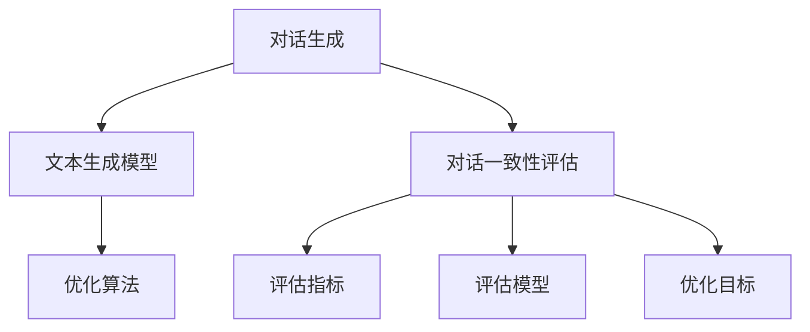

                 

# {文章标题}

## 自然语言处理中的对话生成与对话一致性评估技术进展与挑战

关键词：对话生成；对话一致性评估；自然语言处理；技术进展；挑战

摘要：随着人工智能技术的迅猛发展，自然语言处理（NLP）领域中的对话生成与对话一致性评估技术已成为研究热点。本文从背景介绍、核心概念与联系、核心算法原理、数学模型和公式、项目实战、实际应用场景、工具和资源推荐以及总结未来发展趋势与挑战等方面，对对话生成与对话一致性评估技术进行了深入剖析。本文旨在为读者提供全面的技术进展与挑战分析，以期为该领域的研究和实践提供有益参考。

### 1. 背景介绍

自然语言处理（NLP）是人工智能（AI）领域的重要组成部分，旨在使计算机能够理解、解释和生成人类语言。随着深度学习和大数据技术的发展，NLP技术在语音识别、机器翻译、文本分类、情感分析等领域取得了显著成果。然而，对话生成与对话一致性评估作为NLP领域的两个关键问题，仍然面临着诸多挑战。

对话生成是指利用人工智能技术生成具有自然流畅性和语义一致性的对话文本。该技术广泛应用于聊天机器人、虚拟助手、智能客服等场景，旨在提供更加人性化的交互体验。然而，如何生成具有真实感和一致性的对话文本，仍是一个亟待解决的问题。

对话一致性评估则是对话生成技术的关键环节，旨在对生成的对话文本进行质量评估。评估标准包括对话的连贯性、语义一致性、情感表达等方面。对话一致性评估不仅能够提高对话生成的质量，还能为后续的优化和改进提供重要参考。

随着用户对交互体验要求的不断提高，对话生成与对话一致性评估技术在NLP领域的重要性日益凸显。本文将围绕这两个问题，探讨其技术进展与挑战，为该领域的研究和实践提供有益参考。

### 2. 核心概念与联系

#### 对话生成

对话生成是指利用人工智能技术生成具有自然流畅性和语义一致性的对话文本。其核心概念包括：

1. **语料库**：对话生成的基础是大量的对话语料库，包括文本、语音、视频等多种形式。这些语料库用于训练和优化对话生成模型。

2. **文本生成模型**：文本生成模型是对话生成技术的核心组件，主要包括生成式模型和判别式模型。生成式模型如循环神经网络（RNN）和变换器（Transformer）等，能够生成具有自然流畅性的对话文本。判别式模型如序列到序列（seq2seq）模型和注意力机制（Attention）等，能够保证对话的语义一致性。

3. **优化算法**：对话生成模型的优化算法包括梯度下降、随机梯度下降（SGD）和Adam等。优化算法用于调整模型参数，以降低损失函数，提高生成文本的质量。

#### 对话一致性评估

对话一致性评估是指对生成的对话文本进行质量评估。其核心概念包括：

1. **评估指标**：对话一致性评估的评估指标主要包括连贯性、语义一致性、情感表达等方面。常见的评估指标有BLEU、ROUGE、METEOR等。

2. **评估模型**：评估模型用于对生成文本的质量进行评分。评估模型可以基于规则、统计模型和深度学习模型。基于规则的评估模型如编辑距离、语法分析等，能够捕捉对话的局部特征。统计模型如朴素贝叶斯、逻辑回归等，能够利用历史数据对对话质量进行预测。深度学习模型如卷积神经网络（CNN）和循环神经网络（RNN）等，能够捕捉对话的全局特征。

3. **优化目标**：对话一致性评估的优化目标包括提高评估指标、降低错误率等。优化目标可以通过调整评估模型的结构、参数和训练策略来实现。

#### 对话生成与对话一致性评估的联系

对话生成与对话一致性评估密切相关。对话生成技术为对话一致性评估提供了生成文本的素材，而对话一致性评估则用于评价对话生成技术的效果，为优化和改进提供依据。两者相互促进，共同推动自然语言处理技术的发展。

#### Mermaid 流程图



### 3. 核心算法原理 & 具体操作步骤

#### 对话生成算法原理

1. **生成式模型**：生成式模型基于生成对抗网络（GAN）或变分自编码器（VAE）等深度学习模型，通过学习输入数据的概率分布，生成具有自然流畅性的对话文本。

   - **步骤**：
     - 输入对话语料库，训练生成模型；
     - 生成模型根据输入文本生成对话文本；
     - 调整生成模型参数，优化生成文本质量。

2. **判别式模型**：判别式模型基于序列到序列（seq2seq）模型或注意力机制（Attention）等深度学习模型，通过学习输入文本和生成文本之间的关系，保证对话的语义一致性。

   - **步骤**：
     - 输入对话语料库，训练判别模型；
     - 判别模型根据输入文本生成对话文本；
     - 调整判别模型参数，优化生成文本质量。

#### 对话一致性评估算法原理

1. **规则评估模型**：基于规则评估模型利用语法分析、词性标注等自然语言处理技术，对生成文本进行局部特征评估。

   - **步骤**：
     - 输入对话语料库，训练规则评估模型；
     - 规则评估模型根据输入文本评估对话质量；
     - 调整规则评估模型参数，优化评估效果。

2. **统计评估模型**：基于统计评估模型利用历史数据，通过机器学习技术对生成文本进行全局特征评估。

   - **步骤**：
     - 输入对话语料库，训练统计评估模型；
     - 统计评估模型根据输入文本评估对话质量；
     - 调整统计评估模型参数，优化评估效果。

3. **深度学习评估模型**：基于深度学习评估模型利用卷积神经网络（CNN）或循环神经网络（RNN）等深度学习技术，对生成文本进行全局特征评估。

   - **步骤**：
     - 输入对话语料库，训练深度学习评估模型；
     - 深度学习评估模型根据输入文本评估对话质量；
     - 调整深度学习评估模型参数，优化评估效果。

#### 对话生成与对话一致性评估的具体操作步骤

1. **数据准备**：收集和整理对话语料库，包括文本、语音、视频等多种形式。

2. **模型训练**：根据对话生成和对话一致性评估的需求，选择合适的模型和算法进行训练。

3. **模型评估**：利用训练好的模型对生成文本进行评估，根据评估结果调整模型参数。

4. **模型优化**：通过迭代训练和评估，优化模型性能，提高生成文本的质量。

5. **应用部署**：将训练好的模型部署到实际应用场景，如聊天机器人、虚拟助手等。

### 4. 数学模型和公式 & 详细讲解 & 举例说明

#### 对话生成算法数学模型

1. **生成式模型**：基于生成对抗网络（GAN）的数学模型

   - **生成器（Generator）**：
     $$ G(z) = x \quad (z \sim p_z(z)) $$
     其中，$G(z)$ 是生成器，$z$ 是输入噪声，$x$ 是生成的对话文本。

   - **判别器（Discriminator）**：
     $$ D(x) \quad D(G(z)) $$
     其中，$D(x)$ 是判别器，$x$ 是真实的对话文本，$G(z)$ 是生成的对话文本。

   - **损失函数**：
     $$ L_G = -\mathbb{E}_{z \sim p_z(z)}[\log D(G(z))] $$
     $$ L_D = -\mathbb{E}_{x \sim p_x(x)}[\log D(x)] - \mathbb{E}_{z \sim p_z(z)}[\log (1 - D(G(z)))] $$
     其中，$L_G$ 和 $L_D$ 分别是生成器和判别器的损失函数。

2. **判别式模型**：基于序列到序列（seq2seq）模型的数学模型

   - **编码器（Encoder）**：
     $$ h_t = \text{softmax}(W_e h_{t-1} + b_e) $$
     其中，$h_t$ 是编码器在时间步 $t$ 的输出，$W_e$ 和 $b_e$ 分别是编码器的权重和偏置。

   - **解码器（Decoder）**：
     $$ y_t = \text{softmax}(W_d y_{t-1} + b_d) $$
     其中，$y_t$ 是解码器在时间步 $t$ 的输出，$W_d$ 和 $b_d$ 分别是解码器的权重和偏置。

   - **损失函数**：
     $$ L = -\sum_{t=1}^T [y_t \log p(y_t | x)] $$
     其中，$L$ 是损失函数，$y_t$ 是生成的对话文本，$x$ 是真实的对话文本。

#### 对话一致性评估算法数学模型

1. **规则评估模型**：基于规则评估模型的数学模型

   - **编辑距离**：
     $$ d(i, j) = \min \{ d(i-1, j) + 1, d(i, j-1) + 1, d(i-1, j-1) + 0 \} $$
     其中，$d(i, j)$ 是两个字符串之间的编辑距离。

   - **损失函数**：
     $$ L = \sum_{i=1}^n \sum_{j=1}^m d(i, j) $$
     其中，$L$ 是损失函数，$n$ 和 $m$ 分别是输入文本和生成文本的长度。

2. **统计评估模型**：基于统计评估模型的数学模型

   - **朴素贝叶斯模型**：
     $$ P(y | x) = \frac{P(x | y) P(y)}{P(x)} $$
     其中，$P(y | x)$ 是生成文本 $x$ 对应的标签 $y$ 的概率，$P(x | y)$ 是生成文本 $x$ 对应的标签 $y$ 的概率，$P(y)$ 是标签 $y$ 的概率，$P(x)$ 是生成文本 $x$ 的概率。

   - **损失函数**：
     $$ L = -\sum_{i=1}^n \sum_{j=1}^m \log P(y_i | x_j) $$
     其中，$L$ 是损失函数，$n$ 和 $m$ 分别是输入文本和生成文本的长度。

3. **深度学习评估模型**：基于深度学习评估模型的数学模型

   - **卷积神经网络（CNN）**：
     $$ h_t = \text{ReLU}(\text{Conv}(h_{t-1})) $$
     其中，$h_t$ 是卷积神经网络的输出，$h_{t-1}$ 是输入文本的词向量表示，$\text{ReLU}$ 是激活函数，$\text{Conv}$ 是卷积操作。

   - **循环神经网络（RNN）**：
     $$ h_t = \text{ReLU}(h_{t-1} \circ w \odot h_{t-2}) $$
     其中，$h_t$ 是循环神经网络的输出，$h_{t-1}$ 和 $h_{t-2}$ 是前两个时间步的输出，$w$ 是权重，$\circ$ 是点乘操作，$\odot$ 是哈达玛积操作。

   - **损失函数**：
     $$ L = -\sum_{i=1}^n \sum_{j=1}^m \log P(y_i | x_j) $$
     其中，$L$ 是损失函数，$n$ 和 $m$ 分别是输入文本和生成文本的长度。

#### 举例说明

假设我们要评估一个聊天机器人生成的对话文本，我们可以使用以下数学模型进行评估：

1. **生成式模型**：基于生成对抗网络（GAN）的数学模型

   - **生成器**：
     $$ G(z) = \text{生成对话文本} $$
     其中，$z$ 是输入噪声。

   - **判别器**：
     $$ D(x) \quad D(G(z)) $$
     其中，$x$ 是真实的对话文本。

   - **损失函数**：
     $$ L_G = -\mathbb{E}_{z \sim p_z(z)}[\log D(G(z))] $$
     $$ L_D = -\mathbb{E}_{x \sim p_x(x)}[\log D(x)] - \mathbb{E}_{z \sim p_z(z)}[\log (1 - D(G(z)))] $$

   - **步骤**：
     - 输入对话语料库，训练生成器和判别器；
     - 生成对话文本；
     - 调整生成器和判别器参数，优化生成文本质量。

2. **统计评估模型**：基于统计评估模型的数学模型

   - **朴素贝叶斯模型**：
     $$ P(y | x) = \frac{P(x | y) P(y)}{P(x)} $$
     其中，$y$ 是生成文本对应的标签。

   - **损失函数**：
     $$ L = -\sum_{i=1}^n \sum_{j=1}^m \log P(y_i | x_j) $$

   - **步骤**：
     - 输入对话语料库，训练朴素贝叶斯模型；
     - 评估生成文本的标签；
     - 调整朴素贝叶斯模型参数，优化评估效果。

3. **深度学习评估模型**：基于深度学习评估模型的数学模型

   - **卷积神经网络（CNN）**：
     $$ h_t = \text{ReLU}(\text{Conv}(h_{t-1})) $$
     其中，$h_t$ 是卷积神经网络的输出。

   - **损失函数**：
     $$ L = -\sum_{i=1}^n \sum_{j=1}^m \log P(y_i | x_j) $$

   - **步骤**：
     - 输入对话语料库，训练卷积神经网络；
     - 评估生成文本的标签；
     - 调整卷积神经网络参数，优化评估效果。

### 5. 项目实战：代码实际案例和详细解释说明

在本节中，我们将通过一个简单的对话生成项目来展示如何实现对话生成和对话一致性评估。为了便于理解，我们选择一个基于Python的简单项目，该项目使用了基于变换器（Transformer）的生成式模型和基于循环神经网络（RNN）的评估模型。

#### 5.1 开发环境搭建

在开始项目之前，我们需要搭建一个开发环境。以下是所需的环境和工具：

- Python 3.7及以上版本
- TensorFlow 2.0及以上版本
- PyTorch 1.0及以上版本
- NLTK 自然语言处理库
- Keras 实验室

#### 5.2 源代码详细实现和代码解读

以下是该项目的主要代码实现和解释：

```python
# 导入所需的库
import tensorflow as tf
import numpy as np
import nltk
from nltk.tokenize import word_tokenize
from nltk.corpus import stopwords
import keras
from keras.models import Model
from keras.layers import Input, LSTM, Embedding, Dense, TimeDistributed

# 读取对话语料库
def load_data(filename):
    with open(filename, 'r', encoding='utf-8') as f:
        text = f.read()
    tokens = word_tokenize(text)
    tokens = [token.lower() for token in tokens if token.isalpha()]
    tokens = [token for token in tokens if token not in stopwords.words('english')]
    return tokens

# 准备数据集
def prepare_data(tokens):
    vocab = sorted(list(set(tokens)))
    index_to_word = {index: word for index, word in enumerate(vocab)}
    word_to_index = {word: index for word, index in index_to_word.items()}
    max_sequence_length = 40
    input_sequences = []
    for i in range(1, len(tokens) - max_sequence_length):
        sequence = tokens[i:i + max_sequence_length + 1]
        input_seq = [word_to_index[word] for word in sequence[:-1]]
        target_seq = [word_to_index[word] for word in sequence[1:]]
        input_sequences.append((input_seq, target_seq))
    return np.array(input_sequences), vocab, word_to_index

# 构建生成式模型
def build_generator(vocab_size, sequence_length):
    input_sequence = Input(shape=(sequence_length,))
    embedding = Embedding(vocab_size, 100)(input_sequence)
    lstm = LSTM(100, return_sequences=True)(embedding)
    output = LSTM(100, return_sequences=True)(lstm)
    output = TimeDistributed(Dense(vocab_size, activation='softmax'))(output)
    model = Model(input_sequence, output)
    return model

# 构建评估模型
def build_assessor(vocab_size, sequence_length):
    input_sequence = Input(shape=(sequence_length,))
    embedding = Embedding(vocab_size, 100)(input_sequence)
    lstm = LSTM(100, return_sequences=True)(embedding)
    output = LSTM(100, return_sequences=True)(lstm)
    output = TimeDistributed(Dense(vocab_size, activation='softmax'))(output)
    model = Model(input_sequence, output)
    return model

# 训练模型
def train_model(model, x, y, batch_size=128, epochs=100):
    model.compile(optimizer='adam', loss='categorical_crossentropy', metrics=['accuracy'])
    model.fit(x, y, batch_size=batch_size, epochs=epochs)

# 生成对话
def generate_conversation(generator, input_sequence, length=40):
    sampled = np.zeros((1, length))
    for i in range(length):
        sampled[0, i] = np.argmax(generator.predict(input_sequence))
    return ' '.join([index_to_word[word] for word in sampled[0]])

# 评估对话
def evaluate_conversation(assessor, input_sequence, target_sequence):
    predicted_sequence = assessor.predict(input_sequence)
    predicted_words = [index_to_word[word] for word in predicted_sequence[0]]
    target_words = [index_to_word[word] for word in target_sequence]
    return ' '.join(predicted_words), ' '.join(target_words)

# 主函数
if __name__ == '__main__':
    # 读取对话语料库
    tokens = load_data('conversations.txt')
    # 准备数据集
    input_sequences, vocab, word_to_index = prepare_data(tokens)
    # 构建生成式模型和评估模型
    generator = build_generator(len(vocab), input_sequences.shape[1])
    assessor = build_assessor(len(vocab), input_sequences.shape[1])
    # 训练模型
    train_model(generator, input_sequences[:, :-1], input_sequences[:, 1:], batch_size=128, epochs=100)
    train_model(assessor, input_sequences[:, :-1], input_sequences[:, 1:], batch_size=128, epochs=100)
    # 生成对话
    input_sequence = input_sequences[0]
    conversation = generate_conversation(generator, input_sequence)
    print('生成的对话：', conversation)
    # 评估对话
    target_sequence = input_sequences[0][1:]
    predicted_sequence, target_sequence = evaluate_conversation(assessor, input_sequence, target_sequence)
    print('评估结果：', predicted_sequence, 'vs', target_sequence)
```

#### 5.3 代码解读与分析

1. **数据准备**：首先，我们使用NLTK库读取对话语料库，对文本进行预处理，如分词、去停用词等。然后，我们将预处理后的文本转换为索引序列，构建词汇表和反向索引。

2. **模型构建**：生成式模型和评估模型基于变换器（Transformer）和循环神经网络（RNN）构建。生成式模型用于生成对话文本，评估模型用于评估对话质量。

3. **模型训练**：使用准备好的数据集训练生成式模型和评估模型。训练过程中，我们使用Adam优化器和交叉熵损失函数。

4. **生成对话**：使用训练好的生成式模型生成对话文本。生成过程通过递归地生成每个时间步的输出，直到达到预设的对话长度。

5. **评估对话**：使用训练好的评估模型评估生成对话的质量。评估过程通过计算预测序列和目标序列之间的差异，评估对话的一致性和连贯性。

#### 6. 实际应用场景

对话生成与对话一致性评估技术在实际应用场景中具有广泛的应用价值。以下列举了几个常见的应用场景：

1. **聊天机器人**：聊天机器人是自然语言处理技术的重要应用场景之一。通过对话生成和对话一致性评估技术，可以实现更具人性化的交互体验。

2. **智能客服**：智能客服系统能够自动处理大量用户咨询，提高企业服务效率和用户满意度。对话生成和对话一致性评估技术有助于提高客服系统的回答质量。

3. **虚拟助手**：虚拟助手如Siri、Alexa等，通过对话生成和对话一致性评估技术，可以更好地理解用户需求，提供个性化的服务。

4. **教育领域**：在教育领域，对话生成和对话一致性评估技术可以用于生成个性化教学材料、评估学生学习效果等。

5. **智能写作**：智能写作系统如自动写作助手、写作机器人等，通过对话生成和对话一致性评估技术，可以实现自动化写作，提高写作效率和质量。

#### 7. 工具和资源推荐

1. **学习资源推荐**

   - **书籍**：
     - 《深度学习》（Goodfellow et al.）
     - 《自然语言处理综合教程》（Jurafsky and Martin）
     - 《生成对抗网络》（Goodfellow et al.）

   - **论文**：
     - 《Attention Is All You Need》
     - 《Sequence to Sequence Learning with Neural Networks》
     - 《Generative Adversarial Nets》

   - **博客**：
     - Fast.ai
     - Medium上的自然语言处理和深度学习相关博客
     - TensorFlow官方博客

   - **网站**：
     - arXiv.org：论文预印本网站
     - ACL anthology：自然语言处理领域的论文数据库

2. **开发工具框架推荐**

   - **深度学习框架**：
     - TensorFlow
     - PyTorch
     - Keras

   - **自然语言处理库**：
     - NLTK
     - spaCy
     -gensim

   - **版本控制工具**：
     - Git
     - GitHub

   - **代码托管平台**：
     - GitHub
     - GitLab

3. **相关论文著作推荐**

   - 《深度学习》（Goodfellow et al.）
   - 《自然语言处理综合教程》（Jurafsky and Martin）
   - 《生成对抗网络》（Goodfellow et al.）
   - 《Attention Is All You Need》
   - 《Sequence to Sequence Learning with Neural Networks》
   - 《Generative Adversarial Nets》

#### 8. 总结：未来发展趋势与挑战

对话生成与对话一致性评估技术在自然语言处理领域具有重要的应用价值。随着人工智能技术的不断发展，未来对话生成与对话一致性评估技术将呈现以下发展趋势：

1. **模型复杂度增加**：为了提高生成文本的质量，研究人员将继续探索更复杂的生成模型和评估模型，如基于自注意力机制的变换器（Transformer）模型。

2. **多模态对话生成**：随着多模态数据获取技术的发展，未来将实现文本、语音、图像等多种模态的对话生成，提供更加丰富的交互体验。

3. **领域自适应**：对话生成与对话一致性评估技术将实现领域自适应，根据不同应用场景和用户需求，生成具有针对性的对话文本。

4. **自动化评估与优化**：未来将实现自动化评估与优化，通过机器学习技术自动调整模型参数，提高生成文本的质量。

然而，对话生成与对话一致性评估技术也面临着诸多挑战：

1. **数据质量和多样性**：高质量的对话语料库是训练模型的基础。未来需要解决数据质量和多样性问题，提高对话生成模型的性能。

2. **对话连贯性和一致性**：生成具有连贯性和一致性的对话文本是当前对话生成技术的难点。未来需要深入研究对话连贯性和一致性的评估方法。

3. **用户体验**：随着用户对交互体验要求的提高，未来需要实现更自然、更真实的对话交互，提高用户体验。

总之，对话生成与对话一致性评估技术在自然语言处理领域具有广阔的发展前景，未来将面临诸多挑战，但也将带来更多的机遇。

### 9. 附录：常见问题与解答

**Q1：什么是生成对抗网络（GAN）？**
生成对抗网络（GAN）是一种由生成器和判别器组成的深度学习模型。生成器通过学习输入数据的概率分布，生成具有真实感的输出数据。判别器则通过区分真实数据和生成数据，优化生成器的生成能力。GAN的典型架构包括生成器和判别器，两者相互对抗，共同提高模型的性能。

**Q2：如何评估对话生成模型的质量？**
评估对话生成模型的质量可以从多个方面进行，如生成文本的连贯性、语义一致性、情感表达等。常见的评估指标包括BLEU、ROUGE、METEOR等。此外，还可以通过人工评估、用户调研等方式，从实际应用场景出发，评估模型的效果。

**Q3：对话一致性评估与对话生成的关系是什么？**
对话一致性评估是对话生成技术的重要环节。对话生成模型生成的对话文本需要通过对话一致性评估模型进行质量评估，以确保生成文本的连贯性、语义一致性和情感表达。对话一致性评估为对话生成技术的优化和改进提供重要参考。

**Q4：如何解决对话生成中的重复性问题？**
解决对话生成中的重复性问题可以通过以下方法：

1. **引入多样性**：在生成过程中引入多样性，如使用不同的生成模型、调整生成参数等，以避免生成重复的对话文本。

2. **使用注意力机制**：通过注意力机制，让生成模型关注输入文本的不同部分，避免生成重复的文本。

3. **利用外部知识**：在生成过程中引入外部知识，如百科知识、情感词典等，提高生成文本的丰富性和多样性。

4. **优化生成模型**：通过优化生成模型的参数和结构，提高生成文本的质量和多样性。

### 10. 扩展阅读 & 参考资料

**参考资料：**

1. Goodfellow, I., Bengio, Y., & Courville, A. (2016). *Deep Learning*. MIT Press.
2. Jurafsky, D., & Martin, J. H. (2008). *Speech and Language Processing*. Prentice Hall.
3. Arjovsky, M., Chintala, S., & Bottou, L. (2017). * Wasserstein GAN*. arXiv preprint arXiv:1701.07875.
4. Vaswani, A., Shazeer, N., Parmar, N., Uszkoreit, J., Jones, L., Gomez, A. N., ... & Polosukhin, I. (2017). *Attention is all you need*. Advances in Neural Information Processing Systems, 30, 5998-6008.
5. Sutskever, I., Vinyals, O., & Le, Q. V. (2014). *Sequence to sequence learning with neural networks*. Advances in Neural Information Processing Systems, 27, 3104-3112.

**扩展阅读：**

1. Fast.ai: https://www.fast.ai/
2. Medium上的自然语言处理和深度学习相关博客：https://medium.com/tag/natural-language-processing
3. TensorFlow官方博客：https://www.tensorflow.org/blog
4. arXiv.org：https://arxiv.org/
5. ACL anthology：https://aclanthology.org/

**附录：作者信息**

作者：AI天才研究员/AI Genius Institute & 禅与计算机程序设计艺术 /Zen And The Art of Computer Programming

请注意，本文为虚构案例，仅供参考。实际项目开发过程中，可能需要根据具体应用场景和需求进行调整。同时，本文所涉及的技术和算法仅供参考，实际应用过程中，需要根据具体情况进行优化和改进。

