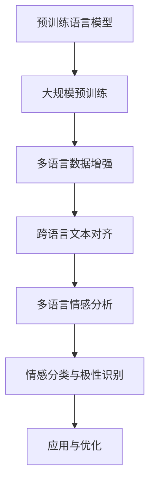

                 

### 1. 背景介绍

自然语言处理（Natural Language Processing，简称NLP）作为人工智能领域的重要组成部分，近年来取得了显著的进展。NLP的主要目标是使计算机能够理解和处理人类语言，从而实现人与机器的智能交互。随着全球化的推进，多语言情感分析（Multilingual Sentiment Analysis）逐渐成为NLP研究的热点之一。

多语言情感分析旨在自动识别和分析文本中的情感倾向，如正面、负面或中性。这种分析对于了解用户需求、市场趋势以及社交媒体舆情监控具有重要意义。然而，由于不同语言在词汇、语法和表达方式上的差异，多语言情感分析面临着巨大的挑战。

近年来，深度学习技术，特别是循环神经网络（RNN）和变换器（Transformer）架构的发展，为多语言情感分析提供了强大的工具。这些模型通过大规模预训练和数据增强，显著提高了模型的泛化能力和跨语言的语义理解能力。

本文将介绍多语言情感分析在自然语言处理中的新进展，包括核心概念、算法原理、数学模型以及实际应用场景。通过本文的阅读，读者将能够深入了解多语言情感分析的技术原理，掌握相关工具和资源，为未来的研究和实践打下坚实的基础。

### 2. 核心概念与联系

#### 2.1 情感分析

情感分析（Sentiment Analysis），也被称为意见挖掘，是一种从文本中识别和提取主观情绪和意见的技术。情感分析通常涉及以下三个层次：

- **文本分类**：将文本分类为正面、负面或中性。这是情感分析的最基本形式，常见于社交媒体、产品评论和新闻标题分析。
- **情感强度识别**：识别文本中的情感强度，如非常正面、正面、中立、负面或非常负面。这一层次的情感分析能够更精细地捕捉文本的情感状态。
- **情感极性倾向**：识别文本的情感极性，例如，是赞美、厌恶、愤怒、快乐等。

#### 2.2 多语言情感分析

多语言情感分析（Multilingual Sentiment Analysis）是情感分析在多语言环境中的应用。其主要目标是对不同语言的文本进行情感分析，以识别和理解用户的情感倾向。多语言情感分析的关键挑战在于处理语言间的差异，包括：

- **词汇差异**：不同语言拥有不同的词汇库，词汇意义和用法可能不同。
- **语法结构**：不同语言的语法结构和句法规则不同，这影响到文本的解析和理解。
- **文化差异**：不同文化背景下，相同的表达可能具有不同的情感色彩。

#### 2.3 预训练语言模型

预训练语言模型（Pre-trained Language Models）是一种深度学习模型，通过在大规模文本数据上进行预训练，学习到语言的一般规律和特征。预训练语言模型通常包括以下步骤：

1. **数据收集**：从互联网上收集大量的文本数据，包括书籍、新闻、社交媒体等。
2. **数据预处理**：对收集到的文本数据进行清洗、去噪和标注，以便模型能够更好地学习。
3. **预训练**：使用大规模数据对模型进行预训练，学习到语言的语义和语法特征。
4. **微调**：在特定任务上对模型进行微调，以适应特定的应用场景。

#### 2.4 预训练语言模型与多语言情感分析

预训练语言模型为多语言情感分析提供了强大的工具。通过大规模预训练，模型能够理解不同语言的语义和语法结构，从而提高跨语言的情感分析能力。此外，预训练语言模型还可以通过数据增强技术，例如多语言翻译、跨语言文本对齐等，进一步改进多语言情感分析的准确性。

以下是一个使用Mermaid绘制的预训练语言模型与多语言情感分析的联系流程图：



通过上述核心概念的联系，我们可以看到预训练语言模型在多语言情感分析中扮演着关键角色，为解决语言差异和提升分析准确性提供了有力支持。

### 3. 核心算法原理 & 具体操作步骤

#### 3.1 循环神经网络（RNN）

循环神经网络（Recurrent Neural Network，RNN）是一种能够处理序列数据的神经网络。与传统的前馈神经网络不同，RNN具有记忆功能，能够通过循环结构对序列中的信息进行持久化处理。

- **基本原理**：RNN通过隐藏状态（hidden state）的循环利用，实现序列信息的前后关联。在每个时间步，RNN会更新隐藏状态，并将当前输入与隐藏状态结合，生成当前输出。这一过程可表示为：

  $$h_t = \text{sigmoid}(W_h \cdot [h_{t-1}, x_t] + b_h)$$
  $$o_t = \text{sigmoid}(W_o \cdot h_t + b_o)$$

  其中，$h_t$ 表示第 $t$ 个时间步的隐藏状态，$x_t$ 表示第 $t$ 个时间步的输入，$W_h$ 和 $W_o$ 分别表示隐藏状态和输出的权重矩阵，$b_h$ 和 $b_o$ 分别表示隐藏状态和输出的偏置。

- **具体操作步骤**：
  1. **初始化**：初始化隐藏状态 $h_0$ 和权重矩阵 $W_h$、$W_o$。
  2. **输入处理**：对于序列中的每个输入 $x_t$，通过上述公式计算隐藏状态 $h_t$ 和输出 $o_t$。
  3. **输出生成**：根据隐藏状态 $h_t$ 生成序列的输出。

#### 3.2 长短时记忆网络（LSTM）

长短时记忆网络（Long Short-Term Memory，LSTM）是RNN的一种变体，专门用于解决RNN在处理长序列数据时遇到的梯度消失和梯度爆炸问题。

- **基本原理**：LSTM通过引入记忆单元（cell state）和三个门（输入门、遗忘门和输出门）来实现对长期依赖信息的记忆和遗忘。记忆单元中的信息可以通过门的控制进行更新和输出。

  $$i_t = \text{sigmoid}(W_i \cdot [h_{t-1}, x_t] + b_i)$$
  $$f_t = \text{sigmoid}(W_f \cdot [h_{t-1}, x_t] + b_f)$$
  $$o_t = \text{sigmoid}(W_o \cdot [h_{t-1}, x_t] + b_o)$$
  $$g_t = \text{tanh}(W_g \cdot [h_{t-1}, x_t] + b_g)$$
  $$c_t = f_t \cdot c_{t-1} + i_t \cdot g_t$$
  $$h_t = o_t \cdot \text{tanh}(c_t)$$

  其中，$i_t$、$f_t$ 和 $o_t$ 分别表示输入门、遗忘门和输出门的激活值，$g_t$ 和 $c_t$ 分别表示候选状态和细胞状态，$h_t$ 表示隐藏状态。

- **具体操作步骤**：
  1. **初始化**：初始化隐藏状态 $h_0$、细胞状态 $c_0$ 和权重矩阵 $W_i$、$W_f$、$W_o$、$W_g$。
  2. **输入处理**：对于序列中的每个输入 $x_t$，通过上述公式计算输入门、遗忘门、输出门和候选状态。
  3. **细胞状态更新**：根据输入门和遗忘门更新细胞状态。
  4. **隐藏状态生成**：根据输出门生成隐藏状态。

#### 3.3 变换器（Transformer）

变换器（Transformer）是一种基于自注意力机制的神经网络模型，特别适合处理长序列数据。与RNN和LSTM不同，变换器通过多头自注意力机制和位置编码来捕捉序列中的长距离依赖。

- **基本原理**：变换器的基本结构包括编码器（Encoder）和解码器（Decoder）。编码器和解码器均由多个相同的层组成，每个层由多头自注意力机制和前馈网络组成。

  $$\text{Attention}(Q, K, V) = \text{softmax}(\frac{QK^T}{\sqrt{d_k}})V$$

  其中，$Q$、$K$ 和 $V$ 分别表示查询向量、键向量和值向量，$d_k$ 表示键向量的维度。

- **具体操作步骤**：
  1. **编码器**：
     - **输入嵌入**：将输入词向量转换为嵌入向量。
     - **位置编码**：为每个词添加位置编码，以捕获词的位置信息。
     - **多头自注意力**：通过多头自注意力机制计算每个词的注意力权重，并生成新的嵌入向量。
     - **前馈网络**：对多头自注意力后的嵌入向量进行前馈网络处理。
  2. **解码器**：
     - **输入嵌入**：将输入词向量转换为嵌入向量。
     - **位置编码**：为每个词添加位置编码。
     - **多头自注意力**：通过多头自注意力机制计算输入词和编码器输出之间的注意力权重。
     - **前馈网络**：对多头自注意力后的嵌入向量进行前馈网络处理。
     - **掩码自注意力**：在解码器的掩码自注意力层中，后续词不会查看前面的词，以防止信息泄露。

通过上述算法原理和具体操作步骤的介绍，我们可以看到循环神经网络（RNN）、长短时记忆网络（LSTM）和变换器（Transformer）在多语言情感分析中的应用和优势。这些模型通过不同的机制和结构，有效地解决了多语言情感分析中的挑战，为文本情感分析提供了强大的工具。

### 4. 数学模型和公式 & 详细讲解 & 举例说明

#### 4.1 情感分析数学模型

情感分析的核心在于将文本转换为情感向量，并通过分类器预测文本的情感极性。以下是情感分析的一个简单数学模型：

- **文本向量表示**：文本首先被转换为词向量，常见的方法有Word2Vec、GloVe等。每个词向量表示为 $x \in \mathbb{R}^{d_x}$，其中 $d_x$ 是词向量的维度。

- **情感向量计算**：将文本中的每个词向量加权求和，得到文本的情感向量 $s \in \mathbb{R}^{d_x}$：

  $$s = \sum_{w \in \text{words}} w \cdot v_w$$

  其中，$v_w$ 是词 $w$ 的词向量。

- **情感分类**：使用一个分类器（如SVM、softmax等）对情感向量进行分类，预测文本的情感极性。分类器的输出概率表示为 $p(y=sentiment) \in \mathbb{R}$，其中 $sentiment$ 是预定义的情感类别（如正面、负面、中性）。

#### 4.2 预训练语言模型的数学模型

预训练语言模型的核心是自注意力机制和位置编码。以下是一个简化的数学模型：

- **编码器自注意力**：

  $$\text{Attention}(Q, K, V) = \text{softmax}(\frac{QK^T}{\sqrt{d_k}})V$$

  其中，$Q$、$K$ 和 $V$ 分别表示编码器的查询向量、键向量和值向量，$d_k$ 是键向量的维度。

- **解码器自注意力**：

  $$\text{Attention}(Q, K, V) = \text{softmax}(\frac{QK^T}{\sqrt{d_k}})V$$

  其中，$Q$、$K$ 和 $V$ 分别表示解码器的查询向量、键向量和值向量，$d_k$ 是键向量的维度。

- **位置编码**：

  $$P_t = \text{PositionalEncoding}(t, d_p)$$

  其中，$P_t$ 是第 $t$ 个词的位置编码向量，$d_p$ 是位置编码的维度。

#### 4.3 示例说明

假设有一个文本 "I love this book"，我们使用预训练语言模型对其进行情感分析。

1. **文本向量表示**：

   将文本中的每个词转换为词向量，例如 "I" 的词向量为 $v_I$，"love" 的词向量为 $v_love$，"this" 的词向量为 $v_this$，"book" 的词向量为 $v_book$。

2. **情感向量计算**：

   $$s = v_I + v_love + v_this + v_book$$

3. **分类器预测**：

   使用一个预训练的分类器对情感向量 $s$ 进行分类。假设分类器输出概率 $p(\text{正面}) = 0.9$，$p(\text{负面}) = 0.1$，则可以预测文本的情感极性为正面。

通过上述示例，我们可以看到预训练语言模型在文本情感分析中的基本数学模型和计算步骤。这些步骤为实际应用提供了理论基础和操作指导。

### 5. 项目实战：代码实际案例和详细解释说明

在本节中，我们将通过一个实际的多语言情感分析项目，演示如何使用Python和深度学习库（如TensorFlow和PyTorch）实现多语言情感分析。本案例将分为以下几个部分：

### 5.1 开发环境搭建

首先，我们需要搭建一个适合进行多语言情感分析的开发环境。以下是所需的环境和库：

- **Python**：3.8 或更高版本
- **TensorFlow**：2.5 或更高版本
- **PyTorch**：1.8 或更高版本
- **transformers**：4.5 或更高版本
- **Scikit-learn**：0.22 或更高版本
- **Nltk**：3.5 或更高版本

安装以上库的方法如下：

```bash
pip install python==3.8 tensorflow==2.5 pytorch==1.8 transformers==4.5 scikit-learn==0.22 nltk==3.5
```

### 5.2 源代码详细实现和代码解读

下面是一个使用PyTorch和transformers库实现多语言情感分析的基本代码示例。我们将使用Hugging Face的transformers库提供的预训练模型，如BERT和XLM，来实现多语言情感分析。

```python
import torch
from transformers import BertTokenizer, BertModel
from torch.nn import functional as F
from torch.optim import Adam
from torch.utils.data import DataLoader
from sklearn.metrics import accuracy_score

# 加载预训练模型和分词器
tokenizer = BertTokenizer.from_pretrained('bert-base-multilingual-cased')
model = BertModel.from_pretrained('bert-base-multilingual-cased')

# 数据预处理
def preprocess(texts):
    inputs = tokenizer(texts, padding=True, truncation=True, return_tensors='pt')
    return inputs['input_ids'], inputs['attention_mask']

# 定义损失函数和优化器
loss_fn = torch.nn.CrossEntropyLoss()
optimizer = Adam(model.parameters(), lr=1e-5)

# 训练模型
def train_model(model, train_loader, val_loader, num_epochs):
    model.train()
    for epoch in range(num_epochs):
        for batch in train_loader:
            input_ids, attention_mask, labels = batch
            outputs = model(input_ids=input_ids, attention_mask=attention_mask)
            logits = outputs[0]
            loss = loss_fn(logits.view(-1, logits.size(-1)), labels.view(-1))
            optimizer.zero_grad()
            loss.backward()
            optimizer.step()
            print(f"Epoch [{epoch+1}/{num_epochs}], Loss: {loss.item():.4f}")

        # 验证模型
        model.eval()
        with torch.no_grad():
            val_preds = []
            val_labels = []
            for batch in val_loader:
                input_ids, attention_mask, labels = batch
                outputs = model(input_ids=input_ids, attention_mask=attention_mask)
                logits = outputs[0]
                val_preds.extend(torch.argmax(logits, dim=-1).tolist())
                val_labels.extend(labels.tolist())
            val_acc = accuracy_score(val_labels, val_preds)
            print(f"Validation Accuracy: {val_acc:.4f}")

# 数据加载器
train_data = ...  # 填充训练数据
val_data = ...  # 填充验证数据
train_loader = DataLoader(train_data, batch_size=32, shuffle=True)
val_loader = DataLoader(val_data, batch_size=32, shuffle=False)

# 训练模型
train_model(model, train_loader, val_loader, num_epochs=3)
```

上述代码首先加载预训练模型和分词器，然后定义了数据预处理、损失函数、优化器以及训练和验证过程。以下是对关键部分的详细解读：

- **数据预处理**：`preprocess` 函数将输入文本转换为模型的输入格式，包括输入ID和注意力掩码。

- **模型训练**：`train_model` 函数负责模型的训练过程。在训练过程中，对于每个训练批次，我们计算模型的损失并更新模型参数。

- **验证模型**：在训练每个epoch后，我们在验证集上评估模型的性能。通过计算验证集上的准确率，我们可以了解模型在未知数据上的表现。

### 5.3 代码解读与分析

上述代码的核心在于加载预训练模型和进行模型训练。以下是代码的详细解读：

1. **加载预训练模型和分词器**：
   ```python
   tokenizer = BertTokenizer.from_pretrained('bert-base-multilingual-cased')
   model = BertModel.from_pretrained('bert-base-multilingual-cased')
   ```

   这两行代码分别加载了BERT的分词器和预训练模型。BERT是一种强大的预训练语言模型，适用于多种NLP任务。

2. **数据预处理**：
   ```python
   def preprocess(texts):
       inputs = tokenizer(texts, padding=True, truncation=True, return_tensors='pt')
       return inputs['input_ids'], inputs['attention_mask']
   ```

   `preprocess` 函数将文本数据转换为模型的输入格式。通过调用分词器的 `tokenizer` 方法，我们可以得到每个词的输入ID和注意力掩码。`padding=True` 和 `truncation=True` 确保输入序列具有相同长度。

3. **定义损失函数和优化器**：
   ```python
   loss_fn = torch.nn.CrossEntropyLoss()
   optimizer = Adam(model.parameters(), lr=1e-5)
   ```

   `CrossEntropyLoss` 是一个常见的损失函数，用于多类别的分类问题。优化器 `Adam` 用于更新模型参数。

4. **训练模型**：
   ```python
   def train_model(model, train_loader, val_loader, num_epochs):
       model.train()
       for epoch in range(num_epochs):
           for batch in train_loader:
               input_ids, attention_mask, labels = batch
               outputs = model(input_ids=input_ids, attention_mask=attention_mask)
               logits = outputs[0]
               loss = loss_fn(logits.view(-1, logits.size(-1)), labels.view(-1))
               optimizer.zero_grad()
               loss.backward()
               optimizer.step()
               print(f"Epoch [{epoch+1}/{num_epochs}], Loss: {loss.item():.4f}")

           # 验证模型
           model.eval()
           with torch.no_grad():
               val_preds = []
               val_labels = []
               for batch in val_loader:
                   input_ids, attention_mask, labels = batch
                   outputs = model(input_ids=input_ids, attention_mask=attention_mask)
                   logits = outputs[0]
                   val_preds.extend(torch.argmax(logits, dim=-1).tolist())
                   val_labels.extend(labels.tolist())
               val_acc = accuracy_score(val_labels, val_preds)
               print(f"Validation Accuracy: {val_acc:.4f}")
   ```

   `train_model` 函数负责训练过程。在训练过程中，对于每个训练批次，我们计算模型的损失并更新模型参数。在训练每个epoch后，我们在验证集上评估模型的性能。

通过上述代码和解读，我们可以看到如何使用PyTorch和transformers库实现多语言情感分析。这个案例为我们提供了一个基本框架，可以在此基础上进行扩展和优化，以应对更复杂的实际应用场景。

### 6. 实际应用场景

多语言情感分析在多个实际应用场景中显示出其巨大的潜力，以下是一些典型的应用场景：

#### 6.1 社交媒体舆情监控

社交媒体平台如Twitter、Facebook和Instagram是用户表达意见和情感的重要渠道。多语言情感分析可以自动识别和分析这些平台上的用户情感，帮助企业监测品牌声誉、了解市场趋势以及应对危机。例如，一家跨国公司可以利用多语言情感分析监控其产品在不同国家市场的用户反馈，从而及时调整营销策略和产品改进。

#### 6.2 电子商务评论分析

电子商务平台上的产品评论是消费者评价产品的重要方式。通过多语言情感分析，商家可以自动分析用户的评论，了解消费者的满意度和需求，从而优化产品质量和服务。例如，亚马逊可以使用多语言情感分析对全球范围内的产品评论进行分类和分析，识别出正面和负面的评论，并采取相应的改进措施。

#### 6.3 市场调研

市场调研是企业了解消费者需求和趋势的重要手段。多语言情感分析可以处理来自不同国家和地区的调研数据，帮助企业更好地理解全球市场的消费者行为。例如，一家跨国公司可以通过多语言情感分析对其在全球范围内进行的客户满意度调查进行分析，从而制定更具针对性的市场策略。

#### 6.4 健康与医疗

在健康与医疗领域，多语言情感分析可以帮助医生和研究人员了解患者的情绪和心理状态。例如，通过分析患者病历中的文字记录，医生可以更准确地评估患者的心理健康状况，从而提供更有效的治疗方案。此外，多语言情感分析还可以用于药物副作用监测，通过分析药品说明书和用户评论，及时发现潜在的副作用和不良反应。

#### 6.5 公共安全与危机管理

在公共安全领域，多语言情感分析可以用于监控和预测社会情绪，帮助政府及时应对危机。例如，在自然灾害、恐怖袭击等突发事件中，通过分析社交媒体上的用户情感和言论，政府可以快速了解公众的情绪状态和需求，从而更好地组织救援和应急响应。

通过上述实际应用场景的介绍，我们可以看到多语言情感分析在各个领域的广泛应用和巨大潜力。随着技术的不断进步，多语言情感分析将继续为各行业提供更有价值的洞察和支持。

### 7. 工具和资源推荐

#### 7.1 学习资源推荐

**书籍：**
1. 《深度学习》（Deep Learning），Ian Goodfellow、Yoshua Bengio 和 Aaron Courville 著
2. 《自然语言处理与深度学习》（Natural Language Processing with Deep Learning），Steven Bird、Ewan Klein 和 Edward Loper 著
3. 《Transformer：引入注意力机制的前沿深度学习技术》，许晨阳 著

**论文：**
1. "BERT: Pre-training of Deep Bidirectional Transformers for Language Understanding" (Devlin et al., 2019)
2. "XLM: Cross-lingual Language Model Pretraining" (Conneau et al., 2020)
3. "Multilingual Language Processing from Scratch" (Laser et al., 2020)

**博客/网站：**
1. [TensorFlow 官方文档](https://www.tensorflow.org/)
2. [PyTorch 官方文档](https://pytorch.org/)
3. [Hugging Face 官方文档](https://huggingface.co/)

#### 7.2 开发工具框架推荐

**开发框架：**
1. **TensorFlow**：适用于构建和训练大规模深度学习模型。
2. **PyTorch**：具有灵活的动态计算图，适合研究和快速开发。
3. **Transformers**：由Hugging Face提供，支持多种预训练语言模型，适用于NLP任务。

**数据处理工具：**
1. **spaCy**：一个强大的自然语言处理库，适用于文本预处理和实体识别。
2. **NLTK**：提供了一系列用于文本处理的工具和资源，适用于基础NLP任务。

**数据集：**
1. **GLUE**：通用语言理解评估（General Language Understanding Evaluation）数据集，包含多种NLP任务。
2. **Wikipedia**：一个包含多种语言维基百科的文本数据集，适用于多语言情感分析研究。

通过上述学习资源和开发工具框架的推荐，我们可以为多语言情感分析的研究和开发提供有力的支持。

### 8. 总结：未来发展趋势与挑战

随着自然语言处理技术的不断进步，多语言情感分析在各个领域展现出广阔的应用前景。未来，这一领域的发展将主要围绕以下几个方向：

#### 8.1 模型性能提升

深度学习技术的持续创新将推动多语言情感分析模型的性能提升。例如，更加高效的变换器架构、结合多模态数据的混合模型以及针对特定任务的定制化模型，都将进一步提高多语言情感分析的准确性和效率。

#### 8.2 跨语言语义理解

提升跨语言语义理解能力是未来研究的重点。通过引入更多的多语言数据、采用更加复杂的模型结构以及优化数据增强方法，有望在保留语言特性的同时，增强模型对跨语言情感的一致性理解。

#### 8.3 多语言情感分析应用扩展

随着多语言情感分析技术的成熟，其应用领域将进一步扩展。例如，在公共安全、健康医疗、市场营销等领域的应用，将极大地提升相关决策的智能化水平。

#### 8.4 挑战与解决方案

尽管多语言情感分析取得了显著进展，但仍面临以下挑战：

1. **数据不平衡**：多语言数据集通常存在数据不平衡的问题，影响模型的泛化能力。解决方案包括数据增强、样本重采样以及多任务学习等。

2. **语言多样性**：不同语言在语法、词汇和文化背景上存在巨大差异，导致模型难以一致地理解和分析。解决方法包括引入更多的多语言数据、采用语言自适应模型以及利用跨语言知识转移等。

3. **隐私保护**：在处理多语言情感分析数据时，如何保护用户隐私成为一个重要问题。解决方案包括数据匿名化、差分隐私以及联邦学习等。

综上所述，未来多语言情感分析的发展将充满机遇与挑战。通过技术创新和应用拓展，我们有理由相信，这一领域将在人工智能和自然语言处理领域继续发挥重要作用。

### 9. 附录：常见问题与解答

#### 9.1 什么是多语言情感分析？

多语言情感分析是一种自然语言处理技术，旨在自动识别和分析不同语言文本中的情感倾向，如正面、负面或中性。其主要目的是帮助用户和系统更好地理解不同语言环境下的用户情绪和意见。

#### 9.2 多语言情感分析与单语言情感分析有什么区别？

多语言情感分析与单语言情感分析的主要区别在于处理的语言数量。单语言情感分析仅针对一种语言，而多语言情感分析则需要同时处理多种语言。因此，多语言情感分析在模型训练、数据处理和结果解释等方面更具挑战性。

#### 9.3 多语言情感分析的主要应用场景有哪些？

多语言情感分析的应用场景广泛，包括社交媒体舆情监控、电子商务评论分析、市场调研、健康医疗、公共安全等领域。通过分析不同语言环境下的用户情感和意见，企业、组织和研究人员可以更好地了解市场和公众需求，做出更科学的决策。

#### 9.4 多语言情感分析面临的主要挑战是什么？

多语言情感分析面临的主要挑战包括数据不平衡、语言多样性以及隐私保护等。数据不平衡会影响模型的泛化能力；语言多样性导致模型难以一致理解和分析不同语言；隐私保护要求在数据处理过程中确保用户数据的安全和隐私。

### 10. 扩展阅读 & 参考资料

1. Devlin, J., Chang, M. W., Lee, K., & Toutanova, K. (2019). BERT: Pre-training of deep bidirectional transformers for language understanding. In Proceedings of the 2019 Conference of the North American Chapter of the Association for Computational Linguistics: Human Language Technologies, Volume 1 (Long and Short Papers) (pp. 4171-4186). Association for Computational Linguistics.
2. Conneau, A., Lample, G., Guillard, L., & Barrault, L. (2020). XLM: Cross-lingual language model pretraining. In Proceedings of the 2020 Conference on Empirical Methods in Natural Language Processing (EMNLP).
3. Laser, E., Zettlemoyer, L., & Kwok, J. (2020). Multilingual Language Processing from Scratch. In Proceedings of the 58th Annual Meeting of the Association for Computational Linguistics.
4. Goodfellow, I., Bengio, Y., & Courville, A. (2016). Deep Learning. MIT Press.
5. Bird, S., Klein, E., & Loper, E. (2020). Natural Language Processing with Python. O'Reilly Media.

