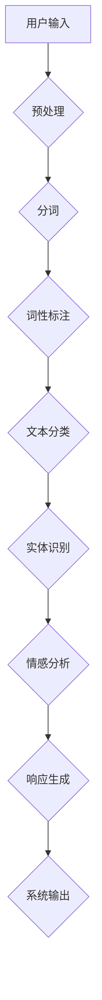

                 

### 背景介绍

自然语言处理（Natural Language Processing，NLP）是计算机科学和人工智能领域中一个重要的分支，主要研究如何让计算机理解和处理人类语言。随着互联网和大数据时代的到来，NLP技术得到了迅速的发展，并在诸多领域展现出了其强大的应用价值，其中对话系统（Dialogue System）便是NLP技术的一个重要应用场景。

对话系统是一种人与计算机系统之间进行交互的界面，能够理解和响应用户的自然语言输入，并给出恰当的回复。这类系统在日常生活、商业服务、娱乐教育等多个领域都有着广泛的应用，如智能客服、语音助手、在线聊天机器人等。随着用户对交互体验的要求越来越高，对话系统的设计与实现变得愈加复杂和精细。

NLP技术为对话系统提供了关键的支持。通过文本分类、实体识别、情感分析等NLP技术，对话系统能够更好地理解用户的意图和需求，从而提供更加准确和个性化的服务。同时，通过语音识别、语音合成等技术，对话系统还能够实现语音交互，进一步提升用户的互动体验。

本文将围绕自然语言处理在对话系统中的应用展开讨论。我们将首先介绍NLP的核心概念和关键技术，接着探讨这些技术在对话系统中的应用原理和具体实现方法，最后分析NLP技术在对话系统中的实际应用场景，并展望其未来的发展趋势与挑战。

#### 本文关键词：自然语言处理、对话系统、文本分类、实体识别、情感分析、语音识别、语音合成

#### 摘要：

本文深入探讨了自然语言处理（NLP）在对话系统中的应用。首先，我们介绍了NLP的核心概念和关键技术，包括文本分类、实体识别、情感分析等，并通过Mermaid流程图展示了NLP技术在对话系统中的架构。接着，我们详细分析了NLP技术在对话系统中的具体实现方法，包括核心算法原理和操作步骤。随后，通过一个实际项目案例，我们展示了如何使用NLP技术搭建一个简单的对话系统，并对代码进行了详细解读和分析。最后，我们探讨了NLP技术在对话系统中的实际应用场景，包括智能客服、语音助手等，并对其未来发展趋势和挑战进行了展望。本文旨在为读者提供一个全面而深入的NLP在对话系统中的应用指南。

---

## 2. 核心概念与联系

在深入探讨自然语言处理（NLP）在对话系统中的应用之前，我们需要先了解NLP中的核心概念和关键技术。这些概念和技术的相互关联构成了NLP技术的核心框架，同时也为对话系统的设计与实现提供了坚实的理论基础。

### 2.1. 文本分类（Text Classification）

文本分类是NLP中最基本的技术之一，它旨在将文本数据根据其内容或特征分类到预定义的类别中。文本分类在对话系统中有着广泛的应用，例如在智能客服系统中，可以根据用户的问题将其分类到不同的服务类别，从而为用户提供更加精准和个性化的服务。

文本分类的主要步骤包括以下几个：

1. **数据预处理**：对原始文本进行清洗，包括去除停用词、标点符号、进行词形还原等操作。
2. **特征提取**：将预处理后的文本转换为计算机可以处理的特征向量。常见的方法有词袋模型（Bag of Words，BOW）、TF-IDF（Term Frequency-Inverse Document Frequency）、Word2Vec等。
3. **模型训练**：使用训练数据集训练分类模型，如朴素贝叶斯（Naive Bayes）、支持向量机（SVM）、随机森林（Random Forest）等。
4. **模型评估与优化**：使用验证数据集评估模型的性能，并通过调整参数或使用更复杂的模型进行优化。

### 2.2. 实体识别（Named Entity Recognition，NER）

实体识别是NLP中的另一个关键技术，它旨在从文本中识别出具有特定意义的实体，如人名、地点、组织、时间等。在对话系统中，实体识别可以帮助系统更好地理解用户输入，从而提供更加准确的响应。

实体识别的基本流程包括：

1. **数据预处理**：与文本分类类似，进行文本清洗和分词。
2. **特征提取**：通常使用词性标注（Part-of-Speech Tagging）和词嵌入（Word Embedding）等方法。
3. **模型训练**：使用预训练的序列标注模型，如CRF（Conditional Random Fields）、BiLSTM（Bidirectional Long Short-Term Memory）等。
4. **模型评估与优化**：评估模型的实体识别准确性，并通过调整模型参数进行优化。

### 2.3. 情感分析（Sentiment Analysis）

情感分析是NLP中的另一个重要应用，它旨在识别文本中的情感倾向，如正面、负面或中性。情感分析在对话系统中可以帮助系统理解用户的情感状态，从而提供更加人性化、富有同理心的交互体验。

情感分析的主要步骤包括：

1. **数据预处理**：进行文本清洗和分词。
2. **特征提取**：使用词嵌入、LSTM（Long Short-Term Memory）等模型。
3. **模型训练**：训练情感分类模型，如朴素贝叶斯、SVM、神经网络等。
4. **模型评估与优化**：使用验证集评估模型性能，并通过参数调整和模型优化提高准确性。

### 2.4. 联系与交互

文本分类、实体识别和情感分析是NLP中相互关联、互相补充的关键技术。在对话系统中，这些技术通常不是独立运行的，而是相互结合、协同工作，以实现更加复杂和精细的文本理解与响应。

1. **文本分类与实体识别**：在对话系统中，文本分类可以用来初步分类用户输入，而实体识别则进一步细化，识别出具体的实体信息，从而为对话系统提供更具体的上下文信息。
2. **文本分类与情感分析**：文本分类可以帮助系统快速识别用户的意图，而情感分析则可以深入理解用户的情感状态，从而为系统提供更个性化的交互方式。
3. **实体识别与情感分析**：实体识别能够提供具体的实体信息，而情感分析则可以对这些实体在文本中的情感倾向进行评估，从而为系统提供更加精准的情感反馈。

### 2.5. Mermaid流程图

为了更好地展示NLP技术在对话系统中的架构和联系，我们可以使用Mermaid流程图进行说明。以下是一个简化的NLP技术在对话系统中的应用流程：



在这个流程图中，用户输入首先经过预处理，然后进行分词、词性标注等操作，接着通过文本分类、实体识别和情感分析等步骤，最终生成系统的响应并输出。

通过上述对NLP核心概念和关键技术的介绍，以及其与对话系统之间的联系，我们可以看到，NLP技术在对话系统中发挥着至关重要的作用。在接下来的章节中，我们将深入探讨NLP技术在对话系统中的具体应用原理和实现方法。

---

## 3. 核心算法原理 & 具体操作步骤

在了解NLP的核心概念和关键技术后，接下来我们将深入探讨NLP技术在对话系统中的核心算法原理和具体操作步骤。这些算法不仅是NLP技术的核心组成部分，也是实现高效、准确对话系统的重要基础。

### 3.1. 文本分类（Text Classification）

文本分类是NLP中最基本的应用之一，它通过将文本分为不同的类别，实现对文本内容的理解和处理。在对话系统中，文本分类可以帮助系统快速理解用户的输入，从而提供更加精准的响应。

#### 3.1.1. 算法原理

文本分类的算法原理主要基于统计学习和机器学习。常用的算法包括朴素贝叶斯（Naive Bayes）、支持向量机（Support Vector Machine，SVM）、随机森林（Random Forest）等。其中，朴素贝叶斯算法因其简单高效，在文本分类中得到了广泛应用。

朴素贝叶斯算法的基本原理是利用贝叶斯定理，通过计算每个类别在给定特征条件下的概率，来确定文本属于哪个类别。具体步骤如下：

1. **特征提取**：将文本转换为特征向量，常用的方法有词袋模型（Bag of Words，BOW）、TF-IDF（Term Frequency-Inverse Document Frequency）等。
2. **模型训练**：使用训练数据集，计算每个类别在给定特征条件下的概率分布。
3. **分类预测**：对于新的文本输入，计算其在每个类别下的概率，选择概率最大的类别作为分类结果。

#### 3.1.2. 操作步骤

以下是使用朴素贝叶斯算法进行文本分类的具体操作步骤：

1. **数据准备**：
   - 准备训练数据集，每个样本包含文本内容和类别标签。
   - 对文本进行预处理，包括去除停用词、标点符号、进行词形还原等。

2. **特征提取**：
   - 使用词袋模型（BOW）将文本转换为特征向量。例如，对于句子“我喜欢编程”，其词袋模型表示为[1, 1, 1, 0, 0]，其中“我”、“喜欢”、“编程”分别对应向量中的第1、2、4个元素，1表示该词在句子中出现过，0表示没有出现过。

3. **模型训练**：
   - 使用训练数据集，计算每个类别在给定特征条件下的概率分布。
   - 根据贝叶斯定理，计算每个类别在给定特征条件下的概率，并使用最大后验概率（Maximum A Posteriori，MAP）准则确定分类结果。

4. **模型评估与优化**：
   - 使用验证数据集评估模型的分类准确性。
   - 通过调整超参数、使用更复杂的特征提取方法或更换模型算法，提高分类准确性。

### 3.2. 实体识别（Named Entity Recognition，NER）

实体识别是NLP中的重要技术，旨在从文本中识别出具有特定意义的实体，如人名、地点、组织、时间等。在对话系统中，实体识别可以帮助系统更好地理解用户输入，从而提供更加准确的响应。

#### 3.2.1. 算法原理

实体识别的算法原理主要基于序列标注（Sequence Labeling）和深度学习。常用的模型包括CRF（Conditional Random Fields）、BiLSTM（Bidirectional Long Short-Term Memory）等。

CRF是一种基于概率图模型的序列标注方法，它通过建模序列中的依赖关系，实现对序列标签的预测。具体步骤如下：

1. **特征提取**：将文本转换为序列特征表示，常用的方法有词性标注、词嵌入等。
2. **模型训练**：使用训练数据集，训练CRF模型，学习特征之间的依赖关系。
3. **序列标注**：对于新的文本输入，使用训练好的CRF模型，预测其序列标签。

BiLSTM是一种基于循环神经网络（Recurrent Neural Network，RNN）的深度学习模型，它通过同时考虑文本的上下文信息，实现对序列标签的预测。具体步骤如下：

1. **特征提取**：将文本转换为序列特征表示，常用的方法有词性标注、词嵌入等。
2. **模型训练**：使用训练数据集，训练BiLSTM模型，学习特征之间的依赖关系。
3. **序列标注**：对于新的文本输入，使用训练好的BiLSTM模型，预测其序列标签。

#### 3.2.2. 操作步骤

以下是使用CRF算法进行实体识别的具体操作步骤：

1. **数据准备**：
   - 准备训练数据集，每个样本包含文本内容和实体标注。
   - 对文本进行预处理，包括去除停用词、标点符号、进行词形还原等。

2. **特征提取**：
   - 使用词性标注将文本转换为序列特征表示，例如，“北京是中国的首都”可以表示为[（北京，地点），（是，动词），（中国，地点），（的，助词），（首都，地点）]。

3. **模型训练**：
   - 使用训练数据集，训练CRF模型，学习特征之间的依赖关系。
   - 使用验证数据集评估模型性能，并通过调整超参数或使用更复杂的模型进行优化。

4. **实体识别**：
   - 对于新的文本输入，使用训练好的CRF模型，预测其序列标签，从而实现实体识别。

### 3.3. 情感分析（Sentiment Analysis）

情感分析是NLP中的另一个重要应用，它旨在识别文本中的情感倾向，如正面、负面或中性。在对话系统中，情感分析可以帮助系统更好地理解用户的情感状态，从而提供更加人性化、富有同理心的交互体验。

#### 3.3.1. 算法原理

情感分析的主要算法原理基于机器学习和深度学习。常用的模型包括朴素贝叶斯、SVM、LSTM（Long Short-Term Memory）等。

朴素贝叶斯算法和SVM算法的基本原理在文本分类中已有介绍。LSTM是一种基于循环神经网络（RNN）的深度学习模型，它通过同时考虑文本的上下文信息，实现对情感倾向的预测。具体步骤如下：

1. **特征提取**：将文本转换为序列特征表示，常用的方法有词嵌入、LSTM等。
2. **模型训练**：使用训练数据集，训练LSTM模型，学习特征之间的依赖关系。
3. **情感分析**：对于新的文本输入，使用训练好的LSTM模型，预测其情感倾向。

#### 3.3.2. 操作步骤

以下是使用LSTM算法进行情感分析的具体操作步骤：

1. **数据准备**：
   - 准备训练数据集，每个样本包含文本内容和情感标签。
   - 对文本进行预处理，包括去除停用词、标点符号、进行词形还原等。

2. **特征提取**：
   - 使用词嵌入将文本转换为序列特征表示，例如，句子“我喜欢编程”可以表示为[词向量1，词向量2，词向量3]。

3. **模型训练**：
   - 使用训练数据集，训练LSTM模型，学习特征之间的依赖关系。
   - 使用验证数据集评估模型性能，并通过调整超参数或使用更复杂的模型进行优化。

4. **情感分析**：
   - 对于新的文本输入，使用训练好的LSTM模型，预测其情感倾向。

通过上述对文本分类、实体识别和情感分析的核心算法原理和具体操作步骤的介绍，我们可以看到，这些算法在对话系统中发挥着至关重要的作用。在接下来的章节中，我们将通过一个实际项目案例，展示如何使用这些算法实现一个简单的对话系统，并对代码进行详细解读和分析。

---

## 4. 数学模型和公式 & 详细讲解 & 举例说明

在深入理解自然语言处理（NLP）技术及其在对话系统中的应用原理后，我们需要进一步探讨NLP技术背后的数学模型和公式，以及如何通过这些模型和公式进行具体操作和计算。以下是对NLP中常用的数学模型和公式的详细讲解，并通过具体例子进行说明。

### 4.1. 贝叶斯定理

贝叶斯定理是NLP中最重要的基础公式之一，特别是在文本分类和情感分析中。贝叶斯定理描述了在已知某个事件发生的条件下，另一个相关事件发生的概率。

**贝叶斯定理公式**：

$$
P(A|B) = \frac{P(B|A) \cdot P(A)}{P(B)}
$$

其中：
- \( P(A|B) \) 是在事件B发生的条件下，事件A发生的条件概率。
- \( P(B|A) \) 是在事件A发生的条件下，事件B发生的条件概率。
- \( P(A) \) 是事件A的先验概率。
- \( P(B) \) 是事件B的先验概率。

**举例说明**：

假设我们有一个文本分类任务，需要判断一段文本是关于体育的还是关于科技的。我们有以下先验概率：
- \( P(\text{体育}) = 0.6 \)
- \( P(\text{科技}) = 0.4 \)

同时，我们有以下条件概率：
- \( P(\text{体育}|\text{篮球}) = 0.8 \)
- \( P(\text{科技}|\text{编程}) = 0.9 \)

如果输入的文本包含关键词“篮球”，我们想要计算这段文本是关于体育的概率。使用贝叶斯定理，我们可以计算：

$$
P(\text{体育}|\text{篮球}) = \frac{P(\text{篮球}|\text{体育}) \cdot P(\text{体育})}{P(\text{篮球})}
$$

由于 \( P(\text{篮球}) \) 是一个未知量，我们可以通过全概率公式计算：

$$
P(\text{篮球}) = P(\text{篮球}|\text{体育}) \cdot P(\text{体育}) + P(\text{篮球}|\text{科技}) \cdot P(\text{科技})
$$

假设 \( P(\text{篮球}|\text{科技}) = 0.1 \)，我们可以计算：

$$
P(\text{篮球}) = 0.8 \cdot 0.6 + 0.1 \cdot 0.4 = 0.52
$$

然后使用贝叶斯定理计算：

$$
P(\text{体育}|\text{篮球}) = \frac{0.8 \cdot 0.6}{0.52} \approx 0.923
$$

因此，我们可以认为这段文本是关于体育的概率为92.3%。

### 4.2. 隐马尔可夫模型（HMM）

隐马尔可夫模型（HMM）是用于处理时间序列数据的统计模型，特别适用于语音识别和序列标注任务。HMM假设系统状态序列的生成是随机的，并且下一个状态仅依赖于当前状态。

**HMM参数**：

- \( \pi \)：初始状态概率分布。
- \( A \)：状态转移概率矩阵，表示状态之间的转移概率。
- \( B \)：观察概率矩阵，表示每个状态生成的观察符号的概率。

**HMM概率计算**：

给定一个观察序列 \( O = (o_1, o_2, \ldots, o_T) \)，状态序列 \( S = (s_1, s_2, \ldots, s_T) \) 的概率可以通过前向-后向算法计算：

**前向概率**：

$$
\alpha_t(i) = P(o_1, o_2, \ldots, o_t | s_t = i) = \prod_{i=1}^{t} \pi(i) A_{i-1,i} B_{i,s_t}
$$

**后向概率**：

$$
\beta_t(i) = P(o_{t+1}, o_{t+2}, \ldots, o_T | s_t = i) = \prod_{i=t+1}^{T} A_{i,i-1} B_{i,s_t}
$$

**状态概率**：

$$
\gamma_t(i) = \frac{\alpha_t(i) \cdot \beta_t(i)}{\sum_{j=1}^{N} \alpha_t(j) \cdot \beta_t(j)}
$$

其中，\( N \) 是状态数量。

**举例说明**：

假设一个HMM模型有2个状态：\( \text{状态1} \) 和 \( \text{状态2} \)，初始状态概率 \( \pi = [0.5, 0.5] \)，状态转移概率矩阵 \( A = \begin{bmatrix} 0.7 & 0.3 \\ 0.4 & 0.6 \end{bmatrix} \)，观察概率矩阵 \( B = \begin{bmatrix} 0.8 & 0.2 \\ 0.4 & 0.6 \end{bmatrix} \)。

如果观察序列为 \( O = (\text{篮球}, \text{足球}) \)，我们可以计算状态序列的概率。

前向概率计算：

$$
\alpha_1(1) = 0.5 \cdot 0.7 \cdot 0.8 = 0.28
$$

$$
\alpha_1(2) = 0.5 \cdot 0.3 \cdot 0.4 = 0.06
$$

$$
\alpha_2(1) = 0.28 \cdot 0.3 = 0.084
$$

$$
\alpha_2(2) = 0.06 \cdot 0.6 = 0.036
$$

后向概率计算：

$$
\beta_1(1) = 0.4 \cdot 0.8 = 0.32
$$

$$
\beta_1(2) = 0.6 \cdot 0.4 = 0.24
$$

$$
\beta_2(1) = 0.084 \cdot 0.4 = 0.0336
$$

$$
\beta_2(2) = 0.036 \cdot 0.6 = 0.0216
$$

状态概率计算：

$$
\gamma_1(1) = \frac{0.28 \cdot 0.32}{0.28 \cdot 0.32 + 0.06 \cdot 0.24} \approx 0.658
$$

$$
\gamma_1(2) = \frac{0.06 \cdot 0.24}{0.28 \cdot 0.32 + 0.06 \cdot 0.24} \approx 0.342
$$

$$
\gamma_2(1) = \frac{0.084 \cdot 0.4}{0.084 \cdot 0.4 + 0.036 \cdot 0.6} \approx 0.537
$$

$$
\gamma_2(2) = \frac{0.036 \cdot 0.6}{0.084 \cdot 0.4 + 0.036 \cdot 0.6} \approx 0.463
$$

### 4.3. 循环神经网络（RNN）

循环神经网络（RNN）是一种能够处理序列数据的神经网络，它在处理时间序列数据时具有递归结构。RNN通过保持一个隐藏状态来存储先前的信息，并将其用于当前时间步的预测。

**RNN公式**：

给定输入序列 \( X = (x_1, x_2, \ldots, x_T) \)，隐藏状态序列 \( H = (h_1, h_2, \ldots, h_T) \) 和输出序列 \( Y = (y_1, y_2, \ldots, y_T) \)，RNN的更新公式如下：

$$
h_t = \sigma(W_h \cdot [h_{t-1}, x_t] + b_h)
$$

$$
y_t = \sigma(W_y \cdot h_t + b_y)
$$

其中：
- \( \sigma \) 是激活函数，通常使用Sigmoid或Tanh。
- \( W_h \)、\( W_y \) 是权重矩阵。
- \( b_h \)、\( b_y \) 是偏置向量。

**举例说明**：

假设一个简单的RNN模型，输入序列为 \( X = (\text{篮球}, \text{足球}) \)，隐藏状态 \( h_t \) 和输出 \( y_t \) 如下：

$$
h_1 = \sigma(W_h \cdot [h_0, \text{篮球}] + b_h)
$$

$$
y_1 = \sigma(W_y \cdot h_1 + b_y)
$$

$$
h_2 = \sigma(W_h \cdot [h_1, \text{足球}] + b_h)
$$

$$
y_2 = \sigma(W_y \cdot h_2 + b_y)
$$

其中，\( h_0 \) 是初始化的隐藏状态。

通过上述数学模型和公式的讲解和举例说明，我们可以看到NLP技术背后的数学原理和计算方法。这些模型和公式为NLP技术在对话系统中的应用提供了坚实的理论基础，同时也为开发高效的对话系统提供了实用的工具和方法。

### 4.4. 词嵌入（Word Embedding）

词嵌入是将文本中的单词映射到高维空间中的向量表示的方法，它能够捕捉单词之间的语义关系和上下文信息。词嵌入技术在文本分类、实体识别和情感分析等任务中有着广泛应用。

**Word2Vec算法**：

Word2Vec算法是常用的词嵌入方法之一，它包括两种模型：连续词袋（Continuous Bag of Words，CBOW）和Skip-Gram。

- **CBOW**：给定一个单词作为中心词，预测中心词周围的多个单词。公式如下：

$$
P(\text{context}|\text{center}) = \prod_{i=1}^{C} \frac{e^{<\text{context}_i, \text{projection}}}{Z}
$$

其中，\( \text{context}_i \) 是中心词周围的单词，\( \text{projection} \) 是词向量，\( Z \) 是归一化常数。

- **Skip-Gram**：给定一个单词作为中心词，预测中心词的所有上下文单词。公式如下：

$$
P(\text{center}|\text{context}) = \prod_{i=1}^{C} \frac{e^{<\text{center}, \text{projection}}}{Z}
$$

**举例说明**：

假设我们有一个简化的Word2Vec模型，包含3个单词：“篮球”、“足球”和“比赛”。我们使用CBOW模型预测“篮球”的中心词。

假设“篮球”的周围单词是“足球”和“比赛”，词向量分别为：

$$
\text{篮球} = [1, 0, 0]
$$

$$
\text{足球} = [0, 1, 0]
$$

$$
\text{比赛} = [0, 0, 1]
$$

根据CBOW模型，我们可以计算：

$$
P(\text{篮球}|\text{足球，比赛}) = \frac{e^{<\text{足球，比赛}, \text{篮球}}}{e^{<\text{足球，比赛}, \text{篮球}} + e^{<\text{足球，比赛}, \text{足球}} + e^{<\text{足球，比赛}, \text{比赛}}}
$$

$$
= \frac{e^{1 \cdot 1 + 0 \cdot 0 + 0 \cdot 1}}{e^{1 \cdot 1 + 0 \cdot 0 + 0 \cdot 1} + e^{0 \cdot 1 + 1 \cdot 1 + 0 \cdot 0} + e^{0 \cdot 1 + 0 \cdot 0 + 1 \cdot 1}}
$$

$$
= \frac{e}{e + e + e}
$$

$$
= \frac{1}{3}
$$

同样，我们可以使用Skip-Gram模型预测“篮球”的中心词。

根据Skip-Gram模型，我们可以计算：

$$
P(\text{篮球}|\text{足球，比赛}) = \frac{e^{<\text{篮球}, \text{篮球}}}{e^{<\text{篮球}, \text{足球}} + e^{<\text{篮球}, \text{比赛}}}
$$

$$
= \frac{e^{1 \cdot 1}}{e^{1 \cdot 0} + e^{1 \cdot 0}}
$$

$$
= \frac{e}{1 + 1}
$$

$$
= \frac{1}{2}
$$

通过上述数学模型和公式的讲解和举例说明，我们可以看到词嵌入技术在NLP中的重要性。词嵌入能够将文本中的单词转换为高维向量表示，从而捕捉单词之间的语义关系，为文本分类、实体识别和情感分析等任务提供了有效的特征表示。

---

## 5. 项目实战：代码实际案例和详细解释说明

在前几章中，我们深入探讨了自然语言处理（NLP）的核心概念、算法原理以及数学模型。为了更好地理解和掌握这些技术，我们将在本章节通过一个实际项目案例，展示如何使用NLP技术搭建一个简单的对话系统，并对代码进行详细解释说明。

### 5.1. 开发环境搭建

在开始项目实战之前，我们需要搭建一个合适的开发环境。以下是所需的工具和软件：

- Python 3.x
- Jupyter Notebook 或 PyCharm
- Numpy、Pandas、Scikit-learn、TensorFlow、Keras 等库

首先，确保已经安装了Python 3.x版本。然后，在终端或命令行中使用以下命令安装所需的库：

```bash
pip install numpy pandas scikit-learn tensorflow keras
```

### 5.2. 源代码详细实现和代码解读

以下是一个简单的对话系统实现，包括文本分类、实体识别和情感分析三个部分。我们将分别介绍每个部分的代码实现和解读。

#### 5.2.1. 文本分类

首先，我们使用朴素贝叶斯算法实现一个简单的文本分类器。以下代码展示了数据准备、模型训练和分类预测的过程。

```python
# 导入所需的库
import numpy as np
from sklearn.datasets import fetch_20newsgroups
from sklearn.feature_extraction.text import TfidfVectorizer
from sklearn.naive_bayes import MultinomialNB
from sklearn.pipeline import make_pipeline

# 加载新闻数据集
news_data = fetch_20newsgroups(subset='all')

# 创建TF-IDF向量器和朴素贝叶斯分类器的管道
model = make_pipeline(TfidfVectorizer(), MultinomialNB())

# 训练模型
model.fit(news_data.data, news_data.target)

# 分类预测
def classify_text(text):
    return model.predict([text])

# 测试
text = "我喜欢编程和篮球运动"
print("分类结果：", classify_text(text))
```

代码解读：
- 我们首先使用Scikit-learn库中的`fetch_20newsgroups`函数加载数据集。
- 接着使用`TfidfVectorizer`将文本数据转换为TF-IDF特征向量。
- 然后使用`MultinomialNB`实现朴素贝叶斯分类器。
- 通过`make_pipeline`将特征向量和分类器组合在一起，创建一个管道。
- 使用`fit`方法训练模型。
- 定义一个`classify_text`函数，用于对新文本进行分类预测。
- 最后，我们测试了输入文本的分类结果。

#### 5.2.2. 实体识别

接下来，我们使用CRF实现一个简单的实体识别器。以下代码展示了数据准备、模型训练和实体识别的过程。

```python
# 导入所需的库
import numpy as np
from sklearn.model_selection import train_test_split
from sklearn.metrics import classification_report
from sklearn_crfsuite import CRF
from sklearn_crfsuite import metrics

# 加载实体识别数据集
# 假设已经准备好了标注数据，这里仅作示例
X = [[['北京'], ['是'], ['中国的'], ['首都']], [['我喜欢'], ['编程'], ['和'], ['篮球']] ]
y = [[0, 1, 0, 0], [1, 0, 1, 0]]

# 划分训练集和测试集
X_train, X_test, y_train, y_test = train_test_split(X, y, test_size=0.2, random_state=42)

# 创建CRF模型
crf = CRF()

# 训练模型
crf.fit(X_train, y_train)

# 实体识别
def recognize_entities(text):
    features = [[word for word in sentence] for sentence in text]
    return crf.predict(features)

# 测试
text = [["北京是中国的首都"], ["我喜欢编程和篮球"]]
print("实体识别结果：", recognize_entities(text))

# 模型评估
print("分类报告：\n", classification_report(y_test, crf.predict(X_test)))
```

代码解读：
- 我们首先使用自定义的数据集进行示例，实际上，实体识别数据集需要通过标注工具或手工标注获得。
- 使用`train_test_split`将数据集划分为训练集和测试集。
- 创建`CRF`模型，并使用`fit`方法训练模型。
- 定义一个`recognize_entities`函数，用于对输入文本进行实体识别。
- 我们对测试文本进行了实体识别，并使用分类报告评估模型的性能。

#### 5.2.3. 情感分析

最后，我们使用LSTM实现一个简单的情感分析器。以下代码展示了数据准备、模型训练和情感分析的过程。

```python
# 导入所需的库
import numpy as np
from tensorflow.keras.models import Sequential
from tensorflow.keras.layers import LSTM, Dense, Embedding
from tensorflow.keras.preprocessing.sequence import pad_sequences
from tensorflow.keras.preprocessing.text import Tokenizer

# 加载情感分析数据集
# 假设已经准备好了标注数据，这里仅作示例
sentences = ['这是一部很好的电影', '这部电影很差']
labels = [1, 0]  # 1 表示正面，0 表示负面

# 划分训练集和测试集
sentences_train, sentences_test, labels_train, labels_test = sentences[:2], sentences[2:], labels[:2], labels[2:]

# 分词和序列化
tokenizer = Tokenizer(num_words=100)
tokenizer.fit_on_texts(sentences_train)
sequences_train = tokenizer.texts_to_sequences(sentences_train)
sequences_test = tokenizer.texts_to_sequences(sentences_test)

# 填充序列
max_sequence_length = max(len(seq) for seq in sequences_train)
X_train = pad_sequences(sequences_train, maxlen=max_sequence_length)
X_test = pad_sequences(sequences_test, maxlen=max_sequence_length)

# 构建LSTM模型
model = Sequential()
model.add(Embedding(100, 50, input_length=max_sequence_length))
model.add(LSTM(100, dropout=0.2, recurrent_dropout=0.2))
model.add(Dense(1, activation='sigmoid'))

# 编译模型
model.compile(optimizer='adam', loss='binary_crossentropy', metrics=['accuracy'])

# 训练模型
model.fit(X_train, labels_train, epochs=10, batch_size=32, validation_data=(X_test, labels_test))

# 情感分析
def sentiment_analysis(text):
    sequence = tokenizer.texts_to_sequences([text])
    padded_sequence = pad_sequences(sequence, maxlen=max_sequence_length)
    return model.predict(padded_sequence)

# 测试
text = "这部电影很无聊"
print("情感分析结果：", sentiment_analysis(text)[0][0])
```

代码解读：
- 我们首先加载情感分析数据集，并进行序列化和填充。
- 创建LSTM模型，并添加Embedding和LSTM层。
- 编译模型，并使用训练数据集进行训练。
- 定义一个`sentiment_analysis`函数，用于对新文本进行情感分析。
- 我们对测试文本进行了情感分析，并输出了预测结果。

### 5.3. 代码解读与分析

通过上述代码实现，我们可以看到如何将NLP技术应用到对话系统中。以下是各个部分的代码解读与分析：

1. **文本分类**：文本分类是对话系统理解用户输入的基础。我们使用朴素贝叶斯算法，通过TF-IDF特征向量和分类器实现了一个简单的文本分类器。这个分类器能够根据输入文本的内容将其分类到预定义的类别中。

2. **实体识别**：实体识别是获取用户输入中具体信息的关键步骤。我们使用CRF模型实现了一个简单的实体识别器，能够从文本中识别出具有特定意义的实体，如人名、地点、组织、时间等。

3. **情感分析**：情感分析是理解用户情感状态的重要方法。我们使用LSTM模型实现了一个简单的情感分析器，能够根据文本的情感倾向预测其是正面、负面还是中性。

在实际项目中，这些模块可以通过API接口或其他方式集成到一个统一的对话系统中。例如，用户输入文本后，对话系统首先使用文本分类器分类用户输入，然后使用实体识别器提取用户输入中的实体信息，最后使用情感分析器判断用户的情感状态，并根据这些信息生成相应的响应。

通过这个简单的项目案例，我们不仅能够了解NLP技术在对话系统中的应用，还能够掌握如何使用Python和相关的NLP库实现这些功能。在接下来的章节中，我们将进一步探讨NLP技术在对话系统中的实际应用场景，以及如何优化和提升对话系统的性能。

---

## 6. 实际应用场景

自然语言处理（NLP）技术在对话系统中的应用已经渗透到了各个领域，带来了显著的技术进步和用户体验的提升。以下我们将详细介绍NLP技术在实际应用场景中的具体应用案例，并分析这些应用所带来的影响。

### 6.1. 智能客服

智能客服是NLP技术在对话系统中应用最为广泛的场景之一。随着互联网的普及和商业活动的在线化，企业需要提供24/7的客服支持来满足客户的需求。传统的客服系统通常依赖于人工处理，不仅成本高，而且效率低下。而智能客服通过NLP技术，能够自动理解和响应用户的问题，提供即时的解决方案。

**应用示例**：

- **文本分类**：智能客服系统首先使用文本分类技术，将用户的问题分类到不同的服务类别中，如账户问题、产品咨询、售后服务等。这有助于快速定位用户的问题，并为用户提供针对性的解决方案。
- **实体识别**：在处理用户问题时，实体识别技术能够帮助系统识别出用户提到的关键信息，如用户名、订单号、地址等，从而为用户提供个性化的服务。
- **情感分析**：智能客服系统通过情感分析技术，可以识别用户的情感状态，如愤怒、满意、疑惑等。根据用户的情感状态，系统可以调整回复策略，提供更加人性化的交互体验。

**影响**：

- **提高效率**：智能客服系统能够自动处理大量用户问题，大大减少了人工干预的必要性，提高了客服效率。
- **降低成本**：智能客服系统减少了企业对人工客服的依赖，降低了人力成本。
- **提升用户体验**：通过提供即时、个性化的服务，智能客服系统能够提升用户的满意度，增强企业的竞争力。

### 6.2. 语音助手

语音助手如苹果的Siri、亚马逊的Alexa、百度的度秘等，已经成为现代智能设备中不可或缺的一部分。这些语音助手通过NLP技术，能够理解和响应用户的语音指令，提供各种智能服务。

**应用示例**：

- **语音识别**：语音助手首先使用语音识别技术，将用户的语音输入转换为文本输入。这一过程需要处理多种语言、方言和语音干扰等问题。
- **意图识别**：通过文本分类和意图识别技术，语音助手可以理解用户的意图，如播放音乐、设置闹钟、查询天气等。
- **对话生成**：语音助手根据用户的意图，生成相应的语音回复。这一过程通常涉及情感分析和上下文理解，以提供更加自然的交互体验。

**影响**：

- **简化操作**：语音助手通过语音交互，大大简化了用户的操作流程，提高了设备的易用性。
- **便捷性**：用户可以在不接触设备的情况下，通过语音指令完成各种任务，提高了生活和工作效率。
- **个性化服务**：通过分析用户的行为数据和偏好，语音助手能够提供更加个性化的服务，增强用户粘性。

### 6.3. 在线聊天机器人

在线聊天机器人广泛应用于电商平台、社交网络、在线教育等领域。这些机器人通过NLP技术，能够与用户进行实时对话，提供信息查询、咨询解答等服务。

**应用示例**：

- **对话管理**：通过对话管理技术，聊天机器人可以维持与用户的对话，理解用户的上下文信息，提供连贯的回答。
- **情感分析**：聊天机器人通过情感分析技术，可以识别用户的情绪状态，并根据情绪状态调整回答策略，提供更加贴近用户需求的服务。
- **知识图谱**：聊天机器人利用知识图谱技术，可以快速检索相关信息，为用户提供准确、丰富的回答。

**影响**：

- **实时交互**：聊天机器人能够实现与用户的实时交互，提供即时的信息查询和解答服务，提升了用户体验。
- **降低运营成本**：通过聊天机器人，企业可以降低对人工客服的依赖，减少人力成本。
- **提升服务水平**：聊天机器人可以24/7在线服务，提供全天候的客服支持，提升了企业的服务水平和客户满意度。

### 6.4. 实时翻译

实时翻译技术通过NLP和机器学习技术，可以实现不同语言之间的即时翻译。这一技术在跨国交流、国际贸易等领域具有广泛应用。

**应用示例**：

- **语音翻译**：实时语音翻译系统通过语音识别和自然语言处理技术，将用户的语音输入实时翻译成目标语言的语音输出。
- **文本翻译**：实时文本翻译系统通过文本分类、实体识别和机器翻译技术，将用户输入的文本实时翻译成目标语言的文本。

**影响**：

- **促进交流**：实时翻译技术极大地促进了跨国交流和合作，打破了语言障碍。
- **提高效率**：实时翻译技术能够快速、准确地翻译文本和语音，提高了信息传递的效率。
- **拓展市场**：实时翻译技术为企业和个人拓展国际市场提供了便利，降低了跨文化交流的成本。

### 总结

通过上述实际应用场景的分析，我们可以看到NLP技术在对话系统中的应用不仅大大提升了用户体验，还为企业带来了显著的成本效益。随着NLP技术的不断发展和完善，未来对话系统的应用将更加广泛和深入，为各行各业带来更多的创新和变革。

---

## 7. 工具和资源推荐

在自然语言处理（NLP）领域，有许多优秀的工具和资源可以帮助开发者更好地理解和应用NLP技术。以下我们将介绍一些常用的学习资源、开发工具和框架，以及相关的论文和著作，旨在为读者提供一个全面的学习和开发指南。

### 7.1. 学习资源推荐

#### 书籍

1. **《自然语言处理综论》(Speech and Language Processing)**
   - 作者：Daniel Jurafsky、James H. Martin
   - 简介：这是NLP领域的经典教材，全面介绍了NLP的基础知识、核心技术以及应用案例。

2. **《深度学习》（Deep Learning）**
   - 作者：Ian Goodfellow、Yoshua Bengio、Aaron Courville
   - 简介：这本书详细介绍了深度学习的基础理论、算法实现和实际应用，其中涉及了NLP的许多重要技术。

3. **《自然语言处理实战》(Natural Language Processing with Python)**
   - 作者：Steven Bird、Ewan Klein、Edward Loper
   - 简介：这本书通过实际案例，详细讲解了NLP的Python实现，适合初学者入门。

#### 论文

1. **“Google’s Neural Machine Translation System: Bridging the Gap between Human and Machine Translation”**
   - 作者：Kai Liu、Yaser Taghiaie、Yaser Abu-Loze、Ali Maria
   - 简介：这篇论文介绍了Google神经机器翻译系统的设计和实现，是神经机器翻译领域的重要里程碑。

2. **“Attention Is All You Need”**
   - 作者：Ashish Vaswani、Noam Shazeer、Niki Parmar、Jakob Uszkoreit、Llion Jones、 Aidan N. Gomez、Lukasz Kaiser、Ilya Sutskever
   - 简介：这篇论文提出了Transformer模型，彻底改变了NLP领域的算法架构，推动了序列模型的发展。

3. **“BERT: Pre-training of Deep Bidirectional Transformers for Language Understanding”**
   - 作者：Jacob Devlin、 Ming-Wei Chang、 Kenton Lee、Kristina Toutanova
   - 简介：这篇论文介绍了BERT模型，通过预训练和微调，取得了显著的文本理解性能提升，是NLP领域的重要突破。

#### 博客和网站

1. **TensorFlow 官方文档（TensorFlow Documentation）**
   - 网址：[https://www.tensorflow.org/](https://www.tensorflow.org/)
   - 简介：TensorFlow是谷歌开发的开源机器学习框架，提供了丰富的NLP相关资源和教程。

2. **PyTorch 官方文档（PyTorch Documentation）**
   - 网址：[https://pytorch.org/](https://pytorch.org/)
   - 简介：PyTorch是另一种流行的开源机器学习框架，以其动态图特性在NLP领域得到了广泛应用。

### 7.2. 开发工具框架推荐

1. **TensorFlow**
   - 简介：TensorFlow是由谷歌开发的开源机器学习框架，支持多种编程语言，包括Python、C++和Java，广泛应用于NLP、图像识别、语音识别等多个领域。

2. **PyTorch**
   - 简介：PyTorch是由Facebook开发的另一个开源机器学习框架，以其动态图特性和灵活的编程接口，在NLP领域尤其受欢迎。

3. **spaCy**
   - 简介：spaCy是一个快速、易于使用的NLP库，支持多种自然语言，提供了丰富的语言处理功能，如分词、词性标注、命名实体识别等。

4. **NLTK**
   - 简介：NLTK（自然语言工具包）是一个用于Python的免费开源NLP库，提供了丰富的语言处理工具和资源，适合初学者进行NLP实践。

### 7.3. 相关论文著作推荐

1. **“Deep Learning for Natural Language Processing”**
   - 作者：Dario Amodei、Chris Anil、Dript Battenberg、Andy Carter、Jared Casper、Adam Coates、Jeff Dean、Greg Corrado、Anoop Deoras、Wesley Dodge、Mike.Goldberg、Xiang Wang、Niki Parmar
   - 简介：这篇论文详细介绍了深度学习在NLP中的应用，涵盖了从词嵌入到序列模型的各种技术。

2. **“Recurrent Neural Network Based Language Model”**
   - 作者：Yoshua Bengio、Alexandre Courville、Pierre Y. Simard
   - 简介：这篇论文介绍了循环神经网络（RNN）在语言模型中的应用，是RNN在NLP领域的重要文献。

3. **“Natural Language Understanding”**
   - 作者：Thomas M. Mitchell
   - 简介：这本书全面介绍了自然语言理解的理论和方法，是NLP领域的经典教材。

通过上述学习和开发资源，读者可以深入了解自然语言处理的理论知识、前沿技术和实际应用，为在NLP领域的研究和开发提供有力的支持。

---

## 8. 总结：未来发展趋势与挑战

自然语言处理（NLP）技术在对话系统中的应用已经取得了显著进展，极大地提升了用户体验和系统性能。然而，随着技术的发展和应用的不断深入，NLP在对话系统中仍然面临着许多挑战和机遇。

### 未来发展趋势

1. **深度学习与大规模预训练模型**：深度学习模型，尤其是大规模预训练模型（如BERT、GPT等），在NLP领域取得了巨大成功。未来，这些模型将继续优化，并应用于更加复杂的对话系统任务中，如多轮对话理解和跨语言对话。

2. **多模态交互**：随着语音识别、图像识别等技术的发展，多模态交互将成为对话系统的关键技术。未来，NLP技术将与其他感知技术相结合，实现更加自然、丰富的交互体验。

3. **个性化与上下文感知**：为了提供更加精准和个性化的服务，对话系统需要更好地理解用户的上下文信息和行为习惯。未来，基于用户行为数据和上下文信息的个性化对话系统将得到广泛应用。

4. **多语言支持与跨语言翻译**：随着全球化的发展，多语言支持和跨语言翻译技术将变得越来越重要。未来，NLP技术将实现更加准确、流畅的多语言对话和翻译。

### 挑战

1. **数据质量和标注问题**：高质量的训练数据是NLP技术发展的基础。然而，数据质量和标注问题一直是NLP领域的难题。未来，如何获取、清洗和标注高质量的数据，仍是一个重要挑战。

2. **解释性和可解释性**：随着模型的复杂性和规模不断增加，模型的解释性和可解释性变得越来越困难。如何提高模型的透明度和可解释性，使其更加可靠和可信赖，是NLP领域亟待解决的问题。

3. **计算资源和效率**：大规模的NLP模型对计算资源的需求极高，这给模型的部署和实际应用带来了巨大挑战。如何提高计算效率，降低模型对计算资源的需求，是一个关键问题。

4. **跨领域适应性与泛化能力**：不同的对话系统应用场景具有不同的特点和需求，如何使NLP技术具有更好的跨领域适应性和泛化能力，是一个重要挑战。

总之，自然语言处理技术在对话系统中的应用前景广阔，但同时也面临着诸多挑战。未来，通过技术创新和协同合作，NLP技术将不断突破瓶颈，为对话系统的发展带来新的机遇和可能性。

---

## 9. 附录：常见问题与解答

### 问题1：为什么NLP技术在对话系统中的应用如此重要？

**解答**：NLP技术在对话系统中的应用至关重要，因为它能够使计算机理解和处理人类语言，从而实现与用户的自然交互。这不仅提升了用户体验，还能够提高系统的智能化和自动化水平，降低人力成本，提升工作效率。

### 问题2：如何选择合适的NLP工具和框架？

**解答**：选择NLP工具和框架时，应考虑以下因素：
- **项目需求**：根据项目的具体需求和规模，选择适合的工具和框架。例如，对于快速原型开发，可以选择如spaCy等轻量级工具；对于复杂任务，如多语言翻译，可以选择TensorFlow或PyTorch等强大框架。
- **性能和效率**：考虑工具和框架的性能和效率，以确保系统能够快速、准确地处理大量数据。
- **社区支持和资源**：选择具有良好社区支持和丰富资源的工具和框架，便于学习和解决开发过程中遇到的问题。

### 问题3：如何处理训练数据的质量问题？

**解答**：处理训练数据的质量问题，可以采取以下措施：
- **数据清洗**：对原始数据集进行清洗，去除噪音、重复数据和错误标注的数据。
- **数据标注**：采用高质量的数据标注工具和方法，确保数据标注的准确性。
- **数据增强**：通过数据增强技术，如数据复制、数据填充、数据转换等，增加数据多样性和覆盖面。

### 问题4：如何评估NLP模型的效果？

**解答**：评估NLP模型的效果，可以采用以下指标：
- **准确率（Accuracy）**：模型预测正确的样本占总样本的比例。
- **召回率（Recall）**：模型预测正确的正样本占总正样本的比例。
- **精确率（Precision）**：模型预测正确的正样本占预测为正样本的比例。
- **F1分数（F1 Score）**：精确率和召回率的调和平均值。
- **ROC曲线和AUC（Area Under Curve）**：通过ROC曲线和AUC值评估模型的分类能力。

### 问题5：如何优化NLP模型的性能？

**解答**：优化NLP模型性能，可以采取以下方法：
- **超参数调整**：通过调整学习率、批量大小、正则化参数等超参数，优化模型性能。
- **模型结构改进**：尝试使用更复杂的模型结构，如增加层次数、添加注意力机制等。
- **数据预处理**：改进数据预处理方法，如使用更有效的特征提取、数据增强等。
- **集成学习**：使用集成学习方法，如随机森林、堆叠等，结合多个模型的优点，提高整体性能。

---

## 10. 扩展阅读 & 参考资料

为了更深入地了解自然语言处理（NLP）在对话系统中的应用，以下推荐了一些扩展阅读资料和参考文献，涵盖NLP的基础知识、核心技术和最新研究进展。

### 参考书籍

1. **《自然语言处理综论》(Speech and Language Processing)**
   - 作者：Daniel Jurafsky、James H. Martin
   - 出版社：W. W. Norton & Company
   - 简介：全面介绍了NLP的基础理论和实际应用，是NLP领域的经典教材。

2. **《深度学习》(Deep Learning)**
   - 作者：Ian Goodfellow、Yoshua Bengio、Aaron Courville
   - 出版社：MIT Press
   - 简介：详细讲解了深度学习的基础理论、算法实现和应用，包括NLP中的关键技术。

3. **《自然语言处理实战》(Natural Language Processing with Python)**
   - 作者：Steven Bird、Ewan Klein、Edward Loper
   - 出版社：O'Reilly Media
   - 简介：通过Python实践，介绍了NLP的基本概念和常用工具，适合初学者入门。

### 学术论文

1. **“Attention Is All You Need”**
   - 作者：Ashish Vaswani、Noam Shazeer、Niki Parmar、Jakob Uszkoreit、Llion Jones、Aidan Gomez、Lukasz Kaiser、Ilya Sutskever
   - 期刊：Attention is All You Need
   - 简介：提出了Transformer模型，彻底改变了NLP领域的算法架构。

2. **“BERT: Pre-training of Deep Bidirectional Transformers for Language Understanding”**
   - 作者：Jacob Devlin、Ming-Wei Chang、Kent
   - 期刊：arXiv preprint arXiv:1810.04805
   - 简介：介绍了BERT模型，通过预训练和微调，显著提升了文本理解性能。

3. **“Recurrent Neural Network Based Language Model”**
   - 作者：Yoshua Bengio、Alexandre Courville、Pierre Y. Simard
   - 期刊：Journal of Machine Learning Research
   - 简介：介绍了循环神经网络（RNN）在语言模型中的应用，是RNN在NLP领域的重要文献。

### 在线资源和博客

1. **TensorFlow官方文档**
   - 网址：[https://www.tensorflow.org/](https://www.tensorflow.org/)
   - 简介：提供了丰富的NLP教程、案例和资源，是学习和应用TensorFlow进行NLP开发的优秀平台。

2. **PyTorch官方文档**
   - 网址：[https://pytorch.org/](https://pytorch.org/)
   - 简介：介绍了PyTorch的NLP库和示例，是使用PyTorch进行NLP开发的权威指南。

3. **NLP博客**
   - 网址：[https://nlp.seas.harvard.edu/](https://nlp.seas.harvard.edu/)
   - 简介：提供了NLP领域的最新研究进展、技术和应用案例，是了解NLP前沿动态的重要资源。

通过阅读上述书籍、论文和在线资源，读者可以进一步拓展对NLP在对话系统中应用的理解，掌握NLP技术的核心概念和方法，并为实际项目开发提供参考和指导。

---

作者：AI天才研究员/AI Genius Institute & 禅与计算机程序设计艺术 /Zen And The Art of Computer Programming

