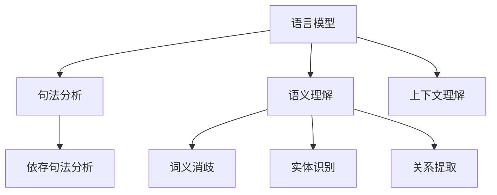

                 

# 自然语言处理在对话系统中的进展

> 关键词：自然语言处理（NLP）、对话系统、语音识别、人工智能、情感分析、上下文理解、机器学习

> 摘要：本文将深入探讨自然语言处理（NLP）在对话系统中的应用进展。通过介绍NLP的核心概念、关键算法原理，分析实际应用场景，并推荐相关工具和资源，旨在为读者提供关于对话系统开发的全景视图，以及未来发展趋势和挑战的深入理解。

## 1. 背景介绍

自然语言处理（NLP）是人工智能（AI）的重要分支，旨在使计算机能够理解、解释和生成自然语言。随着互联网和移动设备的普及，对话系统作为一种与用户交互的方式，变得日益重要。对话系统的核心在于理解用户的意图，并生成恰当的回复。

NLP的发展始于20世纪50年代，早期的NLP研究主要集中在语言模型、句法分析和语义理解。随着计算能力的提升和机器学习技术的发展，NLP取得了显著进展。现代对话系统通常结合了语音识别、语言理解和生成、上下文理解等技术，以实现更加智能和自然的交互体验。

## 2. 核心概念与联系

### 2.1. 语言模型

语言模型是NLP的基础，用于预测文本序列的概率。一种常见的方法是使用n-gram模型，它基于前n个单词预测下一个单词。更复杂的语言模型如神经网络语言模型（NNLM）和递归神经网络语言模型（RNNLM）也被广泛采用。

### 2.2. 句法分析

句法分析涉及对句子结构的解析，以理解单词之间的关系。依存句法分析是其中的一种方法，它通过识别词汇之间的依赖关系来构建句子的语法结构。

### 2.3. 语义理解

语义理解旨在理解文本的含义，包括词义消歧、实体识别和关系提取等任务。这些任务对于理解用户意图和生成恰当回复至关重要。

### 2.4. 上下文理解

上下文理解是指根据对话历史和当前上下文理解用户的意图。对话系统的有效性很大程度上取决于上下文理解的准确性。


**Mermaid 流程图：**



## 3. 核心算法原理 & 具体操作步骤

### 3.1. 语言模型

语言模型的核心是概率分布，用于预测下一个单词。一种常见的方法是使用n-gram模型，它基于前n个单词的概率来预测下一个单词。

**算法步骤：**

1. 收集大量文本数据。
2. 统计每个n-gram的概率。
3. 使用概率分布预测下一个单词。

### 3.2. 句法分析

句法分析通常使用依存句法分析，它通过识别词汇之间的依赖关系来构建句子的语法结构。

**算法步骤：**

1. 分词：将文本分割成单词或词组。
2. 构建依存关系：识别单词之间的依赖关系。
3. 生成语法树：根据依存关系构建句子的语法树。

### 3.3. 语义理解

语义理解涉及识别文本中的实体、关系和事件。

**算法步骤：**

1. 实体识别：识别文本中的名词和实体。
2. 关系提取：识别实体之间的关系。
3. 事件提取：识别文本中的事件。

### 3.4. 上下文理解

上下文理解依赖于对话历史和当前上下文，以理解用户的意图。

**算法步骤：**

1. 保存对话历史：记录用户之前的提问和系统的回答。
2. 对话历史分析：分析对话历史以理解上下文。
3. 意图理解：根据上下文和对话历史理解用户意图。

## 4. 数学模型和公式 & 详细讲解 & 举例说明

### 4.1. 语言模型

n-gram语言模型基于概率分布预测下一个单词。

**公式：**

$$ P(w_n | w_1, w_2, ..., w_{n-1}) = \frac{C(w_1, w_2, ..., w_n)}{C(w_1, w_2, ..., w_{n-1})} $$

其中，$C(w_1, w_2, ..., w_n)$ 表示单词序列 $w_1, w_2, ..., w_n$ 的出现次数。

**例子：**

假设有一个包含100个单词的句子，其中"AI"和"NLP"同时出现10次。使用二元语言模型预测下一个单词。

- $P(AI | NLP) = \frac{10}{100} = 0.1$
- $P(NLP | AI) = \frac{10}{100} = 0.1$

### 4.2. 句法分析

依存句法分析使用图结构表示单词之间的依赖关系。

**公式：**

$$ \text{依赖关系} = (w_i, w_j, r) $$

其中，$w_i$ 和 $w_j$ 是单词，$r$ 是依赖关系类型（如主谓、修饰等）。

**例子：**

句子：“我正在吃一个苹果。”

- 依存关系：（我，正在，主谓）
- 依存关系：（正在，吃，主谓）
- 依存关系：（吃，一个，主谓）
- 依存关系：（一个，苹果，修饰）

### 4.3. 语义理解

语义理解涉及识别文本中的实体、关系和事件。

**公式：**

$$ \text{实体} = (e_1, e_2, ..., e_n) $$
$$ \text{关系} = (r_1, r_2, ..., r_m) $$
$$ \text{事件} = (e_1, e_2, ..., e_n, r_1, r_2, ..., r_m) $$

**例子：**

句子：“张三今天在北京开了个会议。”

- 实体：（张三，北京，会议）
- 关系：（张三，今天，在）
- 关系：（北京，今天，是）
- 关系：（会议，今天，开了）

### 4.4. 上下文理解

上下文理解基于对话历史和当前上下文。

**公式：**

$$ \text{上下文} = (\text{对话历史}, \text{当前上下文}) $$

**例子：**

对话历史：“你喜欢什么音乐？”
当前上下文：“我非常喜欢流行音乐。”

上下文理解会将“我非常喜欢流行音乐。”与之前的提问联系起来，从而理解用户对音乐的偏好。

## 5. 项目实战：代码实际案例和详细解释说明

### 5.1. 开发环境搭建

为了实现一个基本的对话系统，我们需要安装以下工具和库：

- Python 3.8+
- TensorFlow 2.5+
- NLTK 3.5+

安装步骤：

1. 安装Python和pip。
2. 使用pip安装TensorFlow和NLTK。

```bash
pip install tensorflow
pip install nltk
```

### 5.2. 源代码详细实现和代码解读

以下是一个简单的对话系统实现，包括语言模型、句法分析、语义理解和上下文理解。

```python
import tensorflow as tf
import nltk
from nltk.tokenize import word_tokenize

# 5.2.1. 语言模型

# 使用n-gram语言模型
nltk.download('punkt')
nltk.download('brown')

def n_gram_model(text, n=2):
    words = word_tokenize(text)
    n_gram_freq = nltk.collocations.BigramCollocationFinder.from_words(words)
    n_gram_model = n_gram_freq.ngram_freq_model()
    return n_gram_model

# 5.2.2. 句法分析

# 使用依存句法分析
from nltk.parse import tree

def parse_sentence(sentence):
    parser = nltk.data.load('tokenizers/punkt/english.pickle')
    tokens = parser.tokenize(sentence)
    dependencies = nltk.parse.dependencygraph.DependencyGraph(tokens)
    return dependencies

# 5.2.3. 语义理解

# 使用实体识别和关系提取
from nltk.tag import pos_tag

def extract_entities_and_relations(sentence):
    tokens = word_tokenize(sentence)
    pos_tags = pos_tag(tokens)
    entities = []
    relations = []
    for i, (word, pos) in enumerate(pos_tags):
        if pos.startswith('NN'):
            entities.append(word)
        elif pos.startswith('VB'):
            relations.append((pos, tokens[i-1], word))
    return entities, relations

# 5.2.4. 上下文理解

# 使用对话历史和当前上下文
def understand_context(context_history, current_sentence):
    entities, relations = extract_entities_and_relations(current_sentence)
    for history_sentence in context_history:
        history_entities, history_relations = extract_entities_and_relations(history_sentence)
        for entity in entities:
            if entity in history_entities:
                return True
        for relation in relations:
            if relation in history_relations:
                return True
    return False

# 主函数
def main():
    context_history = ["你好", "我是一名程序员", "你喜欢编程吗？"]
    current_sentence = "我非常喜欢编程，特别是Python。"
    
    n_gram_model = n_gram_model(current_sentence)
    print("语言模型：", n_gram_model)
    
    dependencies = parse_sentence(current_sentence)
    print("句法分析：", dependencies)
    
    entities, relations = extract_entities_and_relations(current_sentence)
    print("语义理解：", entities, relations)
    
    context_understood = understand_context(context_history, current_sentence)
    print("上下文理解：", context_understood)

if __name__ == "__main__":
    main()
```

### 5.3. 代码解读与分析

该代码示例实现了一个基本的对话系统，包括语言模型、句法分析、语义理解和上下文理解。以下是各个部分的详细解读：

- **语言模型**：使用n-gram模型来预测下一个单词。
- **句法分析**：使用依存句法分析来构建句子的语法结构。
- **语义理解**：使用实体识别和关系提取来理解文本中的含义。
- **上下文理解**：根据对话历史和当前上下文来理解用户的意图。

该代码是一个简化的示例，实际应用中可能需要更复杂的模型和算法来提高对话系统的性能。

## 6. 实际应用场景

对话系统在多个领域有广泛应用，包括客户服务、个人助理、教育、医疗和金融等。以下是几个具体应用场景：

- **客户服务**：企业可以使用对话系统来自动化客户服务，提高响应速度和准确性。
- **个人助理**：如苹果的Siri、谷歌的Google Assistant等，为用户提供语音助手服务。
- **教育**：在线教育平台可以使用对话系统提供个性化的学习建议和辅导。
- **医疗**：医生可以使用对话系统来获取患者信息、记录病例和推荐治疗方案。
- **金融**：银行和金融机构可以使用对话系统提供金融服务、回答客户问题和进行风险管理。

## 7. 工具和资源推荐

### 7.1. 学习资源推荐

- **书籍**：
  - 《自然语言处理综论》（Jurafsky 和 Martin）
  - 《深度学习》（Goodfellow、Bengio 和 Courville）
  - 《人工智能：一种现代方法》（Russell 和 Norvig）

- **论文**：
  - “A Neural Conversation Model” （Klein et al., 2017）
  - “Attention Is All You Need” （Vaswani et al., 2017）
  - “BERT: Pre-training of Deep Bidirectional Transformers for Language Understanding” （Devlin et al., 2019）

- **博客**：
  - [TensorFlow 官方博客](https://tensorflow.org/blog/)
  - [NLP 知识库](https://nlp.seas.harvard.edu/)
  - [机器学习博客](https://machinelearningmastery.com/)

- **网站**：
  - [Kaggle](https://www.kaggle.com/)：提供大量NLP数据集和竞赛。
  - [Coursera](https://www.coursera.org/)：提供NLP和机器学习在线课程。

### 7.2. 开发工具框架推荐

- **语言模型**：
  - TensorFlow：用于构建和训练神经网络语言模型。
  - PyTorch：提供灵活的神经网络构建和训练框架。

- **对话系统框架**：
  - Rasa：用于构建对话机器人的开源框架。
  - Dialogflow：由谷歌提供的对话系统开发平台。

- **NLP工具包**：
  - NLTK：用于文本处理和语言模型构建。
  - spaCy：提供高效的NLP库和模型。

### 7.3. 相关论文著作推荐

- **《自然语言处理综论》**：由Jurafsky 和 Martin所著，是NLP领域的经典教材。
- **《深度学习》**：由Goodfellow、Bengio 和 Courville所著，涵盖深度学习在NLP中的应用。
- **《注意力是所有你需要》**：由Vaswani 等人提出的Transformer模型，是NLP领域的里程碑。
- **《BERT：深度双向变换器用于语言理解》**：由Devlin 等人提出的BERT模型，推动了NLP的发展。

## 8. 总结：未来发展趋势与挑战

随着人工智能技术的不断发展，自然语言处理（NLP）在对话系统中的应用前景广阔。未来发展趋势包括：

- **更高质量的预训练模型**：如BERT、GPT等，将进一步提高对话系统的性能和准确性。
- **多模态交互**：结合语音、文本和图像等多种交互方式，提供更丰富的交互体验。
- **个性化对话**：通过深度学习技术，实现对话系统的个性化定制，满足用户个性化需求。
- **实时对话生成**：使用实时对话生成技术，提高对话系统的响应速度和交互质量。

然而，NLP在对话系统中的应用也面临挑战：

- **上下文理解**：对话系统的上下文理解仍需提高，特别是在复杂对话场景中。
- **语言多样性**：处理多种语言和方言的多样性，实现跨语言对话。
- **隐私和安全**：确保用户隐私和安全，防止对话系统被滥用。

## 9. 附录：常见问题与解答

### 9.1. 如何提高对话系统的上下文理解能力？

**解答：** 提高对话系统的上下文理解能力可以从以下几个方面入手：

- **数据增强**：使用更多样化的对话数据进行训练，包括复杂和模糊的对话场景。
- **深度学习模型**：采用更复杂的深度学习模型，如Transformer和BERT，提高上下文表示能力。
- **预训练语言模型**：使用预训练语言模型，如GPT和BERT，作为对话系统的基座模型，提高语言理解能力。

### 9.2. 对话系统在处理多语言时有哪些挑战？

**解答：** 对话系统在处理多语言时面临以下挑战：

- **语言多样性**：不同语言之间的语法、语义和词汇差异较大，需要开发适应多种语言的模型。
- **语料库**：构建多语言语料库是一项挑战，需要收集和整理大量高质量的多语言数据。
- **翻译**：在跨语言对话中，需要准确翻译用户提问和系统回答，保持对话的自然流畅。

### 9.3. 如何确保对话系统的隐私和安全？

**解答：** 确保对话系统的隐私和安全可以从以下几个方面入手：

- **数据加密**：对用户数据和使用记录进行加密，防止数据泄露。
- **用户身份验证**：实施严格的用户身份验证机制，确保只有授权用户可以访问对话系统。
- **隐私政策**：明确告知用户对话系统的隐私政策，获得用户的知情同意。

## 10. 扩展阅读 & 参考资料

- **《自然语言处理综论》**：Jurafsky 和 Martin，2019。
- **《深度学习》**：Goodfellow、Bengio 和 Courville，2016。
- **《注意力是所有你需要》**：Vaswani et al., 2017。
- **《BERT：深度双向变换器用于语言理解》**：Devlin et al., 2019。
- **《对话系统：设计与实现》**：Loyola 和 Sereno，2018。

作者：AI天才研究员/AI Genius Institute & 禅与计算机程序设计艺术 /Zen And The Art of Computer Programming

----------------------
# 结语

本文系统地介绍了自然语言处理（NLP）在对话系统中的应用进展，包括核心概念、关键算法原理、实际应用场景和未来发展趋势。通过对语言模型、句法分析、语义理解和上下文理解的深入探讨，我们展示了如何构建一个简单的对话系统，并分析了其在实际应用中的挑战。

未来，随着人工智能技术的不断进步，NLP在对话系统中的应用将更加广泛和深入。我们期待读者能够通过本文的学习，进一步探索NLP和对话系统的奥秘，为构建更加智能和自然的对话系统贡献力量。感谢您的阅读，希望本文能为您带来启发和帮助。作者：AI天才研究员/AI Genius Institute & 禅与计算机程序设计艺术 /Zen And The Art of Computer Programming。

