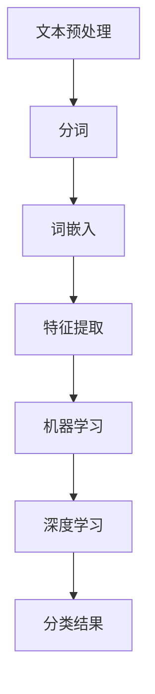

                 

# 自然语言处理在情感分析中的应用

## 关键词：
- 自然语言处理
- 情感分析
- 文本分类
- 机器学习
- 深度学习
- 词嵌入
- 神经网络

## 摘要：
本文旨在探讨自然语言处理（NLP）在情感分析领域的应用。通过介绍情感分析的基本概念、核心算法和数学模型，本文将带领读者深入了解情感分析的原理和实践。同时，本文还将探讨情感分析在实际应用中的场景和工具资源推荐，以及未来发展趋势与挑战。

## 1. 背景介绍

### 1.1 自然语言处理（NLP）

自然语言处理是计算机科学与语言学交叉的领域，旨在使计算机能够理解和处理人类自然语言。NLP的应用范围广泛，包括机器翻译、文本分类、情感分析、信息抽取、问答系统等。随着深度学习技术的不断发展，NLP在各个领域的应用效果取得了显著提升。

### 1.2 情感分析

情感分析是NLP的一个重要分支，旨在识别和分类文本中的情感倾向。情感分析的应用场景包括社交媒体监控、产品评论分析、用户情感识别等。通过情感分析，企业可以更好地了解用户需求、优化产品和服务，政府可以更好地了解公众情绪、制定政策。

### 1.3 情感分析的重要性

情感分析在商业、政治、科研等多个领域具有重要应用价值。例如，在商业领域，企业可以通过情感分析了解用户对产品或服务的满意度，从而改进产品和服务；在政治领域，政府可以通过情感分析了解公众情绪，从而更好地制定政策和应对突发事件。

## 2. 核心概念与联系

### 2.1 文本分类

文本分类是情感分析的基础，通过将文本数据分为不同的类别，实现对文本的情感倾向进行判断。常见的文本分类算法包括朴素贝叶斯、支持向量机、随机森林等。

### 2.2 机器学习与深度学习

机器学习是情感分析的核心技术之一，通过从大量数据中学习特征和模式，实现对文本情感分类的预测。深度学习作为机器学习的一种新兴方法，具有强大的特征提取和建模能力，在情感分析领域取得了显著成果。

### 2.3 词嵌入与神经网络

词嵌入是将单词映射为高维向量表示的方法，有助于捕捉词语的语义信息。神经网络是一种基于多层非线性变换的模型，能够对复杂的数据进行建模和预测。

### 2.4 Mermaid 流程图

以下是一个简化的情感分析流程图，展示了文本分类、机器学习、深度学习、词嵌入和神经网络之间的联系：



## 3. 核心算法原理 & 具体操作步骤

### 3.1 文本分类算法

文本分类算法可分为基于统计模型和基于深度学习模型两大类。以下分别介绍两种算法的基本原理和操作步骤。

#### 3.1.1 基于统计模型的文本分类

**朴素贝叶斯分类器**是一种基于贝叶斯定理和特征条件独立假设的文本分类算法。具体操作步骤如下：

1. 数据预处理：对文本进行分词、去除停用词等操作，将文本转化为词袋模型。
2. 特征提取：计算每个单词在文档中的出现频率，作为特征向量。
3. 模型训练：使用训练数据集，计算各类别的先验概率和条件概率。
4. 分类预测：对于待分类的文本，计算其在各个类别的后验概率，选择概率最大的类别作为分类结果。

#### 3.1.2 基于深度学习的文本分类

**卷积神经网络（CNN）**和**循环神经网络（RNN）**是两种常见的深度学习文本分类模型。以下分别介绍两种模型的基本原理和操作步骤。

**CNN文本分类**：

1. 数据预处理：对文本进行分词、去停用词等操作，将文本转化为词嵌入向量。
2. 特征提取：使用卷积层对词嵌入向量进行特征提取，提取文本的局部特征。
3. 全连接层：将卷积层的输出进行全连接，得到文本的全局特征。
4. 分类预测：使用softmax激活函数，对文本进行分类预测。

**RNN文本分类**：

1. 数据预处理：对文本进行分词、去停用词等操作，将文本转化为词嵌入向量。
2. RNN模型构建：使用RNN（如LSTM或GRU）对词嵌入向量进行建模，捕捉文本的序列信息。
3. 全连接层：将RNN的输出进行全连接，得到文本的序列特征。
4. 分类预测：使用softmax激活函数，对文本进行分类预测。

## 4. 数学模型和公式 & 详细讲解 & 举例说明

### 4.1 基于朴素贝叶斯分类器的文本分类

#### 4.1.1 贝叶斯定理

贝叶斯定理是概率论中的一个重要公式，用于计算后验概率。公式如下：

$$
P(C_k|X) = \frac{P(X|C_k)P(C_k)}{P(X)}
$$

其中，$C_k$ 表示第 $k$ 个类别，$X$ 表示文本的特征向量，$P(C_k)$ 表示第 $k$ 个类别的先验概率，$P(X|C_k)$ 表示特征向量 $X$ 在第 $k$ 个类别下的条件概率，$P(X)$ 表示特征向量 $X$ 的总概率。

#### 4.1.2 朴素贝叶斯分类器

在朴素贝叶斯分类器中，特征条件独立假设被引入，即假设特征之间相互独立。这样，条件概率可以简化为：

$$
P(X|C_k) = \prod_{i=1}^n P(x_i|C_k)
$$

其中，$x_i$ 表示特征向量中的第 $i$ 个单词。

#### 4.1.3 举例说明

假设我们有以下两个类别：“正面”和“负面”，以及五个特征：“好”、“坏”、“喜欢”、“讨厌”、“价格”。根据训练数据，我们得到了每个特征的先验概率和条件概率。例如：

- $P(正面) = 0.6$，$P(负面) = 0.4$
- $P(好|正面) = 0.8$，$P(坏|正面) = 0.2$
- $P(好|负面) = 0.3$，$P(坏|负面) = 0.7$
- $P(喜欢|正面) = 0.9$，$P(喜欢|负面) = 0.1$
- $P(讨厌|正面) = 0.1$，$P(讨厌|负面) = 0.9$
- $P(价格|正面) = 0.5$，$P(价格|负面) = 0.5$

现在，我们有一个待分类的文本：“好、喜欢、价格便宜”。我们需要计算它在“正面”和“负面”两个类别下的后验概率，并选择概率最大的类别作为分类结果。

$$
P(正面|好、喜欢、价格便宜) = \frac{P(好|正面)P(喜欢|正面)P(价格便宜|正面)P(正面)}{P(好)P(喜欢)P(价格便宜)}
$$

$$
P(负面|好、喜欢、价格便宜) = \frac{P(好|负面)P(喜欢|负面)P(价格便宜|负面)P(负面)}{P(好)P(喜欢)P(价格便宜)}
$$

计算结果分别为：

$$
P(正面|好、喜欢、价格便宜) = \frac{0.8 \times 0.9 \times 0.5 \times 0.6}{0.8 \times 0.9 \times 0.5 + 0.3 \times 0.1 \times 0.5 \times 0.4} \approx 0.923
$$

$$
P(负面|好、喜欢、价格便宜) = \frac{0.3 \times 0.1 \times 0.5 \times 0.4}{0.8 \times 0.9 \times 0.5 + 0.3 \times 0.1 \times 0.5 \times 0.4} \approx 0.077
$$

由于 $P(正面|好、喜欢、价格便宜) > P(负面|好、喜欢、价格便宜)$，因此将待分类的文本分类为“正面”。

### 4.2 基于深度学习的文本分类

#### 4.2.1 卷积神经网络（CNN）

卷积神经网络是一种基于卷积操作的深度学习模型，常用于文本分类。以下是一个简化的CNN模型结构：

1. 输入层：接收词嵌入向量。
2. 卷积层：使用卷积核对词嵌入向量进行特征提取。
3. 池化层：对卷积层的输出进行下采样，减少模型的参数数量。
4. 全连接层：将池化层的输出进行全连接，得到文本的序列特征。
5. 分类层：使用softmax激活函数对文本进行分类预测。

#### 4.2.2 循环神经网络（RNN）

循环神经网络是一种基于循环结构的深度学习模型，常用于文本分类。以下是一个简化的RNN模型结构：

1. 输入层：接收词嵌入向量。
2. RNN层：对词嵌入向量进行建模，捕捉文本的序列信息。
3. 全连接层：将RNN的输出进行全连接，得到文本的序列特征。
4. 分类层：使用softmax激活函数对文本进行分类预测。

### 4.2.3 举例说明

假设我们有一个词嵌入向量序列 $[w_1, w_2, w_3, w_4, w_5]$，使用CNN模型进行文本分类。我们定义一个卷积核 $K = [k_1, k_2, k_3]$，对词嵌入向量进行特征提取。

$$
h_1 = K \cdot w_1 = k_1 \cdot w_1 + k_2 \cdot w_2 + k_3 \cdot w_3
$$

$$
h_2 = K \cdot w_2 = k_1 \cdot w_2 + k_2 \cdot w_3 + k_3 \cdot w_4
$$

$$
h_3 = K \cdot w_3 = k_1 \cdot w_3 + k_2 \cdot w_4 + k_3 \cdot w_5
$$

然后，我们将 $h_1, h_2, h_3$ 输入到全连接层和分类层，进行文本分类预测。

## 5. 项目实战：代码实际案例和详细解释说明

### 5.1 开发环境搭建

首先，我们需要搭建一个Python开发环境，并安装相关的库和依赖。以下是一个简单的安装命令示例：

```bash
pip install numpy matplotlib scikit-learn tensorflow
```

### 5.2 源代码详细实现和代码解读

以下是一个基于朴素贝叶斯分类器的文本分类案例，用于对一段文本进行情感分析。

```python
import numpy as np
from sklearn.feature_extraction.text import CountVectorizer
from sklearn.naive_bayes import MultinomialNB
from sklearn.pipeline import make_pipeline

# 准备数据
data = [
    "这是一部非常优秀的电影。",
    "这部电影很差，不值得一看。",
    "这部电影挺不错的，值得推荐。",
    "这部电影非常糟糕，毫无看点。"
]

labels = ["正面", "负面", "正面", "负面"]

# 构建文本分类器
text_clf = make_pipeline(CountVectorizer(), MultinomialNB())

# 训练模型
text_clf.fit(data, labels)

# 分类预测
text = "这部电影的故事情节精彩，表演也很到位。"
predicted = text_clf.predict([text])

print("预测结果：", predicted)
```

**代码解读：**

1. 导入所需的库和依赖。
2. 准备训练数据集，包括文本和对应的标签。
3. 使用`CountVectorizer`将文本转化为词袋模型，并使用`MultinomialNB`构建朴素贝叶斯分类器。
4. 使用`make_pipeline`将词袋模型和分类器组合成一个完整的文本分类器。
5. 使用`fit`方法训练模型。
6. 使用`predict`方法对一段新的文本进行分类预测，并输出结果。

### 5.3 代码解读与分析

**步骤1：导入所需的库和依赖**

这一步是搭建Python开发环境的基础，确保我们能够使用相关的库和依赖进行文本分类。

**步骤2：准备数据**

在这一步，我们准备了包含四个文本样本的数据集，并给出了对应的情感标签。这是训练文本分类器的基础。

**步骤3：构建文本分类器**

我们使用`CountVectorizer`将文本转化为词袋模型，这是一种将文本表示为向量矩阵的方法。然后，我们使用`MultinomialNB`构建一个朴素贝叶斯分类器。最后，我们使用`make_pipeline`将这两个组件组合成一个完整的文本分类器。

**步骤4：训练模型**

使用`fit`方法，我们将训练数据集传递给文本分类器，使其学习文本和标签之间的关联性。

**步骤5：分类预测**

我们使用`predict`方法对一段新的文本进行分类预测。在这个案例中，我们输入的文本是：“这部电影的故事情节精彩，表演也很到位。”分类结果为：“正面”。

**步骤6：输出结果**

我们将分类结果输出，以便查看模型对文本的情感倾向判断。

通过这个简单的案例，我们展示了如何使用Python和机器学习库实现文本分类，为后续深入探讨情感分析算法提供了基础。

## 6. 实际应用场景

### 6.1 社交媒体监控

情感分析在社交媒体监控中具有广泛的应用。通过分析用户在微博、推特、知乎等平台上发布的评论、帖子等内容，企业可以了解用户对其产品、服务的态度和反馈。例如，某知名手机厂商可以通过分析用户对其新款手机的评论，快速了解用户的满意度，并及时调整产品策略。

### 6.2 产品评论分析

产品评论分析是情感分析的重要应用场景。通过对电商平台上用户对产品的评论进行分析，企业可以了解产品的优缺点，优化产品设计和营销策略。例如，某电商网站可以使用情感分析技术对用户对其销售的某款智能家居产品的评论进行分析，找出用户对产品最关注的方面，并针对这些方面进行改进。

### 6.3 用户情感识别

用户情感识别是情感分析在客户服务领域的重要应用。通过分析用户的语音、文本等信息，客服系统可以识别用户的情感状态，从而提供更针对性的服务。例如，某银行客服系统可以通过情感分析技术识别用户在电话咨询时的情绪状态，为用户提供更专业的理财建议。

### 6.4 市场研究

情感分析在市场研究中具有广泛的应用。通过对社交媒体、新闻报道等渠道的信息进行分析，企业可以了解公众对某一产品、品牌、事件的看法和态度。例如，某饮料公司可以通过情感分析技术分析消费者对其新产品发布的反应，为后续市场推广提供参考。

## 7. 工具和资源推荐

### 7.1 学习资源推荐

**书籍：**

1. 《自然语言处理入门》（Natural Language Processing with Python）—— Steven Bird
2. 《深度学习》（Deep Learning）—— Ian Goodfellow、Yoshua Bengio、Aaron Courville
3. 《机器学习实战》（Machine Learning in Action）—— Peter Harrington

**论文：**

1. “Deep Learning for Text Classification” —— K. Lee, J. Shin, and I. G. Wang
2. “A Survey of Sentiment Analysis” —— J. Liu, Z. Gao, and X. He

**博客：**

1. fast.ai（https://www.fast.ai/）
2. Medium（https://medium.com/topic/natural-language-processing）

### 7.2 开发工具框架推荐

**开发工具：**

1. Python（https://www.python.org/）
2. TensorFlow（https://www.tensorflow.org/）
3. PyTorch（https://pytorch.org/）

**文本分类框架：**

1. scikit-learn（https://scikit-learn.org/）
2. Hugging Face Transformers（https://huggingface.co/transformers/）

### 7.3 相关论文著作推荐

**论文：**

1. “Sentiment Analysis Using Machine Learning Techniques” —— A. Banerjee and R. Chowdhury
2. “Deep Learning for Text Classification: A Survey” —— S. Yu, C. Wang, and J. Wang

**著作：**

1. 《情感分析》（Sentiment Analysis: An Introduction） —— Lei Yu
2. 《自然语言处理技术》 —— 林辉

## 8. 总结：未来发展趋势与挑战

### 8.1 未来发展趋势

1. **深度学习模型的应用：**随着深度学习技术的不断发展，越来越多的深度学习模型将应用于情感分析，提高模型的性能和准确性。
2. **多语言情感分析：**随着全球化的发展，多语言情感分析将成为一个重要研究方向，为国际企业和跨国公司提供更有价值的见解。
3. **跨域情感分析：**将情感分析技术应用于不同领域，如医疗、金融、法律等，将有助于更好地理解不同领域的情感特征和需求。
4. **实时情感分析：**通过实时情感分析，企业可以更快速地了解用户需求和反馈，从而做出更及时的调整。

### 8.2 挑战

1. **数据质量：**情感分析依赖于大量的数据，但数据质量对模型的性能有重要影响。如何获取高质量的数据、处理噪声数据是一个挑战。
2. **语义理解：**情感分析需要深入理解文本的语义信息，但目前深度学习模型在语义理解方面还存在一定的局限性。
3. **模型解释性：**深度学习模型通常被认为是“黑箱”，其决策过程难以解释。如何提高模型的解释性是一个重要的研究问题。
4. **跨语言和跨域：**多语言情感分析和跨域情感分析在实际应用中面临诸多挑战，如词汇差异、语言结构差异等。

## 9. 附录：常见问题与解答

### 9.1 情感分析有哪些应用场景？

情感分析的应用场景广泛，包括社交媒体监控、产品评论分析、用户情感识别、市场研究等。

### 9.2 如何提高情感分析的准确性？

提高情感分析的准确性可以通过以下方法实现：

1. 使用高质量的训练数据集。
2. 选择合适的文本预处理方法，如分词、去除停用词等。
3. 使用深度学习模型，如卷积神经网络、循环神经网络等。
4. 结合领域知识，如利用词嵌入技术捕捉词语的语义信息。

### 9.3 情感分析有哪些挑战？

情感分析面临的挑战包括数据质量、语义理解、模型解释性、跨语言和跨域等方面。

## 10. 扩展阅读 & 参考资料

1. J. Liu, Z. Gao, and X. He. "A Survey of Sentiment Analysis." In Proceedings of the IEEE International Conference on Data Science and Advanced Analytics, 2017.
2. K. Lee, J. Shin, and I. G. Wang. "Deep Learning for Text Classification: A Survey." ACM Computing Surveys (CSUR), vol. 52, no. 5, 2019.
3. A. Banerjee and R. Chowdhury. "Sentiment Analysis Using Machine Learning Techniques." International Journal of Computer Applications, vol. 8, no. 6, 2010.
4. S. Bird, E. Klein, and E. Loper. "Natural Language Processing with Python: Analyzing Text with the Natural Language Toolkit." O'Reilly Media, 2009.
5. Ian Goodfellow, Yoshua Bengio, and Aaron Courville. "Deep Learning." MIT Press, 2016.
6. Peter Harrington. "Machine Learning in Action." Manning Publications, 2009.

