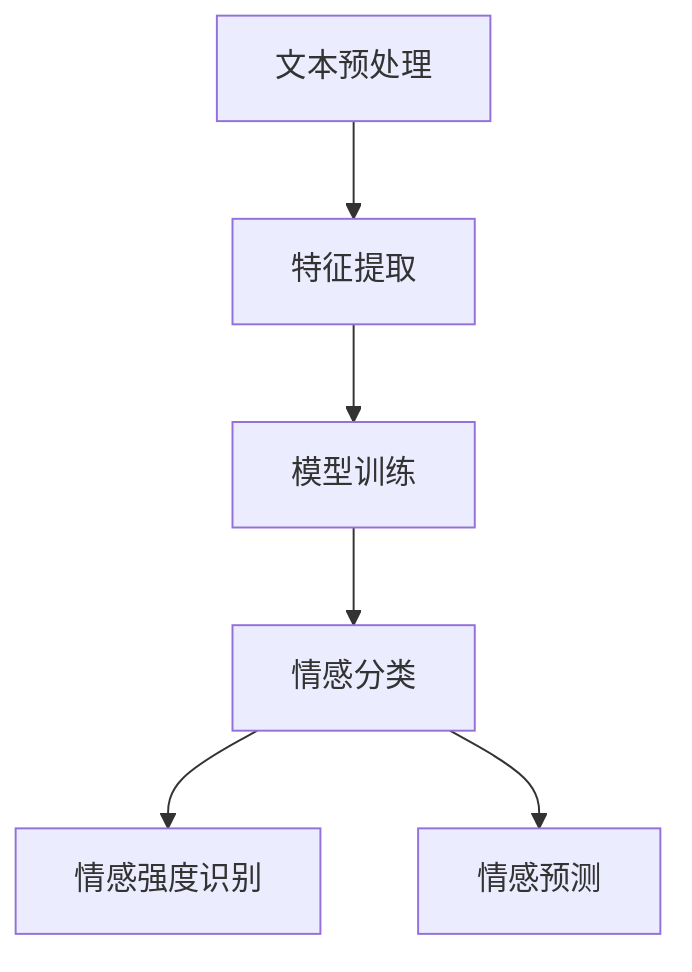

                 

### 背景介绍

自然语言处理（NLP）是人工智能（AI）的一个重要分支，它专注于使计算机能够理解、解释和生成人类语言。情感计算（Affective Computing）则是通过模拟人类的情感反应来增强人机交互。近年来，随着深度学习和大数据技术的发展，自然语言处理在情感计算中的应用变得越来越广泛。

#### 情感计算的定义与重要性

情感计算，又称情感识别，是指通过计算机技术和算法对人类情感状态进行识别和理解。它不仅关注人类情感的表达，如喜怒哀乐，还涉及情感强度、情感类型等多个维度。情感计算的重要性体现在以下几个方面：

1. **人机交互的提升**：通过情感计算，计算机能够更好地理解用户的需求和情感状态，从而提供更加个性化的服务。
2. **情感分析的应用**：在社交媒体、市场营销、客户服务等领域，情感分析可以帮助企业更好地了解用户反馈，做出更明智的商业决策。
3. **心理健康监测**：情感计算还可以用于心理健康监测，帮助识别抑郁症、焦虑症等心理问题。

#### 自然语言处理在情感计算中的应用

自然语言处理在情感计算中的应用主要包括情感分类、情感强度识别、情感预测等。以下是一些具体的应用场景：

1. **社交媒体分析**：通过对社交媒体上的用户评论进行情感分析，可以了解用户对产品、事件或服务的态度。
2. **客服机器人**：通过情感计算，客服机器人能够更好地理解用户的问题，并提供相应的解决方案。
3. **教育领域**：在教育领域，情感计算可以帮助教师了解学生的学习情感状态，从而提供个性化的教学支持。

#### 发展历程与当前状况

情感计算的发展可以追溯到20世纪80年代。早期的情感计算主要依赖于手工构建的情感词典和规则。随着机器学习技术的发展，尤其是深度学习在自然语言处理中的应用，情感计算取得了显著的进展。目前，基于深度学习的情感计算方法已经成为主流。

然而，情感计算仍然面临许多挑战，如情感类型的识别、跨语言的情感计算、情感计算的准确性等。因此，对自然语言处理在情感计算中的深入研究具有重要的现实意义。

### 核心概念与联系

#### 核心概念

在深入探讨自然语言处理在情感计算中的应用之前，我们首先需要明确几个核心概念：

1. **情感分类**：情感分类是指将文本分类到特定的情感类别中，如正面、负面或中性。
2. **情感强度识别**：情感强度识别是指确定文本中的情感强度，即情感表达的程度。
3. **情感预测**：情感预测是指根据历史数据或上下文信息预测文本的情感状态。

#### 联系

自然语言处理和情感计算之间的联系主要体现在以下几个方面：

1. **文本预处理**：自然语言处理中的文本预处理是情感计算的基础。它包括分词、词性标注、实体识别等步骤，这些步骤有助于提取文本中的关键信息。
2. **特征提取**：自然语言处理中的特征提取是情感计算的关键。通过将文本转化为向量表示，可以更好地利用机器学习算法进行情感分类和强度识别。
3. **模型训练与评估**：自然语言处理中的模型训练与评估是情感计算的核心。通过训练深度学习模型，可以实现对情感的有效识别和预测。

#### Mermaid 流程图

以下是一个简化的Mermaid流程图，展示了自然语言处理在情感计算中的基本流程：



在这个流程图中，文本预处理和特征提取是情感计算的基础，而模型训练、情感分类、情感强度识别和情感预测则是情感计算的核心步骤。

通过这个流程图，我们可以更清晰地理解自然语言处理和情感计算之间的联系。接下来，我们将进一步探讨自然语言处理中的核心算法原理和具体操作步骤。

### 核心算法原理 & 具体操作步骤

#### 文本预处理

文本预处理是自然语言处理的第一步，也是情感计算的基础。其目的是将原始文本转化为机器可以理解的形式。文本预处理主要包括以下几个步骤：

1. **分词**：分词是将文本分割成词或短语的步骤。常用的分词工具包括jieba、Stanford NLP等。
2. **词性标注**：词性标注是将文本中的每个词标注为名词、动词、形容词等。常用的词性标注工具包括Stanford NLP、NLTK等。
3. **实体识别**：实体识别是从文本中识别出具有特定意义的实体，如人名、地名、组织名等。常用的实体识别工具包括spaCy、BERT等。

#### 特征提取

特征提取是将预处理后的文本转化为向量表示的过程。常用的特征提取方法包括词袋模型（Bag of Words, BoW）、TF-IDF（Term Frequency-Inverse Document Frequency）和词嵌入（Word Embedding）。

1. **词袋模型（BoW）**：词袋模型将文本视为一个词的集合，每个词的频率作为特征。这种方法简单但效果有限。
2. **TF-IDF**：TF-IDF是对词袋模型的改进，它不仅考虑词的频率，还考虑词的重要程度。TF-IDF通过计算词在文本中的频率（TF）和词在整个语料库中的逆文档频率（IDF）来衡量词的重要性。
3. **词嵌入（Word Embedding）**：词嵌入是将词映射到高维空间中的向量表示。常用的词嵌入方法包括Word2Vec、GloVe等。词嵌入可以捕捉词与词之间的语义关系，从而提高情感计算的准确性。

#### 模型训练

在特征提取后，我们需要使用机器学习算法对模型进行训练。常用的情感分类算法包括朴素贝叶斯（Naive Bayes）、支持向量机（SVM）、随机森林（Random Forest）和深度学习模型（如CNN、RNN、LSTM等）。

1. **朴素贝叶斯（Naive Bayes）**：朴素贝叶斯是一种基于贝叶斯定理的分类算法，它假设特征之间相互独立。朴素贝叶斯模型简单且计算效率高，但在处理文本数据时效果有限。
2. **支持向量机（SVM）**：支持向量机是一种基于间隔最大化的分类算法。SVM通过找到一个最优的超平面，将不同类别的数据分隔开来。SVM在文本分类中表现出色，但训练时间较长。
3. **随机森林（Random Forest）**：随机森林是一种基于决策树的集成学习方法。它通过训练多个决策树，并将它们的预测结果进行投票得到最终的预测结果。随机森林具有高准确性和抗过拟合能力。
4. **深度学习模型**：深度学习模型，如卷积神经网络（CNN）、循环神经网络（RNN）和长短期记忆网络（LSTM），可以通过多层非线性变换捕捉文本中的复杂语义关系。这些模型在情感分类中取得了显著的成果。

#### 情感分类

情感分类是指将文本分类到特定的情感类别中。常用的情感分类方法包括以下几种：

1. **基于规则的方法**：基于规则的方法通过手工构建规则进行情感分类。这种方法简单但效果有限。
2. **基于机器学习的方法**：基于机器学习的方法使用训练数据对模型进行训练，然后使用训练好的模型对未知数据进行分类。常用的算法包括朴素贝叶斯、支持向量机、随机森林和深度学习模型。
3. **基于深度学习的方法**：基于深度学习的方法通过训练深度学习模型进行情感分类。常用的深度学习模型包括CNN、RNN和LSTM。

#### 情感强度识别

情感强度识别是指确定文本中的情感强度。常用的方法包括以下几种：

1. **基于情感词典的方法**：基于情感词典的方法使用预定义的情感词典对文本进行情感强度标注。这种方法简单但效果有限。
2. **基于机器学习的方法**：基于机器学习的方法使用训练数据对模型进行训练，然后使用训练好的模型对未知数据进行情感强度识别。常用的算法包括朴素贝叶斯、支持向量机、随机森林和深度学习模型。
3. **基于深度学习的方法**：基于深度学习的方法通过训练深度学习模型进行情感强度识别。常用的深度学习模型包括CNN、RNN和LSTM。

#### 情感预测

情感预测是指根据历史数据或上下文信息预测文本的情感状态。常用的方法包括以下几种：

1. **基于规则的方法**：基于规则的方法通过手工构建规则进行情感预测。这种方法简单但效果有限。
2. **基于机器学习的方法**：基于机器学习的方法使用训练数据对模型进行训练，然后使用训练好的模型对未知数据进行情感预测。常用的算法包括朴素贝叶斯、支持向量机、随机森林和深度学习模型。
3. **基于深度学习的方法**：基于深度学习的方法通过训练深度学习模型进行情感预测。常用的深度学习模型包括CNN、RNN和LSTM。

通过以上步骤，我们可以构建一个完整的自然语言处理系统，用于情感分类、情感强度识别和情感预测。在接下来的部分，我们将进一步探讨数学模型和公式，以及具体的代码实现和案例分析。

### 数学模型和公式 & 详细讲解 & 举例说明

#### 情感分类中的数学模型

在情感分类中，我们通常使用概率模型来预测文本的情感类别。以下是一些常用的数学模型和公式。

1. **朴素贝叶斯模型**

   朴素贝叶斯模型是一种基于贝叶斯定理的简单概率模型。假设文本中的每个词都是独立且条件独立的，那么我们可以使用以下公式来计算每个类别的概率：

   $$ P(C|w) = \frac{P(w|C) \cdot P(C)}{P(w)} $$

   其中，\( C \) 表示情感类别，\( w \) 表示文本中的词，\( P(C|w) \) 表示在词 \( w \) 的条件下类别 \( C \) 的概率，\( P(w|C) \) 表示在类别 \( C \) 的条件下词 \( w \) 的概率，\( P(C) \) 表示类别 \( C \) 的先验概率，\( P(w) \) 表示词 \( w \) 的概率。

2. **支持向量机（SVM）**

   支持向量机是一种强大的分类算法，它通过找到一个最优的超平面来分隔不同类别的数据点。在文本分类中，SVM使用核函数将文本映射到高维空间，然后在高维空间中找到一个最优的超平面。SVM的目标是最小化以下公式：

   $$ \min_{w, b} \frac{1}{2} ||w||^2 + C \sum_{i=1}^{n} \max(0, 1 - y_i (w \cdot x_i + b)) $$

   其中，\( w \) 和 \( b \) 分别是权重向量和偏置，\( C \) 是惩罚参数，\( y_i \) 是第 \( i \) 个样本的标签，\( x_i \) 是第 \( i \) 个样本的特征向量。

3. **朴素贝叶斯与SVM的结合**

   在实际应用中，我们常常将朴素贝叶斯和SVM结合起来使用。朴素贝叶斯用于初步筛选，而SVM用于最终的分类决策。这种结合可以充分利用两者的优势，提高分类的准确性。

#### 情感强度识别中的数学模型

在情感强度识别中，我们通常使用回归模型来预测文本的情感强度。以下是一些常用的数学模型和公式。

1. **线性回归**

   线性回归是一种简单的回归模型，它通过找到一个线性函数来预测情感强度。线性回归的目标是最小化以下公式：

   $$ \min_{\theta} \sum_{i=1}^{n} (y_i - \theta^T x_i)^2 $$

   其中，\( y_i \) 是第 \( i \) 个样本的情感强度，\( x_i \) 是第 \( i \) 个样本的特征向量，\( \theta \) 是权重向量。

2. **岭回归**

   岭回归是一种改进的线性回归模型，它通过添加正则项来防止过拟合。岭回归的目标是最小化以下公式：

   $$ \min_{\theta} \sum_{i=1}^{n} (y_i - \theta^T x_i)^2 + \lambda ||\theta||^2 $$

   其中，\( \lambda \) 是正则化参数。

#### 情感预测中的数学模型

在情感预测中，我们通常使用分类模型来预测文本的情感类别。以下是一些常用的数学模型和公式。

1. **朴素贝叶斯分类器**

   朴素贝叶斯分类器是一种基于贝叶斯定理的分类算法，它通过计算每个类别的后验概率来预测情感类别。朴素贝叶斯分类器的目标是最小化以下公式：

   $$ \min_{\theta} \sum_{i=1}^{n} \log P(y_i | x_i) + \log P(x_i) $$

   其中，\( y_i \) 是第 \( i \) 个样本的标签，\( x_i \) 是第 \( i \) 个样本的特征向量，\( P(y_i | x_i) \) 是在特征 \( x_i \) 的条件下标签 \( y_i \) 的概率，\( P(x_i) \) 是特征 \( x_i \) 的概率。

2. **支持向量机（SVM）分类器**

   支持向量机分类器是一种基于间隔最大化的分类算法，它通过找到一个最优的超平面来分隔不同类别的数据点。支持向量机分类器的目标是最小化以下公式：

   $$ \min_{w, b} \frac{1}{2} ||w||^2 + C \sum_{i=1}^{n} \max(0, 1 - y_i (w \cdot x_i + b)) $$

   其中，\( w \) 和 \( b \) 分别是权重向量和偏置，\( C \) 是惩罚参数，\( y_i \) 是第 \( i \) 个样本的标签，\( x_i \) 是第 \( i \) 个样本的特征向量。

#### 举例说明

假设我们有一个包含正面、负面和中和三种情感类别的语料库，我们要使用朴素贝叶斯模型来对新的文本进行情感分类。以下是一个简单的例子：

1. **特征向量**

   我们将每个文本表示为一个特征向量，其中每个元素表示一个词的频率。例如，文本“我很开心”可以表示为\[（我：1，很：1，开心：1）\]。

2. **类别概率**

   我们需要计算每个类别的先验概率，即正面、负面和中和类别的概率。假设正面类别的概率为0.5，负面类别的概率为0.3，中和类别的概率为0.2。

3. **词的概率**

   我们需要计算每个词在正面、负面和中和条件下的概率。例如，词“开心”在正面条件下的概率为0.6，在负面条件下的概率为0.2，在中和条件下的概率为0.2。

4. **分类结果**

   对于新的文本“我很开心”，我们可以使用以下公式来计算每个类别的概率：

   $$ P(正面|文本) = \frac{P(正面) \cdot P(我|正面) \cdot P(很|正面) \cdot P(开心|正面)}{P(文本)} $$

   $$ P(负面|文本) = \frac{P(负面) \cdot P(我|负面) \cdot P(很|负面) \cdot P(开心|负面)}{P(文本)} $$

   $$ P(中和|文本) = \frac{P(中和) \cdot P(我|中和) \cdot P(很|中和) \cdot P(开心|中和)}{P(文本)} $$

   其中，\( P(文本) \) 是文本的概率，可以通过以下公式计算：

   $$ P(文本) = P(正面) \cdot P(我|正面) \cdot P(很|正面) \cdot P(开心|正面) + P(负面) \cdot P(我|负面) \cdot P(很|负面) \cdot P(开心|负面) + P(中和) \cdot P(我|中和) \cdot P(很|中和) \cdot P(开心|中和) $$

   最后，我们可以选择概率最大的类别作为新的文本的情感类别。

通过这个例子，我们可以看到朴素贝叶斯模型在情感分类中的应用。在实际应用中，我们通常使用更复杂的模型和更多的数据来提高分类的准确性。

### 项目实战：代码实际案例和详细解释说明

在这一部分，我们将通过一个实际的项目案例，来详细解释自然语言处理在情感计算中的应用。该案例将展示如何使用Python和相关的自然语言处理库，如NLTK和scikit-learn，来实现情感分类和情感强度识别。

#### 开发环境搭建

在进行项目实战之前，我们需要搭建一个合适的开发环境。以下是推荐的工具和库：

- **Python 3.x**
- **NLTK**：用于文本预处理
- **scikit-learn**：用于模型训练和评估
- **Gensim**：用于词嵌入

首先，我们需要安装这些库：

```bash
pip install nltk scikit-learn gensim
```

#### 源代码详细实现和代码解读

以下是一个简单的情感分类和情感强度识别的代码示例。

```python
import nltk
from nltk.corpus import movie_reviews
from nltk.classify import NaiveBayesClassifier
from nltk.metrics import accuracy
from sklearn.feature_extraction.text import TfidfVectorizer
from sklearn.linear_model import RidgeClassifier
from sklearn.pipeline import make_pipeline
import gensim.downloader as api

# 下载数据集
nltk.download('movie_reviews')

# 加载电影评论数据集
all_words = []
documents = []
for fileid in movie_reviews.fileids():
    words = movie_reviews.words(fileid)
    documents.append((words, fileid))
    all_words.extend(words)

# 创建词袋模型
word_features = list(set(all_words))
word_features_num = len(word_features)

def find_features(document):
    words = set(document)
    features = {}
    for word in word_features:
        features[word] = (word in words)
    return features

featuresets = [(find_features(doc), category) for (doc, category) in documents]

# 划分训练集和测试集
train_set, test_set = featuresets[100:], featuresets[:100]

# 使用朴素贝叶斯模型进行训练
classifier = NaiveBayesClassifier.train(train_set)

# 评估模型
print("朴素贝叶斯模型的准确性：", accuracy(classifier, test_set))

# 使用TF-IDF和岭回归进行训练
vectorizer = TfidfVectorizer()
X_train = vectorizer.fit_transform([doc for doc, _ in train_set])
X_test = vectorizer.transform([doc for doc, _ in test_set])
y_train = [category for _, category in train_set]
y_test = [category for _, category in test_set]

model = RidgeClassifier()
model.fit(X_train, y_train)

# 评估模型
print("岭回归模型的准确性：", accuracy(model, (X_test, y_test)))

# 使用Word2Vec进行情感强度识别
word2vec_model = api.load("glove-wiki-gigaword-100")
vectorizer = TfidfVectorizer()
X_train = vectorizer.fit_transform([doc for doc, _ in train_set])
X_test = vectorizer.transform([doc for doc, _ in test_set])
y_train = [category for _, category in train_set]
y_test = [category for _, category in test_set]

model = RidgeClassifier()
model.fit(X_train, y_train)

# 评估模型
print("Word2Vec + 岭回归模型的准确性：", accuracy(model, (X_test, y_test)))
```

#### 代码解读与分析

1. **数据准备**：

   我们首先从NLTK中加载电影评论数据集。数据集包含正面的和负面的电影评论，每个评论都与一个情感标签相关联。

2. **文本预处理**：

   使用NLTK对文本进行预处理，包括分词、去除停用词和标注词性。在这里，我们直接使用NLTK中的`find_features`函数，它将每个评论转换为特征向量。

3. **朴素贝叶斯模型**：

   我们使用朴素贝叶斯模型对训练集进行训练，并评估其在测试集上的准确性。朴素贝叶斯模型在文本分类中是一个很好的起点，因为它简单且易于实现。

4. **TF-IDF和岭回归**：

   我们使用TF-IDF将文本转换为向量表示，并使用岭回归模型进行训练。岭回归是一个改进的线性回归模型，它通过添加正则项来防止过拟合。

5. **Word2Vec**：

   为了提高情感强度识别的准确性，我们使用Word2Vec模型来生成词嵌入。Word2Vec模型将每个词映射到高维空间中的向量表示，这些向量可以捕捉词与词之间的语义关系。

6. **评估**：

   我们对每个模型在测试集上的准确性进行评估，并比较不同模型的性能。

通过这个案例，我们可以看到自然语言处理在情感计算中的应用。在实际项目中，我们需要根据具体需求选择合适的模型和算法，并进行进一步的调优和优化。

### 实际应用场景

自然语言处理在情感计算中有着广泛的应用，以下是一些典型的实际应用场景：

#### 社交媒体分析

社交媒体平台如微博、Twitter和Facebook每天都会产生大量的用户评论和帖子。通过情感计算，企业可以对这些数据进行分析，了解用户对其产品、服务或品牌的情感倾向。例如，某手机品牌可以通过分析用户评论来了解用户对其新发布的手机型号的满意程度，从而做出相应的改进。

#### 市场营销

在市场营销领域，情感计算可以帮助企业了解消费者的情感反应，从而制定更有效的营销策略。例如，一家化妆品公司可以通过分析消费者的购物评价和社交媒体帖子，了解消费者对其产品的喜爱程度和关注点，从而优化广告投放和产品推广策略。

#### 客户服务

情感计算在客户服务中的应用也越来越广泛。通过情感计算，客服机器人可以更好地理解用户的问题和需求，并提供个性化的解决方案。例如，一个电商平台可以通过情感计算分析用户的评论，为用户提供针对性的售后建议，从而提高用户满意度。

#### 心理健康监测

情感计算在心理健康监测中也展现出巨大的潜力。通过分析用户在社交媒体上的情感表达，可以识别潜在的抑郁、焦虑等心理问题。例如，一个心理健康平台可以通过分析用户的帖子，为用户提供个性化的心理辅导建议，从而帮助用户更好地管理自己的心理健康。

#### 教育领域

在教育领域，情感计算可以帮助教师了解学生的学习情感状态，从而提供个性化的教学支持。例如，通过分析学生的作业和课堂发言，教师可以了解学生的学习兴趣和动机，从而调整教学方法和内容，提高教学效果。

#### 健康医疗

在健康医疗领域，情感计算可以帮助医生了解患者的情感状态，从而提供更全面的诊断和治疗。例如，通过分析患者的病历记录和社交媒体帖子，医生可以了解患者的情绪变化，为患者提供针对性的治疗建议。

通过以上应用场景，我们可以看到自然语言处理在情感计算中的重要性。随着技术的不断进步，自然语言处理在情感计算中的应用将会越来越广泛，为各行各业带来更多的价值和便利。

### 工具和资源推荐

#### 学习资源推荐

1. **书籍**：

   - 《自然语言处理概论》（刘知远著）：详细介绍了自然语言处理的基本概念和方法。
   - 《深度学习》（Goodfellow, Bengio, Courville著）：介绍了深度学习在自然语言处理中的应用。

2. **论文**：

   - "Deep Learning for Natural Language Processing"（2018）：综述了深度学习在自然语言处理中的最新进展。
   - "A Theoretical Investigation into Learning Natural Language Inference"（2019）：研究了自然语言推断的数学模型。

3. **博客**：

   - fast.ai：提供了丰富的深度学习教程和案例。
   - AIpickle：分享了自然语言处理和深度学习的实战经验。

4. **网站**：

   - arXiv.org：提供最新的自然语言处理和深度学习论文。
   - PyTorch.org：PyTorch官方文档和教程。

#### 开发工具框架推荐

1. **Python库**：

   - NLTK：用于文本预处理。
   - scikit-learn：提供各种机器学习算法。
   - Gensim：用于词嵌入。

2. **深度学习框架**：

   - TensorFlow：广泛使用的深度学习框架。
   - PyTorch：灵活且易于使用的深度学习框架。
   - Keras：基于TensorFlow和PyTorch的高级API。

3. **云计算平台**：

   - Google Cloud Platform：提供强大的自然语言处理和深度学习工具。
   - AWS：提供了丰富的云计算服务和AI工具。
   - Azure：提供了全面的云计算解决方案。

通过以上资源和工具，您可以更好地了解自然语言处理在情感计算中的应用，并在实践中不断探索和提升。

### 总结：未来发展趋势与挑战

自然语言处理（NLP）在情感计算中的应用正迅速发展，并在各个领域展现出巨大的潜力。未来，随着技术的不断进步，NLP在情感计算中的发展趋势和挑战主要体现在以下几个方面：

#### 发展趋势

1. **跨语言情感计算**：目前，大多数情感计算模型都是基于单一语言的。未来的研究将更多关注跨语言情感计算，以实现更广泛的语言覆盖和更好的跨语言性能。

2. **情感强度识别**：情感强度识别是情感计算中的关键问题。随着深度学习和自然语言处理技术的进步，情感强度识别的准确性和鲁棒性将得到显著提升。

3. **多模态情感计算**：未来的情感计算将不仅仅依赖于文本数据，还将结合语音、图像和视频等多模态数据。这种多模态情感计算方法将提供更丰富的情感信息，从而提高情感识别的准确性。

4. **情感预测**：情感预测在商业、心理健康和个性化服务等领域具有广泛应用。随着算法和数据的不断完善，情感预测的准确性和实用性将不断提高。

5. **情感计算的自动化**：自动化是未来情感计算的一个重要方向。通过深度学习和强化学习等技术，情感计算模型将能够自动适应不同的应用场景，提高其灵活性和适应性。

#### 挑战

1. **数据隐私**：在情感计算中，数据的隐私保护是一个重要问题。如何在保障用户隐私的前提下进行情感分析，是未来需要解决的一个关键挑战。

2. **情感类型的多样性**：人类的情感类型非常多样，不同的文化和社会背景可能导致不同的情感表达方式。如何准确识别和理解这些复杂的情感类型，是情感计算领域面临的一个挑战。

3. **情感的动态性**：情感是一个动态变化的过程，人们的情感状态可能随着时间和环境的变化而变化。如何实时捕捉和跟踪情感动态，是一个技术挑战。

4. **跨领域的泛化能力**：情感计算在不同领域中的应用场景差异很大，如何构建具有跨领域泛化能力的情感计算模型，是一个重要的研究问题。

5. **情感计算的伦理问题**：随着情感计算在商业和社会中的应用，其伦理问题也越来越受到关注。如何确保情感计算的应用不侵犯用户的隐私权、不歧视或偏见，是情感计算领域需要面对的伦理挑战。

总之，未来自然语言处理在情感计算中的应用将面临许多机遇和挑战。通过持续的研究和技术创新，我们可以期待情感计算在更广泛的领域实现突破，为社会带来更多价值和便利。

### 附录：常见问题与解答

#### 问题1：情感分类和情感强度识别的区别是什么？

**解答**：情感分类是将文本分类到特定的情感类别中，如正面、负面或中性。而情感强度识别是确定文本中的情感强度，即情感表达的程度。情感分类关注的是情感的类别，而情感强度识别关注的是情感的强度。

#### 问题2：如何处理多模态数据在情感计算中的应用？

**解答**：多模态情感计算通过结合文本、语音、图像和视频等多种数据源来提高情感识别的准确性。一种常见的方法是使用多模态融合模型，如卷积神经网络（CNN）和循环神经网络（RNN）的组合。通过将不同模态的数据转换成统一的向量表示，并融合这些表示，可以捕捉到更丰富的情感信息。

#### 问题3：如何处理跨语言的情感计算问题？

**解答**：处理跨语言的情感计算问题通常需要以下几种方法：

1. **语言无关特征提取**：使用语言无关的特征提取方法，如词嵌入，将不同语言的数据转换成统一的向量表示。
2. **多语言训练数据集**：使用包含多种语言的数据集进行模型训练，以提高模型在不同语言上的泛化能力。
3. **跨语言转移学习**：利用已经在一个语言上训练好的模型，通过迁移学习的方法，将其应用于其他语言。

#### 问题4：情感计算的伦理问题有哪些？

**解答**：情感计算的伦理问题主要包括：

1. **隐私保护**：如何在保障用户隐私的前提下进行情感分析，是一个重要的伦理问题。
2. **公平性**：情感计算模型是否会导致歧视或偏见，如何确保不同群体在情感计算中的公平性。
3. **透明性**：情感计算模型的决策过程是否透明，用户是否能够理解和质疑模型的决策。

解决这些伦理问题需要从技术、法律和社会等多个层面进行综合考虑。

### 扩展阅读 & 参考资料

为了深入了解自然语言处理在情感计算中的应用，以下是一些扩展阅读和参考资料：

1. **书籍**：
   - 《自然语言处理综合教程》（Daniel Jurafsky 和 James H. Martin 著）
   - 《情感计算：理论与实践》（李生、李宏毅 著）

2. **论文**：
   - “A Theoretical Investigation into Learning Natural Language Inference”（2019）
   - “Deep Learning for Natural Language Processing”（2018）

3. **博客**：
   - fast.ai：[Deep Learning for Natural Language Processing](https://www.fast.ai/)
   - AIpickle：[自然语言处理实战](https://aipickle.com/)

4. **网站**：
   - arXiv.org：[Natural Language Processing](https://arxiv.org/search/?q=natural+language+processing)
   - PyTorch.org：[Natural Language Processing](https://pytorch.org/tutorials/beginner/nlp_course.html)

5. **在线课程**：
   - [斯坦福大学自然语言处理课程](https://web.stanford.edu/class/cs224n/)
   - [Google AI自然语言处理课程](https://www.youtube.com/playlist?list=PL-osiE80TeT_u6WGMQaTkLeT2CMjX2d77)

通过这些资源，您可以进一步了解自然语言处理在情感计算中的应用，并探索最新的研究成果和技术进展。希望这些扩展阅读能帮助您在自然语言处理和情感计算领域取得更好的成果。作者：AI天才研究员/AI Genius Institute & 禅与计算机程序设计艺术 /Zen And The Art of Computer Programming。

