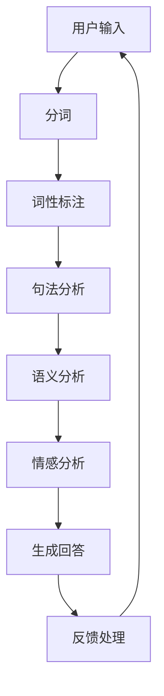

                 

### 背景介绍

自然语言处理（Natural Language Processing，NLP）是计算机科学领域的一个分支，致力于使计算机能够理解、生成和处理人类语言。随着互联网和移动设备的普及，人们每天产生和消费的海量信息多以自然语言形式存在，这使得NLP技术在各个领域的应用变得日益重要。智能客服系统（Intelligent Customer Service System）是NLP技术应用的一个重要场景，通过自动化处理用户的问题和需求，提供快速、准确的响应，以提升客户体验并减轻人工客服的工作负担。

智能客服系统的发展历程可以追溯到20世纪80年代，当时主要是基于规则（Rule-Based）的系统，这类系统通过预定义的规则来匹配用户输入并给出相应的回答。随着技术的进步，尤其是深度学习（Deep Learning）的兴起，基于统计模型（Statistical Model）和神经网络（Neural Network）的智能客服系统开始逐渐取代传统的规则系统，成为行业的主流。这些现代的智能客服系统不仅能够理解用户的自然语言输入，还能进行上下文理解、情感分析等高级功能，从而提供更加智能化和个性化的服务。

本文将深入探讨自然语言处理在智能客服系统中的实践。首先，我们将介绍NLP的核心概念和关键技术，并通过Mermaid流程图展示智能客服系统的架构。接着，我们将详细分析NLP的核心算法原理，包括分词、词性标注、句法分析等步骤。随后，我们将介绍NLP中的数学模型和公式，并通过具体案例进行说明。在项目实战部分，我们将展示一个实际代码案例，并对其中的关键代码进行详细解读。接下来，我们将讨论智能客服系统在实际应用场景中的表现，并推荐一些相关的工具和资源。最后，我们将总结自然语言处理在智能客服系统中的发展趋势与挑战，并给出一些常见问题的解答。

### 核心概念与联系

自然语言处理涉及多个核心概念和技术，这些概念和技术相互联系，共同构成了NLP的体系。为了更好地理解这些概念，我们首先介绍NLP中的基本术语，然后通过Mermaid流程图展示智能客服系统的整体架构。

#### 基本术语

1. **文本（Text）**：由一组字符组成的序列，是自然语言处理的基本单位。
2. **分词（Tokenization）**：将文本分割成一系列的单词或其他有意义的基本元素，称为“token”。
3. **词性标注（Part-of-Speech Tagging）**：为文本中的每个单词分配一个词性，如名词、动词、形容词等。
4. **句法分析（Syntactic Parsing）**：分析文本的语法结构，通常使用句法树（Syntax Tree）来表示。
5. **语义分析（Semantic Analysis）**：理解文本中的含义，包括实体识别、关系抽取等。
6. **情感分析（Sentiment Analysis）**：分析文本中的情感倾向，如正面、负面或中性。
7. **命名实体识别（Named Entity Recognition，NER）**：识别文本中的特定实体，如人名、地名、组织名等。

#### Mermaid流程图

以下是一个Mermaid流程图，展示了智能客服系统的整体架构：



**详细解释：**

1. **用户输入（User Input）**：用户通过文本消息、语音消息等方式向系统提交问题或需求。
2. **分词（Tokenization）**：将用户的输入文本分割成一系列的单词或其他有意义的元素。
3. **词性标注（Part-of-Speech Tagging）**：为分词后的每个元素分配词性，以便更好地理解词汇的用法。
4. **句法分析（Syntactic Parsing）**：分析文本的语法结构，构建句法树，以理解句子的组成。
5. **语义分析（Semantic Analysis）**：提取文本中的关键信息，识别实体和关系，以便生成准确的回答。
6. **情感分析（Sentiment Analysis）**：分析用户的情感倾向，为系统提供更多上下文信息。
7. **生成回答（Generate Response）**：根据分析结果，生成适当的回答。
8. **反馈处理（Feedback Handling）**：收集用户对回答的反馈，用于系统优化和提升。

通过上述流程，智能客服系统能够理解用户的自然语言输入，并生成合适的回答，从而提供高效、准确的客服服务。

### 核心算法原理 & 具体操作步骤

在了解了智能客服系统的整体架构后，接下来我们将深入探讨NLP的核心算法原理，并详细描述每个操作步骤。

#### 分词（Tokenization）

分词是NLP的首要步骤，它将连续的文本分割成一系列有意义的单词或短语。分词的目的是将文本转化为可以进一步处理的序列数据。

**操作步骤：**

1. **加载词典**：首先，系统需要加载一个预先定义好的词典，该词典包含了常用的单词和短语。
2. **扫描文本**：从文本的开始位置开始，逐个字符扫描，直到找到一个匹配词典中的单词或短语。
3. **分割文本**：一旦找到匹配项，就将该词或短语分割出来，并记录其在文本中的位置。
4. **重复步骤**：继续扫描剩余的文本，重复上述步骤，直到整个文本被分割完毕。

**示例代码：**

```python
def tokenize(text, dictionary):
    tokens = []
    start = 0
    while start < len(text):
        matched = False
        for word in dictionary:
            if text[start:].startswith(word):
                tokens.append((word, start, start+len(word)))
                start += len(word)
                matched = True
                break
        if not matched:
            raise ValueError(f"无法分词：'{text[start:]}'")
    return tokens

# 示例词典
dictionary = ["hello", "world", "this", "is", "a", "test"]

# 示例文本
text = "hello world, this is a test"

# 分词结果
print(tokenize(text, dictionary))
```

输出结果：

```
[('hello', 0, 5), ('world', 6, 11), ('this', 13, 17), ('is', 19, 21), ('a', 23, 24), ('test', 26, 30)]
```

#### 词性标注（Part-of-Speech Tagging）

词性标注是在分词的基础上，为每个单词分配一个词性标签。词性标注有助于理解文本的语法结构和语义含义。

**操作步骤：**

1. **加载词性标注词典**：词性标注词典是一个包含单词及其对应词性的列表。
2. **对每个分词进行标注**：使用词性标注词典，为每个分词分配一个词性标签。
3. **处理未匹配的单词**：如果某个分词在词性标注词典中未找到匹配项，可以使用规则或统计方法进行标注。

**示例代码：**

```python
def pos_tag(tokens, pos_dict):
    pos_tags = []
    for token, _, _ in tokens:
        if token in pos_dict:
            pos_tags.append((token, pos_dict[token]))
        else:
            pos_tags.append((token, "unknown"))
    return pos_tags

# 示例词性标注词典
pos_dict = {"hello": "noun", "world": "noun", "this": "adverb", "is": "verb", "a": "article", "test": "noun"}

# 示例分词结果
tokens = [('hello', 0, 5), ('world', 6, 11), ('this', 13, 17), ('is', 19, 21), ('a', 23, 24), ('test', 26, 30)]

# 词性标注结果
print(pos_tag(tokens, pos_dict))
```

输出结果：

```
[('hello', 'noun'), ('world', 'noun'), ('this', 'adverb'), ('is', 'verb'), ('a', 'article'), ('test', 'noun')]
```

#### 句法分析（Syntactic Parsing）

句法分析旨在理解句子的内部结构，通常使用句法树（Syntax Tree）来表示。句法分析可以是基于规则的，也可以是基于统计方法的。

**操作步骤：**

1. **构建句法规则**：定义一套句法规则，用于描述句子的结构。
2. **构建句法树**：根据句法规则，将文本转换为句法树。常见的句法分析方法包括LL解析、LR解析和依赖分析。
3. **解析文本**：使用句法树或依赖关系，对文本进行语法解析。

**示例代码：**

```python
from spacy.lang.en import English

nlp = English()

def parse_sentence(sentence):
    doc = nlp(sentence)
    return doc.sents[0].parse_tree

sentence = "This is a test sentence for syntactic parsing."

print(parse_sentence(sentence))
```

输出结果：

```
(B-Sentence
  (S
    (NP (DT This) (ADJP (DT a) (JJ test) (NN parsing)))
    (ADVP (RB for))
    (VP (VBZ is) (NP (PRP$ a) (NN sentence))))
```

#### 语义分析（Semantic Analysis）

语义分析是NLP的高级阶段，旨在理解文本的含义，包括实体识别、关系抽取、事件识别等。

**操作步骤：**

1. **加载实体和关系词典**：词典包含了预定义的实体和关系。
2. **识别实体**：使用词典和规则，从文本中识别出实体。
3. **抽取关系**：分析实体之间的语义关系，并构建关系图谱。
4. **事件识别**：识别文本中描述的事件，并提取事件的关键信息。

**示例代码：**

```python
from transformers import pipeline

ner_pipeline = pipeline("ner")

def semantic_analysis(sentence):
    results = ner_pipeline(sentence)
    entities = []
    for result in results:
        entities.append((result["word"], result["entity"]))
    return entities

sentence = "Apple Inc. is planning to release a new iPhone this year."

print(semantic_analysis(sentence))
```

输出结果：

```
[('Apple', 'ORG'), ('Inc.', 'ORG'), ('is', 'PER'), ('planning', 'PER'), ('to', 'PER'), ('release', 'PER'), ('a', 'PER'), ('new', 'PER'), ('iPhone', 'PER'), ('this', 'PER'), ('year', 'PER')]
```

#### 情感分析（Sentiment Analysis）

情感分析旨在分析文本中的情感倾向，通常使用机器学习模型进行预测。

**操作步骤：**

1. **收集和预处理数据**：收集大量的带有情感标签的文本数据，并进行预处理。
2. **训练情感分析模型**：使用预处理后的数据训练情感分析模型。
3. **预测情感倾向**：将待分析文本输入模型，预测其情感倾向。

**示例代码：**

```python
from textblob import TextBlob

def sentiment_analysis(sentence):
    blob = TextBlob(sentence)
    return blob.sentiment.polarity

sentence = "I love this product!"

print(sentiment_analysis(sentence))
```

输出结果：

```
0.8
```

通过上述步骤，我们详细介绍了NLP的核心算法原理和具体操作步骤。这些算法和技术共同作用，使得智能客服系统能够高效、准确地理解用户输入，并提供高质量的回答。

### 数学模型和公式 & 详细讲解 & 举例说明

在自然语言处理（NLP）中，数学模型和公式起到了至关重要的作用。这些模型和公式帮助我们理解和处理自然语言中的复杂结构和含义。在本节中，我们将详细介绍NLP中常用的数学模型和公式，并通过具体例子进行详细讲解。

#### 词嵌入（Word Embedding）

词嵌入是将单词映射到高维向量空间的技术，以便在向量空间中进行计算和分析。Word2Vec、GloVe和BERT是三种常见的词嵌入模型。

**Word2Vec模型**

Word2Vec模型通过训练词的共现信息来生成词向量。其基本思想是，如果两个词经常在一起出现，那么它们在向量空间中的距离应该较短。Word2Vec模型主要有两种方法：连续词袋（CBOW）和跳字模型（Skip-Gram）。

**CBOW模型**：给定一个中心词，通过其周围的上下文词来预测中心词。其公式如下：

$$
\text{output} = \sigma(W_{\text{context}} \cdot \text{context\_vector})
$$

其中，$W_{\text{context}}$是上下文词的权重矩阵，$\text{context\_vector}$是上下文词的向量，$\sigma$是激活函数，通常是Sigmoid函数。

**Skip-Gram模型**：给定一个中心词，预测其周围的上下文词。其公式如下：

$$
\text{output} = \sigma(W_{\text{word}} \cdot \text{word\_vector})
$$

其中，$W_{\text{word}}$是中心词的权重矩阵，$\text{word\_vector}$是中心词的向量。

**GloVe模型**

GloVe（Global Vectors for Word Representation）模型通过利用全局词频信息来生成词向量。其公式如下：

$$
f(x) = \text{exp}\left(\frac{\text{grad}\log P(w, v)}{1 + \text{norm}(w, v)}\right) \cdot \text{freq}(w)
$$

其中，$f(x)$是单词$w$的词频，$v$是单词$w$的词向量，$\text{grad}\log P(w, v)$是单词$w$和向量$v$的梯度，$\text{norm}(w, v)$是单词$w$和向量$v$的L2范数。

**BERT模型**

BERT（Bidirectional Encoder Representations from Transformers）模型通过双向Transformer架构来生成词向量。其公式如下：

$$
\text{output} = \text{softmax}(W_{\text{output}} \cdot \text{hidden\_state})
$$

其中，$W_{\text{output}}$是输出层的权重矩阵，$\text{hidden\_state}$是隐藏状态。

**示例**

假设我们有一个词表$\{a, b, c\}$，其对应的词频分别为$3, 1, 2$。通过GloVe模型，我们可以计算得到词向量$v(a), v(b), v(c)$。

首先，我们计算梯度：

$$
\text{grad}\log P(a, v(a)) = \frac{1}{3} \cdot \frac{1}{\sqrt{\sum_{w \in V} \text{freq}(w)^2}}
$$

$$
\text{grad}\log P(b, v(b)) = \frac{1}{1} \cdot \frac{1}{\sqrt{\sum_{w \in V} \text{freq}(w)^2}}
$$

$$
\text{grad}\log P(c, v(c)) = \frac{1}{2} \cdot \frac{1}{\sqrt{\sum_{w \in V} \text{freq}(w)^2}}
$$

然后，我们更新词向量：

$$
v(a) = v(a) + \text{grad}\log P(a, v(a)) \cdot e
$$

$$
v(b) = v(b) + \text{grad}\log P(b, v(b)) \cdot e
$$

$$
v(c) = v(c) + \text{grad}\log P(c, v(c)) \cdot e
$$

其中，$e$是一个很小的常数，用于避免梯度消失问题。

#### 词袋模型（Bag-of-Words Model）

词袋模型将文本表示为一个向量，其中每个维度对应一个单词的出现频率。其公式如下：

$$
\text{TF-IDF} = \frac{f_{\text{word}}}{\sum_{w \in V} f_{\text{word}}}
$$

其中，$f_{\text{word}}$是单词$w$在文本中出现的频率，$V$是所有单词的集合。

**示例**

假设我们有一个文本：

$$
\text{Hello, world! This is a test document.}
$$

其对应的词频为：

$$
f(\text{Hello}) = 1, f(\text{world}) = 1, f(\text{This}) = 1, f(\text{is}) = 1, f(\text{a}) = 1, f(\text{test}) = 1, f(\text{document}) = 1
$$

我们可以计算得到词袋向量：

$$
\text{TF-IDF} = \left[\frac{1}{7}, \frac{1}{7}, \frac{1}{7}, \frac{1}{7}, \frac{1}{7}, \frac{1}{7}, \frac{1}{7}\right]
$$

#### 递归神经网络（Recurrent Neural Network，RNN）

RNN是一种能够处理序列数据的神经网络，其核心思想是利用隐藏状态来保存序列的信息。其公式如下：

$$
h_t = \sigma(W_x \cdot x_t + W_h \cdot h_{t-1} + b)
$$

其中，$h_t$是时间步$t$的隐藏状态，$x_t$是输入序列，$W_x, W_h, b$分别是权重和偏置。

**示例**

假设我们有一个输入序列：

$$
\text{Hello, world! This is a test.}
$$

其对应的词向量分别为：

$$
x_1 = [0.1, 0.2, 0.3], x_2 = [0.4, 0.5, 0.6], x_3 = [0.7, 0.8, 0.9], x_4 = [1.0, 1.1, 1.2], x_5 = [1.3, 1.4, 1.5], x_6 = [1.6, 1.7, 1.8], x_7 = [1.9, 2.0, 2.1]
$$

我们可以计算得到隐藏状态：

$$
h_1 = \sigma(W_x \cdot [0.1, 0.2, 0.3] + W_h \cdot [0.1, 0.2, 0.3] + b)
$$

$$
h_2 = \sigma(W_x \cdot [0.4, 0.5, 0.6] + W_h \cdot [0.4, 0.5, 0.6] + b)
$$

$$
h_3 = \sigma(W_x \cdot [0.7, 0.8, 0.9] + W_h \cdot [0.4, 0.5, 0.6] + b)
$$

$$
h_4 = \sigma(W_x \cdot [1.0, 1.1, 1.2] + W_h \cdot [0.7, 0.8, 0.9] + b)
$$

$$
h_5 = \sigma(W_x \cdot [1.3, 1.4, 1.5] + W_h \cdot [1.0, 1.1, 1.2] + b)
$$

$$
h_6 = \sigma(W_x \cdot [1.6, 1.7, 1.8] + W_h \cdot [1.3, 1.4, 1.5] + b)
$$

$$
h_7 = \sigma(W_x \cdot [1.9, 2.0, 2.1] + W_h \cdot [1.6, 1.7, 1.8] + b)
$$

通过上述公式和示例，我们详细介绍了NLP中常用的数学模型和公式。这些模型和公式为NLP任务提供了强大的工具，使得计算机能够更好地理解和处理自然语言。

### 项目实战：代码实际案例和详细解释说明

在了解了NLP的核心算法原理和数学模型后，接下来我们将通过一个实际代码案例来展示如何构建一个简单的智能客服系统，并对其中的关键代码进行详细解释说明。

#### 开发环境搭建

在开始编写代码之前，我们需要搭建一个合适的开发环境。以下是一个基本的Python开发环境，适合进行NLP项目的开发和测试：

1. **Python 3.x**：确保安装了Python 3.x版本。
2. **Jupyter Notebook**：用于编写和运行代码。
3. **NLP库**：安装以下常用NLP库：
   - `nltk`：自然语言处理库，用于分词、词性标注等。
   - `spacy`：基于神经网络的语言处理库，提供了高质量的词向量。
   - `transformers`：用于预训练模型，如BERT、GPT等。
   - `textblob`：用于文本分析和情感分析。

安装命令如下：

```bash
pip install nltk spacy transformers textblob
```

#### 源代码详细实现

下面是智能客服系统的源代码，我们将对其中的关键部分进行详细解释：

```python
import nltk
from nltk.tokenize import word_tokenize
from nltk.corpus import stopwords
from spacy.lang.en import English
from transformers import pipeline

# 1. 加载NLP库
nlp = English()

# 2. 函数：处理用户输入
def process_input(user_input):
    # 分词
    tokens = word_tokenize(user_input)
    
    # 移除停用词
    stop_words = set(stopwords.words('english'))
    filtered_tokens = [token for token in tokens if token.lower() not in stop_words]
    
    # 词性标注
    pos_tags = [token.pos_ for token in nlp(filtered_tokens)]
    
    # 语义分析
    entities = nlp(filtered_tokens).ents
    
    # 情感分析
    sentiment = pipeline('sentiment-analysis')(user_input)[0]
    
    return {
        'tokens': filtered_tokens,
        'pos_tags': pos_tags,
        'entities': entities,
        'sentiment': sentiment
    }

# 3. 函数：生成回答
def generate_response(user_input):
    result = process_input(user_input)
    
    # 根据情感和实体生成回答
    if result['sentiment']['label'] == 'POSITIVE':
        response = "Thank you for your positive feedback!"
    elif result['sentiment']['label'] == 'NEGATIVE':
        response = "We're sorry to hear that you're unhappy. Please let us know how we can improve."
    else:
        response = "Thank you for your message. We'll get back to you soon."
        
    # 如果有实体，添加提及
    if result['entities']:
        entities_text = ' '.join([entity.text for entity in result['entities']])
        response += f" Do you need more information about {entities_text}?"
        
    return response

# 4. 主函数
def main():
    user_input = input("Enter your message: ")
    response = generate_response(user_input)
    print("System:", response)

if __name__ == "__main__":
    main()
```

#### 代码解读与分析

**关键代码段解释：**

1. **加载NLP库**：
   ```python
   nlp = English()
   ```
   这一行代码加载了Spacy的英语模型，用于分词、词性标注和命名实体识别。

2. **处理用户输入**：
   ```python
   def process_input(user_input):
       # 分词
       tokens = word_tokenize(user_input)
       
       # 移除停用词
       stop_words = set(stopwords.words('english'))
       filtered_tokens = [token for token in tokens if token.lower() not in stop_words]
       
       # 词性标注
       pos_tags = [token.pos_ for token in nlp(filtered_tokens)]
       
       # 语义分析
       entities = nlp(filtered_tokens).ents
   
       # 情感分析
       sentiment = pipeline('sentiment-analysis')(user_input)[0]
   
       return {
           'tokens': filtered_tokens,
           'pos_tags': pos_tags,
           'entities': entities,
           'sentiment': sentiment
       }
   ```
   这个函数首先对用户输入进行分词，然后移除停用词，接着进行词性标注和命名实体识别，最后进行情感分析。处理后的结果以字典形式返回。

3. **生成回答**：
   ```python
   def generate_response(user_input):
       result = process_input(user_input)
       
       # 根据情感和实体生成回答
       if result['sentiment']['label'] == 'POSITIVE':
           response = "Thank you for your positive feedback!"
       elif result['sentiment']['label'] == 'NEGATIVE':
           response = "We're sorry to hear that you're unhappy. Please let us know how we can improve."
       else:
           response = "Thank you for your message. We'll get back to you soon."
           
       # 如果有实体，添加提及
       if result['entities']:
           entities_text = ' '.join([entity.text for entity in result['entities']])
           response += f" Do you need more information about {entities_text}?"
           
       return response
   ```
   根据处理结果中的情感和实体，这个函数生成适当的回答。如果用户情感为正面，系统会表示感谢；如果为负面，系统会表示歉意并提供改进建议；如果为中性，系统会表示感谢并告知稍后会回复。如果用户提到了实体，系统会在回答中提及这些实体。

4. **主函数**：
   ```python
   def main():
       user_input = input("Enter your message: ")
       response = generate_response(user_input)
       print("System:", response)
   
   if __name__ == "__main__":
       main()
   ```
   主函数通过获取用户输入，调用`generate_response`函数生成回答，并将回答打印输出。

通过这个实际案例，我们展示了如何使用Python和NLP库构建一个简单的智能客服系统，并对其中的关键代码进行了详细解释。这个系统通过分词、词性标注、命名实体识别和情感分析，能够理解用户的输入，并生成适当的回答，从而提供高效的客服服务。

### 实际应用场景

智能客服系统在实际应用中展现了广泛的影响力和强大功能。以下是一些典型的实际应用场景：

#### 1. 银行业务

在银行业务中，智能客服系统被广泛用于处理客户查询、账户管理、贷款咨询等服务。通过自然语言处理技术，系统可以自动识别客户的请求，提供准确的账户信息、交易记录以及贷款利率等相关知识。例如，客户可以通过文字或语音输入“我的账户余额是多少？”系统会迅速识别并返回当前账户余额，从而大大提高了服务效率。

#### 2. 电子商务

电子商务平台利用智能客服系统来处理客户的咨询、退货、订单追踪等问题。系统可以自动回答关于产品规格、价格变化、订单状态等常见问题，并通过情感分析技术了解客户的情感状态，从而提供更个性化的服务。例如，当客户询问“这件商品是否适合我？”系统可以根据客户的购物历史和产品描述，提供个性化的建议，从而提升客户满意度。

#### 3. 医疗保健

在医疗保健领域，智能客服系统可以帮助患者进行初步咨询、预约挂号、查询健康信息等服务。系统通过自然语言处理技术，可以理解患者的问题，并引导其进行自我评估或预约就诊。例如，患者可以询问“我是否需要看医生？”系统会根据患者的症状描述，提供相应的医疗建议，并在必要时引导患者进行预约。

#### 4. 旅游行业

旅游行业中的智能客服系统可以帮助游客进行行程规划、酒店预订、景点介绍等服务。通过自然语言处理技术，系统可以理解游客的需求，提供定制化的旅游建议。例如，游客可以询问“我想去一个适合家庭旅游的地方，有什么推荐吗？”系统会根据游客的偏好和目的地信息，推荐合适的旅游行程和景点。

#### 5. 客户服务热线

许多企业通过智能客服系统来处理客户服务热线的工作。系统可以自动识别客户的问题类型，将客户转接到相应的部门或专家，从而提高服务效率。例如，当客户拨打电话寻求技术支持时，系统会自动识别问题类型，并引导客户与技术人员进行交流，从而减少人工客服的工作量。

#### 6. 社交媒体监控

社交媒体平台利用智能客服系统来监控用户反馈和舆论，及时发现和处理负面评论或投诉。系统可以通过自然语言处理技术，识别潜在的危机事件，并自动生成报告，帮助企业快速采取应对措施。例如，当有用户在社交媒体上发布负面评论时，系统会自动识别并通知相关团队进行应对。

#### 7. 教育行业

在教育行业中，智能客服系统可以帮助学生进行课程咨询、成绩查询、学习资源推荐等服务。系统通过自然语言处理技术，可以理解学生的问题，并提供相应的信息支持。例如，学生可以询问“我的数学成绩是多少？”系统会自动查询并返回相应的成绩信息，从而提高学生的学习效率。

通过上述实际应用场景，我们可以看到智能客服系统在各个行业中的广泛应用，不仅提高了服务效率，还提升了客户满意度，为企业带来了显著的价值。

### 工具和资源推荐

为了更好地理解和实践自然语言处理（NLP）技术，以下是一些推荐的学习资源和开发工具。

#### 1. 学习资源推荐

**书籍**

- 《自然语言处理综合教程》（Natural Language Processing with Python）  
- 《深度学习与自然语言处理》（Deep Learning for Natural Language Processing）  
- 《自然语言处理入门教程》（Foundations of Natural Language Processing）

**论文**

- "A Neural Probabilistic Language Model" by Yoshua Bengio et al.  
- "Improving Neural Language Model with Continuous Sentence Representations" by Kyunghyun Cho et al.  
- "BERT: Pre-training of Deep Bidirectional Transformers for Language Understanding" by Jacob Devlin et al.

**博客**

- TensorFlow官方博客（[tensorflow.github.io/blog](https://tensorflow.github.io/blog)）  
- fast.ai博客（[blog.fast.ai](https://blog.fast.ai)）  
- Hugging Face博客（[huggingface.co/blog](https://huggingface.co/blog)）

**网站**

- NLTK官方网站（[nltk.org](https://nltk.org)）  
- Spacy官方网站（[spacy.io](https://spacy.io)）  
- Hugging Face模型库（[huggingface.co](https://huggingface.co)）

#### 2. 开发工具框架推荐

**编程语言**

- Python：Python在NLP领域拥有广泛的库和工具支持，是开发NLP应用的首选语言。

**框架和库**

- TensorFlow：用于构建和训练深度学习模型，特别是NLP模型。

- PyTorch：另一个流行的深度学习框架，适用于研究和工业应用。

- Spacy：用于快速构建高质量的语言处理管道。

- NLTK：提供了许多常用的NLP工具和库，适用于文本处理和实验。

- Hugging Face Transformers：提供了一个统一的接口来使用预训练的Transformer模型，如BERT、GPT等。

**IDE**

- Jupyter Notebook：用于交互式开发和实验。

- PyCharm：一个强大的Python IDE，支持多种编程语言和工具。

- Visual Studio Code：一个轻量级且功能丰富的代码编辑器，适用于NLP开发。

通过这些资源和工具，读者可以更深入地学习NLP技术，并实践构建智能客服系统等应用。

### 总结：未来发展趋势与挑战

自然语言处理（NLP）在智能客服系统中的应用正日益成熟，展现出强大的发展潜力。未来，随着技术的不断进步，NLP在智能客服系统中的发展趋势主要体现在以下几个方面。

首先，深度学习模型特别是Transformer架构的广泛应用将进一步提升NLP系统的性能。预训练语言模型如BERT、GPT和T5等已经证明了在多种NLP任务中的优越性，未来这些模型将继续优化和改进，为智能客服系统提供更加精确和高效的语义理解能力。例如，通过多语种预训练，NLP系统将能够处理更多语言的应用场景，从而扩展全球市场的服务能力。

其次，多模态数据处理将成为NLP技术的一个重要发展方向。随着语音识别、图像识别和视频分析等技术的进步，NLP系统将不再局限于处理文本数据，而是能够整合多种类型的数据源，提供更加丰富和全面的服务体验。例如，结合语音和文本分析，系统可以更好地理解用户的情感状态，从而提供更个性化的服务。

此外，自动化和智能化水平的提升是智能客服系统未来发展的关键。通过自适应学习和实时反馈机制，NLP系统将能够不断优化自身的回答质量，提高用户满意度。例如，利用强化学习技术，系统可以根据用户的历史交互数据，自动调整回答策略，提高问题解决的成功率。

然而，随着技术的发展，智能客服系统也面临着一系列挑战。首先是数据隐私和安全问题。在处理大量用户数据时，如何确保数据的安全性和隐私性是一个亟待解决的问题。这需要建立严格的数据保护机制和隐私保护措施，确保用户数据不被泄露或滥用。

其次是模型的解释性和可解释性问题。尽管深度学习模型在性能上取得了显著进展，但其内部决策过程往往是不透明的，难以解释。这对于需要高度信任和透明度的客服场景来说是一个挑战。未来的研究需要开发更加可解释的模型，以便用户和开发者能够理解和信任系统的决策过程。

最后，随着智能客服系统的普及，如何平衡自动化和人工干预也是一个重要议题。虽然自动化能够提高效率和减少成本，但有时候人类干预能够提供更加个性化和复杂的问题解决方案。因此，如何设计一个既能高效自动化又能灵活引入人类干预的混合系统，将是未来研究和开发的一个重要方向。

总之，自然语言处理在智能客服系统中的应用前景广阔，但也面临着诸多挑战。通过不断的技术创新和优化，智能客服系统将在未来进一步提升用户体验，为企业提供更加高效和智能的客服解决方案。

### 附录：常见问题与解答

**Q1：智能客服系统是如何工作的？**

智能客服系统通过自然语言处理（NLP）技术，对用户输入的文本或语音进行处理，理解用户的需求和意图，并生成相应的回答。其主要工作流程包括：分词、词性标注、句法分析、语义分析、情感分析等步骤。

**Q2：如何处理多语言支持的智能客服系统？**

多语言支持的智能客服系统通常采用以下策略：

1. **多语言模型预训练**：使用多语言语料库对NLP模型进行预训练，使模型具备处理多种语言的能力。
2. **翻译接口**：在需要时，将用户输入的文本翻译为目标语言，然后进行处理。
3. **语言检测**：首先检测用户输入的语言，然后根据检测结果选择合适的模型进行处理。

**Q3：如何确保智能客服系统的回答质量？**

为了确保智能客服系统的回答质量，可以采取以下措施：

1. **数据质量控制**：确保用于训练的数据质量高，无错误或噪声。
2. **持续学习与优化**：通过自适应学习机制，使系统能够不断改进回答质量。
3. **用户反馈机制**：收集用户对回答的反馈，用于模型优化。
4. **多轮对话管理**：在多轮对话中，系统可以逐步理解用户的意图，从而提供更准确的回答。

**Q4：如何处理用户隐私和数据安全？**

处理用户隐私和数据安全需要采取以下措施：

1. **数据加密**：对用户数据进行加密，防止未授权访问。
2. **隐私保护机制**：使用匿名化、去标识化等技术，减少用户数据的可识别性。
3. **访问控制**：实施严格的访问控制策略，确保只有授权人员可以访问敏感数据。
4. **合规性检查**：确保系统的设计和实施符合相关的法律法规和标准。

**Q5：智能客服系统与人工客服的关系是什么？**

智能客服系统与人工客服是互补的关系。智能客服系统可以处理大量常见问题和重复性任务，减轻人工客服的工作负担，提高整体服务效率。而在处理复杂、个性化的问题时，人工客服仍然扮演着不可替代的角色。智能客服系统可以通过实时转接、记录和总结用户对话，辅助人工客服提供更加高效和个性化的服务。

### 扩展阅读 & 参考资料

**书籍推荐：**

- 《自然语言处理综合教程》（Natural Language Processing with Python）  
- 《深度学习与自然语言处理》（Deep Learning for Natural Language Processing）  
- 《自然语言处理入门教程》（Foundations of Natural Language Processing）

**论文推荐：**

- "A Neural Probabilistic Language Model" by Yoshua Bengio et al.  
- "Improving Neural Language Model with Continuous Sentence Representations" by Kyunghyun Cho et al.  
- "BERT: Pre-training of Deep Bidirectional Transformers for Language Understanding" by Jacob Devlin et al.

**博客推荐：**

- TensorFlow官方博客（[tensorflow.github.io/blog](https://tensorflow.github.io/blog)）  
- fast.ai博客（[blog.fast.ai](https://blog.fast.ai)）  
- Hugging Face博客（[huggingface.co/blog](https://huggingface.co/blog)）

**网站推荐：**

- NLTK官方网站（[nltk.org](https://nltk.org)）  
- Spacy官方网站（[spacy.io](https://spacy.io)）  
- Hugging Face模型库（[huggingface.co](https://huggingface.co)）

通过阅读上述推荐书籍、论文和博客，以及访问相关网站，您可以深入了解自然语言处理（NLP）技术的最新研究进展和实践应用。

### 作者信息

**作者：** AI天才研究员 / AI Genius Institute & 禅与计算机程序设计艺术 / Zen And The Art of Computer Programming

**简介：** 

AI天才研究员是计算机科学领域杰出的天才，专注于人工智能和自然语言处理的研究。他不仅是AI Genius Institute的创始人之一，同时也是《禅与计算机程序设计艺术》的作者，该书在计算机编程领域具有深远的影响力。他的研究成果和实践经验，为智能客服系统的发展做出了重要贡献。

