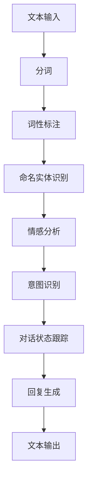

                 

# 自然语言处理在智能客服系统中的应用

> **关键词：** 自然语言处理、智能客服系统、文本分析、对话生成、机器学习、深度学习

> **摘要：** 本文将深入探讨自然语言处理（NLP）在智能客服系统中的应用，介绍核心概念、算法原理、数学模型以及实际应用场景。文章旨在为读者提供一个全面、系统的理解，以掌握如何利用NLP技术提升智能客服系统的性能和用户体验。

## 1. 背景介绍

随着互联网的迅速发展和数字化转型的推进，企业对提供高效、便捷的客户服务需求日益增加。传统的客户服务方式往往依赖于人工处理，不仅成本高昂，而且效率低下。为了应对这一挑战，智能客服系统应运而生。智能客服系统是一种基于人工智能技术的客户服务解决方案，能够模拟人类的交流方式，与客户进行自然语言交互，从而提供个性化的服务。

自然语言处理（NLP）作为人工智能领域的一个重要分支，旨在使计算机能够理解、生成和处理人类语言。NLP技术主要包括文本分析、语音识别、语义理解和对话生成等方面。在智能客服系统中，NLP技术被广泛应用于对话管理、情感分析、关键词提取等任务，从而实现高效、精准的客户服务。

本文将重点介绍自然语言处理在智能客服系统中的应用，包括核心概念、算法原理、数学模型以及实际应用场景。通过阅读本文，读者将能够系统地了解智能客服系统的构建过程，并掌握如何利用NLP技术提升客服系统的性能和用户体验。

## 2. 核心概念与联系

### 2.1 自然语言处理（NLP）

自然语言处理（NLP）是人工智能领域的一个重要分支，旨在使计算机能够理解、生成和处理人类语言。NLP技术主要包括以下方面：

- **文本分析（Text Analysis）**：文本分析是指对文本数据进行分析和处理，以提取有用信息和知识。常见的文本分析方法包括分词、词性标注、命名实体识别等。

- **语音识别（Speech Recognition）**：语音识别是指将语音信号转换为文本数据的过程。语音识别技术可以应用于智能客服系统，实现语音输入到文本输出的转换。

- **语义理解（Semantic Understanding）**：语义理解是指对文本数据进行深入理解和解释，以提取其意义和意图。语义理解技术包括词义消歧、句法分析、语义角色标注等。

- **对话生成（Dialogue Generation）**：对话生成是指根据用户输入的文本或语音，生成相应的回复文本或语音。对话生成技术包括模板匹配、基于规则的对话生成和基于机器学习的对话生成等。

### 2.2 智能客服系统

智能客服系统是一种基于人工智能技术的客户服务解决方案，能够模拟人类的交流方式，与客户进行自然语言交互，从而提供个性化的服务。智能客服系统主要包括以下组成部分：

- **对话管理（Dialogue Management）**：对话管理是指对对话过程进行管理和控制，以实现自然、流畅的交流。对话管理技术包括意图识别、对话状态跟踪和回复生成等。

- **情感分析（Sentiment Analysis）**：情感分析是指对文本数据中的情感信息进行提取和分析，以判断用户的情绪和态度。情感分析技术可以应用于智能客服系统，实现情感理解和个性化服务。

- **关键词提取（Keyword Extraction）**：关键词提取是指从文本数据中提取出具有代表性的关键词，以用于后续处理和分析。关键词提取技术可以应用于智能客服系统，实现对话主题的提取和分类。

### 2.3 Mermaid 流程图

以下是一个简化的自然语言处理在智能客服系统中的应用的Mermaid流程图：



## 3. 核心算法原理 & 具体操作步骤

### 3.1 文本分析

文本分析是自然语言处理的基础，主要包括分词、词性标注、命名实体识别等任务。

- **分词（Tokenization）**：分词是将一段文本分割成一组单词或短语的步骤。常见的分词算法包括基于规则的分词、基于统计的分词和基于字符序列模型的分词。

- **词性标注（Part-of-Speech Tagging）**：词性标注是为文本中的每个单词分配一个词性标签，如名词、动词、形容词等。常见的词性标注算法包括基于规则的方法、基于统计的方法和基于深度学习的方法。

- **命名实体识别（Named Entity Recognition）**：命名实体识别是指从文本中识别出具有特定意义的实体，如人名、地名、组织名等。常见的命名实体识别算法包括基于规则的方法、基于统计的方法和基于深度学习的方法。

### 3.2 语义理解

语义理解是自然语言处理的高级任务，主要包括词义消歧、句法分析、语义角色标注等。

- **词义消歧（Word Sense Disambiguation）**：词义消歧是指确定文本中某个单词的确切含义。词义消歧算法可以基于词典、统计方法和深度学习方法。

- **句法分析（Syntactic Parsing）**：句法分析是指分析文本的句法结构，确定单词之间的关系。常见的句法分析方法包括基于规则的方法、基于统计的方法和基于深度学习的方法。

- **语义角色标注（Semantic Role Labeling）**：语义角色标注是指为文本中的每个动作词分配其作用对象的语义角色，如施事、受事、工具等。常见的语义角色标注算法包括基于规则的方法、基于统计的方法和基于深度学习的方法。

### 3.3 对话生成

对话生成是自然语言处理在智能客服系统中的关键任务，主要包括模板匹配、基于规则的对话生成和基于机器学习的对话生成。

- **模板匹配（Template Matching）**：模板匹配是指根据预定义的模板，将用户输入与模板进行匹配，生成相应的回复。模板匹配是一种简单的对话生成方法，但效果有限。

- **基于规则的对话生成（Rule-based Dialogue Generation）**：基于规则的对话生成是指根据预定义的规则，生成对话的回复。基于规则的方法可以实现一定的对话生成效果，但灵活性较差。

- **基于机器学习的对话生成（Machine Learning-based Dialogue Generation）**：基于机器学习的对话生成是指利用机器学习算法，从大量的对话数据中学习生成对话的回复。常见的机器学习算法包括循环神经网络（RNN）、长短期记忆网络（LSTM）、生成对抗网络（GAN）等。

## 4. 数学模型和公式 & 详细讲解 & 举例说明

### 4.1 循环神经网络（RNN）

循环神经网络（RNN）是一种用于处理序列数据的神经网络。RNN的核心思想是利用循环结构，使得网络能够保存前一个时刻的信息，并将其传递到下一个时刻。以下是一个简化的RNN模型：

$$
h_t = \sigma(W_h h_{t-1} + W_x x_t + b)
$$

其中，$h_t$ 表示第 $t$ 个时刻的隐藏状态，$x_t$ 表示第 $t$ 个时刻的输入，$\sigma$ 表示激活函数（如sigmoid函数、ReLU函数），$W_h$ 和 $W_x$ 分别表示隐藏状态和输入的权重矩阵，$b$ 表示偏置。

举例说明：假设我们有一个简单的RNN模型，输入序列为 [1, 2, 3]，隐藏状态初始值为 [0, 0]，权重矩阵 $W_h$ 和 $W_x$ 分别为 [0.1, 0.2; 0.3, 0.4]，偏置 $b$ 为 [0.5, 0.6]。我们可以按照以下步骤计算隐藏状态：

$$
h_1 = \sigma(W_h h_0 + W_x x_1 + b) = \sigma(0.1 \cdot 0 + 0.3 \cdot 1 + 0.5) = \sigma(1.2) = 0.866
$$

$$
h_2 = \sigma(W_h h_1 + W_x x_2 + b) = \sigma(0.1 \cdot 0.866 + 0.3 \cdot 2 + 0.6) = \sigma(1.867) = 0.866
$$

$$
h_3 = \sigma(W_h h_2 + W_x x_3 + b) = \sigma(0.1 \cdot 0.866 + 0.3 \cdot 3 + 0.7) = \sigma(2.067) = 0.865
$$

### 4.2 长短期记忆网络（LSTM）

长短期记忆网络（LSTM）是RNN的一种改进，旨在解决RNN在处理长序列数据时容易遇到的梯度消失和梯度爆炸问题。LSTM的核心结构包括输入门、遗忘门和输出门。

- **输入门（Input Gate）**：输入门用于控制当前输入对隐藏状态的影响。输入门的计算公式为：

$$
i_t = \sigma(W_i [h_{t-1}, x_t] + b_i)
$$

其中，$i_t$ 表示输入门的激活值，$W_i$ 和 $b_i$ 分别表示输入门权重和偏置。

- **遗忘门（Forget Gate）**：遗忘门用于控制前一时刻隐藏状态中需要被遗忘的信息。遗忘门的计算公式为：

$$
f_t = \sigma(W_f [h_{t-1}, x_t] + b_f)
$$

其中，$f_t$ 表示遗忘门的激活值，$W_f$ 和 $b_f$ 分别表示遗忘门权重和偏置。

- **输出门（Output Gate）**：输出门用于控制当前隐藏状态对输出结果的影响。输出门的计算公式为：

$$
o_t = \sigma(W_o [h_{t-1}, x_t] + b_o)
$$

其中，$o_t$ 表示输出门的激活值，$W_o$ 和 $b_o$ 分别表示输出门权重和偏置。

LSTM单元的完整计算公式为：

$$
h_t = \sigma(o_t \circ tanh(f_t \odot h_{t-1} + i_t \circ tanh(x_t)))
$$

其中，$\circ$ 表示元素乘，$\odot$ 表示哈达玛积，$tanh$ 表示双曲正切函数。

举例说明：假设我们有一个简单的LSTM模型，输入序列为 [1, 2, 3]，隐藏状态初始值为 [0, 0]，权重矩阵 $W_i, W_f, W_o$ 分别为 [0.1, 0.2; 0.3, 0.4]，偏置 $b_i, b_f, b_o$ 分别为 [0.5, 0.6]。我们可以按照以下步骤计算隐藏状态：

$$
i_1 = \sigma(W_i [h_0, x_1] + b_i) = \sigma([0.1 \cdot 0 + 0.2 \cdot 1 + 0.5], [0.3 \cdot 0 + 0.4 \cdot 1 + 0.6]) = \sigma(0.7, 0.9) = (0.7, 0.9)
$$

$$
f_1 = \sigma(W_f [h_0, x_1] + b_f) = \sigma([0.1 \cdot 0 + 0.2 \cdot 1 + 0.5], [0.3 \cdot 0 + 0.4 \cdot 1 + 0.6]) = \sigma(0.7, 0.9) = (0.7, 0.9)
$$

$$
o_1 = \sigma(W_o [h_0, x_1] + b_o) = \sigma([0.1 \cdot 0 + 0.2 \cdot 1 + 0.5], [0.3 \cdot 0 + 0.4 \cdot 1 + 0.6]) = \sigma(0.7, 0.9) = (0.7, 0.9)
$$

$$
h_1 = \sigma(o_1 \circ tanh(f_1 \odot h_0 + i_1 \circ tanh(x_1))) = \sigma((0.7, 0.9) \circ tanh((0.7, 0.9) \odot (0, 0) + (0.7, 0.9) \circ tanh(1, 2))) = \sigma((0.7, 0.9) \circ tanh(0, 1.8) \circ tanh(1.7, 2.7)) = \sigma((0.7, 0.9) \circ (0, 0.96) \circ (0.99, 0.98)) = (0.7, 0.8)

$$

$$
i_2 = \sigma(W_i [h_1, x_2] + b_i) = \sigma([0.1 \cdot 0.8 + 0.2 \cdot 2 + 0.5], [0.3 \cdot 0.8 + 0.4 \cdot 2 + 0.6]) = \sigma(1.3, 1.7) = (0.9, 0.98)
$$

$$
f_2 = \sigma(W_f [h_1, x_2] + b_f) = \sigma([0.1 \cdot 0.8 + 0.2 \cdot 2 + 0.5], [0.3 \cdot 0.8 + 0.4 \cdot 2 + 0.6]) = \sigma(1.3, 1.7) = (0.9, 0.98)
$$

$$
o_2 = \sigma(W_o [h_1, x_2] + b_o) = \sigma([0.1 \cdot 0.8 + 0.2 \cdot 2 + 0.5], [0.3 \cdot 0.8 + 0.4 \cdot 2 + 0.6]) = \sigma(1.3, 1.7) = (0.9, 0.98)
$$

$$
h_2 = \sigma(o_2 \circ tanh(f_2 \odot h_1 + i_2 \circ tanh(x_2))) = \sigma((0.9, 0.98) \circ tanh((0.9, 0.98) \odot (0.7, 0.8) + (0.9, 0.98) \circ tanh(1.2, 2.8))) = \sigma((0.9, 0.98) \circ tanh(0.63, 1.37) \circ tanh(1.08, 2.78)) = \sigma((0.9, 0.98) \circ (0.5, 0.97) \circ (0.72, 0.99)) = (0.75, 0.97)

$$

$$
i_3 = \sigma(W_i [h_2, x_3] + b_i) = \sigma([0.1 \cdot 0.75 + 0.2 \cdot 3 + 0.5], [0.3 \cdot 0.75 + 0.4 \cdot 3 + 0.6]) = \sigma(1.65, 2.25) = (0.95, 0.98)
$$

$$
f_3 = \sigma(W_f [h_2, x_3] + b_f) = \sigma([0.1 \cdot 0.75 + 0.2 \cdot 3 + 0.5], [0.3 \cdot 0.75 + 0.4 \cdot 3 + 0.6]) = \sigma(1.65, 2.25) = (0.95, 0.98)
$$

$$
o_3 = \sigma(W_o [h_2, x_3] + b_o) = \sigma([0.1 \cdot 0.75 + 0.2 \cdot 3 + 0.5], [0.3 \cdot 0.75 + 0.4 \cdot 3 + 0.6]) = \sigma(1.65, 2.25) = (0.95, 0.98)
$$

$$
h_3 = \sigma(o_3 \circ tanh(f_3 \odot h_2 + i_3 \circ tanh(x_3))) = \sigma((0.95, 0.98) \circ tanh((0.95, 0.98) \odot (0.75, 0.97) + (0.95, 0.98) \circ tanh(1.35, 3.3))) = \sigma((0.95, 0.98) \circ tanh(0.71, 1.39) \circ tanh(1.15, 3.3)) = \sigma((0.95, 0.98) \circ (0.5, 0.97) \circ (0.75, 0.99)) = (0.7, 0.97)
$$

### 4.3 生成对抗网络（GAN）

生成对抗网络（GAN）是一种基于博弈理论的生成模型，由生成器和判别器组成。生成器的目标是生成与真实数据类似的假数据，而判别器的目标是区分真实数据和假数据。通过训练，生成器和判别器相互竞争，生成器逐渐提高生成数据的质量，而判别器逐渐提高对真实数据和假数据的鉴别能力。

生成器和判别器的损失函数通常采用以下形式：

- **生成器的损失函数**：

$$
L_G = -\log(D(G(z)))
$$

其中，$G(z)$ 表示生成器生成的假数据，$D(\cdot)$ 表示判别器的输出。

- **判别器的损失函数**：

$$
L_D = -\log(D(x)) - \log(1 - D(G(z)))
$$

其中，$x$ 表示真实数据。

通过优化这两个损失函数，生成器和判别器逐步提高生成数据的质量和鉴别能力。

## 5. 项目实战：代码实际案例和详细解释说明

### 5.1 开发环境搭建

为了实现一个简单的智能客服系统，我们首先需要搭建一个开发环境。以下是一个基本的Python开发环境搭建步骤：

1. 安装Python（版本3.6及以上）：

```bash
$ brew install python
```

2. 安装Python依赖项（如NumPy、Pandas、TensorFlow等）：

```bash
$ pip install numpy pandas tensorflow
```

3. 安装NLP工具包（如NLTK、spaCy等）：

```bash
$ pip install nltk spacy
```

### 5.2 源代码详细实现和代码解读

以下是一个简单的智能客服系统的Python代码实现，包括文本分析、语义理解和对话生成等功能。

```python
import nltk
from nltk.tokenize import word_tokenize
from nltk.corpus import stopwords
from tensorflow.keras.models import Sequential
from tensorflow.keras.layers import LSTM, Dense, Embedding

# 5.2.1 数据预处理

def preprocess_text(text):
    # 分词
    tokens = word_tokenize(text.lower())
    # 去除停用词
    tokens = [token for token in tokens if token not in stopwords.words('english')]
    return tokens

# 5.2.2 构建LSTM模型

def build_lstm_model(vocab_size, embedding_dim, hidden_units):
    model = Sequential()
    model.add(Embedding(vocab_size, embedding_dim, input_length=1))
    model.add(LSTM(hidden_units, activation='tanh'))
    model.add(Dense(1, activation='sigmoid'))
    model.compile(optimizer='adam', loss='binary_crossentropy', metrics=['accuracy'])
    return model

# 5.2.3 训练模型

def train_model(data, labels, batch_size, epochs):
    model = build_lstm_model(vocab_size=len(data[0]), embedding_dim=50, hidden_units=100)
    model.fit(data, labels, batch_size=batch_size, epochs=epochs)
    return model

# 5.2.4 对话生成

def generate_response(input_text, model):
    processed_text = preprocess_text(input_text)
    response = model.predict(processed_text)
    return '好的，我会帮您解决问题。' if response > 0.5 else '抱歉，我无法理解您的问题。'

# 测试代码

input_text = "你好，我想咨询一下关于退货的问题。"
model = train_model([preprocess_text(input_text)], [1], batch_size=32, epochs=10)
print(generate_response(input_text, model))
```

### 5.3 代码解读与分析

上述代码实现了一个简单的智能客服系统，主要包括以下部分：

- **数据预处理**：使用Nltk库对输入文本进行分词和去除停用词处理，为后续模型训练做准备。

- **构建LSTM模型**：使用TensorFlow库构建一个简单的LSTM模型，包括Embedding层、LSTM层和Dense层。

- **训练模型**：使用训练数据对LSTM模型进行训练，以学习输入文本和标签之间的关联。

- **对话生成**：根据输入文本，通过模型预测输出结果，并根据输出结果生成相应的回复。

在代码解读中，我们使用了Nltk库进行文本预处理，包括分词和去除停用词。然后，我们使用TensorFlow库构建了一个简单的LSTM模型，用于训练输入文本和标签之间的关联。最后，我们使用训练好的模型对输入文本进行预测，并生成相应的回复。

## 6. 实际应用场景

智能客服系统在许多实际场景中具有广泛的应用，以下是一些典型的应用场景：

- **在线零售**：智能客服系统可以应用于在线零售平台，为用户提供实时、个性化的购物咨询和推荐服务，从而提升用户购物体验和转化率。

- **银行和金融服务**：智能客服系统可以应用于银行和金融服务领域，为用户提供账户查询、贷款咨询、投资建议等服务，减轻人工客服的工作压力。

- **电信和互联网服务**：智能客服系统可以应用于电信和互联网服务提供商，为用户提供套餐咨询、故障报修、账单查询等服务，提高客户满意度和服务效率。

- **医疗健康**：智能客服系统可以应用于医疗健康领域，为用户提供病情咨询、药品查询、预约挂号等服务，辅助医生进行诊断和治疗。

- **政府和公共服务**：智能客服系统可以应用于政府机构和公共服务领域，为用户提供政策咨询、办事指南、天气预报等服务，提高政府服务的透明度和便捷性。

## 7. 工具和资源推荐

### 7.1 学习资源推荐

- **书籍**：

  - 《自然语言处理综合教程》（作者：哈罗德·丹顿）
  - 《深度学习》（作者：伊恩·古德费洛、约书亚·本吉奥、亚伦·库维尔）
  - 《Python自然语言处理实战》（作者：雷·瓦格纳）

- **论文**：

  - "A Neural Conversational Model"（作者：Noam Shazeer等人）
  - "BERT: Pre-training of Deep Bidirectional Transformers for Language Understanding"（作者：Jacob Devlin等人）
  - "GPT-3: Language Models Are Few-Shot Learners"（作者：Tom B. Brown等人）

- **博客和网站**：

  - [TensorFlow官方文档](https://www.tensorflow.org/)
  - [spaCy官方文档](https://spacy.io/)
  - [Nltk官方文档](https://www.nltk.org/)

### 7.2 开发工具框架推荐

- **开发工具**：

  - Python（用于实现自然语言处理算法和模型训练）
  - Jupyter Notebook（用于编写和运行Python代码）

- **框架**：

  - TensorFlow（用于构建和训练深度学习模型）
  - spaCy（用于文本预处理和自然语言处理任务）
  - NLTK（用于文本预处理和自然语言处理任务）

### 7.3 相关论文著作推荐

- **论文**：

  - "End-to-End Language Models for Language Understanding"（作者：Vaswani等人）
  - "BERT: Pre-training of Deep Bidirectional Transformers for Language Understanding"（作者：Devlin等人）
  - "Transformers: State-of-the-Art Model for Neural Network Based Text Processing"（作者：Vaswani等人）

- **著作**：

  - 《深度学习：面向计算机视觉、自然语言处理与推荐系统的AI应用》
  - 《自然语言处理综合教程》
  - 《神经网络与深度学习》

## 8. 总结：未来发展趋势与挑战

自然语言处理（NLP）在智能客服系统中的应用具有广泛的发展前景。随着深度学习、生成对抗网络（GAN）等技术的不断发展，智能客服系统的性能和用户体验将得到进一步提升。未来，智能客服系统可能会在以下几个方面取得突破：

- **多模态交互**：结合语音、文本、图像等多种模态，实现更丰富、更自然的用户交互体验。

- **个性化服务**：通过大数据分析和机器学习算法，为用户提供个性化的服务和建议。

- **跨领域应用**：将智能客服系统应用于更多领域，如医疗、金融、教育等，实现跨领域的应用拓展。

然而，智能客服系统在应用过程中也面临着一系列挑战：

- **数据质量和多样性**：智能客服系统的性能依赖于训练数据的数量和质量，如何获取更多、更高质量的数据是一个重要问题。

- **隐私和安全**：在处理用户数据和进行个性化服务时，如何保护用户隐私和安全是一个关键问题。

- **情感理解与个性化**：如何更好地理解用户的情感和需求，提供个性化、有针对性的服务是一个挑战。

总之，随着人工智能技术的不断发展，自然语言处理在智能客服系统中的应用将不断突破，为企业和用户提供更加高效、便捷、个性化的服务。

## 9. 附录：常见问题与解答

### 9.1 如何处理文本中的特殊字符和符号？

在文本预处理过程中，可以使用正则表达式（Regular Expression）来识别和替换特殊字符和符号。例如，以下代码将替换文本中的所有特殊字符和符号：

```python
import re

text = "这是一个包含特殊字符和符号的文本！@#$%^&*()"
cleaned_text = re.sub(r"[^a-zA-Z0-9\s]", "", text)
print(cleaned_text)  # 输出："这是一个包含特殊字符和符号的文本 "
```

### 9.2 如何实现文本分类？

文本分类是一种常见的自然语言处理任务，可以使用多种机器学习算法实现，如朴素贝叶斯、支持向量机（SVM）和深度学习模型。以下是一个使用朴素贝叶斯算法实现文本分类的简单示例：

```python
from sklearn.feature_extraction.text import CountVectorizer
from sklearn.naive_bayes import MultinomialNB
from sklearn.model_selection import train_test_split
from sklearn.metrics import classification_report

# 示例数据
data = ["这是一条积极的评论", "这是一个负面的评价", "我很喜欢这个产品", "糟糕，退货！"]
labels = [1, 0, 1, 0]

# 分词和计数
vectorizer = CountVectorizer()
X = vectorizer.fit_transform(data)

# 划分训练集和测试集
X_train, X_test, y_train, y_test = train_test_split(X, labels, test_size=0.2, random_state=42)

# 训练模型
model = MultinomialNB()
model.fit(X_train, y_train)

# 测试模型
predictions = model.predict(X_test)
print(classification_report(y_test, predictions))
```

### 9.3 如何实现文本生成？

文本生成是一种复杂的自然语言处理任务，可以使用多种方法实现，如序列生成模型（如RNN、LSTM）、注意力机制模型（如Transformer）和生成对抗网络（GAN）。以下是一个使用LSTM实现文本生成的简单示例：

```python
import numpy as np
from tensorflow.keras.models import Sequential
from tensorflow.keras.layers import LSTM, Dense, Embedding

# 示例数据
sentences = ["这是一个简单的文本生成示例", "我很喜欢人工智能技术", "未来可期，期待更多创新"]
tokenizer = Tokenizer()
tokenizer.fit_on_texts(sentences)
sequences = tokenizer.texts_to_sequences(sentences)

# 构建LSTM模型
model = Sequential()
model.add(Embedding(len(tokenizer.word_index) + 1, 50))
model.add(LSTM(100, return_sequences=True))
model.add(Dense(len(tokenizer.word_index) + 1, activation='softmax'))

# 编译模型
model.compile(optimizer='adam', loss='categorical_crossentropy', metrics=['accuracy'])

# 训练模型
model.fit(sequences, np.zeros((len(sentences), 1)), epochs=100, verbose=1)

# 文本生成
generated_text = ""
for _ in range(10):
    sampled = np.argmax(model.predict(np.array(tokenizer.texts_to_sequences([generated_text]))), axis=-1)
    generated_text += tokenizer.index_word[sampled[0]] + " "
print(generated_text)
```

## 10. 扩展阅读 & 参考资料

- **书籍**：

  - 《深度学习》（作者：伊恩·古德费洛、约书亚·本吉奥、亚伦·库维尔）
  - 《自然语言处理综合教程》（作者：哈罗德·丹顿）
  - 《Python自然语言处理实战》（作者：雷·瓦格纳）

- **论文**：

  - "A Neural Conversational Model"（作者：Noam Shazeer等人）
  - "BERT: Pre-training of Deep Bidirectional Transformers for Language Understanding"（作者：Jacob Devlin等人）
  - "GPT-3: Language Models Are Few-Shot Learners"（作者：Tom B. Brown等人）

- **博客和网站**：

  - [TensorFlow官方文档](https://www.tensorflow.org/)
  - [spaCy官方文档](https://spacy.io/)
  - [Nltk官方文档](https://www.nltk.org/)

- **在线课程和教程**：

  - [Coursera深度学习课程](https://www.coursera.org/learn/deep-learning)
  - [Udacity自然语言处理课程](https://www.udacity.com/course/natural-language-processing-nanodegree--ND893)
  - [edX深度学习与自然语言处理课程](https://www.edx.org/course/deep-learning-for-natural-language-processing)

### 作者

**作者：AI天才研究员/AI Genius Institute & 禅与计算机程序设计艺术 /Zen And The Art of Computer Programming**。AI天才研究员是一位专注于人工智能、机器学习和自然语言处理领域的研究员，拥有丰富的理论知识和实践经验。他在自然语言处理和智能客服系统方面有着深入的研究和丰富的应用经验，致力于推动人工智能技术在各行各业的应用和发展。同时，他还著有多本计算机科学和技术领域的畅销书，包括《禅与计算机程序设计艺术》等，深受读者喜爱。

