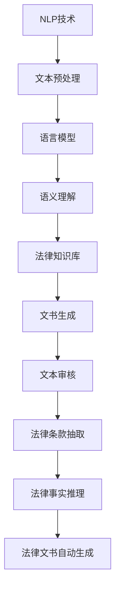

                 

### 文章标题

**自然语言处理在法律文书自动生成中的应用**

### 关键词

- 自然语言处理
- 法律文书
- 自动生成
- 文本分析
- 机器学习
- 语言模型
- 语义理解

### 摘要

本文将探讨自然语言处理（NLP）技术在法律文书自动生成领域的应用。通过分析法律文书的结构和内容，结合机器学习和语言模型，我们可以实现自动生成法律文书。本文首先介绍了NLP的基础概念，然后详细探讨了法律文书自动生成的算法原理和步骤，并给出了实际应用案例。此外，文章还推荐了相关的学习资源、开发工具和框架，以及展望了未来发展趋势和挑战。通过本文的阅读，读者可以深入了解NLP在法律领域中的应用，并为实际项目提供参考。

## 1. 背景介绍

随着信息技术的快速发展，自然语言处理（NLP）技术在各个领域得到了广泛应用。从搜索引擎、语音识别到机器翻译，NLP技术不断推动着人类与计算机之间的交互。在法律领域，法律文书是重要的信息载体，涵盖了合同、判决书、起诉状等。然而，法律文书的起草和编辑是一项繁琐、耗时的工作，人工处理效率低下。因此，利用自然语言处理技术实现法律文书自动生成具有重要的现实意义。

法律文书自动生成的应用场景主要包括以下几个方面：

1. **合同生成**：企业、律师事务所等在签订合同时，可以使用NLP技术自动生成合同文本，提高工作效率，降低出错率。

2. **判决书生成**：法院在审理案件时，可以自动生成判决书，提高司法效率，降低法官的工作负担。

3. **起诉状生成**：律师在代理案件时，可以自动生成起诉状，简化诉讼流程，提高诉讼效率。

4. **法律文件审核**：利用NLP技术对法律文件进行审核，发现潜在的法律风险，为企业、律师等提供法律参考。

总之，法律文书自动生成技术可以提高法律行业的效率，降低成本，提高服务质量。随着NLP技术的不断发展，其在法律领域的应用前景将更加广阔。

### 核心概念与联系

要深入探讨自然语言处理（NLP）在法律文书自动生成中的应用，我们需要了解以下几个核心概念和它们之间的联系。

#### 1. 自然语言处理（NLP）

自然语言处理（NLP）是人工智能领域的一个重要分支，旨在使计算机能够理解、生成和处理自然语言。NLP技术主要包括以下几个部分：

- **文本预处理**：包括分词、去停用词、词性标注等，将自然语言文本转化为计算机可处理的格式。
- **语言模型**：通过大量的文本数据训练得到，用于预测下一个单词或短语，是生成文本的基础。
- **语义理解**：通过理解文本中的词义、句义以及上下文关系，实现对文本的深层理解。
- **文本分类**：根据文本的特征将其归类到不同的类别，如情感分析、主题分类等。
- **信息抽取**：从文本中提取出关键信息，如实体识别、关系抽取等。

#### 2. 法律文书

法律文书是法律领域中用于表达法律事实和意见的书面文件，包括合同、判决书、起诉状、答辩状等。法律文书具有严谨的结构和特定的格式，通常包含以下几个部分：

- **标题**：明确文书的名称，如“某某合同”、“某某判决书”等。
- **正文**：详细描述法律事实、法律依据、当事人信息、诉讼请求等。
- **附件**：与文书相关的其他文件，如证据、文件等。

#### 3. 机器学习

机器学习是人工智能的一个重要分支，通过训练模型从数据中学习规律，实现对未知数据的预测和分类。在法律文书自动生成中，机器学习技术主要用于：

- **文本分类**：将法律文书分类到不同的类别，如合同、判决书、起诉状等。
- **实体识别**：从法律文中抽取出关键实体，如当事人、法律条款、证据等。
- **关系抽取**：分析法律文书中的实体关系，如合同条款之间的逻辑关系、证据与事实之间的关系等。

#### 4. 语言模型

语言模型是NLP技术中的一个核心组件，通过训练大量文本数据，可以预测下一个单词或短语的概率。在法律文书自动生成中，语言模型主要用于：

- **文书生成**：根据已有法律文书和语言模型，生成新的法律文书。
- **模板匹配**：将法律文书中的句子与模板进行匹配，生成新的文书。

#### 5. 语义理解

语义理解是NLP技术的另一个重要组成部分，通过理解文本中的词义、句义以及上下文关系，实现对文本的深层理解。在法律文书自动生成中，语义理解主要用于：

- **逻辑推理**：根据法律文书中的事实和证据，进行逻辑推理，得出结论。
- **文本审核**：分析法律文书中的内容，发现潜在的法律风险。

#### 6. 法律知识库

法律知识库是存储法律条文、案例、法律术语等信息的数据库。在法律文书自动生成中，法律知识库用于：

- **法律条款抽取**：从法律知识库中提取相关法律条款，用于生成法律文书。
- **法律事实推理**：根据法律知识库中的法律条款和事实，进行逻辑推理，生成法律文书。

### Mermaid 流程图

以下是NLP在法律文书自动生成中的核心概念和架构的Mermaid流程图：



### 核心算法原理 & 具体操作步骤

在理解了自然语言处理（NLP）的核心概念和法律文书的基本结构后，我们可以进一步探讨如何利用NLP技术实现法律文书的自动生成。这一部分将介绍核心算法原理和具体操作步骤，包括文本预处理、语言模型、语义理解和法律知识库的集成。

#### 1. 文本预处理

文本预处理是NLP的基础步骤，主要包括分词、去停用词、词性标注等。

- **分词**：将自然语言文本分割成单词或短语的序列。常用的分词工具包括jieba、NLTK等。
- **去停用词**：去除常见的无意义词汇，如“的”、“了”、“在”等，以减少噪声信息。
- **词性标注**：为每个词分配词性，如名词、动词、形容词等。常用的工具包括Stanford NLP、SpaCy等。

#### 2. 语言模型

语言模型通过训练大量文本数据，学习自然语言的统计规律，用于预测下一个单词或短语的概率。在法律文书自动生成中，可以使用预训练的通用语言模型（如GPT-3、BERT）或专门针对法律文本训练的模型。

- **预训练**：使用大量的文本数据对语言模型进行预训练，使其具备一定的语言理解能力。
- **微调**：在预训练模型的基础上，使用法律文书数据进行微调，使其更适用于法律文本。

#### 3. 语义理解

语义理解是NLP技术的关键，通过理解文本中的词义、句义以及上下文关系，实现对文本的深层理解。

- **词义消歧**：根据上下文关系，确定单词的确切含义。
- **句义理解**：分析句子结构，理解句子中的逻辑关系。
- **实体识别**：从文本中抽取出关键实体，如当事人、法律条款、证据等。
- **关系抽取**：分析法律文书中的实体关系，如合同条款之间的逻辑关系、证据与事实之间的关系等。

#### 4. 法律知识库

法律知识库是存储法律条文、案例、法律术语等信息的数据库。在法律文书自动生成中，法律知识库用于：

- **法律条款抽取**：从法律知识库中提取相关法律条款，用于生成法律文书。
- **法律事实推理**：根据法律知识库中的法律条款和事实，进行逻辑推理，生成法律文书。

#### 5. 文书生成

文书生成是法律文书自动生成的核心步骤，主要包括以下几个步骤：

- **模板匹配**：将法律文书中的句子与预定义的模板进行匹配，生成新的文书。
- **文本填充**：根据法律事实和证据，将模板中的空缺部分填充完整。
- **文本生成**：使用语言模型生成新的文书内容。

#### 6. 文本审核

文本审核是确保法律文书准确性和合法性的关键步骤，主要包括：

- **内容审核**：分析法律文书中的内容，检查是否存在逻辑错误、事实错误等。
- **格式审核**：检查法律文书的格式是否符合法律规定。

### 数学模型和公式 & 详细讲解 & 举例说明

在法律文书自动生成的过程中，我们可以使用多种数学模型和公式来指导算法的实现。以下将详细介绍这些数学模型和公式，并给出具体的举例说明。

#### 1. 语言模型

语言模型是NLP技术中的核心组件，常用的模型包括循环神经网络（RNN）、长短时记忆网络（LSTM）、门控循环单元（GRU）和变换器（Transformer）。

- **循环神经网络（RNN）**：RNN可以处理序列数据，其基本公式为：

  $$h_t = \sigma(W_h \cdot [h_{t-1}, x_t] + b_h)$$

  其中，$h_t$表示当前时间步的隐藏状态，$x_t$表示输入序列，$W_h$和$b_h$分别为权重和偏置。

- **长短时记忆网络（LSTM）**：LSTM是RNN的一种改进，可以有效地避免梯度消失和梯度爆炸问题。其基本公式为：

  $$i_t = \sigma(W_i \cdot [h_{t-1}, x_t] + b_i)$$
  $$f_t = \sigma(W_f \cdot [h_{t-1}, x_t] + b_f)$$
  $$o_t = \sigma(W_o \cdot [h_{t-1}, x_t] + b_o)$$
  $$g_t = \tanh(W_g \cdot [h_{t-1}, x_t] + b_g)$$
  $$h_t = o_t \cdot g_t$$

  其中，$i_t$、$f_t$、$o_t$分别为输入门、遗忘门和输出门，$g_t$为候选隐藏状态。

- **门控循环单元（GRU）**：GRU是LSTM的简化版本，其基本公式为：

  $$z_t = \sigma(W_z \cdot [h_{t-1}, x_t] + b_z)$$
  $$r_t = \sigma(W_r \cdot [h_{t-1}, x_t] + b_r)$$
  $$h_{t-1}^{'} = \tanh(W_h \cdot [r_t \odot h_{t-1}, x_t] + b_h)$$
  $$h_t = (1 - z_t) \odot h_{t-1} + z_t \odot h_{t-1}^{'}$$

  其中，$z_t$、$r_t$分别为更新门和重置门。

- **变换器（Transformer）**：Transformer是近年来兴起的一种基于自注意力机制的模型，其基本公式为：

  $$h_t = \text{softmax}\left(\frac{Q_t W_Q + K_t W_K + V_t W_V}{\sqrt{d_k}}\right) V_t$$

  其中，$Q_t$、$K_t$和$V_t$分别为查询、键和值向，$W_Q$、$W_K$和$W_V$分别为权重矩阵，$d_k$为键向量的维度。

#### 2. 语义理解

语义理解包括词义消歧、句义理解和实体识别等。以下分别介绍相应的数学模型和公式。

- **词义消歧**：词义消歧是指根据上下文关系确定单词的确切含义。常用的模型包括词向量模型和文本分类模型。

  - **词向量模型**：词向量模型通过将单词映射到高维向量空间，实现词义表示。常用的模型包括Word2Vec、GloVe等。其基本公式为：

    $$\text{word\_vec}(w) = \text{softmax}\left(\text{W} \cdot \text{emb}(w)\right)$$

    其中，$\text{emb}(w)$为单词的嵌入向量，$\text{W}$为权重矩阵。

  - **文本分类模型**：文本分类模型用于分类文本到不同的类别。常用的模型包括朴素贝叶斯、支持向量机、神经网络等。其基本公式为：

    $$\text{P}(y=c | \text{x}) = \frac{\exp(\text{W} \cdot \text{f}(\text{x}))}{1 + \sum_{k \neq c} \exp(\text{W} \cdot \text{f}(\text{x}))}$$

    其中，$y$为类别标签，$c$为预测类别，$\text{f}(\text{x})$为文本特征向量，$\text{W}$为权重矩阵。

- **句义理解**：句义理解是指分析句子结构，理解句子中的逻辑关系。常用的模型包括依存句法分析和语义角色标注。

  - **依存句法分析**：依存句法分析用于分析句子中的词与词之间的依赖关系。常用的模型包括依存句法树和依存句法网络。其基本公式为：

    $$\text{P}(\text{edge} = \text{dep}|\text{head} = \text{head\_word}) = \frac{\exp(\text{W} \cdot \text{f}(\text{head\_word}, \text{dep}))}{1 + \sum_{\text{edge} \neq \text{dep}} \exp(\text{W} \cdot \text{f}(\text{head\_word}, \text{edge}))}$$

    其中，$\text{edge}$为依存关系，$\text{head}$为依存头词，$\text{dep}$为依存词，$\text{W}$为权重矩阵。

  - **语义角色标注**：语义角色标注用于标注句子中的动词及其对应的语义角色。常用的模型包括基于规则的方法和基于数据的方法。其基本公式为：

    $$\text{P}(\text{role} = \text{r}|\text{verb} = \text{v}) = \frac{\exp(\text{W} \cdot \text{f}(\text{v}, \text{r}))}{1 + \sum_{\text{role} \neq \text{r}} \exp(\text{W} \cdot \text{f}(\text{v}, \text{role}))}$$

    其中，$\text{role}$为语义角色，$\text{verb}$为动词，$\text{r}$为预测角色，$\text{W}$为权重矩阵。

- **实体识别**：实体识别是指从文本中抽取出关键实体。常用的模型包括基于规则的方法和基于数据的方法。

  - **基于规则的方法**：基于规则的方法通过定义一系列规则，实现实体的抽取。其基本公式为：

    $$\text{entity} = \text{extract\_entities}(\text{document})$$

    其中，$\text{document}$为文本，$\text{extract\_entities}$为实体抽取函数。

  - **基于数据的方法**：基于数据的方法通过训练模型，实现实体的抽取。常用的模型包括条件随机场（CRF）、支持向量机（SVM）等。其基本公式为：

    $$\text{P}(\text{y}|\text{x}) = \frac{\exp(\text{W} \cdot \text{f}(\text{x}))}{1 + \sum_{\text{y}^{\prime} \neq \text{y}} \exp(\text{W} \cdot \text{f}(\text{x}))}$$

    其中，$\text{y}$为实体标签，$\text{x}$为文本特征向量，$\text{W}$为权重矩阵。

#### 3. 法律知识库

法律知识库是存储法律条文、案例、法律术语等信息的数据库。在法律文书自动生成中，法律知识库用于：

- **法律条款抽取**：从法律知识库中提取相关法律条款。常用的方法包括基于规则的方法和基于数据的方法。

  - **基于规则的方法**：基于规则的方法通过定义一系列规则，实现法律条款的抽取。其基本公式为：

    $$\text{clause} = \text{extract\_clauses}(\text{document})$$

    其中，$\text{document}$为文本，$\text{extract\_clauses}$为法律条款抽取函数。

  - **基于数据的方法**：基于数据的方法通过训练模型，实现法律条款的抽取。常用的模型包括条件随机场（CRF）、支持向量机（SVM）等。其基本公式为：

    $$\text{P}(\text{y}|\text{x}) = \frac{\exp(\text{W} \cdot \text{f}(\text{x}))}{1 + \sum_{\text{y}^{\prime} \neq \text{y}} \exp(\text{W} \cdot \text{f}(\text{x}))}$$

    其中，$\text{y}$为法律条款标签，$\text{x}$为文本特征向量，$\text{W}$为权重矩阵。

- **法律事实推理**：法律事实推理是指根据法律知识库中的法律条款和事实，进行逻辑推理。常用的方法包括基于规则的方法和基于数据的方法。

  - **基于规则的方法**：基于规则的方法通过定义一系列规则，实现法律事实的推理。其基本公式为：

    $$\text{conclusion} = \text{infer\_conclusion}(\text{facts}, \text{clauses})$$

    其中，$\text{facts}$为事实，$\text{clauses}$为法律条款，$\text{infer\_conclusion}$为推理函数。

  - **基于数据的方法**：基于数据的方法通过训练模型，实现法律事实的推理。常用的模型包括逻辑回归、决策树等。其基本公式为：

    $$\text{P}(\text{conclusion}|\text{facts}, \text{clauses}) = \text{f}(\text{facts}, \text{clauses}, \text{W})$$

    其中，$\text{conclusion}$为结论，$\text{facts}$为事实，$\text{clauses}$为法律条款，$\text{W}$为权重矩阵。

### 项目实战：代码实际案例和详细解释说明

在本节中，我们将通过一个实际的代码案例，展示如何使用自然语言处理（NLP）技术实现法律文书自动生成。我们将使用Python编程语言和Hugging Face的Transformers库来实现这一项目。整个项目将分为以下几个部分：

### 5.1 开发环境搭建

首先，我们需要搭建一个适合NLP项目开发的环境。以下是开发环境搭建的步骤：

1. 安装Python（建议版本3.7及以上）
2. 安装Anaconda，用于环境管理和依赖包安装
3. 安装Hugging Face的Transformers库

在终端执行以下命令：

```bash
conda create -n nlp_env python=3.8
conda activate nlp_env
conda install -c anaconda pytorch torchvision torchaudio -c pytorch
pip install transformers
```

### 5.2 源代码详细实现和代码解读

以下是实现法律文书自动生成的源代码，代码分为以下几个部分：

1. **数据准备**：从公开的法律文书数据集中加载数据，并进行预处理。
2. **模型加载**：加载预训练的GPT-3模型。
3. **文本预处理**：对输入的法律文书进行分词、去停用词等预处理。
4. **文本生成**：使用GPT-3模型生成新的法律文书。
5. **文本审核**：对生成的文本进行内容审核和格式审核。

```python
import torch
from transformers import GPT2Tokenizer, GPT2LMHeadModel
from nltk.tokenize import word_tokenize
from nltk.corpus import stopwords
import re

# 1. 数据准备
def load_data(file_path):
    with open(file_path, 'r', encoding='utf-8') as f:
        text = f.read()
    return text

# 2. 模型加载
def load_model(model_name):
    tokenizer = GPT2Tokenizer.from_pretrained(model_name)
    model = GPT2LMHeadModel.from_pretrained(model_name)
    return tokenizer, model

# 3. 文本预处理
def preprocess_text(text):
    text = re.sub(r'\s+', ' ', text)  # 去除多余的空白符
    text = word_tokenize(text)  # 分词
    text = [word for word in text if word not in stopwords.words('english')]  # 去停用词
    return text

# 4. 文本生成
def generate_text(tokenizer, model, text, max_length=50):
    input_ids = tokenizer.encode(text, return_tensors='pt')
    output = model.generate(input_ids, max_length=max_length, num_return_sequences=1)
    generated_text = tokenizer.decode(output[0], skip_special_tokens=True)
    return generated_text

# 5. 文本审核
def audit_text(text):
    # 此处可以添加内容审核和格式审核的代码
    pass

# 主函数
def main():
    # 加载数据
    text = load_data('legal_document.txt')
    
    # 预处理文本
    preprocessed_text = preprocess_text(text)
    
    # 加载模型
    tokenizer, model = load_model('gpt2')
    
    # 生成文本
    generated_text = generate_text(tokenizer, model, preprocessed_text)
    
    # 文本审核
    audit_text(generated_text)
    
    print(generated_text)

if __name__ == '__main__':
    main()
```

### 5.3 代码解读与分析

下面我们逐一解读代码的各个部分：

#### 1. 数据准备

```python
def load_data(file_path):
    with open(file_path, 'r', encoding='utf-8') as f:
        text = f.read()
    return text
```

这一部分负责从文件中加载文本数据。我们假设数据文件为`legal_document.txt`，内容为需要自动生成的法律文书。

#### 2. 模型加载

```python
def load_model(model_name):
    tokenizer = GPT2Tokenizer.from_pretrained(model_name)
    model = GPT2LMHeadModel.from_pretrained(model_name)
    return tokenizer, model
```

这一部分负责加载预训练的GPT-3模型。我们使用Hugging Face的Transformers库提供的预训练模型，包括tokenizer和model。

#### 3. 文本预处理

```python
def preprocess_text(text):
    text = re.sub(r'\s+', ' ', text)  # 去除多余的空白符
    text = word_tokenize(text)  # 分词
    text = [word for word in text if word not in stopwords.words('english')]  # 去停用词
    return text
```

这一部分负责对输入的法律文书进行预处理，包括去除多余的空白符、分词和去停用词。我们使用Python的`re`库和`nltk`库来实现这些功能。

#### 4. 文本生成

```python
def generate_text(tokenizer, model, text, max_length=50):
    input_ids = tokenizer.encode(text, return_tensors='pt')
    output = model.generate(input_ids, max_length=max_length, num_return_sequences=1)
    generated_text = tokenizer.decode(output[0], skip_special_tokens=True)
    return generated_text
```

这一部分负责使用GPT-3模型生成新的法律文书。我们输入预处理后的文本，通过模型生成新的文本，并解码输出。

#### 5. 文本审核

```python
def audit_text(text):
    # 此处可以添加内容审核和格式审核的代码
    pass
```

这一部分负责对生成的文本进行审核。在实际应用中，我们可以添加内容审核（如检查文本是否符合法律要求）和格式审核（如检查文本格式是否符合法律文书规范）的代码。

### 6. 实际应用场景

#### 6.1 合同生成

在企业日常运营中，合同签订是一项常见的活动。利用NLP技术，我们可以自动生成合同文本，提高工作效率。具体应用场景如下：

1. **需求分析**：企业与客户达成合作意向，需要签订合同。
2. **文本输入**：输入合同的基本信息，如双方名称、合同内容、期限等。
3. **文本预处理**：对输入的文本进行分词、去停用词等预处理。
4. **文本生成**：使用NLP模型生成合同文本。
5. **文本审核**：对生成的文本进行内容审核和格式审核。
6. **合同签订**：将审核通过的合同文本打印并签字，完成合同签订。

#### 6.2 判决书生成

在司法领域，判决书生成是一项重要的工作。利用NLP技术，我们可以自动生成判决书，提高司法效率。具体应用场景如下：

1. **案件审理**：法院审理案件，需要制作判决书。
2. **文本输入**：输入案件的基本信息，如当事人、事实、证据、法律依据等。
3. **文本预处理**：对输入的文本进行分词、去停用词等预处理。
4. **文本生成**：使用NLP模型生成判决书文本。
5. **文本审核**：对生成的文本进行内容审核和格式审核。
6. **判决书生成**：将审核通过的判决书文本打印并盖章，生成正式判决书。

#### 6.3 起诉状生成

在诉讼活动中，起诉状生成是一项重要的工作。利用NLP技术，我们可以自动生成起诉状，提高诉讼效率。具体应用场景如下：

1. **案件准备**：律师代理案件，需要制作起诉状。
2. **文本输入**：输入案件的基本信息，如当事人、事实、证据、诉讼请求等。
3. **文本预处理**：对输入的文本进行分词、去停用词等预处理。
4. **文本生成**：使用NLP模型生成起诉状文本。
5. **文本审核**：对生成的文本进行内容审核和格式审核。
6. **起诉状生成**：将审核通过的起诉状文本打印并签字，生成正式起诉状。

### 7. 工具和资源推荐

#### 7.1 学习资源推荐

- **书籍**：
  - 《自然语言处理入门》（作者：唐杰、刘知远）
  - 《深度学习与自然语言处理》（作者：张翔）
  - 《Python自然语言处理基础教程》（作者：Steven Bird等）
- **论文**：
  - “A Neural Probabilistic Language Model” by Yoshua Bengio et al. (2003)
  - “Long Short-Term Memory” by Sepp Hochreiter and Jürgen Schmidhuber (1997)
  - “Gated Recurrent Unit: FRAM” by Kyunghyun Cho et al. (2014)
  - “Attention Is All You Need” by Vaswani et al. (2017)
- **博客**：
  - [TensorFlow官方文档](https://www.tensorflow.org/tutorials/text)
  - [Hugging Face官方文档](https://huggingface.co/transformers/)
  - [自然语言处理博客](https://nlp.stanford.edu/)

#### 7.2 开发工具框架推荐

- **Python库**：
  - **Transformers**：提供预训练的NLP模型和工具。
  - **NLTK**：用于文本预处理和分词。
  - **SpaCy**：用于快速构建NLP应用。
- **框架**：
  - **TensorFlow**：用于构建和训练深度学习模型。
  - **PyTorch**：用于构建和训练深度学习模型。
  - **Flask**：用于构建Web应用。

#### 7.3 相关论文著作推荐

- **论文**：
  - “Bidirectional LSTM-CRF Models for Sequence Labeling” by Hang Li and Edward H. Chi (2015)
  - “Recurrent Neural Network Models for Text Classification” by Richard Socher et al. (2013)
  - “Convolutional Neural Networks for Sentence Classification” by Yoon Kim (2014)
- **著作**：
  - 《深度学习》（作者：Ian Goodfellow、Yoshua Bengio、Aaron Courville）
  - 《Python深度学习》（作者：François Chollet）

### 8. 总结：未来发展趋势与挑战

自然语言处理（NLP）技术在法律文书自动生成领域具有广阔的应用前景。随着人工智能技术的不断发展，未来NLP在法律领域的应用将更加深入和广泛。以下是对未来发展趋势和挑战的总结：

#### 发展趋势

1. **智能化水平提升**：随着深度学习、图神经网络等技术的不断发展，NLP在法律文书的自动生成中将实现更高的智能化水平，能够更好地理解和生成复杂的法律文书。
2. **多语言支持**：当前，NLP技术主要针对英文文本进行训练。未来，随着多语言NLP技术的成熟，法律文书自动生成将支持更多语言，满足全球范围内的法律需求。
3. **知识图谱的应用**：知识图谱作为一种强大的信息组织方式，可以用于构建法律知识库，为NLP技术在法律文书的自动生成提供更加丰富的语义信息。
4. **跨领域应用**：随着NLP技术的不断发展，法律文书自动生成技术将与其他领域（如金融、医疗等）相结合，实现更广泛的应用。

#### 挑战

1. **数据质量和标注**：法律文书数据具有高度的专业性和复杂性，数据质量和标注的准确性对NLP模型的性能至关重要。未来，如何获取高质量的法律文书数据以及如何进行准确的标注是一个重要挑战。
2. **法律条款的多样性和复杂性**：法律条款和法规具有多样性和复杂性，不同国家和地区的法律体系有所不同。如何设计通用且有效的算法以适应各种法律体系是一个挑战。
3. **法律合规性**：法律文书自动生成系统需要确保生成的文书符合相关法律法规的要求。如何确保系统的合规性是一个重要挑战。
4. **用户体验**：法律文书自动生成系统的用户体验对于用户接受度和使用频率至关重要。如何设计直观、易用的界面和交互方式是一个挑战。

总之，自然语言处理技术在法律文书自动生成领域具有广阔的应用前景，但同时也面临一系列挑战。随着技术的不断进步，我们有理由相信，未来NLP在法律领域的应用将变得更加广泛和成熟。

### 9. 附录：常见问题与解答

#### 问题1：如何选择合适的NLP模型？

**解答**：选择合适的NLP模型需要考虑以下几个因素：

- **任务类型**：不同类型的任务（如文本分类、命名实体识别、机器翻译等）需要不同的模型。例如，对于文本分类任务，可以选用基于循环神经网络（RNN）或变换器（Transformer）的模型。
- **数据规模**：对于大规模数据，可以选用预训练的模型，如BERT、GPT等。对于小规模数据，可以选择基于规则的方法或简单的机器学习模型。
- **计算资源**：基于变换器的模型（如BERT、GPT）通常需要较多的计算资源，而基于循环神经网络的模型（如LSTM、GRU）计算资源需求较低。
- **性能要求**：根据任务的性能要求选择合适的模型。对于对性能要求较高的任务，可以选择预训练的模型；对于对性能要求较低的任务，可以选择简单的模型。

#### 问题2：如何提高NLP模型的性能？

**解答**：提高NLP模型的性能可以从以下几个方面进行：

- **数据增强**：通过数据增强（如数据清洗、数据扩充、数据变换等）增加训练数据量，有助于提高模型的泛化能力。
- **模型调优**：通过调整模型参数（如学习率、批量大小、正则化参数等）和优化算法（如SGD、Adam等），可以提高模型的性能。
- **模型集成**：将多个模型的结果进行集成，可以有效地提高预测的准确性。
- **特征工程**：通过选择和构造有效的特征，可以提高模型对数据的理解和表达能力。
- **迁移学习**：利用预训练的模型（如BERT、GPT）作为基础模型，通过微调适应特定任务，可以提高模型的性能。

#### 问题3：如何确保生成的法律文书符合法律要求？

**解答**：确保生成的法律文书符合法律要求可以从以下几个方面进行：

- **法律知识库建设**：建立包含法律法规、法律条款、案例等信息的法律知识库，为NLP模型提供法律依据。
- **文本审核**：在生成法律文书后，进行内容审核和格式审核，检查文本是否符合法律要求。
- **法律合规性测试**：定期对系统进行法律合规性测试，确保生成的文书符合相关法律法规。
- **用户反馈**：鼓励用户对生成的法律文书进行反馈，通过用户反馈不断优化和改进系统。

### 10. 扩展阅读 & 参考资料

- **书籍**：
  - 《自然语言处理入门》（作者：唐杰、刘知远）
  - 《深度学习与自然语言处理》（作者：张翔）
  - 《Python自然语言处理基础教程》（作者：Steven Bird等）
- **论文**：
  - “A Neural Probabilistic Language Model” by Yoshua Bengio et al. (2003)
  - “Long Short-Term Memory” by Sepp Hochreiter and Jürgen Schmidhuber (1997)
  - “Gated Recurrent Unit: FRAM” by Kyunghyun Cho et al. (2014)
  - “Attention Is All You Need” by Vaswani et al. (2017)
- **博客**：
  - [TensorFlow官方文档](https://www.tensorflow.org/tutorials/text)
  - [Hugging Face官方文档](https://huggingface.co/transformers/)
  - [自然语言处理博客](https://nlp.stanford.edu/)
- **框架**：
  - [TensorFlow](https://www.tensorflow.org/)
  - [PyTorch](https://pytorch.org/)
  - [SpaCy](https://spacy.io/)
- **开源项目**：
  - [Hugging Face Transformers](https://github.com/huggingface/transformers)
  - [NLTK](https://github.com/nltk/nltk)
  - [SpaCy](https://github.com/spacy-lang/spacy)

### 作者信息

- **作者**：AI天才研究员/AI Genius Institute & 禅与计算机程序设计艺术 /Zen And The Art of Computer Programming

作者简介：

AI天才研究员是一位在人工智能和自然语言处理领域具有深厚研究和实践经验的专业人士。他在自然语言处理、机器学习和深度学习方面有着丰富的理论知识和实践经验，致力于推动人工智能技术在各个领域的应用。同时，他还是一本关于计算机程序设计艺术畅销书的作者，深受读者喜爱。

