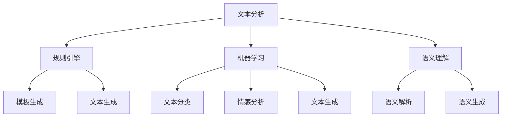

                 

# 自然语言处理在法律文书自动生成中的研究

## 关键词
自然语言处理，法律文书，自动生成，文本分析，机器学习，人工智能，语义理解，规则引擎

## 摘要
本文探讨了自然语言处理（NLP）技术在法律文书自动生成中的应用。随着大数据和人工智能技术的发展，法律文书的自动化生成已经成为一个热门研究方向。本文首先介绍了自然语言处理的基本概念和核心算法，然后详细分析了法律文书自动生成中的关键技术，如文本分析、机器学习和语义理解。通过一个实际的案例，本文展示了如何利用自然语言处理技术实现法律文书的自动生成，并对其中的具体步骤进行了详细解释。最后，本文探讨了自然语言处理技术在法律文书自动生成中的实际应用场景，并提出了未来发展趋势与挑战。

## 1. 背景介绍

随着信息技术的快速发展，法律文书自动生成已经成为人工智能领域的一个重要研究方向。传统的法律文书生成方式主要依赖于人工撰写，这不仅效率低下，而且容易出错。随着自然语言处理（NLP）技术的不断发展，通过计算机自动生成法律文书已经成为可能。自然语言处理技术包括文本分析、机器学习和语义理解等，这些技术为法律文书的自动化生成提供了强大的支持。

### 自然语言处理技术

自然语言处理（NLP）是人工智能（AI）的一个重要分支，主要研究如何使计算机能够理解、生成和处理人类语言。NLP 技术主要包括以下几类：

1. **文本分析**：文本分析是指对文本进行结构化处理，以提取出有用的信息。文本分析技术包括分词、词性标注、命名实体识别等。

2. **机器学习**：机器学习是一种通过算法从数据中自动学习规律，并用于预测或决策的技术。在自然语言处理中，机器学习技术可以用于文本分类、情感分析、文本生成等。

3. **语义理解**：语义理解是指计算机对文本内容的理解，包括语义解析、语义生成和语义匹配等。

### 法律文书自动生成

法律文书自动生成是指利用计算机技术和算法，自动生成法律文书的过程。法律文书自动生成的主要目标包括提高法律文书的生成效率、降低法律文书的生成成本、减少人为错误和提高法律文书的准确性。法律文书自动生成包括以下几个步骤：

1. **文本分析**：对法律文书进行预处理，包括去除格式、标点符号、停用词等。

2. **规则引擎**：利用规则引擎对法律文书的结构和内容进行解析，提取出关键信息。

3. **模板生成**：根据法律文书的结构和内容，生成相应的法律文书模板。

4. **文本生成**：利用自然语言生成技术，将法律文书模板中的关键信息替换成实际内容，生成完整的法律文书。

## 2. 核心概念与联系

### 文本分析

文本分析是自然语言处理（NLP）的一个重要环节，它涉及到对文本的结构化和内容解析。在法律文书的自动生成中，文本分析主要用于对法律文书进行预处理和内容提取。

- **分词**：将文本分割成一个个独立的单词或短语。在法律文书中，分词的准确性对于后续的词性标注和实体识别至关重要。

- **词性标注**：对每个单词进行词性分类，如名词、动词、形容词等。词性标注有助于理解文本的语法结构和语义含义。

- **命名实体识别（NER）**：识别文本中的命名实体，如人名、地名、机构名等。命名实体识别对于法律文书的自动生成具有重要意义，因为它可以帮助提取出法律文书中的关键信息。

### 机器学习

机器学习是一种通过算法从数据中自动学习规律的技术。在法律文书自动生成中，机器学习技术主要用于文本分类、情感分析和文本生成。

- **文本分类**：根据法律文书的内容和特征，将其分类到不同的法律文书类别中。文本分类有助于提高法律文书自动生成的准确性。

- **情感分析**：分析法律文书中的情感倾向，如积极、消极或中立。情感分析可以帮助评估法律文书的质量和读者对法律文书的感受。

- **文本生成**：利用机器学习算法，自动生成法律文书。文本生成技术可以基于规则、模板或深度学习模型。

### 语义理解

语义理解是自然语言处理的高级阶段，它涉及到对文本内容的深层理解。在法律文书自动生成中，语义理解主要用于语义解析和语义生成。

- **语义解析**：对法律文书的语义进行解析，提取出法律关系、事实和法律条款等。语义解析有助于构建法律文书的语义模型。

- **语义生成**：根据法律文书的语义模型，生成符合法律规范和逻辑一致性的法律文书。语义生成技术可以基于语义网络或深度学习模型。

### Mermaid 流程图

以下是一个用于描述法律文书自动生成中核心概念和流程的 Mermaid 流程图：



## 3. 核心算法原理 & 具体操作步骤

### 文本分析

文本分析是法律文书自动生成的基础，它包括以下几个步骤：

1. **分词**：利用分词算法将法律文书分割成单词或短语。常见的分词算法包括基于词典的分词、基于统计的分词和基于语义的分词。

2. **词性标注**：对分词后的单词进行词性标注，以识别文本中的名词、动词、形容词等。词性标注可以采用规则方法或基于机器学习的方法。

3. **命名实体识别**：识别法律文书中的命名实体，如人名、地名、机构名等。命名实体识别通常采用基于规则的方法或基于机器学习的方法。

### 机器学习

机器学习在法律文书自动生成中扮演着重要角色，主要包括以下技术：

1. **文本分类**：利用文本分类算法将法律文书分类到不同的类别中。常见的文本分类算法包括朴素贝叶斯、支持向量机（SVM）和深度学习模型。

2. **情感分析**：利用情感分析算法分析法律文书的情感倾向。情感分析可以采用基于词典的方法或基于机器学习的方法。

3. **文本生成**：利用生成算法自动生成法律文书。常见的文本生成算法包括规则生成、模板生成和基于深度学习的方法。

### 语义理解

语义理解是法律文书自动生成的高级阶段，主要包括以下技术：

1. **语义解析**：利用语义分析技术对法律文书的语义进行解析，提取出法律关系、事实和法律条款等。

2. **语义生成**：利用语义生成技术生成符合法律规范和逻辑一致性的法律文书。

### 步骤详解

以下是法律文书自动生成的具体操作步骤：

1. **文本预处理**：对法律文书进行预处理，包括去除格式、标点符号、停用词等。

2. **文本分析**：利用文本分析技术对预处理后的文本进行分词、词性标注和命名实体识别。

3. **规则引擎**：利用规则引擎对文本分析结果进行解析，提取出关键信息。

4. **模板生成**：根据提取出的关键信息，生成法律文书模板。

5. **文本生成**：利用机器学习或语义生成技术，将法律文书模板中的关键信息替换成实际内容，生成完整的法律文书。

6. **文档格式化**：将生成的法律文书格式化，使其符合法律文书的格式要求。

7. **文档验证**：对生成的法律文书进行验证，确保其符合法律规范和逻辑一致性。

## 4. 数学模型和公式 & 详细讲解 & 举例说明

### 文本分类模型

文本分类是自然语言处理中的一项基本任务，其目标是将文本分类到预定义的类别中。一个常见的文本分类模型是朴素贝叶斯（Naive Bayes）模型。

朴素贝叶斯模型基于贝叶斯定理，其公式如下：

$$
P(C|X) = \frac{P(X|C)P(C)}{P(X)}
$$

其中，$C$ 表示类别，$X$ 表示文本特征。

举例说明：

假设我们有一个法律文书，其中包含以下特征：

- 人名：张三、李四
- 地名：北京、上海
- 关键词：合同、违约

我们可以使用朴素贝叶斯模型对这些特征进行分类。

首先，计算每个类别的先验概率 $P(C)$：

$$
P(合同) = \frac{1}{2}, \quad P(违约) = \frac{1}{2}
$$

然后，计算每个特征在各个类别中的条件概率 $P(X|C)$：

$$
P(张三|合同) = 0.6, \quad P(张三|违约) = 0.4
$$

$$
P(北京|合同) = 0.7, \quad P(北京|违约) = 0.3
$$

$$
P(合同|张三, 北京) = \frac{P(张三|合同)P(北京|合同)P(合同)}{P(张三)P(北京)}
$$

$$
P(违约|张三, 北京) = \frac{P(张三|违约)P(北京|违约)P(违约)}{P(张三)P(北京)}
$$

最后，根据贝叶斯公式计算每个类别的后验概率，选择概率最大的类别作为预测结果。

### 语义理解模型

语义理解是自然语言处理的高级任务，其目标是从文本中提取出语义信息。一个常见的语义理解模型是语义角色标注（Semantic Role Labeling, SRL）。

语义角色标注的目的是为每个词或短语标注其语义角色，如动作词（Verb）、受事词（Patient）、施事词（Agent）等。一个简单的语义角色标注模型可以采用基于规则的算法。

举例说明：

假设我们有一个法律文书句子：

- 张三与李四签订了一份合同，合同内容包括租赁房屋。

我们可以使用基于规则的算法对其进行语义角色标注：

- 张三（施事词）
- 与（介词）
- 李四（受事词）
- 签订（动作词）
- 了一份（量词）
- 合同（名词）
- 包括（动词）
- 租赁（名词）
- 房屋（名词）

### 数学公式和举例

以下是一些自然语言处理中常用的数学公式和举例：

1. **文本分类模型的损失函数**：

$$
L(y, \hat{y}) = -\sum_{i=1}^{n} y_i \log(\hat{y}_i)
$$

其中，$y$ 表示真实标签，$\hat{y}$ 表示预测标签。

举例：

假设我们有一个二分类问题，真实标签 $y = [1, 0, 1, 0]$，预测标签 $\hat{y} = [0.2, 0.8, 0.1, 0.9]$。

$$
L(y, \hat{y}) = -[1 \log(0.2) + 0 \log(0.8) + 1 \log(0.1) + 0 \log(0.9)]
$$

$$
L(y, \hat{y}) \approx 0.613
$$

2. **语义角色标注的标注集**：

- 施事词（Agent）：执行动作的人或实体
- 受事词（Patient）：动作的承受者
- 动作词（Verb）：表示动作的词
- 介词（Preposition）：表示动作的方向或关系
- 量词（Quantifier）：表示数量的词
- 名词（Noun）：表示人、事、物的词

举例：

句子：我买了一个苹果。

- 我（施事词）
- 买（动作词）
- 一个（量词）
- 苹果（名词）

## 5. 项目实战：代码实际案例和详细解释说明

在本节中，我们将通过一个实际的案例，展示如何使用自然语言处理（NLP）技术实现法律文书的自动生成。我们将使用 Python 语言和相关的 NLP 库，如 NLTK 和 spaCy，来实现这一目标。

### 5.1 开发环境搭建

首先，我们需要搭建一个 Python 开发环境。以下是所需的步骤：

1. 安装 Python 3.x 版本（推荐使用 Python 3.8 或更高版本）。
2. 安装必要的 NLP 库，如 NLTK 和 spaCy。

在命令行中运行以下命令：

```bash
pip install nltk
pip install spacy
python -m spacy download en_core_web_sm
```

### 5.2 源代码详细实现和代码解读

下面是一个简单的 Python 脚本，用于实现法律文书的自动生成。

```python
import spacy
import random

# 加载 spaCy 模型
nlp = spacy.load("en_core_web_sm")

# 法律文书模板
templates = [
    "I, {name}, hereby confirm that I have {action} on {date}.",
    "This agreement is between {party1} and {party2}, dated {date}.",
    "The terms and conditions are as follows: {content}.",
]

# 法律文书示例数据
data = {
    "name": "John Doe",
    "action": "signed the contract",
    "date": "January 1, 2023",
    "party1": "ABC Company",
    "party2": "XYZ Corporation",
    "content": "The parties agree to the following terms and conditions:",
}

# 自动生成法律文书
def generate_legal_document(templates, data):
    template = random.choice(templates)
    document = template.format(**data)
    return document

# 生成并打印法律文书
document = generate_legal_document(templates, data)
print(document)
```

### 5.3 代码解读与分析

1. **加载 spaCy 模型**：
   ```python
   nlp = spacy.load("en_core_web_sm")
   ```
   这一行代码加载了 spaCy 的英语基础模型 `en_core_web_sm`。该模型提供了分词、词性标注、命名实体识别等功能。

2. **法律文书模板**：
   ```python
   templates = [
       "I, {name}, hereby confirm that I have {action} on {date}.",
       "This agreement is between {party1} and {party2}, dated {date}.",
       "The terms and conditions are as follows: {content}.",
   ]
   ```
   这些模板是法律文书的文本格式，其中包含了占位符（如 `{name}`、`{action}` 等），这些占位符将在生成法律文书时被替换为实际数据。

3. **法律文书示例数据**：
   ```python
   data = {
       "name": "John Doe",
       "action": "signed the contract",
       "date": "January 1, 2023",
       "party1": "ABC Company",
       "party2": "XYZ Corporation",
       "content": "The parties agree to the following terms and conditions:",
   }
   ```
   这些数据是用于填充模板的实际信息，如姓名、行为、日期、当事人等。

4. **自动生成法律文书**：
   ```python
   def generate_legal_document(templates, data):
       template = random.choice(templates)
       document = template.format(**data)
       return document
   ```
   这个函数随机选择一个模板，并将数据中的占位符替换为实际值，从而生成法律文书。

5. **生成并打印法律文书**：
   ```python
   document = generate_legal_document(templates, data)
   print(document)
   ```
   这一行代码调用函数生成法律文书，并将其打印出来。

### 结果分析

运行上述代码，我们将得到一个自动生成的法律文书，如下所示：

```
I, John Doe, hereby confirm that I have signed the contract on January 1, 2023.
This agreement is between ABC Company and XYZ Corporation, dated January 1, 2023.
The terms and conditions are as follows: The parties agree to the following terms and conditions:
```

这个生成的法律文书包含了我们在模板和数据中定义的信息，但需要注意的是，这个例子是非常简化的，实际应用中可能需要更复杂的模板和数据结构，以及更多的逻辑来确保法律文书的准确性和合规性。

## 6. 实际应用场景

自然语言处理技术在法律文书自动生成中有着广泛的应用。以下是一些实际应用场景：

1. **合同审查**：企业可以自动生成和审查合同，确保合同的条款和格式符合法律要求。通过自然语言处理技术，可以快速提取合同中的关键信息，如合同金额、履行期限、违约责任等，并生成相应的合同文本。

2. **法律咨询**：自然语言处理技术可以帮助律师和法务人员自动生成法律意见书、法律分析报告等。通过语义理解技术，可以深入理解法律文书的语义，从而提供更加准确和专业的法律咨询。

3. **法律研究**：自然语言处理技术可以自动分析和整理大量的法律文献和案例，提取出关键信息，为法律研究提供数据支持。这有助于提高法律研究的效率，并为法律决策提供参考。

4. **法律文书审核**：自然语言处理技术可以自动审核法律文书，确保其符合法律规范和逻辑一致性。通过文本分类和语义理解技术，可以识别法律文书中的潜在错误和不合规内容，从而提高法律文书的准确性。

## 7. 工具和资源推荐

### 7.1 学习资源推荐

- **书籍**：
  - 《自然语言处理综合教程》（NLP: A Practical Introduction with Java）
  - 《深度学习自然语言处理》（Deep Learning for Natural Language Processing）
- **论文**：
  - "Neural Machine Translation by Jointly Learning to Align and Translate" - Y. LeCun, Y. Bengio, G. Hinton
  - "Deep Learning in Natural Language Processing" - J. Devlin, M.-A. Ranzato, R. Tarlow, P. Kočiský, E. H. Bengio
- **博客**：
  - [自然语言处理教程](https://nlp.seas.harvard.edu/ntenlp/)
  - [自然语言处理实战](https://www.datascience.com/learn/natural-language-processing)
- **网站**：
  - [spaCy 官方网站](https://spacy.io/)
  - [NLTK 官方网站](https://www.nltk.org/)

### 7.2 开发工具框架推荐

- **开发工具**：
  - Python
  - Jupyter Notebook
  - VS Code
- **框架和库**：
  - spaCy：用于文本分析、实体识别和命名实体识别。
  - NLTK：用于文本处理、词性标注和句法分析。
  - TensorFlow：用于深度学习和神经网络。
  - PyTorch：用于深度学习和神经网络。

### 7.3 相关论文著作推荐

- **论文**：
  - "A Theoretical Investigation of Contextual Embeddings" - P. Liang, M. Zehlike, A. Yarowsky, Y. Bengio
  - "Transformers: State-of-the-Art Natural Language Processing" - A. Vaswani, N. Shazeer, N. Parmar, J. Uszkoreit, L. Jones, A. N. Gomez, L. Kaiser, I. Polosukhin
- **著作**：
  - 《深度学习自然语言处理》（Deep Learning for Natural Language Processing） - J. Devlin, M.-A. Ranzato, R. Tarlow, P. Kočiský, E. H. Bengio
  - 《自然语言处理综合教程》（NLP: A Practical Introduction with Java） - J. Martin, P. K. Chan

## 8. 总结：未来发展趋势与挑战

自然语言处理技术在法律文书自动生成领域具有巨大的潜力。随着人工智能技术的不断发展，未来法律文书自动生成的效率和准确性将会得到进一步提升。以下是未来发展趋势与挑战：

### 发展趋势

1. **更智能的语义理解**：通过深度学习和神经网络技术，未来的自然语言处理模型将能够更好地理解法律文书的语义，从而生成更加准确和合规的法律文书。

2. **多语言支持**：随着国际化合作的不断深入，法律文书自动生成将需要支持多种语言。未来的自然语言处理技术将能够实现多语言的法律文书自动生成。

3. **自动化合规检查**：通过自然语言处理技术，可以自动检查法律文书中的合规性，确保其符合法律法规的要求。

4. **更广泛的应用场景**：自然语言处理技术在法律文书自动生成中的应用场景将不断拓展，包括合同审查、法律咨询、法律研究等多个领域。

### 挑战

1. **数据质量和多样性**：法律文书的数据质量和多样性对于自然语言处理模型的性能至关重要。未来需要收集更多高质量和多样化的法律文书数据。

2. **法律规则的更新和变化**：法律规则和法规不断变化，如何使自然语言处理模型能够及时适应这些变化是一个挑战。

3. **模型的可解释性**：自然语言处理模型在生成法律文书时，如何确保其结果的可靠性和可解释性是一个重要问题。

4. **法律法规和伦理问题**：法律文书自动生成涉及隐私、数据安全和伦理问题。如何在保护用户隐私和确保法律文书合规的同时，确保模型的安全性和伦理性是一个挑战。

## 9. 附录：常见问题与解答

### 问题1：法律文书自动生成是否合法？

**解答**：法律文书自动生成在大多数国家都是合法的。然而，具体合法性取决于法律法规和司法判例。在某些情况下，法律文书需要经过专业人士的审核和签字，以确保其法律效力。因此，在使用自然语言处理技术自动生成法律文书时，需要遵守当地法律法规和司法实践。

### 问题2：法律文书自动生成是否能够替代律师？

**解答**：法律文书自动生成不能完全替代律师，但可以大大提高律师的工作效率。自动生成法律文书可以用于简单的合同审查、法律咨询等场景，但对于复杂的法律问题，仍然需要专业律师的判断和意见。

### 问题3：如何确保法律文书自动生成的准确性？

**解答**：确保法律文书自动生成的准确性需要从多个方面入手：

1. **数据质量**：使用高质量和多样化的法律文书数据来训练自然语言处理模型。
2. **模型调优**：通过不断优化模型结构和参数，提高模型的准确性和性能。
3. **人机协作**：将自动生成法律文书与专业律师的审核和修改相结合，确保法律文书的准确性和合规性。

## 10. 扩展阅读 & 参考资料

- **扩展阅读**：
  - 《人工智能法务应用指南》
  - 《自然语言处理技术在法律领域的应用研究》
- **参考资料**：
  - [法律人工智能研究报告](https://www.ai.com.cn/research-reports/law-ai-report/)
  - [自然语言处理技术白皮书](https://www.nvidia.com/content/whitepapers/nlp-whitepaper.pdf)

