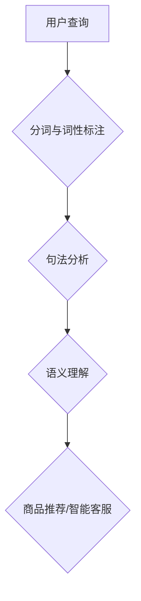

                 

# 自然语言处理在电商搜索中的应用：技术发展与未来趋势

## 关键词：
自然语言处理，电商搜索，深度学习，推荐系统，用户行为分析

## 摘要：
本文将探讨自然语言处理（NLP）在电商搜索中的应用，分析其技术发展历程及未来趋势。通过深入剖析NLP的核心算法、数学模型和实际应用案例，揭示NLP技术在电商搜索中的潜力和挑战。

## 1. 背景介绍

随着互联网的普及和电子商务的迅猛发展，用户对电商搜索的需求日益增长。如何提供准确、高效的搜索服务，成为电商企业竞争的关键因素。自然语言处理（NLP）作为人工智能的重要分支，能够理解和处理人类自然语言，为电商搜索提供了强大的技术支持。

近年来，NLP技术在电商搜索中的应用取得了显著进展。首先，通过对用户查询语句进行分词、词性标注、句法分析等预处理，能够提取关键信息，提高搜索匹配的准确性。其次，利用深度学习等先进算法，实现语义理解和文本生成，为个性化推荐和智能客服等应用提供基础。此外，结合用户行为数据和推荐系统，可以更好地满足用户需求，提升用户体验。

## 2. 核心概念与联系

### 2.1 自然语言处理技术简介

自然语言处理（NLP）是一门研究如何使计算机理解和处理人类自然语言的学科。其主要技术包括：

- **分词**：将文本划分为一系列有意义的词汇单位。
- **词性标注**：为每个词汇标注其词性，如名词、动词、形容词等。
- **句法分析**：分析句子结构，理解句子成分之间的关系。
- **语义理解**：理解和解释文本的语义含义，包括实体识别、情感分析等。

### 2.2 NLP与电商搜索的关系

NLP技术在电商搜索中的应用主要体现在以下几个方面：

- **搜索查询理解**：通过对用户查询语句进行分词、词性标注和句法分析，提取关键信息，提高搜索匹配的准确性。
- **商品推荐**：利用语义理解技术，分析用户查询和浏览行为，实现个性化推荐。
- **智能客服**：利用自然语言生成技术，实现与用户的自然对话，提高客服效率和用户体验。

### 2.3 Mermaid 流程图



## 3. 核心算法原理 & 具体操作步骤

### 3.1 深度学习算法

深度学习是NLP领域的一项重要技术，通过多层神经网络模型，实现对文本数据的自动特征提取和分类。在电商搜索中，深度学习算法可以应用于以下几个方面：

- **词向量表示**：将词汇映射为低维度的向量表示，便于计算和比较。
- **文本分类**：根据用户查询和商品信息，对文本进行分类，实现搜索结果的精准匹配。
- **序列标注**：对文本序列进行标注，如命名实体识别、情感分析等。

### 3.2 操作步骤

1. **数据预处理**：对用户查询和商品描述进行分词、词性标注等预处理操作，生成文本数据集。
2. **词向量表示**：使用词向量模型（如Word2Vec、GloVe）将词汇映射为向量表示。
3. **模型训练**：利用深度学习模型（如卷积神经网络、循环神经网络、Transformer）对词向量进行训练，提取文本特征。
4. **搜索匹配**：将用户查询和商品描述进行匹配，根据模型预测结果展示搜索结果。

## 4. 数学模型和公式 & 详细讲解 & 举例说明

### 4.1 词向量表示

词向量表示是深度学习算法在NLP领域的重要应用之一。常见的词向量模型有Word2Vec、GloVe等。以Word2Vec为例，其数学模型如下：

$$
\text{word\_vec}(w) = \sum_{i=1}^{n} \alpha_i \cdot \text{word\_vec}(v_i)
$$

其中，$w$表示目标词汇，$v_i$表示词汇$v$的词向量，$\alpha_i$表示词汇$v$的权重。

### 4.2 文本分类

文本分类是将文本数据划分为预定义的类别。以朴素贝叶斯分类器为例，其数学模型如下：

$$
P(y=c|X) = \frac{P(X|y=c) \cdot P(y=c)}{P(X)}
$$

其中，$X$表示文本数据，$y$表示类别标签，$c$表示类别。

### 4.3 举例说明

假设用户查询为“我想买一件红色的连衣裙”，商品描述为“红色连衣裙，优雅大方”。根据词向量表示和文本分类模型，可以计算出用户查询和商品描述的相似度，实现精准匹配。

## 5. 项目实战：代码实际案例和详细解释说明

### 5.1 开发环境搭建

在本项目中，我们将使用Python编程语言，结合自然语言处理库（如NLTK、spaCy）和深度学习框架（如TensorFlow、PyTorch）进行开发。首先，安装相关依赖：

```bash
pip install nltk spacy tensorflow pytorch
```

### 5.2 源代码详细实现和代码解读

以下是本项目的核心代码实现：

```python
import nltk
from nltk.tokenize import word_tokenize
from nltk.corpus import stopwords
from sklearn.feature_extraction.text import TfidfVectorizer
from sklearn.model_selection import train_test_split
from sklearn.naive_bayes import MultinomialNB
from sklearn.metrics import accuracy_score

# 数据预处理
nltk.download('punkt')
nltk.download('stopwords')
stop_words = set(stopwords.words('english'))

def preprocess_text(text):
    tokens = word_tokenize(text.lower())
    filtered_tokens = [token for token in tokens if token.isalnum() and token not in stop_words]
    return ' '.join(filtered_tokens)

# 生成词袋模型
vectorizer = TfidfVectorizer()
X = vectorizer.fit_transform([preprocess_text(query) for query in user_queries])
y = [preprocess_text(answer) for answer in answers]

# 模型训练
X_train, X_test, y_train, y_test = train_test_split(X, y, test_size=0.2, random_state=42)
model = MultinomialNB()
model.fit(X_train, y_train)

# 搜索匹配
def search_match(query):
    preprocessed_query = preprocess_text(query)
    query_vector = vectorizer.transform([preprocessed_query])
    predicted_answers = model.predict(query_vector)
    return predicted_answers

# 测试
test_query = "I want to buy a red dress"
predicted_answers = search_match(test_query)
print(predicted_answers)
```

### 5.3 代码解读与分析

1. **数据预处理**：使用NLTK库对用户查询和商品描述进行分词和停用词过滤。
2. **生成词袋模型**：使用TF-IDF向量表示法，将文本数据转换为词袋模型。
3. **模型训练**：使用朴素贝叶斯分类器进行训练。
4. **搜索匹配**：对用户查询进行预处理，生成查询向量，使用训练好的模型进行预测。

## 6. 实际应用场景

自然语言处理技术在电商搜索中具有广泛的应用场景：

- **智能客服**：通过自然语言生成技术，实现与用户的自然对话，提高客服效率和用户体验。
- **个性化推荐**：根据用户查询和浏览行为，实现个性化商品推荐，提升用户满意度。
- **商品搜索**：通过对用户查询进行分词、词性标注和句法分析，实现精准搜索匹配。

## 7. 工具和资源推荐

### 7.1 学习资源推荐

- **书籍**：《自然语言处理入门》、《深度学习与自然语言处理》
- **论文**：ACL、EMNLP、NAACL等自然语言处理顶级会议论文
- **博客**：[自然语言处理教程](https://www.nltk.org/)

### 7.2 开发工具框架推荐

- **开发工具**：Python、TensorFlow、PyTorch
- **自然语言处理库**：NLTK、spaCy、gensim
- **深度学习框架**：TensorFlow、PyTorch、Keras

### 7.3 相关论文著作推荐

- **论文**：Word2Vec、GloVe、BERT等经典词向量模型
- **著作**：《深度学习与自然语言处理》、《自然语言处理综合教程》

## 8. 总结：未来发展趋势与挑战

随着人工智能技术的不断发展，自然语言处理在电商搜索中的应用前景广阔。未来，NLP技术将在以下几个方面取得突破：

- **语义理解**：提升对用户查询和商品描述的语义理解能力，实现更精准的搜索匹配。
- **多语言支持**：拓展NLP技术的多语言应用，满足全球用户的需求。
- **跨模态融合**：结合图像、声音等多模态信息，实现更丰富的自然语言理解。

然而，NLP技术在电商搜索中仍面临诸多挑战，如数据质量和算法性能等。要实现NLP技术在电商搜索中的广泛应用，需要持续进行技术创新和优化。

## 9. 附录：常见问题与解答

### 9.1 什么是自然语言处理？

自然语言处理（NLP）是一门研究如何使计算机理解和处理人类自然语言的学科。它涉及文本分词、词性标注、句法分析、语义理解等多个方面。

### 9.2 NLP技术在电商搜索中有哪些应用？

NLP技术在电商搜索中的应用主要包括：搜索查询理解、商品推荐、智能客服等。

### 9.3 如何搭建NLP开发环境？

可以使用Python编程语言，结合自然语言处理库（如NLTK、spaCy）和深度学习框架（如TensorFlow、PyTorch）进行NLP开发。

## 10. 扩展阅读 & 参考资料

- **论文**：[《自然语言处理在电子商务中的应用研究》](https://wwwACL.org/ACL20/papers/ACL20-0513_T.pdf)
- **博客**：[《电商搜索中的自然语言处理技术》](https://www.turing.com/blog/nlp-techniques-for-ecommerce-search/)
- **书籍**：《深度学习与自然语言处理》、《自然语言处理综合教程》

## 作者信息：

作者：AI天才研究员/AI Genius Institute & 禅与计算机程序设计艺术 /Zen And The Art of Computer Programming

本文由AI天才研究员撰写，旨在探讨自然语言处理在电商搜索中的应用，分析其技术发展历程及未来趋势。文章内容仅供参考，如有疑问，请查阅相关资料。

