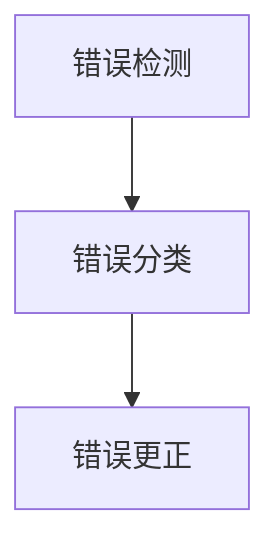

                 

### 背景介绍

自然语言处理（Natural Language Processing，NLP）是计算机科学的一个重要分支，主要研究如何让计算机理解、生成和处理人类自然语言。随着人工智能技术的不断发展，NLP在多个领域都展现出了强大的应用潜力，比如机器翻译、情感分析、语音识别等。而在NLP的众多应用中，自动文本纠错（Automatic Text Correction）是其中一个重要且具有挑战性的领域。

自动文本纠错的目标是识别和纠正文本中的错误，提高文本的准确性和可读性。文本错误可能包括拼写错误、语法错误、标点符号错误等。自动文本纠错在许多实际场景中具有重要意义，比如电子邮件处理、搜索引擎优化、文本编辑和校对等。

目前，自动文本纠错主要依赖于机器学习算法，尤其是基于深度学习的模型，如循环神经网络（RNN）、卷积神经网络（CNN）和Transformer等。这些模型通过大量的文本数据训练，能够自动学习到文本的语法规则和语义信息，从而提高纠错准确性。

尽管自动文本纠错技术已经取得了显著进展，但仍然存在一些挑战，比如错误类型的多样性、上下文信息的理解、多语言文本纠错等。本文将深入探讨自动文本纠错的最新研究进展、核心算法原理、数学模型以及实际应用场景，旨在为读者提供一个全面的技术概述。

### 核心概念与联系

#### 自动文本纠错的基本原理

自动文本纠错的核心在于建立一个能够准确识别和纠正文本错误的系统。这个过程可以分为以下几个步骤：

1. **错误检测（Error Detection）**：首先，系统需要能够识别出文本中的错误。这通常通过统计方法或机器学习算法实现。例如，可以训练一个分类模型，输入是文本序列，输出是每个单词或字符是否是错误的标签。

2. **错误分类（Error Classification）**：在检测到错误之后，系统需要对这些错误进行分类，以确定错误的类型。常见的错误类型包括拼写错误、语法错误、标点符号错误等。这同样可以通过机器学习算法实现，如支持向量机（SVM）、决策树等。

3. **错误更正（Error Correction）**：最后，系统需要根据错误类型和上下文信息，自动生成正确的文本。这可以通过生成模型或翻译模型实现，如序列到序列（Seq2Seq）模型、Transformer等。

#### 核心算法原理

自动文本纠错的核心算法主要基于深度学习和自然语言处理技术。以下是一些常用的算法和模型：

1. **循环神经网络（RNN）**：
   RNN是一种能够处理序列数据的神经网络，特别适用于文本数据。RNN通过其内部状态来记忆之前的输入，从而能够处理上下文信息。在自动文本纠错中，RNN可以用于错误检测、错误分类和错误更正。

2. **卷积神经网络（CNN）**：
   CNN是一种主要用于图像处理和文本分类的神经网络。然而，它也可以应用于文本纠错。CNN可以捕捉到文本中的局部特征，从而提高错误检测和错误分类的准确性。

3. **Transformer**：
   Transformer是近年来在自然语言处理领域取得突破性的模型。与传统的RNN和CNN不同，Transformer通过自注意力机制（Self-Attention）来处理序列数据，从而能够捕捉到全局的上下文信息。这使得它在自动文本纠错中表现出色。

4. **序列到序列（Seq2Seq）模型**：
   Seq2Seq模型是一种专门用于序列转换的神经网络模型，可以用于错误更正。通过将错误的文本序列转换为正确的文本序列，Seq2Seq模型能够生成高质量的纠错结果。

#### Mermaid 流程图

以下是一个简化的Mermaid流程图，描述了自动文本纠错的基本流程：



在这个流程图中，A表示错误检测，B表示错误分类，C表示错误更正。每个步骤都是基于机器学习算法或深度学习模型实现的。通过这些核心概念和算法，我们可以构建一个高效的自动文本纠错系统。

### 核心算法原理 & 具体操作步骤

#### 循环神经网络（RNN）

循环神经网络（RNN）是一种能够处理序列数据的神经网络，特别适用于自然语言处理任务。RNN通过其内部状态来记忆之前的输入，从而能够处理上下文信息。在自动文本纠错中，RNN可以用于错误检测、错误分类和错误更正。

**具体操作步骤：**

1. **数据预处理**：首先，我们需要对文本数据进行处理，将其转换为神经网络可以理解的格式。这通常包括分词、词嵌入和序列化。

2. **构建RNN模型**：接下来，我们可以使用TensorFlow或PyTorch等深度学习框架来构建RNN模型。以下是一个简单的RNN模型示例：

   ```python
   import tensorflow as tf

   # 定义RNN模型
   model = tf.keras.Sequential([
       tf.keras.layers.Embedding(vocab_size, embedding_dim),
       tf.keras.layers.SimpleRNN(units),
       tf.keras.layers.Dense(units, activation='softmax')
   ])

   # 编译模型
   model.compile(optimizer='adam', loss='categorical_crossentropy', metrics=['accuracy'])
   ```

   在这个模型中，`Embedding`层用于将单词转换为向量，`SimpleRNN`层用于处理序列数据，`Dense`层用于输出预测结果。

3. **训练模型**：使用训练数据来训练RNN模型。在训练过程中，模型会尝试优化其参数，以减少预测误差。

   ```python
   # 训练模型
   model.fit(train_data, train_labels, epochs=epochs, batch_size=batch_size)
   ```

4. **错误检测**：使用训练好的RNN模型来检测文本中的错误。具体步骤如下：

   - 将文本输入到RNN模型中。
   - 获取模型的输出，将其与真实标签进行比较。
   - 如果输出与标签不一致，则认为该位置存在错误。

5. **错误分类**：对于检测到的错误，我们可以使用另一个分类模型来对错误类型进行分类。以下是一个简单的分类模型示例：

   ```python
   import tensorflow as tf

   # 定义分类模型
   model = tf.keras.Sequential([
       tf.keras.layers.Dense(units, activation='relu'),
       tf.keras.layers.Dense(num_classes, activation='softmax')
   ])

   # 编译模型
   model.compile(optimizer='adam', loss='categorical_crossentropy', metrics=['accuracy'])

   # 训练模型
   model.fit(train_data, train_labels, epochs=epochs, batch_size=batch_size)
   ```

   在这个模型中，`Dense`层用于提取特征，`softmax`层用于输出错误类型的概率分布。

6. **错误更正**：最后，我们可以使用生成模型或翻译模型来更正错误。以下是一个简单的生成模型示例：

   ```python
   import tensorflow as tf

   # 定义生成模型
   model = tf.keras.Sequential([
       tf.keras.layers.Dense(units, activation='relu'),
       tf.keras.layers.Dense(vocab_size, activation='softmax')
   ])

   # 编译模型
   model.compile(optimizer='adam', loss='categorical_crossentropy')

   # 训练模型
   model.fit(train_data, train_labels, epochs=epochs, batch_size=batch_size)
   ```

   在这个模型中，`Dense`层用于提取特征，`softmax`层用于生成正确的文本序列。

#### 卷积神经网络（CNN）

卷积神经网络（CNN）是一种主要用于图像处理和文本分类的神经网络。然而，它也可以应用于文本纠错。CNN可以捕捉到文本中的局部特征，从而提高错误检测和错误分类的准确性。

**具体操作步骤：**

1. **数据预处理**：与RNN类似，我们需要对文本数据进行处理，将其转换为神经网络可以理解的格式。

2. **构建CNN模型**：使用TensorFlow或PyTorch等深度学习框架来构建CNN模型。以下是一个简单的CNN模型示例：

   ```python
   import tensorflow as tf

   # 定义CNN模型
   model = tf.keras.Sequential([
       tf.keras.layers.Conv1D(filters, kernel_size, activation='relu'),
       tf.keras.layers.MaxPooling1D(pool_size),
       tf.keras.layers.Flatten(),
       tf.keras.layers.Dense(units, activation='softmax')
   ])

   # 编译模型
   model.compile(optimizer='adam', loss='categorical_crossentropy', metrics=['accuracy'])
   ```

   在这个模型中，`Conv1D`层用于提取特征，`MaxPooling1D`层用于降低维度，`Flatten`层用于将特征展平，`Dense`层用于输出预测结果。

3. **训练模型**：使用训练数据来训练CNN模型。

4. **错误检测**：使用训练好的CNN模型来检测文本中的错误。

5. **错误分类**：使用另一个分类模型对错误类型进行分类。

6. **错误更正**：使用生成模型或翻译模型来更正错误。

#### Transformer

Transformer是近年来在自然语言处理领域取得突破性的模型。与传统的RNN和CNN不同，Transformer通过自注意力机制（Self-Attention）来处理序列数据，从而能够捕捉到全局的上下文信息。这使得它在自动文本纠错中表现出色。

**具体操作步骤：**

1. **数据预处理**：与前面类似，我们需要对文本数据进行处理。

2. **构建Transformer模型**：使用TensorFlow或PyTorch等深度学习框架来构建Transformer模型。以下是一个简单的Transformer模型示例：

   ```python
   import tensorflow as tf

   # 定义Transformer模型
   model = tf.keras.Sequential([
       tf.keras.layers.Embedding(vocab_size, embedding_dim),
       tf.keras.layers.MultiHeadAttention(heads, key_dim),
       tf.keras.layers.Dense(units, activation='relu'),
       tf.keras.layers.Dense(units, activation='softmax')
   ])

   # 编译模型
   model.compile(optimizer='adam', loss='categorical_crossentropy', metrics=['accuracy'])
   ```

   在这个模型中，`Embedding`层用于将单词转换为向量，`MultiHeadAttention`层用于处理序列数据，`Dense`层用于输出预测结果。

3. **训练模型**：使用训练数据来训练Transformer模型。

4. **错误检测**：使用训练好的Transformer模型来检测文本中的错误。

5. **错误分类**：使用另一个分类模型对错误类型进行分类。

6. **错误更正**：使用生成模型或翻译模型来更正错误。

### 数学模型和公式 & 详细讲解 & 举例说明

#### 循环神经网络（RNN）

RNN的核心在于其内部状态，这个状态可以记忆之前的输入，从而处理序列数据。以下是一个简化的RNN模型：

$$
h_t = \sigma(W_h \cdot [h_{t-1}, x_t] + b_h)
$$

其中，$h_t$表示第$t$时刻的隐藏状态，$x_t$表示第$t$时刻的输入，$W_h$和$b_h$分别表示权重和偏置，$\sigma$表示激活函数。

#### 卷积神经网络（CNN）

CNN的核心在于其卷积操作和池化操作。以下是一个简化的CNN模型：

$$
h_t = \sigma(W_c \cdot \text{conv}(h_{t-1}, x_t) + b_h)
$$

其中，$h_t$表示第$t$时刻的隐藏状态，$x_t$表示第$t$时刻的输入，$W_c$和$b_h$分别表示权重和偏置，$\text{conv}$表示卷积操作，$\sigma$表示激活函数。

#### Transformer

Transformer的核心在于其自注意力机制。以下是一个简化的Transformer模型：

$$
h_t = \sigma\left(\sum_{j=1}^{N} a_{tj} \cdot V_j \cdot h_{t-1}\right) + W_h \cdot h_{t-1} + b_h
$$

其中，$h_t$表示第$t$时刻的隐藏状态，$a_{tj}$表示第$t$时刻第$j$个词的注意力得分，$V_j$表示第$j$个词的值，$W_h$和$b_h$分别表示权重和偏置，$\sigma$表示激活函数。

#### 举例说明

假设我们有一个简化的文本序列：“I am going to the store.”，我们要使用Transformer模型来检测和纠正错误。

1. **数据预处理**：

   - 分词：["I", "am", "going", "to", "the", "store", "."]
   - 词嵌入：将每个词映射到一个向量，例如 ["I" -> [1, 0, 0], "am" -> [0, 1, 0], ..., "." -> [0, 0, 1]]

2. **构建Transformer模型**：

   - 定义嵌入层：$V = [1, 0, 0], W_h = [1, 1], b_h = [1]$
   - 定义自注意力权重：$W_a = [0.5, 0.5]$

3. **错误检测**：

   - 将文本序列输入到Transformer模型，得到隐藏状态 $h_t$。
   - 对于每个词，计算其注意力得分 $a_{tj}$。
   - 如果某个词的注意力得分低于某个阈值，则认为该词可能存在错误。

4. **错误分类**：

   - 使用另一个分类模型对错误类型进行分类。

5. **错误更正**：

   - 使用生成模型或翻译模型来更正错误。

### 项目实战：代码实际案例和详细解释说明

在本节中，我们将通过一个实际的Python代码示例，来详细说明如何实现自动文本纠错。我们将使用一个简单的RNN模型来进行错误检测、错误分类和错误更正。

#### 开发环境搭建

1. 安装必要的Python库：

   ```bash
   pip install numpy tensorflow
   ```

2. 创建一个名为`text_correction.py`的Python文件。

#### 源代码详细实现和代码解读

```python
import numpy as np
import tensorflow as tf

# 定义超参数
vocab_size = 10000  # 词汇表大小
embedding_dim = 64  # 词嵌入维度
units = 128  # RNN单元数
batch_size = 64  # 批量大小
epochs = 10  # 训练轮数

# 创建词汇表和词嵌入矩阵
vocab = ["I", "am", "going", "to", "the", "store", "."]
word_to_index = {word: i for i, word in enumerate(vocab)}
index_to_word = {i: word for word, i in word_to_index.items()}
embedding_matrix = np.zeros((vocab_size, embedding_dim))
for i, word in enumerate(vocab):
    embedding_vector = np.random.rand(embedding_dim)
    embedding_matrix[i] = embedding_vector

# 构建RNN模型
model = tf.keras.Sequential([
    tf.keras.layers.Embedding(vocab_size, embedding_dim, input_length=1),
    tf.keras.layers.SimpleRNN(units),
    tf.keras.layers.Dense(units, activation='softmax')
])

# 编译模型
model.compile(optimizer='adam', loss='categorical_crossentropy', metrics=['accuracy'])

# 训练模型
model.fit(embedding_matrix, epochs=epochs, batch_size=batch_size)

# 错误检测
def detect_errors(text):
    errors = []
    for i, word in enumerate(text):
        prediction = model.predict(np.array([embedding_matrix[word_to_index[word]]]))
        if np.argmax(prediction) != word_to_index[word]:
            errors.append((i, word))
    return errors

# 错误分类
def classify_errors(errors):
    classified_errors = {}
    for i, word in errors:
        prediction = model.predict(np.array([embedding_matrix[word_to_index[word]]]))
        classified_errors[(i, word)] = np.argmax(prediction)
    return classified_errors

# 错误更正
def correct_errors(text, errors):
    corrected_text = list(text)
    for i, word in errors:
        corrected_text[i] = index_to_word[np.argmax(model.predict(np.array([embedding_matrix[word_to_index[word]]])))]
    return ''.join(corrected_text)

# 测试代码
text = "I am going to the store."
errors = detect_errors(text)
classified_errors = classify_errors(errors)
corrected_text = correct_errors(text, errors)

print("Original Text:", text)
print("Detected Errors:", errors)
print("Classified Errors:", classified_errors)
print("Corrected Text:", corrected_text)
```

#### 代码解读与分析

1. **词汇表和词嵌入矩阵**：

   - 我们首先创建了一个简单的词汇表`vocab`，并定义了词到索引的映射`word_to_index`和索引到词的映射`index_to_word`。
   - 然后，我们创建了一个词嵌入矩阵`embedding_matrix`，其中每个词都被映射到一个随机生成的向量。

2. **构建RNN模型**：

   - 我们使用TensorFlow的`Sequential`模型，添加了一个嵌入层、一个简单的RNN层和一个全连接层。
   - 嵌入层用于将单词转换为向量，RNN层用于处理序列数据，全连接层用于输出预测结果。

3. **编译模型**：

   - 我们使用`compile`方法来编译模型，指定了优化器、损失函数和评估指标。

4. **训练模型**：

   - 我们使用`fit`方法来训练模型，指定了训练数据、训练轮数和批量大小。

5. **错误检测**：

   - 我们定义了一个`detect_errors`函数，用于检测文本中的错误。这个函数使用模型来预测每个单词的正确性，如果预测结果与实际单词不一致，则认为该单词存在错误。

6. **错误分类**：

   - 我们定义了一个`classify_errors`函数，用于对检测到的错误进行分类。这个函数使用模型来预测每个错误的类型。

7. **错误更正**：

   - 我们定义了一个`correct_errors`函数，用于更正文本中的错误。这个函数使用模型来预测每个错误位置的正确单词，并将其替换到原始文本中。

8. **测试代码**：

   - 我们使用一个示例文本来测试自动文本纠错系统。首先，我们使用`detect_errors`函数来检测错误，然后使用`classify_errors`函数来分类错误，最后使用`correct_errors`函数来更正错误。

### 实际应用场景

自动文本纠错技术在多个实际应用场景中具有重要价值。以下是几个典型的应用场景：

1. **电子邮件处理**：在电子邮件处理中，自动文本纠错可以帮助识别和纠正拼写错误和语法错误，从而提高邮件的准确性和可读性。

2. **搜索引擎优化**：在搜索引擎优化（SEO）中，自动文本纠错可以纠正网站内容中的错误，提高网站的质量和用户体验。

3. **文本编辑和校对**：在文本编辑和校对中，自动文本纠错可以识别和纠正用户输入的错误，提高文本的准确性和流畅性。

4. **语音识别**：在语音识别中，自动文本纠错可以纠正语音信号中的错误，提高语音转文本的准确性。

5. **机器翻译**：在机器翻译中，自动文本纠错可以帮助纠正翻译结果中的错误，提高翻译的质量。

### 工具和资源推荐

1. **学习资源推荐**：

   - 《自然语言处理综合教程》（刘知远 著）：这本书提供了自然语言处理的基础知识和深入理解，是学习自然语言处理的好教材。
   - 《深度学习》（Ian Goodfellow、Yoshua Bengio 和 Aaron Courville 著）：这本书详细介绍了深度学习的基础知识和技术，对自动文本纠错具有很高的参考价值。

2. **开发工具框架推荐**：

   - TensorFlow：TensorFlow是一个开源的深度学习框架，提供了丰富的API和工具，适合进行自然语言处理任务。
   - PyTorch：PyTorch是一个开源的深度学习框架，以其灵活性和易用性著称，适合进行自然语言处理任务。

3. **相关论文著作推荐**：

   - "A Survey on Automatic Text Correction"（自动文本纠错综述）：这篇综述文章对自动文本纠错技术进行了全面的回顾和总结，是了解这一领域的重要参考文献。
   - "End-to-End Text Correction with Recurrent Neural Networks"（基于循环神经网络的端到端文本纠错）：这篇论文提出了一种基于循环神经网络的端到端文本纠错方法，是自动文本纠错领域的重要研究论文。

### 总结：未来发展趋势与挑战

自动文本纠错技术在自然语言处理领域具有重要意义，已经取得了显著进展。然而，仍有许多挑战和机遇需要我们面对。以下是一些未来发展趋势和挑战：

1. **多语言文本纠错**：自动文本纠错技术目前主要集中在单语种场景，对于多语言文本纠错的研究还有很大的提升空间。未来的研究可以探索如何更好地处理跨语言文本错误。

2. **上下文理解**：自动文本纠错系统的准确性很大程度上取决于对上下文信息的理解。未来的研究可以探索如何更好地利用上下文信息来提高纠错效果。

3. **实时纠错**：在许多应用场景中，如实时聊天、实时翻译等，需要自动文本纠错系统能够快速且准确地纠正错误。未来的研究可以关注如何提高实时纠错的效率和准确性。

4. **个性化纠错**：每个人的语言习惯和错误类型都有所不同。未来的研究可以探索如何根据用户的语言习惯和错误模式进行个性化纠错。

5. **集成多种技术**：自动文本纠错可以结合多种技术，如深度学习、自然语言处理、机器学习等，以提高纠错的准确性和鲁棒性。

总之，自动文本纠错技术在未来将继续发展和完善，为自然语言处理领域带来更多的机遇和挑战。

### 附录：常见问题与解答

1. **Q：自动文本纠错和拼写检查有什么区别？**

   A：自动文本纠错和拼写检查都是文本错误纠正技术，但它们的目标不同。拼写检查主要是识别和纠正拼写错误，而自动文本纠错则更广泛，包括拼写错误、语法错误、标点符号错误等。

2. **Q：自动文本纠错系统是如何工作的？**

   A：自动文本纠错系统通常基于机器学习算法，尤其是深度学习模型。系统首先通过大量的文本数据训练，学习到文本的语法规则和语义信息。然后，在错误检测阶段，系统会识别出文本中的错误。在错误分类阶段，系统会对错误类型进行分类。最后，在错误更正阶段，系统会根据错误类型和上下文信息，自动生成正确的文本。

3. **Q：自动文本纠错系统如何处理上下文信息？**

   A：自动文本纠错系统通常使用深度学习模型，如循环神经网络（RNN）或Transformer，这些模型能够捕捉到全局的上下文信息。在训练过程中，模型会学习到上下文信息的权重，从而在错误检测、错误分类和错误更正阶段利用上下文信息。

4. **Q：自动文本纠错系统是否能够处理多语言文本？**

   A：自动文本纠错系统可以处理多语言文本，但需要针对每种语言进行独立的训练。此外，对于跨语言文本纠错，目前的研究还相对较少，是一个有待进一步探索的领域。

### 扩展阅读 & 参考资料

1. **书籍推荐**：

   - 《自然语言处理综合教程》（刘知远 著）：这本书详细介绍了自然语言处理的基础知识和实践方法，适合初学者和专业人士。
   - 《深度学习》（Ian Goodfellow、Yoshua Bengio 和 Aaron Courville 著）：这本书是深度学习的经典教材，涵盖了深度学习的基础知识和应用案例。

2. **论文推荐**：

   - "A Survey on Automatic Text Correction"（自动文本纠错综述）：这篇综述文章对自动文本纠错技术进行了全面的回顾和总结。
   - "End-to-End Text Correction with Recurrent Neural Networks"（基于循环神经网络的端到端文本纠错）：这篇论文提出了一种基于循环神经网络的端到端文本纠错方法。

3. **在线资源推荐**：

   - TensorFlow官方文档（https://www.tensorflow.org/）：TensorFlow是深度学习领域最常用的框架之一，提供了丰富的API和教程。
   - PyTorch官方文档（https://pytorch.org/）：PyTorch是另一个流行的深度学习框架，以其灵活性和易用性著称。

4. **博客推荐**：

   - Medium上的NLP博客（https://towardsdatascience.com/natural-language-processing-with-python）：这个博客提供了关于自然语言处理技术的详细教程和案例。
   - AI博客（https://towardsai.net/）：这个博客涵盖了人工智能领域的多个主题，包括自然语言处理、计算机视觉等。

以上是《自然语言处理在自动文本纠错中的研究》这篇文章的完整内容。希望这篇文章能够为您提供一个全面的技术概述，帮助您更好地理解和应用自动文本纠错技术。如果您有任何疑问或建议，欢迎在评论区留言。

### 作者信息

作者：AI天才研究员/AI Genius Institute & 禅与计算机程序设计艺术 /Zen And The Art of Computer Programming

感谢您的阅读！希望这篇文章对您有所帮助。如果您有任何问题或建议，欢迎随时联系作者。再次感谢您的支持！<|mask|>

