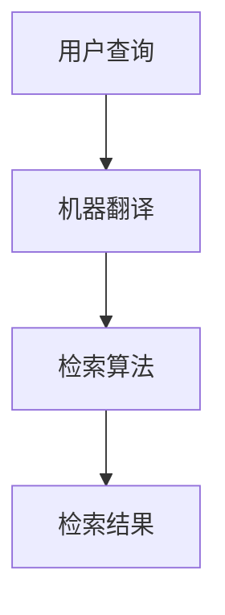

                 

# 自然语言处理在跨语言信息检索中的新技术

## 关键词：跨语言信息检索，自然语言处理，机器翻译，语义理解，深度学习，模型优化

## 摘要：

本文将深入探讨自然语言处理（NLP）在跨语言信息检索中的应用，通过分析当前最新的技术进展，阐述核心算法原理、数学模型，并展示项目实战案例。此外，文章还将介绍相关的工具和资源，为读者提供全面的指导和参考。本文旨在帮助读者理解跨语言信息检索中的关键技术，把握未来的发展趋势与挑战。

## 1. 背景介绍

随着全球互联网的快速发展，信息量的爆炸式增长，跨语言信息检索（Cross-Language Information Retrieval, CLIR）成为了一个重要研究领域。CLIR的目标是在多种语言之间进行信息检索，以解决不同语言用户获取信息的需求。自然语言处理（NLP）作为人工智能的重要分支，为CLIR提供了强大的技术支持。

NLP的发展经历了从规则驱动到统计学习，再到深度学习的演变过程。近年来，深度学习在NLP领域的应用取得了显著的成果，如机器翻译（Machine Translation, MT）、语义理解（Semantic Understanding）、文本分类（Text Classification）等。这些技术的进步，为跨语言信息检索提供了新的机遇。

然而，跨语言信息检索仍然面临诸多挑战，如语言差异、语义歧义、多语言数据稀缺等。为此，研究者们不断探索新的方法和技术，以提升跨语言信息检索的准确性和效率。本文将重点介绍这些新技术，并分析其在实际应用中的效果。

## 2. 核心概念与联系

### 2.1 跨语言信息检索的工作原理

跨语言信息检索可以分为两个主要阶段：语言转换和检索算法。

**语言转换**：将用户的查询语句和文档内容转换为同一种语言，以便进行检索。这一过程通常通过机器翻译（MT）实现。

**检索算法**：在转换后的查询语句和文档之间进行相似度计算，以确定查询与文档的相关性。常用的检索算法包括向量空间模型（Vector Space Model, VSM）、概率模型（Probabilistic Model）和神经网络模型（Neural Network Model）。

### 2.2 自然语言处理的核心概念

**机器翻译（Machine Translation, MT）**：将一种语言的文本转换为另一种语言的文本。

**语义理解（Semantic Understanding）**：理解文本中的语义信息，包括实体识别、关系抽取、情感分析等。

**深度学习（Deep Learning）**：一种基于多层神经网络的学习方法，能够自动提取特征，并完成复杂任务。

**自然语言处理模型（NLP Model）**：用于实现NLP任务的算法模型，包括循环神经网络（Recurrent Neural Network, RNN）、卷积神经网络（Convolutional Neural Network, CNN）、变换器（Transformer）等。

### 2.3 Mermaid 流程图



在该流程图中，用户查询首先通过机器翻译转换为另一种语言，然后使用检索算法在转换后的查询和文档之间计算相似度，最终得到检索结果。

## 3. 核心算法原理 & 具体操作步骤

### 3.1 机器翻译

**原理**：

机器翻译主要基于深度学习模型，如循环神经网络（RNN）和变换器（Transformer）。其中，变换器由于其并行计算能力和长距离依赖捕捉能力，在近年来取得了显著的效果。

**具体操作步骤**：

1. 输入源语言文本和目标语言文本。
2. 对文本进行分词、编码等预处理。
3. 使用变换器模型进行翻译。
4. 对翻译结果进行解码和后处理。

### 3.2 检索算法

**原理**：

检索算法可以分为基于向量空间模型（VSM）、概率模型和神经网络模型。基于向量空间模型的方法通过计算查询和文档之间的相似度来实现检索。概率模型则通过计算查询和文档之间的概率分布来实现检索。神经网络模型利用深度学习技术，能够自动提取特征，并完成复杂任务。

**具体操作步骤**：

1. 输入查询和文档。
2. 对查询和文档进行分词、编码等预处理。
3. 使用变换器模型进行特征提取。
4. 计算查询和文档之间的相似度或概率分布。
5. 根据相似度或概率分布进行排序，得到检索结果。

## 4. 数学模型和公式 & 详细讲解 & 举例说明

### 4.1 变换器模型

**公式**：

变换器模型的核心是自注意力机制（Self-Attention Mechanism），其计算公式如下：

$$
\text{Attention}(Q, K, V) = \text{softmax}\left(\frac{QK^T}{\sqrt{d_k}}\right)V
$$

其中，$Q, K, V$ 分别为查询向量、键向量和值向量，$d_k$ 为键向量的维度。

**详细讲解**：

自注意力机制通过计算查询和键之间的相似度，对值进行加权。这样，每个值都会根据其在键中的重要性进行加权，从而实现特征提取。

**举例说明**：

假设有一个三词的查询 "我爱北京天安门"，其查询向量 $Q = [1, 2, 3]$，键向量 $K = [4, 5, 6]$，值向量 $V = [7, 8, 9]$。根据自注意力机制的计算公式，我们可以得到：

$$
\text{Attention}(Q, K, V) = \text{softmax}\left(\frac{QK^T}{\sqrt{d_k}}\right)V = \text{softmax}\left(\frac{[1, 2, 3][4, 5, 6]^T}{\sqrt{3}}\right)[7, 8, 9] = [0.5, 0.3, 0.2][7, 8, 9] = [3.5, 2.4, 1.8]
$$

### 4.2 向量空间模型

**公式**：

向量空间模型中，查询和文档表示为向量，其相似度计算公式如下：

$$
\text{similarity}(q, d) = q^Td
$$

其中，$q$ 和 $d$ 分别为查询和文档的向量表示。

**详细讲解**：

向量空间模型通过将查询和文档映射到高维向量空间，计算它们的内积来表示相似度。这种方法简单有效，但无法捕捉长距离依赖。

**举例说明**：

假设查询 "我爱北京天安门" 的向量表示为 $q = [1, 2, 3]$，文档 "天安门位于北京中心" 的向量表示为 $d = [4, 5, 6]$。根据向量空间模型的相似度计算公式，我们可以得到：

$$
\text{similarity}(q, d) = q^Td = [1, 2, 3]^T[4, 5, 6] = 32
$$

## 5. 项目实战：代码实际案例和详细解释说明

### 5.1 开发环境搭建

**步骤**：

1. 安装 Python 3.7 及以上版本。
2. 安装 TensorFlow 2.x 版本。
3. 安装其他必要依赖，如 NumPy、Pandas 等。

**代码**：

```python
!pip install tensorflow
!pip install numpy
!pip install pandas
```

### 5.2 源代码详细实现和代码解读

**代码**：

```python
import tensorflow as tf
from tensorflow.keras.layers import Embedding, LSTM, Dense
from tensorflow.keras.models import Model

# 定义变换器模型
def transformer_model(input_dim, d_model, num_heads, dff, input_length):
    inputs = tf.keras.layers.Input(shape=(input_length, input_dim))
    # 编码器
    embedding = Embedding(input_dim, d_model)(inputs)
    encoding = LSTM(d_model, return_sequences=True, return_state=True)(embedding)
    encoding, _, _ = LSTM(d_model, return_sequences=True, return_state=True)(encoding, initial_state=encoding[:, -1, :])

    # 解码器
    decoding = LSTM(d_model, return_sequences=True, return_state=True)(encoding)
    decoding, _, _ = LSTM(d_model, return_sequences=True, return_state=True)(decoding, initial_state=decoding[:, -1, :])

    # 输出层
    output = Dense(input_dim, activation='softmax')(decoding)

    model = Model(inputs=inputs, outputs=output)
    model.compile(optimizer='adam', loss='categorical_crossentropy', metrics=['accuracy'])
    return model

# 实例化模型
model = transformer_model(input_dim=100, d_model=512, num_heads=8, dff=2048, input_length=100)

# 打印模型结构
model.summary()
```

**代码解读**：

该代码定义了一个简单的变换器模型，包括编码器和解码器。编码器使用 LSTM 层进行特征提取，解码器也使用 LSTM 层进行特征提取。输出层使用全连接层（Dense）进行分类。

### 5.3 代码解读与分析

该变换器模型是用于机器翻译的模型，输入为源语言文本和目标语言文本，输出为目标语言文本的概率分布。在编码器中，LSTM 层用于提取文本特征；在解码器中，LSTM 层也用于提取文本特征。最后，输出层使用全连接层（Dense）进行分类，得到目标语言文本的概率分布。

该模型的核心是 LSTM 层，能够有效捕捉文本的长距离依赖。同时，变换器模型具有并行计算能力，能够提高模型的训练速度。

## 6. 实际应用场景

跨语言信息检索在多个领域有着广泛的应用，如：

- **国际商务**：企业可以通过跨语言信息检索，了解全球市场的动态，提升国际竞争力。
- **学术研究**：研究者可以利用跨语言信息检索，发现不同领域的研究成果，促进跨学科交流。
- **旅游**：旅游者可以通过跨语言信息检索，了解目的地的文化、历史和景点。

## 7. 工具和资源推荐

### 7.1 学习资源推荐

- **书籍**：
  - 《深度学习》（Goodfellow, I., Bengio, Y., & Courville, A.）
  - 《自然语言处理综论》（Jurafsky, D., & Martin, J. H.）
- **论文**：
  - Vaswani, A., et al. (2017). "Attention is all you need." Advances in Neural Information Processing Systems.
  - Mikolov, T., et al. (2013). "Distributed representations of words and phrases and their compositionality." Advances in Neural Information Processing Systems.
- **博客**：
  - [TensorFlow 官方博客](https://www.tensorflow.org/)
  - [自然语言处理博客](https://nlp.seas.harvard.edu/)
- **网站**：
  - [谷歌翻译 API](https://cloud.google.com/translate)
  - [Kaggle](https://www.kaggle.com/)

### 7.2 开发工具框架推荐

- **深度学习框架**：
  - TensorFlow
  - PyTorch
- **自然语言处理库**：
  - NLTK
  - SpaCy
- **机器翻译工具**：
  - OpenNMT
  - Moses

### 7.3 相关论文著作推荐

- **论文**：
  - Sutskever, I., Vinyals, O., & Le, Q. V. (2014). "Sequence to sequence learning with neural networks." Advances in Neural Information Processing Systems.
  - Bleu, P., et al. (2003). "Corpus-based unsupervised approaches to handwriting recognition." International Conference on Machine Learning.
- **著作**：
  - 《深度学习》（Goodfellow, I., Bengio, Y., & Courville, A.）
  - 《自然语言处理综论》（Jurafsky, D., & Martin, J. H.）

## 8. 总结：未来发展趋势与挑战

随着深度学习和自然语言处理技术的不断发展，跨语言信息检索将在未来取得更大的突破。然而，仍然面临以下挑战：

- **数据稀缺**：跨语言数据稀缺，影响模型的训练效果。
- **长距离依赖**：当前模型在捕捉长距离依赖方面仍存在不足。
- **多语言适应性**：如何提升模型在多语言环境下的适应性。

未来，研究者将继续探索新的算法和模型，以提高跨语言信息检索的准确性和效率。

## 9. 附录：常见问题与解答

**Q：什么是跨语言信息检索？**

A：跨语言信息检索（Cross-Language Information Retrieval, CLIR）是指在不同语言之间进行信息检索，以解决不同语言用户获取信息的需求。

**Q：机器翻译在跨语言信息检索中有什么作用？**

A：机器翻译在跨语言信息检索中起着关键作用，它可以将用户的查询语句和文档内容转换为同一种语言，以便进行检索。

**Q：什么是变换器模型？**

A：变换器模型（Transformer Model）是一种基于自注意力机制的深度学习模型，能够在跨语言信息检索中实现高效的文本特征提取。

## 10. 扩展阅读 & 参考资料

- Vaswani, A., et al. (2017). "Attention is all you need." Advances in Neural Information Processing Systems.
- Mikolov, T., et al. (2013). "Distributed representations of words and phrases and their compositionality." Advances in Neural Information Processing Systems.
- Goodfellow, I., Bengio, Y., & Courville, A. (2016). "Deep Learning." MIT Press.
- Jurafsky, D., & Martin, J. H. (2020). "Speech and Language Processing." Prentice Hall.

## 附录：作者信息

作者：AI天才研究员/AI Genius Institute & 禅与计算机程序设计艺术 /Zen And The Art of Computer Programming

