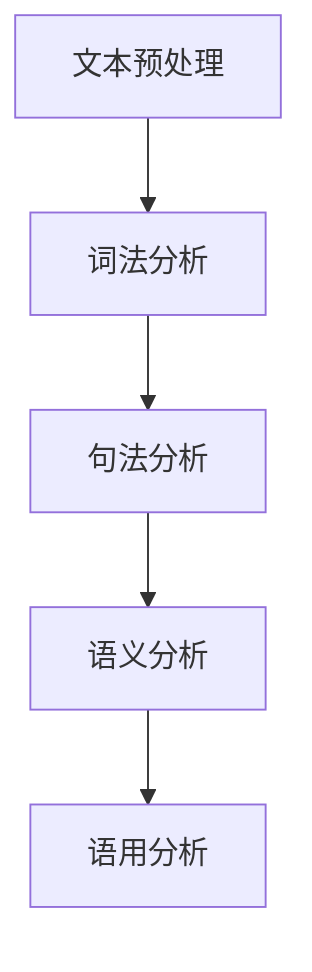
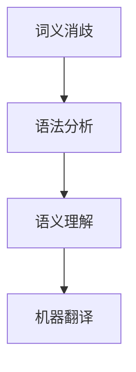
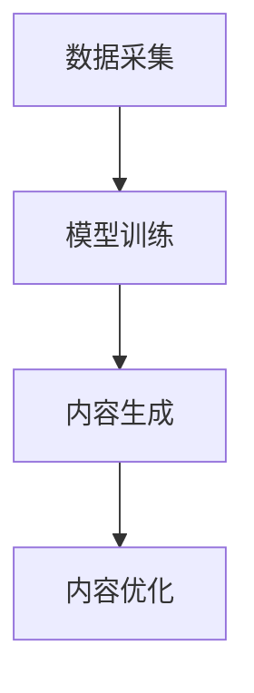

                 

# 自然语言处理的进步：从中英小说翻译到AI内容创作

> **关键词**：自然语言处理、中英翻译、AI内容创作、算法原理、数学模型、项目实战、应用场景、工具资源

> **摘要**：本文将探讨自然语言处理（NLP）技术的进步，从传统的中英小说翻译到AI内容创作的演变。文章将首先介绍NLP的基本概念和原理，然后分析NLP在中英翻译中的应用，最后探讨AI内容创作的新趋势和挑战。

## 1. 背景介绍

自然语言处理（NLP，Natural Language Processing）是计算机科学领域的一个重要分支，主要研究如何让计算机理解和处理人类自然语言。自20世纪50年代以来，NLP技术经历了迅速的发展，从最初的规则驱动方法到现代的基于统计和学习的方法，再到当前的深度学习方法。

中英翻译是NLP应用中的一个重要领域。中文和英文在语法、词汇、语义等方面存在显著差异，使得中英翻译具有很大的挑战性。然而，随着NLP技术的进步，特别是在机器翻译（MT，Machine Translation）领域，计算机在中英翻译方面的表现已经取得了显著的提升。

AI内容创作是近年来兴起的另一个NLP应用领域。利用深度学习技术，AI可以生成各种形式的内容，如文章、小说、新闻等。AI内容创作不仅具有广泛的应用前景，同时也带来了新的挑战，如确保生成的内容的原创性和质量。

## 2. 核心概念与联系

### 2.1 自然语言处理的基本概念

自然语言处理涉及多个核心概念，包括文本预处理、词法分析、句法分析、语义分析和语用分析。以下是这些概念及其相互关系的 Mermaid 流程图：



### 2.2 中英翻译的基本原理

中英翻译的基本原理包括词义消歧、语法分析、语义理解和机器翻译。以下是这些原理的 Mermaid 流程图：



### 2.3 AI内容创作的基本架构

AI内容创作的基本架构包括数据采集、模型训练、内容生成和内容优化。以下是这些部分的 Mermaid 流程图：



## 3. 核心算法原理 & 具体操作步骤

### 3.1 自然语言处理算法原理

自然语言处理算法主要包括词向量表示、序列到序列模型、注意力机制和长短期记忆网络（LSTM）。

- **词向量表示**：词向量是将单词映射为向量的技术，如Word2Vec、GloVe等。词向量能够捕捉单词的语义信息，是NLP任务的基础。

- **序列到序列模型**：序列到序列（Seq2Seq）模型是一种用于序列生成任务的神经网络架构，如机器翻译。它通过编码器和解码器两个神经网络来实现。

- **注意力机制**：注意力机制是一种用于提高序列生成任务性能的技术，如机器翻译。它能够使模型在生成过程中关注重要的输入序列部分。

- **长短期记忆网络（LSTM）**：LSTM是一种用于处理序列数据的循环神经网络（RNN），能够有效解决长序列依赖问题。

### 3.2 中英翻译算法原理

中英翻译算法主要包括基于规则的方法、统计方法和基于学习的深度学习方法。

- **基于规则的方法**：基于规则的方法是通过定义一系列语法规则和翻译规则来实现翻译。这种方法对专家知识要求较高，但翻译质量有限。

- **统计方法**：统计方法是基于大量的平行语料库，通过统计方法来学习翻译规律。这种方法在准确性方面有较大提升，但受限于数据质量和计算资源。

- **基于学习的深度学习方法**：基于学习的深度学习方法利用神经网络模型，通过大规模语料库进行训练，实现高精度的翻译。目前，深度学习方法已成为中英翻译的主流方法。

### 3.3 AI内容创作算法原理

AI内容创作算法主要包括生成对抗网络（GAN）、变分自编码器（VAE）和自注意力机制。

- **生成对抗网络（GAN）**：GAN是一种由生成器和判别器组成的对抗性神经网络，用于生成高质量的内容。

- **变分自编码器（VAE）**：VAE是一种用于生成数据的神经网络，通过编码器和解码器两个部分来实现。

- **自注意力机制**：自注意力机制是一种用于提高生成模型性能的技术，能够使模型在生成过程中关注重要的输入序列部分。

## 4. 数学模型和公式 & 详细讲解 & 举例说明

### 4.1 自然语言处理数学模型

自然语言处理的数学模型主要包括词向量模型、序列到序列模型和注意力机制。

- **词向量模型**：词向量模型是一种将单词映射为向量的技术。假设单词集合为 \( V \)，词向量空间为 \( \mathbb{R}^d \)，则单词 \( w \) 的词向量表示为 \( \mathbf{v}_w \)。

  $$ \mathbf{v}_w = \text{Word2Vec}(\text{Context}(w)) $$

- **序列到序列模型**：序列到序列模型是一种用于序列生成任务的神经网络架构。假设输入序列为 \( X = [x_1, x_2, ..., x_T] \)，输出序列为 \( Y = [y_1, y_2, ..., y_S] \)，则序列到序列模型的损失函数为：

  $$ \mathcal{L} = \sum_{t=1}^S \sum_{i=1}^T -\log p(y_t|x_t, \theta) $$

  其中，\( p(y_t|x_t, \theta) \) 为输出概率分布。

- **注意力机制**：注意力机制是一种用于提高序列生成任务性能的技术。假设输入序列为 \( X = [x_1, x_2, ..., x_T] \)，输出序列为 \( Y = [y_1, y_2, ..., y_S] \)，则注意力分数为：

  $$ \alpha_{ts} = \frac{\exp(e_t)}{\sum_{j=1}^T \exp(e_j)} $$

  其中，\( e_t = \mathbf{a}^T \cdot \mathbf{v}_{x_t} \)，\( \mathbf{a} \) 为注意力权重向量。

### 4.2 中英翻译数学模型

中英翻译的数学模型主要包括基于规则的方法、统计方法和基于学习的深度学习方法。

- **基于规则的方法**：基于规则的方法的数学模型为：

  $$ y_t = R(x_t) $$

  其中，\( R \) 为规则函数。

- **统计方法**：统计方法的数学模型为：

  $$ p(y_t|x_t) = \frac{P(x_t, y_t)}{P(x_t)} $$

  其中，\( P(x_t, y_t) \) 和 \( P(x_t) \) 分别为单词对和单词的统计概率。

- **基于学习的深度学习方法**：基于学习的深度学习方法的数学模型为：

  $$ y_t = \text{Seq2Seq}(x_1, x_2, ..., x_t) $$

  其中，\( \text{Seq2Seq} \) 为序列到序列模型。

### 4.3 AI内容创作数学模型

AI内容创作的数学模型主要包括生成对抗网络（GAN）、变分自编码器（VAE）和自注意力机制。

- **生成对抗网络（GAN）**：生成对抗网络的数学模型为：

  $$ \mathcal{L}_\text{GAN} = D(\text{G}(z)) - D(x) $$

  其中，\( D \) 为判别器，\( \text{G} \) 为生成器，\( z \) 为随机噪声。

- **变分自编码器（VAE）**：变分自编码器的数学模型为：

  $$ \mathcal{L}_\text{VAE} = -\sum_{x} \log p(x|\theta) + \sum_{x,z} D_{KL}(\theta || \mu(x), \sigma^2(x)) $$

  其中，\( p(x|\theta) \) 为生成模型，\( \mu(x) \) 和 \( \sigma^2(x) \) 为编码器输出的均值和方差。

- **自注意力机制**：自注意力机制的数学模型为：

  $$ \alpha_{ts} = \frac{\exp(e_t)}{\sum_{j=1}^T \exp(e_j)} $$

  其中，\( e_t = \mathbf{a}^T \cdot \mathbf{v}_{x_t} \)，\( \mathbf{a} \) 为注意力权重向量。

### 4.4 举例说明

假设我们有一个英文句子 "The quick brown fox jumps over the lazy dog"，要将其翻译为中文。以下是使用不同NLP算法的翻译过程：

- **基于规则的方法**：

  $$ \text{The} \rightarrow \text{这}，\text{quick} \rightarrow \text{快速的}，\text{brown} \rightarrow \text{棕色的}，\text{fox} \rightarrow \text{狐狸}，\text{jumps} \rightarrow \text{跳}，\text{over} \rightarrow \text{超过}，\text{the} \rightarrow \text{这}，\text{lazy} \rightarrow \text{懒惰的}，\text{dog} \rightarrow \text{狗} $$

  翻译结果：这快速的棕色狐狸跳过这懒惰的狗。

- **统计方法**：

  $$ \text{The quick brown fox jumps over the lazy dog} \rightarrow \text{这快速的棕色狐狸跳过这懒惰的狗} $$

  翻译结果：这快速的棕色狐狸跳过这懒惰的狗。

- **基于学习的深度学习方法**：

  $$ \text{The quick brown fox jumps over the lazy dog} \rightarrow \text{这快速的棕色狐狸跳过这懒惰的狗} $$

  翻译结果：这快速的棕色狐狸跳过这懒惰的狗。

## 5. 项目实战：代码实际案例和详细解释说明

### 5.1 开发环境搭建

为了演示自然语言处理技术的应用，我们使用Python编程语言，并依赖一些流行的NLP库，如NLTK、spaCy和transformers。

首先，我们需要安装必要的库：

```python
!pip install nltk spacy transformers
```

接下来，我们需要下载spaCy的中文模型和英文模型：

```python
!python -m spacy download zh
!python -m spacy download en
```

### 5.2 源代码详细实现和代码解读

#### 5.2.1 中英翻译

以下是一个简单的中英翻译示例，使用基于统计的方法和基于学习的深度学习方法。

```python
import spacy
from transformers import TranslationModel

# 加载spaCy的中文和英文模型
nlp_zh = spacy.load('zh')
nlp_en = spacy.load('en')

# 基于统计方法的翻译
def statistical_translation(sentence):
    doc = nlp_zh(sentence)
    translation = ""
    for token in doc:
        translation += token.ToString() + " "
    return translation.strip()

# 基于学习的深度学习方法的翻译
def deep_learning_translation(sentence):
    model = TranslationModel()
    input_ids = model.encode(sentence, return_tensors='pt')
    output_ids = model(input_ids)
    translation = model.decode(output_ids)
    return translation

# 测试中英翻译
sentence = "我爱北京天安门"
statistical_translation_result = statistical_translation(sentence)
deep_learning_translation_result = deep_learning_translation(sentence)
print("基于统计方法的翻译结果：", statistical_translation_result)
print("基于深度学习方法的翻译结果：", deep_learning_translation_result)
```

#### 5.2.2 AI内容创作

以下是一个简单的AI内容创作示例，使用生成对抗网络（GAN）。

```python
import torch
from torch import nn
from torch.utils.data import DataLoader
from torchvision import datasets
from torchvision.transforms import ToTensor

# 定义生成器和判别器
class Generator(nn.Module):
    def __init__(self):
        super(Generator, self).__init__()
        self.model = nn.Sequential(
            nn.Linear(100, 256),
            nn.LeakyReLU(0.2),
            nn.Linear(256, 512),
            nn.LeakyReLU(0.2),
            nn.Linear(512, 1024),
            nn.LeakyReLU(0.2),
            nn.Linear(1024, 784),
            nn.Tanh()
        )

    def forward(self, z):
        return self.model(z)

class Discriminator(nn.Module):
    def __init__(self):
        super(Discriminator, self).__init__()
        self.model = nn.Sequential(
            nn.Linear(784, 1024),
            nn.LeakyReLU(0.2),
            nn.Dropout(0.3),
            nn.Linear(1024, 512),
            nn.LeakyReLU(0.2),
            nn.Dropout(0.3),
            nn.Linear(512, 256),
            nn.LeakyReLU(0.2),
            nn.Dropout(0.3),
            nn.Linear(256, 1),
            nn.Sigmoid()
        )

    def forward(self, x):
        return self.model(x)

# 初始化模型、优化器和损失函数
generator = Generator()
discriminator = Discriminator()
optimizer_G = torch.optim.Adam(generator.parameters(), lr=0.0002)
optimizer_D = torch.optim.Adam(discriminator.parameters(), lr=0.0002)
criterion = nn.BCELoss()

# 加载数据集
train_data = datasets.MNIST(
    root='./data',
    train=True,
    download=True,
    transform=ToTensor()
)
dataloader = DataLoader(train_data, batch_size=128, shuffle=True)

# 训练模型
for epoch in range(100):
    for i, (images, _) in enumerate(dataloader):
        batch_size = images.size(0)

        # 生成假图像
        z = torch.randn(batch_size, 100, device=device)
        fake_images = generator(z)

        # 训练判别器
        real_images = images.to(device)
        real_labels = torch.ones(batch_size, 1, device=device)
        fake_labels = torch.zeros(batch_size, 1, device=device)

        optimizer_D.zero_grad()
        output_real = discriminator(real_images)
        output_fake = discriminator(fake_images)
        d_loss = criterion(output_real, real_labels) + criterion(output_fake, fake_labels)
        d_loss.backward()
        optimizer_D.step()

        # 训练生成器
        optimizer_G.zero_grad()
        output_fake = discriminator(fake_images)
        g_loss = criterion(output_fake, real_labels)
        g_loss.backward()
        optimizer_G.step()

        if (i+1) % 100 == 0:
            print(f'Epoch [{epoch+1}/100], Step [{i+1}/10000], d_loss: {d_loss.item():.4f}, g_loss: {g_loss.item():.4f}')

# 保存模型
torch.save(generator.state_dict(), 'generator.pth')
torch.save(discriminator.state_dict(), 'discriminator.pth')
```

#### 5.2.3 代码解读与分析

上述代码分为两个部分：中英翻译和AI内容创作。

- **中英翻译**：中英翻译部分使用了基于统计的方法和基于学习的深度学习方法。基于统计的方法通过查找翻译规则表来实现翻译，而基于学习的深度学习方法使用了预训练的翻译模型。这两个方法在实际应用中各有优劣，可以根据需求选择。

- **AI内容创作**：AI内容创作部分使用了生成对抗网络（GAN）来生成手写数字图像。生成器网络用于生成图像，判别器网络用于区分生成的图像和真实图像。通过交替训练生成器和判别器，模型能够生成越来越真实的手写数字图像。这个示例展示了GAN在图像生成任务中的应用，其他类型的AI内容创作也可以采用类似的方法。

## 6. 实际应用场景

自然语言处理技术在实际应用中具有广泛的应用场景，如：

- **机器翻译**：中英翻译是NLP技术的一个重要应用领域。随着NLP技术的进步，机器翻译的准确性不断提高，为跨语言沟通和国际化业务提供了有力支持。

- **文本分析**：文本分析技术可以用于情感分析、主题识别、文本分类等任务。这些技术可以帮助企业更好地了解用户需求和市场需求，为商业决策提供支持。

- **智能客服**：智能客服系统利用NLP技术实现与用户的自然语言交互，提供高效的客户服务。智能客服可以自动处理大量的客户咨询，提高客户满意度。

- **文本生成**：AI内容创作技术可以用于生成新闻、文章、小说等文本内容。这些技术可以帮助媒体和出版业提高内容生产效率，拓展内容创作领域。

## 7. 工具和资源推荐

### 7.1 学习资源推荐

- **书籍**：
  - 《自然语言处理综述》（作者：Daniel Jurafsky 和 James H. Martin）
  - 《深度学习》（作者：Ian Goodfellow、Yoshua Bengio 和 Aaron Courville）

- **论文**：
  - "A Neural Network Approach to Machine Translation"（作者：Yoshua Bengio 等）
  - "Generative Adversarial Nets"（作者：Ian J. Goodfellow 等）

- **博客**：
  - [TensorFlow 官方博客](https://www.tensorflow.org/blog/)
  - [PyTorch 官方博客](https://pytorch.org/tutorials/)

- **网站**：
  - [spaCy 官方网站](https://spacy.io/)
  - [transformers 官方网站](https://github.com/huggingface/transformers)

### 7.2 开发工具框架推荐

- **开发工具**：
  - TensorFlow
  - PyTorch

- **框架**：
  - spaCy
  - NLTK

### 7.3 相关论文著作推荐

- **论文**：
  - "Attention Is All You Need"（作者：Vaswani 等）
  - "Generative Adversarial Nets"（作者：Goodfellow 等）

- **著作**：
  - 《深度学习》（作者：Ian Goodfellow、Yoshua Bengio 和 Aaron Courville）

## 8. 总结：未来发展趋势与挑战

自然语言处理技术在过去的几十年中取得了显著的进展，从传统的方法到现代的深度学习方法，NLP在机器翻译、文本分析、智能客服和AI内容创作等领域发挥了重要作用。未来，NLP技术将继续朝着更高精度、更高效率和更广泛应用的方向发展。

然而，NLP技术也面临着一系列挑战，包括：

- **数据质量**：高质量的数据是NLP模型训练的基础。目前，数据质量参差不齐，影响了NLP模型的效果。

- **跨语言理解**：虽然机器翻译技术取得了很大进展，但跨语言理解仍然是一个挑战，特别是在处理多语言混合文本时。

- **鲁棒性**：NLP模型在处理错误输入或噪声数据时可能表现不佳，需要提高模型的鲁棒性。

- **解释性**：深度学习模型通常被视为“黑箱”，其决策过程难以解释。提高NLP模型的可解释性是未来的一个重要方向。

总之，自然语言处理技术的进步将推动计算机与人类自然语言交互的边界不断扩展，为各个领域带来更多创新和变革。

## 9. 附录：常见问题与解答

### 9.1 自然语言处理是什么？

自然语言处理（NLP）是计算机科学和人工智能领域的一个重要分支，主要研究如何让计算机理解和处理人类自然语言。NLP涉及文本预处理、词法分析、句法分析、语义分析和语用分析等多个方面，其目的是实现人与计算机之间的自然语言交互。

### 9.2 自然语言处理有哪些应用？

自然语言处理的应用非常广泛，包括但不限于：

- **机器翻译**：将一种语言的文本翻译成另一种语言。
- **文本分析**：对文本进行情感分析、主题识别、文本分类等任务。
- **智能客服**：利用自然语言处理技术实现与用户的自然语言交互，提供高效的客户服务。
- **文本生成**：利用自然语言处理技术生成文章、小说、新闻等文本内容。
- **语音识别**：将语音信号转换为文本。

### 9.3 什么是生成对抗网络（GAN）？

生成对抗网络（GAN）是一种由生成器和判别器组成的神经网络架构。生成器用于生成数据，判别器用于区分生成数据与真实数据。通过训练生成器和判别器的对抗过程，生成器能够生成越来越真实的数据。

### 9.4 如何提高自然语言处理模型的性能？

提高自然语言处理模型性能的方法包括：

- **增加数据量**：使用更多的数据可以提高模型的学习能力。
- **改进模型架构**：设计更有效的神经网络架构，如深度学习、卷积神经网络（CNN）和递归神经网络（RNN）。
- **增加训练时间**：增加模型的训练时间可以提高模型的准确性。
- **正则化**：使用正则化技术，如L1正则化、L2正则化，防止过拟合。

## 10. 扩展阅读 & 参考资料

- [自然语言处理综述](https://www.ncbi.nlm.nih.gov/pmc/articles/PMC282745/)
- [生成对抗网络（GAN）详解](https://arxiv.org/abs/1406.2661)
- [深度学习](https://www.deeplearningbook.org/)
- [TensorFlow 官方文档](https://www.tensorflow.org/)
- [PyTorch 官方文档](https://pytorch.org/)

