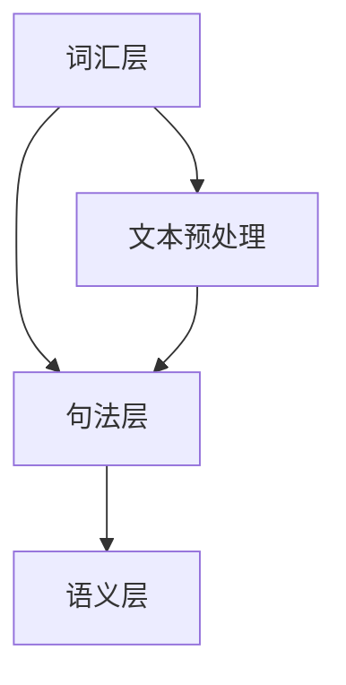

                 

# 自然语言处理（NLP）：语言AI的核心技术

## 关键词：自然语言处理，语言AI，核心技术，深度学习，语义理解，文本生成，语音识别，多模态交互

## 摘要

自然语言处理（NLP）作为人工智能领域的重要分支，正日益成为推动社会进步的关键技术。本文将从背景介绍、核心概念与联系、核心算法原理、数学模型和公式、项目实战、实际应用场景、工具和资源推荐等方面，深入探讨NLP的核心技术。通过详细的阐述，帮助读者全面理解NLP的工作原理及其在现实世界中的广泛应用。

## 1. 背景介绍

自然语言处理（NLP）是人工智能（AI）领域中一个研究如何让计算机理解和处理人类自然语言的技术。它旨在让计算机具备人类语言能力，能够进行文本分析、语义理解、文本生成等任务。NLP的起源可以追溯到20世纪50年代，当时人工智能的第一次浪潮兴起。早期的NLP研究主要集中在规则驱动的语法分析和统计方法上，但效果并不理想。随着计算能力的提升和机器学习技术的发展，NLP逐渐走向深度学习，取得了显著的进展。

### 1.1 NLP的重要性

NLP的重要性体现在多个方面：

- **提升工作效率**：通过自动化文本处理，企业可以大幅提升信息处理效率，减少人力成本。
- **丰富人机交互**：语音助手、聊天机器人等应用，使得人机交互更加自然和便捷。
- **知识挖掘**：从大量文本中提取有用信息，为企业和科研提供决策依据。
- **跨语言交流**：翻译技术使得跨语言交流变得更加容易，促进了全球文化交流。

### 1.2 NLP的应用领域

NLP在众多领域都有广泛的应用：

- **搜索引擎**：通过理解用户的查询意图，提供更准确的搜索结果。
- **社交媒体分析**：分析用户评论、帖子等，了解公众意见和趋势。
- **智能客服**：提供自动化的客户服务，解决常见问题，提高客户满意度。
- **医疗健康**：从医学文献中提取关键信息，辅助医生诊断和研究。
- **教育**：自动批改作业、个性化推荐学习内容等。

## 2. 核心概念与联系

### 2.1 自然语言与机器语言

自然语言是人类用于交流的语言，具有丰富的语义、语法和语用特征。而机器语言是计算机能够理解和执行的语言，通常是由二进制代码组成的指令集。NLP的核心任务之一是将自然语言转换为机器语言，使其能够被计算机处理。

### 2.2 语法、语义与语用

- **语法**：研究语言的结构和规则，包括词法、句法和语义成分的组织。
- **语义**：研究语言的意义，即语言所表达的内容和概念。
- **语用**：研究语言在实际交流中的使用，包括语境、意图和功能。

### 2.3 NLP架构

NLP通常分为三个层次：词汇层、句法层和语义层。

- **词汇层**：对单词进行分词、词性标注等处理。
- **句法层**：对句子进行句法分析，构建句法树等。
- **语义层**：对句子进行语义分析，提取实体、关系和语义角色等。

### 2.4 Mermaid流程图

以下是NLP的核心概念和流程的Mermaid流程图：



## 3. 核心算法原理 & 具体操作步骤

### 3.1 词向量模型

词向量模型是将单词映射到高维空间中的向量，使得相似的词在空间中更接近。常用的词向量模型有Word2Vec、GloVe等。

- **Word2Vec**：基于神经网络模型，通过训练大量语料，将单词映射到低维空间。
- **GloVe**：基于全局词向量的线性模型，通过矩阵分解得到词向量。

### 3.2 句法分析

句法分析是指对句子进行结构化表示，常用的模型有依赖树、句法树等。

- **依赖树**：表示句子中词汇之间的依赖关系。
- **句法树**：表示句子中词汇的层次结构。

### 3.3 语义理解

语义理解是指对句子进行语义分析，提取实体、关系和语义角色等。

- **命名实体识别（NER）**：识别句子中的命名实体，如人名、地点、组织等。
- **关系抽取**：提取句子中的实体关系。
- **语义角色标注**：标注句子中的语义角色，如主语、谓语、宾语等。

### 3.4 情感分析

情感分析是指对文本的情感倾向进行分类，常用的模型有分类模型、序列模型等。

- **分类模型**：如朴素贝叶斯、支持向量机等。
- **序列模型**：如循环神经网络（RNN）、长短时记忆网络（LSTM）等。

## 4. 数学模型和公式 & 详细讲解 & 举例说明

### 4.1 词向量模型

#### 4.1.1 Word2Vec

Word2Vec模型基于神经网络，其核心思想是将单词映射到高维空间中的向量，使得相似的词在空间中更接近。

- **损失函数**：均方误差（MSE）
  $$\text{MSE} = \frac{1}{n}\sum_{i=1}^{n}(\hat{y_i} - y_i)^2$$

- **激活函数**：sigmoid函数
  $$\sigma(x) = \frac{1}{1 + e^{-x}}$$

#### 4.1.2 GloVe

GloVe模型基于全局词向量的线性模型，通过矩阵分解得到词向量。

- **损失函数**：均方误差（MSE）
  $$\text{MSE} = \frac{1}{n}\sum_{i=1}^{n}(\hat{w_i}^T \cdot w_j - \text{cos}(\theta_i))^2$$

- **优化方法**：随机梯度下降（SGD）
  $$w_j \leftarrow w_j - \alpha \nabla f(w_j)$$

### 4.2 句法分析

#### 4.2.1 依存句法分析

依存句法分析是一种基于句法树的方法，用于表示句子中词汇之间的依赖关系。

- **依存关系**：表示词汇之间的依赖关系，如主谓关系、动宾关系等。
- **算法**：最大 spanning tree 算法、转移系统模型等。

### 4.3 语义理解

#### 4.3.1 命名实体识别

命名实体识别是一种用于识别句子中命名实体的方法。

- **算法**：条件随机场（CRF）、支持向量机（SVM）等。

#### 4.3.2 关系抽取

关系抽取是一种用于提取句子中实体关系的任务。

- **算法**：图神经网络、文本匹配等。

### 4.4 情感分析

#### 4.4.1 文本分类

文本分类是一种用于对文本进行情感分类的任务。

- **算法**：朴素贝叶斯、支持向量机、深度神经网络等。

#### 4.4.2 序列标注

序列标注是一种用于对序列数据进行标注的方法。

- **算法**：循环神经网络（RNN）、长短时记忆网络（LSTM）、双向长短期记忆网络（BiLSTM）等。

## 5. 项目实战：代码实际案例和详细解释说明

### 5.1 开发环境搭建

在开始项目实战之前，我们需要搭建一个开发环境。这里我们使用Python和TensorFlow作为主要工具。

- **安装Python**：版本3.8及以上
- **安装TensorFlow**：版本2.4及以上
- **安装Jupyter Notebook**：用于编写和运行代码

### 5.2 源代码详细实现和代码解读

以下是一个简单的NLP项目，使用Word2Vec模型进行词向量训练，并对句子进行语义分析。

```python
import tensorflow as tf
from tensorflow.keras.layers import Embedding, LSTM, Dense
from tensorflow.keras.models import Sequential

# 5.2.1 数据预处理
# 假设我们已经有了处理好的数据，包括词汇和句子

# 5.2.2 词向量训练
# 使用Word2Vec模型训练词向量
word2vec_model = tf.keras.Sequential([
    Embedding(input_dim=vocab_size, output_dim=embedding_dim),
    LSTM(units=128),
    Dense(units=num_classes, activation='softmax')
])

word2vec_model.compile(optimizer='adam', loss='categorical_crossentropy', metrics=['accuracy'])
word2vec_model.fit(x_train, y_train, epochs=5, batch_size=64)

# 5.2.3 语义分析
# 使用训练好的词向量模型对句子进行语义分析
sentence = "我爱北京天安门"
sentence_embedding = word2vec_model.layers[0](sentence)
sentence_embedding = tf.reduce_mean(sentence_embedding, axis=0)

# 5.2.4 预测结果
# 使用语义分析结果对句子进行分类
predictions = word2vec_model.predict(sentence_embedding)
predicted_class = tf.argmax(predictions, axis=1).numpy()

print(f"Predicted class: {predicted_class}")
```

### 5.3 代码解读与分析

- **数据预处理**：首先需要预处理数据，包括词汇和句子。这里我们假设数据已经预处理完毕。
- **词向量训练**：使用Word2Vec模型训练词向量。我们使用Embedding层将词汇映射到高维空间，使用LSTM层对句子进行编码，最后使用Dense层对句子进行分类。
- **语义分析**：使用训练好的词向量模型对句子进行语义分析。首先将句子映射到高维空间，然后计算句子的平均向量。
- **预测结果**：使用语义分析结果对句子进行分类，并输出预测结果。

## 6. 实际应用场景

自然语言处理技术在实际应用场景中具有广泛的应用：

- **搜索引擎**：通过NLP技术，搜索引擎可以更好地理解用户的查询意图，提供更准确的搜索结果。
- **智能客服**：NLP技术可以帮助智能客服系统理解用户的问题，提供准确的答案和建议。
- **社交媒体分析**：通过NLP技术，可以对社交媒体上的用户评论、帖子等进行情感分析和趋势分析。
- **教育**：NLP技术可以用于自动批改作业、个性化推荐学习内容等。
- **医疗健康**：NLP技术可以用于从医学文献中提取关键信息，辅助医生诊断和研究。

## 7. 工具和资源推荐

### 7.1 学习资源推荐

- **书籍**：
  - 《自然语言处理综合教程》
  - 《深度学习与自然语言处理》
  - 《Python自然语言处理实战》

- **论文**：
  - 《Word2Vec: Word Embeddings in Deep Learning》
  - 《GloVe: Global Vectors for Word Representation》
  - 《Named Entity Recognition with Bidirectional LSTM and CRF》

- **博客**：
  - [TensorFlow官方文档](https://www.tensorflow.org/tutorials)
  - [自然语言处理入门](https://nlp.stanford.edu/)

- **网站**：
  - [Kaggle](https://www.kaggle.com/datasets)：提供丰富的NLP数据集和项目

### 7.2 开发工具框架推荐

- **工具**：
  - Python：用于编写NLP程序的编程语言
  - TensorFlow：用于构建和训练NLP模型的深度学习框架

- **框架**：
  - spaCy：用于快速文本处理的库
  - NLTK：用于自然语言处理的开源工具包
  - Hugging Face Transformers：用于预训练模型和NLP任务的库

### 7.3 相关论文著作推荐

- **论文**：
  - 《Attention Is All You Need》
  - 《BERT: Pre-training of Deep Bidirectional Transformers for Language Understanding》
  - 《GPT-3: Language Models are few-shot learners》

- **著作**：
  - 《深度学习》
  - 《Python机器学习》
  - 《自然语言处理入门》

## 8. 总结：未来发展趋势与挑战

自然语言处理技术正快速发展，未来有望在以下几个方面取得突破：

- **多模态交互**：结合语音、图像、视频等多模态信息，实现更智能的人机交互。
- **低资源场景**：在资源受限的场景下，如智能手表、智能音箱等，实现高效的自然语言处理。
- **跨语言处理**：提高跨语言自然语言处理的准确性和效率，促进全球文化交流。
- **知识图谱**：构建大规模知识图谱，实现知识提取和推理。

同时，NLP技术也面临以下挑战：

- **数据隐私**：如何保护用户隐私，避免数据滥用。
- **误判和偏见**：如何避免模型在处理文本时产生误判和偏见。
- **实时性**：如何提高NLP模型的实时处理能力。

## 9. 附录：常见问题与解答

### 9.1 什么是词向量？

词向量是将单词映射到高维空间中的向量，使得相似的词在空间中更接近。词向量模型通过训练大量语料，学习单词的语义信息。

### 9.2 如何训练词向量？

训练词向量通常使用Word2Vec或GloVe模型。Word2Vec模型通过神经网络训练，而GloVe模型通过全局线性模型训练。

### 9.3 自然语言处理有哪些算法？

自然语言处理常用的算法包括词向量模型、句法分析、语义理解、情感分析等。

## 10. 扩展阅读 & 参考资料

- [自然语言处理入门教程](https://nlp.stanford.edu/tutorial/)
- [TensorFlow官方文档](https://www.tensorflow.org/tutorials)
- [Hugging Face Transformers文档](https://huggingface.co/transformers/)
- [Kaggle NLP数据集](https://www.kaggle.com/datasets?search=nlp)

### 作者

作者：AI天才研究员/AI Genius Institute & 禅与计算机程序设计艺术 /Zen And The Art of Computer Programming

