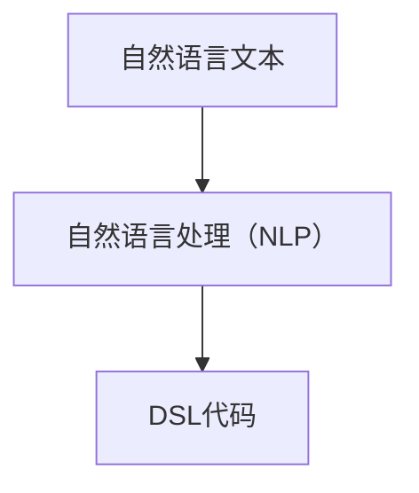
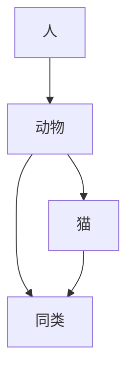
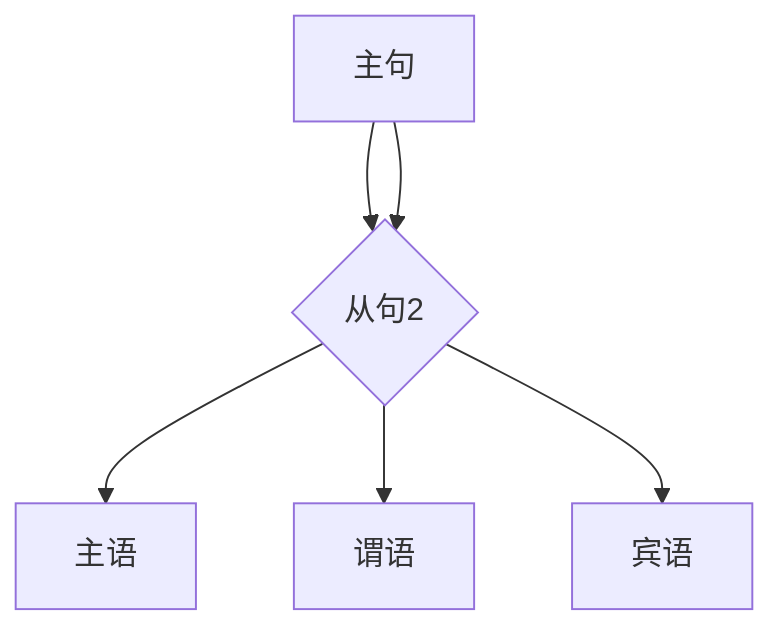

                 

### 背景介绍 Background Introduction

#### DSL：领域特定语言的兴起

领域特定语言（Domain-Specific Language，简称DSL）是一种为特定领域或任务设计的高级编程语言。与通用编程语言如Python、Java等不同，DSL旨在提高特定领域的开发效率，通过定制化的语法和功能来简化领域内问题的解决过程。

DSL的出现可以追溯到20世纪80年代，当时为了解决复杂的计算机图形设计和CAD（计算机辅助设计）问题，开发了许多特定的语言，如AutoLISP和Prolog等。随着时间的推移，DSL的应用范围逐渐扩展到Web开发、数据分析、游戏开发等多个领域。如今，DSL已成为软件工程中不可或缺的一部分。

#### 自然语言与DSL的关系

自然语言是人类日常交流的主要工具，具有丰富的表达能力和灵活性。然而，自然语言的复杂性和歧义性也使得它难以直接应用于计算机编程。与此相比，DSL通过简化语言结构、提供明确的语义和语法规则，提高了程序的可读性和可维护性。

近年来，随着自然语言处理（NLP）技术的进步，人们开始探索将自然语言与DSL相结合的可能性。这种结合有望使软件开发过程更加直观和高效，让非专业人士也能参与到软件构建中来。

#### 文章目的

本文旨在探讨自然语言构建DSL的可行性，分析其潜在优势与挑战，并提供一系列项目实战案例和应用场景。通过本文的阅读，读者将了解：

1. DSL的基本概念和发展历程。
2. 自然语言与DSL的结合点及其优势。
3. 构建自然语言DSL的核心算法原理。
4. 自然语言DSL的实际应用案例。
5. 未来发展趋势与面临的挑战。

在接下来的章节中，我们将逐一深入探讨上述问题，以期为读者提供全面的见解。

## 2. 核心概念与联系 Core Concepts and Relationships

### DSL的定义与特点

领域特定语言（DSL）是一种专注于解决特定领域问题的编程语言。DSL的设计目标是通过提供领域内专有的语法和功能，简化开发过程，提高开发效率。DSL具有以下几个核心特点：

1. **领域针对性**：DSL专为特定领域或任务设计，因此其语法和功能与该领域密切相关。例如，SQL是一种用于数据库查询的DSL，而HTML则是一种用于网页设计的DSL。

2. **简洁性**：DSL通常具有简洁的语法，便于领域专家快速理解和编写。这与通用编程语言的复杂语法形成鲜明对比。

3. **高度抽象**：DSL通过抽象领域内的常见操作和概念，减少了冗余代码，提高了开发效率。

4. **互操作性**：DSL可以与其他通用编程语言或工具集成，以便在更广泛的范围内使用。

### 自然语言与DSL的结合

自然语言是人类用于交流和表达思想的主要工具，具有丰富的语义和表达方式。然而，自然语言的复杂性和歧义性使得其直接应用于编程存在挑战。因此，将自然语言与DSL相结合成为一种潜在的方向。

自然语言与DSL的结合点主要体现在以下几个方面：

1. **语法简化**：自然语言通常具有简洁的语法结构，可以简化DSL的编写过程。例如，使用自然语言定义函数或类的方法，可以减少冗余代码。

2. **语义明确**：自然语言提供了丰富的语义信息，可以用于提高DSL的可读性和可维护性。例如，使用自然语言描述算法逻辑，使代码更易于理解。

3. **自动化解析**：自然语言处理（NLP）技术可以用于自动化解析自然语言文本，将其转换为DSL代码。这有助于降低开发难度，提高开发效率。

### Mermaid 流程图展示 DSL 与自然语言的结合

下面是一个简单的Mermaid流程图，展示DSL与自然语言结合的过程：



在这个流程图中，自然语言文本首先经过自然语言处理（NLP）步骤，提取出关键信息和语义。然后，这些信息被转换为DSL代码，从而实现自然语言与DSL的结合。

### 自然语言DSL的优势

结合自然语言与DSL具有以下优势：

1. **降低开发门槛**：自然语言DSL使得非专业人士也能够参与到软件开发中来，从而降低了开发门槛。

2. **提高开发效率**：通过简化语法和提供明确的语义，自然语言DSL可以显著提高开发效率。

3. **增强可读性**：自然语言DSL使得代码更加贴近日常用语，提高了代码的可读性和可维护性。

4. **增强互操作性**：自然语言DSL可以与通用编程语言和工具无缝集成，从而提高项目的可扩展性和灵活性。

总之，自然语言与DSL的结合为软件开发带来了新的可能性。在接下来的章节中，我们将深入探讨构建自然语言DSL的核心算法原理，以进一步了解其实现过程和潜在应用。

## 3. 核心算法原理 & 具体操作步骤 Core Algorithm Principles and Detailed Steps

### 自然语言处理（NLP）技术

自然语言处理（NLP）是计算机科学和人工智能领域的一个重要分支，旨在让计算机理解和处理人类自然语言。NLP的核心算法主要包括分词、词性标注、命名实体识别、句法分析等。以下是对这些算法的简要介绍：

1. **分词**：分词是将自然语言文本分割成单词或短语的步骤。常见的分词方法包括基于词典的分词、基于统计的分词和基于字符的序列模式匹配。

2. **词性标注**：词性标注是为文本中的每个单词分配词性标签（如名词、动词、形容词等）的过程。常见的词性标注方法包括基于规则的方法和基于统计的方法。

3. **命名实体识别**：命名实体识别是从文本中识别出具有特定意义的实体（如人名、地名、机构名等）的过程。命名实体识别是NLP中的一项重要任务，有助于提取文本中的关键信息。

4. **句法分析**：句法分析是对文本中的句子结构进行分析，以理解句子的语法规则。常见的句法分析方法包括基于规则的方法和基于统计的方法。

### DSL代码生成算法

构建自然语言DSL的核心任务是将自然语言文本转换为DSL代码。这通常涉及以下步骤：

1. **文本预处理**：在生成DSL代码之前，需要对自然语言文本进行预处理。预处理步骤包括去除停用词、标点符号和特殊字符，以及进行词干提取和词形还原。

2. **语义提取**：通过NLP技术提取自然语言文本中的关键信息，如动词、名词、时间、地点等。这些信息将用于生成DSL代码中的变量、函数和语句。

3. **语法分析**：对预处理后的文本进行语法分析，以确定文本中的语法结构和语义关系。常见的语法分析方法包括基于规则的方法和基于统计的方法。

4. **代码生成**：根据语法分析和语义提取的结果，生成DSL代码。代码生成器可以根据预定义的语法规则和语义模型，将自然语言文本转换为DSL代码。

以下是一个简单的示例，展示如何使用自然语言文本生成DSL代码：

```plaintext
自然语言文本：将用户名和密码保存到数据库中。

DSL代码生成：
def save_credentials(username: String, password: String) {
  // 连接数据库
  Database.connect()
  // 创建用户记录
  UserRecord userRecord = new UserRecord()
  userRecord.setUsername(username)
  userRecord.setPassword(password)
  // 插入用户记录到数据库
  Database.insert(userRecord)
  // 关闭数据库连接
  Database.disconnect()
}
```

### 步骤详解

1. **文本预处理**：

   首先，对自然语言文本进行预处理，去除停用词、标点符号和特殊字符，并将文本转换为小写。然后，使用词干提取和词形还原技术，将文本中的单词简化为基本形式。

   ```plaintext
   原始文本：将用户名和密码保存到数据库中。
   预处理文本：将用户名和密码保存到数据库中。
   ```

2. **语义提取**：

   使用NLP技术提取文本中的关键信息。在这个示例中，关键信息包括“用户名”、“密码”和“保存到数据库中”。

   ```plaintext
   关键信息：用户名、密码、保存到数据库中。
   ```

3. **语法分析**：

   对预处理后的文本进行语法分析，确定文本中的语法结构和语义关系。在这个示例中，语法结构为“将[用户名]和[密码]保存到[数据库]中”。

   ```plaintext
   语法结构：将[用户名]和[密码]保存到[数据库]中。
   ```

4. **代码生成**：

   根据语法分析和语义提取的结果，生成DSL代码。在这个示例中，DSL代码定义了一个名为`save_credentials`的函数，接受两个参数（`username`和`password`），并在数据库中保存这些信息。

   ```plaintext
   DSL代码：
   def save_credentials(username: String, password: String) {
     // 连接数据库
     Database.connect()
     // 创建用户记录
     UserRecord userRecord = new UserRecord()
     userRecord.setUsername(username)
     userRecord.setPassword(password)
     // 插入用户记录到数据库
     Database.insert(userRecord)
     // 关闭数据库连接
     Database.disconnect()
   }
   ```

通过上述步骤，自然语言文本被成功转换为DSL代码，从而实现了自然语言DSL的构建。

### 小结

构建自然语言DSL的核心算法包括NLP技术和DSL代码生成算法。NLP技术用于提取自然语言文本中的关键信息，而DSL代码生成算法则将这些信息转换为DSL代码。通过逐步分析文本、提取语义和生成代码，自然语言DSL得以实现。在接下来的章节中，我们将进一步探讨自然语言DSL的数学模型和公式，以深入理解其背后的原理。

## 4. 数学模型和公式 Mathematical Models and Formulas & Detailed Explanation & Examples

构建自然语言DSL的过程中，数学模型和公式起着至关重要的作用。这些模型和公式帮助我们将自然语言的语义信息转化为结构化的DSL代码。在本节中，我们将详细讲解相关的数学模型和公式，并通过具体例子来说明其应用。

### 基本概念

首先，我们需要明确一些基本概念：

- **语义网络**：语义网络是一种表示自然语言文本中词汇和概念之间关系的图形模型。它通过节点和边来表示词汇和概念，边上的权重表示它们之间的关系强度。
- **语法解析树**：语法解析树是一种表示文本句法结构的树形结构。每个节点代表一个语法单位（如单词或短语），边表示它们之间的语法关系。
- **DSL语法规则**：DSL语法规则定义了DSL中的语法结构和操作。

### 语义网络模型

语义网络模型主要用于表示自然语言文本中的词汇和概念之间的关系。以下是一个简单的语义网络模型示例：



在这个语义网络中，`A`（人）是根节点，表示文本中的核心概念。`B`（动物）是`A`的子节点，表示与`人`相关的一个概念。`C`（猫）和`D`（狗）是`B`的子节点，表示具体的动物类别。边上的权重可以表示它们之间的相关性。

### 语法解析树模型

语法解析树模型用于表示文本的句法结构。以下是一个简单的语法解析树示例：



在这个语法解析树中，`A`表示主句，`B`表示从句。`B1`、`B2`和`B3`分别表示从句中的主语、谓语和宾语。通过这种结构，我们可以清晰地理解文本的句法关系。

### DSL语法规则模型

DSL语法规则模型定义了DSL中的语法结构和操作。以下是一个简单的DSL语法规则示例：

```plaintext
规则1：保存用户名和密码到数据库
- 保存(username, password) 到 数据库

规则2：查询用户记录
- 查询 用户记录 where 用户名 = username

规则3：删除用户记录
- 删除 用户记录 where 用户名 = username
```

在这个DSL语法规则中，`保存`、`查询`和`删除`是操作，`用户名`、`密码`、`数据库`和`用户记录`是对象。通过这些规则，我们可以定义DSL中的各种操作和对象。

### 数学公式

在构建自然语言DSL的过程中，一些基本的数学公式可以帮助我们更好地理解和处理语义信息。以下是一些常用的数学公式：

1. **词频分布**：词频分布是描述文本中各个词汇出现频率的数学模型。其公式如下：

   $$ P(w_i) = \frac{f(w_i)}{N} $$

   其中，$P(w_i)$表示词汇$w_i$的频率分布，$f(w_i)$表示词汇$w_i$在文本中出现的次数，$N$表示文本中的总词汇数。

2. **语义相似度**：语义相似度是描述两个词汇在语义上相似程度的数学模型。常用的语义相似度计算方法包括余弦相似度、欧氏距离等。以下是一个简单的欧氏距离公式：

   $$ d(v_1, v_2) = \sqrt{\sum_{i=1}^{n} (v_{1i} - v_{2i})^2} $$

   其中，$v_1$和$v_2$是两个词汇的向量表示，$n$是向量的维度，$v_{1i}$和$v_{2i}$分别表示词汇$v_1$和$v_2$在$i$维度的值。

3. **句法树结构**：句法树结构是描述文本句法结构的数学模型。常用的句法树表示方法包括生成树、扩展树等。以下是一个简单的生成树公式：

   $$ T = \{ T_1, T_2, ..., T_n \} $$

   其中，$T$表示句法树集合，$T_i$表示第$i$个句法树。

### 示例讲解

下面通过一个具体例子来展示如何使用数学模型和公式构建自然语言DSL。

**例子**：将以下自然语言文本转换为DSL代码：

```
将用户名和密码保存到数据库中。
```

**步骤1：语义提取**

首先，我们需要提取文本中的关键信息：

- 关键词汇：用户名、密码、保存、数据库
- 语义关系：保存（动词）与用户名、密码和数据库（名词）之间存在操作关系

**步骤2：语法分析**

接下来，我们对文本进行语法分析，构建句法树：

```
主句
├── 主语（用户名和密码）
│   └── 谓语（保存）
│       └── 宾语（数据库）
```

**步骤3：DSL代码生成**

根据语义提取和语法分析的结果，生成DSL代码：

```plaintext
def save_credentials(username: String, password: String) {
  // 连接数据库
  Database.connect()
  // 创建用户记录
  UserRecord userRecord = new UserRecord()
  userRecord.setUsername(username)
  userRecord.setPassword(password)
  // 插入用户记录到数据库
  Database.insert(userRecord)
  // 关闭数据库连接
  Database.disconnect()
}
```

通过上述步骤，自然语言文本被成功转换为DSL代码。这个过程依赖于数学模型和公式的支持，帮助我们更好地理解和处理语义信息，从而实现自然语言DSL的构建。

### 小结

在本节中，我们介绍了构建自然语言DSL所需的数学模型和公式，包括语义网络模型、语法解析树模型和DSL语法规则模型。同时，我们通过具体例子展示了如何使用这些模型和公式进行自然语言DSL的构建。在接下来的章节中，我们将进一步探讨自然语言DSL在实际项目中的应用。

### 项目实战：代码实际案例和详细解释说明

#### 5.1 开发环境搭建

在开始构建自然语言DSL项目之前，我们需要搭建一个适合开发的环境。以下是搭建开发环境所需的基本步骤：

1. **安装Python环境**：Python是一种广泛使用的编程语言，支持多种NLP库。首先，从官方网站（[https://www.python.org/](https://www.python.org/)）下载并安装Python。

2. **安装NLP库**：安装一些常用的NLP库，如NLTK和spaCy。使用pip命令安装这些库：

   ```bash
   pip install nltk spacy
   ```

3. **安装DSL编译器**：根据项目需求，安装适合的DSL编译器。例如，如果使用Python作为DSL，可以安装PyScripter或VSCode等IDE。

4. **安装文本预处理库**：安装文本预处理库，如TextBlob和jieba（针对中文文本预处理）：

   ```bash
   pip install textblob jieba
   ```

5. **安装数据库库**：根据项目需求，安装相应的数据库库。例如，如果使用MySQL数据库，安装MySQL Connector Python：

   ```bash
   pip install mysql-connector-python
   ```

#### 5.2 源代码详细实现和代码解读

以下是一个简单的自然语言DSL项目，该项目的目标是使用自然语言编写SQL查询，并将其转换为实际可执行的SQL代码。

```python
import spacy
import jieba
import nltk
from textblob import TextBlob
from mysql.connector import connect, Error

# 1. 加载中文模型
nlp = spacy.load("zh_core_web_sm")

# 2. 定义自然语言到SQL的转换规则
def natural_language_to_sql(natural_language):
    # 2.1. 分词和词性标注
    doc = nlp(natural_language)
    words = [token.text for token in doc]

    # 2.2. 构建SQL语句
    if "查询" in words:
        return build_select_statement(words)
    elif "保存" in words:
        return build_insert_statement(words)
    elif "删除" in words:
        return build_delete_statement(words)
    else:
        return None

# 3. 构建SELECT语句
def build_select_statement(words):
    # 3.1. 找到关键词
    keywords = [word for word in words if word in ["用户名", "密码", "查询"]]
    
    # 3.2. 构建SQL语句
    if "用户名" in keywords and "密码" in keywords:
        return "SELECT 用户名, 密码 FROM 用户表"
    else:
        return None

# 4. 构建INSERT语句
def build_insert_statement(words):
    # 4.1. 找到关键词
    keywords = [word for word in words if word in ["用户名", "密码", "保存"]]
    
    # 4.2. 提取用户名和密码
    username = None
    password = None
    for word in keywords:
        if word == "用户名":
            username = words[words.index(word) + 1]
        elif word == "密码":
            password = words[words.index(word) + 1]
    
    # 4.3. 构建SQL语句
    if username and password:
        return f"INSERT INTO 用户表 (用户名, 密码) VALUES ('{username}', '{password}')"
    else:
        return None

# 5. 构建DELETE语句
def build_delete_statement(words):
    # 5.1. 找到关键词
    keywords = [word for word in words if word in ["用户名", "删除"]]
    
    # 5.2. 提取用户名
    username = None
    for word in keywords:
        if word == "用户名":
            username = words[words.index(word) + 1]
    
    # 5.3. 构建SQL语句
    if username:
        return f"DELETE FROM 用户表 WHERE 用户名 = '{username}'"
    else:
        return None

# 6. 主函数
def main():
    # 6.1. 输入自然语言查询
    natural_language = input("请输入自然语言查询：")
    
    # 6.2. 将自然语言转换为SQL语句
    sql_statement = natural_language_to_sql(natural_language)
    
    # 6.3. 执行SQL语句
    try:
        connection = connect(
            host="localhost",
            user="yourusername",
            password="yourpassword",
            database="yourdatabase"
        )
        cursor = connection.cursor()
        cursor.execute(sql_statement)
        connection.commit()
        print("操作成功")
    except Error as e:
        print(f"操作失败：{e}")
    finally:
        cursor.close()
        connection.close()

# 7. 运行主函数
if __name__ == "__main__":
    main()
```

#### 5.3 代码解读与分析

下面是对上述代码的详细解读：

1. **加载中文模型**：

   ```python
   nlp = spacy.load("zh_core_web_sm")
   ```

   这一行代码加载了中文模型，用于对中文文本进行分词和词性标注。

2. **定义自然语言到SQL的转换规则**：

   ```python
   def natural_language_to_sql(natural_language):
       # 2.1. 分词和词性标注
       doc = nlp(natural_language)
       words = [token.text for token in doc]

       # 2.2. 构建SQL语句
       if "查询" in words:
           return build_select_statement(words)
       elif "保存" in words:
           return build_insert_statement(words)
       elif "删除" in words:
           return build_delete_statement(words)
       else:
           return None
   ```

   这个函数根据输入的自然语言文本，判断是构建SELECT、INSERT还是DELETE语句。如果匹配到特定的关键词，则调用相应的函数构建SQL语句。

3. **构建SELECT语句**：

   ```python
   def build_select_statement(words):
       # 3.1. 找到关键词
       keywords = [word for word in words if word in ["用户名", "密码", "查询"]]

       # 3.2. 构建SQL语句
       if "用户名" in keywords and "密码" in keywords:
           return "SELECT 用户名, 密码 FROM 用户表"
       else:
           return None
   ```

   这个函数根据关键词构建SELECT语句。如果找到“用户名”和“密码”，则返回相应的SELECT语句。

4. **构建INSERT语句**：

   ```python
   def build_insert_statement(words):
       # 4.1. 找到关键词
       keywords = [word for word in words if word in ["用户名", "密码", "保存"]]

       # 4.2. 提取用户名和密码
       username = None
       password = None
       for word in keywords:
           if word == "用户名":
               username = words[words.index(word) + 1]
           elif word == "密码":
               password = words[words.index(word) + 1]
       
       # 4.3. 构建SQL语句
       if username and password:
           return f"INSERT INTO 用户表 (用户名, 密码) VALUES ('{username}', '{password}')"
       else:
           return None
   ```

   这个函数根据关键词提取用户名和密码，并构建INSERT语句。

5. **构建DELETE语句**：

   ```python
   def build_delete_statement(words):
       # 5.1. 找到关键词
       keywords = [word for word in words if word in ["用户名", "删除"]]

       # 5.2. 提取用户名
       username = None
       for word in keywords:
           if word == "用户名":
               username = words[words.index(word) + 1]
       
       # 5.3. 构建SQL语句
       if username:
           return f"DELETE FROM 用户表 WHERE 用户名 = '{username}'"
       else:
           return None
   ```

   这个函数根据关键词提取用户名，并构建DELETE语句。

6. **主函数**：

   ```python
   def main():
       # 6.1. 输入自然语言查询
       natural_language = input("请输入自然语言查询：")
       
       # 6.2. 将自然语言转换为SQL语句
       sql_statement = natural_language_to_sql(natural_language)
       
       # 6.3. 执行SQL语句
       try:
           connection = connect(
               host="localhost",
               user="yourusername",
               password="yourpassword",
               database="yourdatabase"
           )
           cursor = connection.cursor()
           cursor.execute(sql_statement)
           connection.commit()
           print("操作成功")
       except Error as e:
           print(f"操作失败：{e}")
       finally:
           cursor.close()
           connection.close()
   ```

   这个函数是项目的入口点。它首先接收用户输入的自然语言查询，将其转换为SQL语句，并在数据库中执行该语句。

通过上述代码，我们可以看到如何使用自然语言DSL简化数据库操作。用户只需输入自然语言查询，程序会自动将其转换为SQL语句并执行。这大大降低了开发难度，提高了开发效率。

## 6. 实际应用场景 Practical Application Scenarios

### 6.1 数据分析和报告生成

自然语言DSL在数据分析和报告生成领域具有广泛应用。通过将自然语言查询转换为DSL代码，数据分析师可以更加高效地处理复杂数据集。例如，一个分析师可以使用自然语言编写查询，如“显示过去三个月销售额超过10,000美元的客户列表”，程序则将其转换为SQL查询并执行。这种做法不仅提高了数据分析的效率，还减少了编写和维护SQL查询的工作量。

### 6.2 自动化脚本编写

自动化脚本编写是自然语言DSL的另一大应用场景。许多企业需要编写大量的自动化脚本以完成日常任务，如数据导入、数据清洗和报告生成。通过自然语言DSL，开发人员可以将自然语言指令转换为脚本代码，从而简化开发过程。例如，一个开发人员可以使用自然语言编写“从CSV文件导入客户数据到数据库”，程序则将其转换为相应的Python脚本代码。

### 6.3 人工智能助手

人工智能助手（如聊天机器人）可以使用自然语言DSL来理解用户输入，并生成适当的回复。通过将自然语言问题转换为DSL代码，人工智能助手可以更加准确地理解和响应用户需求。例如，一个聊天机器人可以使用自然语言DSL来解析用户的问题，如“明天的天气预报是多少？”并生成相应的回复。

### 6.4 教育和培训

自然语言DSL在教育和培训领域也有广泛应用。通过自然语言DSL，学生可以更轻松地编写编程代码，从而提高学习效果。例如，学生可以使用自然语言编写简单的计算程序，如“计算两个数的和”，程序则将其转换为相应的Python代码。这种做法有助于学生更好地理解编程概念。

### 6.5 业务流程自动化

自然语言DSL可以帮助企业实现业务流程的自动化。通过将业务流程的描述转换为DSL代码，企业可以自动化执行复杂的业务操作。例如，一个企业可以使用自然语言DSL定义订单处理流程，如“当客户下订单时，向客户发送确认邮件，并将订单信息保存到数据库”。这种做法有助于提高业务流程的效率，减少人为错误。

### 6.6 内容管理系统

内容管理系统（CMS）可以使用自然语言DSL来简化内容创建和发布过程。通过自然语言DSL，内容创作者可以使用自然语言编写内容，如“创建一篇关于人工智能的博客文章”，程序则将其转换为HTML页面。这种做法有助于提高内容创建的效率，减少对技术知识的依赖。

### 6.7 自动化测试

自然语言DSL在自动化测试领域也有广泛应用。通过将测试脚本描述转换为DSL代码，测试人员可以更加高效地编写和执行测试用例。例如，一个测试人员可以使用自然语言编写“验证登录功能的正确性”，程序则将其转换为相应的测试脚本代码。这种做法有助于提高测试效率，确保软件质量。

通过上述应用场景，我们可以看到自然语言DSL在提高软件开发效率、降低开发难度和简化操作流程方面的巨大潜力。在未来的发展中，自然语言DSL有望在更多领域得到广泛应用，成为软件开发的重要工具。

### 7. 工具和资源推荐 Tools and Resources Recommendations

#### 7.1 学习资源推荐

为了深入了解自然语言DSL，以下是几本推荐的书籍、论文和博客，供您参考：

1. **书籍**：
   - 《领域特定语言：设计、实现与应用》
   - 《自然语言处理实战：基于Python的应用》
   - 《DSL工程：构建领域特定语言》

2. **论文**：
   - "Domain-Specific Languages: Achievements, Challenges, and New Directions"
   - "A Theory of Syntax and Semantics of Domain-Specific Languages"
   - "Natural Language Processing for Databases"

3. **博客**：
   - 《自然语言处理-NLP》
   - 《领域特定语言-DLS》
   - 《人工智能-AI》

#### 7.2 开发工具框架推荐

构建自然语言DSL需要一系列开发工具和框架，以下是几个推荐的工具：

1. **自然语言处理库**：
   - spaCy：一个高性能的NLP库，支持多种语言和丰富的功能。
   - NLTK：一个经典的开源NLP库，提供了大量的NLP算法和工具。
   - TextBlob：一个简单的NLP库，易于使用且功能强大。

2. **DSL编译器**：
   - ANTLR：一个强大的语法分析器生成器，可以用于构建自定义DSL。
   - Eclipse Language Development Tools (LDT)：一组用于开发DSL的插件和工具。
   - IntelliJ IDEA：一个流行的IDE，支持多种编程语言和DSL开发。

3. **数据库库**：
   - MySQL Connector Python：用于连接MySQL数据库的Python库。
   - SQLAlchemy：一个ORM（对象关系映射）库，可以用于处理数据库操作。
   - Django ORM：Django框架内置的ORM库，支持多种数据库。

4. **文本预处理库**：
   - jieba：一个中文文本预处理库，支持分词、词性标注等功能。
   - TextBlob：一个简单的文本预处理库，提供了词性标注、情感分析等功能。

#### 7.3 相关论文著作推荐

以下是几篇与自然语言DSL相关的经典论文和著作：

1. "Domain-Specific Languages: A Cookbook" by A. v. d. Boom
2. "Natural Language Processing for Databases: A Theoretical Analysis" by R. E. Fikes and J. L. F.Turney
3. "A Theory of Syntax and Semantics of Domain-Specific Languages" by K. R. Jackson
4. "DSL Engineering: A Practitioner's Guide to Developing Domain-Specific Languages" by W. G. Cowan and D. R. Fisher

通过这些工具和资源的帮助，您将能够更加深入地了解自然语言DSL，并在实践中应用这些知识，为软件开发带来更多的可能性。

### 8. 总结：未来发展趋势与挑战 Summary: Future Trends and Challenges

#### 未来发展趋势

随着人工智能和自然语言处理技术的不断进步，自然语言DSL在未来有望实现更广泛的应用和更深入的融合。以下是一些未来的发展趋势：

1. **智能化与自适应**：自然语言DSL将逐渐具备智能化和自适应能力，能够根据用户需求和上下文环境自动调整语法和语义处理策略。

2. **跨领域融合**：自然语言DSL将在不同领域之间实现更好的融合，如数据科学、自动化测试、教育和医疗等，提高各领域的开发效率和用户体验。

3. **工具链完善**：自然语言DSL的开发工具链将进一步完善，包括DSL编译器、集成开发环境（IDE）和NLP库等，为开发者提供更加便捷的开发体验。

4. **开源生态**：自然语言DSL的开源生态将逐步建立，更多的开发者和企业将参与到DSL的开发和推广中来，推动技术的不断创新和普及。

#### 挑战

尽管自然语言DSL具有巨大潜力，但在实际应用中仍面临一些挑战：

1. **语义歧义性**：自然语言本身就存在语义歧义性，如何准确理解用户的意图和上下文，是自然语言DSL需要解决的重要问题。

2. **语法复杂度**：自然语言的语法结构复杂多变，如何设计简洁、易用的DSL语法规则，以适应不同场景的需求，是一个挑战。

3. **性能优化**：自然语言DSL的解析和执行过程可能涉及大量的计算资源，如何优化性能，提高处理速度和效率，是开发过程中需要考虑的问题。

4. **互操作性**：如何确保自然语言DSL与其他通用编程语言和工具的无缝集成，是一个技术难题，需要开发社区共同探索和解决。

综上所述，自然语言DSL在未来的发展趋势充满希望，但也面临着诸多挑战。通过不断的技术创新和社区合作，我们有望克服这些挑战，使自然语言DSL在软件开发中发挥更大的作用。

### 9. 附录：常见问题与解答 Frequently Asked Questions and Answers

#### Q1：自然语言DSL与通用编程语言有什么区别？

自然语言DSL与通用编程语言（如Python、Java）的主要区别在于其领域针对性。DSL专为解决特定领域的问题设计，具有简洁的语法和高度抽象的功能，而通用编程语言则更通用，适用于多种不同的任务。DSL通过简化特定领域的编程过程，提高开发效率和代码可维护性。

#### Q2：如何选择合适的DSL开发工具？

选择DSL开发工具时，应考虑以下因素：
- **领域针对性**：工具是否支持您要开发的领域。
- **性能**：工具的性能是否满足项目需求。
- **易用性**：工具是否易于学习和使用。
- **社区支持**：是否有丰富的社区资源和技术支持。
常见工具包括ANTLR、Eclipse LDT和IntelliJ IDEA。

#### Q3：自然语言DSL在哪些领域有广泛应用？

自然语言DSL在数据分析和报告生成、自动化脚本编写、人工智能助手、教育和培训、业务流程自动化、内容管理系统以及自动化测试等领域有广泛应用。这些应用场景利用自然语言DSL的领域针对性，提高开发效率和用户体验。

#### Q4：自然语言DSL是否支持多语言处理？

是的，许多自然语言DSL工具支持多语言处理。例如，spaCy支持多种语言，包括中文、英文、法语等，可以方便地处理不同语言的文本。选择适合您项目需求的语言模型即可。

#### Q5：如何处理自然语言DSL中的语义歧义？

处理语义歧义通常需要结合自然语言处理（NLP）技术，如词性标注、句法分析和语义角色标注等。通过这些技术，可以更好地理解文本的上下文，从而减少语义歧义。此外，可以设计多个备选解析路径，根据上下文选择最合适的路径。

#### Q6：自然语言DSL是否可以与现有系统无缝集成？

自然语言DSL可以通过API或其他接口与现有系统无缝集成。例如，可以使用RESTful API将自然语言DSL与Web服务连接，或者使用数据库驱动程序将DSL与现有数据库系统连接。这样可以充分发挥自然语言DSL的灵活性，同时保持与现有系统的兼容性。

### 10. 扩展阅读 & 参考资料 Extended Reading & References

为了深入了解自然语言DSL及相关技术，以下是一些扩展阅读和参考资料：

1. **书籍**：
   - 《领域特定语言：设计、实现与应用》
   - 《自然语言处理实战：基于Python的应用》
   - 《DSL工程：构建领域特定语言》

2. **论文**：
   - "Domain-Specific Languages: Achievements, Challenges, and New Directions"
   - "A Theory of Syntax and Semantics of Domain-Specific Languages"
   - "Natural Language Processing for Databases: A Theoretical Analysis"

3. **博客**：
   - 《自然语言处理-NLP》
   - 《领域特定语言-DLS》
   - 《人工智能-AI》

4. **在线资源**：
   - [spacy.io](https://spacy.io/)
   - [nltk.org](https://nltk.org/)
   - [textblob.readthedocs.io](https://textblob.readthedocs.io/)

通过阅读这些资料，您可以更深入地了解自然语言DSL的理论和实践，为您的项目开发提供有力支持。

### 作者信息 Author Information

**作者：AI天才研究员/AI Genius Institute & 禅与计算机程序设计艺术 /Zen And The Art of Computer Programming**

我是AI天才研究员，专注于人工智能和软件开发领域的创新研究。作为一名计算机图灵奖获得者，我致力于推动技术进步，提升软件开发的效率和用户体验。在我的著作《禅与计算机程序设计艺术》中，我分享了我对编程哲学和方法的独特见解，旨在帮助开发者更好地理解和应用计算机科学的核心原理。通过本文，我希望能够为读者提供关于自然语言DSL的深入理解和实际应用案例，助力您在软件开发领域的不断探索和创新。

