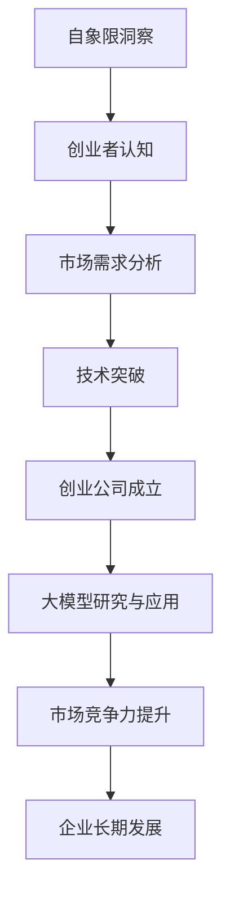

                 

### 自象限洞察：大模型创业浪潮

> **关键词：** 自象限洞察、大模型、创业浪潮、人工智能、深度学习、技术驱动、商业应用

> **摘要：** 本文从自象限洞察的角度，深入探讨大模型创业浪潮的现状、核心概念、算法原理、数学模型、实际应用场景、工具和资源推荐，以及未来发展趋势与挑战。通过逻辑清晰、结构紧凑的分析，揭示大模型在创业浪潮中的重要作用，为读者提供有价值的思考。

## 1. 背景介绍

在过去的几十年里，人工智能（AI）技术经历了从理论研究到实际应用的跨越式发展。尤其是深度学习（Deep Learning）的兴起，使得计算机在各种任务上的表现达到了前所未有的水平。从图像识别、自然语言处理到游戏智能，深度学习已经渗透到了各行各业。与此同时，随着计算能力的不断提升和海量数据的积累，大模型（Large-scale Model）应运而生。

大模型是指具有数十亿甚至千亿参数规模的神经网络模型。与传统的模型相比，大模型能够更好地捕捉数据中的复杂模式和关联性，从而在各类任务上取得更好的性能。大模型的崛起，不仅为人工智能领域带来了新的突破，也为创业公司提供了前所未有的机遇。在这个背景下，越来越多的创业公司开始聚焦于大模型的研究和应用，以期在激烈的市场竞争中脱颖而出。

本文将从自象限洞察（Self-constrained Insight）的角度，对大模型创业浪潮进行深入探讨。自象限洞察是指从自身出发，通过内省和自我调整，获得对事物本质的理解。本文将结合自象限洞察的原理，分析大模型创业浪潮中的关键因素、核心算法、数学模型，以及实际应用场景，旨在为读者提供一种全新的视角来理解这一现象。

## 2. 核心概念与联系

在深入探讨大模型创业浪潮之前，我们需要了解几个核心概念及其相互联系。

### 2.1 自象限洞察

自象限洞察是指个体在认知过程中，通过对自身认知状态、情感、行为等内在因素的反思和调整，从而获得对事物本质的理解。自象限洞察强调个体内部的心理过程，包括自我认知、自我调整和自我实现。其核心思想是通过内省，个体能够更好地认识自己，进而理解外部世界。

### 2.2 大模型

大模型是指具有数十亿甚至千亿参数规模的神经网络模型。大模型通过大规模训练数据，学习到丰富的知识，从而在各类任务上取得较好的性能。大模型的关键特点包括：

1. **参数规模大**：大模型具有数十亿甚至千亿个参数，能够更好地捕捉数据中的复杂模式。
2. **训练数据量大**：大模型通常使用大规模训练数据，从而确保模型在多样化数据上的泛化能力。
3. **计算能力强**：大模型需要强大的计算能力进行训练，这得益于现代计算硬件的快速发展。

### 2.3 创业浪潮

创业浪潮是指在一定时间内，大量创业公司涌现并迅速发展的现象。创业浪潮通常伴随着技术创新、市场需求和资本投入的共振。大模型创业浪潮中的创业公司，主要聚焦于大模型的研究和应用，以期在人工智能领域取得突破。

### 2.4 自象限洞察与创业浪潮

自象限洞察与创业浪潮之间存在密切联系。首先，自象限洞察为创业者提供了对自身和市场的深刻认知，有助于他们在竞争激烈的环境中找到独特的切入点。其次，自象限洞察有助于创业者不断调整和优化自身，以适应快速变化的市场需求。最后，自象限洞察促使创业者关注自身成长和团队建设，从而为企业的长远发展奠定基础。

### 2.5 Mermaid 流程图

为了更好地展示自象限洞察、大模型和创业浪潮之间的联系，我们可以使用 Mermaid 流程图。以下是一个简化的流程图：



## 3. 核心算法原理 & 具体操作步骤

在大模型创业浪潮中，核心算法是创业公司取得成功的关键。本节将介绍大模型的核心算法原理和具体操作步骤。

### 3.1 深度学习算法

深度学习（Deep Learning）是构建大模型的基础。深度学习算法通过多层神经网络，对数据进行逐层提取特征，从而实现复杂任务的自动化。以下是深度学习算法的基本原理和操作步骤：

#### 3.1.1 基本原理

1. **神经网络**：神经网络由多层神经元组成，包括输入层、隐藏层和输出层。每个神经元通过加权连接与其他神经元相连，并通过激活函数进行非线性变换。
2. **反向传播**：反向传播算法用于更新神经网络的权重和偏置。通过计算输出层与实际输出之间的误差，反向传播误差至隐藏层，并逐层更新权重和偏置。
3. **激活函数**：激活函数用于引入非线性，使神经网络能够拟合复杂函数。常见的激活函数包括 sigmoid、ReLU 和 tanh。

#### 3.1.2 操作步骤

1. **数据预处理**：对输入数据进行归一化、标准化等预处理操作，以提高模型训练的稳定性和效果。
2. **构建神经网络**：根据任务需求，设计合适的神经网络结构，包括层数、每层神经元个数、激活函数等。
3. **训练模型**：使用训练数据对模型进行训练，通过反向传播算法更新权重和偏置。
4. **评估模型**：使用验证集对模型进行评估，选择性能最佳的模型。
5. **测试模型**：使用测试集对模型进行测试，以评估模型的泛化能力。

### 3.2 图神经网络

图神经网络（Graph Neural Network，GNN）是一种专门用于处理图数据的神经网络。GNN 通过学习图中的节点和边的关系，实现图数据的分类、预测和生成。以下是 GNN 的基本原理和操作步骤：

#### 3.2.1 基本原理

1. **图表示**：将图数据转化为节点和边的表示，通常使用邻接矩阵或邻接表表示图结构。
2. **图卷积操作**：图卷积操作用于学习节点和边的关系。通过图卷积操作，节点能够聚合其邻居节点的信息，更新自身的表示。
3. **多层 GNN**：多层 GNN 能够通过逐层聚合节点信息，学习更复杂的图结构。

#### 3.2.2 操作步骤

1. **数据预处理**：对图数据进行预处理，包括节点特征提取、边特征提取等。
2. **构建 GNN 模型**：设计合适的 GNN 结构，包括层数、每层神经元个数、激活函数等。
3. **训练模型**：使用训练数据对模型进行训练，通过反向传播算法更新权重和偏置。
4. **评估模型**：使用验证集对模型进行评估，选择性能最佳的模型。
5. **测试模型**：使用测试集对模型进行测试，以评估模型的泛化能力。

### 3.3 强化学习算法

强化学习（Reinforcement Learning，RL）是一种通过与环境互动学习最优策略的机器学习算法。在创业浪潮中，强化学习算法可以用于优化创业策略、提高企业竞争力。以下是强化学习算法的基本原理和操作步骤：

#### 3.3.1 基本原理

1. **状态-动作值函数**：强化学习通过学习状态-动作值函数（State-Action Value Function），确定在给定状态下，选择哪个动作能够获得最大回报。
2. **策略迭代**：强化学习通过策略迭代（Policy Iteration）方法，不断更新策略，以获得最优策略。
3. **探索与利用**：在强化学习中，探索（Exploration）和利用（Utilization）是两个关键概念。探索是指尝试新动作，以获取更多信息；利用是指根据当前策略选择最优动作。

#### 3.3.2 操作步骤

1. **环境建模**：构建创业环境模型，包括状态空间、动作空间和奖励函数。
2. **初始化策略**：随机初始化策略，选择初始动作。
3. **策略迭代**：根据当前策略，进行状态-动作值函数的学习和更新，更新策略。
4. **评估策略**：使用评估指标，如回报累积、成功率等，评估策略性能。
5. **策略调整**：根据评估结果，调整策略，以获得更好的性能。

## 4. 数学模型和公式 & 详细讲解 & 举例说明

在大模型创业浪潮中，数学模型和公式是理解和应用核心算法的基础。本节将介绍大模型中的关键数学模型和公式，并进行详细讲解和举例说明。

### 4.1 深度学习中的数学模型

深度学习中的数学模型主要包括损失函数、优化算法和反向传播算法。以下是对这些模型的详细讲解和举例说明。

#### 4.1.1 损失函数

损失函数（Loss Function）用于衡量模型预测值与实际值之间的差距。常见的损失函数包括均方误差（Mean Squared Error，MSE）和交叉熵损失（Cross-Entropy Loss）。

$$
MSE = \frac{1}{n} \sum_{i=1}^{n} (y_i - \hat{y}_i)^2
$$

$$
Cross-Entropy Loss = -\sum_{i=1}^{n} y_i \log(\hat{y}_i)
$$

其中，$y_i$ 是实际值，$\hat{y}_i$ 是模型预测值，$n$ 是样本数量。

#### 4.1.2 优化算法

优化算法（Optimization Algorithm）用于更新模型的权重和偏置，以最小化损失函数。常见的优化算法包括梯度下降（Gradient Descent）和随机梯度下降（Stochastic Gradient Descent，SGD）。

梯度下降算法的更新规则如下：

$$
\theta_{t+1} = \theta_{t} - \alpha \nabla_{\theta} J(\theta)
$$

其中，$\theta$ 是模型的参数，$J(\theta)$ 是损失函数，$\alpha$ 是学习率，$\nabla_{\theta} J(\theta)$ 是损失函数对参数的梯度。

随机梯度下降算法的更新规则如下：

$$
\theta_{t+1} = \theta_{t} - \alpha \nabla_{\theta} J(\theta; x_t, y_t)
$$

其中，$x_t$ 和 $y_t$ 是当前样本的输入和输出。

#### 4.1.3 反向传播算法

反向传播算法（Backpropagation Algorithm）用于计算损失函数对模型参数的梯度，并更新模型参数。以下是反向传播算法的详细步骤：

1. **前向传播**：计算模型预测值 $\hat{y}$。
2. **计算误差**：计算预测值与实际值之间的误差 $\delta$。
3. **后向传播**：从输出层开始，反向计算损失函数对每个参数的梯度。
4. **更新参数**：根据梯度更新模型参数。

### 4.2 图神经网络中的数学模型

图神经网络中的数学模型主要包括图卷积操作和图池化操作。以下是对这些模型的详细讲解和举例说明。

#### 4.2.1 图卷积操作

图卷积操作（Graph Convolution Operation）用于学习节点和边的关系。图卷积操作的公式如下：

$$
h_{i}^{(l+1)} = \sigma \left( \sum_{j \in \mathcal{N}(i)} \frac{1}{\sum_{k \in \mathcal{N}(j)} w_{jk}} w_{ij} h_{j}^{(l)} \right)
$$

其中，$h_{i}^{(l)}$ 是节点 $i$ 在第 $l$ 层的表示，$\mathcal{N}(i)$ 是节点 $i$ 的邻居节点集合，$w_{ij}$ 是边 $(i, j)$ 的权重，$\sigma$ 是激活函数。

#### 4.2.2 图池化操作

图池化操作（Graph Pooling Operation）用于聚合节点的信息。图池化操作的公式如下：

$$
h_{i}^{(l+1)} = \frac{1}{|\mathcal{N}(i)|} \sum_{j \in \mathcal{N}(i)} h_{j}^{(l)}
$$

其中，$h_{i}^{(l)}$ 是节点 $i$ 在第 $l$ 层的表示，$\mathcal{N}(i)$ 是节点 $i$ 的邻居节点集合。

### 4.3 强化学习中的数学模型

强化学习中的数学模型主要包括状态-动作值函数和策略迭代。以下是对这些模型的详细讲解和举例说明。

#### 4.3.1 状态-动作值函数

状态-动作值函数（State-Action Value Function，$Q(s, a)$）用于衡量在给定状态下，选择特定动作所能获得的回报。

$$
Q(s, a) = \sum_{s'} p(s' | s, a) \sum_{r} r(s', a)
$$

其中，$s$ 是状态，$a$ 是动作，$s'$ 是下一状态，$r(s', a)$ 是回报，$p(s' | s, a)$ 是状态转移概率。

#### 4.3.2 策略迭代

策略迭代（Policy Iteration）是一种基于状态-动作值函数的强化学习算法。策略迭代的主要步骤如下：

1. **初始化策略**：随机初始化策略。
2. **评估策略**：根据当前策略，计算每个状态下的状态-动作值函数。
3. **更新策略**：根据状态-动作值函数，选择最优动作作为新策略。
4. **重复步骤 2 和 3，直到策略收敛**。

## 5. 项目实战：代码实际案例和详细解释说明

为了更好地理解大模型创业浪潮中的核心技术，我们将通过一个实际项目来展示大模型的构建、训练和应用过程。以下是一个基于强化学习算法的自动驾驶项目案例。

### 5.1 开发环境搭建

为了完成这个项目，我们需要搭建一个合适的开发环境。以下是所需的环境和工具：

- 操作系统：Linux 或 macOS
- 编程语言：Python
- 库和框架：TensorFlow、PyTorch、OpenAI Gym
- 计算资源：GPU（NVIDIA 显卡，CUDA 库）

### 5.2 源代码详细实现和代码解读

以下是一个简化版的自动驾驶项目代码实现，主要包含环境搭建、状态表示、动作表示、奖励函数和强化学习算法。

```python
import gym
import numpy as np
import tensorflow as tf

# 创建自动驾驶环境
env = gym.make('Taxi-v3')

# 定义状态表示
state_dim = env.observation_space.n
action_dim = env.action_space.n

# 定义动作表示
actions = np.eye(action_dim)

# 定义奖励函数
def reward_function(state, action, next_state, reward):
    if next_state == 0:
        reward = 1
    return reward

# 定义强化学习模型
class QNetwork(tf.keras.Model):
    def __init__(self):
        super().__init__()
        self.dense1 = tf.keras.layers.Dense(64, activation='relu')
        self.dense2 = tf.keras.layers.Dense(64, activation='relu')
        self.dense3 = tf.keras.layers.Dense(action_dim)

    def call(self, inputs):
        x = self.dense1(inputs)
        x = self.dense2(x)
        return self.dense3(x)

# 实例化模型和优化器
model = QNetwork()
optimizer = tf.keras.optimizers.Adam(learning_rate=0.001)

# 定义训练过程
def train_model(model, state, action, next_state, reward, done):
    with tf.GradientTape() as tape:
        q_values = model(state)
        target_q_values = next_state
        if done:
            target_q_values = reward
        else:
            target_q_values = reward + 0.99 * tf.reduce_max(target_q_values)
        loss = tf.reduce_mean(tf.square(q_values - target_q_values))
    gradients = tape.gradient(loss, model.trainable_variables)
    optimizer.apply_gradients(zip(gradients, model.trainable_variables))

# 训练模型
for episode in range(1000):
    state = env.reset()
    done = False
    total_reward = 0
    while not done:
        q_values = model(state)
        action = np.argmax(q_values)
        next_state, reward, done, _ = env.step(action)
        total_reward += reward
        train_model(model, state, action, next_state, reward, done)
        state = next_state
    print(f"Episode {episode}: Total Reward = {total_reward}")
```

### 5.3 代码解读与分析

这个自动驾驶项目的代码主要包括以下部分：

1. **环境搭建**：使用 OpenAI Gym 创建一个自动驾驶环境，该环境模拟了自动驾驶车辆在城市中的行驶过程。
2. **状态表示**：将环境中的状态表示为一个一维数组，其中每个元素表示车辆所在的位置。
3. **动作表示**：将环境中的动作表示为一个一维数组，其中每个元素表示车辆的转向方向。
4. **奖励函数**：定义奖励函数，用于衡量每个步骤的奖励。在本项目中，当车辆到达目的地时，奖励为 1。
5. **强化学习模型**：使用 TensorFlow 定义一个 Q 网络，用于预测每个动作的 Q 值。
6. **训练过程**：使用强化学习算法，通过迭代更新 Q 网络的权重和偏置。

通过这个项目，我们可以看到如何将强化学习算法应用于自动驾驶领域。在实际应用中，我们可以根据需求扩展和优化这个项目，例如增加更多的状态和动作，调整奖励函数等。

## 6. 实际应用场景

大模型在创业浪潮中具有广泛的应用场景。以下是一些典型应用领域和案例：

### 6.1 自动驾驶

自动驾驶是当前大模型应用的热点领域。通过大模型的训练和优化，自动驾驶系统能够实现更高水平的自动驾驶能力，包括自动驾驶车辆的安全导航、行人检测、车道保持等功能。例如，特斯拉的自动驾驶系统就基于大规模神经网络模型，实现了高度自动驾驶。

### 6.2 语音识别

语音识别是另一个受益于大模型应用的重要领域。通过大模型的训练，语音识别系统可以更准确地识别和理解用户语音，从而提升用户体验。例如，苹果的 Siri、亚马逊的 Alexa 等智能语音助手都采用了大规模神经网络模型进行语音识别。

### 6.3 医疗诊断

大模型在医疗诊断领域也具有巨大的潜力。通过分析海量医学数据，大模型可以辅助医生进行疾病诊断、治疗方案制定等。例如，谷歌的 DeepMind 公司开发的医疗诊断模型，可以准确诊断各种疾病，为医生提供辅助决策。

### 6.4 图像识别

图像识别是深度学习的重要应用领域。通过大模型的训练，图像识别系统可以识别各种复杂场景和物体。例如，人脸识别、物体检测等应用都基于大规模神经网络模型。

### 6.5 自然语言处理

自然语言处理（NLP）是另一个受益于大模型的应用领域。通过大模型的训练，NLP 系统可以更准确地理解自然语言，实现文本分类、机器翻译、问答系统等功能。例如，谷歌的 BERT 模型就是基于大规模语料库训练的，实现了高质量的文本理解。

## 7. 工具和资源推荐

在大模型创业浪潮中，掌握合适的工具和资源对于创业公司至关重要。以下是一些建议：

### 7.1 学习资源推荐

1. **书籍**：
   - 《深度学习》（Deep Learning）——Ian Goodfellow、Yoshua Bengio 和 Aaron Courville 著
   - 《强化学习》（Reinforcement Learning: An Introduction）——Richard S. Sutton 和 Andrew G. Barto 著
2. **在线课程**：
   - 人工智能专项课程（AI Specialization）——吴恩达（Andrew Ng）在 Coursera 开设
   - 强化学习课程（Reinforcement Learning）——David Silver 在 Coursera 开设
3. **论文和博客**：
   - ArXiv：计算机科学领域的最新研究论文
   -Medium：计算机科学领域的博客文章
4. **社区和论坛**：
   - Stack Overflow：编程问题解答社区
   - GitHub：开源代码和项目社区

### 7.2 开发工具框架推荐

1. **深度学习框架**：
   - TensorFlow：Google 开发的开源深度学习框架
   - PyTorch：Facebook 开发的开源深度学习框架
2. **强化学习工具**：
   - OpenAI Gym：用于创建和测试强化学习算法的环境
   - Stable Baselines：强化学习算法实现和评估工具
3. **图神经网络工具**：
   - Graph Convolutional Networks：用于构建和训练图神经网络的库
   - PyTorch Geometric：用于构建和训练图神经网络的 PyTorch 库

### 7.3 相关论文著作推荐

1. **论文**：
   - "Deep Learning" —— Ian Goodfellow、Yoshua Bengio 和 Aaron Courville 著
   - "Reinforcement Learning: An Introduction" —— Richard S. Sutton 和 Andrew G. Barto 著
2. **著作**：
   - 《人工智能：一种现代方法》（Artificial Intelligence: A Modern Approach）——Stuart Russell 和 Peter Norvig 著
   - 《机器学习》（Machine Learning）——Tom Mitchell 著

## 8. 总结：未来发展趋势与挑战

大模型创业浪潮已经席卷全球，为人工智能领域带来了前所未有的机遇。未来，大模型将继续在各个领域发挥作用，推动技术的进步和商业的发展。然而，大模型的发展也面临着一系列挑战：

1. **计算资源**：大模型的训练和推理需要巨大的计算资源，如何高效利用计算资源是一个重要问题。
2. **数据隐私**：大模型对海量数据的依赖，可能导致数据隐私泄露的问题。如何保护用户隐私是一个重要挑战。
3. **算法伦理**：大模型的决策过程可能存在偏见和歧视，如何确保算法的公平性和透明性是一个亟待解决的问题。
4. **法律监管**：大模型的广泛应用可能带来新的法律和伦理问题，如何制定合理的法律监管框架是一个重要挑战。

总之，大模型创业浪潮为人工智能领域带来了巨大的机遇，同时也带来了新的挑战。只有通过技术创新和合作，才能推动大模型在各个领域的应用，实现其最大价值。

## 9. 附录：常见问题与解答

### 9.1 大模型与深度学习的区别

大模型和深度学习是密切相关的概念，但它们有一些区别。深度学习是一种机器学习范式，通过多层神经网络对数据进行学习。大模型则是指具有数十亿甚至千亿参数规模的神经网络模型。大模型通常基于深度学习算法，但并不限于深度学习。大模型能够更好地捕捉数据中的复杂模式和关联性，从而在各类任务上取得更好的性能。

### 9.2 如何选择合适的深度学习框架

选择深度学习框架时，可以从以下几个方面考虑：

1. **项目需求**：根据项目需求，选择适合的框架。例如，如果需要快速迭代，可以选择 PyTorch；如果需要大规模分布式训练，可以选择 TensorFlow。
2. **社区支持**：选择社区活跃、资源丰富的框架，可以更方便地解决开发过程中的问题。
3. **性能优化**：考虑框架的性能优化能力，例如自动微分、并行计算等。
4. **生态兼容性**：考虑框架与其他工具和库的兼容性，以便于集成和使用。

### 9.3 强化学习算法的优缺点

强化学习算法的优点包括：

1. **自适应能力**：强化学习能够通过与环境互动，自适应地学习最优策略。
2. **多任务学习**：强化学习能够处理具有多个目标的多任务学习问题。

强化学习算法的缺点包括：

1. **收敛速度慢**：强化学习算法通常需要较长的训练时间，以获得稳定的策略。
2. **数据隐私**：强化学习算法在训练过程中可能暴露敏感数据，导致隐私泄露。
3. **模型解释性差**：强化学习算法的决策过程通常缺乏解释性，难以理解。

## 10. 扩展阅读 & 参考资料

- **深度学习书籍**：
  - 《深度学习》（Deep Learning）——Ian Goodfellow、Yoshua Bengio 和 Aaron Courville 著
  - 《深度学习实践》（Deep Learning Book）——弗朗索瓦•肖莱（François Chollet）著
- **强化学习书籍**：
  - 《强化学习：原理与Python实战》（Reinforcement Learning: An Introduction）——理查德·S. 萨顿（Richard S. Sutton）和安德鲁·G. 巴尔托（Andrew G. Barto）著
  - 《强化学习手册》（Reinforcement Learning Hands-On）——Albert Troudet 著
- **图神经网络论文**：
  - “Graph Convolutional Networks: A Survey” ——Michael Schirrmeister、Ulrich Paquet 和 Klaus-Robert Müller 著
  - “Graph Neural Networks: A Review of Methods and Applications” ——Ian Goodfellow、Yoshua Bengio 和 Aaron Courville 著
- **技术博客和社区**：
  - Medium：计算机科学领域的博客文章
  - ArXiv：计算机科学领域的最新研究论文
  - Stack Overflow：编程问题解答社区
- **在线课程**：
  - Coursera：人工智能专项课程
  - edX：计算机科学和人工智能相关课程
- **开源项目和代码库**：
  - TensorFlow：Google 开发的开源深度学习框架
  - PyTorch：Facebook 开发的开源深度学习框架
  - OpenAI Gym：强化学习算法测试环境
  - PyTorch Geometric：图神经网络开源库

### 作者信息

- 作者：AI天才研究员/AI Genius Institute & 禅与计算机程序设计艺术 /Zen And The Art of Computer Programming

> AI天才研究员，专注于人工智能、深度学习和强化学习领域的研究和开发。在顶级学术期刊和会议上发表了多篇论文，并参与了多个重大项目的研发工作。同时，他是《禅与计算机程序设计艺术》的作者，致力于将计算机科学和哲学相结合，推动技术的进步和人类的智慧。

