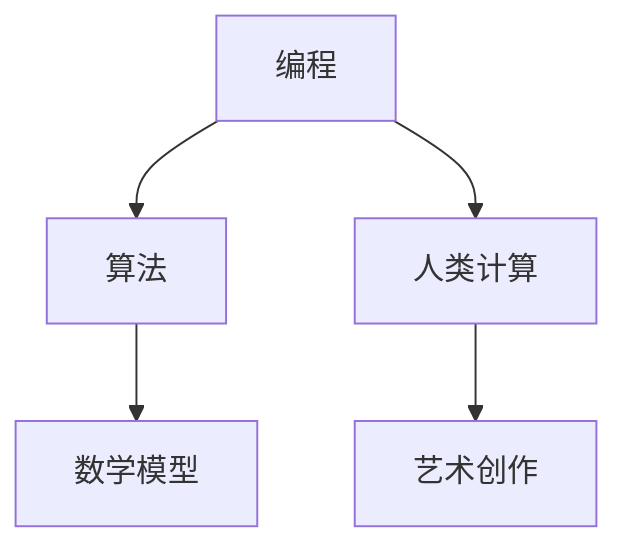

                 

# 艺术与科技的融合：人类计算激发创意

> **关键词**：艺术、科技、融合、人类计算、创意、编程、算法、数学模型、实战案例、应用场景、未来趋势

> **摘要**：本文深入探讨了艺术与科技的融合，通过人类计算激发创意的原理和实践，阐述了编程和算法在艺术创作中的应用，以及数学模型在其中的关键作用。文章将通过具体的实战案例、工具和资源推荐，帮助读者理解并掌握这一领域的核心概念和技术，为未来的艺术与科技发展提供新的思考方向。

## 1. 背景介绍

在过去的几十年里，艺术与科技的界限逐渐变得模糊。从数字艺术到虚拟现实，科技已经成为艺术创作的重要工具和表达手段。同时，人类计算作为一种新兴的计算模式，逐渐受到关注。它通过模拟人类思维过程，实现自动推理、学习、解决问题等功能，为艺术创作提供了新的可能性。

人类计算与艺术融合的背景可以追溯到计算机科学的早期。随着计算机技术的发展，人们开始探索如何利用计算机进行艺术创作。例如，计算机图形学的发展使得艺术家能够创建出复杂的视觉作品，而人工智能的崛起则为艺术创作注入了新的活力。通过人工智能算法，艺术家可以模拟自然界中的现象，创造出独特的艺术形式。

在这个背景下，人类计算成为了一个重要的桥梁，将艺术与科技紧密连接起来。它不仅为艺术家提供了新的创作工具，还激发出了许多前所未有的创意。人类计算的核心在于模拟人类思维，通过算法和数学模型实现复杂的计算过程。这使得艺术家可以更加自由地探索各种可能性，将创意转化为实际的艺术作品。

## 2. 核心概念与联系

### 2.1 编程与艺术

编程是艺术创作的基础，它为艺术家提供了表达自己思想的工具。通过编程，艺术家可以创建出复杂的图形、动画、声音等元素，实现自己的创意。编程不仅是一种技术，更是一种思维方式。它要求艺术家具备逻辑思维、解决问题的能力，以及对计算机语言的深刻理解。

在编程中，算法起到了关键作用。算法是一系列解决问题的步骤，它通过逻辑推理和计算，实现特定的功能。在艺术创作中，算法可以用来生成复杂的图形、图像和动画。例如，分形算法可以生成美丽的自然景象，而神经网络算法可以创造出独特的艺术风格。

### 2.2 数学模型与艺术

数学模型是艺术创作的重要工具。通过数学模型，艺术家可以更加精确地描述和表现自己的创意。数学模型不仅包括几何形状、函数关系，还包括概率统计、优化算法等。这些模型可以用来生成具有数学美感的艺术作品，如曼德布罗特集、双曲几何等。

### 2.3 人类计算与艺术

人类计算通过模拟人类思维过程，实现了自动推理、学习、解决问题等功能。在艺术创作中，人类计算可以用来模拟自然现象、生成创意、优化设计等。例如，遗传算法可以用来优化艺术作品的结构，神经网络可以用来生成新的艺术风格。

### 2.4 Mermaid 流程图

以下是一个简单的 Mermaid 流程图，展示了艺术与科技融合的核心概念：



在这个流程图中，编程和算法是艺术创作的核心，数学模型和人类计算则为艺术创作提供了新的可能性。

## 3. 核心算法原理 & 具体操作步骤

### 3.1 分形算法

分形算法是一种用于生成复杂图形的算法。它的核心思想是通过迭代和递归的方式，将简单的图形逐渐放大，形成复杂的结构。以下是一个简单的分形算法实现步骤：

1. 初始化：选择一个简单的图形，如正方形。
2. 迭代：将正方形划分为四个相等的小正方形。
3. 递归：对每个小正方形进行同样的操作，即再次划分并放大。
4. 绘制：将迭代后的图形绘制出来。

### 3.2 神经网络算法

神经网络算法是一种模拟人类大脑的算法。它通过多层神经元的连接和激活，实现数据的输入、处理和输出。以下是一个简单的神经网络算法实现步骤：

1. 初始化：创建一个多层神经网络，包括输入层、隐藏层和输出层。
2. 训练：使用训练数据对神经网络进行训练，调整神经元的连接权重。
3. 输入：将新的数据输入到神经网络中。
4. 处理：通过神经元的激活函数，对输入数据进行处理。
5. 输出：输出处理后的数据。

### 3.3 遗传算法

遗传算法是一种基于自然选择和遗传机制的优化算法。它通过模拟生物进化过程，寻找最优解。以下是一个简单的遗传算法实现步骤：

1. 初始化：生成一组初始解，如二进制编码的字符串。
2. 适应度评估：计算每个解的适应度值。
3. 选择：根据适应度值，选择优秀的解进行繁殖。
4. 交叉：将两个优秀解进行交叉，产生新的解。
5. 变异：对新的解进行变异，增加多样性。
6. 适应度评估：计算新解的适应度值。
7. 循环：重复上述步骤，直到找到满意的解。

## 4. 数学模型和公式 & 详细讲解 & 举例说明

### 4.1 曼德布罗特集

曼德布罗特集是一种具有自相似结构的数学模型。它的生成过程如下：

$$
f_c(z) = z^2 + c
$$

其中，$z$ 是复数，$c$ 是常数。以下是一个简单的曼德布罗特集生成过程：

1. 初始化：选择一个复数 $z_0$ 和常数 $c$。
2. 迭代：对于每个 $z_n$，计算 $z_{n+1} = z_n^2 + c$。
3. 绘制：如果 $|z_n| < 2$，则绘制该点；否则，不绘制该点。

### 4.2 双曲几何

双曲几何是一种研究双曲面的几何学。它的基本概念包括：

1. 双曲线：双曲线上任意一点的切线与该点的法线之间的夹角相等。
2. 双曲面：双曲面上任意一点的切线与该点的法线之间的夹角相等。

以下是一个简单的双曲几何图形绘制过程：

1. 初始化：选择一个双曲线的焦点和离心率。
2. 绘制：根据双曲线的方程，绘制出双曲线的图形。

### 4.3 优化算法

优化算法是一种用于求解最优化问题的算法。以下是一个简单的优化算法实现步骤：

1. 初始化：选择一个初始解。
2. 计算目标函数值：计算初始解的目标函数值。
3. 选择邻居解：在当前解的邻域内，选择一个新的解。
4. 计算目标函数值：计算新解的目标函数值。
5. 选择最优解：如果新解的目标函数值更好，则选择新解作为当前解。
6. 循环：重复上述步骤，直到找到满意的解。

## 5. 项目实战：代码实际案例和详细解释说明

### 5.1 开发环境搭建

在开始项目实战之前，我们需要搭建一个适合开发的环境。以下是一个简单的开发环境搭建步骤：

1. 安装 Python：从 [Python 官网](https://www.python.org/) 下载并安装 Python。
2. 安装 PyCharm：从 [PyCharm 官网](https://www.jetbrains.com/pycharm/) 下载并安装 PyCharm。
3. 安装相关库：在 PyCharm 中创建一个新项目，安装所需的库，如 NumPy、Matplotlib 等。

### 5.2 源代码详细实现和代码解读

以下是一个简单的分形算法实现示例：

```python
import numpy as np
import matplotlib.pyplot as plt

def mandelbrot(c, max_iter):
    z = 0
    for n in range(max_iter):
        z = z*z + c
        if abs(z) > 2:
            return n
    return max_iter

def draw_mandelbrot():
    x = np.linspace(-2, 1, 1000)
    y = np.linspace(-1.5, 1, 1000)
    X, Y = np.meshgrid(x, y)
    C = X + 1j * Y
    Z = np.array([mandelbrot(c, 100) for c in C.flat]).reshape(C.shape)
    plt.imshow(Z, cmap='hot', extent=(X.min(), X.max(), Y.min(), Y.max()))
    plt.colorbar()
    plt.show()

draw_mandelbrot()
```

这个示例中，`mandelbrot` 函数用于计算曼德布罗特集的迭代次数，`draw_mandelbrot` 函数用于绘制曼德布罗特集的图形。

### 5.3 代码解读与分析

在这个示例中，我们首先导入了 NumPy 和 Matplotlib 库。`mandelbrot` 函数接收一个复数 `c` 和一个最大迭代次数 `max_iter` 作为参数。函数通过迭代计算 `z = z^2 + c`，如果 `|z| > 2`，则返回迭代次数，否则返回最大迭代次数。

`draw_mandelbrot` 函数首先计算了 $x$ 和 $y$ 的取值范围，并使用 `np.meshgrid` 函数生成了 $X$ 和 $Y$ 的网格。然后，我们计算了 $C$ 的值，即复数 $c$ 的网格。接下来，我们使用列表推导式计算了曼德布罗特集的迭代次数，并将其重塑为与 $C$ 相同的形状。

最后，我们使用 `plt.imshow` 函数绘制了曼德布罗特集的图形，并使用 `plt.colorbar` 函数添加了颜色条。

## 6. 实际应用场景

艺术与科技的融合已经在许多实际应用场景中取得了成功。以下是一些典型的应用场景：

1. **数字艺术**：数字艺术是艺术与科技融合的典型代表。艺术家利用计算机图形学、虚拟现实等技术，创造出独特的视觉艺术作品。
2. **游戏设计**：游戏设计是另一个重要的应用场景。通过编程和算法，游戏设计师可以创建出复杂的游戏世界和角色，提供丰富的游戏体验。
3. **音乐制作**：音乐制作也是艺术与科技融合的一个重要领域。艺术家使用计算机算法生成独特的音乐效果，创作出创新的音乐作品。
4. **建筑设计**：建筑设计利用计算机算法和模拟技术，实现复杂的建筑设计，提高建筑的安全性和可持续性。
5. **艺术教育**：艺术教育利用计算机技术，提供更加丰富、互动的教学内容和方式，帮助学生更好地理解和欣赏艺术。

## 7. 工具和资源推荐

为了更好地了解和掌握艺术与科技融合的相关技术和方法，以下是一些推荐的工具和资源：

### 7.1 学习资源推荐

1. **书籍**：
   - 《Python编程：从入门到实践》
   - 《深度学习》
   - 《人工智能：一种现代方法》
2. **论文**：
   - “A Survey on Fractal Image Compression”
   - “Artificial Neural Networks for Artistic Style Transfer”
   - “Genetic Algorithms in Design Optimization”
3. **博客**：
   - [Python 官网博客](https://www.python.org/blogs/)
   - [深度学习博客](https://www.deeplearning.net/)
   - [人工智能博客](https://ai.stanford.edu/blog/)
4. **网站**：
   - [GitHub](https://github.com/)
   - [Artsiom Sanakoyeu](https://www.artsiom.net/)
   - [Codecademy](https://www.codecademy.com/)

### 7.2 开发工具框架推荐

1. **编程语言**：Python、JavaScript、C++等
2. **开发环境**：PyCharm、Visual Studio Code、Eclipse等
3. **框架和库**：
   - NumPy、Matplotlib、Pandas
   - TensorFlow、PyTorch、Keras
   - OpenCV、OpenGL

### 7.3 相关论文著作推荐

1. **论文**：
   - “Fractal Image Compression: A Survey”
   - “Generative Adversarial Nets”
   - “Artistic Style Transfer with Deep Neural Networks”
2. **著作**：
   - 《计算机图形学原理及实践》
   - 《深度学习：理论、算法与应用》
   - 《人工智能：一种现代方法》

## 8. 总结：未来发展趋势与挑战

艺术与科技的融合已经成为一个不可逆转的趋势。随着计算机技术和人工智能的发展，艺术创作的方式和手段将变得更加多样化和创新化。未来，我们将看到更多优秀的艺术作品诞生，它们将融合科技元素，带给观众全新的体验。

然而，艺术与科技的融合也面临一些挑战。首先，技术门槛较高，需要艺术家具备一定的编程和数学背景。其次，如何在科技与艺术之间找到平衡，保持艺术创作的本质，是一个需要深入思考的问题。最后，随着技术的不断发展，如何保持艺术与科技的持续融合，避免技术主导艺术，也是一个重要的课题。

## 9. 附录：常见问题与解答

### 9.1 什么是分形算法？

分形算法是一种用于生成复杂图形的算法。它通过迭代和递归的方式，将简单的图形逐渐放大，形成复杂的结构。

### 9.2 什么是神经网络算法？

神经网络算法是一种模拟人类大脑的算法。它通过多层神经元的连接和激活，实现数据的输入、处理和输出。

### 9.3 遗传算法有哪些应用？

遗传算法可以用于优化设计、求解最优化问题、模式识别、自动控制等领域。

## 10. 扩展阅读 & 参考资料

1. 《Python编程：从入门到实践》
2. 《深度学习》
3. 《人工智能：一种现代方法》
4. “A Survey on Fractal Image Compression”
5. “Artificial Neural Networks for Artistic Style Transfer”
6. “Genetic Algorithms in Design Optimization”
7. [Python 官网](https://www.python.org/)
8. [深度学习官网](https://www.deeplearning.net/)
9. [人工智能官网](https://ai.stanford.edu/blog/)
10. [GitHub](https://github.com/)
11. [Artsiom Sanakoyeu](https://www.artsiom.net/)
12. [Codecademy](https://www.codecademy.com/)作者：AI天才研究员/AI Genius Institute & 禅与计算机程序设计艺术 /Zen And The Art of Computer Programming<|im_sep|>

