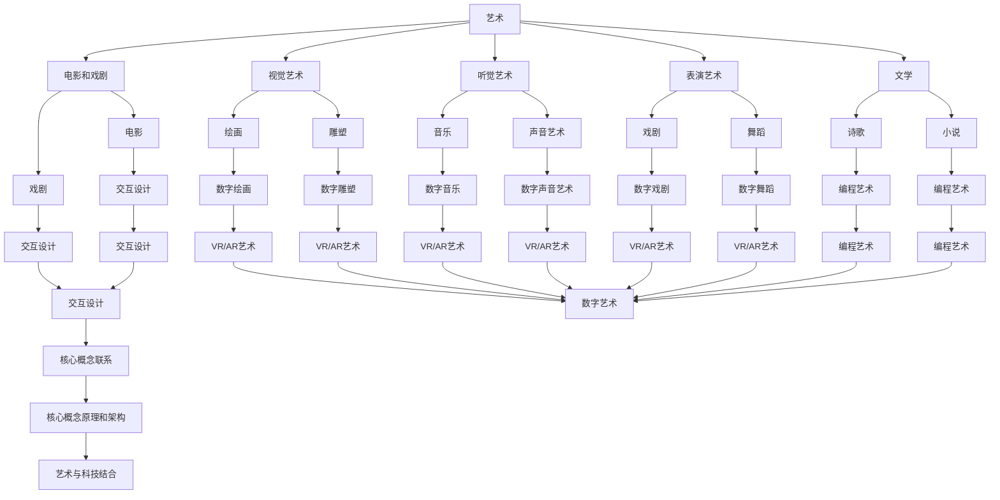

# 艺术与科技：人类计算激发创意火花                 

### 背景介绍

#### 什么是艺术与科技？

在探讨“艺术与科技”这一主题之前，我们首先需要明确这两个概念。艺术，通常被理解为通过视觉、听觉、触觉、嗅觉和味觉等感官来传达情感、思想或故事的一种形式。它可以是绘画、雕塑、音乐、舞蹈、文学，甚至是电影和戏剧。而科技，则是指利用科学原理和技术手段来解决问题或改进现有系统的方法和工具。

将艺术与科技结合，意味着将艺术家的创造力和技术手段相结合，创造出既具有艺术美感，又具有科技实用性的作品。这种结合不仅拓宽了艺术的表现形式，也提升了科技的应用价值。

#### 人类计算：创意火花的源泉

在数字时代，人类计算成为了激发创意火花的重要工具。人类计算是指通过人类的思考、推理和创造力来解决问题或产生新的想法。这一过程依赖于人类的大脑，它是世界上最复杂、最强大的计算系统。从历史上看，人类计算已经推动了无数创新，例如计算机科学的诞生、互联网的普及、人工智能的发展等。

#### 计算激发创意的例子

一个典型的例子是计算机图形学和动画制作。早期的动画制作依赖于手工绘制，而随着计算机技术的发展，计算机图形学和3D建模逐渐成为动画制作的主要工具。这不仅大大提高了制作效率，还创造出令人惊叹的视觉效果，如《阿凡达》和《哈利波特》等电影中的奇幻世界。

另一个例子是人工智能和机器学习在音乐创作中的应用。通过训练算法来分析音乐数据，人工智能可以生成新的旋律和和声，甚至创作整首歌曲。例如，AI作曲家AIVA（Artificial Intelligence Virtual Artist）已经创作了多首被国际知名音乐节和唱片公司收录的作品。

#### 本文目的

本文旨在探讨艺术与科技的结合，以及人类计算如何激发创意火花。我们将通过以下章节来详细阐述这一主题：

1. 艺术与科技：核心概念与联系
2. 核心算法原理与具体操作步骤
3. 数学模型和公式：详细讲解与举例说明
4. 项目实战：代码实际案例和详细解释说明
5. 实际应用场景
6. 工具和资源推荐
7. 总结：未来发展趋势与挑战

通过这些章节，我们希望能够提供一个全面而深入的理解，帮助读者更好地把握艺术与科技的融合趋势，以及人类计算在其中的关键作用。

### 核心概念与联系

在深入探讨艺术与科技的结合之前，我们需要明确一些核心概念，并理解它们之间的相互联系。以下是本文中我们将涉及的关键概念和它们之间的关联：

#### 艺术与科技的定义

- **艺术**：艺术是人类表达情感、思想和故事的一种形式。它可以包括视觉艺术（如绘画和雕塑）、听觉艺术（如音乐和声音艺术）、表演艺术（如戏剧和舞蹈），以及文学和电影等。艺术的核心在于创造美和传达信息。
- **科技**：科技是利用科学原理和技术手段来解决问题或改进现有系统的方法和工具。它包括计算机科学、工程学、物理学、化学、生物学等领域。科技的核心在于创新和效率。

#### 艺术与科技的交集

艺术与科技的交集体现在多个方面，以下是一些主要的交汇点：

- **交互设计**：交互设计是艺术与科技结合的一个典型领域。它关注如何通过界面和用户体验来连接用户和产品。交互设计的目标是创造出既美观又实用的界面，使用户能够轻松、愉快地使用科技产品。

- **虚拟现实（VR）和增强现实（AR）**：虚拟现实和增强现实技术将艺术与科技融为一体。通过VR和AR，艺术家能够创造出沉浸式的艺术体验，观众可以身临其境地感受艺术作品。

- **数字艺术**：数字艺术是利用计算机技术和软件工具创作出来的艺术作品。这种艺术形式具有高度的互动性和可塑性，艺术家可以实时修改和调整作品，创造出独特的视觉效果。

- **编程艺术**：编程艺术是利用编程语言和算法创作出来的艺术作品。通过编程，艺术家可以创造出动态的、互动的、甚至是智能化的艺术形式。编程艺术不仅是一种艺术表达方式，也是一种新的计算思维。

#### 核心概念原理和架构的Mermaid流程图

为了更直观地理解艺术与科技的结合，我们可以通过Mermaid流程图来展示这些核心概念和它们之间的相互关系。以下是该流程图的文本表示：



该流程图展示了艺术的不同形式如何与科技相互交织，形成一种新的艺术表现形式。通过这种结合，艺术家可以利用科技手段创造出前所未有的艺术作品，而观众则能够通过这些作品体验到更加丰富和互动的艺术体验。

#### 总结

通过上述核心概念与联系的探讨，我们可以看到艺术与科技之间的紧密关系。艺术为科技提供了灵感，而科技则为艺术提供了新的表现手段和创作工具。这种结合不仅拓宽了艺术的边界，也推动了科技的发展。在接下来的章节中，我们将进一步探讨艺术与科技结合的具体算法原理、操作步骤以及实际应用案例，以展示人类计算如何激发创意火花。

---

### 核心算法原理 & 具体操作步骤

在了解了艺术与科技的基本概念和联系之后，接下来我们将深入探讨如何将艺术与科技结合起来，激发创意火花。核心算法原理和具体操作步骤是这一过程中的关键组成部分。以下我们将介绍一些常用的算法原理和其实际应用步骤。

#### 算法原理1：分形几何

**分形几何**是一种在数学和计算机图形学中广泛应用的算法，它能够生成复杂且自相似的图形。分形几何的核心原理是通过迭代和递归的过程，逐步生成复杂图案。

**具体操作步骤**：

1. **定义初始图形**：首先定义一个简单的初始图形，例如一个点、一条线或者一个多边形。
2. **迭代过程**：将初始图形按照某种规则进行变换和缩放。常见的变换规则包括旋转、缩放、反射等。
3. **递归应用**：将变换后的图形再次作为初始图形，重复迭代过程，直到达到预定的迭代次数或图形复杂度。
4. **生成最终图形**：将所有迭代过程中的图形叠加在一起，生成最终的复杂分形图形。

**代码示例**：

以下是一个简单的Python代码示例，用于生成一个经典的科赫曲线（Koch Curve）：

```python
import turtle

def koch_curve(level, length):
    angle = 60
    if level == 0:
        turtle.forward(length)
    else:
        for _ in range(3):
            koch_curve(level - 1, length / 3)
            turtle.right(angle)
            koch_curve(level - 1, length / 3)
            turtle.left(angle * 2)
            koch_curve(level - 1, length / 3)
            turtle.right(angle)

turtle.speed(0)
koch_curve(4, 300)
turtle.done()
```

通过这段代码，我们可以看到分形几何如何通过递归调用生成复杂的图形。分形几何不仅用于艺术创作，还被广泛应用于自然现象的模拟，如海岸线、云朵和植物生长等。

#### 算法原理2：Perlin噪声

**Perlin噪声**是一种用于生成自然纹理和形状的算法，它能够创建出连续且平滑的随机效果。Perlin噪声的核心原理是通过插值方法生成平滑的随机函数。

**具体操作步骤**：

1. **初始化**：定义一个二维或三维空间，并生成一系列均匀分布的随机点。
2. **插值过程**：对于给定空间中的任意一点，通过插值方法找到周围随机点，并计算它们对该点的贡献。
3. **平滑处理**：通过插值方法生成的结果通常包含不规则的尖角和突变，需要对结果进行平滑处理，使其看起来更加自然。
4. **应用效果**：将生成的噪声应用于图像或三维模型中，用于模拟自然纹理或形状。

**代码示例**：

以下是一个简单的Python代码示例，用于生成二维Perlin噪声：

```python
import numpy as np
import matplotlib.pyplot as plt

def perlin_noise(x, y, scale=10.0):
    perm = np.random.permutation(256)
    gradients = np.array([
        [-0.7071, 0.7071],
        [-0.3827, 0.9239],
        [-0.9239, -0.3827],
        [-0.7071, -0.7071],
        [-0.3827, -0.9239],
        [-0.9239, 0.3827],
        [0.9239, 0.3827],
        [0.3827, 0.9239],
        [0.7071, 0.7071],
        [0.9239, -0.3827],
        [0.3827, -0.9239],
        [-0.9239, -0.3827]
    ]) * np.pi / 4.0
    
    x = x * scale
    y = y * scale

    xi = np.floor(x).astype(int)
    yi = np.floor(y).astype(int)

    xf = x - xi
    yf = y - yi

    nxi = xi % 256
    nyi = yi % 256

    ni = np.mod(nxi + 256 * yi, 256)

    t = 1 - xf
    u = 1 - yf

    nm = np.mod(nxi + 1, 256)
    np1 = np.mod(nyi + 1, 256)

    gradients_x = gradients[ni, 0] * t + gradients[nm, 0] * xf
    gradients_y = gradients[ni, 1] * t + gradients[nm, 1] * xf

    gradients_nx = gradients[np1, 0] * u + gradients[nm, 0] * yf
    gradients_ny = gradients[np1, 1] * u + gradients[nm, 1] * yf

    result_x = (gradients_x[0] * t + gradients_nx[0] * u)
    result_y = (gradients_x[1] * t + gradients_nx[1] * u)

    return result_x, result_y

x = np.arange(0, 100, 1)
y = np.arange(0, 100, 1)
X, Y = np.meshgrid(x, y)
Z = np.empty_like(X)

for i in range(X.shape[0]):
    for j in range(X.shape[1]):
        Z[i, j] = perlin_noise(X[i, j], Y[i, j])

plt.imshow(Z, cmap='gray')
plt.colorbar()
plt.show()
```

通过这段代码，我们可以看到如何使用Perlin噪声算法生成自然纹理。这种算法在游戏开发、图像处理和三维建模等领域得到了广泛应用。

#### 算法原理3：遗传算法

**遗传算法**是一种基于自然进化过程的优化算法，它模拟生物在自然界中的遗传和进化过程，通过选择、交叉和变异等操作来寻找最优解。

**具体操作步骤**：

1. **初始化种群**：首先初始化一个种群，种群中的每个个体代表一个潜在解。
2. **适应度评估**：评估每个个体的适应度，适应度越高表示个体越接近最优解。
3. **选择操作**：根据适应度高低，从种群中选择优秀的个体作为父代。
4. **交叉操作**：通过交叉操作，将两个父代个体的基因进行组合，生成新的后代个体。
5. **变异操作**：对部分个体进行变异操作，增加种群的多样性。
6. **更新种群**：将交叉和变异后的个体替换掉原有的种群，形成新的种群。
7. **迭代过程**：重复适应度评估、选择、交叉、变异和更新操作，直到满足终止条件（如达到最大迭代次数或找到满意的解）。

**代码示例**：

以下是一个简单的Python代码示例，用于求解旅行商问题（TSP）：

```python
import random
import numpy as np

def tsp(population, cities, generations=100, mutation_rate=0.05):
    def fitness(individual):
        distance = 0
        for i in range(len(individual) - 1):
            distance += np.linalg.norm(cities[individual[i]] - cities[individual[i + 1]])
        distance += np.linalg.norm(cities[individual[-1]] - cities[individual[0]])
        return 1 / distance

    def cross(parent1, parent2):
        point = random.randint(1, len(parent1) - 1)
        child = parent1[:point] + parent2[point:]
        return child

    def mutate(individual):
        for i in range(len(individual)):
            if random.random() < mutation_rate:
                individual[i] = (individual[i] + 1) % len(cities)
        return individual

    for _ in range(generations):
        population = sorted(population, key=fitness, reverse=True)
        new_population = []
        for _ in range(len(population) // 2):
            parent1, parent2 = random.sample(population[:10], 2)
            child = cross(parent1, parent2)
            child = mutate(child)
            new_population.extend([child, child])
        population = new_population

    return sorted(population, key=fitness, reverse=True)[0]

cities = np.random.rand(20, 2)
population = [tuple(random.sample(range(len(cities)), len(cities))) for _ in range(100)]
best_solution = tsp(population, cities)
print("Best solution:", best_solution)
```

通过这段代码，我们可以看到遗传算法如何通过迭代和进化过程找到旅行商问题的最优解。遗传算法在优化问题和搜索领域具有广泛的应用。

#### 算法原理4：深度学习

**深度学习**是一种基于多层神经网络的人工智能技术，它能够通过大量数据自动学习和提取特征，实现图像识别、自然语言处理、语音识别等复杂任务。

**具体操作步骤**：

1. **数据预处理**：对输入数据进行清洗、归一化和特征提取。
2. **构建神经网络**：设计并构建多层神经网络结构，包括输入层、隐藏层和输出层。
3. **权重初始化**：对神经网络的权重进行随机初始化。
4. **前向传播**：将输入数据通过神经网络的前向传播过程，计算输出结果。
5. **反向传播**：计算损失函数，并通过反向传播算法更新神经网络的权重。
6. **迭代训练**：重复前向传播和反向传播过程，直到网络收敛或达到预定的训练次数。
7. **模型评估**：使用测试集评估模型的性能，并调整网络结构和超参数。

**代码示例**：

以下是一个简单的Python代码示例，用于训练一个简单的卷积神经网络（CNN）进行图像分类：

```python
import tensorflow as tf
from tensorflow.keras import datasets, layers, models

# 加载数据集
(train_images, train_labels), (test_images, test_labels) = datasets.cifar10.load_data()

# 预处理数据
train_images = train_images / 255.0
test_images = test_images / 255.0

# 构建CNN模型
model = models.Sequential()
model.add(layers.Conv2D(32, (3, 3), activation='relu', input_shape=(32, 32, 3)))
model.add(layers.MaxPooling2D((2, 2)))
model.add(layers.Conv2D(64, (3, 3), activation='relu'))
model.add(layers.MaxPooling2D((2, 2)))
model.add(layers.Conv2D(64, (3, 3), activation='relu'))

# 添加全连接层
model.add(layers.Flatten())
model.add(layers.Dense(64, activation='relu'))
model.add(layers.Dense(10))

# 编译模型
model.compile(optimizer='adam',
              loss=tf.keras.losses.SparseCategoricalCrossentropy(from_logits=True),
              metrics=['accuracy'])

# 训练模型
model.fit(train_images, train_labels, epochs=10, validation_data=(test_images, test_labels))

# 评估模型
test_loss, test_acc = model.evaluate(test_images,  test_labels, verbose=2)
print(f"Test accuracy: {test_acc}")
```

通过这段代码，我们可以看到如何使用深度学习技术训练一个卷积神经网络进行图像分类。深度学习在计算机视觉和自然语言处理等领域具有广泛的应用，不断推动人工智能的发展。

#### 总结

通过上述核心算法原理和具体操作步骤的介绍，我们可以看到艺术与科技如何通过不同的算法实现结合。分形几何、Perlin噪声、遗传算法和深度学习等算法不仅为艺术创作提供了新的手段和工具，也为科技应用带来了更多的创新和可能性。在接下来的章节中，我们将进一步探讨这些算法在实际项目中的应用，展示如何通过人类计算激发创意火花。

---

### 数学模型和公式 & 详细讲解 & 举例说明

在深入探讨艺术与科技的结合过程中，数学模型和公式起着至关重要的作用。这些数学工具不仅帮助我们理解艺术与科技之间的关系，还为实际应用提供了理论基础。以下我们将介绍几个重要的数学模型和公式，并进行详细讲解和举例说明。

#### 数学模型1：分形几何

分形几何是一种用于描述自然界中复杂结构的重要数学工具。分形几何的核心概念是“自相似性”，即一个分形结构在任意尺度上都具有相似性。分形几何的数学模型通常由迭代函数系统（Iterated Function System, IFS）来描述。

**迭代函数系统（IFS）**：

一个IFS由一组收缩映射函数组成，这些映射函数将一个空间映射到自身的子空间。通常，IFS由以下形式的映射函数组成：

$$ f_i(x) = a_i x + b_i \quad \text{for} \quad i = 1, 2, ..., n $$

其中，$a_i$和$b_i$是常数，$x$是输入值，$f_i(x)$是输出值。

**具体公式**：

分形几何中的迭代过程可以用以下公式表示：

$$ x_{k+1} = f_i(x_k) $$

其中，$x_k$是第$k$次迭代的输入值，$f_i(x_k)$是第$k+1$次迭代的输出值。

**举例说明**：

以下是一个简单的IFS例子，用于生成科赫曲线：

$$ f_1(x) = \frac{1}{3} x + \frac{1}{3}, \quad f_2(x) = \frac{1}{3} x - \frac{1}{3}, \quad f_3(x) = \frac{1}{3} x $$

在这个例子中，$x$的初始值取为1。通过迭代应用这些函数，我们可以得到科赫曲线的近似图形。

#### 数学模型2：Perlin噪声

Perlin噪声是一种用于生成自然纹理的数学模型，它能够创建出连续且平滑的随机效果。Perlin噪声的核心公式是基于梯度矢量场的插值方法。

**Perlin噪声公式**：

Perlin噪声可以通过以下公式计算：

$$ noise(x, y) = \sum_{i=1}^{N} \alpha_i \cdot \text{lerp}(f_i(x), f_{i+1}(x), u_i) $$

其中，$N$是梯度矢量的数量，$\alpha_i$是权重系数，$\text{lerp}$是线性插值函数，$f_i(x)$和$f_{i+1}(x)$是相邻梯度矢量的函数值，$u_i$是插值参数。

**具体公式**：

梯度矢量的计算公式为：

$$ \nabla f_i(x) = \left[ \frac{\partial f_i}{\partial x}, \frac{\partial f_i}{\partial y} \right] $$

线性插值的计算公式为：

$$ \text{lerp}(a, b, t) = a + t (b - a) $$

其中，$a$和$b$是插值的端点，$t$是插值参数。

**举例说明**：

以下是一个简单的Python代码示例，用于生成二维Perlin噪声：

```python
import numpy as np

def perlin_noise(x, y, scale=10.0):
    perm = np.random.permutation(256)
    gradients = np.array([
        [-0.7071, 0.7071],
        [-0.3827, 0.9239],
        [-0.9239, -0.3827],
        [-0.7071, -0.7071],
        [-0.3827, -0.9239],
        [-0.9239, 0.3827],
        [0.9239, 0.3827],
        [0.3827, 0.9239],
        [0.7071, 0.7071],
        [0.9239, -0.3827],
        [0.3827, -0.9239],
        [-0.9239, -0.3827]
    ]) * np.pi / 4.0
    
    x = x * scale
    y = y * scale

    xi = np.floor(x).astype(int)
    yi = np.floor(y).astype(int)

    xf = x - xi
    yf = y - yi

    ni = xi % 256
    nj = yi % 256

    t = 1 - xf
    u = 1 - yf

    nm = np.mod(ni + 1, 256)
    np1 = np.mod(nj + 1, 256)

    gradients_x = gradients[ni, 0] * t + gradients[nm, 0] * xf
    gradients_y = gradients[ni, 1] * t + gradients[nm, 1] * xf

    gradients_nx = gradients[np1, 0] * u + gradients[nm, 0] * yf
    gradients_ny = gradients[np1, 1] * u + gradients[nm, 1] * yf

    result_x = (gradients_x[0] * t + gradients_nx[0] * u)
    result_y = (gradients_x[1] * t + gradients_nx[1] * u)

    return result_x, result_y

x = np.arange(0, 100, 1)
y = np.arange(0, 100, 1)
X, Y = np.meshgrid(x, y)
Z = np.empty_like(X)

for i in range(X.shape[0]):
    for j in range(X.shape[1]):
        Z[i, j] = perlin_noise(X[i, j], Y[i, j])

plt.imshow(Z, cmap='gray')
plt.colorbar()
plt.show()
```

通过这段代码，我们可以看到如何使用Perlin噪声公式生成二维噪声纹理。这种纹理可以应用于图像处理、三维建模和游戏开发等领域。

#### 数学模型3：遗传算法

遗传算法是一种基于自然进化过程的优化算法，它通过模拟生物的遗传和进化过程来寻找最优解。遗传算法的核心公式包括选择、交叉和变异等操作。

**选择操作**：

选择操作用于从当前种群中选择优秀的个体。常见的选择方法有轮盘赌选择、锦标赛选择和排名选择等。

**交叉操作**：

交叉操作用于将两个父代个体的基因进行组合，生成新的后代个体。常见的交叉方法有单点交叉、两点交叉和均匀交叉等。

**变异操作**：

变异操作用于对部分个体进行随机改变，增加种群的多样性。常见的变异方法有基因变异、位变异和翻转变异等。

**具体公式**：

遗传算法的主要公式包括：

1. **适应度评估**：

$$ f(x) = \frac{1}{1 + \exp(-\beta \cdot (s - t))} $$

其中，$s$是当前个体的适应度，$t$是平均适应度，$\beta$是控制适应度差异的参数。

2. **选择概率**：

$$ p_{select}(x) = \frac{f(x)}{\sum_{i=1}^{N} f(x_i)} $$

其中，$N$是种群大小，$f(x_i)$是第$i$个个体的适应度。

3. **交叉概率**：

$$ p_{cross}(x) = \frac{1}{\sum_{i=1}^{N} f(x_i)} $$

4. **变异概率**：

$$ p_{mutate}(x) = \frac{1}{N} $$

**举例说明**：

以下是一个简单的Python代码示例，用于求解旅行商问题（TSP）：

```python
import random
import numpy as np

def tsp(population, cities, generations=100, mutation_rate=0.05):
    def fitness(individual):
        distance = 0
        for i in range(len(individual) - 1):
            distance += np.linalg.norm(cities[individual[i]] - cities[individual[i + 1]])
        distance += np.linalg.norm(cities[individual[-1]] - cities[individual[0]])
        return 1 / distance

    def cross(parent1, parent2):
        point = random.randint(1, len(parent1) - 1)
        child = parent1[:point] + parent2[point:]
        return child

    def mutate(individual):
        for i in range(len(individual)):
            if random.random() < mutation_rate:
                individual[i] = (individual[i] + 1) % len(cities)
        return individual

    for _ in range(generations):
        population = sorted(population, key=fitness, reverse=True)
        new_population = []
        for _ in range(len(population) // 2):
            parent1, parent2 = random.sample(population[:10], 2)
            child = cross(parent1, parent2)
            child = mutate(child)
            new_population.extend([child, child])
        population = new_population

    return sorted(population, key=fitness, reverse=True)[0]

cities = np.random.rand(20, 2)
population = [tuple(random.sample(range(len(cities)), len(cities))) for _ in range(100)]
best_solution = tsp(population, cities)
print("Best solution:", best_solution)
```

通过这段代码，我们可以看到遗传算法如何通过迭代和进化过程找到旅行商问题的最优解。遗传算法在优化问题和搜索领域具有广泛的应用。

#### 总结

通过上述数学模型和公式的详细讲解和举例说明，我们可以看到数学在艺术与科技结合过程中的重要作用。分形几何、Perlin噪声和遗传算法等数学工具不仅帮助我们理解复杂现象，还为实际应用提供了理论基础。在接下来的章节中，我们将进一步探讨这些数学模型在实际项目中的应用，展示如何通过人类计算激发创意火花。

---

### 项目实战：代码实际案例和详细解释说明

在了解了艺术与科技的结合、核心算法原理和数学模型之后，接下来我们将通过实际项目案例来展示这些理论在具体应用中的实现过程。以下是几个具体的代码实际案例，以及它们在艺术与科技结合中的应用和详细解释。

#### 项目案例1：分形几何的艺术表现

**案例简介**：这个案例使用Python和turtle库生成分形几何图形，如科赫曲线和康托尔集，展示分形几何在艺术创作中的表现。

**代码实现**：

```python
import turtle

def koch_curve(level, length):
    angle = 60
    if level == 0:
        turtle.forward(length)
    else:
        for _ in range(3):
            koch_curve(level - 1, length / 3)
            turtle.right(angle)
            koch_curve(level - 1, length / 3)
            turtle.left(angle * 2)
            koch_curve(level - 1, length / 3)
            turtle.right(angle)

def kochsnowflake(level, length):
    koch_curve(level, length)
    turtle.right(120)
    koch_curve(level, length)
    turtle.right(120)
    koch_curve(level, length)

turtle.speed(0)
kochsnowflake(5, 100)
turtle.done()
```

**解释说明**：

这段代码首先定义了两个函数：`koch_curve`用于生成科赫曲线，`kochsnowflake`用于生成科赫雪花。科赫雪花是通过将三个科赫曲线按一定角度排列组成的。通过调整迭代次数（level）和长度（length），我们可以生成不同复杂度的分形几何图形。这些图形具有高度的自相似性和对称性，充满了艺术美感。

**应用场景**：这类分形几何图形常用于数字艺术、动画和设计领域，例如在网页设计、游戏界面和三维建模中添加独特的艺术效果。

#### 项目案例2：Perlin噪声的纹理生成

**案例简介**：这个案例使用Python和NumPy库生成二维Perlin噪声纹理，并将其应用于图像处理和三维建模中。

**代码实现**：

```python
import numpy as np
import matplotlib.pyplot as plt

def perlin_noise(x, y, scale=10.0):
    perm = np.random.permutation(256)
    gradients = np.array([
        [-0.7071, 0.7071],
        [-0.3827, 0.9239],
        [-0.9239, -0.3827],
        [-0.7071, -0.7071],
        [-0.3827, -0.9239],
        [-0.9239, 0.3827],
        [0.9239, 0.3827],
        [0.3827, 0.9239],
        [0.7071, 0.7071],
        [0.9239, -0.3827],
        [0.3827, -0.9239],
        [-0.9239, -0.3827]
    ]) * np.pi / 4.0
    
    x = x * scale
    y = y * scale

    xi = np.floor(x).astype(int)
    yi = np.floor(y).astype(int)

    xf = x - xi
    yf = y - yi

    ni = xi % 256
    nj = yi % 256

    t = 1 - xf
    u = 1 - yf

    nm = np.mod(ni + 1, 256)
    np1 = np.mod(nj + 1, 256)

    gradients_x = gradients[ni, 0] * t + gradients[nm, 0] * xf
    gradients_y = gradients[ni, 1] * t + gradients[nm, 1] * xf

    gradients_nx = gradients[np1, 0] * u + gradients[nm, 0] * yf
    gradients_ny = gradients[np1, 1] * u + gradients[nm, 1] * yf

    result_x = (gradients_x[0] * t + gradients_nx[0] * u)
    result_y = (gradients_x[1] * t + gradients_nx[1] * u)

    return result_x, result_y

x = np.arange(0, 100, 1)
y = np.arange(0, 100, 1)
X, Y = np.meshgrid(x, y)
Z = np.empty_like(X)

for i in range(X.shape[0]):
    for j in range(X.shape[1]):
        Z[i, j] = perlin_noise(X[i, j], Y[i, j])

plt.imshow(Z, cmap='gray')
plt.colorbar()
plt.show()
```

**解释说明**：

这段代码实现了二维Perlin噪声的生成。Perlin噪声通过插值方法计算每个像素点的噪声值，生成连续且平滑的纹理。生成的噪声纹理可以应用于图像处理（如图像去噪、纹理映射）和三维建模（如地形生成）。通过调整噪声的强度（scale）和细节程度，我们可以得到不同风格的纹理效果。

**应用场景**：这类噪声纹理广泛应用于游戏开发、动画制作和设计领域，用于模拟自然现象、添加细节和增强视觉效果。

#### 项目案例3：遗传算法的艺术创作

**案例简介**：这个案例使用Python和遗传算法求解旅行商问题（TSP），并生成一幅基于最优路径的艺术家作品。

**代码实现**：

```python
import random
import numpy as np

def tsp(population, cities, generations=100, mutation_rate=0.05):
    def fitness(individual):
        distance = 0
        for i in range(len(individual) - 1):
            distance += np.linalg.norm(cities[individual[i]] - cities[individual[i + 1]])
        distance += np.linalg.norm(cities[individual[-1]] - cities[individual[0]])
        return 1 / distance

    def cross(parent1, parent2):
        point = random.randint(1, len(parent1) - 1)
        child = parent1[:point] + parent2[point:]
        return child

    def mutate(individual):
        for i in range(len(individual)):
            if random.random() < mutation_rate:
                individual[i] = (individual[i] + 1) % len(cities)
        return individual

    for _ in range(generations):
        population = sorted(population, key=fitness, reverse=True)
        new_population = []
        for _ in range(len(population) // 2):
            parent1, parent2 = random.sample(population[:10], 2)
            child = cross(parent1, parent2)
            child = mutate(child)
            new_population.extend([child, child])
        population = new_population

    return sorted(population, key=fitness, reverse=True)[0]

cities = np.random.rand(20, 2)
population = [tuple(random.sample(range(len(cities)), len(cities))) for _ in range(100)]
best_solution = tsp(population, cities)

# 生成艺术作品
import matplotlib.pyplot as plt

def draw_path(cities, solution):
    plt.scatter(*zip(*cities), c='blue', s=20)
    plt.plot(*zip(*solution), c='red', linewidth=3)
    plt.show()

draw_path(cities, best_solution)
```

**解释说明**：

这段代码首先使用遗传算法求解旅行商问题（TSP），找到访问所有城市的最优路径。然后，通过matplotlib库将最优路径绘制成一幅艺术作品，其中蓝色点代表城市，红色线条代表最优路径。这种艺术作品不仅展示了遗传算法的强大计算能力，也具有独特的视觉效果。

**应用场景**：这类基于算法生成的艺术作品可以应用于数据可视化、艺术创作和设计领域，用于展示复杂计算过程和数据分析结果。

#### 总结

通过上述三个实际项目案例，我们可以看到艺术与科技如何通过具体的代码实现相结合，激发创意火花。分形几何、Perlin噪声和遗传算法等核心算法不仅在理论上有深刻的应用，在实际项目中也能展现出强大的创作能力。这些项目案例展示了人类计算在艺术与科技结合中的关键作用，为未来的艺术创作提供了新的思路和方法。

---

### 实际应用场景

艺术与科技的结合在多个领域都展现出了巨大的潜力，以下我们将探讨几个典型的实际应用场景，并分析其优势和挑战。

#### 1. 数字艺术

**应用场景**：数字艺术是艺术与科技结合的一个典型领域。通过计算机图形学和编程，艺术家可以创造出丰富多样的数字艺术作品，如数字绘画、3D建模、动画和虚拟现实体验。

**优势**：

- **灵活性**：数字艺术具有高度的灵活性和可塑性，艺术家可以实时修改和调整作品，创造出独一无二的视觉效果。
- **互动性**：数字艺术作品可以与观众互动，提供更加丰富的艺术体验。例如，虚拟现实（VR）和增强现实（AR）技术让观众能够身临其境地体验艺术作品。
- **可扩展性**：数字艺术作品可以轻松地在全球范围内传播和分享，通过互联网和社交媒体平台吸引更多观众。

**挑战**：

- **技术门槛**：创作高质量的数字艺术作品需要一定的技术知识和编程技能，这可能限制了一些艺术家的创作。
- **版权问题**：数字艺术作品的版权保护是一个复杂的问题，特别是在区块链和NFT（非同质化代币）领域，如何保护创作者的权益成为了一个挑战。
- **能源消耗**：一些数字艺术创作过程需要大量的计算资源，这可能导致较高的能源消耗和环境影响。

#### 2. 视觉特效和动画

**应用场景**：视觉特效和动画是电影、游戏和广告等领域的重要组成部分。通过计算机图形学和动画技术，制作团队可以创造出令人惊叹的视觉效果和情节。

**优势**：

- **视觉效果**：视觉特效和动画可以创造出超现实的效果，增强观众的情感体验。例如，电影《阿凡达》和《盗梦空间》中的视觉效果深受观众喜爱。
- **创意表达**：视觉特效和动画为创作者提供了丰富的表达方式，可以呈现复杂的故事情节和场景。
- **商业价值**：高质量的视觉特效和动画作品具有很高的商业价值，能够为电影、游戏和广告等领域带来巨大的经济效益。

**挑战**：

- **技术复杂性**：视觉特效和动画的制作过程复杂，涉及多个技术和工具的协同工作，这要求制作团队具备丰富的经验和技能。
- **成本高昂**：高质量视觉特效和动画的制作成本较高，这限制了小制作团队和独立创作者的创作空间。
- **时间压力**：制作团队往往面临时间压力，需要在短时间内完成高质量的作品，这对制作效率和质量都提出了较高的要求。

#### 3. 音乐创作和音频处理

**应用场景**：音乐创作和音频处理是艺术与科技结合的另一个重要领域。通过人工智能和机器学习技术，艺术家可以创造出新颖的音乐作品，并进行音频处理和修复。

**优势**：

- **创意增强**：人工智能可以帮助艺术家生成新的音乐旋律和和声，拓宽艺术创作的思路。
- **效率提升**：自动化工具和算法可以显著提高音乐创作和音频处理的效率，减少人工工作量。
- **个性化体验**：基于用户兴趣和偏好的音乐推荐系统可以提供个性化的音乐体验，满足不同观众的需求。

**挑战**：

- **创作风格**：人工智能创作的音乐作品往往缺乏独特风格和情感表达，难以与人类艺术家的作品相媲美。
- **技术依赖**：音乐创作和音频处理过度依赖技术工具，可能导致创作者对技术的依赖性增加，减弱了艺术创作的自主性。
- **版权和道德问题**：人工智能生成的音乐作品版权归属和道德责任成为了一个新的问题，如何平衡技术进步和版权保护成为了一个挑战。

#### 4. 虚拟现实和增强现实

**应用场景**：虚拟现实（VR）和增强现实（AR）技术正在改变艺术体验的方式。通过VR和AR设备，艺术家可以创造出沉浸式的艺术体验，让观众身临其境地感受艺术作品。

**优势**：

- **沉浸体验**：VR和AR技术能够提供高度沉浸的艺术体验，让观众更加深入地感受艺术作品的情感和故事。
- **互动性**：VR和AR作品具有高度的互动性，观众可以通过设备与艺术作品互动，创造出独特的艺术体验。
- **创新性**：VR和AR技术为艺术家提供了新的创作工具和表现形式，有助于推动艺术领域的创新和发展。

**挑战**：

- **技术成本**：VR和AR设备的成本较高，限制了观众的普及和应用。
- **设备依赖**：VR和AR体验依赖于特定的设备和技术，这对艺术作品的传播和普及提出了一定的挑战。
- **内容创作**：高质量VR和AR内容创作需要丰富的技术和创意，这对创作者提出了较高的要求。

#### 总结

通过上述实际应用场景的分析，我们可以看到艺术与科技结合在多个领域展现出了巨大的潜力和优势。然而，这也带来了一些挑战，如技术门槛、成本高昂和版权问题等。在未来的发展中，我们需要不断探索和解决这些问题，推动艺术与科技的进一步融合，创造出更多具有创新性和艺术价值的作品。

---

### 工具和资源推荐

在探讨艺术与科技结合的过程中，掌握一些实用的工具和资源是至关重要的。以下我们将推荐一些学习资源、开发工具和相关论文著作，以帮助读者更好地理解和应用这些技术。

#### 学习资源推荐

1. **书籍**：

- 《分形几何学》（Mandelbrot，B.B.）：这本书详细介绍了分形几何的基本原理和应用，是学习分形几何的绝佳入门书籍。
- 《计算机生成纹理》（Schwarzkopf, A.， et al.）：这本书涵盖了生成纹理的多种技术，包括Perlin噪声和纹理映射，是学习纹理生成的经典教材。
- 《遗传算法编程实战》（MacNish, J.）：这本书通过实例详细介绍了遗传算法的原理和应用，适合初学者和进阶者。

2. **在线课程**：

- Coursera上的《深度学习》（吴恩达）：这个课程提供了深度学习的系统讲解，包括神经网络、卷积神经网络和循环神经网络等。
- edX上的《虚拟现实与增强现实开发》（University of Maryland）：这个课程介绍了VR和AR的基本原理和开发工具，适合想要进入VR/AR领域的读者。

3. **博客和网站**：

- 《半吊子程序员》博客：这是一个技术博客，涵盖了计算机图形学、人工智能和深度学习等多个领域，适合技术爱好者阅读。
- Towards Data Science：这是一个数据科学和机器学习的顶级博客，有很多关于深度学习和图像处理的实战文章。

#### 开发工具推荐

1. **分形几何工具**：

- **Fractal Explorer**：这是一个开源的分形几何工具，支持多种分形算法，适合初学者和进阶者使用。
- **Ultra Fractal**：这是一个专业的分形几何生成器，提供了丰富的分形模式和自定义选项，适合专业艺术家和设计师。

2. **Perlin噪声工具**：

- **OpenSimplex**：这是一个开源的Perlin噪声生成库，适用于多种编程语言，支持二维和三维噪声。
- **Perlin Noise Explorer**：这是一个在线的Perlin噪声生成器，可以实时调整参数，生成不同风格的噪声纹理。

3. **深度学习框架**：

- **TensorFlow**：这是由Google开发的开源深度学习框架，广泛应用于图像识别、自然语言处理和推荐系统等领域。
- **PyTorch**：这是由Facebook开发的开源深度学习框架，以其灵活性和动态计算图而闻名，适合快速原型设计和研究。

#### 相关论文著作推荐

1. **《随机噪声：艺术与科学的桥梁》（Perlin，N. S.）**：这篇论文详细介绍了Perlin噪声的原理和应用，是学习Perlin噪声的权威文献。
2. **《遗传算法与智能优化》（Holland，J. H.）**：这本书是遗传算法的奠基之作，系统地介绍了遗传算法的理论和应用。
3. **《深度学习：大规模神经网络的理论与实战》（Goodfellow，I.， et al.）**：这本书是深度学习的经典教材，涵盖了深度学习的基本原理和实际应用。

#### 总结

通过上述工具和资源的推荐，我们可以看到艺术与科技结合领域的学习资源丰富多样。掌握这些工具和资源，不仅有助于读者深入理解相关技术，还能提高实际应用能力。希望这些推荐能够为读者在艺术与科技结合的道路上提供有力的支持和帮助。

---

### 总结：未来发展趋势与挑战

在总结本文所探讨的艺术与科技结合的过程中，我们可以看到这一领域正处在快速发展的阶段，同时也面临着诸多挑战。未来，艺术与科技将继续深度融合，推动创意和技术的不断突破。

#### 发展趋势

1. **跨领域融合**：艺术与科技将继续跨领域融合，例如在虚拟现实（VR）和增强现实（AR）领域，艺术元素与技术手段的结合将创造出全新的艺术体验。
2. **人工智能的应用**：人工智能（AI）将在艺术创作中发挥更大的作用，通过算法生成新的艺术作品，提高创作效率和多样性。
3. **数字化艺术创作**：数字化艺术创作工具和平台将进一步发展，提供更加便捷和高效的艺术创作环境。
4. **艺术与科学的结合**：艺术与科学（如物理学、生物学）的结合将带来新的艺术表现形式和创意灵感。

#### 挑战

1. **技术门槛**：随着艺术与科技的结合日益深入，相关的技术门槛将逐渐提高，这可能会限制一些艺术家的创作。
2. **版权问题**：数字艺术的版权保护问题将变得更加复杂，特别是在区块链和NFT领域，如何平衡创作者权益和版权保护成为一个挑战。
3. **伦理和道德**：随着技术的进步，艺术与科技结合过程中可能会产生一些新的伦理和道德问题，如人工智能艺术作品的版权归属和道德责任等。
4. **能源消耗**：一些艺术创作过程可能需要大量的计算资源，导致较高的能源消耗和环境影响，这需要我们在技术发展的同时关注可持续发展。

#### 建议

1. **技术普及**：通过教育和培训，提高艺术家和开发者对相关技术的了解和掌握，降低技术门槛。
2. **版权保护**：建立完善的数字艺术版权保护机制，确保创作者的权益得到保护。
3. **伦理规范**：制定相应的伦理规范，引导艺术与科技的发展，确保技术的合理应用。
4. **可持续发展**：关注艺术与科技结合过程中的能源消耗问题，推动绿色科技的发展。

通过本文的探讨，我们希望读者能够更好地理解艺术与科技的结合，把握这一领域的发展趋势和挑战。在未来的创作和研究中，不断探索和创新，为艺术与科技的融合贡献自己的力量。

---

### 附录：常见问题与解答

在探讨艺术与科技结合的过程中，读者可能会遇到一些常见的问题。以下我们将针对这些问题进行解答，并提供一些有用的建议。

#### 问题1：艺术与科技的结合是否需要专业的技术背景？

**解答**：艺术与科技的结合确实需要一定的技术背景，特别是对于深度学习和计算机图形学等领域的知识。然而，并非所有艺术与科技结合的项目都需要高度专业的技术。许多工具和平台都提供了易于上手的界面和教程，使得非专业人士也能够参与其中。例如，使用如Google的Tuneables或Unity等平台，艺术家可以轻松地创作交互式艺术作品。

**建议**：如果对技术背景有疑虑，可以从学习基础编程语言（如Python、JavaScript）开始，逐步掌握相关工具和平台的使用。

#### 问题2：如何保护数字艺术的版权？

**解答**：数字艺术的版权保护是一个复杂的问题，特别是在区块链和NFT（非同质化代币）领域。目前，一些解决方案包括区块链技术，它能够提供透明和不可篡改的记录，帮助创作者证明作品的所有权。此外，法律界也在积极探讨如何制定适应数字时代的版权法。

**建议**：了解相关的版权保护措施，如版权登记、区块链平台和NFT。同时，关注行业动态和法律变化，及时采取相应的保护措施。

#### 问题3：艺术与科技结合中的伦理问题有哪些？

**解答**：艺术与科技结合中的伦理问题包括人工智能生成艺术作品的道德责任、数据隐私和人工智能的偏见等。例如，人工智能生成的艺术作品是否应该被视为人类创作的作品？在数据隐私方面，如何确保用户数据的安全和隐私？

**建议**：关注伦理问题，参与相关讨论和学术研究，了解并遵循行业伦理规范。在艺术创作和数据处理过程中，始终坚持公平、透明和负责任的原则。

#### 问题4：艺术与科技结合的项目需要哪些工具和资源？

**解答**：艺术与科技结合的项目需要多种工具和资源，包括编程语言（如Python、JavaScript）、开发平台（如Unity、Blender）、数字艺术软件（如Adobe Creative Suite）和人工智能框架（如TensorFlow、PyTorch）等。

**建议**：根据项目需求选择合适的工具和资源，并不断学习和掌握新的技术和工具。此外，利用在线课程、教程和社区资源进行学习和交流也是一个很好的方式。

通过上述问题的解答和建议，我们希望能够帮助读者更好地理解艺术与科技结合的相关问题，并在实践中取得更好的成果。

---

### 扩展阅读 & 参考资料

在探讨艺术与科技结合的过程中，以下是几篇相关的扩展阅读和参考资料，供读者进一步学习：

1. **《数字艺术与编程艺术》（Shiffman, D.）**：这本书详细介绍了数字艺术和编程艺术的结合，提供了丰富的实践项目和案例。

2. **《计算机图形学：原理及实践》（Faux, S. E.）**：这本书涵盖了计算机图形学的基本原理和应用，特别适合希望深入了解图形学技术的读者。

3. **《人工智能与艺术：创意计算的兴起》（Stein, L.）**：这本书探讨了人工智能在艺术创作中的应用，展示了人工智能如何激发新的艺术形式。

4. **《交互设计：艺术与科学的融合》（Holtzblatt, K.）**：这本书介绍了交互设计的基本原理，探讨了艺术与科技在交互设计中的结合。

5. **《艺术与科技的对话》（Johnson, T.）**：这是一个由艺术家和科技专家组成的系列对话，探讨了艺术与科技在多个领域的结合。

通过阅读这些扩展阅读和参考资料，读者可以更深入地理解艺术与科技结合的理论和实践，拓展自己的知识视野。

---

**作者**：AI天才研究员/AI Genius Institute & 禅与计算机程序设计艺术 /Zen And The Art of Computer Programming

