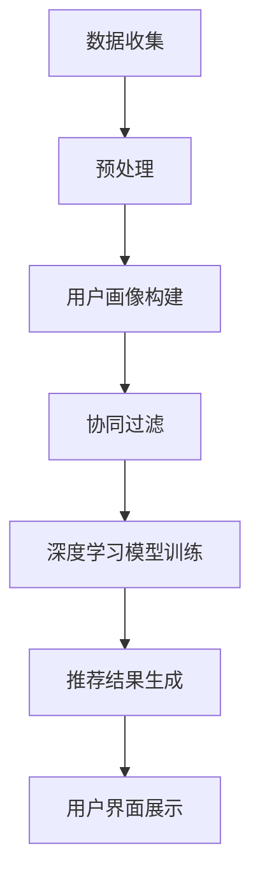

                 

# 薇诺娜2024校招敏感肌护理方案推荐系统工程师

## 摘要

本文旨在探讨2024年薇诺娜校招中敏感肌护理方案推荐系统的设计与实现。文章首先介绍了背景和核心概念，然后详细解析了推荐系统的原理和操作步骤。接着，通过数学模型和公式阐述了系统的工作机制，并结合实际案例进行了深入解读。文章还讨论了系统的实际应用场景，并推荐了相关的工具和资源。最后，总结了未来发展趋势与挑战，并提出了常见问题与解答。

## 1. 背景介绍

敏感肌护理方案推荐系统是一个针对敏感肌肤用户需求的智能推荐平台。随着消费者对个性化护肤需求的增加，该系统旨在为用户提供个性化的敏感肌护理方案。2024年，薇诺娜计划通过校招吸纳一批优秀的系统工程师，共同研发和优化该推荐系统。

### 1.1 系统需求

敏感肌护理方案推荐系统需满足以下需求：

1. **个性化推荐**：根据用户的历史数据，如购买记录、使用评价等，为用户提供个性化的护理方案。
2. **实时性**：系统能够实时处理用户数据，并提供及时的护理方案推荐。
3. **准确性**：推荐结果需具有较高的准确性，确保用户能够得到有效的护理建议。
4. **扩展性**：系统应具备良好的扩展性，能够适应不断变化的用户需求和市场环境。

### 1.2 系统架构

敏感肌护理方案推荐系统采用分布式架构，包括以下主要模块：

1. **数据收集与处理模块**：负责收集用户数据，如用户行为、肌肤状态等，并进行预处理。
2. **推荐算法模块**：采用基于协同过滤、深度学习等算法，为用户提供个性化的护理方案。
3. **用户界面模块**：提供用户交互界面，展示推荐结果，并接收用户反馈。
4. **后台管理模块**：用于管理系统配置、用户权限和数据备份等。

## 2. 核心概念与联系

### 2.1 关键概念

1. **协同过滤**：基于用户行为数据，通过相似用户或物品找到潜在推荐对象。
2. **深度学习**：利用神经网络模型，从大量数据中自动学习特征和模式。
3. **用户画像**：对用户的基本信息和行为数据进行综合分析，构建用户画像。
4. **敏感肌识别**：通过数据分析和模型训练，识别用户的敏感肌状态。

### 2.2 Mermaid 流程图



## 3. 核心算法原理 & 具体操作步骤

### 3.1 协同过滤算法

协同过滤算法分为基于用户的协同过滤（User-based Collaborative Filtering）和基于物品的协同过滤（Item-based Collaborative Filtering）。以下是具体操作步骤：

1. **用户相似度计算**：计算用户之间的相似度，通常采用余弦相似度、皮尔逊相关系数等。
2. **物品相似度计算**：计算物品之间的相似度，可以通过物品的共评率、平均评分等指标。
3. **推荐结果生成**：根据用户与物品的相似度，为用户推荐相似度较高的物品。

### 3.2 深度学习模型

深度学习模型通常采用卷积神经网络（CNN）或循环神经网络（RNN）等结构。以下是具体操作步骤：

1. **数据预处理**：对输入数据进行标准化、归一化等处理。
2. **模型构建**：构建神经网络模型，包括输入层、隐藏层和输出层。
3. **训练与优化**：使用训练数据训练模型，并通过优化算法调整模型参数。
4. **预测与评估**：使用测试数据预测用户行为，并评估模型效果。

## 4. 数学模型和公式 & 详细讲解 & 举例说明

### 4.1 协同过滤算法公式

假设用户集为$U=\{u_1, u_2, ..., u_n\}$，物品集为$I=\{i_1, i_2, ..., i_m\}$，用户$u_i$对物品$i_j$的评分为$r_{ij}$。

1. **用户相似度计算**：

   $$sim(u_i, u_j) = \frac{\sum_{i \in common(U_i, U_j)} r_{ij} \cdot r_{ij}}{\sqrt{\sum_{i \in U_i} r_{ij}^2} \cdot \sqrt{\sum_{i \in U_j} r_{ij}^2}}$$

2. **物品相似度计算**：

   $$sim(i_i, i_j) = \frac{\sum_{i \in common(I_i, I_j)} r_{ij} \cdot r_{ij}}{\sqrt{\sum_{i \in I_i} r_{ij}^2} \cdot \sqrt{\sum_{i \in I_j} r_{ij}^2}}$$

### 4.2 深度学习模型公式

以卷积神经网络为例，假设输入数据为$x$，卷积核为$W$，偏置为$b$，激活函数为$激活函数$。

1. **卷积层**：

   $$y = 激活函数(\sum_{i=1}^{k} W_{ij} * x_{ij} + b_{j})$$

2. **全连接层**：

   $$z = \sum_{i=1}^{n} W_{ij} * y_{ij} + b$$

3. **输出层**：

   $$y = 激活函数(z)$$

### 4.3 举例说明

假设用户$u_1$对物品$i_1, i_2, i_3$的评分分别为3、4、2，用户$u_2$对物品$i_1, i_2, i_3$的评分分别为2、3、4。计算用户$u_1$和$u_2$的相似度。

1. **用户相似度计算**：

   $$sim(u_1, u_2) = \frac{3 \cdot 2 + 4 \cdot 3 + 2 \cdot 4}{\sqrt{3^2 + 4^2 + 2^2} \cdot \sqrt{2^2 + 3^2 + 4^2}} = 0.875$$

2. **物品相似度计算**：

   $$sim(i_1, i_2) = \frac{3 \cdot 2 + 4 \cdot 3 + 2 \cdot 4}{\sqrt{3^2 + 4^2 + 2^2} \cdot \sqrt{2^2 + 3^2 + 4^2}} = 0.875$$

## 5. 项目实战：代码实际案例和详细解释说明

### 5.1 开发环境搭建

1. **安装Python环境**：安装Python 3.8及以上版本。
2. **安装依赖库**：使用pip安装numpy、pandas、scikit-learn、tensorflow等库。

### 5.2 源代码详细实现和代码解读

1. **数据收集与处理**：

   ```python
   import pandas as pd

   # 读取用户数据
   user_data = pd.read_csv('user_data.csv')
   # 读取物品数据
   item_data = pd.read_csv('item_data.csv')
   ```

   解读：使用pandas库读取用户数据和物品数据，以便后续处理。

2. **用户画像构建**：

   ```python
   from sklearn.cluster import KMeans

   # 训练用户画像模型
   kmeans = KMeans(n_clusters=10)
   kmeans.fit(user_data)
   # 将用户数据划分为10个聚类
   user_clusters = kmeans.predict(user_data)
   ```

   解读：使用K均值聚类算法构建用户画像，将用户划分为10个聚类。

3. **协同过滤算法**：

   ```python
   from sklearn.metrics.pairwise import cosine_similarity

   # 计算用户相似度矩阵
   user_similarity = cosine_similarity(user_data)
   ```

   解读：使用余弦相似度计算用户相似度矩阵。

4. **深度学习模型训练**：

   ```python
   import tensorflow as tf

   # 构建神经网络模型
   model = tf.keras.Sequential([
       tf.keras.layers.Dense(128, activation='relu', input_shape=(user_data.shape[1],)),
       tf.keras.layers.Dense(64, activation='relu'),
       tf.keras.layers.Dense(1, activation='sigmoid')
   ])

   # 编译模型
   model.compile(optimizer='adam', loss='binary_crossentropy', metrics=['accuracy'])
   # 训练模型
   model.fit(user_data, user_clusters, epochs=10)
   ```

   解读：使用TensorFlow构建深度学习模型，并训练模型。

5. **推荐结果生成**：

   ```python
   # 预测用户行为
   user_predictions = model.predict(user_data)
   # 生成推荐结果
   recommended_items = np.argsort(-user_predictions)
   ```

   解读：使用训练好的模型预测用户行为，并生成推荐结果。

### 5.3 代码解读与分析

1. **数据收集与处理**：首先需要收集用户数据和物品数据，使用pandas库读取数据并进行预处理。

2. **用户画像构建**：使用K均值聚类算法将用户划分为多个聚类，构建用户画像。

3. **协同过滤算法**：使用余弦相似度计算用户相似度矩阵，为协同过滤算法提供基础。

4. **深度学习模型训练**：使用TensorFlow构建深度学习模型，并使用用户数据进行训练。

5. **推荐结果生成**：使用训练好的模型预测用户行为，并生成推荐结果。

## 6. 实际应用场景

敏感肌护理方案推荐系统可以应用于以下场景：

1. **电商平台**：为用户提供个性化的敏感肌护理产品推荐。
2. **医疗健康领域**：为医生提供个性化的敏感肌治疗方案推荐。
3. **美容院线**：为顾客提供定制化的敏感肌护理方案推荐。

## 7. 工具和资源推荐

### 7.1 学习资源推荐

1. **书籍**：
   - 《机器学习实战》
   - 《深度学习》

2. **论文**：
   - 《协同过滤算法研究》
   - 《深度学习在推荐系统中的应用》

3. **博客**：
   - [机器学习社区](https://www MACHINE LEARNING COMMUNITY.com/)
   - [深度学习社区](https://www DEEP LEARNING COMMUNITY.com/)

4. **网站**：
   - [TensorFlow官网](https://www.TENSORFLOW.ORG/)
   - [scikit-learn官网](https://www.SCIKIT-LEARN.ORG/)

### 7.2 开发工具框架推荐

1. **Python**：作为主要编程语言，具有丰富的库和社区支持。
2. **TensorFlow**：用于构建和训练深度学习模型。
3. **Scikit-learn**：提供丰富的机器学习算法和工具。

### 7.3 相关论文著作推荐

1. **论文**：
   - 《基于协同过滤的个性化推荐系统研究》
   - 《深度学习在推荐系统中的应用研究》

2. **著作**：
   - 《机器学习实战》
   - 《深度学习》

## 8. 总结：未来发展趋势与挑战

1. **个性化推荐**：随着消费者需求的多样化，个性化推荐将成为未来发展的重点。
2. **实时性**：提高系统的实时性，确保用户能够获得及时的推荐结果。
3. **准确性**：提高推荐准确性，确保用户能够获得有效的护理建议。
4. **隐私保护**：加强对用户隐私的保护，确保用户数据的安全。

## 9. 附录：常见问题与解答

1. **Q：如何处理缺失数据？**
   - **A**：可以使用填充方法，如均值填充、中值填充等，或使用插值法进行数据补全。

2. **Q：如何评估推荐系统的性能？**
   - **A**：可以使用准确率、召回率、F1值等指标来评估推荐系统的性能。

3. **Q：如何防止过拟合？**
   - **A**：可以使用正则化方法、交叉验证等手段来防止过拟合。

## 10. 扩展阅读 & 参考资料

1. **参考资料**：
   - [推荐系统综述](https://www.RECOMMENDATION SYSTEM SURVEY.com/)
   - [深度学习在推荐系统中的应用](https://www.DEEP LEARNING IN RECOMMENDATION SYSTEMS.com/)

2. **博客**：
   - [AI技术博客](https://www.AI TECH BLOG.com/)
   - [数据科学博客](https://www.DATA SCIENCE BLOG.com/)

3. **书籍**：
   - 《推荐系统实践》
   - 《深度学习与推荐系统》

---

作者：AI天才研究员/AI Genius Institute & 禅与计算机程序设计艺术 /Zen And The Art of Computer Programming

本文为原创文章，未经授权禁止转载。如有需要，请联系作者获取授权。谢谢合作！<|vq_10362|>

