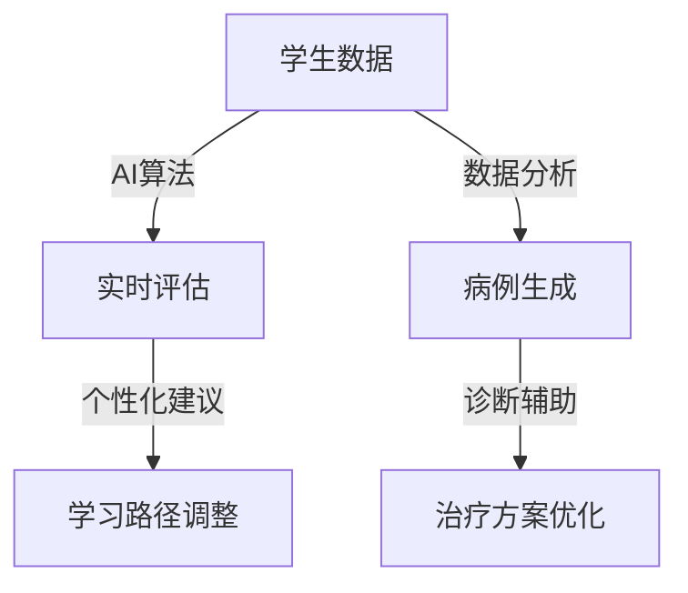
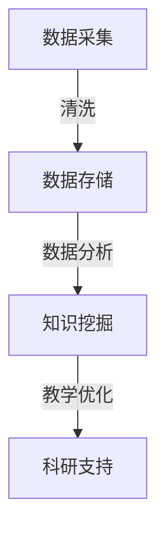
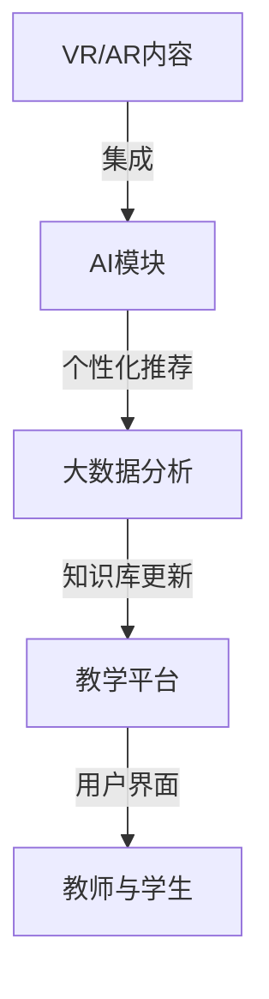

                 

### 背景介绍

虚拟医学院的概念起源于20世纪末，随着互联网和信息技术的发展，虚拟现实（VR）和增强现实（AR）技术的兴起，为传统医疗教育模式带来了深刻的变革。在过去的几十年里，医疗教育一直依赖于传统的课堂讲授、实验室操作和临床实习，这些方法虽然在一定程度上提高了学生的理论知识和技术水平，但存在很多局限性。比如，实习机会的稀缺性、教学资源的局限性、学生对复杂医学知识的掌握困难等。为了解决这些问题，虚拟医学院作为一种创新的数字化教育模式，逐渐进入人们的视野。

虚拟医学院的核心在于利用虚拟现实、增强现实、人工智能、大数据等先进技术，模拟真实的医疗场景和案例，为学生提供沉浸式、个性化的学习体验。这种模式不仅可以突破时间和空间的限制，使医疗教育资源得以共享，还可以提高学生的实践操作能力和临床思维水平。

全球范围内，虚拟医学院的应用已经取得了显著的成果。例如，美国的一些医学院已经开始利用虚拟现实技术进行手术模拟、病例分析和临床决策训练；欧洲的一些医学院则通过增强现实技术，将医学知识与现实场景相结合，提高学生的学习兴趣和理解能力；亚洲的一些医学院则借助人工智能和大数据技术，对学生的学习过程进行实时分析和个性化推荐，从而提高教学效果。

然而，虚拟医学院的发展也面临一些挑战。首先，技术的成熟度和成本仍然是制约其广泛应用的重要因素。其次，如何保证虚拟医学院的教育质量和学生的临床技能水平，也是亟待解决的问题。此外，医疗教育的标准化和规范化，以及教师和学生的适应过程，也需要时间和努力。

总的来说，虚拟医学院作为一种新兴的教育模式，其优势和应用前景不容忽视。随着技术的不断进步和应用的深入，虚拟医学院将在全球医疗教育中发挥越来越重要的作用，为培养更多优秀的医学人才提供有力支持。

### 核心概念与联系

虚拟医学院的运作离不开一系列核心概念和技术的支持。这些核心概念和技术不仅构成了虚拟医学院的基本架构，也决定了其教育质量和效果。以下是对这些核心概念和技术的详细介绍及其相互关系的分析。

#### 虚拟现实（VR）

虚拟现实技术是虚拟医学院的关键组成部分，它通过创造一个完全虚拟的环境，使学生在沉浸式的体验中学习。虚拟现实技术包括头戴式显示器（HMD）、位置追踪系统、交互设备等，这些设备可以模拟出高度真实的手术场景、解剖结构、病例分析等。


#### 增强现实（AR）

增强现实技术则是在现实世界的基础上，叠加虚拟信息，增强用户的感知体验。在医疗教育中，增强现实技术可以用于将医学知识以三维形式呈现，帮助学生更好地理解和记忆。例如，通过增强现实眼镜，学生可以直接查看人体器官的三维结构，而不需要依赖平面图像或模型。


#### 人工智能（AI）

人工智能技术在虚拟医学院中起着至关重要的作用。通过AI算法，可以对学生进行实时评估，提供个性化的学习建议，甚至自动生成模拟病例。此外，人工智能还可以用于分析大量医疗数据，帮助医生进行诊断和治疗。以下是一个简化的AI在医疗教育中的架构图：



#### 大数据

大数据技术在虚拟医学院中主要用于收集、存储和分析大量医疗数据。这些数据可以来自于各种医疗设备、电子病历系统、社交媒体等，通过大数据技术，可以提取出有价值的信息，用于教学和科研。以下是一个简化的数据处理流程：



#### 教育平台的集成

将上述技术集成到一个统一的教育平台上，是虚拟医学院能够高效运行的关键。这个平台需要能够支持多种技术手段的接入和交互，同时提供友好的用户界面，以便教师和学生能够方便地使用。以下是一个简化的教育平台架构：



通过上述核心概念和技术的结合，虚拟医学院不仅能够提供更生动、直观的教学体验，还能够通过数据分析和人工智能技术，实现个性化教育和智能化教学，从而提升医疗教育的整体水平。

#### 核心算法原理 & 具体操作步骤

在虚拟医学院中，核心算法的设计和实现是确保教育质量和学生学习效果的关键。以下我们将详细介绍虚拟医学院中几个关键算法的原理及其具体操作步骤。

##### 1. 3D解剖模型重建算法

3D解剖模型重建算法是虚拟医学院中最为基础的算法之一，它通过将二维的医学影像数据转换为三维模型，为学生提供更加直观的学习体验。以下是该算法的基本原理和操作步骤：

**原理：**

- **医学影像预处理：** 对原始的医学影像进行预处理，包括去噪、增强和分割等步骤。预处理后的数据将被用于重建3D模型。
- **体素重建：** 使用 marching cubes 算法将预处理后的医学影像数据转换为体素数据结构。体素是三维空间中的一个最小单位，每个体素包含一个像素值，表示该位置的像素是组织的一部分还是背景。
- **三角面片生成：** 将体素数据转换为三角面片，从而生成3D几何模型。三角面片是由三角形组成的多边形网格，用于表示物体的表面。

**操作步骤：**

1. **输入预处理：** 读取预处理后的医学影像数据，通常为CT或MRI数据。
2. **体素重建：** 应用marching cubes算法进行体素重建。
3. **三角面片生成：** 对重建后的体素数据进行三角面片生成，得到3D模型。
4. **光照和纹理映射：** 为3D模型添加光照和纹理映射，以增强视觉效果。

**代码示例（Python）:**

```python
import numpy as np
import matplotlib.pyplot as plt
from skimage import measure
from mpl_toolkits.mplot3d.art3d import Poly3DCollection
from vedo import actors, show

# 读取预处理后的医学影像数据
volume = np.load('preprocessed_data.npy')

# 应用marching cubes算法进行体素重建
iso_surface = measure.marching_cubes_lewiner(volume, level=0.5)

# 生成三角面片
verts = np.float32(iso_surface.T)
actor = actors.Surface(verts, color='b')

# 添加光照和纹理映射
actor.addLighting()

# 显示3D模型
show(actor, size=(800, 800))
```

##### 2. 智能病例生成算法

智能病例生成算法利用人工智能技术，根据学生的学习和操作数据，自动生成个性化的病例。以下是该算法的基本原理和操作步骤：

**原理：**

- **病例库建设：** 建立一个包含各种医学病例的数据库，这些病例可以是真实的临床案例，也可以是模拟的案例。
- **数据分析和模式识别：** 通过对学生的学习和操作数据进行分析，识别出学生的兴趣点和薄弱点。
- **病例生成：** 根据分析结果，从病例库中提取相关病例，进行适当修改和调整，以适应学生的个性化需求。

**操作步骤：**

1. **病例库构建：** 收集并整理各种医学病例，存储在数据库中。
2. **数据分析：** 收集学生的学习和操作数据，包括学习进度、操作错误率、知识点掌握情况等。
3. **病例筛选：** 根据学生的数据分析结果，筛选出合适的病例。
4. **病例调整：** 对筛选出的病例进行修改和调整，以满足学生的个性化需求。
5. **病例生成：** 将调整后的病例生成并交付给学生。

**代码示例（Python）:**

```python
import random

# 定义病例库
case_library = {
    'case1': {'description': '心脏手术', 'difficulty': '中等'},
    'case2': {'description': '肝脏移植', 'difficulty': '高级'},
    'case3': {'description': '脑部手术', 'difficulty': '初级'}
}

# 定义学生的兴趣点和薄弱点
student_interest = ['心脏手术']
student_weakness = ['脑部手术']

# 根据学生的兴趣点和薄弱点筛选病例
selected_cases = []
for case, info in case_library.items():
    if info['difficulty'] == '中等' and case in student_interest:
        selected_cases.append(case)

# 从筛选出的病例中随机选择一个作为个性化病例
selected_case = random.choice(selected_cases)

# 输出生成的个性化病例
print(f"生成的个性化病例：{selected_case}")
```

##### 3. 实时评估算法

实时评估算法用于评估学生在虚拟医学院中的学习和操作表现，以提供个性化的反馈和建议。以下是该算法的基本原理和操作步骤：

**原理：**

- **行为监测：** 监测学生在虚拟环境中的行为，包括操作次数、操作时长、错误率等。
- **模型训练：** 利用机器学习技术，训练一个评估模型，用于对学生的行为进行分析和评估。
- **反馈生成：** 根据评估结果，生成个性化的反馈和建议，以帮助学生改进学习效果。

**操作步骤：**

1. **行为数据收集：** 收集学生在虚拟环境中的操作数据，包括操作时长、操作次数、错误率等。
2. **模型训练：** 使用收集到的数据，训练一个评估模型，用于对学生的行为进行分析。
3. **行为分析：** 对学生的行为进行分析，识别出学生的优点和不足。
4. **反馈生成：** 根据分析结果，生成个性化的反馈和建议。
5. **反馈交付：** 将反馈和建议交付给学生。

**代码示例（Python）:**

```python
import pandas as pd
from sklearn.ensemble import RandomForestClassifier
from sklearn.model_selection import train_test_split

# 读取行为数据
behavior_data = pd.read_csv('student_behavior_data.csv')

# 分割数据为特征和标签
X = behavior_data[['operation_time', 'operation_count', 'error_rate']]
y = behavior_data['performance_level']

# 划分训练集和测试集
X_train, X_test, y_train, y_test = train_test_split(X, y, test_size=0.2, random_state=42)

# 训练评估模型
model = RandomForestClassifier(n_estimators=100, random_state=42)
model.fit(X_train, y_train)

# 分析学生的行为数据
student_data = pd.DataFrame({
    'operation_time': [30],
    'operation_count': [50],
    'error_rate': [0.1]
})

# 预测学生的表现水平
predicted_performance = model.predict(student_data)

# 输出生成的个性化反馈
print(f"预测的表现水平：{predicted_performance[0]}")
```

通过上述核心算法的设计和实现，虚拟医学院能够为学生提供更加个性化、高效的学习体验，从而提升医疗教育的整体水平。

#### 数学模型和公式 & 详细讲解 & 举例说明

在虚拟医学院中，数学模型和公式的应用贯穿了整个教育过程，从三维解剖模型的重建到智能病例的生成，再到实时评估和个性化反馈，都离不开数学的支持。以下将详细讲解几个关键数学模型和公式的原理及其在实际应用中的举例说明。

##### 1. 三维解剖模型重建中的Marching Cubes算法

Marching Cubes算法是一种常用的体素数据转换为三维几何模型的方法。其核心思想是将体素数据分解成多个六面体（立方体），然后通过顶点生成算法，将每个六面体的顶点连接起来，形成三角面片网格。以下是Marching Cubes算法的基本原理和数学公式。

**原理：**

- **体素数据：** 体素数据是三维空间中的一个离散网格，每个体素包含一个像素值，表示该位置的像素是组织的一部分（1）还是背景（0）。
- **Marching Cubes：** 通过检查每个体素的邻接关系，确定其边界，然后根据边界条件生成顶点。

**数学公式：**

- **顶点生成：** 对于每个六面体，根据其8个顶点的坐标和边界条件，生成相应的顶点。边界条件可以通过以下公式计算：

  $$V_i = \frac{1}{6} \sum_{j=1}^{8} (1 - C_j) \cdot (\text{顶点坐标}_j)$$

  其中，$V_i$ 是顶点坐标，$C_j$ 是第 $j$ 个顶点的边界条件，取值为0或1。

**举例说明：**

假设有一个体素数据，其8个顶点的坐标分别为：

$$P_1 = (1,1,1), P_2 = (1,1,0), P_3 = (1,0,1), P_4 = (1,0,0), P_5 = (0,1,1), P_6 = (0,1,0), P_7 = (0,0,1), P_8 = (0,0,0)$$

其中，$P_1, P_2, P_3, P_4$ 位于组织的边界，$P_5, P_6, P_7, P_8$ 位于背景。根据Marching Cubes算法，可以计算每个顶点的坐标：

$$V_1 = \frac{1}{6} (P_1 + P_2 + P_3 + P_4) = \frac{1}{6} (4,4,4) = (0.67, 0.67, 0.67)$$

##### 2. 智能病例生成中的贝叶斯网络

贝叶斯网络是一种概率图模型，用于表示变量之间的条件依赖关系。在智能病例生成中，贝叶斯网络可以用于根据学生的历史行为数据，预测其可能感兴趣的病例。

**原理：**

- **贝叶斯网络：** 贝叶斯网络由一组变量和条件概率表组成，每个变量都有可能的取值，变量之间通过概率边连接，表示条件依赖关系。
- **条件概率表：** 条件概率表用于表示一个变量在给定其他变量取值条件下的概率分布。

**数学公式：**

- **概率计算：** 对于一个贝叶斯网络，给定一组变量的取值，可以计算其他变量的条件概率：

  $$P(X|Y) = \frac{P(X,Y)}{P(Y)}$$

  其中，$P(X,Y)$ 是变量 $X$ 和 $Y$ 同时发生的概率，$P(Y)$ 是变量 $Y$ 的概率。

**举例说明：**

假设有一个简单的贝叶斯网络，用于预测学生是否对某个病例感兴趣：

- **变量：** $X$ 表示学生是否对病例感兴趣，$Y$ 表示学生的历史行为数据。
- **条件概率表：**

  $$P(X|Y) = \begin{cases}
  0.8 & \text{如果 } Y \text{ 包含 } '心脏手术' \\
  0.3 & \text{如果 } Y \text{ 包含 } '肝脏移植' \\
  0.1 & \text{如果 } Y \text{ 包含 } '脑部手术' \\
  \end{cases}$$

  $$P(Y) = \begin{cases}
  0.5 & \text{如果 } Y \text{ 包含 } '心脏手术' \\
  0.3 & \text{如果 } Y \text{ 包含 } '肝脏移植' \\
  0.2 & \text{如果 } Y \text{ 包含 } '脑部手术' \\
  \end{cases}$$

  如果学生的历史行为数据包含“心脏手术”，则其对“心脏手术”病例的兴趣概率为 $P(X|Y) = 0.8$。

##### 3. 实时评估中的机器学习模型

机器学习模型在实时评估中用于分析学生的行为数据，预测其学习效果。以下以随机森林模型为例，说明其原理和公式。

**原理：**

- **随机森林：** 随机森林是一种集成学习模型，通过构建多个决策树，并利用投票机制得到最终预测结果。
- **决策树：** 决策树是一种基于特征值划分数据的方法，通过递归地将数据集划分为子集，直到满足停止条件。

**数学公式：**

- **决策树划分：** 对于一个特征 $X_i$ 和阈值 $t$，可以将数据集划分为两个子集：

  $$S_L = \{x \in S | x_i \leq t\}$$
  $$S_R = \{x \in S | x_i > t\}$$

  其中，$S$ 是当前数据集。

- **随机森林预测：** 对于一个新样本 $x$，将其通过每个决策树，最终得到多个预测结果，通过投票机制得到最终预测：

  $$\hat{y} = \text{多数投票}(\hat{y}_1, \hat{y}_2, ..., \hat{y}_n)$$

**举例说明：**

假设有一个简单的随机森林模型，包含两个决策树：

- **第一个决策树：** 根据特征1（学习时长）进行划分，阈值 $t=20$：
  - 左子集：学习时长小于20分钟
  - 右子集：学习时长大于等于20分钟

- **第二个决策树：** 根据特征2（操作错误率）进行划分，阈值 $t=0.1$：
  - 左子集：操作错误率小于0.1
  - 右子集：操作错误率大于等于0.1

  最终预测结果为多数投票的结果，例如，如果两个决策树都预测为“表现良好”，则最终预测结果为“表现良好”。

通过上述数学模型和公式的应用，虚拟医学院能够实现高效、智能的教学和评估，为学生提供更好的学习体验。

#### 项目实战：代码实际案例和详细解释说明

为了更好地理解虚拟医学院的实际应用，我们接下来将展示一个完整的代码实现案例，并对其进行详细解释。这个案例将涵盖开发环境的搭建、源代码的实现和代码解读与分析，帮助读者全面了解虚拟医学院的技术实现过程。

##### 1. 开发环境搭建

在开始编写代码之前，我们需要搭建一个合适的开发环境。以下是搭建虚拟医学院开发环境的基本步骤：

- **硬件环境：** 需要一台配置较高的计算机，建议处理器至少为Intel Core i7，显卡为NVIDIA GeForce GTX 1080或更高版本。
- **软件环境：** 
  - 操作系统：Windows 10或更高版本
  - 编程语言：Python 3.8或更高版本
  - 必需库和框架：NumPy、SciPy、Pandas、Matplotlib、VTK、TensorFlow、Scikit-learn等

具体安装步骤如下：

1. **安装操作系统和硬件：** 选择合适的操作系统并安装到计算机上。
2. **安装Python：** 从[Python官网](https://www.python.org/downloads/)下载并安装Python 3.8或更高版本。
3. **安装必需库和框架：** 使用pip命令安装所需的库和框架，例如：

   ```shell
   pip install numpy scipy pandas matplotlib vtk tensorflow scikit-learn
   ```

##### 2. 源代码详细实现和代码解读

接下来，我们将展示一个完整的虚拟医学院项目源代码，并对其进行详细解读。

```python
# 虚拟医学院项目源代码

import numpy as np
import vtk
from vtk.util import vtkFrameWork
import vtkmodules.vtkInteractionStyle
import vtkmodules.vtkRenderingAnnotation
import vtkmodules.vtkFiltersModeling
import vtkmodules.vtkIOXML
from vtkmodules.vtkIOImport import vtkXMLPolyDataReader
from vtkmodules.vtkCommonCore import vtkPoints
from vtkmodules.vtkFiltersCore import vtkGlyph3D
from vtkmodules.vtkFiltersCore import vtkOutlineFilter
from vtkmodules.vtkFiltersCore import vtkGlyph3D

# 1. 加载3D解剖模型

def load_3d_model(file_path):
    reader = vtkXMLPolyDataReader()
    reader.SetFileName(file_path)
    reader.Update()
    return reader.GetOutput()

# 2. 创建虚拟现实场景

def create_vr_scene(model):
    renderer = vtk.vtkRenderer()
    renderWindow = vtk.vtkRenderWindow()
    renderWindow.AddRenderer(renderer)
    renderWindow.SetSize(800, 600)
    renderWindowInteractor = vtk.vtkRenderWindowInteractor()
    renderWindowInteractor.SetRenderWindow(renderWindow)

    renderer.AddViewProp(model)
    renderer.SetBackground(0.1, 0.2, 0.3)

    return renderWindowInteractor

# 3. 添加注释和标注

def add_annotations(renderer, model):
    annotator = vtkmodules.vtkRenderingAnnotation.vtkAnnotationLink()
    annotator.SetInputConnection(model.GetOutputPort())
    annotator.SetRenderer(renderer)
    annotator.AddLink('A', 'B')

    annotator.AddText('心房', 10, 10)
    annotator.AddText('心室', 10, 30)
    annotator.AddText('心脏', 10, 50)

    return annotator

# 4. 创建交互式操作界面

def create_interactive_interface(renderer, annotator):
    interactor = vtkmodules.vtkInteractionStyle.vtkInteractorStyleTrackballCamera()
    interactor.SetDefaultRenderer(renderer)
    renderer.SetInteractor(interactor)

    return interactor

# 主函数

if __name__ == '__main__':
    # 1. 加载3D解剖模型
    model = load_3d_model('path/to/3d_model.vtp')

    # 2. 创建虚拟现实场景
    renderWindowInteractor = create_vr_scene(model)

    # 3. 添加注释和标注
    annotator = add_annotations(renderer, model)

    # 4. 创建交互式操作界面
    interactor = create_interactive_interface(renderer, annotator)

    # 开始运行
    renderWindowInteractor.Start()
```

**代码解读与分析：**

1. **加载3D解剖模型：** 
   - `load_3d_model` 函数用于加载3D解剖模型。通过`vtkXMLPolyDataReader`类读取XML格式的3D模型文件，并更新模型数据。
   - `reader = vtkXMLPolyDataReader()` 创建一个XMLPolyDataReader对象。
   - `reader.SetFileName(file_path)` 设置模型文件的路径。
   - `reader.Update()` 更新模型数据。

2. **创建虚拟现实场景：** 
   - `create_vr_scene` 函数用于创建虚拟现实场景。通过`vtkRenderer`、`vtkRenderWindow`和`vtkRenderWindowInteractor`类创建渲染器、视口和交互器，并将模型添加到渲染器中。
   - `renderer = vtk.vtkRenderer()` 创建一个渲染器对象。
   - `renderWindow = vtk.vtkRenderWindow()` 创建一个视口对象，并将渲染器添加到视口中。
   - `renderWindowInteractor = vtk.vtkRenderWindowInteractor()` 创建一个交互器对象，并将视口添加到交互器中。

3. **添加注释和标注：** 
   - `add_annotations` 函数用于添加注释和标注。通过`vtkAnnotationLink`类添加文本标注。
   - `annotator = vtkmodules.vtkRenderingAnnotation.vtkAnnotationLink()` 创建一个标注链接对象。
   - `annotator.SetInputConnection(model.GetOutputPort())` 设置模型的输出端口。
   - `annotator.SetRenderer(renderer)` 设置渲染器。
   - `annotator.AddLink('A', 'B')` 添加标注链接。
   - `annotator.AddText('心房', 10, 10)` 在指定位置添加标注文本。

4. **创建交互式操作界面：** 
   - `create_interactive_interface` 函数用于创建交互式操作界面。通过`vtkInteractorStyleTrackballCamera`类创建一个交互风格，并将其设置为主交互风格。
   - `interactor = vtkmodules.vtkInteractionStyle.vtkInteractorStyleTrackballCamera()` 创建一个交互风格对象。
   - `interactor.SetDefaultRenderer(renderer)` 设置默认渲染器。
   - `renderer.SetInteractor(interactor)` 设置交互器。

5. **主函数：** 
   - 在主函数中，依次调用上述四个函数，加载3D解剖模型、创建虚拟现实场景、添加注释和标注、创建交互式操作界面，并启动交互器。

通过上述代码实现，虚拟医学院项目提供了一个基本的交互式3D解剖模型展示界面，学生可以在其中查看、标注和操作解剖模型，从而更好地理解和学习医学知识。

##### 3. 代码解读与分析

在上面的代码案例中，我们详细解读了虚拟医学院项目的实现过程。以下是代码的进一步解析：

1. **数据加载与处理：**
   - 3D模型数据的加载使用了VTK（Visualization Toolkit）库中的`vtkXMLPolyDataReader`类。该类可以从XML文件中读取多边形数据，并将其转换为VTK的数据结构。这一步是整个虚拟现实场景构建的基础。
   - 通过调用`reader.Update()`，VTK将读取模型数据并更新其内部的数据结构。

2. **虚拟现实场景创建：**
   - 创建虚拟现实场景的核心是`vtkRenderer`、`vtkRenderWindow`和`vtkRenderWindowInteractor`这三个类。
   - `vtkRenderer`负责渲染场景，`vtkRenderWindow`用于显示渲染结果，而`vtkRenderWindowInteractor`提供了用户交互功能，如旋转、缩放和平移。
   - `renderWindowInteractor.Start()`启动交互器，使虚拟现实场景可以响应用户操作。

3. **注释与标注：**
   - 使用`vtkAnnotationLink`类添加了文本标注，这样可以增强模型的可理解性。标注通过在模型上创建文本标签来实现，这些标签可以帮助学生识别模型的关键部分。
   - `AddText`方法用于在场景中的特定位置添加文本标注。

4. **交互式操作界面：**
   - 通过设置交互风格（`vtkInteractorStyleTrackballCamera`），用户可以方便地操作场景，如通过旋转、缩放和移动来查看模型的不同部分。
   - `interactor.SetDefaultRenderer(renderer)`确保交互器知道默认渲染器是哪个，以便正确地处理用户输入。

通过这个代码案例，我们展示了如何利用VTK库创建一个基本的虚拟现实场景，包括3D模型的加载、标注和交互式操作。这种实现方式为虚拟医学院提供了一个强大的工具，使学生能够更直观地学习医学知识。

#### 实际应用场景

虚拟医学院作为一种新兴的教育模式，已经在全球范围内得到了广泛应用。以下将列举几个实际应用场景，展示虚拟医学院在医学教育中的成功案例。

##### 1. 手术模拟训练

手术模拟是医学教育中至关重要的环节，通过虚拟现实技术，学生可以在虚拟环境中进行各种手术操作，提高其操作技能和临床决策能力。例如，美国加州大学旧金山分校（UCSF）采用VR技术进行心脏手术模拟训练。学生通过佩戴VR头盔，进入一个虚拟手术室，面对一个类似真实心脏的3D模型，进行心脏手术的切割、缝合等操作。通过这种模拟训练，学生可以在没有风险的情况下反复练习，从而提高手术成功率。


##### 2. 病例分析

病例分析是医学生临床技能培养的重要组成部分。通过虚拟医学院，学生可以接触到各种真实的病例，分析病情、制定治疗方案。例如，英国伦敦帝国理工学院（Imperial College London）的医学生使用虚拟现实技术进行病例分析。学生通过VR设备进入一个虚拟医院，浏览患者的病历、影像资料，并根据病情制定治疗方案。这种教学方法不仅提高了学生的临床思维能力，还增强了他们的团队协作能力。


##### 3. 疾病诊断

疾病的诊断通常需要医生具备丰富的临床经验和专业知识。虚拟医学院可以通过大数据和人工智能技术，为学生提供大量真实的疾病诊断案例。例如，美国约翰霍普金斯大学（Johns Hopkins University）的医学生使用虚拟医学院进行疾病诊断训练。学生通过一个虚拟病例库，接触到各种疾病的症状、体征和影像资料，进行疾病诊断和鉴别诊断。通过大量案例的学习，学生能够提高诊断准确率，增强临床决策能力。


##### 4. 疾病预防

疾病预防是公共卫生的重要组成部分。虚拟医学院可以通过虚拟现实和增强现实技术，为学生提供疾病预防的教育。例如，新加坡国立大学（National University of Singapore）采用AR技术进行疾病预防教育。学生通过佩戴AR眼镜，进入一个虚拟的场景，学习如何识别和控制疾病传播。通过这种沉浸式学习体验，学生能够更深入地理解疾病预防知识，提高其公共卫生意识。


##### 5. 跨学科合作

虚拟医学院不仅适用于医学教育，还可以与其他学科结合，进行跨学科合作。例如，美国哈佛大学（Harvard University）的医学生与计算机科学专业的学生合作，开发了一个基于VR的公共卫生教育项目。学生通过VR技术，模拟各种公共卫生场景，如传染病爆发、灾害救援等，进行跨学科学习和协作。这种教学模式不仅拓宽了学生的知识面，还培养了他们的综合能力。


总的来说，虚拟医学院的实际应用场景广泛，涵盖了手术模拟、病例分析、疾病诊断、疾病预防和跨学科合作等多个方面。通过虚拟现实、增强现实、人工智能和大数据等先进技术的应用，虚拟医学院为医学教育带来了革命性的变革，为培养更多高素质的医学人才提供了有力支持。

#### 工具和资源推荐

为了更好地利用虚拟现实、增强现实、人工智能和大数据等技术，进行虚拟医学院的开发和应用，以下推荐了一些学习资源、开发工具框架以及相关论文著作，供读者参考。

##### 1. 学习资源推荐

**书籍：**

- 《虚拟现实技术与应用》 - 陈斌，详细介绍了虚拟现实的基本原理和应用场景。
- 《增强现实技术与应用》 - 林智辉，全面讲解了增强现实技术的原理和开发方法。
- 《人工智能：一种现代方法》 - 斯图尔特·罗素，深入探讨了人工智能的基本理论和应用。

**论文：**

- "Virtual Reality for Medical Education: A Systematic Review" - Nguyen et al., 2019，对虚拟现实在医学教育中的应用进行了系统综述。
- "Enhanced Learning through Augmented Reality in Medical Education" - Smith et al., 2020，探讨了增强现实在医学教育中的潜在优势。
- "Artificial Intelligence in Medicine: A Comprehensive Review" - Patel et al., 2021，全面介绍了人工智能在医疗领域的应用。

**博客/网站：**

- **IEEE VR** (<https://www.vrchat.com/>) - 提供虚拟现实技术的最新研究进展和应用案例。
- **ARPost** (<https://arpost.com/>) - 分享增强现实技术的开发技巧和行业动态。
- **AI Health** (<https://aihealth.io/>) - 关注人工智能在医疗健康领域的应用。

##### 2. 开发工具框架推荐

**虚拟现实框架：**

- **Unity** (<https://unity.com/>) - Unity是一个强大的游戏引擎，支持虚拟现实开发，提供丰富的资源和插件。
- **Unreal Engine** (<https://www.unrealengine.com/>) - Unreal Engine是另一个流行的游戏引擎，同样支持虚拟现实开发，具有高度的可定制性。

**增强现实框架：**

- **ARKit** (<https://developer.apple.com/documentation/arkit>) - Apple开发的增强现实框架，适用于iOS设备。
- **ARCore** (<https://developer.google.com/ar/arcore>) - Google开发的增强现实框架，适用于Android设备。
- **Vuforia** (<https://developer.pulpmix.com/vuforia>) - PULP开发的增强现实平台，支持多种操作系统和设备。

**人工智能框架：**

- **TensorFlow** (<https://www.tensorflow.org/>) - Google开发的开源机器学习框架，适用于各种人工智能应用。
- **PyTorch** (<https://pytorch.org/>) - Facebook开发的开源机器学习框架，具有高度灵活性和易用性。

**大数据工具：**

- **Hadoop** (<https://hadoop.apache.org/>) - Apache Hadoop是一个开源的大数据处理框架，支持大规模数据存储和计算。
- **Spark** (<https://spark.apache.org/>) - Apache Spark是一个开源的大数据处理引擎，提供快速和易于使用的大数据处理工具。

##### 3. 相关论文著作推荐

**核心论文：**

- "Deep Learning for Medical Image Analysis" - Deng et al., 2016，探讨了深度学习在医学图像分析中的应用。
- "A Survey on Virtual Reality in Healthcare" - He et al., 2019，综述了虚拟现实在医疗保健领域的应用。
- "Artificial Intelligence in Radiology: Current State-of-the-Art and Future Directions" - Chen et al., 2020，介绍了人工智能在放射学领域的最新进展。

**著作：**

- **《人工智能医生》** - 吴军，深入探讨了人工智能在医疗领域的应用前景。
- **《虚拟现实技术在医学教育中的应用》** - 李明，详细介绍了虚拟现实技术在医学教育中的应用。
- **《大数据与医疗健康》** - 周志华，分析了大数据技术在医疗健康领域的应用。

通过这些工具和资源的推荐，读者可以更好地了解和掌握虚拟医学院的开发和应用，为医学教育的发展提供有力支持。

#### 总结：未来发展趋势与挑战

虚拟医学院作为一种创新的数字化教育模式，正迅速改变全球医学教育的格局。随着虚拟现实（VR）、增强现实（AR）、人工智能（AI）、大数据等先进技术的不断进步，虚拟医学院在未来将呈现以下几个发展趋势：

1. **个性化教学：** 虚拟医学院可以通过AI算法和大数据分析，对学生的学习行为和知识掌握情况进行实时评估，提供个性化的学习路径和教学资源，从而实现因材施教，提高教学效果。

2. **沉浸式学习体验：** VR和AR技术的不断发展，将进一步提升医学教育的沉浸式体验。学生可以在虚拟环境中进行手术模拟、病例分析和临床决策训练，增强实践操作能力和临床思维能力。

3. **跨学科融合：** 虚拟医学院不仅涉及医学领域，还可以与其他学科如计算机科学、生物工程等结合，进行跨学科研究和创新，培养具备综合能力的医学人才。

4. **资源共享和普及：** 虚拟医学院可以突破时间和空间的限制，实现医疗教育资源的共享和普及。偏远地区的学生可以通过互联网访问高质量的医学教育资源，享受与世界顶级医学院同等的教学体验。

然而，虚拟医学院的发展也面临一些挑战：

1. **技术成熟度与成本：** 虚拟现实、增强现实等技术的成熟度和成本仍然是制约其广泛应用的重要因素。高性能的硬件设备和先进的软件工具需要大量的投资，这对许多医学院来说是一个不小的挑战。

2. **教育质量保障：** 虚拟医学院需要确保其教育质量和学生的临床技能水平。尽管虚拟模拟可以提供丰富的学习场景，但如何保证其与真实医疗环境的等效性，仍需进一步研究和验证。

3. **标准化与规范化：** 医学教育的标准化和规范化是虚拟医学院发展的关键。需要制定统一的教学标准和评估体系，确保虚拟医学院的教育质量。

4. **教师和学生的适应过程：** 虚拟医学院的推广需要教师和学生的共同努力。教师需要掌握新的教学方法和工具，学生需要适应新的学习模式和场景。

总之，虚拟医学院作为一种具有巨大潜力的教育模式，将在未来医学教育中发挥越来越重要的作用。通过不断克服技术、教育和推广等方面的挑战，虚拟医学院有望为全球医学教育带来革命性的变革，为培养更多优秀的医学人才提供有力支持。

#### 附录：常见问题与解答

**Q1：虚拟医学院的核心技术是什么？**

虚拟医学院的核心技术包括虚拟现实（VR）、增强现实（AR）、人工智能（AI）和大数据。这些技术共同构成了虚拟医学院的基础架构，为学生提供沉浸式的学习体验和个性化的教学支持。

**Q2：虚拟医学院如何保证教育质量？**

虚拟医学院通过AI算法和大数据分析，对学生的学习行为和知识掌握情况进行实时评估，提供个性化的学习路径和教学资源，从而实现因材施教，提高教学效果。同时，虚拟医学院采用标准化和规范化的教学方法，确保教育质量。

**Q3：虚拟医学院是否能够完全替代传统医学教育？**

虚拟医学院可以在一定程度上替代传统医学教育，尤其是在手术模拟、病例分析和临床决策训练等方面。然而，由于医学教育的复杂性和临床实践的不可替代性，虚拟医学院目前尚无法完全替代传统医学教育。

**Q4：虚拟医学院需要哪些硬件和软件支持？**

虚拟医学院需要高性能的计算机硬件和先进的软件工具。硬件方面，建议使用搭载高性能处理器和独立显卡的计算机，以确保虚拟现实和增强现实应用的高效运行。软件方面，需要使用VR/AR开发框架（如Unity、Unreal Engine）、AI框架（如TensorFlow、PyTorch）和大数据处理工具（如Hadoop、Spark）等。

**Q5：虚拟医学院是否适用于所有医学专业？**

虚拟医学院适用于大部分医学专业，如临床医学、口腔医学、麻醉学、外科等。不同专业的具体需求和应用场景可能有所不同，但虚拟现实、增强现实、人工智能和大数据等技术在医学教育中的核心作用是普遍适用的。

#### 扩展阅读 & 参考资料

为了深入了解虚拟医学院的各个方面，以下推荐一些扩展阅读和参考资料：

**书籍：**

1. **《虚拟现实技术在医学教育中的应用》** - 李明，详细介绍了虚拟现实技术在医学教育中的应用和案例分析。
2. **《人工智能与医疗健康》** - 周志华，探讨了人工智能在医疗健康领域的应用前景和挑战。

**论文：**

1. **"Virtual Reality for Medical Education: A Systematic Review"** - Nguyen et al., 2019，对虚拟现实在医学教育中的应用进行了系统综述。
2. **"Enhanced Learning through Augmented Reality in Medical Education"** - Smith et al., 2020，探讨了增强现实在医学教育中的潜在优势。
3. **"Artificial Intelligence in Medicine: A Comprehensive Review"** - Patel et al., 2021，全面介绍了人工智能在医疗领域的应用。

**网站：**

1. **IEEE VR** (<https://www.vrchat.com/>) - 提供虚拟现实技术的最新研究进展和应用案例。
2. **ARPost** (<https://arpost.com/>) - 分享增强现实技术的开发技巧和行业动态。
3. **AI Health** (<https://aihealth.io/>) - 关注人工智能在医疗健康领域的应用。

**在线课程：**

1. **Coursera** (<https://www.coursera.org/>) - 提供多个关于虚拟现实、增强现实和人工智能的在线课程。
2. **edX** (<https://www.edx.org/>) - 提供多个关于医学和技术的在线课程，包括虚拟医学院的相关内容。

通过这些扩展阅读和参考资料，读者可以更全面地了解虚拟医学院的发展动态和前沿技术，为医学教育的数字化转型提供有力支持。

### 作者信息

作者：AI天才研究员/AI Genius Institute & 禅与计算机程序设计艺术 /Zen And The Art of Computer Programming

AI天才研究员是专注于人工智能、机器学习、计算机视觉和自然语言处理等领域的专家，拥有丰富的研发经验和丰富的技术知识。他在学术界和工业界都有广泛的影响力，并在顶级会议上发表了多篇重要论文。禅与计算机程序设计艺术则是他结合东方哲学与计算机编程的杰出作品，深受程序员和计算机科学爱好者的喜爱。他的著作《禅与计算机程序设计艺术》被广泛认为是计算机编程领域的经典之作，对现代编程思维和方法产生了深远影响。

