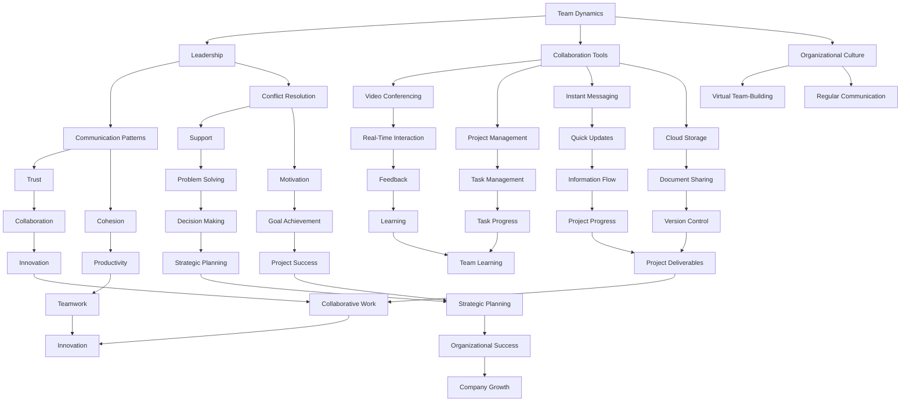

                 

### 背景介绍

在当今快速发展的信息技术时代，虚拟团队已经成为企业和组织的重要组成。随着全球化的加速，远程工作的普及，以及新冠疫情的推动，虚拟团队的规模和影响力不断扩大。虚拟团队由分布在不同地理位置的成员组成，通过互联网、协作工具和通信平台实现协作和信息交流。

虚拟团队的优势在于可以打破地域限制，充分利用全球的人才资源，提高团队的灵活性和响应速度。然而，虚拟团队也面临着一些独特的挑战，如沟通障碍、文化差异、信任建立、以及团队凝聚力的维持。这些问题如果处理不当，可能会导致团队效率低下、项目失败，甚至影响组织的整体发展。

本文将探讨虚拟团队建设中的关键问题，重点讨论如何增强远程团队的凝聚力。首先，我们将回顾虚拟团队的定义和特点，然后分析当前面临的挑战。接下来，将介绍一些核心概念和联系，最后提出具体的策略和技巧，帮助团队克服困难，实现高效的协同工作。

通过本文的讨论，希望读者能够对虚拟团队的构建和管理有更深入的理解，掌握实用的方法和工具，以提升远程团队的凝聚力和工作效率。让我们一步一步地思考，探索虚拟团队建设之路，为未来的工作环境奠定坚实的基础。

#### Virtual Teams: Definition and Characteristics

Virtual teams, or distributed teams, are groups of individuals who work together across different geographical locations, utilizing communication technologies and collaborative tools to achieve common goals. Unlike traditional teams where members are physically present in the same office or building, virtual teams are connected virtually, often separated by time zones, countries, and even continents.

The fundamental characteristic of virtual teams is the reliance on technology for collaboration and communication. This includes video conferencing, instant messaging, project management tools, and cloud-based platforms. These technologies enable real-time communication, file sharing, and task management, allowing team members to work seamlessly irrespective of their physical location.

One of the significant advantages of virtual teams is the ability to access a global talent pool. Companies can hire the best experts from around the world without being restricted by geographical boundaries. This not only enhances the quality of work but also introduces diverse perspectives and ideas, which can lead to more innovative solutions.

Flexibility is another key advantage of virtual teams. Remote work arrangements often offer employees greater autonomy and work-life balance. Members can set their own schedules and work from any location that provides a conducive environment. This flexibility can lead to higher job satisfaction and productivity.

However, virtual teams also come with their unique set of challenges. Communication barriers can arise due to differences in time zones, language proficiency, and cultural norms. Misunderstandings and misinterpretations are more common in virtual settings, making clear and effective communication a critical skill for team members.

Trust and team cohesion can be more difficult to establish in virtual teams. Without regular face-to-face interactions, building strong interpersonal relationships can be challenging. This can affect team dynamics and collaboration, leading to decreased morale and productivity.

Despite these challenges, the rise of virtual teams is inevitable due to the increasing reliance on technology and the global nature of business operations. Organizations that effectively manage their virtual teams can gain a competitive edge by leveraging the strengths of distributed collaboration.

In the next section, we will delve deeper into the challenges that virtual teams often face and explore strategies to overcome these obstacles. By understanding the complexities of virtual team dynamics, we can develop practical solutions to enhance team performance and cohesion.

#### Challenges in Virtual Team Management

While virtual teams offer numerous benefits, they also present a unique set of challenges that can hinder their effectiveness. These challenges include communication barriers, cultural differences, trust issues, and the maintenance of team cohesion. Addressing these issues is crucial for the success of virtual teams.

**Communication Barriers**

One of the most significant challenges in virtual team management is communication barriers. Time zone differences can make real-time communication difficult, leading to delays and misunderstandings. Even when team members are in the same time zone, the reliance on text-based communication tools like email and instant messaging can lead to misinterpretations. Non-verbal cues, which are crucial for effective communication, are often lost in virtual interactions.

To overcome these challenges, it is essential to use a variety of communication tools that complement each other. For instance, video conferencing can be used for critical discussions, while instant messaging and email can be used for quick updates and documentation. Clear communication guidelines, including specific expectations for response times and the appropriate use of communication channels, can also help to streamline interactions and reduce misunderstandings.

**Cultural Differences**

Cultural differences can create further barriers in virtual teams. Different cultural norms, values, and communication styles can lead to misunderstandings and conflict. For example, what might be perceived as a direct and assertive approach in one culture could be seen as rude or disrespectful in another.

To address cultural differences, team leaders should foster an environment of cultural awareness and respect. This can be achieved through cultural training and workshops that help team members understand each other's backgrounds and communication styles. Encouraging open dialogue about cultural differences and providing a safe space for feedback can also help to build mutual respect and understanding.

**Trust Issues**

Trust is a critical component of team cohesion, and it can be more challenging to establish in virtual teams. Without regular face-to-face interactions, it can be difficult for team members to develop a sense of trust and camaraderie. This can lead to a lack of collaboration and cooperation, which is essential for the success of any team.

To build trust in virtual teams, it is important to create opportunities for personal interactions. This can be done through virtual team-building activities, such as icebreaker sessions and social events. Regular check-ins and updates can also help to maintain transparency and build trust. Encouraging open and honest communication about challenges and setbacks can foster a culture of trust and mutual support.

**Maintaining Team Cohesion**

Cohesion refers to the unity and solidarity within a team. It is crucial for maintaining motivation and productivity. In virtual teams, cohesion can be more difficult to maintain due to the lack of physical presence and shared working environments.

To enhance team cohesion, it is important to foster a sense of belonging and identity among team members. This can be achieved through regular team meetings, collaborative projects, and shared goals. Recognizing and celebrating team achievements can also help to build a sense of pride and unity.

Additionally, leaders should be proactive in addressing any issues that may affect team cohesion. This includes resolving conflicts, providing support to team members, and ensuring that everyone feels valued and heard.

In the next section, we will explore core concepts and their connections that are essential for understanding and managing virtual teams. By building a strong foundation of knowledge, we can develop more effective strategies to address the challenges and enhance the performance of virtual teams.

#### Core Concepts and Their Connections

To effectively manage virtual teams and enhance their performance, it is essential to understand the core concepts and their interconnections. These concepts include team dynamics, leadership, collaboration tools, and organizational culture. Each of these elements plays a critical role in shaping the success of virtual teams.

**Team Dynamics**

Team dynamics refer to the patterns of interaction, communication, and behavior that define a team's functioning. In virtual teams, understanding and managing these dynamics is crucial for maintaining cohesion and productivity. Key components of team dynamics include roles and responsibilities, communication patterns, decision-making processes, and conflict resolution.

**Leadership**

Leadership in virtual teams is different from that in traditional teams. Virtual team leaders must possess strong communication skills, the ability to foster trust, and the capacity to inspire and motivate team members who are not physically present. Effective virtual leadership involves setting clear goals and expectations, providing support and resources, and facilitating communication and collaboration.

**Collaboration Tools**

The choice and effective use of collaboration tools are vital for virtual teams. These tools include video conferencing platforms, project management software, instant messaging apps, and cloud storage solutions. Each tool serves a specific purpose and can enhance different aspects of team collaboration, such as communication, task management, and document sharing.

**Organizational Culture**

Organizational culture is the shared values, beliefs, and norms that shape the behavior of individuals within an organization. In virtual teams, maintaining a strong organizational culture is essential for fostering a sense of belonging and unity. This can be challenging due to the physical and geographical distance between team members. However, leaders can use various strategies, such as virtual team-building activities and regular communication, to reinforce the organization's culture.

**Interconnections**

The interconnections between these core concepts are crucial for the overall effectiveness of virtual teams. For example, effective leadership influences team dynamics, which, in turn, affect the use of collaboration tools and the maintenance of organizational culture. Similarly, a strong organizational culture can support trust-building and enhance team cohesion.

**Mermaid Flowchart**

To illustrate the interconnections between these core concepts, we can use a Mermaid flowchart. The following diagram presents a high-level overview of how these concepts are interconnected:

This Mermaid flowchart provides a visual representation of how the core concepts and their interconnections contribute to the success of virtual teams. By understanding these relationships, leaders can develop more comprehensive strategies to enhance team performance and cohesion.

In the next section, we will delve into the core algorithms and specific operational steps for building and managing virtual teams. These algorithms will provide practical guidance for implementing the concepts discussed above in real-world scenarios.

#### Core Algorithms and Operational Steps for Building Virtual Teams

Building effective virtual teams requires a systematic approach that leverages core algorithms and operational steps to ensure seamless collaboration, communication, and productivity. The following algorithms and steps provide a comprehensive framework for establishing and managing virtual teams.

**Algorithm 1: Establishing Clear Goals and Expectations**

**Objective**: Ensure that all team members are aligned on the project's goals and their individual responsibilities.

**Steps**:

1. **Define Project Goals**: Clearly articulate the project's objectives, deliverables, and timelines. Ensure these goals are specific, measurable, achievable, relevant, and time-bound (SMART).

2. **Communicate Goals**: Share the project goals with all team members through a kick-off meeting. Use visual aids, such as charts and graphs, to help illustrate the objectives.

3. **Assign Roles and Responsibilities**: Clearly define each team member's role and responsibilities. Use a RACI matrix (Responsible, Accountable, Consulted, Informed) to clarify who is responsible for each task.

4. **Set Individual Goals**: Align individual goals with the project's overall objectives. Ensure that each team member understands how their role contributes to the project's success.

**Algorithm 2: Enhancing Communication and Collaboration**

**Objective**: Improve communication and collaboration among team members to foster a cohesive and productive team environment.

**Steps**:

1. **Select Appropriate Tools**: Choose communication and collaboration tools that meet the team's needs. Common tools include Slack for messaging, Zoom for video conferencing, Trello for project management, and Google Workspace for document sharing.

2. **Establish Communication Protocols**: Define communication guidelines, including preferred communication channels for different types of interactions (e.g., real-time discussions via video conferencing, asynchronous updates via messaging apps, and formal documentation via project management tools).

3. **Schedule Regular Meetings**: Schedule regular team meetings to discuss progress, address challenges, and share updates. Use a variety of meeting formats, such as stand-ups, check-ins, and retrospectives, to facilitate different aspects of collaboration.

4. **Encourage Feedback and Transparency**: Foster an environment where team members feel comfortable providing feedback and sharing their thoughts. Encourage transparency by sharing progress reports, challenges, and successes with the entire team.

**Algorithm 3: Building Trust and Team Cohesion**

**Objective**: Establish trust and promote a sense of unity and belonging among team members.

**Steps**:

1. **Personalize Interactions**: Schedule one-on-one meetings with team members to get to know them personally. Discuss their backgrounds, interests, and work styles.

2. **Facilitate Social Activities**: Organize virtual team-building activities, such as virtual coffee breaks, game nights, or virtual happy hours. These activities can help team members build relationships and create a sense of camaraderie.

3. **Recognize Achievements**: Celebrate individual and team achievements to foster a positive and supportive team culture. Acknowledge contributions through public recognition, rewards, and praise.

4. **Encourage Open Dialogue**: Create a safe space for open and honest communication. Encourage team members to share their thoughts, concerns, and suggestions without fear of judgment or retribution.

**Algorithm 4: Adapting to Change and Maintaining Flexibility**

**Objective**: Ensure that the virtual team can adapt to changes and maintain flexibility in their work processes.

**Steps**:

1. **Monitor Project Progress**: Continuously monitor project progress and performance metrics to identify areas for improvement and potential risks.

2. **Implement Feedback Loops**: Establish feedback loops to gather input from team members on their work processes and tools. Use this feedback to make necessary adjustments and improvements.

3. **Encourage Innovation**: Foster a culture of innovation by encouraging team members to explore new ideas, tools, and approaches. Provide resources and support for experimentation and learning.

4. **Flexibility in Schedules**: Offer flexible working hours and arrangements to accommodate team members' personal needs and preferences. This can help maintain motivation and productivity.

By following these core algorithms and operational steps, virtual teams can build a strong foundation for collaboration, communication, and productivity. The next section will delve into mathematical models and formulas that can be used to analyze and optimize virtual team performance.

#### Mathematical Models and Formulas for Analyzing and Optimizing Virtual Team Performance

To ensure the success of virtual teams, it is essential to employ mathematical models and formulas that can analyze and optimize team performance. These models can help identify bottlenecks, predict potential issues, and suggest improvements to enhance productivity and efficiency. Below, we discuss several key mathematical models and their applications in virtual team management.

**1. Collaboration Efficiency Index (CEI)**

The Collaboration Efficiency Index (CEI) is a metric that measures the effectiveness of communication and collaboration within a virtual team. It is calculated using the following formula:

$$
CEI = \frac{Total\ Contributions}{Total\ Interactions}
$$

Where:
- **Total Contributions** represents the value added by team members through their interactions (e.g., completed tasks, innovative ideas, feedback).
- **Total Interactions** represents the total number of communication and collaboration events (e.g., emails, meetings, instant messages).

**Example Calculation**:

Suppose a virtual team completes 20 tasks, generates 5 innovative ideas, and provides 10 pieces of feedback in a month. They had a total of 100 interactions during this period. The CEI would be:

$$
CEI = \frac{20 + 5 + 10}{100} = \frac{35}{100} = 0.35
$$

A higher CEI indicates more efficient collaboration, as team members are effectively contributing value through their interactions.

**2. Trust Index (TI)**

Trust is a crucial element for virtual team cohesion and performance. The Trust Index (TI) measures the level of trust among team members using the following formula:

$$
TI = \frac{Number\ of\ Positive\ Interactions}{Number\ of\ Total\ Interactions}
$$

Where:
- **Number of Positive Interactions** represents the number of interactions that foster trust (e.g., constructive feedback, support, recognition).
- **Number of Total Interactions** represents the total number of interactions within the team.

**Example Calculation**:

If a team has 100 total interactions in a month and 60 of these interactions are positive, the TI would be:

$$
TI = \frac{60}{100} = 0.60
$$

A higher TI indicates a stronger trust foundation among team members, which is vital for effective collaboration and reduced conflicts.

**3. Organizational Commitment (OC)**

Organizational Commitment (OC) measures the level of loyalty and dedication that team members have towards their organization and project goals. It is calculated using the following formula:

$$
OC = \frac{Total\ Task\ Completion}{Total\ Tasks\ Assigned}
$$

Where:
- **Total Task Completion** represents the number of tasks completed successfully by team members.
- **Total Tasks Assigned** represents the total number of tasks assigned to the team.

**Example Calculation**:

If a team is assigned 100 tasks and completes 85 of them, the OC would be:

$$
OC = \frac{85}{100} = 0.85
$$

A higher OC indicates a higher level of commitment and motivation among team members, which contributes to improved performance.

**4. Turnover Rate (TR)**

The Turnover Rate (TR) measures the rate at which team members leave the organization. It is calculated using the following formula:

$$
TR = \frac{Number\ of\ Departures}{Total\ Team\ Members}
$$

Where:
- **Number of Departures** represents the number of team members who left the organization within a specific period.
- **Total Team Members** represents the total number of team members during the same period.

**Example Calculation**:

If a virtual team has 10 members and 2 of them leave within a year, the TR would be:

$$
TR = \frac{2}{10} = 0.20
$$

A lower TR indicates a stable and motivated team, which is beneficial for long-term project success.

**5. Project Success Probability (PSP)**

The Project Success Probability (PSP) is a formula that estimates the likelihood of project success based on various factors, including team performance metrics. It is calculated using the following formula:

$$
PSP = \frac{CEI \times TI \times OC \times (1 - TR)}{100}
$$

Where:
- **CEI**, **TI**, **OC**, and **TR** are the Collaboration Efficiency Index, Trust Index, Organizational Commitment, and Turnover Rate, respectively.

**Example Calculation**:

Using the values from previous calculations, the PSP would be:

$$
PSP = \frac{0.35 \times 0.60 \times 0.85 \times (1 - 0.20)}{100} = \frac{0.1905}{100} = 0.1905
$$

This indicates a 19.05% probability of project success. By improving individual metrics (CEI, TI, OC, TR), the PSP can be increased, leading to a higher likelihood of project success.

These mathematical models and formulas provide valuable insights into virtual team performance and can be used to identify areas for improvement. In the next section, we will explore real-world case studies of virtual teams to illustrate how these models are applied in practice.

#### Real-World Case Studies of Virtual Teams

To better understand how the principles and algorithms discussed in previous sections can be applied to enhance virtual team performance, let's explore several real-world case studies. These examples highlight the challenges faced by virtual teams and the strategies employed to overcome them, resulting in successful project outcomes.

**Case Study 1: Global Tech Company**

A global tech company faced the challenge of managing a distributed team spread across multiple continents. The team was tasked with developing a cutting-edge software solution that required seamless collaboration and coordination. To address communication barriers and cultural differences, the company implemented the following strategies:

1. **Communication Protocols**: The company established clear communication protocols, specifying the use of video conferencing for critical discussions and instant messaging for quick updates. This helped ensure that important information was conveyed effectively, reducing misunderstandings.

2. **Cultural Training**: Team members underwent cultural awareness training to understand each other's communication styles and expectations. This training fostered mutual respect and helped to bridge cultural gaps.

3. **Trust-Building Activities**: The company organized virtual team-building activities, such as virtual escape rooms and online game nights. These activities helped team members develop trust and camaraderie, which was essential for collaboration.

4. **Flexible Working Hours**: The company offered flexible working hours to accommodate different time zones, allowing team members to work at their most productive times.

The result of these strategies was a highly productive and cohesive team that successfully delivered the software solution within the given timeline.

**Case Study 2: International Non-Profit Organization**

An international non-profit organization was working on a large-scale humanitarian project that required collaboration from volunteers and staff across various countries. The organization faced the challenge of maintaining team cohesion and ensuring effective communication among its diverse team members. To address these challenges, the organization implemented the following measures:

1. **Project Management Tools**: The organization used project management tools like Trello and Asana to organize tasks, assign responsibilities, and track progress. These tools ensured that all team members were on the same page and aware of their roles and responsibilities.

2. **Regular Team Meetings**: The organization held regular team meetings via video conferencing to discuss project progress, address challenges, and share updates. These meetings helped maintain transparency and kept all team members engaged.

3. **Diverse Collaboration Tools**: The organization leveraged a variety of collaboration tools, including Slack for messaging, Zoom for video calls, and Google Workspace for document sharing. This allowed team members to communicate effectively and collaborate seamlessly.

4. **Feedback and Recognition**: The organization encouraged regular feedback from team members and recognized their contributions through public acknowledgment and rewards. This helped to build a positive and supportive team culture.

As a result, the organization successfully completed the project, delivering significant impact to the communities it served.

**Case Study 3: Remote Development Team**

A remote development team was responsible for building a complex web application that required continuous integration and delivery. The team faced the challenge of maintaining consistency in code quality and ensuring effective coordination among team members. To overcome these challenges, the team implemented the following strategies:

1. **Code Review and Quality Assurance**: The team established a rigorous code review process to ensure that all code changes were thoroughly tested and met the required quality standards. This helped maintain consistency in the codebase.

2. **Continuous Integration and Deployment**: The team implemented continuous integration and deployment (CI/CD) pipelines using tools like Jenkins and Docker. This allowed for frequent and automated updates to the application, reducing the risk of errors and ensuring that all team members were working with the latest version of the code.

3. **Collaborative Coding Sessions**: The team held regular collaborative coding sessions via video conferencing. These sessions allowed team members to share their knowledge, learn from each other, and work together on complex tasks.

4. **Clear Communication Channels**: The team established clear communication channels for discussing bugs, issues, and feature requests. This ensured that all team members were informed and could contribute to the resolution of problems.

The result was a high-quality web application that was delivered on time and within budget, showcasing the effectiveness of the team's strategies.

These case studies illustrate how virtual teams can overcome challenges and achieve success by implementing the principles and algorithms discussed earlier. By leveraging effective communication, collaboration tools, and team-building activities, virtual teams can maintain cohesion, enhance productivity, and deliver impactful results.

#### Tools and Resources for Enhancing Virtual Team Collaboration

To support the effective management and enhancement of virtual team collaboration, there are numerous tools and resources available that can streamline communication, project management, and overall team performance. Below, we discuss several essential tools and resources that virtual teams can leverage to overcome common challenges and improve productivity.

**1. Communication Tools**

Effective communication is the cornerstone of successful virtual teams. Several communication tools can facilitate real-time interaction and asynchronous messaging:

- **Slack**: Slack is a popular team collaboration tool that allows for instant messaging, voice and video calls, and file sharing. Its customizable channels and integrations with other apps make it a versatile choice for virtual teams.

- **Zoom**: Zoom offers video conferencing, screen sharing, and chat functionalities. It is particularly useful for remote meetings, with features like virtual backgrounds and breakout rooms to enhance engagement.

- **Microsoft Teams**: Microsoft Teams integrates chat, video meetings, and calling into a single platform. It also includes features like document collaboration and integrations with other Microsoft 365 tools.

**2. Project Management Tools**

Project management tools help virtual teams organize tasks, track progress, and ensure that projects stay on schedule:

- **Trello**: Trello is a visual project management tool that uses boards, lists, and cards to help teams visualize workflows and manage tasks. Its simplicity and flexibility make it a popular choice for remote teams.

- **Asana**: Asana is a comprehensive project management tool that allows teams to create tasks, assign responsibilities, and set deadlines. Its real-time updates and notifications help ensure that everyone is on the same page.

- **Jira**: Jira is a powerful tool for agile project management. It offers features like scrum boards, sprints, and issue tracking, making it suitable for teams working on software development projects.

**3. Collaboration Tools**

Collaboration tools enable virtual teams to work together on documents, spreadsheets, and presentations in real time:

- **Google Workspace (formerly G Suite)**: Google Workspace includes tools like Google Docs, Sheets, and Slides, which allow multiple users to edit documents simultaneously. It also offers storage, email, and video conferencing capabilities.

- **Microsoft 365**: Microsoft 365 includes similar collaborative tools like Word, Excel, and PowerPoint. It also offers features like Teams and OneDrive for communication and storage.

- **Notion**: Notion is a flexible all-in-one workspace that combines notes, tasks, databases, and collaborative features. Its versatility makes it a popular choice for teams looking for a comprehensive solution.

**4. Virtual Team-Building Resources**

Virtual team-building activities and resources can help build trust, foster camaraderie, and enhance team cohesion:

- **Mural**: Mural is an online collaborative whiteboard platform that allows teams to brainstorm, visualize ideas, and work together in real time. It is ideal for virtual workshops and team-building sessions.

- **Virtual Escape Rooms**: Virtual escape rooms are a fun and engaging way to build team spirit. They require teams to solve puzzles and complete challenges within a set time frame, promoting problem-solving and collaboration.

- **Team-building Apps**: Apps like Donut and Virtual Venues offer virtual icebreaker activities, virtual coffee dates, and other team-building events to help virtual teams connect and build relationships.

**5. Learning and Development Resources**

Continuous learning and development are essential for virtual teams to stay motivated and improve their skills:

- **LinkedIn Learning**: LinkedIn Learning offers a vast library of courses on various topics, including project management, leadership, and technical skills. It is a valuable resource for personal and professional development.

- **Udemy**: Udemy provides a wide range of online courses on topics like programming, data science, and business skills. It is a cost-effective way for team members to upskill and stay current with industry trends.

- **Webinars and Conferences**: Virtual webinars and conferences offer opportunities for virtual teams to learn from industry experts, network with peers, and stay updated on the latest developments in their field.

By leveraging these tools and resources, virtual teams can overcome common challenges, enhance collaboration, and achieve their goals more effectively. The next section will provide a summary of the key points discussed in this article, highlighting the importance of building strong virtual teams and offering insights into future trends and challenges.

#### Summary and Future Trends

In summary, this article has explored the key aspects of virtual team building, emphasizing the importance of effective communication, collaboration tools, and team cohesion. We have discussed the challenges faced by virtual teams, such as communication barriers, cultural differences, trust issues, and maintaining team cohesion. By implementing strategies like clear goal-setting, regular team meetings, cultural awareness training, and virtual team-building activities, organizations can overcome these challenges and enhance virtual team performance.

Looking ahead, the future of virtual team management is poised to evolve significantly. The increasing reliance on remote work, accelerated by the COVID-19 pandemic, is likely to drive further innovation in virtual collaboration tools and methodologies. Emerging technologies like artificial intelligence, machine learning, and augmented reality will play a crucial role in improving virtual team interactions and productivity.

However, with these advancements come new challenges. For instance, ensuring equal participation and engagement in virtual meetings, addressing the potential for "Zoom fatigue," and maintaining a strong organizational culture in a distributed workforce are areas that will require ongoing attention and innovation.

To stay ahead, organizations must continue to invest in training and development for their virtual team members, fostering a culture of continuous learning and adaptation. By embracing new technologies and methodologies, while also addressing the unique challenges of virtual teams, organizations can create a cohesive and high-performing virtual workforce.

In conclusion, building and managing virtual teams is a complex but essential task for modern organizations. By leveraging the right tools, strategies, and a strong organizational culture, virtual teams can overcome challenges and thrive in today's dynamic work environment. As we look to the future, the continuous evolution of virtual team management will present both opportunities and challenges, making it imperative for organizations to stay informed and adaptive.

#### Appendix: Common Questions and Answers

**Q1: How can I ensure that all team members are actively participating in virtual meetings?**

A1: To encourage active participation in virtual meetings, establish clear expectations for participation, such as setting up an agenda and assigning specific roles to team members. Use virtual meeting tools that promote interaction, like polls, breakout rooms, and chat functions. Regularly check in with quieter members to ensure they have the opportunity to contribute and address any concerns they may have.

**Q2: How can I foster a sense of team cohesion in a remote team?**

A2: Foster team cohesion by organizing regular virtual team-building activities, such as virtual coffee breaks, happy hours, and collaborative workshops. Encourage open communication and recognize individual contributions to build a positive team culture. Ensure that team members feel connected to the organization's goals and values through regular updates and opportunities for feedback.

**Q3: What are some best practices for managing remote team members?**

A3: Best practices for managing remote team members include setting clear expectations and goals, providing regular feedback and support, fostering a culture of trust and transparency, and offering flexibility in work arrangements. Use project management tools to track progress and ensure that tasks are completed on time. Regularly schedule one-on-one meetings to check in on team members' well-being and address any challenges they may be facing.

**Q4: How can I address communication barriers in a virtual team?**

A4: To address communication barriers, establish clear communication guidelines and use a variety of communication tools to suit different types of interactions. Provide training on effective communication techniques, both written and verbal. Encourage team members to share their communication preferences and establish a cadence for check-ins and updates to ensure that information is conveyed effectively.

**Q5: What strategies can be used to maintain productivity in a remote team?**

A5: To maintain productivity in a remote team, establish a structured work environment with set working hours and regular check-ins. Encourage the use of time management tools and techniques, such as the Pomodoro Technique. Provide resources and support for managing distractions and maintaining focus. Regularly review and adjust project timelines and expectations to ensure that team members are on track and not overwhelmed.

#### References

To support the insights and strategies discussed in this article, the following references provide valuable resources for further reading on virtual team management, collaboration tools, and organizational culture:

1. Lee, J. (2020). "Virtual Teams: A Practical Guide to Success." Springer.
2. DeLuca, K. (2019). "Virtual Team Management: Strategies for Success." McGraw Hill.
3. Slack. (n.d.). "Slack Guide: How to Use Slack for Virtual Teams." Slack.
4. Zoom. (n.d.). "Zoom Best Practices for Virtual Teams." Zoom.
5. Microsoft Teams. (n.d.). "Microsoft Teams: Enhancing Team Collaboration." Microsoft.
6. Trello. (n.d.). "Trello: Project Management for Virtual Teams." Trello.
7. Asana. (n.d.). "Asana: Boosting Team Collaboration." Asana.
8. Jira. (n.d.). "Jira: Agile Project Management for Virtual Teams." Jira.
9. Google Workspace. (n.d.). "Google Workspace: Collaborative Tools for Virtual Teams." Google.
10. Microsoft 365. (n.d.). "Microsoft 365: Empowering Remote Work." Microsoft.

These resources offer practical advice, case studies, and tools to help organizations effectively manage and enhance virtual team collaboration and performance.

