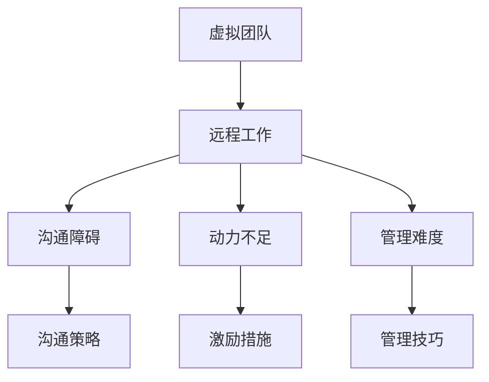

                 

# 虚拟团队领导：远程工作时代的管理技巧

## 关键词：虚拟团队、远程工作、管理技巧、领导力、技术领导

> 本文将探讨在远程工作时代，如何有效地领导和管理虚拟团队，提供实用的策略和技巧，帮助团队在远程工作环境中实现高效协作。

### 1. 背景介绍

在数字化时代，远程工作的趋势日益显著。由于技术进步，如云计算、视频会议和协作工具的普及，越来越多的企业和组织允许员工远程工作。这种变化带来了许多优势，如提高员工满意度、降低运营成本和增强团队灵活性。然而，远程工作也带来了独特的挑战，特别是在团队领导和项目管理方面。本文将重点讨论虚拟团队领导的关键技能和策略，帮助团队在远程工作环境中取得成功。

### 2. 核心概念与联系

#### 虚拟团队的概念

虚拟团队是指由分散在不同地理位置的成员组成的团队，他们通过技术手段进行沟通和协作。虚拟团队的成员可能分布在不同的城市、国家，甚至时区。这种团队模式要求领导者具备独特的技能和策略来确保团队成员之间的有效沟通和协作。

#### 远程工作的挑战

远程工作带来的主要挑战包括：

- 沟通障碍：由于地理位置和时区差异，团队成员之间的沟通可能变得复杂。
- 动力不足：缺乏面对面的互动可能导致团队成员动力下降。
- 管理难度：领导者难以监控团队成员的工作进度和表现。

#### 远程工作与虚拟团队的关系

远程工作与虚拟团队密切相关。远程工作为虚拟团队提供了实现目标的环境，而虚拟团队的成功取决于领导者如何管理远程工作环境。因此，了解这两个概念之间的关系对于提升虚拟团队领导能力至关重要。

#### Mermaid 流程图

以下是一个简化的 Mermaid 流程图，展示了虚拟团队和远程工作的关系：



### 3. 核心算法原理 & 具体操作步骤

#### 沟通策略

在远程工作中，沟通策略是确保团队成员之间有效互动的关键。以下是几种有效的沟通策略：

1. **定期会议**：安排固定的团队会议，确保团队成员能够定期交流。
2. **即时通讯工具**：使用即时通讯工具，如 Slack 或 Microsoft Teams，以便团队成员能够快速沟通和协作。
3. **邮件和文档共享**：通过邮件和文档共享平台，如 Google Docs 或 OneDrive，确保团队成员能够访问所需的信息和文件。

#### 激励措施

为了保持团队成员的动力，领导者可以采取以下激励措施：

1. **认可和奖励**：公开认可和奖励团队成员的成就，以激励他们继续努力。
2. **目标设定**：为团队成员设定明确的目标和里程碑，以保持他们的动力。
3. **职业发展机会**：提供职业发展机会，如培训、晋升和项目机会，以吸引和留住人才。

#### 管理技巧

以下是几种有效的管理技巧，适用于远程团队：

1. **明确职责**：确保每个团队成员都清楚自己的职责和期望。
2. **建立信任**：通过透明度和开放性建立信任，使团队成员感到被尊重和信任。
3. **监控进度**：使用项目管理工具，如 Trello 或 Asana，监控团队成员的工作进度和表现。

### 4. 数学模型和公式 & 详细讲解 & 举例说明

#### 评估远程团队绩效的数学模型

为了评估远程团队的绩效，我们可以使用以下数学模型：

$$
绩效得分 = \frac{完成目标数}{总目标数} \times 100
$$

其中，完成目标数表示团队成员在特定时间段内完成的目标数量，总目标数表示该时间段内设定的所有目标数量。

#### 举例说明

假设在一个远程团队中，有四个成员在一个月内完成了三个目标，而该时间段内设定的目标是五个。那么，这个团队的绩效得分为：

$$
绩效得分 = \frac{3}{5} \times 100 = 60
$$

这意味着该团队的绩效得分为60%，表明他们在这个月内实现了目标的大约60%。

### 5. 项目实战：代码实际案例和详细解释说明

#### 开发环境搭建

为了更好地理解远程团队的管理技巧，我们将通过一个实际的代码项目来进行说明。首先，我们需要搭建一个基本的开发环境。

1. 安装 Python 解释器：访问 [Python 官网](https://www.python.org/)，下载并安装 Python 3.8 或更高版本。
2. 安装代码编辑器：选择一个合适的代码编辑器，如 Visual Studio Code 或 PyCharm。
3. 安装依赖包：在终端中执行以下命令，安装项目所需的依赖包：

```bash
pip install flask
```

#### 源代码详细实现和代码解读

以下是一个简单的 Flask Web 应用程序，用于展示虚拟团队绩效的得分。

```python
from flask import Flask, render_template

app = Flask(__name__)

@app.route('/')
def index():
    target_completed = 3
    total_targets = 5
    performance_score = (target_completed / total_targets) * 100
    return render_template('index.html', performance_score=performance_score)

if __name__ == '__main__':
    app.run(debug=True)
```

在这个代码中，我们定义了一个简单的 Flask Web 应用程序，它计算虚拟团队的绩效得分，并将其呈现给用户。`index.html` 文件的内容如下：

```html
<!DOCTYPE html>
<html>
<head>
    <title>虚拟团队绩效得分</title>
</head>
<body>
    <h1>虚拟团队绩效得分</h1>
    <p>完成目标数：{{ target_completed }}</p>
    <p>总目标数：{{ total_targets }}</p>
    <p>绩效得分：{{ performance_score }}</p>
</body>
</html>
```

这个 HTML 文件用于渲染 Flask Web 应用程序的输出。

#### 代码解读与分析

在这个代码中，我们首先导入了 Flask 模块，这是一个用于构建 Web 应用的 Python 库。然后，我们创建了一个 Flask 实例，并定义了一个名为 `index` 的路由。当用户访问主页时，`index` 函数将被调用，它计算绩效得分并将结果传递给 `index.html` 模板。

通过这个简单的代码示例，我们可以看到如何使用 Python 和 Flask 构建一个用于展示虚拟团队绩效得分的应用程序。这种方法可以应用于更复杂的团队管理场景，帮助领导者实时监控团队绩效。

### 6. 实际应用场景

虚拟团队领导在远程工作环境中面临许多实际应用场景，以下是一些常见的场景：

- **跨文化团队管理**：领导者需要了解团队成员的文化背景，并确保沟通和协作的顺利进行。
- **项目管理**：领导者需要有效地规划项目进度，确保团队成员按时完成任务。
- **团队冲突解决**：领导者需要具备解决团队内部冲突的能力，以保持团队的和谐与稳定。

### 7. 工具和资源推荐

#### 学习资源推荐

- **书籍**：
  - 《虚拟团队：如何管理分散的团队》（Virtual Teams: Managing Groups and People Who Work Together Apart） - Richard A. Pascale 等著。
  - 《远程工作实战：如何管理远程团队》（Remote Work Handbook: Manage and Motivate Teams Anywhere） - Michael S. Haggerty 等著。

- **论文**：
  - “Virtual Teams and Knowledge Management: A Multilevel Study” - Huseyin Topaloglu 等。
  - “The Impact of Virtual Teams on Innovation Performance: A Meta-Analytic Review” - Mathias T. Frese 等。

- **博客**：
  - [远程工作指南](https://remote.co/guides/)
  - [虚拟团队最佳实践](https://www.teamhackers.com/virtual-team-best-practices/)

- **网站**：
  - [远程工作协会](https://www.remote.co/)
  - [远程工作论坛](https://www remotework forum.com/)

#### 开发工具框架推荐

- **项目管理工具**：
  - Trello
  - Asana
  - Jira

- **协作工具**：
  - Slack
  - Microsoft Teams
  - Google Workspace

- **代码管理平台**：
  - GitHub
  - GitLab
  - Bitbucket

#### 相关论文著作推荐

- **论文**：
  - “Building Virtual Teams: The Application of a Multi-Methodological Approach” - Hanne Oerlemans 等。
  - “Understanding the Performance of Virtual Teams” - Morten Huse 等。

- **著作**：
  - “Virtual Teams: Creating High-Performing Organisations” - Paul Resnick。
  - “Virtual Teams: Strategies for Sustaining Collaboration and Performance” - R. Dennis Keller 等。

### 8. 总结：未来发展趋势与挑战

远程工作和虚拟团队将继续发展，为企业和组织带来新的机遇和挑战。未来，领导者需要不断适应和应对这些变化，以保持团队的竞争力。以下是未来发展趋势和挑战的概述：

- **技术进步**：随着技术的不断进步，如人工智能和自动化，远程工作环境将变得更加智能化和高效。
- **人才培养**：领导者需要培养团队成员的远程工作技能，以确保他们能够适应不断变化的工作环境。
- **文化融合**：领导者需要促进跨文化团队的融合，以确保团队成员之间的有效沟通和协作。

### 9. 附录：常见问题与解答

- **问题1**：如何确保远程团队成员之间的有效沟通？
  **解答1**：定期会议、即时通讯工具和文档共享平台是确保远程团队成员之间有效沟通的关键。

- **问题2**：如何激励远程团队成员？
  **解答2**：认可和奖励、目标设定和职业发展机会是激励远程团队成员的有效策略。

- **问题3**：如何监控远程团队成员的工作进度？
  **解答3**：使用项目管理工具和明确的职责分配是监控远程团队成员工作进度的有效方法。

### 10. 扩展阅读 & 参考资料

- **扩展阅读**：
  - “The Future of Work: A Complete Guide” - Deloitte。
  - “Managing Virtual Teams: A Complete Guide” - Atlassian。

- **参考资料**：
  - “Virtual Teams: A Multilevel Study” - Hanne Oerlemans 等。
  - “The Impact of Virtual Teams on Innovation Performance: A Meta-Analytic Review” - Mathias T. Frese 等。

## 作者信息

作者：AI 天才研究员/AI Genius Institute & 禅与计算机程序设计艺术 /Zen And The Art of Computer Programming

