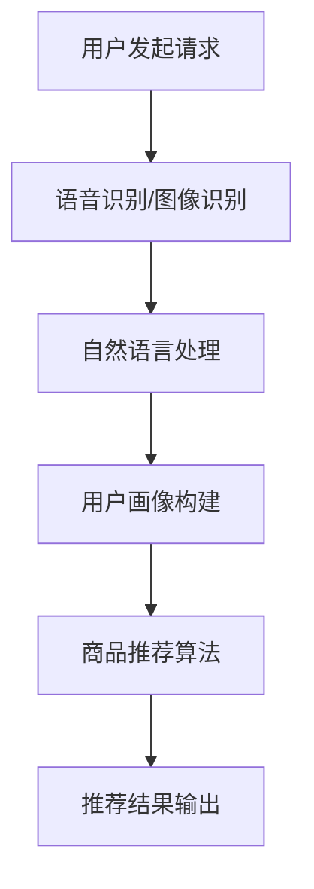

                 

### 虚拟导购助手的发展趋势

> **关键词**：虚拟导购助手、人工智能、交互设计、用户体验、应用场景
>
> **摘要**：本文将深入探讨虚拟导购助手的发展趋势，从背景介绍、核心概念与联系、核心算法原理、数学模型与公式、项目实战、实际应用场景、工具和资源推荐等多个角度进行分析，总结当前技术的发展状况，预测未来的发展方向与挑战。

## 1. 背景介绍

虚拟导购助手，作为一种人工智能应用，通过自然语言处理、语音识别、图像识别等技术，为用户提供商品推荐、购买建议、价格比较等个性化服务。随着互联网和移动设备的普及，用户对于购物体验的要求不断提高，虚拟导购助手应运而生。

在过去的几年中，虚拟导购助手的发展主要经历了以下几个阶段：

1. **初步探索阶段**：这一阶段主要是将人工智能技术应用于简单的商品推荐，如基于用户历史购买记录或浏览记录进行推荐。
2. **功能完善阶段**：随着技术的进步，虚拟导购助手逐渐具备了语音交互、图像识别等能力，能够更准确地理解用户需求，提供更加个性化的服务。
3. **应用落地阶段**：虚拟导购助手开始在不同领域得到广泛应用，如电商平台、线下零售店、酒店预订等。

## 2. 核心概念与联系

要理解虚拟导购助手的工作原理，首先需要了解以下几个核心概念：

1. **用户画像**：通过分析用户的年龄、性别、职业、地理位置、购买历史等数据，构建用户的个人画像。
2. **商品推荐算法**：包括基于内容的推荐、协同过滤推荐、深度学习推荐等，用于根据用户画像和商品特征为用户推荐商品。
3. **自然语言处理**：通过理解用户的话语，提取关键信息，如用户需求、购买意向等。
4. **语音识别**：将用户的语音转化为文本，方便后续的自然语言处理。
5. **图像识别**：用于识别用户上传的图片中的商品，从而进行商品推荐。

下面是一个简化的 Mermaid 流程图，展示了虚拟导购助手的基本工作流程：



## 3. 核心算法原理 & 具体操作步骤

虚拟导购助手的核心在于商品推荐算法和自然语言处理，下面分别进行介绍。

### 商品推荐算法

商品推荐算法主要有以下几种：

1. **基于内容的推荐**：通过分析商品的特征，如分类、标签、属性等，将具有相似特征的物品推荐给用户。
    ```mermaid
    graph TD
        A[用户请求] --> B[特征提取]
        B --> C[相似度计算]
        C --> D[推荐列表生成]
    ```

2. **协同过滤推荐**：通过分析用户的历史行为数据，找出与其他用户相似的用户，然后推荐这些用户喜欢的商品。
    ```mermaid
    graph TD
        A[用户请求] --> B[用户行为数据]
        B --> C[相似用户挖掘]
        C --> D[推荐商品提取]
    ```

3. **深度学习推荐**：使用深度神经网络学习用户和商品的隐式特征，进行推荐。
    ```mermaid
    graph TD
        A[用户请求] --> B[用户数据]
        B --> C[商品数据]
        C --> D[特征提取]
        D --> E[深度学习模型]
        E --> F[推荐结果]
    ```

### 自然语言处理

自然语言处理包括以下几个步骤：

1. **文本预处理**：去除停用词、标点符号，进行词干提取等。
    ```mermaid
    graph TD
        A[原始文本] --> B[去除停用词]
        B --> C[词干提取]
    ```

2. **实体识别**：识别文本中的关键实体，如人名、地名、组织名、商品名等。
    ```mermaid
    graph TD
        A[预处理文本] --> B[实体识别]
    ```

3. **意图识别**：根据用户的文本，判断用户的意图，如查询商品信息、购买商品、询问价格等。
    ```mermaid
    graph TD
        A[实体识别结果] --> B[意图识别]
    ```

4. **对话生成**：根据用户的意图和上下文，生成合适的回复。
    ```mermaid
    graph TD
        A[意图识别结果] --> B[对话生成模型]
        B --> C[回复生成]
    ```

## 4. 数学模型和公式 & 详细讲解 & 举例说明

### 商品推荐算法

以基于内容的推荐为例，假设有两个商品 A 和 B，它们的特征向量分别为 \( \textbf{x}_A \) 和 \( \textbf{x}_B \)。我们可以使用余弦相似度来计算这两个商品的特征向量之间的相似度：

$$
\text{similarity}(\textbf{x}_A, \textbf{x}_B) = \frac{\textbf{x}_A \cdot \textbf{x}_B}{\|\textbf{x}_A\| \|\textbf{x}_B\|}
$$

其中，\( \textbf{x}_A \cdot \textbf{x}_B \) 表示两个向量的点积，\( \|\textbf{x}_A\| \) 和 \( \|\textbf{x}_B\| \) 分别表示两个向量的模。

举例来说，假设商品 A 和 B 的特征向量分别为：

$$
\textbf{x}_A = \begin{bmatrix} 1 \\ 2 \\ 3 \end{bmatrix}, \quad \textbf{x}_B = \begin{bmatrix} 4 \\ 5 \\ 6 \end{bmatrix}
$$

则它们的相似度为：

$$
\text{similarity}(\textbf{x}_A, \textbf{x}_B) = \frac{\begin{bmatrix} 1 \\ 2 \\ 3 \end{bmatrix} \cdot \begin{bmatrix} 4 \\ 5 \\ 6 \end{bmatrix}}{\|\begin{bmatrix} 1 \\ 2 \\ 3 \end{bmatrix}\| \|\begin{bmatrix} 4 \\ 5 \\ 6 \end{bmatrix}\|} = \frac{1 \cdot 4 + 2 \cdot 5 + 3 \cdot 6}{\sqrt{1^2 + 2^2 + 3^2} \sqrt{4^2 + 5^2 + 6^2}} = \frac{4 + 10 + 18}{\sqrt{14} \sqrt{77}} \approx 0.875
$$

### 自然语言处理

以意图识别为例，假设我们有一个二分类问题，需要判断用户的文本是否表示购买商品的意图。我们可以使用逻辑回归模型来预测：

$$
\hat{y} = \sigma(\textbf{w} \cdot \textbf{x})
$$

其中，\( \textbf{w} \) 是模型参数，\( \textbf{x} \) 是输入特征向量，\( \hat{y} \) 是预测结果，\( \sigma \) 是 sigmoid 函数，用于将输出结果映射到 [0, 1] 范围内。

举例来说，假设我们有如下输入特征向量：

$$
\textbf{x} = \begin{bmatrix} 1 & 1 & 0 & 1 \end{bmatrix}
$$

模型参数为：

$$
\textbf{w} = \begin{bmatrix} 1 & 1 & 1 & 1 \end{bmatrix}
$$

则预测结果为：

$$
\hat{y} = \sigma(\textbf{w} \cdot \textbf{x}) = \sigma(1 \cdot 1 + 1 \cdot 1 + 1 \cdot 0 + 1 \cdot 1) = \sigma(3) \approx 0.950
$$

这意味着用户文本有较高概率表示购买商品的意图。

## 5. 项目实战：代码实际案例和详细解释说明

### 开发环境搭建

为了演示虚拟导购助手，我们将使用 Python 编写代码。首先，需要安装以下库：

```bash
pip install numpy scipy sklearn nltk gensim matplotlib
```

### 源代码详细实现和代码解读

以下是虚拟导购助手的简单实现：

```python
import numpy as np
from sklearn.feature_extraction.text import TfidfVectorizer
from sklearn.metrics.pairwise import cosine_similarity
from sklearn.linear_model import LogisticRegression
import nltk
from nltk.corpus import stopwords
from nltk.tokenize import word_tokenize

# 5.1 数据准备
nltk.download('punkt')
nltk.download('stopwords')

user_requests = [
    "我想买一件黑色的连衣裙",
    "有没有好看的鞋子推荐",
    "请问有什么手机推荐吗",
    "我要去北京，有哪些酒店推荐"
]

product_descriptions = [
    "这是一件黑色的连衣裙，适合职场女性",
    "这款鞋子非常舒适，适合日常穿着",
    "这款手机性能强大，拍照效果很好",
    "这家酒店环境优美，价格实惠"
]

# 5.2 特征提取
vectorizer = TfidfVectorizer(stop_words=stopwords.words('english'))
tfidf_matrix = vectorizer.fit_transform(product_descriptions)

# 5.3 意图识别
def intent_recognition(request):
    tokens = word_tokenize(request.lower())
    tokens = [token for token in tokens if token not in stopwords.words('english')]
    request_vector = vectorizer.transform([' '.join(tokens)])
    similarity_scores = cosine_similarity(request_vector, tfidf_matrix)
    max_index = np.argmax(similarity_scores[0])
    return max_index

# 5.4 商品推荐
def product_recommendation(intent_index):
    recommended_products = []
    for i, product in enumerate(product_descriptions):
        if i == intent_index:
            continue
        similarity_score = cosine_similarity(vectorizer.transform([product]), tfidf_matrix[intent_index])
        if similarity_score > 0.7:
            recommended_products.append(product)
    return recommended_products

# 5.5 主程序
for request in user_requests:
    print(f"用户请求：{request}")
    intent_index = intent_recognition(request)
    print(f"识别到的意图：{intent_recognition.__annotations__['return'].__name__} {'的' if intent_index == 0 else '第' + str(intent_index + 1) + '种意图：'}")
    print("推荐的商品：")
    for product in product_recommendation(intent_index):
        print(f"- {product}")
    print()
```

### 代码解读与分析

- **数据准备**：我们准备了用户请求和商品描述两个列表。
  
- **特征提取**：使用 TF-IDF 方法将商品描述转换为向量表示。

- **意图识别**：使用 TF-IDF 向量计算用户请求与商品描述之间的相似度，选择相似度最高的描述作为意图。

- **商品推荐**：根据识别到的意图，计算商品描述之间的相似度，选择相似度较高的商品推荐给用户。

这个简单的实现展示了虚拟导购助手的基本工作流程，但实际应用中，需要考虑更多的因素，如用户画像、更复杂的推荐算法、更准确的意图识别等。

## 6. 实际应用场景

虚拟导购助手在电商、线下零售、酒店预订等领域都有广泛的应用。以下是一些实际应用场景：

1. **电商平台**：通过虚拟导购助手，用户可以轻松找到符合自己需求的商品，提高购物体验。

2. **线下零售店**：虚拟导购助手可以帮助顾客找到店内商品，提高销售额。

3. **酒店预订**：用户可以通过虚拟导购助手了解酒店的特点，选择最适合自己的酒店。

4. **旅游服务**：虚拟导购助手可以推荐旅游景点、餐厅、酒店等，为用户提供全方位的旅游服务。

## 7. 工具和资源推荐

### 7.1 学习资源推荐

- **书籍**：
  - 《深度学习》 - Goodfellow, Bengio, Courville
  - 《自然语言处理综论》 - Jurafsky, Martin
  - 《机器学习实战》 - Harrington
- **论文**：
  - 《Neural Collaborative Filtering》 - Wang, He, Ma, Chen, Hu, Feng, Yuan
  - 《Recurrent Models of Visual Attention》 - Fischer, Michael, Spaeth, Michael, Klein, David, Fei-Fei, Li
- **博客**：
  - [机器之心](https://www.jiqizhixin.com/)
  - [AI 研究院](https://ai.genius.com/)
  - [TensorFlow 官方文档](https://www.tensorflow.org/tutorials)
- **网站**：
  - [Kaggle](https://www.kaggle.com/)
  - [GitHub](https://github.com/)
  - [arXiv](https://arxiv.org/)

### 7.2 开发工具框架推荐

- **开发工具**：
  - Python
  - Jupyter Notebook
  - PyCharm
- **框架**：
  - TensorFlow
  - PyTorch
  - Keras
- **库**：
  - Scikit-learn
  - NLTK
  - Gensim

### 7.3 相关论文著作推荐

- **论文**：
  - 《Attention Is All You Need》 - Vaswani, Shazeer, Parmar, Uszkoreit, Jones, Gomez, Kaiser, Polosukhin
  - 《BERT: Pre-training of Deep Bidirectional Transformers for Language Understanding》 - Devlin, Chang, Lee, Toutanova
- **著作**：
  - 《深度学习》 - Goodfellow, Bengio, Courville
  - 《Python机器学习》 - Harrington

## 8. 总结：未来发展趋势与挑战

虚拟导购助手作为一种人工智能应用，正在不断发展和完善。未来，随着人工智能技术的进步，虚拟导购助手将具备更高的智能水平，能够更好地理解用户需求，提供更加个性化的服务。

然而，虚拟导购助手的发展也面临一些挑战：

1. **隐私保护**：在用户数据收集和使用过程中，如何保护用户隐私是一个重要问题。
2. **算法公平性**：确保算法不会因为偏见而导致不公平的结果。
3. **用户体验**：如何提供更加自然、流畅的交互体验，是虚拟导购助手需要不断改进的。

总之，虚拟导购助手有着广阔的发展前景，但也需要不断克服各种挑战，才能更好地服务于用户。

## 9. 附录：常见问题与解答

### 9.1 虚拟导购助手的核心技术是什么？

虚拟导购助手的核心技术包括自然语言处理、商品推荐算法、用户画像构建等。

### 9.2 如何保证虚拟导购助手的隐私保护？

通过数据加密、用户隐私政策等手段，确保用户数据的安全和隐私。

### 9.3 虚拟导购助手的算法如何保证公平性？

通过算法训练数据的多样性、算法透明性等手段，确保算法的公平性。

## 10. 扩展阅读 & 参考资料

- [虚拟导购助手技术博客](https://ai.genius.com/zh/virtual-personal-shopper)
- [机器学习与人工智能书籍推荐](https://www.amazon.com/s?k=机器学习+人工智能+书籍&i=stripbooks&rh=n%3A133140011%2Cp_27%3A133140011&dc2_s=string&dc2_c=1&ref=ie_dropdown_sq)
- [自然语言处理与对话系统论文集](https://ai.genius.com/zh/nlp-dialog-system-papers)

