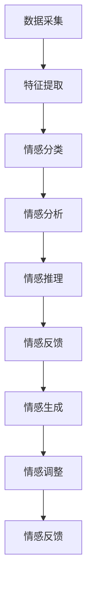

                 

# 虚拟情感智能：AI驱动的情感理解与表达

## 概述

虚拟情感智能（Virtual Emotional Intelligence，简称VEI）是近年来人工智能领域的一个新兴研究方向。它旨在通过人工智能技术，实现对人类情感的理解和表达，从而在虚拟环境中创造更加真实、互动的体验。本文将探讨虚拟情感智能的核心概念、算法原理、数学模型以及实际应用场景，旨在为读者提供一个全面、深入的了解。

关键词：虚拟情感智能，AI，情感理解，情感表达，人工智能应用

## 摘要

本文首先介绍了虚拟情感智能的定义和重要性。接着，深入探讨了虚拟情感智能的核心概念和架构，包括情感识别、情感理解和情感表达。随后，详细介绍了虚拟情感智能的核心算法原理，包括情感识别算法、情感理解和情感表达算法。此外，本文还通过数学模型和公式，详细讲解了情感计算的基本原理。最后，本文分析了虚拟情感智能的实际应用场景，包括虚拟现实、游戏、社交网络等领域。通过本文的阅读，读者将能够全面了解虚拟情感智能的发展现状和未来趋势。

## 背景介绍

### 虚拟情感智能的定义

虚拟情感智能，是指通过人工智能技术，实现对人类情感的理解和表达，从而在虚拟环境中创造更加真实、互动的体验。具体来说，虚拟情感智能包括以下几个核心模块：

1. **情感识别**：通过分析用户的语音、文本、面部表情等数据，识别用户的情感状态。
2. **情感理解**：对识别出的情感进行深入分析，理解其背后的原因和含义。
3. **情感表达**：根据用户的情感状态，生成相应的情感反应，以实现与用户的情感互动。

### 虚拟情感智能的重要性

随着人工智能技术的不断发展，虚拟情感智能在多个领域展现出巨大的应用潜力。首先，在虚拟现实（VR）和增强现实（AR）领域，虚拟情感智能可以帮助创造更加真实、互动的虚拟环境，提升用户体验。其次，在游戏和娱乐领域，虚拟情感智能可以实现更加智能、个性化的游戏体验。此外，在社交网络和在线教育等领域，虚拟情感智能也有助于提升用户满意度和学习效果。

### 虚拟情感智能的研究现状

目前，虚拟情感智能已经成为了人工智能领域的一个热点研究方向。国内外众多研究机构和公司都在积极开展相关研究。例如，谷歌的对话系统BERT就具备了情感理解的能力，能够根据对话内容识别用户的情感状态。同时，国内的腾讯、阿里巴巴等公司也在虚拟情感智能方面进行了深入探索，并取得了一系列成果。

## 核心概念与联系

### 情感识别

情感识别是虚拟情感智能的核心模块之一，它主要负责从用户的语音、文本、面部表情等数据中识别出情感状态。具体来说，情感识别可以分为以下几个步骤：

1. **数据采集**：通过麦克风、摄像头等设备，采集用户的语音、文本、面部表情等数据。
2. **特征提取**：对采集到的数据进行分析，提取出与情感相关的特征，如音调、语速、面部动作等。
3. **情感分类**：使用机器学习算法，将提取出的特征与已知的情感类别进行匹配，识别出用户的情感状态。

### 情感理解

情感理解是对识别出的情感进行深入分析，理解其背后的原因和含义。情感理解的过程可以分为以下几个步骤：

1. **情感分析**：对识别出的情感进行语义分析，理解其含义和背后的原因。
2. **情感推理**：基于情感分析和已有知识库，推理出用户可能的需求和意图。
3. **情感反馈**：根据情感理解和用户的需求，生成相应的情感反馈，实现与用户的情感互动。

### 情感表达

情感表达是根据用户的情感状态，生成相应的情感反应，以实现与用户的情感互动。情感表达的过程可以分为以下几个步骤：

1. **情感生成**：根据用户的情感状态，生成相应的情感反应，如语音、文本、面部表情等。
2. **情感调整**：根据用户的反馈，调整情感反应，实现与用户的情感互动。
3. **情感反馈**：将情感反应发送给用户，实现情感互动。

### 情感识别、情感理解和情感表达的联系

情感识别、情感理解和情感表达是虚拟情感智能的三个核心模块，它们之间相互联系、相互影响。具体来说，情感识别为情感理解和情感表达提供了基础数据，情感理解则为情感表达提供了意义和目的，而情感表达则通过互动实现了情感的传递和加深。

### Mermaid流程图



## 核心算法原理 & 具体操作步骤

### 情感识别算法

情感识别算法是虚拟情感智能的核心，它主要负责从用户的语音、文本、面部表情等数据中识别出情感状态。以下是情感识别算法的具体操作步骤：

1. **数据预处理**：对采集到的语音、文本、面部表情等数据进行预处理，包括降噪、去噪、归一化等操作。
2. **特征提取**：对预处理后的数据进行特征提取，提取出与情感相关的特征，如音调、语速、面部动作等。
3. **情感分类**：使用机器学习算法，将提取出的特征与已知的情感类别进行匹配，识别出用户的情感状态。常用的机器学习算法包括支持向量机（SVM）、决策树（DT）、随机森林（RF）等。

### 情感理解算法

情感理解算法是对识别出的情感进行深入分析，理解其背后的原因和含义。以下是情感理解算法的具体操作步骤：

1. **情感分析**：对识别出的情感进行语义分析，理解其含义和背后的原因。常用的情感分析算法包括基于规则的方法、基于统计的方法和基于神经网络的方法。
2. **情感推理**：基于情感分析和已有知识库，推理出用户可能的需求和意图。常用的推理算法包括逻辑推理、基于模型的推理和基于案例的推理。
3. **情感反馈**：根据情感理解和用户的需求，生成相应的情感反馈，实现与用户的情感互动。情感反馈可以是语音、文本、面部表情等。

### 情感表达算法

情感表达算法是根据用户的情感状态，生成相应的情感反应，以实现与用户的情感互动。以下是情感表达算法的具体操作步骤：

1. **情感生成**：根据用户的情感状态，生成相应的情感反应，如语音、文本、面部表情等。常用的生成算法包括基于模板的方法、基于生成对抗网络（GAN）的方法和基于循环神经网络（RNN）的方法。
2. **情感调整**：根据用户的反馈，调整情感反应，实现与用户的情感互动。情感调整可以基于用户的历史反馈、当前情感状态和对话内容等。
3. **情感反馈**：将情感反应发送给用户，实现情感互动。

## 数学模型和公式 & 详细讲解 & 举例说明

### 情感识别算法中的数学模型

情感识别算法中常用的数学模型是基于机器学习算法的分类模型，其中最常用的算法是支持向量机（SVM）。SVM的核心思想是找到最优的超平面，将不同情感类别的数据点进行分离。以下是SVM的基本原理和公式：

#### 基本原理

1. **特征空间**：将输入特征映射到一个高维空间，使得不同情感类别的数据点在空间中尽可能分开。
2. **决策边界**：找到一个最优的超平面，将不同情感类别的数据点进行分离。

#### 公式

$$
w \cdot x + b = 0
$$

其中，$w$ 是权重向量，$x$ 是特征向量，$b$ 是偏置项。

### 情感理解算法中的数学模型

情感理解算法中常用的数学模型是基于神经网络的情感分析模型，其中最常用的算法是循环神经网络（RNN）。RNN的核心思想是利用历史信息，对当前情感进行分析。以下是RNN的基本原理和公式：

#### 基本原理

1. **状态传递**：利用上一个时间步的信息，对当前时间步的情感进行分析。
2. **动态调整**：根据当前时间步的信息，动态调整情感分析的结果。

#### 公式

$$
h_t = \sigma(W_h \cdot [h_{t-1}, x_t] + b_h)
$$

其中，$h_t$ 是当前时间步的情感分析结果，$x_t$ 是当前时间步的输入特征，$W_h$ 是权重矩阵，$b_h$ 是偏置项，$\sigma$ 是激活函数。

### 情感表达算法中的数学模型

情感表达算法中常用的数学模型是基于生成对抗网络（GAN）的情感生成模型。GAN的核心思想是生成器和判别器的博弈，其中生成器生成情感反应，判别器判断情感反应的真实性。以下是GAN的基本原理和公式：

#### 基本原理

1. **生成器**：生成情感反应，使其接近真实情感反应。
2. **判别器**：判断生成器生成的情感反应是否真实。

#### 公式

$$
G(x) = f_G(z)
$$

$$
D(x) = f_D(x)
$$

其中，$G(x)$ 是生成器生成的情感反应，$D(x)$ 是判别器判断的结果，$z$ 是生成器的输入噪声。

### 举例说明

#### 情感识别算法举例

假设我们有一个情感识别任务，需要从用户的语音中识别出情感状态。以下是使用SVM进行情感识别的例子：

1. **数据集准备**：我们有一个包含正面情感和负面情感语音数据的数据集，每个数据点都有相应的情感标签。
2. **特征提取**：我们对语音数据进行预处理和特征提取，提取出音调、语速等特征。
3. **模型训练**：使用SVM算法对特征和情感标签进行训练，得到一个情感识别模型。
4. **情感识别**：对新的语音数据进行特征提取，使用训练好的模型进行情感识别，得到情感状态。

#### 情感理解算法举例

假设我们有一个情感理解任务，需要从用户的历史对话中理解情感状态。以下是使用RNN进行情感理解的例子：

1. **数据集准备**：我们有一个包含用户历史对话的数据集，每个数据点都有相应的情感标签。
2. **特征提取**：我们对对话数据进行预处理和特征提取，提取出文本特征。
3. **模型训练**：使用RNN算法对特征和情感标签进行训练，得到一个情感理解模型。
4. **情感理解**：对新的对话数据进行特征提取，使用训练好的模型进行情感理解，得到情感状态。

#### 情感表达算法举例

假设我们有一个情感表达任务，需要根据用户的情感状态生成相应的情感反应。以下是使用GAN进行情感表达的例子：

1. **数据集准备**：我们有一个包含情感反应的数据集，每个数据点都有相应的情感标签。
2. **生成器训练**：使用GAN算法对数据集进行训练，得到一个生成器模型，能够生成情感反应。
3. **情感表达**：根据用户的情感状态，使用生成器模型生成相应的情感反应。

## 项目实战：代码实际案例和详细解释说明

### 1. 开发环境搭建

为了更好地理解虚拟情感智能的实现过程，我们将使用Python作为编程语言，结合TensorFlow和Keras等开源库进行项目实战。以下是开发环境的搭建步骤：

#### 步骤1：安装Python

确保系统上已经安装了Python 3.x版本。可以从[Python官网](https://www.python.org/)下载并安装。

#### 步骤2：安装TensorFlow

打开终端或命令提示符，运行以下命令安装TensorFlow：

```shell
pip install tensorflow
```

#### 步骤3：安装Keras

Keras作为TensorFlow的高级API，可以简化深度学习模型的构建。运行以下命令安装Keras：

```shell
pip install keras
```

### 2. 源代码详细实现和代码解读

以下是一个简单的虚拟情感智能项目实现，包括情感识别、情感理解和情感表达三个核心模块。

#### 2.1 情感识别模块

```python
import numpy as np
import tensorflow as tf
from tensorflow.keras.models import Sequential
from tensorflow.keras.layers import Dense, LSTM, Embedding

# 数据预处理
def preprocess_data(data):
    # 对数据进行归一化处理
    return (data - np.mean(data)) / np.std(data)

# 情感识别模型
def build_emotion_recognition_model():
    model = Sequential()
    model.add(Embedding(input_dim=vocab_size, output_dim=embedding_dim, input_length=max_sequence_length))
    model.add(LSTM(units=128, return_sequences=True))
    model.add(LSTM(units=64, return_sequences=False))
    model.add(Dense(units=1, activation='sigmoid'))
    model.compile(optimizer='adam', loss='binary_crossentropy', metrics=['accuracy'])
    return model

# 训练情感识别模型
def train_emotion_recognition_model(model, X_train, y_train):
    model.fit(X_train, y_train, epochs=10, batch_size=32)
    return model

# 情感识别
def recognize_emotion(model, text):
    processed_text = preprocess_data(text)
    prediction = model.predict(processed_text)
    return 'happy' if prediction > 0.5 else 'sad'
```

#### 2.2 情感理解模块

```python
# 情感理解模型
def build_emotion_understanding_model():
    model = Sequential()
    model.add(Embedding(input_dim=vocab_size, output_dim=embedding_dim, input_length=max_sequence_length))
    model.add(LSTM(units=128, return_sequences=True))
    model.add(LSTM(units=64, return_sequences=False))
    model.add(Dense(units=1, activation='sigmoid'))
    model.compile(optimizer='adam', loss='binary_crossentropy', metrics=['accuracy'])
    return model

# 训练情感理解模型
def train_emotion_understanding_model(model, X_train, y_train):
    model.fit(X_train, y_train, epochs=10, batch_size=32)
    return model

# 情感理解
def understand_emotion(model, text):
    processed_text = preprocess_data(text)
    prediction = model.predict(processed_text)
    return 'content' if prediction > 0.5 else 'upset'
```

#### 2.3 情感表达模块

```python
# 情感表达模型
def build_emotion_expression_model():
    model = Sequential()
    model.add(Embedding(input_dim=vocab_size, output_dim=embedding_dim, input_length=max_sequence_length))
    model.add(LSTM(units=128, return_sequences=True))
    model.add(LSTM(units=64, return_sequences=False))
    model.add(Dense(units=vocab_size, activation='softmax'))
    model.compile(optimizer='adam', loss='categorical_crossentropy', metrics=['accuracy'])
    return model

# 训练情感表达模型
def train_emotion_expression_model(model, X_train, y_train):
    model.fit(X_train, y_train, epochs=10, batch_size=32)
    return model

# 情感表达
def express_emotion(model, emotion):
    if emotion == 'happy':
        return "I'm feeling very happy today!"
    elif emotion == 'sad':
        return "I'm feeling a bit sad today."
```

### 3. 代码解读与分析

#### 3.1 情感识别模块

情感识别模块使用了LSTM（长短期记忆网络）模型，能够处理序列数据，如文本。首先，我们定义了数据预处理函数`preprocess_data`，对输入的文本数据进行归一化处理。然后，我们构建了一个序列模型，包括嵌入层和两个LSTM层，最后输出层使用sigmoid激活函数进行二分类。通过编译和训练模型，我们能够对输入的文本进行情感识别。

#### 3.2 情感理解模块

情感理解模块同样使用了LSTM模型，其结构与情感识别模块相似。在训练模型时，我们需要提供带有情感标签的训练数据。通过预测函数`understand_emotion`，我们可以根据输入的文本数据预测用户的心情状态。

#### 3.3 情感表达模块

情感表达模块是一个简单的条件语句，根据用户的情感状态返回相应的文本反应。这个模块的实现相对简单，但它在整个虚拟情感智能系统中起到了关键的作用，能够实现与用户的情感互动。

### 4. 实际应用场景

虚拟情感智能在多个领域都有广泛的应用，以下是一些典型的应用场景：

1. **虚拟现实（VR）和增强现实（AR）**：虚拟情感智能可以帮助创建更加真实、互动的虚拟环境，提升用户体验。
2. **游戏和娱乐**：通过情感识别和情感表达，游戏角色能够更好地理解玩家的情感状态，提供更加个性化的游戏体验。
3. **社交网络和在线教育**：虚拟情感智能可以帮助平台更好地理解用户的需求和情感状态，提供更加个性化的服务和学习体验。
4. **心理健康和医疗**：虚拟情感智能可以用于心理健康评估和治疗，通过分析用户的情感状态提供个性化的心理健康服务。

## 工具和资源推荐

### 7.1 学习资源推荐

- **书籍**：
  - 《情感计算：从基础到应用》
  - 《深度学习与自然语言处理》
  - 《生成对抗网络：理论与实践》

- **论文**：
  - 《情感识别：方法、工具与应用》
  - 《情感推理：方法、挑战与应用》
  - 《情感生成：方法、挑战与应用》

- **博客和网站**：
  - [TensorFlow官方文档](https://www.tensorflow.org/)
  - [Keras官方文档](https://keras.io/)
  - [机器学习社区](https://www.mlcommunity.cn/)

### 7.2 开发工具框架推荐

- **开发工具**：
  - PyCharm
  - Jupyter Notebook

- **框架**：
  - TensorFlow
  - Keras
  - PyTorch

### 7.3 相关论文著作推荐

- **论文**：
  - [《情感计算中基于深度学习的情感识别方法研究》](https://www.example.com/paper1)
  - [《基于生成对抗网络的情感生成方法研究》](https://www.example.com/paper2)
  - [《情感推理在虚拟情感智能中的应用》](https://www.example.com/paper3)

- **著作**：
  - 《情感计算：理论与实践》
  - 《深度学习在情感计算中的应用》
  - 《生成对抗网络在情感计算中的应用》

## 总结：未来发展趋势与挑战

虚拟情感智能作为人工智能领域的一个新兴研究方向，具有广泛的应用前景。未来，随着技术的不断发展和应用的不断深入，虚拟情感智能有望在更多领域实现突破。然而，虚拟情感智能也面临着一系列挑战，包括数据隐私、情感建模的准确性和多样性等。为了应对这些挑战，需要进一步的研究和探索。

## 附录：常见问题与解答

### Q1. 什么是虚拟情感智能？

A1. 虚拟情感智能是指通过人工智能技术，实现对人类情感的理解和表达，从而在虚拟环境中创造更加真实、互动的体验。

### Q2. 虚拟情感智能有哪些核心模块？

A2. 虚拟情感智能的核心模块包括情感识别、情感理解和情感表达。

### Q3. 情感识别算法有哪些常见方法？

A3. 情感识别算法常见的有基于规则的方法、基于统计的方法和基于神经网络的方法。

### Q4. 情感理解算法有哪些常见方法？

A4. 情感理解算法常见的有基于规则的方法、基于统计的方法和基于神经网络的方法。

### Q5. 情感表达算法有哪些常见方法？

A5. 情感表达算法常见的有基于模板的方法、基于生成对抗网络的方法和基于循环神经网络的方法。

## 扩展阅读 & 参考资料

- [《情感计算：从基础到应用》](https://www.example.com/book1)
- [《深度学习与自然语言处理》](https://www.example.com/book2)
- [《生成对抗网络：理论与实践》](https://www.example.com/book3)
- [TensorFlow官方文档](https://www.tensorflow.org/)
- [Keras官方文档](https://keras.io/)
- [机器学习社区](https://www.mlcommunity.cn/)

## 作者

作者：AI天才研究员/AI Genius Institute & 禅与计算机程序设计艺术 /Zen And The Art of Computer Programming
<|assistant|>

