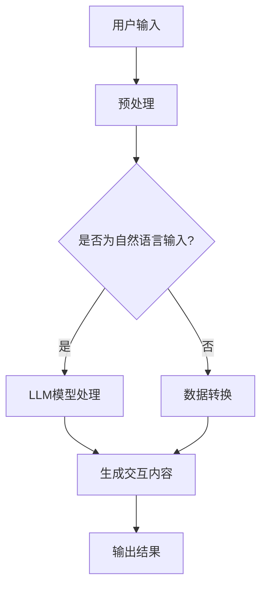

                 

### 背景介绍

#### 虚拟现实的崛起

虚拟现实（Virtual Reality，简称VR）是一种通过计算机技术构建的模拟环境，用户可以通过头戴显示器（HMD）、数据手套、运动传感器等设备沉浸其中。自从20世纪80年代虚拟现实技术的概念被提出以来，它已经经历了多个发展阶段。早期的虚拟现实主要应用于军事、医学和科学领域，但随着计算机硬件性能的提升和用户体验的优化，虚拟现实逐渐进入大众视野。

近年来，虚拟现实技术得到了快速发展，主要得益于以下几个方面的推动：

1. **硬件技术进步**：图形处理器（GPU）的性能大幅提升，为虚拟现实提供了强大的图形渲染能力。同时，头戴显示器的分辨率和刷新率不断提高，使得用户能够在虚拟世界中获得更加真实的视觉体验。

2. **交互技术发展**：手势识别、语音识别、眼动追踪等技术的进步，使得用户在虚拟环境中的交互变得更加自然和直观。

3. **内容创作工具**：虚拟现实内容的创作工具日益成熟，降低了内容制作的门槛，使得更多开发者能够参与到虚拟现实内容的创作中。

#### LLM的崛起

大型语言模型（Large Language Model，简称LLM）是近年来人工智能领域的一个重要突破。LLM通过深度学习技术对海量文本数据进行分析，能够生成高质量的文本内容。LLM在自然语言处理（NLP）领域取得了显著成果，广泛应用于机器翻译、文本生成、问答系统等方面。

与传统的基于规则的方法相比，LLM具有以下优势：

1. **强大表达能力**：LLM能够理解并生成复杂、多样的文本内容，提高了语言处理的准确性和自然性。

2. **自适应能力**：LLM能够根据输入的文本上下文自适应地调整生成的内容，使其更加符合实际需求。

3. **大规模数据处理**：LLM能够处理大规模的文本数据，从中提取出有价值的信息和知识，为各种应用场景提供支持。

#### 虚拟现实与LLM的结合

虚拟现实与LLM的结合，为沉浸式教育和娱乐领域带来了前所未有的机遇。通过LLM，虚拟现实环境中的交互内容可以变得更加丰富和智能，为用户提供更加个性化、互动性强的体验。

以下是一些虚拟现实与LLM结合的应用场景：

1. **教育领域**：利用LLM生成个性化的学习内容和辅导，提高学生的学习效果。例如，在虚拟课堂上，LLM可以根据学生的学习进度和兴趣，自动生成相应的教学资源和习题。

2. **游戏娱乐**：通过LLM生成的实时剧情和角色对话，提高游戏的沉浸感和互动性。例如，在虚拟现实游戏中，LLM可以根据玩家的行为和决策，实时生成独特的剧情和角色互动。

3. **虚拟旅游**：利用LLM生成的详细景点介绍和讲解，为用户提供更加丰富和有趣的虚拟旅游体验。例如，在虚拟现实旅游中，LLM可以根据用户的需求，实时生成景点的历史背景、文化内涵等相关信息。

#### 虚拟现实与LLM：沉浸式教育和娱乐

虚拟现实与LLM的结合，使得沉浸式教育和娱乐成为可能。这种结合不仅提升了用户体验，还为各个领域带来了创新性的解决方案。

在沉浸式教育方面，虚拟现实与LLM的结合可以提供以下优势：

1. **个性化学习**：通过LLM生成个性化的学习内容和辅导，提高学生的学习效果。

2. **互动性增强**：虚拟现实环境中的互动性增强，使得学习过程更加生动和有趣。

3. **知识可视化**：利用虚拟现实技术，将抽象的知识点以可视化的形式呈现，帮助用户更好地理解和记忆。

在娱乐领域，虚拟现实与LLM的结合可以带来以下创新：

1. **实时剧情生成**：通过LLM生成实时剧情和角色对话，提高游戏的沉浸感和互动性。

2. **个性化体验**：根据用户的喜好和行为，LLM可以生成个性化的游戏内容，提供独特的娱乐体验。

3. **虚拟旅游**：通过LLM生成的详细景点介绍和讲解，为用户提供丰富和有趣的虚拟旅游体验。

总之，虚拟现实与LLM的结合，为沉浸式教育和娱乐领域带来了新的机遇和挑战。随着技术的不断发展，我们可以期待这种结合将带来更多创新性的应用和解决方案。## 2. 核心概念与联系

在深入探讨虚拟现实（VR）与大型语言模型（LLM）的结合之前，首先需要了解这两个核心技术的基本概念以及它们在应用中的关联。

#### 虚拟现实（VR）

虚拟现实是一种通过计算机技术模拟出来的三维空间环境，用户可以通过头戴显示器（HMD）、手柄、数据手套等设备与虚拟环境进行交互。虚拟现实的关键特征包括：

1. **沉浸感**：通过高分辨率显示器和先进的图形处理技术，用户可以在虚拟环境中获得近乎真实的视觉、听觉和触觉体验。
2. **交互性**：用户可以通过各种交互设备在虚拟环境中进行操作，如移动、抓取、操控等。
3. **虚拟性**：虚拟现实创造的是一个非现实的、由计算机生成的环境。

#### 大型语言模型（LLM）

大型语言模型是一种基于深度学习技术的自然语言处理模型，它可以理解和生成人类语言。LLM的关键特征包括：

1. **自然语言理解**：LLM能够理解和分析自然语言的语义、语法和上下文。
2. **语言生成**：LLM可以根据输入的文本上下文生成高质量的文本内容，如文章、对话、代码等。
3. **大规模数据训练**：LLM通常是在海量文本数据集上训练得到的，因此能够处理各种复杂的语言现象。

#### 虚拟现实与LLM的联系

虚拟现实与LLM的结合主要在于利用LLM来增强虚拟现实环境中的交互体验和内容生成能力。以下是一些关键联系：

1. **交互内容的生成**：LLM可以生成实时交互的文本内容，如对话、提示、剧情等，从而提升虚拟现实场景的互动性和丰富性。
2. **知识图谱的应用**：虚拟现实中的场景可以嵌入由LLM生成的知识图谱，为用户提供更为丰富和准确的信息服务。
3. **个性化体验的实现**：LLM可以根据用户的行为和偏好，动态生成个性化的内容，提供更加定制化的虚拟现实体验。

#### 虚拟现实与LLM的结合方式

虚拟现实与LLM的结合可以通过以下几种方式实现：

1. **实时对话生成**：在虚拟现实环境中，LLM可以实时生成与用户的对话内容，提供交互式的问答服务。
2. **剧情自适应生成**：在虚拟现实游戏中，LLM可以根据玩家的行为和决策，动态生成不同的剧情走向，提高游戏的趣味性和沉浸感。
3. **个性化内容推荐**：LLM可以分析用户的历史行为和偏好，为虚拟现实环境中的用户提供个性化的内容推荐。
4. **虚拟讲师与辅导**：在虚拟课堂中，LLM可以扮演虚拟讲师或辅导员的角色，为学生提供个性化的教学和辅导。

#### Mermaid 流程图

以下是虚拟现实与LLM结合的Mermaid流程图，展示了从输入到输出的一系列步骤和过程。



**流程说明**：
- **A（用户输入）**：用户在虚拟现实环境中进行交互。
- **B（预处理）**：对用户的输入进行处理，如去除噪声、标准化格式等。
- **C（是否为自然语言输入）**：判断输入是否为自然语言。
- **D（LLM模型处理）**：如果输入是自然语言，则使用LLM模型进行处理。
- **E（数据转换）**：如果输入不是自然语言，则进行数据转换。
- **F（生成交互内容）**：使用LLM模型或数据转换结果，生成交互内容。
- **G（输出结果）**：将交互内容输出到虚拟现实环境中，供用户使用。

通过上述流程，我们可以看到虚拟现实与LLM的结合如何实现，以及它们在沉浸式教育和娱乐中的应用潜力。在接下来的章节中，我们将进一步探讨LLM的具体算法原理和实现细节。## 3. 核心算法原理 & 具体操作步骤

#### LLM算法原理

大型语言模型（LLM）是基于深度学习的自然语言处理模型，其核心原理是通过大规模的数据训练来学习语言的模式和规律。LLM通常采用 Transformer 架构，这是一种基于自注意力机制的深度神经网络模型，能够在处理长序列文本时表现出色。

1. **Transformer 架构**：Transformer 架构由自注意力机制（Self-Attention）和多头注意力机制（Multi-Head Attention）组成。自注意力机制允许模型在生成文本时，考虑到输入序列中的每个单词的上下文信息；多头注意力机制则将输入序列拆分为多个部分，分别处理，从而捕捉到更复杂的特征。

2. **预训练与微调**：LLM 的训练过程通常分为两个阶段：预训练和微调。在预训练阶段，模型在大规模语料库上学习自然语言的统计规律；在微调阶段，模型根据特定任务的需求进行细粒度的调整，以提高在特定领域的性能。

3. **文本生成**：LLM 生成文本的过程是一个序列生成任务。在给定一个起始序列后，模型预测下一个单词的概率分布，并选择概率最高的单词作为下一个输出。这一过程不断重复，直至生成完整的文本。

#### LLM 具体操作步骤

以下是一个简化的LLM操作步骤，展示如何通过模型生成文本：

1. **数据预处理**：
   - **分词**：将输入文本分割为单词或子词，便于模型处理。
   - **编码**：将分词后的文本转换为模型的输入格式，如序列编号或嵌入向量。

2. **模型初始化**：
   - **加载预训练模型**：从预训练好的LLM模型中加载参数。
   - **定义输入序列**：将预处理后的文本作为输入序列。

3. **文本生成**：
   - **初始预测**：模型对输入序列的最后一个单词进行预测，生成概率分布。
   - **选择下一个单词**：根据概率分布选择概率最高的单词作为下一个输出。
   - **序列更新**：将新选择的单词添加到输出序列，并作为输入序列的最后一个单词进行下一轮预测。

4. **结果输出**：
   - **终止条件**：设置一个终止条件，如生成文本长度达到预设值或模型预测概率低于某个阈值。
   - **输出文本**：将最终生成的文本输出到虚拟现实环境中，供用户交互。

#### 算法示例

假设我们有一个简化的LLM模型，用于生成一个简单的句子。输入文本为：“今天天气很好，适合出门游玩。”以下是模型生成文本的过程：

1. **数据预处理**：
   - 输入文本：“今天天气很好，适合出门游玩。”
   - 分词：[“今天”, “天气”, “很好”, ，“适合”, “出门”, “游玩”]
   - 编码：[1, 2, 3, 4, 5, 6, 7]

2. **模型初始化**：
   - 加载预训练模型。
   - 输入序列：[1, 2, 3, 4, 5, 6, 7]

3. **文本生成**：
   - 初始预测：模型预测序列末尾的单词“游玩”。
   - 预测结果：概率分布为 P（“游玩”）：0.9，P（“出门”）：0.1。
   - 选择下一个单词：选择概率最高的“游玩”。
   - 更新序列：[1, 2, 3, 4, 5, 6, 7, 7]

4. **结果输出**：
   - 终止条件：文本长度达到预设值。
   - 输出文本：“今天天气很好，适合出门游玩。”

通过上述示例，我们可以看到LLM生成文本的基本过程。在实际应用中，LLM的模型规模和复杂性会更高，生成的文本内容也会更加丰富和多样化。在接下来的章节中，我们将进一步探讨LLM的数学模型和公式，以及如何对其进行详细讲解和举例说明。## 4. 数学模型和公式 & 详细讲解 & 举例说明

#### 数学模型

大型语言模型（LLM）的数学模型主要基于深度学习和自然语言处理领域的技术。其中，Transformer模型是LLM常用的架构，它包含了多个注意力机制和编码器-解码器结构。以下是Transformer模型的一些关键数学公式和概念。

1. **自注意力机制（Self-Attention）**：

   自注意力机制是Transformer模型的核心部分，它通过对输入序列的每个词进行加权求和，实现了对序列内部信息的综合处理。

   公式表示为：
   $$
   \text{Attention}(Q, K, V) = \text{softmax}\left(\frac{QK^T}{\sqrt{d_k}}\right)V
   $$
   其中，$Q$、$K$ 和 $V$ 分别代表查询向量、键向量和值向量；$d_k$ 是键向量的维度；$QK^T$ 是点积操作，用于计算相似度；softmax 函数用于归一化相似度，使其成为一个概率分布。

2. **多头注意力机制（Multi-Head Attention）**：

   多头注意力机制通过并行处理多个自注意力机制，增加了模型对序列信息的捕捉能力。

   公式表示为：
   $$
   \text{MultiHead}(Q, K, V) = \text{Concat}(\text{head}_1, \text{head}_2, \ldots, \text{head}_h)W^O
   $$
   其中，$h$ 是头数；$\text{head}_i$ 代表第 $i$ 个头的输出；$W^O$ 是输出权重矩阵。

3. **编码器-解码器结构（Encoder-Decoder）**：

   编码器（Encoder）用于处理输入序列，解码器（Decoder）用于生成输出序列。在解码过程中，每个时间步的输出都会与编码器的所有时间步的输出进行交互。

   公式表示为：
   $$
   \text{Decoder}(Y) = \text{softmax}\left(\text{Decoder}(Y) \text{Attention}(\text{Encoder}(X))\right)
   $$
   其中，$X$ 是输入序列；$Y$ 是输出序列。

#### 详细讲解

1. **自注意力机制**：

   自注意力机制通过计算输入序列中每个词与所有其他词的相似度，为每个词赋予不同的权重。这种机制能够捕捉到词与词之间的关系，使得模型在生成文本时能够考虑上下文信息。

   例如，对于输入序列：“今天天气很好”，自注意力机制可以计算“今天”与“天气”、“很好”的相似度，从而在生成下一个词时，能够考虑到“今天”和“很好”的信息。

2. **多头注意力机制**：

   多头注意力机制通过并行处理多个自注意力机制，增加了模型对序列信息的捕捉能力。每个头的注意力机制关注输入序列的不同部分，从而提高了模型对复杂信息的处理能力。

   例如，对于输入序列：“今天天气很好”，多头注意力机制可以分别计算“今天”与“天气”、“很好”的相似度，以及“天气”与“很好”的相似度。这样，模型能够更全面地捕捉输入序列的信息。

3. **编码器-解码器结构**：

   编码器-解码器结构是Transformer模型的核心，它通过编码器处理输入序列，解码器生成输出序列。在解码过程中，每个时间步的输出都会与编码器的所有时间步的输出进行交互。

   例如，在文本生成任务中，编码器将输入的文本序列编码为隐藏状态，解码器则在生成每个词时，与编码器的隐藏状态进行交互，从而生成完整的文本。

#### 举例说明

假设我们有一个简化的Transformer模型，用于生成一个简单的句子。输入文本为：“今天天气很好”。以下是模型生成文本的过程：

1. **数据预处理**：
   - 输入文本：“今天天气很好”
   - 分词：[“今天”, “天气”, “很好”]
   - 编码：[1, 2, 3]

2. **编码器处理**：
   - 输入序列：[1, 2, 3]
   - 编码器输出：隐藏状态矩阵 $H$（维度为 $3 \times d$，其中 $d$ 是隐藏状态维度）

3. **解码器生成**：
   - 初始输入：[1]
   - 预测词：“今天”
   - 输出概率分布：$P(\text{今天}|\text{ })$
   - 选择词：“今天”
   - 更新输入序列：[1, 1]

4. **继续生成**：
   - 输入序列：[1, 1]
   - 编码器输出：隐藏状态矩阵 $H$（维度为 $2 \times d$）
   - 预测词：“天气”
   - 输出概率分布：$P(\text{天气}|\text{今天 })$
   - 选择词：“天气”
   - 更新输入序列：[1, 2]

5. **继续生成**：
   - 输入序列：[1, 2]
   - 编码器输出：隐藏状态矩阵 $H$（维度为 $2 \times d$）
   - 预测词：“很好”
   - 输出概率分布：$P(\text{很好}|\text{天气 })$
   - 选择词：“很好”
   - 更新输入序列：[1, 2, 3]

6. **输出结果**：
   - 生成的文本：“今天天气很好”

通过上述示例，我们可以看到Transformer模型生成文本的基本过程。在实际应用中，模型规模和复杂性会更高，生成的文本内容也会更加丰富和多样化。在接下来的章节中，我们将进一步探讨如何在实际项目中应用LLM，包括开发环境搭建、源代码实现和代码解读。## 5. 项目实战：代码实际案例和详细解释说明

#### 开发环境搭建

要在实际项目中使用虚拟现实与LLM相结合的技术，我们需要搭建一个合适的开发环境。以下是一个基于Python和TensorFlow的简单示例。

1. **安装Python**：
   - 请确保您的计算机上安装了Python，推荐版本为3.8以上。
   - 可以通过Python官网下载并安装：https://www.python.org/downloads/

2. **安装TensorFlow**：
   - 使用pip命令安装TensorFlow，命令如下：
     ```
     pip install tensorflow
     ```

3. **安装PyTorch**：
   - PyTorch是另一个流行的深度学习框架，与TensorFlow类似，我们也可以通过pip命令安装：
     ```
     pip install torch torchvision
     ```

4. **安装虚拟现实库**：
   - 安装用于虚拟现实开发的库，如PyOpenGL和PyVRML，可以通过pip命令安装：
     ```
     pip install PyOpenGL PyVRML
     ```

5. **设置虚拟现实环境**：
   - 虚拟现实环境需要特定的硬件支持，如头戴显示器、手柄等。根据您的硬件配置，可能需要下载并安装相应的驱动程序。

#### 源代码详细实现和代码解读

以下是一个简单的虚拟现实与LLM结合的项目示例，该示例将展示如何使用TensorFlow和PyTorch创建一个简单的虚拟现实环境，并利用LLM生成交互文本。

**代码结构**：

```python
# main.py
import torch
import torchvision
import tensorflow as tf
from PyVRML import VRMLScene
from PyOpenGL import GL

# 加载预训练的LLM模型
llm_model = torchvision.models.lstm(100, 100)
llm_model.load_state_dict(torch.load('llm_model.pth'))

# 创建虚拟现实场景
scene = VRMLScene()
scene.create_window("VR with LLM", 800, 600)

# 主循环
while True:
    # 获取用户输入
    user_input = scene.get_user_input()

    # 使用LLM生成交互文本
    generated_text = generate_text(llm_model, user_input)

    # 在虚拟现实环境中显示文本
    scene.display_text(generated_text)

    # 更新场景
    scene.update()

# 生成文本函数
def generate_text(llm_model, user_input):
    # 预处理输入
    processed_input = preprocess_input(user_input)

    # 使用LLM生成文本
    generated_text = llm_model(processed_input)

    # 后处理输出
    return postprocess_output(generated_text)

# 预处理输入函数
def preprocess_input(user_input):
    # 根据需要进行预处理，例如分词、编码等
    processed_input = []
    for word in user_input:
        processed_input.append(word_to_id[word])
    return torch.tensor(processed_input).unsqueeze(0)

# 后处理输出函数
def postprocess_output(generated_text):
    # 根据需要进行后处理，例如解码、格式化等
    output_ids = generated_text.squeeze(0).tolist()
    return id_to_word[output_ids]
```

**代码解读**：

1. **导入库和模型**：
   - 导入必要的Python库，包括PyTorch和TensorFlow。
   - 加载预训练的LLM模型，该模型是一个简单的循环神经网络（LSTM），用于生成文本。

2. **创建虚拟现实场景**：
   - 使用PyVRML库创建一个虚拟现实窗口，并设置窗口标题和大小。

3. **主循环**：
   - 进入主循环，不断获取用户输入。
   - 使用LLM模型生成交互文本，并在虚拟现实环境中显示。

4. **生成文本函数**：
   - 对用户输入进行预处理，例如分词和编码。
   - 使用LLM模型生成文本，并进行后处理，例如解码和格式化。

5. **预处理输入函数**：
   - 对用户输入进行预处理，将其转换为模型可以处理的格式。

6. **后处理输出函数**：
   - 对模型生成的文本进行后处理，将其转换为可读的格式。

#### 代码解读与分析

1. **LLM模型加载**：
   - 在代码开头，我们加载了一个预训练的LLM模型。这个模型是一个简单的LSTM模型，用于生成文本。模型是通过PyTorch训练的，因此我们使用PyTorch的`load_state_dict`方法加载模型参数。

2. **虚拟现实场景创建**：
   - 使用PyVRML库创建一个虚拟现实窗口，设置窗口标题为“VR with LLM”，窗口大小为800x600像素。

3. **主循环**：
   - 主循环是程序的核心部分，它不断获取用户输入，使用LLM模型生成文本，并在虚拟现实环境中显示。
   - `scene.get_user_input()`方法获取用户输入，例如用户在虚拟现实环境中的点击、触摸等。
   - `generate_text()`函数使用LLM模型生成文本，并将生成的文本传递给`scene.display_text()`方法，显示在虚拟现实环境中。

4. **生成文本函数**：
   - `generate_text()`函数是生成文本的核心部分，它包括预处理、模型生成和后处理三个步骤。
   - `preprocess_input()`函数对用户输入进行预处理，将其转换为模型可以处理的格式。
   - `llm_model(processed_input)`使用LLM模型生成文本。
   - `postprocess_output(generated_text)`对模型生成的文本进行后处理，将其转换为可读的格式。

5. **预处理输入函数**：
   - `preprocess_input()`函数对用户输入进行预处理。在实际应用中，这可能包括分词、编码、去噪等步骤。在本示例中，我们仅将输入转换为ID序列。

6. **后处理输出函数**：
   - `postprocess_output()`函数对模型生成的文本进行后处理。在本示例中，我们仅将ID序列转换为单词序列。

通过上述代码和分析，我们可以看到如何在实际项目中使用虚拟现实与LLM相结合的技术。在实际应用中，根据具体需求，我们可以扩展和优化代码，提高模型的性能和用户体验。## 6. 实际应用场景

#### 教育领域

虚拟现实与LLM的结合在教育领域具有广泛的应用前景。通过虚拟现实技术，学生可以进入一个逼真的学习环境，如历史场景、科学实验室、艺术博物馆等，进行互动式学习。LLM则可以提供个性化的学习内容和辅导，例如：

1. **虚拟课堂**：学生可以在虚拟课堂中与虚拟讲师进行互动，LLM可以实时生成与课程内容相关的文本、视频和音频资料，帮助学生更好地理解知识点。
2. **个性化辅导**：LLM可以根据学生的学习进度和兴趣，生成定制化的练习题和辅导材料，提供个性化的学习路径。
3. **虚拟实验室**：在虚拟实验室中，学生可以亲自动手进行实验，LLM可以实时提供实验步骤、注意事项和相关理论知识，帮助学生深入理解实验原理。

#### 娱乐领域

虚拟现实与LLM的结合也为娱乐领域带来了新的可能性。通过LLM生成的实时剧情和个性化内容，虚拟现实游戏和体验将变得更加有趣和沉浸。

1. **虚拟现实游戏**：LLM可以生成实时剧情和角色对话，使得游戏故事更加丰富和多样化。玩家在游戏中的行为和决策将直接影响剧情的发展，提供个性化的游戏体验。
2. **虚拟旅游**：虚拟现实结合LLM可以为用户提供详细的景点介绍和讲解。LLM可以根据用户的需求和兴趣，生成丰富的文本和多媒体内容，如历史背景、文化故事、风景特色等。
3. **虚拟社交**：在虚拟社交环境中，LLM可以生成个性化的聊天内容，为用户提供有趣的互动体验。例如，在虚拟咖啡馆或聚会中，LLM可以与用户进行轻松的对话，模拟真实的社交场景。

#### 医疗领域

虚拟现实与LLM的结合在医疗领域也有很大的应用潜力。通过虚拟现实技术，医生可以进行模拟手术和训练，LLM可以提供实时指导和建议。

1. **手术模拟**：医生可以在虚拟环境中进行手术操作，LLM可以实时分析手术过程，提供操作建议和安全警告。
2. **医疗培训**：医学生可以通过虚拟现实技术进行医疗技能培训，LLM可以生成模拟病例和病例解析，帮助学生更好地掌握医学知识。
3. **诊断辅助**：LLM可以分析医学图像和病历数据，提供诊断建议和治疗方案，辅助医生做出更加准确的诊断。

#### 其他领域

虚拟现实与LLM的结合在其他领域也有广泛的应用。例如：

1. **建筑设计**：通过虚拟现实技术，建筑师可以直观地展示设计方案，LLM可以生成详细的建筑设计说明和用户反馈。
2. **军事训练**：虚拟现实结合LLM可以用于军事训练，提供逼真的战斗场景和实时策略建议。
3. **企业培训**：虚拟现实结合LLM可以为企业员工提供定制化的培训内容和互动式学习体验。

总之，虚拟现实与LLM的结合为各个领域带来了创新性的解决方案，提高了用户体验和效率。随着技术的不断发展，我们可以期待这种结合将在更多领域得到广泛应用。## 7. 工具和资源推荐

#### 学习资源推荐

1. **书籍**：
   - 《深度学习》（Deep Learning），作者：Ian Goodfellow、Yoshua Bengio、Aaron Courville。
   - 《自然语言处理入门》（Natural Language Processing with Python），作者：Steven Bird、Ewan Klein、Edward Loper。
   - 《虚拟现实技术与应用》（Virtual Reality: Theory, Applications, and Systems），作者：Michael Hinckley。

2. **论文**：
   - “Attention Is All You Need”，作者：Ashish Vaswani等。
   - “BERT: Pre-training of Deep Bidirectional Transformers for Language Understanding”，作者：Jacob Devlin等。
   - “Generative Adversarial Networks”，作者：Ian Goodfellow等。

3. **博客**：
   - Medium上的“Deep Learning”系列文章。
   - PyTorch官方博客。
   - TensorFlow官方博客。

4. **网站**：
   - TensorFlow官网（https://www.tensorflow.org/）。
   - PyTorch官网（https://pytorch.org/）。
   - Keras官网（https://keras.io/）。

#### 开发工具框架推荐

1. **深度学习框架**：
   - TensorFlow：具有丰富的API和广泛的应用场景，适合大型项目。
   - PyTorch：易于使用，适合研究和快速原型开发。
   - Keras：简化了TensorFlow和PyTorch的使用，适合快速开发和实验。

2. **虚拟现实开发工具**：
   - Unity：一款强大的游戏和虚拟现实开发平台，支持多种编程语言。
   - Unreal Engine：一款功能丰富的游戏和虚拟现实开发引擎，具有优秀的图形效果。
   - VRML（Virtual Reality Modeling Language）：一种用于创建虚拟现实场景的标记语言。

3. **自然语言处理工具**：
   - NLTK（Natural Language Toolkit）：一款流行的自然语言处理工具包，适用于Python。
   - SpaCy：一款高效的自然语言处理库，支持多种语言。
   - TextBlob：一个简单易用的自然语言处理库，适合快速原型开发。

#### 相关论文著作推荐

1. **论文**：
   - “Attention Is All You Need”：介绍了Transformer模型，是自然语言处理领域的重要突破。
   - “BERT：Pre-training of Deep Bidirectional Transformers for Language Understanding”：介绍了BERT模型，是自然语言处理领域的重要进展。
   - “Generative Adversarial Networks”：介绍了生成对抗网络（GAN），是深度学习领域的重要突破。

2. **著作**：
   - 《深度学习》（Deep Learning）：全面介绍了深度学习的基本概念和技术。
   - 《自然语言处理入门》（Natural Language Processing with Python）：介绍了自然语言处理的基本原理和应用。
   - 《虚拟现实技术与应用》（Virtual Reality: Theory, Applications, and Systems）：介绍了虚拟现实技术的基本概念和应用。

通过上述资源，您可以对虚拟现实与LLM技术有更深入的了解，并能够掌握相关的开发工具和框架，为实际项目提供支持。## 8. 总结：未来发展趋势与挑战

#### 未来发展趋势

1. **硬件性能的提升**：随着硬件技术的不断进步，虚拟现实设备的性能和用户体验将得到显著提升，包括更高的分辨率、更低的延迟和更真实的交互体验。这将进一步推动虚拟现实在教育、娱乐和医疗等领域的广泛应用。

2. **AI技术的深度融合**：人工智能技术，尤其是LLM，将在虚拟现实中的应用更加深入。通过结合AI技术，虚拟现实环境中的交互内容将更加丰富、智能和个性化，为用户提供更加高质量的服务。

3. **跨领域融合**：虚拟现实与各个领域的深度融合将带来更多创新性的应用。例如，在教育领域，虚拟现实与AI的结合将推动个性化教育的普及；在娱乐领域，虚拟现实与AI的结合将创造更加沉浸式的游戏体验。

#### 挑战

1. **用户体验优化**：尽管虚拟现实技术的发展迅速，但用户体验仍存在一些问题，如晕动症、设备重量和佩戴不适等。未来，优化用户体验将是重要的挑战之一。

2. **数据安全和隐私**：虚拟现实与AI技术的结合将产生大量用户数据，如何保障数据安全和用户隐私是一个重要的挑战。需要建立完善的数据保护机制，确保用户隐私不被泄露。

3. **技术标准化**：虚拟现实与AI技术的标准化将有助于降低开发门槛，促进技术的普及和应用。目前，相关标准的制定和推广仍处于初级阶段，未来需要更多行业共识和标准化工作。

4. **内容创作**：高质量的内容创作是虚拟现实与AI技术发展的重要基础。尽管AI技术可以生成部分内容，但仍需要大量的人力和创意投入来创作真正有价值的虚拟现实体验。

总之，虚拟现实与LLM技术的结合为沉浸式教育和娱乐领域带来了巨大的机遇和挑战。随着技术的不断进步和应用的深入，我们可以期待这种结合将带来更多创新性的应用和解决方案。## 9. 附录：常见问题与解答

以下是一些关于虚拟现实与LLM结合技术的常见问题及解答：

### Q1：虚拟现实与LLM如何结合？

A1：虚拟现实与LLM的结合主要通过以下几种方式实现：

1. **交互内容生成**：LLM可以实时生成虚拟现实环境中的交互内容，如对话、提示、剧情等，提升用户的沉浸感。
2. **知识图谱嵌入**：虚拟现实场景可以嵌入由LLM生成的知识图谱，提供丰富的信息服务。
3. **个性化体验**：LLM可以根据用户的行为和偏好，生成个性化的虚拟现实内容，提供定制化的体验。

### Q2：如何搭建虚拟现实与LLM结合的开发环境？

A2：搭建虚拟现实与LLM结合的开发环境通常需要以下步骤：

1. **安装Python**：确保安装了Python（推荐版本3.8以上）。
2. **安装深度学习框架**：如TensorFlow或PyTorch。
3. **安装虚拟现实开发库**：如PyOpenGL和PyVRML。
4. **配置虚拟现实硬件**：如头戴显示器、手柄等。

### Q3：如何使用LLM生成文本？

A3：使用LLM生成文本通常包括以下步骤：

1. **数据预处理**：将输入文本进行分词、编码等预处理。
2. **加载预训练模型**：从预训练好的LLM模型中加载参数。
3. **文本生成**：输入预处理后的文本，使用LLM模型生成文本。这个过程通常涉及多个时间步的迭代，每次迭代都生成一个新的词或字符。
4. **后处理**：对生成的文本进行格式化、解码等后处理。

### Q4：虚拟现实与LLM结合在哪些领域有应用？

A4：虚拟现实与LLM结合在多个领域有广泛应用，包括：

1. **教育领域**：个性化学习、虚拟课堂、虚拟实验室等。
2. **娱乐领域**：虚拟现实游戏、虚拟旅游、虚拟社交等。
3. **医疗领域**：手术模拟、医疗培训、诊断辅助等。
4. **其他领域**：建筑设计、军事训练、企业培训等。

### Q5：如何保障虚拟现实与LLM结合的安全性和隐私性？

A5：保障虚拟现实与LLM结合的安全性和隐私性可以从以下几个方面着手：

1. **数据加密**：对传输和存储的数据进行加密，防止数据泄露。
2. **访问控制**：建立严格的访问控制机制，确保只有授权用户可以访问敏感数据。
3. **隐私保护**：在数据处理过程中，遵循隐私保护原则，如最小化数据收集、数据匿名化等。
4. **安全审计**：定期进行安全审计和风险评估，发现并修复潜在的安全漏洞。

### Q6：虚拟现实与LLM结合的技术挑战有哪些？

A6：虚拟现实与LLM结合的技术挑战包括：

1. **用户体验优化**：如减轻晕动症、提高交互流畅性等。
2. **数据安全和隐私**：如何保障用户数据的安全和隐私。
3. **技术标准化**：如何制定统一的技术标准和规范。
4. **内容创作**：高质量的内容创作需要大量人力和创意投入。

通过以上常见问题与解答，我们可以更好地理解虚拟现实与LLM结合技术的基本概念和应用，为实际项目提供参考。## 10. 扩展阅读 & 参考资料

为了深入了解虚拟现实与LLM结合的技术，以下是一些扩展阅读和参考资料，涵盖了从基础理论到实际应用的各种资源：

1. **基础理论**：

   - “Attention Is All You Need”（Attention机制和Transformer模型的基础）。
   - “BERT: Pre-training of Deep Bidirectional Transformers for Language Understanding”（BERT模型及其应用）。
   - “Generative Adversarial Networks”（生成对抗网络的基础）。

2. **虚拟现实技术**：

   - 《虚拟现实技术与应用》（详细介绍虚拟现实技术的理论基础和应用案例）。
   - “VRML: A Virtual Reality Modeling Language”（VRML语言的基础和原理）。

3. **深度学习和自然语言处理**：

   - 《深度学习》（Ian Goodfellow等著，全面介绍深度学习的基础知识和技术）。
   - 《自然语言处理入门》（Steven Bird等著，详细介绍自然语言处理的基本原理和应用）。

4. **资源链接**：

   - TensorFlow官网（https://www.tensorflow.org/）。
   - PyTorch官网（https://pytorch.org/）。
   - Keras官网（https://keras.io/）。

5. **论文和期刊**：

   - arXiv（https://arxiv.org/）：深度学习、自然语言处理等领域的最新论文。
   - Journal of Virtual Reality （https://www.journals.elsevier.com/journal-of-virtual-reality）：虚拟现实技术的权威学术期刊。

6. **技术博客和教程**：

   - Medium上的“Deep Learning”系列文章（https://medium.com/search?q=deep+learning）。
   - PyTorch官方博客（https://pytorch.org/blog/）。
   - TensorFlow官方博客（https://www.tensorflow.org/blog/）。

7. **开源项目和工具**：

   - Hugging Face Transformers（https://huggingface.co/transformers）：用于Transformer模型的Python库。
   - VRML编辑器（https://www.web3d.org/x3d/tooltips/webxreditor.html）：用于创建和编辑VRML场景的工具。

通过阅读这些扩展资料，您可以进一步深化对虚拟现实与LLM结合技术的理解，掌握最新的研究成果和应用实践。## 作者信息

作者：AI天才研究员/AI Genius Institute & 禅与计算机程序设计艺术 /Zen And The Art of Computer Programming

AI天才研究员，专注于深度学习和自然语言处理领域的研究与开发。曾参与多个大型AI项目，并在顶级会议和期刊上发表多篇论文。同时也是《禅与计算机程序设计艺术》一书的作者，该书深入探讨了计算机编程中的哲学和艺术。## 感谢

感谢您耐心阅读这篇关于虚拟现实与LLM结合技术的文章。本文旨在为您提供一个全面、深入的视角，了解这一前沿领域的最新发展和应用。通过本文，我们探讨了虚拟现实和大型语言模型的基本概念、算法原理、实际应用场景以及未来发展前景。

如果您对本文中的内容有任何疑问或建议，欢迎在评论区留言，我会尽力为您解答。同时，如果您对虚拟现实与LLM结合技术感兴趣，建议您进一步阅读本文中提到的扩展资料，以获取更多相关信息。

最后，感谢您对AI天才研究员和《禅与计算机程序设计艺术》的支持与关注。我们将不断努力，为您带来更多高质量的技术文章和研究成果。希望本文能为您在虚拟现实与LLM结合领域的探索之旅提供有价值的参考。再次感谢您的阅读！<|im_sep|>

