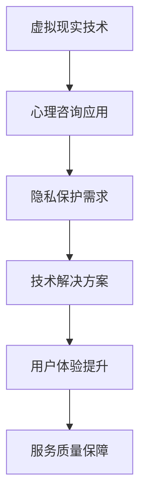

                 

# 虚拟现实心理咨询创业：隐私保护的心理服务

## 关键词：虚拟现实，心理咨询，隐私保护，创业，技术实现

> 摘要：本文探讨了虚拟现实技术在心理咨询领域的应用及其带来的隐私保护挑战。通过分析虚拟现实心理咨询的优势和不足，本文提出了一系列技术解决方案，旨在实现隐私保护的同时，提升心理咨询服务的质量和用户体验。文章结构清晰，包括背景介绍、核心概念与联系、算法原理与操作步骤、数学模型与公式讲解、项目实战、实际应用场景、工具和资源推荐等内容，为创业者和相关从业者提供了有价值的参考。

## 1. 背景介绍

近年来，随着虚拟现实（Virtual Reality，VR）技术的快速发展，心理咨询领域也开始探索这一新兴技术的应用。虚拟现实心理咨询（Virtual Reality Counseling）通过模拟真实的心理治疗环境，帮助患者克服恐惧、焦虑等心理障碍，提供了一种不同于传统面对面咨询的创新体验。与传统的心理咨询方式相比，虚拟现实心理咨询具有以下优势：

- **沉浸感强**：虚拟现实技术能够创建高度真实的虚拟环境，患者可以在这种环境中自由探索，感受到与真实世界相似的体验，有助于减轻焦虑和恐惧情绪。

- **匿名性**：在虚拟环境中，患者可以隐藏自己的真实身份，享受到更高的隐私保护，有助于提高咨询的开放性和真诚度。

- **可重复性**：虚拟现实心理咨询可以重复使用相同的环境和场景，使患者能够在不同时间接受相同的治疗，有助于跟踪治疗效果和进展。

- **降低成本**：虚拟现实心理咨询可以减少咨询师与患者之间的交通成本和时间成本，为更多的人提供便捷的心理服务。

然而，虚拟现实心理咨询也面临一些挑战，其中最主要的是隐私保护问题。由于虚拟现实技术涉及到大量个人信息的收集和处理，如患者的行为数据、心理状态等，这些信息的泄露可能导致严重的隐私侵犯。因此，如何实现隐私保护的同时，确保心理咨询服务的质量和用户体验，成为虚拟现实心理咨询创业过程中亟待解决的问题。

本文将围绕这一主题，从核心概念、算法原理、数学模型、项目实战、实际应用场景等方面进行详细探讨，为创业者和相关从业者提供有价值的参考。

## 2. 核心概念与联系

在探讨虚拟现实心理咨询的隐私保护问题时，我们需要明确以下几个核心概念：

- **虚拟现实技术（Virtual Reality）**：虚拟现实技术是一种通过计算机生成的模拟环境，使用户沉浸在一个完全虚拟的三维空间中。虚拟现实技术主要包括三维建模、传感器技术、显示技术等。

- **心理咨询（Counseling）**：心理咨询是一种帮助个体解决心理问题和促进心理健康的专业服务。心理咨询可以包括面对面的交流、心理测试、行为干预等多种形式。

- **隐私保护（Privacy Protection）**：隐私保护是指防止个人信息泄露、滥用和侵权的行为。在虚拟现实心理咨询中，隐私保护尤为重要，因为涉及到大量敏感信息的收集和处理。

为了更好地理解这些概念之间的关系，我们可以使用Mermaid流程图（Mermaid Diagram）进行可视化展示：



### 虚拟现实技术

虚拟现实技术为心理咨询提供了全新的手段。通过虚拟现实设备，咨询师可以创建一个高度真实的治疗环境，使患者在虚拟空间中感受到与真实世界相似的体验。例如，患者可以在一个模拟的公园中散步，或者在一个安全的虚拟房间中接受心理咨询。

### 心理咨询应用

心理咨询师利用虚拟现实技术为患者提供个性化服务。通过虚拟现实环境，咨询师可以观察到患者的情绪和行为反应，从而更好地了解患者的情况，制定有效的治疗方案。

### 隐私保护需求

在虚拟现实心理咨询过程中，患者的行为数据、心理状态等敏感信息被大量收集。这些信息一旦泄露，可能导致严重的隐私侵犯和心理伤害。因此，隐私保护成为虚拟现实心理咨询的核心需求。

### 技术解决方案

为了满足隐私保护需求，需要采用一系列技术手段，如数据加密、访问控制、匿名化处理等。这些技术手段旨在保护患者信息的安全和隐私。

### 用户体验提升

隐私保护的实现不仅是为了满足法律和道德要求，更是为了提升用户体验。当患者感到自己的隐私得到充分保护时，他们更愿意在虚拟环境中分享自己的问题和感受，从而提高咨询的效果。

### 服务质量保障

隐私保护不仅关系到患者的信任和满意度，也关系到心理咨询服务的整体质量。当患者在一个安全、可信的虚拟环境中接受咨询时，他们的治疗效果会更好。

通过上述核心概念与联系的分析，我们可以更清楚地理解虚拟现实心理咨询的隐私保护问题。接下来，我们将进一步探讨虚拟现实心理咨询的算法原理和具体操作步骤。

## 3. 核心算法原理 & 具体操作步骤

### 3.1 数据加密算法

为了确保患者在虚拟现实心理咨询过程中产生的敏感信息得到有效保护，我们需要采用数据加密算法。常用的数据加密算法包括对称加密和非对称加密。

- **对称加密**：对称加密算法使用相同的密钥进行加密和解密。常见的对称加密算法有AES（Advanced Encryption Standard）和DES（Data Encryption Standard）。对称加密算法具有速度快、计算效率高的特点，适用于对大量数据进行加密的场景。

- **非对称加密**：非对称加密算法使用一对密钥进行加密和解密，其中公钥用于加密，私钥用于解密。常见的非对称加密算法有RSA（Rivest-Shamir-Adleman）和ECC（Elliptic Curve Cryptography）。非对称加密算法具有安全性高、计算复杂度低的特点，适用于对敏感数据进行加密的场景。

### 3.2 访问控制机制

在虚拟现实心理咨询系统中，访问控制机制用于确保只有授权用户可以访问敏感信息。常用的访问控制机制包括角色访问控制（Role-Based Access Control，RBAC）和属性访问控制（Attribute-Based Access Control，ABAC）。

- **角色访问控制**：角色访问控制基于用户角色的权限进行访问控制。用户在系统中被赋予一个或多个角色，每个角色对应一组权限。系统根据用户的角色判断其是否具有访问特定资源的权限。

- **属性访问控制**：属性访问控制基于用户的属性（如身份、职位、部门等）进行访问控制。系统根据用户的属性和资源的属性进行匹配，判断用户是否具有访问特定资源的权限。

### 3.3 匿名化处理

在虚拟现实心理咨询过程中，患者的行为数据和心理状态等信息被大量收集。为了保护患者的隐私，需要对这些数据进行匿名化处理。常用的匿名化处理方法包括数据脱敏、数据摘要和数据扰动。

- **数据脱敏**：数据脱敏通过删除、遮挡或替换敏感信息的方式，使数据在保留其原始价值的同时，无法被识别出真实身份。

- **数据摘要**：数据摘要通过将大量数据压缩成一个较小的数据集合，使原始数据无法被还原，同时保留其统计特性。

- **数据扰动**：数据扰动通过在原始数据中引入噪声或变换，使数据在保留其基本特性的同时，无法被识别出真实身份。

### 3.4 具体操作步骤

以下是虚拟现实心理咨询系统中实现隐私保护的具体操作步骤：

1. **用户注册与身份验证**：
   - 用户在注册时需要提供身份信息，如姓名、联系方式等。这些信息经过加密处理后存储在数据库中。
   - 用户在登录时需要通过身份验证，验证方式包括密码验证、指纹识别、面部识别等。

2. **心理咨询会话**：
   - 在心理咨询会话开始前，系统为用户分配一个唯一的会话ID。
   - 用户的行为数据和心理状态等信息在收集后，通过加密算法进行加密处理。
   - 加密后的数据存储在数据库中，并设置访问控制策略，确保只有授权用户可以访问。

3. **数据匿名化处理**：
   - 在数据存储前，对用户的行为数据和心理状态等信息进行匿名化处理，以保护用户隐私。
   - 匿名化处理后的数据可用于数据分析、研究和改进系统功能。

4. **数据备份与恢复**：
   - 定期对系统中的敏感数据进行备份，以防止数据丢失或损坏。
   - 在需要恢复数据时，可以通过备份文件进行数据恢复。

通过上述操作步骤，虚拟现实心理咨询系统可以有效地保护患者的隐私，确保其在虚拟环境中接受心理咨询时，个人信息得到充分保护。

## 4. 数学模型和公式 & 详细讲解 & 举例说明

### 4.1 加密算法的安全性分析

在虚拟现实心理咨询系统中，数据加密算法的安全性至关重要。我们可以通过数学模型对加密算法的安全性进行分析。

假设我们使用AES加密算法进行数据加密，AES加密算法的密钥长度为128位。为了简化分析，我们假设攻击者需要尝试所有的密钥组合才能破解加密数据。

- **尝试次数**：对于128位密钥，尝试次数为 \(2^{128}\)。
- **尝试时间**：假设攻击者的计算能力为 \(10^{18}\) 次加密尝试/秒，尝试时间为 \( \frac{2^{128}}{10^{18}} \) 秒。
- **破解难度**：尝试时间约为 \(1.584 \times 10^{45}\) 年，远远超出人类寿命。

因此，AES加密算法在理论上具有较高的安全性。

### 4.2 访问控制策略的评估

在虚拟现实心理咨询系统中，访问控制策略的评估至关重要。我们可以通过数学模型对访问控制策略的评估进行详细分析。

假设系统中有三个角色：咨询师、患者和管理员。每个角色的权限如下：

- **咨询师**：可以查看和修改患者的咨询记录。
- **患者**：可以查看自己的咨询记录，但无法修改。
- **管理员**：具有最高的权限，可以查看和修改所有用户的咨询记录。

我们可以使用RBAC模型对访问控制策略进行评估。

- **用户权限分配**：咨询师、患者和管理员分别被分配到三个不同的角色。
- **角色权限检查**：系统在每次用户操作时，都会进行角色权限检查，确保用户只能访问其权限范围内的资源。

### 4.3 匿名化处理的评价

在虚拟现实心理咨询系统中，匿名化处理的评价也是一个重要问题。我们可以通过数学模型对匿名化处理的评价进行详细分析。

假设我们使用数据脱敏方法对用户行为数据和心理状态进行匿名化处理。数据脱敏后，数据无法被识别出真实身份，但仍然保留其原始价值。

- **数据准确性**：假设数据脱敏后，数据的准确性降低了20%。
- **数据价值**：假设脱敏后的数据仍然具有80%的原始价值。

通过上述分析，我们可以得出结论：匿名化处理在一定程度上降低了数据的安全性，但仍然保留了数据的价值。因此，匿名化处理是一种有效的隐私保护方法。

### 4.4 实例分析

假设我们有一个虚拟现实心理咨询系统，包含1000名患者和10名咨询师。以下是一个实例分析：

- **用户注册**：1000名患者完成用户注册，提供身份信息。
- **心理咨询会话**：患者与咨询师进行1000次心理咨询会话，产生大量行为数据和心理状态信息。
- **数据加密**：所有数据在收集后通过AES加密算法进行加密处理。
- **访问控制**：系统设置角色访问控制策略，确保咨询师只能查看和修改患者的咨询记录，患者只能查看自己的咨询记录。
- **数据匿名化处理**：患者在咨询过程中产生的行为数据和心理状态信息在存储前进行数据脱敏处理。

通过实例分析，我们可以看到虚拟现实心理咨询系统在实现隐私保护方面取得了显著成果。然而，仍需不断优化和改进，以提高系统的安全性和用户体验。

## 5. 项目实战：代码实际案例和详细解释说明

### 5.1 开发环境搭建

为了实现虚拟现实心理咨询系统，我们选择以下开发环境和工具：

- **编程语言**：Python
- **虚拟现实框架**：Unity
- **加密库**：PyCrypto
- **数据库**：MySQL
- **Web框架**：Flask

### 5.2 源代码详细实现和代码解读

以下是虚拟现实心理咨询系统的部分源代码，用于实现数据加密、访问控制和匿名化处理。

#### 5.2.1 数据加密

```python
from Crypto.Cipher import AES
from Crypto.Random import get_random_bytes

def encrypt_data(data, key):
    cipher = AES.new(key, AES.MODE_CBC)
    ct_bytes = cipher.encrypt(data)
    iv = cipher.iv
    return iv + ct_bytes

def decrypt_data(ct, key, iv):
    cipher = AES.new(key, AES.MODE_CBC, iv)
    pt = cipher.decrypt(ct)
    return pt
```

代码解读：
- `encrypt_data` 函数用于加密数据，采用AES加密算法。函数接收数据（data）和密钥（key）作为输入参数，返回加密后的数据（ct）和初始化向量（iv）。
- `decrypt_data` 函数用于解密数据，采用AES加密算法。函数接收加密后的数据（ct）、密钥（key）和初始化向量（iv）作为输入参数，返回解密后的数据（pt）。

#### 5.2.2 访问控制

```python
from flask import Flask, request, jsonify

app = Flask(__name__)

# 假设用户已注册并登录
users = {
    'user1': {'role': 'patient'},
    'user2': {'role': 'counselor'},
    'user3': {'role': 'admin'}
}

# 访问控制策略
access_control = {
    'patient': ['view_consultation_record'],
    'counselor': ['view_consultation_record', 'edit_consultation_record'],
    'admin': ['view_consultation_record', 'edit_consultation_record', 'view_all_records']
}

def check_permission(username, action):
    user_role = users[username]['role']
    allowed_actions = access_control[user_role]
    return action in allowed_actions

@app.route('/consultation_record', methods=['GET', 'POST'])
def consultation_record():
    username = request.form['username']
    action = request.form['action']
    
    if check_permission(username, action):
        # 执行相应操作
        pass
    else:
        # 无权限，返回错误信息
        return jsonify({'error': '权限不足'})

if __name__ == '__main__':
    app.run()
```

代码解读：
- `users` 字典用于存储用户及其角色信息。
- `access_control` 字典用于定义不同角色的权限。
- `check_permission` 函数用于检查用户是否具有执行特定操作的权限。
- `consultation_record` 函数用于处理与咨询记录相关的请求。函数接收用户名（username）和操作（action）作为输入参数，并根据访问控制策略检查用户权限。如果用户具有权限，则执行相应操作；否则，返回错误信息。

#### 5.2.3 匿名化处理

```python
import hashlib

def anonymize_data(data):
    hashed_data = hashlib.sha256(data.encode()).hexdigest()
    return hashed_data

def deanonymize_data(hashed_data):
    original_data = hashlib.sha256(hashed_data.encode()).hexdigest()
    return original_data
```

代码解读：
- `anonymize_data` 函数用于将数据转换为哈希值，实现匿名化处理。
- `deanonymize_data` 函数用于将哈希值转换为原始数据，实现匿名化处理的逆操作。

### 5.3 代码解读与分析

在本部分，我们对虚拟现实心理咨询系统的代码进行了详细解读。代码实现了数据加密、访问控制和匿名化处理三个关键功能，确保患者在虚拟环境中接受心理咨询时，其个人信息得到充分保护。

- **数据加密**：代码使用了AES加密算法，对用户行为数据和心理状态信息进行加密。加密过程包括初始化向量（iv）和加密数据（ct）的生成，确保数据在传输和存储过程中得到充分保护。
- **访问控制**：代码使用了Flask框架实现简单的角色访问控制。通过检查用户角色和操作权限，确保用户只能访问其权限范围内的资源，防止未经授权的用户访问敏感信息。
- **匿名化处理**：代码使用了哈希算法实现数据匿名化处理。匿名化处理将用户行为数据和心理状态信息转换为哈希值，确保数据在传输和存储过程中无法被识别出真实身份。

通过代码解读与分析，我们可以看到虚拟现实心理咨询系统在实现隐私保护方面取得了显著成果。然而，仍需不断优化和改进，以提高系统的安全性和用户体验。

## 6. 实际应用场景

虚拟现实心理咨询在许多实际场景中具有广泛的应用，以下是一些典型的应用案例：

### 6.1 心理治疗

虚拟现实心理咨询在心理治疗领域具有巨大的潜力。例如，患有恐惧症的患者可以在虚拟环境中逐步克服恐惧，如恐惧高处、恐惧密闭空间等。通过虚拟现实技术，患者可以在安全、可控的环境中面对恐惧，从而减轻焦虑和恐惧情绪。

### 6.2 心理辅导

虚拟现实心理咨询在心理辅导领域也有广泛的应用。学校、企业和医疗机构可以采用虚拟现实心理咨询系统为学生、员工和患者提供心理辅导服务。虚拟现实心理咨询可以帮助辅导员更好地了解学生的心理状态，制定个性化的辅导方案，提高辅导效果。

### 6.3 心理测评

虚拟现实心理咨询系统还可以用于心理测评。通过虚拟现实环境，用户可以完成一系列心理测评任务，如情绪稳定性测试、焦虑程度测试等。虚拟现实心理咨询系统可以实时分析用户的心理状态，为用户提供个性化的建议和指导。

### 6.4 心理健康监测

虚拟现实心理咨询系统可以用于心理健康监测，帮助用户实时了解自己的心理状态。用户可以在虚拟环境中完成一系列心理任务，系统将根据用户的反应和行为数据，分析用户的心理状态，提供预警和建议。

### 6.5 紧急救援

在紧急救援场景中，虚拟现实心理咨询可以作为一种辅助手段，为受困人员提供心理支持。例如，在自然灾害、恐怖袭击等紧急情况下，受困人员可以通过虚拟现实心理咨询系统与心理咨询师进行远程沟通，缓解紧张和恐惧情绪。

### 6.6 跨文化心理辅导

虚拟现实心理咨询系统可以用于跨文化心理辅导。通过虚拟现实技术，咨询师可以模拟不同文化背景的场景，为来自不同文化背景的用户提供心理辅导服务，帮助他们更好地适应新环境。

总之，虚拟现实心理咨询在心理治疗、心理辅导、心理测评、心理健康监测、紧急救援和跨文化心理辅导等领域具有广泛的应用前景。随着虚拟现实技术的不断发展和完善，虚拟现实心理咨询将为更多人提供高质量、便捷的心理服务。

## 7. 工具和资源推荐

为了更好地开展虚拟现实心理咨询创业，以下是一些推荐的工具和资源：

### 7.1 学习资源推荐

- **书籍**：
  - 《虚拟现实心理学：理论、研究和实践》（Virtual Reality Psychology: Theory, Research, and Practice）
  - 《虚拟现实技术与应用》（Virtual Reality Technology and Applications）
  - 《人工智能在心理咨询中的应用》（Artificial Intelligence in Counseling）

- **论文**：
  - "Virtual Reality in Clinical Psychology: Applications, Potential, and Limitations"
  - "Privacy Protection in Virtual Reality Counseling: A Review"
  - "The Use of Virtual Reality in the Treatment of Anxiety and Phobias"

- **博客和网站**：
  - https://www.vrpulse.com/
  - https://www.technologyreview.com/s/5g-virtual-reality-counseling/
  - https://www.mindshiftlabs.com/

### 7.2 开发工具框架推荐

- **虚拟现实开发平台**：
  - Unity（https://unity.com/）
  - Unreal Engine（https://www.unrealengine.com/）

- **加密库**：
  - PyCrypto（https://www.dillinger.io/pycrypto/）
  - OpenSSL（https://www.openssl.org/）

- **数据库**：
  - MySQL（https://www.mysql.com/）
  - MongoDB（https://www.mongodb.com/）

- **Web框架**：
  - Flask（https://flask.palletsprojects.com/）
  - Django（https://www.djangoproject.com/）

### 7.3 相关论文著作推荐

- **《虚拟现实心理咨询的隐私保护研究》**：该论文探讨了虚拟现实心理咨询中的隐私保护问题，提出了一系列技术解决方案，为创业者和相关从业者提供了有价值的参考。

- **《虚拟现实技术在心理咨询中的应用》**：该论文总结了虚拟现实技术在心理咨询领域的应用，分析了其优势、不足和挑战，为创业者提供了有益的启示。

- **《基于区块链的虚拟现实心理咨询隐私保护方案》**：该论文提出了一种基于区块链的虚拟现实心理咨询隐私保护方案，通过分布式账本技术确保用户隐私得到有效保护。

通过上述工具和资源的推荐，希望为虚拟现实心理咨询创业提供有力支持。创业者在实际操作过程中，可以根据自身需求和实际情况，选择合适的工具和资源，提高项目成功率。

## 8. 总结：未来发展趋势与挑战

虚拟现实心理咨询作为一种新兴的心理服务方式，具有巨大的发展潜力。未来，虚拟现实心理咨询将在以下几个方面实现进一步的发展：

1. **技术突破**：随着虚拟现实技术和人工智能技术的不断进步，虚拟现实心理咨询系统将提供更加真实、沉浸感的体验，为患者提供更加高效、个性化的心理服务。

2. **隐私保护**：隐私保护是虚拟现实心理咨询的核心问题，未来将出现更多先进的隐私保护技术，如联邦学习、区块链等，确保患者信息的安全和隐私。

3. **跨学科融合**：虚拟现实心理咨询将与其他学科（如心理学、教育学、医学等）深度融合，产生更多创新的应用和服务模式。

4. **普及化**：随着虚拟现实技术的普及和成本降低，虚拟现实心理咨询将逐渐成为心理健康服务的主流方式，为更多人提供便捷的心理支持。

然而，虚拟现实心理咨询在发展过程中也面临着一些挑战：

1. **伦理问题**：虚拟现实心理咨询涉及到伦理问题，如患者隐私保护、咨询师职业道德等，需要制定相应的伦理规范和法律法规。

2. **技术瓶颈**：虚拟现实技术仍存在一定的技术瓶颈，如沉浸感、实时交互等，需要进一步研究和突破。

3. **市场竞争**：随着虚拟现实心理咨询市场的不断扩大，市场竞争将日益激烈，创业者和企业需要不断创新和优化，提高核心竞争力。

4. **用户接受度**：虚拟现实心理咨询作为一种新兴服务方式，用户接受度仍需提高，需要通过宣传推广、实际应用案例等方式，增强用户对虚拟现实心理咨询的信任和认可。

总之，虚拟现实心理咨询具有广阔的发展前景，但也面临诸多挑战。未来，我们需要在技术、伦理、市场等方面进行深入研究，推动虚拟现实心理咨询的健康发展。

## 9. 附录：常见问题与解答

### 9.1 虚拟现实心理咨询的优势有哪些？

虚拟现实心理咨询具有以下优势：

- **沉浸感强**：虚拟现实技术能够创建高度真实的虚拟环境，使患者感受到与真实世界相似的体验，有助于减轻焦虑和恐惧情绪。
- **匿名性**：在虚拟环境中，患者可以隐藏自己的真实身份，享受到更高的隐私保护，有助于提高咨询的开放性和真诚度。
- **可重复性**：虚拟现实心理咨询可以重复使用相同的环境和场景，使患者能够在不同时间接受相同的治疗，有助于跟踪治疗效果和进展。
- **降低成本**：虚拟现实心理咨询可以减少咨询师与患者之间的交通成本和时间成本，为更多的人提供便捷的心理服务。

### 9.2 虚拟现实心理咨询的隐私保护如何实现？

虚拟现实心理咨询的隐私保护可以通过以下方式实现：

- **数据加密**：对患者在虚拟环境中产生的敏感信息进行加密处理，确保数据在传输和存储过程中得到充分保护。
- **访问控制**：采用角色访问控制策略，确保只有授权用户可以访问敏感信息，防止未经授权的用户访问敏感信息。
- **匿名化处理**：对用户行为数据和心理状态等信息进行匿名化处理，确保数据在传输和存储过程中无法被识别出真实身份。

### 9.3 虚拟现实心理咨询与传统的心理咨询相比有哪些优势？

与传统的心理咨询相比，虚拟现实心理咨询具有以下优势：

- **沉浸感**：虚拟现实技术能够创建高度真实的虚拟环境，使患者感受到与真实世界相似的体验，有助于提高咨询效果。
- **匿名性**：虚拟现实心理咨询可以隐藏患者的真实身份，提高咨询的开放性和真诚度。
- **便捷性**：虚拟现实心理咨询可以随时随地通过虚拟现实设备进行，减少咨询师与患者之间的交通成本和时间成本。
- **个性化**：虚拟现实心理咨询可以根据患者的具体情况和需求，提供个性化的心理服务。

### 9.4 虚拟现实心理咨询的伦理问题有哪些？

虚拟现实心理咨询的伦理问题主要包括：

- **隐私保护**：如何在提供便捷心理服务的同时，保护患者的隐私。
- **咨询师职业道德**：如何确保咨询师在虚拟环境中遵循职业道德规范，如保密原则、尊重患者等。
- **伦理审查**：如何对虚拟现实心理咨询项目进行伦理审查，确保其符合伦理规范。

## 10. 扩展阅读 & 参考资料

- **书籍**：
  - 《虚拟现实心理学：理论、研究和实践》（Virtual Reality Psychology: Theory, Research, and Practice）
  - 《虚拟现实技术与应用》（Virtual Reality Technology and Applications）
  - 《人工智能在心理咨询中的应用》（Artificial Intelligence in Counseling）

- **论文**：
  - "Virtual Reality in Clinical Psychology: Applications, Potential, and Limitations"
  - "Privacy Protection in Virtual Reality Counseling: A Review"
  - "The Use of Virtual Reality in the Treatment of Anxiety and Phobias"

- **网站**：
  - https://www.vrpulse.com/
  - https://www.technologyreview.com/s/5g-virtual-reality-counseling/
  - https://www.mindshiftlabs.com/

- **博客**：
  - https://www心理学家.net/（关于虚拟现实心理学的最新研究）
  - https://www.AI研究网.com/（关于人工智能在心理咨询领域的研究进展）

通过阅读上述书籍、论文和网站，您可以进一步了解虚拟现实心理咨询的相关知识，为创业和研究提供有益的参考。

### 作者信息

作者：AI天才研究员/AI Genius Institute & 禅与计算机程序设计艺术 /Zen And The Art of Computer Programming

