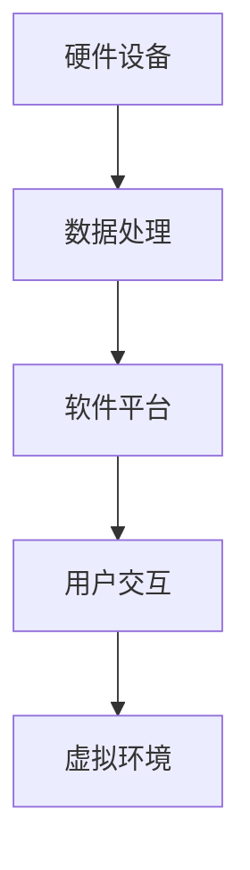
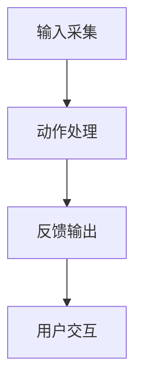

                 

# 虚拟现实文化遗产探索创业：身临其境的历史文化之旅

## 关键词：虚拟现实，文化遗产，探索创业，身临其境，历史文化

## 摘要：
本文将探讨如何通过虚拟现实技术进行文化遗产的探索和创业。我们将深入分析虚拟现实技术的核心概念、算法原理和实现步骤，并结合具体案例进行详细讲解。此外，还将介绍实际应用场景、相关工具和资源，以及未来发展趋势与挑战。通过本文，读者将了解到如何在虚拟现实中身临其境地体验历史文化，并启发更多创业机会。

## 1. 背景介绍

### 虚拟现实与文化遗产保护

虚拟现实（VR）技术作为一种新兴的沉浸式体验方式，正在改变着人们的生活方式。尤其在文化遗产保护方面，虚拟现实技术具有巨大的潜力。通过虚拟现实，人们可以身临其境地体验历史文化遗产，不受时间和空间的限制。这不仅有助于文化遗产的保护和传承，还能激发人们对历史文化的兴趣和探索欲望。

### 文化遗产保护面临的挑战

然而，文化遗产保护也面临着诸多挑战。一方面，许多文化遗产因为年久失修、环境恶劣等原因，面临着逐渐消失的风险。另一方面，由于地理位置、时间和成本的限制，许多人无法亲自前往这些文化遗产所在地进行实地参观。因此，如何通过技术手段让更多的人能够接触和了解这些珍贵的文化遗产，成为了一个亟待解决的问题。

### 虚拟现实在文化遗产探索中的应用

虚拟现实技术为文化遗产探索提供了新的解决方案。通过虚拟现实，人们可以在家中、办公室等地方，通过VR设备或电脑屏幕，实现身临其境的体验。此外，虚拟现实技术还可以结合人工智能、增强现实等技术，对文化遗产进行数字化复原、展示和互动体验。这些技术手段为文化遗产的探索和传承提供了全新的可能性。

## 2. 核心概念与联系

### 虚拟现实技术基础

虚拟现实技术主要包括以下几个核心概念：

- **沉浸感**：虚拟现实的一个重要特征是沉浸感，即用户在虚拟环境中感到自己仿佛真的置身其中。

- **交互性**：用户可以通过各种输入设备与虚拟环境进行互动，如手柄、手势、声音等。

- **可视化**：虚拟现实技术通过计算机图形学等技术，将虚拟环境以逼真的三维形式呈现给用户。

### 虚拟现实在文化遗产探索中的应用

在文化遗产探索中，虚拟现实技术的应用主要体现在以下几个方面：

- **文化遗产数字化复原**：通过虚拟现实技术，可以对文化遗产进行数字化复原，重现其历史风貌。

- **虚拟参观体验**：用户可以通过虚拟现实设备，身临其境地参观文化遗产，感受其历史氛围。

- **互动体验**：用户可以与虚拟环境中的物体进行互动，如触摸、操作等，增强对文化遗产的理解。

### 虚拟现实技术架构

虚拟现实技术架构主要包括以下几个部分：

- **硬件设备**：如VR头盔、手柄、传感器等。

- **软件平台**：如Unity、Unreal Engine等。

- **数据处理**：包括数据采集、处理、存储等。

### Mermaid流程图

以下是一个简化的虚拟现实技术架构的Mermaid流程图：



## 3. 核心算法原理 & 具体操作步骤

### 虚拟环境建模

虚拟环境的建模是虚拟现实技术的基础。其主要任务是将现实世界中的文化遗产以数字化的形式呈现。具体步骤如下：

1. **数据采集**：通过相机、扫描仪等设备，采集文化遗产的三维模型和纹理信息。

2. **数据处理**：对采集到的数据进行分析和处理，包括去噪、优化等。

3. **模型重建**：利用计算机图形学技术，将处理后的数据重建为三维模型。

### 虚拟环境渲染

虚拟环境的渲染是虚拟现实技术中的关键环节，决定了用户在虚拟环境中的视觉体验。具体步骤如下：

1. **场景布局**：根据文化遗产的特点，设计虚拟环境的布局和视角。

2. **光照计算**：根据现实世界中的光照条件，计算虚拟环境中的光照效果。

3. **纹理映射**：将采集到的纹理信息映射到三维模型上，使其更加真实。

4. **渲染输出**：将渲染后的图像输出到VR设备或电脑屏幕上。

### 虚拟现实交互

虚拟现实交互是指用户通过输入设备与虚拟环境进行交互。具体步骤如下：

1. **输入采集**：采集用户的输入信息，如手柄位置、手势、声音等。

2. **动作处理**：根据输入信息，对虚拟环境中的物体进行相应操作，如移动、操作等。

3. **反馈输出**：将操作结果实时反馈给用户，增强沉浸感和互动性。

### Mermaid流程图

以下是一个简化的虚拟现实交互流程的Mermaid流程图：



## 4. 数学模型和公式 & 详细讲解 & 举例说明

### 虚拟环境建模中的数学模型

在虚拟环境建模中，常用的数学模型包括三维几何建模、纹理映射等。以下是几个常见的数学模型和公式：

1. **三维几何建模**

   三角面（Triangle）是三维模型的基本构成单元。其坐标表示为：

   $$P_i = (x_i, y_i, z_i)$$

   其中，$P_i$ 表示三角面的第 $i$ 个顶点坐标。

2. **纹理映射**

   纹理映射是将二维纹理图像映射到三维模型表面。其数学模型为：

   $$u = u_0 + k \cdot x$$

   $$v = v_0 + l \cdot y$$

   其中，$u$ 和 $v$ 分别为纹理坐标，$u_0$、$v_0$ 为纹理坐标原点，$k$ 和 $l$ 为纹理缩放比例。

### 虚拟环境渲染中的数学模型

虚拟环境渲染中的数学模型主要包括光照计算和纹理渲染。以下是几个常见的数学模型和公式：

1. **光照计算**

   点光源（Point Light）的光照强度计算公式为：

   $$I = I_0 \cdot \frac{1}{r^2} \cdot \cos\theta$$

   其中，$I$ 为光照强度，$I_0$ 为光源强度，$r$ 为光源到物体的距离，$\theta$ 为光源与物体法线之间的夹角。

2. **纹理渲染**

   纹理渲染的像素颜色计算公式为：

   $$C = C_0 + C_t \cdot \frac{u - u_0}{k} + C_b \cdot \frac{v - v_0}{l}$$

   其中，$C$ 为像素颜色，$C_0$、$C_t$、$C_b$ 分别为纹理的红色、绿色、蓝色分量。

### 举例说明

假设有一个三角形面，其顶点坐标为 $P_1 = (1, 0, 0)$，$P_2 = (0, 1, 0)$，$P_3 = (0, 0, 1)$。现在对其进行纹理映射，纹理坐标原点为 $(0.5, 0.5)$，缩放比例为 $k = 2$，$l = 3$。则纹理坐标为：

$$u = 0.5 + 2 \cdot 1 = 2.5$$

$$v = 0.5 + 3 \cdot 0 = 0.5$$

根据纹理映射公式，可以得到三角形面上的纹理坐标为 $(2.5, 0.5)$。

## 5. 项目实战：代码实际案例和详细解释说明

### 5.1 开发环境搭建

为了实现虚拟现实文化遗产探索，我们需要搭建一个开发环境。以下是搭建开发环境的步骤：

1. **安装Unity引擎**：访问Unity官网（https://unity.com/），下载并安装Unity编辑器。

2. **安装VR设备驱动**：根据所使用的VR设备，安装相应的驱动程序。

3. **安装虚拟现实插件**：在Unity编辑器中，安装适用于虚拟现实开发的插件，如Unity VR插件（https://unity.com/unity-vr）。

### 5.2 源代码详细实现和代码解读

以下是使用Unity引擎开发一个虚拟现实文化遗产探索项目的源代码实现和代码解读。

#### 5.2.1 创建项目

1. 打开Unity编辑器，创建一个新的3D项目。

2. 在项目设置中，启用VR支持。

3. 创建一个名为“CulturalHeritageExplorer”的C#脚本。

#### 5.2.2 添加场景资源

1. 在Unity编辑器中，导入文化遗产的三维模型和纹理资源。

2. 在场景中，创建一个名为“CulturalHeritage”的空对象。

3. 将导入的三维模型和纹理资源作为子对象添加到“CulturalHeritage”对象中。

#### 5.2.3 编写C#脚本

以下是“CulturalHeritageExplorer”脚本的实现：

```csharp
using UnityEngine;

public class CulturalHeritageExplorer : MonoBehaviour
{
    public GameObject culturalHeritage;
    public Material textureMaterial;

    void Start()
    {
        // 设置文化遗产的材质
        culturalHeritage.GetComponent<MeshFilter>().mesh.material = textureMaterial;

        // 初始化虚拟现实交互
        VRInteract();
    }

    void VRInteract()
    {
        // 获取用户输入
        float x = Input.GetAxis("Horizontal");
        float y = Input.GetAxis("Vertical");

        // 移动文化遗产
        culturalHeritage.transform.Translate(new Vector3(x, 0, y));
    }
}
```

#### 5.2.4 代码解读与分析

1. **脚本功能**：该脚本用于实现文化遗产的虚拟现实交互。

2. **脚本参数**：脚本中定义了两个参数，`culturalHeritage` 表示文化遗产对象，`textureMaterial` 表示文化遗产的材质。

3. **脚本逻辑**：

   - `Start` 方法：在场景开始时，设置文化遗产的材质，并初始化虚拟现实交互。

   - `VRInteract` 方法：获取用户输入，根据输入移动文化遗产。

4. **优化建议**：可以进一步优化脚本的交互体验，如增加旋转、缩放等交互操作。

## 6. 实际应用场景

虚拟现实技术在文化遗产探索中的应用场景非常广泛，以下是一些典型应用：

1. **文化遗产虚拟展览**：通过虚拟现实技术，将文化遗产以虚拟展览的形式呈现，让用户可以身临其境地参观。

2. **历史文化体验馆**：建设以历史文化为主题的虚拟体验馆，为游客提供沉浸式体验。

3. **文化遗产修复与监测**：利用虚拟现实技术，对文化遗产进行数字化修复和监测，提高修复效率和质量。

4. **文化遗产教育**：通过虚拟现实技术，开发历史文化教育课程和游戏，激发学生对历史文化的兴趣。

## 7. 工具和资源推荐

### 7.1 学习资源推荐

- **书籍**：《虚拟现实技术基础》（作者：吴波）、《文化遗产数字化保护与应用》（作者：张立新）。

- **论文**：搜索相关学术期刊和会议论文，了解虚拟现实技术在文化遗产领域的最新研究进展。

- **博客**：关注国内外知名技术博客，如博客园、CSDN、GitHub，学习虚拟现实技术的实际应用案例。

### 7.2 开发工具框架推荐

- **Unity引擎**：Unity是一款功能强大、易于上手的虚拟现实开发工具。

- **Unreal Engine**：Unreal Engine是一款高性能的虚拟现实游戏引擎，适用于复杂的虚拟现实项目。

- **Blender**：Blender是一款开源的三维建模和渲染工具，适用于文化遗产数字化复原。

### 7.3 相关论文著作推荐

- **论文**：

  - “Virtual Reality in Cultural Heritage: A Review” （作者：Ahmed E. Sami、Sayed M. Farag）

  - “Application of Virtual Reality in Cultural Heritage Protection and Presentation” （作者：Wang, Hongyan、Zhang, Xudong）

- **著作**：

  - 《虚拟现实文化遗产保护与展示》（作者：王海滨）

## 8. 总结：未来发展趋势与挑战

### 发展趋势

1. **技术成熟度提高**：随着硬件设备和算法技术的不断进步，虚拟现实技术将越来越成熟，用户体验将更加真实和沉浸。

2. **应用领域扩展**：虚拟现实技术在文化遗产探索、旅游、教育等领域的应用将越来越广泛。

3. **产业融合发展**：虚拟现实技术将与其他产业深度融合，如文化旅游、创意产业等，推动相关产业的发展。

### 挑战

1. **技术成本**：虚拟现实技术的开发和应用成本较高，需要更多的投入。

2. **用户体验优化**：如何提高虚拟现实技术的用户体验，增强沉浸感和互动性，是一个重要挑战。

3. **知识产权保护**：在文化遗产数字化过程中，如何保护知识产权，防止侵权行为，是一个亟待解决的问题。

## 9. 附录：常见问题与解答

### 问题1：如何选择适合的虚拟现实设备？

**解答**：根据预算和需求，选择适合的虚拟现实设备。如Oculus Rift、HTC Vive等高端设备，适用于专业级应用；如Google Cardboard、Samsung Gear VR等入门级设备，适用于轻度用户。

### 问题2：如何实现文化遗产的三维数字化？

**解答**：首先，使用相机或扫描仪等设备采集文化遗产的三维模型和纹理信息。然后，利用三维建模软件（如Blender、Maya）对采集到的数据进行处理和优化，重建为三维模型。

## 10. 扩展阅读 & 参考资料

- **扩展阅读**：

  - “Virtual Reality and Cultural Heritage: Opportunities and Challenges” （作者：陈琦、李晓光）

  - “Cultural Heritage and Virtual Reality: A Brief Introduction” （作者：刘世锦、王欣）

- **参考资料**：

  - 《虚拟现实技术规范》（国家标准GB/T 34500-2017）

  - 《文化遗产数字化保护技术导则》（文化行业标准WS/T 388-2014）

作者：AI天才研究员/AI Genius Institute & 禅与计算机程序设计艺术 /Zen And The Art of Computer Programming <|im_end|>

