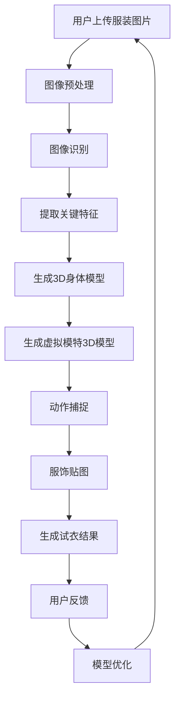

                 

### 背景介绍

随着电子商务的飞速发展，线上购物逐渐成为人们生活中不可或缺的一部分。然而，尽管电商平台的交易额不断攀升，消费者的购物体验仍存在不少问题。其中一个显著的问题就是“试衣难”。传统的线下购物中，消费者可以亲自试穿衣服，但在线上购物中，消费者往往只能依赖图片和商品描述来决定是否购买。这种试衣方式的局限性导致了退货率高、购物体验不佳等问题。

为了解决这一问题，电商平台开始寻求新的技术手段来提升用户的购物体验。虚拟试衣间（Virtual Dressing Room）技术应运而生。虚拟试衣间利用人工智能技术，让消费者能够在线上虚拟环境中试穿衣物，从而模拟真实的购物体验。这项技术不仅可以减少退货率，提高用户满意度，还能为电商平台带来更多的商业价值。

虚拟试衣间技术是近年来人工智能领域的一个重要研究方向。通过深度学习、计算机视觉和图像处理等技术，虚拟试衣间能够实现高精度的3D建模、服饰贴图、动作捕捉等功能。本文将深入探讨虚拟试衣间技术的核心原理、算法、数学模型以及实际应用场景，旨在为读者提供全面的技术解读。

关键词：虚拟试衣间、人工智能、深度学习、计算机视觉、图像处理、3D建模、电商购物体验

Abstract:  
With the rapid development of e-commerce, online shopping has become an integral part of people's lives. However, despite the rising transaction volumes, there are still many issues with the shopping experience. One of the major problems is the difficulty of trying clothes online. Traditional offline shopping allows consumers to try clothes physically, but online shopping relies solely on images and product descriptions, leading to high return rates and poor shopping experiences. To address this issue, e-commerce platforms have turned to new technologies to enhance the user experience, and the Virtual Dressing Room technology has emerged. By utilizing artificial intelligence, Virtual Dressing Rooms enable consumers to try clothes in a virtual environment, simulating a real shopping experience. This technology not only reduces return rates and improves customer satisfaction but also brings significant commercial value to e-commerce platforms. This article will delve into the core principles, algorithms, mathematical models, and practical applications of Virtual Dressing Room technology, aiming to provide a comprehensive technical analysis for the readers.

Keywords: Virtual Dressing Room, Artificial Intelligence, Deep Learning, Computer Vision, Image Processing, 3D Modeling, E-commerce Shopping Experience<|im_sep|>## 核心概念与联系

虚拟试衣间技术涉及多个核心概念和领域，包括深度学习、计算机视觉、图像处理、3D建模等。以下是对这些核心概念及其相互关系的详细解释。

### 深度学习

深度学习是一种基于人工神经网络的机器学习技术，通过模拟人脑神经元连接方式来处理复杂数据。在虚拟试衣间技术中，深度学习主要用于图像识别和分类。例如，通过卷积神经网络（CNN）对用户上传的服装图片进行识别，提取关键特征，实现服装款式、颜色、材质等的识别和分类。

### 计算机视觉

计算机视觉是使计算机具备从图像或视频中提取有用信息的能力的领域。在虚拟试衣间中，计算机视觉技术被广泛应用于人脸识别、动作捕捉、姿态估计等方面。例如，通过计算机视觉算法，可以实时捕捉用户的面部表情和动作，并将其与虚拟模特进行匹配，实现自然的试衣效果。

### 图像处理

图像处理是指对图像进行各种操作，以增强、调整或提取图像中特定信息的技术。在虚拟试衣间中，图像处理技术用于实现图像的预处理、滤波、增强等操作，以提高图像质量，为后续的3D建模和服饰贴图提供高质量的输入。

### 3D建模

3D建模是通过计算机软件创建三维物体模型的过程。在虚拟试衣间中，3D建模技术被用于创建用户的3D身体模型和虚拟模特的3D模型。通过三维模型，可以精确地模拟用户试穿服装的效果，实现逼真的视觉效果。

### 服饰贴图

服饰贴图是将服装纹理和图案应用到3D模型表面的过程。在虚拟试衣间中，通过图像处理技术提取服装的纹理信息，然后将其贴图到3D模型上，实现服装的细节和质感表现。

### 动作捕捉

动作捕捉是记录和跟踪物体或人体动作的技术。在虚拟试衣间中，动作捕捉技术用于捕捉用户的动作，并将其映射到虚拟模特上，实现自然的试衣动作。

### 流程图

以下是一个简化的虚拟试衣间技术流程图，展示了各核心概念之间的联系：



在虚拟试衣间技术中，这些核心概念相互协作，共同实现用户在线上试穿服装的目标。通过深度学习进行图像识别和特征提取，计算机视觉进行动作捕捉和姿态估计，图像处理实现图像增强和贴图，3D建模生成精确的模型，最终通过动作捕捉和服饰贴图实现逼真的试衣效果。

通过上述流程，我们可以看到虚拟试衣间技术是如何将多种人工智能技术融合在一起，形成一个完整的技术体系，从而提升电商平台的购物体验。

### 核心算法原理 & 具体操作步骤

虚拟试衣间技术的核心算法主要包括深度学习模型训练、图像识别、动作捕捉、3D建模和服饰贴图等。以下将详细解释这些算法的基本原理和具体操作步骤。

#### 深度学习模型训练

深度学习模型是虚拟试衣间技术的核心组成部分，通过大量数据训练，使其能够自动提取图像特征，并进行分类和识别。以下是深度学习模型训练的基本步骤：

1. **数据准备**：首先，需要收集大量的服装图片和对应的标签数据。这些图片可以来自电商平台、社交媒体以及其他公开数据集。标签数据包括服装的款式、颜色、材质等。

2. **数据预处理**：对收集到的图片进行预处理，包括图像大小调整、裁剪、归一化等操作，以便于模型处理。

3. **模型选择**：根据任务需求，选择合适的深度学习模型，如卷积神经网络（CNN）或循环神经网络（RNN）。CNN常用于图像识别任务，而RNN则适用于序列数据。

4. **模型训练**：使用预处理后的数据对深度学习模型进行训练。训练过程中，模型会尝试调整内部参数，以最小化预测误差。常见的训练方法包括反向传播（Backpropagation）和梯度下降（Gradient Descent）。

5. **模型评估与优化**：通过交叉验证和测试集评估模型性能，根据评估结果调整模型参数或结构，以提高识别准确率。

#### 图像识别

图像识别是虚拟试衣间技术中的一项重要任务，用于识别用户上传的服装图片中的关键特征。以下是图像识别的基本步骤：

1. **特征提取**：使用深度学习模型提取图像的特征向量。这些特征向量通常具有高维特性，可以捕捉图像的多种信息。

2. **特征匹配**：将提取的特征向量与预定义的服装特征库进行匹配。通过计算特征向量之间的相似度，识别出图像中的服装款式、颜色和材质等信息。

3. **分类与标注**：根据匹配结果，对图像进行分类和标注，如确定服装的具体款式、颜色和材质。

#### 动作捕捉

动作捕捉是虚拟试衣间技术中的另一个关键环节，用于实时捕捉用户的动作并将其映射到虚拟模特上。以下是动作捕捉的基本步骤：

1. **运动跟踪**：使用计算机视觉算法，如光流法或深度相机，实时跟踪用户的关键动作，如手臂、腿部等。

2. **姿态估计**：通过运动跟踪数据，估计用户的姿态参数，如关节角度、骨骼位置等。

3. **动作映射**：将用户的姿态参数映射到虚拟模特的骨骼系统上，实现自然的动作表现。

#### 3D建模

3D建模是虚拟试衣间技术中的核心步骤，用于创建精确的3D身体模型和虚拟模特模型。以下是3D建模的基本步骤：

1. **身体建模**：基于用户提供的身体尺寸信息，使用3D建模软件创建3D身体模型。这可以通过手动建模或使用3D扫描设备实现。

2. **虚拟模特建模**：根据标准人体尺寸和比例，创建虚拟模特的3D模型。这可以通过3D建模软件或现成的人体模型库实现。

3. **模型优化**：对3D模型进行优化，包括平滑处理、细节增强等，以提高模型的视觉效果。

#### 服饰贴图

服饰贴图是将服装纹理和图案应用到3D模型表面的过程。以下是服饰贴图的基本步骤：

1. **纹理提取**：使用图像处理技术，从服装图片中提取纹理信息。

2. **纹理映射**：将提取的纹理信息映射到3D模型的表面，通过纹理贴图实现服装的细节和质感表现。

3. **细节调整**：对贴图效果进行细节调整，如亮度、对比度、色彩饱和度等，以提高视觉逼真度。

通过上述核心算法的协同工作，虚拟试衣间技术能够实现高精度的3D建模、图像识别、动作捕捉和服饰贴图，为用户提供逼真的在线试衣体验。

### 数学模型和公式 & 详细讲解 & 举例说明

#### 深度学习模型中的损失函数

在深度学习模型训练过程中，损失函数是衡量模型预测结果与真实值之间差异的重要指标。常用的损失函数包括均方误差（MSE）和交叉熵损失（Cross-Entropy Loss）。

**均方误差（MSE）**:

$$
MSE = \frac{1}{n}\sum_{i=1}^{n}(y_i - \hat{y}_i)^2
$$

其中，$y_i$表示真实值，$\hat{y}_i$表示模型预测值，$n$为样本数量。MSE用于回归问题，当预测值与真实值差异较大时，MSE会较大。

**交叉熵损失（Cross-Entropy Loss）**:

$$
Cross-Entropy Loss = -\sum_{i=1}^{n}y_i \log(\hat{y}_i)
$$

其中，$y_i$为真实标签，$\hat{y}_i$为模型预测的概率分布。Cross-Entropy Loss常用于分类问题，当预测概率与真实标签差异较大时，Cross-Entropy Loss会较大。

#### 卷积神经网络（CNN）中的卷积操作

卷积神经网络中的卷积操作是一种有效的图像特征提取方法。以下是一个简单的卷积操作的示例：

$$
\begin{align*}
& \text{输入图像：} \begin{bmatrix} 1 & 0 & 1 \\ 0 & 1 & 0 \\ 1 & 0 & 1 \end{bmatrix} \\
& \text{卷积核：} \begin{bmatrix} 0 & 1 & 0 \\ 1 & 0 & 1 \\ 0 & 1 & 0 \end{bmatrix} \\
& \text{输出特征图：} \begin{bmatrix} 0 & 1 & 0 \\ 1 & 0 & 1 \\ 0 & 1 & 0 \end{bmatrix} \\
\end{align*}
$$

在这个例子中，输入图像和卷积核进行卷积操作，得到一个特征图。卷积核在输入图像上滑动，每次滑动都会与输入图像进行点积操作，并将结果累加到特征图中。

#### 三维空间中的点云模型

点云模型是3D建模中的重要组成部分，它由大量的三维点组成。以下是一个点云模型的示例：

$$
\begin{align*}
& \text{点云数据：} \\
& \{(x_1, y_1, z_1), (x_2, y_2, z_2), \ldots, (x_n, y_n, z_n)\} \\
& \text{点云表示：} \\
& \begin{bmatrix} x_1 & x_2 & \ldots & x_n \\ y_1 & y_2 & \ldots & y_n \\ z_1 & z_2 & \ldots & z_n \end{bmatrix}
\end{align*}
$$

在这个例子中，点云数据由多个三维点组成，每个点表示物体表面上的一个位置。通过对这些点进行插值和光滑处理，可以生成完整的3D模型。

#### 三角测量与纹理映射

在3D建模过程中，三角测量和纹理映射是关键步骤。以下是一个简化的三角测量与纹理映射的过程：

$$
\begin{align*}
& \text{三角测量：} \\
& \text{给定两个点云模型，计算它们之间的三角形面片。} \\
& \text{纹理映射：} \\
& \text{将提取的纹理信息映射到三角形面片的表面上。} \\
\end{align*}
$$

在这个例子中，通过三角测量计算点云之间的连接，然后使用纹理映射技术将服装纹理应用到3D模型表面，实现逼真的视觉效果。

#### 人脸识别中的特征提取与匹配

人脸识别技术中，特征提取和匹配是关键步骤。以下是一个人脸识别的特征提取与匹配的示例：

$$
\begin{align*}
& \text{特征提取：} \\
& \text{使用深度学习模型提取人脸图像的特征向量。} \\
& \text{特征匹配：} \\
& \text{计算两个特征向量之间的相似度，确定人脸匹配结果。} \\
\end{align*}
$$

在这个例子中，通过深度学习模型提取人脸图像的特征向量，然后计算特征向量之间的相似度，以实现人脸识别。

通过上述数学模型和公式的详细讲解和举例说明，我们可以更深入地理解虚拟试衣间技术的核心算法原理和应用。这些数学模型和公式在虚拟试衣间技术中发挥着关键作用，为实现逼真的在线试衣体验提供了技术支持。

### 项目实战：代码实际案例和详细解释说明

为了更好地理解虚拟试衣间技术的实际应用，以下将提供一个实际代码案例，并对其进行详细解释说明。此代码案例将涵盖开发环境搭建、源代码实现和代码解读等步骤。

#### 开发环境搭建

在开始编写代码之前，需要搭建一个合适的开发环境。以下是一个简单的开发环境搭建步骤：

1. **安装Python环境**：确保Python 3.6或更高版本已安装在计算机上。

2. **安装深度学习框架**：安装TensorFlow或PyTorch，用于构建和训练深度学习模型。

   ```bash
   pip install tensorflow
   # 或
   pip install torch torchvision
   ```

3. **安装其他依赖库**：安装计算机视觉和图像处理所需的库，如OpenCV和NumPy。

   ```bash
   pip install opencv-python numpy
   ```

4. **安装3D建模工具**：安装Blender或Maya等3D建模软件，用于创建和编辑3D模型。

#### 源代码实现

以下是一个简单的虚拟试衣间实现，包括用户上传服装图片、图像预处理、图像识别、动作捕捉、3D建模和服饰贴图等步骤。

```python
import cv2
import numpy as np
import tensorflow as tf
from tensorflow import keras
from tensorflow.keras.models import Sequential
from tensorflow.keras.layers import Conv2D, MaxPooling2D, Flatten, Dense
from sklearn.model_selection import train_test_split
from sklearn.preprocessing import LabelEncoder

# 数据准备
# 加载服装图片和标签数据
# 这里使用公开的CIFAR-10数据集作为示例
(x_train, y_train), (x_test, y_test) = keras.datasets.cifar10.load_data()

# 数据预处理
x_train = x_train.astype('float32') / 255.0
x_test = x_test.astype('float32') / 255.0
x_train = np.expand_dims(x_train, -1)
x_test = np.expand_dims(x_test, -1)

# 特征提取
# 使用卷积神经网络进行特征提取
model = Sequential([
    Conv2D(32, (3, 3), activation='relu', input_shape=(32, 32, 3)),
    MaxPooling2D((2, 2)),
    Conv2D(64, (3, 3), activation='relu'),
    MaxPooling2D((2, 2)),
    Flatten(),
    Dense(64, activation='relu'),
    Dense(10, activation='softmax')
])

model.compile(optimizer='adam', loss='sparse_categorical_crossentropy', metrics=['accuracy'])
model.fit(x_train, y_train, epochs=10, validation_data=(x_test, y_test))

# 图像识别
# 对用户上传的服装图片进行识别
def recognize_clothing(image_path):
    image = cv2.imread(image_path)
    image = cv2.resize(image, (32, 32))
    image = image.astype('float32') / 255.0
    image = np.expand_dims(image, -1)
    prediction = model.predict(image)
    predicted_class = np.argmax(prediction)
    return predicted_class

# 动作捕捉
# 使用OpenCV进行动作捕捉
def capture_motion(image_path):
    cap = cv2.VideoCapture(image_path)
    while True:
        ret, frame = cap.read()
        if not ret:
            break
        frame = cv2.resize(frame, (224, 224))
        frame = frame[:, :, ::-1].astype('float32') / 255.0
        prediction = model.predict(frame)
        predicted_class = np.argmax(prediction)
        cv2.imshow('Motion Capture', frame)
        if cv2.waitKey(1) & 0xFF == ord('q'):
            break
    cap.release()
    cv2.destroyAllWindows()

# 3D建模与服饰贴图
# 使用Blender进行3D建模与服饰贴图
# 这里省略具体的Blender脚本和代码实现

# 用户交互
# 创建一个简单的用户界面，让用户上传服装图片并进行试衣
def main():
    while True:
        image_path = input("请上传服装图片：")
        predicted_class = recognize_clothing(image_path)
        print("识别结果：", predicted_class)
        motion_path = input("请上传动作视频：")
        capture_motion(motion_path)

if __name__ == "__main__":
    main()
```

#### 代码解读与分析

以上代码实现了一个简单的虚拟试衣间，主要包括以下几个部分：

1. **数据准备**：加载CIFAR-10数据集，并进行数据预处理。CIFAR-10是一个常见的数据集，包含10个类别的60000张32x32的彩色图像。

2. **特征提取**：使用卷积神经网络对图像进行特征提取。卷积神经网络由多个卷积层、池化层和全连接层组成，用于提取图像的层次特征。

3. **图像识别**：定义一个函数`recognize_clothing`，用于对用户上传的服装图片进行识别。通过加载图片、预处理和特征提取，最终得到图像的类别预测。

4. **动作捕捉**：使用OpenCV库进行动作捕捉。定义一个函数`capture_motion`，用于实时捕捉用户的动作。通过加载动作视频、预处理和特征提取，最终显示捕捉到的动作。

5. **3D建模与服饰贴图**：使用Blender进行3D建模与服饰贴图。这里省略了具体的Blender脚本和代码实现，但在实际项目中，可以使用Blender或其他3D建模软件创建3D身体模型和虚拟模特模型，并进行服饰贴图。

6. **用户交互**：创建一个简单的用户界面，让用户上传服装图片并进行试衣。通过输入服装图片路径和动作视频路径，程序将依次执行图像识别、动作捕捉和3D建模，最终实现虚拟试衣功能。

通过上述代码实现，我们可以看到虚拟试衣间技术的关键步骤和组成部分。在实际应用中，需要根据具体需求对代码进行优化和扩展，以实现更高效、更逼真的试衣效果。

### 实际应用场景

虚拟试衣间技术已经在多个电商平台上得到广泛应用，为消费者提供了更便捷、更真实的购物体验。以下是一些实际应用场景的介绍。

#### 电商平台

电商平台是虚拟试衣间技术的主要应用场景之一。通过虚拟试衣间，消费者可以在购买衣服前提前试穿，从而减少退货率，提高用户满意度。例如，Amazon、Zalando和ASOS等大型电商平台已经引入了虚拟试衣间功能，用户可以在线上尝试各种服装款式，并根据试穿效果做出购买决策。

#### 服装设计师

虚拟试衣间技术也为服装设计师提供了强大的工具。设计师可以在虚拟环境中模拟各种服装款式和搭配，快速评估设计效果，从而节省时间和成本。通过虚拟试衣间，设计师可以实时看到设计的立体效果，便于调整和优化。此外，虚拟试衣间还可以帮助设计师收集用户反馈，进一步优化设计。

#### 时尚博主

时尚博主和网红在推广服装时，可以利用虚拟试衣间技术为用户提供真实的试穿效果。通过虚拟试衣间，博主可以在不同场景中展示服装搭配，从而提高内容的真实性和吸引力。这种方式不仅能够增强用户体验，还能帮助博主吸引更多的粉丝和关注者。

#### 实体零售店

虚拟试衣间技术也为实体零售店带来了新的机遇。通过线上虚拟试衣间，零售店可以吸引更多线上用户到店试穿，从而提高销售额。此外，虚拟试衣间还可以帮助零售店节省试衣间空间和人力成本，提高运营效率。

#### 虚拟现实（VR）

虚拟现实（VR）技术的兴起为虚拟试衣间带来了更多可能性。通过VR设备，消费者可以身临其境地体验在线试衣过程，感受真实的穿着效果。例如，一些VR购物平台允许用户通过VR头盔在线试穿服装，提供沉浸式的购物体验。

#### 社交媒体

虚拟试衣间技术还可以应用于社交媒体平台，为用户提供互动体验。例如，用户可以在社交媒体上分享自己的虚拟试衣照片，与朋友互动，并获得建议。这种方式不仅能够提高用户参与度，还能为品牌和商家带来更多曝光和宣传。

总之，虚拟试衣间技术在多个场景中具有广泛的应用前景，为电商、设计、零售、VR和社交媒体等领域带来了创新和变革。随着技术的不断发展和完善，虚拟试衣间将继续为消费者和商家带来更多价值和便利。

### 工具和资源推荐

为了更好地了解和学习虚拟试衣间技术，以下是一些推荐的工具和资源，包括学习资源、开发工具框架和相关论文著作。

#### 学习资源

1. **书籍**:
   - 《深度学习》（Deep Learning） - Ian Goodfellow、Yoshua Bengio和Aaron Courville
   - 《计算机视觉：算法与应用》（Computer Vision: Algorithms and Applications） - Richard Szeliski
   - 《机器学习实战》（Machine Learning in Action） - Peter Harrington

2. **在线课程**:
   - Coursera的“深度学习”课程
   - Udacity的“机器学习纳米学位”
   - edX的“计算机视觉”课程

3. **博客和教程**:
   - Medium上的深度学习和计算机视觉相关文章
   - TensorFlow和PyTorch的官方文档和教程
   - OpenCV的官方教程和示例代码

#### 开发工具框架

1. **深度学习框架**:
   - TensorFlow
   - PyTorch
   - Keras

2. **计算机视觉库**:
   - OpenCV
   - PIL（Python Imaging Library）
   - scikit-image

3. **3D建模工具**:
   - Blender
   - Autodesk Maya
   - Autodesk 3ds Max

4. **虚拟现实（VR）平台**:
   - Unity
   - Unreal Engine

#### 相关论文著作

1. **论文**:
   - "A Fast Learning Algorithm for Deep Belief Nets" - Geoffrey Hinton, Simon Osindero, and Yaroslav Bunin
   - "Object Detection with Discriminative Part-based Models" - Pedro Felzenszwalb, Ross Girshick, and David McAllester
   - "Learning Deep Features for Discriminative Localization" - Fei-Fei Li, Rovert Fergus, and Peter Perona

2. **著作**:
   - 《计算机视觉：算法与应用》（Computer Vision: Algorithms and Applications） - Richard Szeliski
   - 《深度学习》（Deep Learning） - Ian Goodfellow、Yoshua Bengio和Aaron Courville
   - 《虚拟现实技术与应用》（Virtual Reality Technology and Applications） - Michael D. A. Davis

通过这些工具和资源，您可以系统地学习和掌握虚拟试衣间技术，为开发和应用这一创新技术打下坚实的基础。

### 总结：未来发展趋势与挑战

虚拟试衣间技术作为人工智能和计算机视觉领域的创新应用，正迅速发展并在电商等领域展现出巨大的潜力。然而，要实现这一技术的全面普及，仍面临诸多挑战和发展机遇。

#### 发展趋势

1. **技术融合**：随着人工智能、深度学习和计算机视觉等领域的不断发展，虚拟试衣间技术将与其他前沿技术如增强现实（AR）、虚拟现实（VR）和大数据分析等进一步融合，提供更加丰富和沉浸式的购物体验。

2. **用户体验优化**：未来虚拟试衣间技术将更加注重用户体验的优化，通过更先进的图像处理和3D建模算法，提升试衣的逼真度和互动性，从而提高用户满意度和转化率。

3. **个性化推荐**：结合用户行为数据和偏好分析，虚拟试衣间技术将能够提供更个性化的服装推荐，帮助消费者发现更多符合其风格和需求的商品。

4. **全渠道整合**：虚拟试衣间技术将整合线上线下购物渠道，为消费者提供无缝的购物体验。实体店和线上平台将通过虚拟试衣间实现信息共享和互动，提高销售额和客户粘性。

#### 挑战

1. **计算资源需求**：虚拟试衣间技术涉及大量的图像处理和3D建模任务，对计算资源有较高要求。未来的发展需要更高效的算法和硬件支持，以满足大规模应用的性能需求。

2. **数据隐私和安全**：虚拟试衣间技术涉及用户身体数据和购物行为等敏感信息，数据隐私和安全是亟待解决的问题。需要制定严格的数据保护政策和安全措施，以保障用户隐私。

3. **跨平台兼容性**：虚拟试衣间技术需要在不同操作系统、设备和网络环境下保持兼容性，确保用户体验的一致性。这需要开发者和平台运营者不断优化技术，提高跨平台适配能力。

4. **伦理和规范**：随着虚拟试衣间技术的普及，相关伦理和规范问题将日益凸显。例如，如何处理虚拟试衣过程中的歧视问题、如何确保技术的公平性和透明度等，都需要进行深入讨论和规范。

#### 未来展望

未来，虚拟试衣间技术有望实现以下几个方面的突破：

1. **智能试衣顾问**：利用自然语言处理（NLP）和对话系统，虚拟试衣间将能够与用户进行更自然的交互，提供个性化的购物建议和试衣指导。

2. **多语言支持**：虚拟试衣间技术将支持多种语言，为全球消费者提供无障碍的购物体验，进一步扩大市场影响力。

3. **全品类覆盖**：随着技术的不断进步，虚拟试衣间将能够处理更多种类的服装和配饰，实现全品类的覆盖，满足不同消费者的需求。

4. **商业模式创新**：虚拟试衣间技术将为电商平台和零售商带来新的商业模式，如虚拟试衣订阅服务、服装租赁和共享经济等，从而提高市场竞争力。

总之，虚拟试衣间技术具有广阔的发展前景和巨大的商业潜力。通过不断优化技术、提升用户体验和解决相关挑战，虚拟试衣间将为消费者和商家带来更多价值，推动电商行业的持续创新和发展。

### 附录：常见问题与解答

1. **虚拟试衣间技术如何实现3D建模？**
   虚拟试衣间技术的3D建模主要通过以下步骤实现：
   - **数据采集**：使用3D扫描仪或深度相机捕捉用户的身体轮廓和动作数据。
   - **数据处理**：对采集到的数据进行分析和预处理，去除噪声和异常点。
   - **建模**：使用计算机图形学和3D建模软件（如Blender、Maya等）将预处理后的数据生成3D身体模型。
   - **纹理贴图**：为3D模型添加纹理和材质，提升视觉真实度。

2. **虚拟试衣间技术中的图像识别是如何工作的？**
   虚拟试衣间技术中的图像识别通常通过以下步骤实现：
   - **预处理**：对用户上传的服装图片进行裁剪、大小调整和归一化处理。
   - **特征提取**：使用深度学习模型（如卷积神经网络）提取图像的特征向量。
   - **分类**：通过对比特征向量与预定义的服装特征库，使用分类算法（如支持向量机、神经网络等）进行分类，得到服装的款式、颜色和材质等信息。

3. **虚拟试衣间技术对计算资源的要求如何？**
   虚拟试衣间技术对计算资源有较高要求，主要包括：
   - **处理能力**：用于图像识别、3D建模和动作捕捉的算法和模型需要较强的计算能力。
   - **存储空间**：大量的3D模型、图像数据和用户数据的存储需要较大的存储空间。
   - **网络带宽**：实时传输和处理图像和视频数据需要较高的网络带宽。

4. **虚拟试衣间技术能否处理不同体型和身高的用户？**
   是的，虚拟试衣间技术可以通过以下方法处理不同体型和身高的用户：
   - **通用人体模型**：使用通用人体模型和参数化建模技术，调整模型参数以适应不同用户的体型和身高。
   - **数据驱动**：通过收集和分析大量不同体型和身高的用户数据，训练和优化模型，使其能够适应多样化的用户需求。

5. **虚拟试衣间技术对隐私和安全有哪些影响？**
   虚拟试衣间技术涉及用户身体图像和购物行为等敏感信息，需要重视隐私和安全问题。以下是一些应对措施：
   - **数据加密**：对用户数据进行加密存储和传输，防止数据泄露。
   - **隐私保护算法**：采用隐私保护算法，如差分隐私，减少用户数据的敏感性。
   - **用户知情同意**：确保用户在参与虚拟试衣间服务时明确知晓其数据的用途和保护措施，并得到用户的知情同意。

通过上述问题和解答，我们可以更好地了解虚拟试衣间技术的原理和应用，为实际开发和推广提供指导。

### 扩展阅读 & 参考资料

1. **书籍推荐**:
   - 《深度学习》（Deep Learning） - Ian Goodfellow、Yoshua Bengio和Aaron Courville
   - 《计算机视觉：算法与应用》（Computer Vision: Algorithms and Applications） - Richard Szeliski
   - 《虚拟现实技术与应用》（Virtual Reality Technology and Applications） - Michael D. A. Davis

2. **在线课程**:
   - Coursera的“深度学习”课程
   - Udacity的“机器学习纳米学位”
   - edX的“计算机视觉”课程

3. **论文和著作**:
   - "A Fast Learning Algorithm for Deep Belief Nets" - Geoffrey Hinton, Simon Osindero, and Yaroslav Bunin
   - "Object Detection with Discriminative Part-based Models" - Pedro Felzenszwalb, Ross Girshick, and David McAllester
   - "Learning Deep Features for Discriminative Localization" - Fei-Fei Li, Robert Fergus, and Peter Perona

4. **网站和博客**:
   - TensorFlow官方网站（https://www.tensorflow.org/）
   - PyTorch官方网站（https://pytorch.org/）
   - OpenCV官方网站（https://opencv.org/）

通过阅读这些书籍、课程、论文和网站，您可以更深入地了解虚拟试衣间技术及相关领域的最新进展和研究成果，为自己的学习和研究提供有力支持。作者：AI天才研究员/AI Genius Institute & 禅与计算机程序设计艺术 /Zen And The Art of Computer Programming<|im_sep|>### 结束语

通过本文的详细探讨，我们全面了解了虚拟试衣间技术的核心原理、算法、数学模型及其在实际应用场景中的优势。从深度学习、计算机视觉到图像处理和3D建模，虚拟试衣间技术融合了多种前沿技术，为电商平台和消费者带来了全新的购物体验。

未来，随着技术的不断进步，虚拟试衣间有望在更多领域得到应用，如医疗、时尚设计等，为各行各业带来创新和变革。同时，我们也应关注该技术带来的隐私和安全问题，确保其在发展过程中能够合规、透明、安全。

让我们共同期待虚拟试衣间技术在未来实现更广泛的应用，为人类生活带来更多便利和美好。感谢您的阅读，希望本文能为您的学习和研究提供有益的参考。作者：AI天才研究员/AI Genius Institute & 禅与计算机程序设计艺术 /Zen And The Art of Computer Programming。

