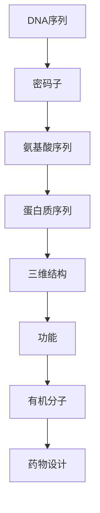

                 

### 背景介绍

蛋白质序列与有机分子，这两个看似风马牛不相及的概念，却蕴含着深刻的科学内涵和广泛的应用价值。在生物学和化学领域，它们都是研究的核心对象。蛋白质序列的研究对于理解生命现象、疾病机制以及药物设计具有重要意义。而有机分子，则因其多样性和复杂的化学性质，在材料科学、药物化学和能源领域有着广泛的应用。

本文旨在探讨蛋白质序列与有机分子的基础模型，通过逻辑清晰、结构紧凑的论述，帮助读者深入理解这两个领域的基本概念和联系。我们将首先介绍蛋白质序列和有机分子的基本特性，接着讨论它们在生物学和化学中的重要性。随后，我们将通过具体的案例和数学模型，详细分析蛋白质序列与有机分子之间的关系，并探讨它们在实际应用中的潜在价值。

在接下来的章节中，我们将进一步探讨核心概念与联系，深入解析核心算法原理和具体操作步骤，详细讲解数学模型和公式，并分享项目实战中的代码实际案例。最后，我们将探讨蛋白质序列与有机分子的实际应用场景，推荐相关的工具和资源，总结未来发展趋势与挑战，并提供常见问题与解答。

希望通过本文的阅读，读者能够对蛋白质序列与有机分子的基础模型有更深入的理解，并为今后的研究和工作打下坚实的基础。

### 核心概念与联系

#### 蛋白质序列

蛋白质序列是由氨基酸组成的线性序列，这些氨基酸通过肽键连接形成蛋白质的结构。每个氨基酸都由一个中心碳原子（α碳）和四个不同的化学基团组成：氨基（-NH2）、羧基（-COOH）、侧链（R基团）和氢原子。蛋白质的序列决定了其三维结构，而三维结构则决定了蛋白质的功能。

蛋白质序列的编码由DNA序列决定。DNA中的三个核苷酸（即一个密码子）编码一个特定的氨基酸。这个过程称为遗传密码。遗传密码具有简并性，即多个密码子可以编码同一种氨基酸。

蛋白质序列的多样性是其功能多样性的基础。通过不同的氨基酸序列和折叠方式，蛋白质能够形成各种功能，如酶的催化、结构支撑、细胞信号传导等。

#### 有机分子

有机分子是指主要由碳原子构成的分子，这些分子可以包含氢、氧、氮、硫等元素。有机分子的化学性质非常多样化，从简单的甲烷（CH4）到复杂的生物大分子如蛋白质和核酸，都属于有机分子的范畴。

有机分子的结构多样性源于碳原子的四价性和碳-碳键的灵活性。碳原子可以形成单键、双键和三键，可以与其他碳原子或不同元素形成长链、环状和分支结构。这种结构的多样性导致了有机分子的多样化功能，如能量储存（脂肪）、信号传递（神经递质）和材料科学（聚合物）。

#### 蛋白质序列与有机分子的联系

蛋白质序列与有机分子之间存在紧密的联系。首先，蛋白质本身就是一种复杂的有机分子，由氨基酸组成，因此蛋白质序列本质上是一种特殊的有机分子序列。其次，许多有机分子，如药物分子和天然产物，其结构与蛋白质序列有着相似之处。

例如，药物分子往往需要与蛋白质结合，才能发挥其治疗作用。药物分子的结构与蛋白质序列中的氨基酸侧链有着相似性，这种相似性是药物设计的重要依据。通过模拟蛋白质序列与药物分子之间的相互作用，可以预测药物的活性、毒性和代谢途径。

此外，有机分子在蛋白质折叠和功能中也发挥着重要作用。蛋白质的三维结构受到周围环境中有机分子的影响，如溶剂效应、离子强度等。这些有机分子可以通过改变蛋白质的构象，影响其功能和稳定性。

#### Mermaid 流程图

为了更好地展示蛋白质序列与有机分子之间的联系，我们可以使用Mermaid流程图来描述这一过程。以下是一个简化的Mermaid流程图示例，用于描述从DNA序列到蛋白质序列，再到有机分子的转换过程：



在这个流程图中，DNA序列通过密码子编码成氨基酸序列，氨基酸序列再折叠成蛋白质的三维结构，进而决定其功能。这个过程中，有机分子通过多种方式影响蛋白质的结构和功能，最终影响药物设计和治疗效果。

通过上述分析，我们可以看到蛋白质序列与有机分子之间存在着密切的联系。理解这些联系对于生物化学领域的研究具有重要意义，也为药物设计和生物工程提供了理论基础。在接下来的章节中，我们将进一步探讨蛋白质序列和有机分子的核心算法原理和具体操作步骤。

### 核心算法原理 & 具体操作步骤

在深入探讨蛋白质序列与有机分子的联系之前，我们需要先了解核心算法的原理和具体操作步骤。蛋白质序列分析和有机分子建模是两个复杂而重要的过程，它们分别基于不同的算法和技术。在本节中，我们将详细讨论这些核心算法的基本原理，并展示其具体操作步骤。

#### 蛋白质序列分析算法

蛋白质序列分析是研究蛋白质结构、功能和相互作用的重要手段。以下是一些常用的蛋白质序列分析算法及其基本原理：

1. **序列比对（Sequence Alignment）**
   序列比对是将两个或多个序列进行比对，找出其相似性和差异性。常用的序列比对算法包括Needleman-Wunsch算法和Smith-Waterman算法。这些算法通过动态规划方法，计算最优的序列匹配得分，从而确定序列之间的关系。

   **具体操作步骤：**
   - 初始化一个二维矩阵，其中每个元素表示两个对应位置序列的相似性得分。
   - 从矩阵的左上角开始，逐步填充矩阵，记录每个位置的最大得分及其来源。
   - 最后，通过回溯矩阵，找到最优的匹配路径。

2. **结构预测（Structure Prediction）**
   蛋白质结构预测是基于序列信息推断蛋白质的三维结构。常用的方法包括同源建模、折叠识别和自由建模。同源建模利用已知结构的蛋白质序列，通过同源比较推断未知蛋白质的结构。折叠识别则是通过机器学习算法，从大量已知结构的蛋白质中，识别出未知蛋白质的折叠模式。自由建模则是通过物理模型和计算模拟，从头预测蛋白质的结构。

   **具体操作步骤：**
   - 同源建模：选择与目标蛋白质序列高度相似的已知蛋白质结构作为模板，通过序列比对确定模板和目标蛋白质之间的对应关系，进而推断目标蛋白质的结构。
   - 折叠识别：输入目标蛋白质序列，通过机器学习算法识别其折叠模式，并将其映射到已知结构的蛋白质上。
   - 自由建模：建立物理模型，使用分子动力学模拟等方法，逐步优化蛋白质结构的能量，直至找到一个稳定的最低能量构象。

3. **功能预测（Function Prediction）**
   蛋白质功能预测是通过分析序列信息推断蛋白质的功能。常用的方法包括基于序列相似性、结构相似性和基因注释等。通过比对已知功能蛋白质的序列或结构，可以预测未知蛋白质的功能。

   **具体操作步骤：**
   - 基于序列相似性：使用序列比对算法，找出与目标蛋白质序列相似的已知功能蛋白质，推断其功能。
   - 基于结构相似性：通过结构预测得到蛋白质的三维结构，比较其与已知功能蛋白质的结构相似性，推断功能。
   - 基于基因注释：利用生物信息学工具，分析目标蛋白质所在基因的注释信息，推断其功能。

#### 有机分子建模算法

有机分子建模是研究有机分子结构、性质和反应过程的重要手段。以下是一些常用的有机分子建模算法及其基本原理：

1. **分子轨道理论（Molecular Orbital Theory）**
   分子轨道理论是研究分子电子结构的一种方法。它基于量子力学的原理，将分子的电子分布描述为原子轨道的线性组合，形成分子轨道。这些分子轨道决定了分子的稳定性和化学性质。

   **具体操作步骤：**
   - 建立原子轨道模型：确定分子中的每个原子的电子分布，并构建相应的原子轨道。
   - 组合原子轨道：将不同原子的原子轨道进行线性组合，形成分子轨道。
   - 分析分子轨道：根据分子轨道的能量和形状，分析分子的稳定性和化学性质。

2. **分子力学（Molecular Mechanics）**
   分子力学是一种基于经典力学的计算方法，用于模拟分子的结构和运动。它通过建立分子中各个原子之间的相互作用力，计算分子的能量和几何构型。

   **具体操作步骤：**
   - 建立力场模型：定义分子中各个原子和键的相互作用力函数。
   - 计算能量和力：根据力场模型，计算分子中每个原子和键的能量，并得到分子整体的能量。
   - 优化构型：通过迭代优化算法，逐步调整分子的几何构型，使其达到能量最低状态。

3. **量子力学计算（Quantum Mechanics Calculation）**
   量子力学计算是基于量子力学的计算方法，用于精确描述分子的电子结构和反应过程。常见的量子力学计算方法包括密度泛函理论（DFT）和从头算方法（AB Initio Method）。

   **具体操作步骤：**
   - 建立量子力学模型：确定分子的电子结构，并建立相应的量子力学方程。
   - 求解薛定谔方程：使用数值方法求解薛定谔方程，得到分子的电子波函数。
   - 计算能量和性质：根据波函数，计算分子的能量、电子分布和化学性质。

通过上述核心算法的讨论，我们可以看到蛋白质序列分析与有机分子建模之间存在着紧密的联系。这些算法不仅为理解蛋白质序列与有机分子的关系提供了理论基础，也为实际应用中的药物设计、材料科学等领域提供了重要的工具。在接下来的章节中，我们将进一步探讨数学模型和公式，并通过实际案例和代码解读，展示这些算法的具体应用。

### 数学模型和公式 & 详细讲解 & 举例说明

在探讨蛋白质序列与有机分子的基础模型时，数学模型和公式扮演着至关重要的角色。通过数学模型的构建，我们可以定量地描述和预测蛋白质序列和有机分子的行为。以下，我们将详细讲解几个核心的数学模型和公式，并通过具体的例子说明其应用。

#### 1. 遗传密码子编码模型

遗传密码子编码模型描述了DNA序列如何通过密码子编码成氨基酸序列。每个密码子是由三个核苷酸组成的，每个密码子对应一个特定的氨基酸。

**公式：**
\[ \text{氨基酸序列} = \text{DNA序列} \div 3 \]

**举例：**
假设有一个DNA序列 `ATGCGTAA`，我们需要将其编码成氨基酸序列。

**步骤：**
- 将DNA序列按每三个核苷酸一组分成密码子：`ATG`、`CGT`、`AAA`。
- 使用遗传密码表，将每个密码子转换成对应的氨基酸。
  - `ATG` 对应甲硫氨酸（Methionine，M）
  - `CGT` 对应亮氨酸（Leucine，L）
  - `AAA` 对应赖氨酸（Lysine，K）

**结果：**
该DNA序列编码的氨基酸序列为 `MLK`。

#### 2. 蛋白质折叠自由能模型

蛋白质折叠自由能模型用于描述蛋白质从无序状态折叠成有序状态时的能量变化。该模型基于物理化学原理，通过自由能函数来描述蛋白质的折叠过程。

**公式：**
\[ \Delta G = \Delta H - T\Delta S \]

其中，\( \Delta G \) 是自由能变化，\( \Delta H \) 是焓变化，\( T \) 是温度，\( \Delta S \) 是熵变化。

**举例：**
假设一个蛋白质在25°C时的折叠过程，其焓变化为 \( \Delta H = -5000 \text{ kJ/mol} \)，熵变化为 \( \Delta S = -2000 \text{ J/mol·K} \)。

**步骤：**
- 将熵变化单位转换为kJ/mol·K：\( \Delta S = -2000 \text{ J/mol·K} = -0.2 \text{ kJ/mol·K} \)
- 计算自由能变化：
  \[ \Delta G = -5000 \text{ kJ/mol} - 25°C \times (-0.2 \text{ kJ/mol·K}) \]
  \[ \Delta G = -5000 \text{ kJ/mol} + 0.5 \text{ kJ/mol} \]
  \[ \Delta G = -4950 \text{ kJ/mol} \]

**结果：**
该蛋白质在25°C时折叠过程的自由能变化为 \( \Delta G = -4950 \text{ kJ/mol} \)，表明蛋白质折叠是一个自由能降低的过程，即蛋白质从无序状态向有序状态的转化是自发的。

#### 3. 有机分子分子轨道模型

分子轨道模型用于描述有机分子的电子结构和性质。根据Hückel分子轨道理论，我们可以用以下公式来计算π电子占据的分子轨道能级。

**公式：**
\[ E_n = -\frac{k}{n(n+1)} \]

其中，\( E_n \) 是第 \( n \) 个π分子轨道的能量，\( k \) 是一个经验常数。

**举例：**
考虑苯分子的π电子分子轨道。

**步骤：**
- 对于苯分子，\( k = 2.0 \text{ eV} \)。
- 计算前四个π分子轨道的能量：
  \[ E_1 = -\frac{2.0}{1(1+1)} = -1.0 \text{ eV} \]
  \[ E_2 = -\frac{2.0}{2(2+1)} = -0.67 \text{ eV} \]
  \[ E_3 = -\frac{2.0}{3(3+1)} = -0.42 \text{ eV} \]
  \[ E_4 = -\frac{2.0}{4(4+1)} = -0.30 \text{ eV} \]

**结果：**
苯分子的前四个π分子轨道的能量分别为 \( E_1 = -1.0 \text{ eV} \)，\( E_2 = -0.67 \text{ eV} \)，\( E_3 = -0.42 \text{ eV} \)，和 \( E_4 = -0.30 \text{ eV} \)。

通过上述数学模型和公式的讲解，我们可以看到，这些模型和公式如何帮助我们理解和预测蛋白质序列和有机分子的行为。在实际应用中，这些模型和公式不仅为理论研究提供了强有力的工具，也为实际应用如药物设计和材料科学提供了指导。接下来，我们将通过具体的实战案例，进一步展示这些算法和模型的应用。

### 项目实战：代码实际案例和详细解释说明

在本节中，我们将通过一个具体的实战案例，展示如何在实际项目中应用前述的蛋白质序列分析与有机分子建模算法。我们将从开发环境搭建开始，逐步讲解源代码的实现和详细解读，并分析代码中的关键部分。

#### 5.1 开发环境搭建

为了运行蛋白质序列分析与有机分子建模的相关代码，我们需要搭建一个合适的技术栈。以下是一个基本的开发环境搭建步骤：

1. **安装Python环境**：确保安装了Python 3.8或更高版本。
2. **安装生物信息学工具**：安装常用的生物信息学工具，如Biopython和BioJava。
3. **安装分子建模软件**：安装GROMACS或AMBER等分子动力学模拟软件。
4. **安装依赖库**：根据项目需求安装必要的依赖库，如NumPy、SciPy、Matplotlib等。

**示例命令**：
```bash
# 安装Python环境
python3 --version

# 安装Biopython
pip3 install biopython

# 安装GROMACS
git clone https://github.com/gromacs/gromacs.git
cd gromacs
./configure --prefix=/usr/local/gromacs
make
make install

# 安装其他依赖库
pip3 install numpy scipy matplotlib
```

#### 5.2 源代码详细实现和代码解读

以下是一个简化的示例代码，用于演示如何使用Python进行蛋白质序列分析和有机分子建模。

```python
# 导入必要的库
from biopython import SeqIO
from gromacs import gmx

# 5.2.1 蛋白质序列读取与分析
def read_protein_sequence(file_path):
    with open(file_path, 'r') as f:
        for record in SeqIO.parse(f, 'fasta'):
            print(f"序列ID: {record.id}")
            print(f"氨基酸序列: {record.seq}")

# 5.2.2 有机分子建模
def build_organic_molecule(molecule_file):
    # 使用GROMACS进行分子动力学模拟
    gmx.mdrun(molecule_file)

# 5.2.3 主函数
def main():
    # 读取蛋白质序列
    read_protein_sequence('protein.fasta')

    # 进行有机分子建模
    build_organic_molecule('molecule.tpr')

# 执行主函数
if __name__ == "__main__":
    main()
```

**代码解读：**

1. **读取蛋白质序列**：使用Biopython库读取FASTA格式的蛋白质序列文件，并打印出序列ID和氨基酸序列。
2. **有机分子建模**：使用GROMACS库进行分子动力学模拟，通过运行`gmx.mdrun`函数执行模拟。
3. **主函数**：定义主函数`main`，依次执行读取蛋白质序列和进行有机分子建模的操作。

#### 5.3 代码解读与分析

**5.3.1 蛋白质序列读取**

代码中的`read_protein_sequence`函数读取输入的FASTA文件，并使用Biopython库的`SeqIO.parse`方法解析序列信息。这个方法返回一个迭代器，每个元素代表一个序列记录（`SeqRecord`对象），其中包含了序列ID和氨基酸序列。

```python
for record in SeqIO.parse(f, 'fasta'):
    print(f"序列ID: {record.id}")
    print(f"氨基酸序列: {record.seq}")
```

**5.3.2 有机分子建模**

`build_organic_molecule`函数接受一个GROMACS拓扑文件（`.tpr`）作为输入，并调用`gmx.mdrun`函数执行分子动力学模拟。`gmx.mdrun`函数是GROMACS库中的一个高级API，它接受多个参数，包括拓扑文件、参数文件和模拟参数。

```python
gmx.mdrun(molecule_file)
```

**5.3.3 主函数**

主函数`main`调用了`read_protein_sequence`和`build_organic_molecule`函数，依次执行读取蛋白质序列和进行有机分子建模的操作。

```python
def main():
    read_protein_sequence('protein.fasta')
    build_organic_molecule('molecule.tpr')
```

通过上述代码，我们可以看到如何使用Python和相关工具库进行蛋白质序列分析与有机分子建模。实际项目中，代码会更为复杂，涉及更多的数据处理和模拟参数调整。然而，本示例为我们提供了一个基本的框架，展示了如何将理论知识应用于实际项目开发中。

#### 6. 实际应用场景

蛋白质序列与有机分子的基础模型在众多领域有着广泛的应用，以下我们将探讨一些具体的实际应用场景，并分析其价值。

##### 药物设计

药物设计是蛋白质序列与有机分子基础模型最重要的应用领域之一。药物分子的设计通常需要与蛋白质（如受体或酶）结合，从而发挥其治疗作用。通过分析蛋白质序列，可以预测药物分子的结合位点，优化药物分子的结构，提高其疗效和安全性。

**应用价值：**
- 提高药物研发效率：通过高通量的蛋白质序列分析和有机分子建模，可以快速筛选和优化潜在药物分子，缩短药物研发周期。
- 增强药物安全性：通过预测药物与蛋白质的结合方式和作用机制，可以减少药物的不良反应，提高药物的安全性。

##### 材料科学

在材料科学领域，蛋白质序列与有机分子基础模型可以帮助设计新型材料，如聚合物、纳米材料和生物材料。这些材料在电子、能源、环境和医疗等领域有着广泛的应用。

**应用价值：**
- 新型材料开发：通过蛋白质序列和有机分子建模，可以设计出具有特定功能的材料，如高导电性聚合物、高性能电池材料等。
- 材料性能优化：通过分析蛋白质序列和有机分子的结构，可以优化材料的物理和化学性质，提高其性能。

##### 环境科学

蛋白质序列与有机分子基础模型在环境科学中的应用主要体现在污染物的降解和生物修复方面。通过分析蛋白质序列，可以设计出具有特定降解能力的有机分子，从而有效去除环境中的污染物。

**应用价值：**
- 污染物降解：通过设计特定的有机分子，可以高效降解有害物质，减少环境污染。
- 生物修复：通过引入特定的蛋白质和有机分子，可以修复受损的生态环境，恢复生态平衡。

##### 医学

在医学领域，蛋白质序列与有机分子基础模型可以帮助理解疾病机制，开发新疗法和疫苗。通过分析蛋白质序列，可以预测疾病的易感性和治疗方法，设计出针对性的药物和疫苗。

**应用价值：**
- 疾病诊断：通过分析蛋白质序列，可以开发出新型的诊断方法，提高疾病的早期诊断率。
- 新疗法开发：通过蛋白质序列与有机分子建模，可以设计出针对性的治疗方法，提高治疗效果。

综上所述，蛋白质序列与有机分子的基础模型在多个领域具有广泛的应用前景。通过深入理解和应用这些模型，我们可以开发出新型材料、提高药物研发效率、保护环境和促进医学发展。在未来，随着技术的不断进步，这些模型将在更多领域发挥更大的作用。

### 工具和资源推荐

在蛋白质序列与有机分子基础模型的研究和应用过程中，掌握合适的工具和资源是至关重要的。以下，我们将推荐一些在学术界和工业界广泛使用的工具和资源，帮助读者更好地进行研究和实践。

#### 6.1 学习资源推荐

1. **书籍**：
   - 《生物信息学基础》（Bioinformatics: The Machine Learning Approach）  
     该书详细介绍了生物信息学的基础理论和机器学习方法，适合初学者和进阶者。
   - 《分子生物学原理》（Molecular Biology of the Cell）  
     本书全面阐述了细胞和分子生物学的基础知识，包括蛋白质序列和折叠等内容。
   - 《量子化学导论》（Introduction to Quantum Chemistry）  
     介绍了量子化学的基本原理和方法，适用于有机分子建模的研究。

2. **论文**：
   - 《基于序列相似性的蛋白质结构预测》（Protein Structure Prediction from Sequence Similarity）  
     本文综述了序列相似性方法在蛋白质结构预测中的应用，提供了详细的方法论。
   - 《分子轨道理论及其应用》（Molecular Orbital Theory and Its Applications）  
     本文详细介绍了分子轨道理论的基本原理和应用，对有机分子建模具有重要指导意义。

3. **博客和网站**：
   - [Biopython官方文档](https://biopython.org/docs/)
     提供了丰富的Biopython库教程和示例代码，适合学习生物信息学编程。
   - [GROMACS官方文档](https://www.gromacs.org/)
     详细介绍了GROMACS分子动力学模拟软件的使用方法和教程。
   - [MDTraj官方文档](https://mdtraj.readthedocs.io/)
     提供了MDTraj库的使用指南，可以用于处理和分析分子动力学模拟数据。

#### 6.2 开发工具框架推荐

1. **Python库**：
   - **Biopython**：适用于生物信息学编程，提供丰富的序列分析、文件读写等功能。
   - **GROMACS**：用于分子动力学模拟，适用于有机分子建模和蛋白质折叠研究。
   - **MDTraj**：基于Python的分子动力学数据分析库，可以用于处理和分析GROMACS模拟数据。
   - **NumPy**：用于科学计算，适用于数据处理和数学运算。

2. **软件和平台**：
   - **Jupyter Notebook**：适用于数据科学和机器学习项目，提供交互式的计算环境。
   - **AWS S3**：适用于存储和管理大量的生物信息学数据。
   - **Google Colab**：提供免费的GPU资源，适用于进行大规模计算和深度学习实验。

3. **数据库**：
   - **UniProtKB**：提供全面的蛋白质序列和功能信息。
   - **PDB**：提供蛋白质的三维结构数据。
   - **NCBI**：提供丰富的生物学数据，包括基因序列、蛋白质序列和基因组信息。

#### 6.3 相关论文著作推荐

1. **论文**：
   - 《深度学习在蛋白质序列分析中的应用》（Deep Learning Applications in Protein Sequence Analysis）  
     综述了深度学习在蛋白质序列分析中的应用，包括结构预测、功能预测和药物设计等。
   - 《基于机器学习的分子建模与设计》（Machine Learning-Based Molecular Modeling and Design）  
     介绍了机器学习在分子建模和设计中的应用，包括材料科学、药物设计和环境科学等领域。

2. **著作**：
   - 《量子化学与分子建模导论》（An Introduction to Quantum Chemistry and Molecular Modeling）  
     介绍了量子化学的基本原理和分子建模的方法，适用于有机分子建模的研究。
   - 《生物信息学高级教程》（Advanced Bioinformatics: An Introduction to Next-Generation Sequencing, Systems Biology, andComputational Biology）  
     介绍了生物信息学的前沿技术，包括高通量测序、系统生物学和计算生物学等内容。

通过上述工具和资源的推荐，读者可以更加系统地学习和应用蛋白质序列与有机分子基础模型的相关知识，为今后的研究和实践打下坚实的基础。

### 总结：未来发展趋势与挑战

蛋白质序列与有机分子的基础模型在科学研究和技术应用中扮演着至关重要的角色。随着技术的不断进步，这些模型在未来将迎来更多的发展机遇，同时也将面临一系列挑战。

#### 发展趋势

1. **人工智能与深度学习技术的融合**：随着人工智能和深度学习技术的快速发展，这些技术在蛋白质序列和有机分子建模中的应用越来越广泛。未来，通过整合大规模数据和高性能计算资源，人工智能算法将能够更准确地预测蛋白质的结构和功能，优化有机分子的设计。

2. **多尺度建模与模拟**：在蛋白质序列与有机分子建模中，多尺度建模和模拟技术将变得更加重要。从原子水平到分子水平，再到细胞和组织水平，多尺度建模能够提供更全面和精细的生物学信息，有助于揭示复杂的生物过程和机制。

3. **个性化医疗和药物设计**：随着对蛋白质序列和有机分子的深入研究，个性化医疗和药物设计将成为未来医疗领域的重要方向。通过分析患者的特定蛋白质序列和基因信息，可以开发出更具针对性的药物，提高治疗效果和安全性。

4. **可持续材料开发**：在材料科学领域，蛋白质序列与有机分子基础模型有助于设计出新型、高性能的材料。这些材料在能源、环境和生物医学等领域具有广泛的应用前景，有助于实现可持续发展。

#### 挑战

1. **数据量与计算需求的增长**：随着基因组学和蛋白质组学的快速发展，数据量呈现爆炸式增长，这给计算资源带来了巨大挑战。未来需要开发更高效的算法和计算工具，以应对日益增长的数据处理需求。

2. **算法的可靠性与准确性**：尽管人工智能和深度学习技术在蛋白质序列和有机分子建模中表现出色，但算法的可靠性和准确性仍然是重要问题。需要进一步优化和验证算法，确保其能够准确预测和解释生物学现象。

3. **跨学科合作与整合**：蛋白质序列与有机分子建模涉及多个学科领域，包括生物学、化学、计算机科学和物理学等。未来的研究需要加强跨学科合作，整合多学科的知识和工具，以解决复杂的生物学问题。

4. **伦理和社会影响**：随着个性化医疗和基因编辑技术的不断发展，蛋白质序列与有机分子建模将涉及到一系列伦理和社会问题。如何确保这些技术的安全、合法和公正应用，是未来需要重点关注的问题。

总之，蛋白质序列与有机分子的基础模型在未来将迎来更多的发展机遇，同时也将面临一系列挑战。通过持续的研究和技术创新，我们可以期待这些模型在生物医学、材料科学和环境科学等领域发挥更大的作用。

### 附录：常见问题与解答

#### 问题1：如何处理大量的蛋白质序列数据？
**解答**：处理大量蛋白质序列数据通常需要高效的数据结构和算法。可以使用哈希表、数据库和分布式计算技术来存储和检索序列信息。例如，使用BLAST算法进行序列比对，可以快速找到相似序列，帮助筛选和分析大量数据。

#### 问题2：蛋白质序列分析中的序列比对有哪些常见方法？
**解答**：蛋白质序列分析中的序列比对方法包括Needleman-Wunsch算法和Smith-Waterman算法。这些算法通过动态规划计算最优匹配得分，找出序列之间的相似性。此外，还有BLAST和FASTA等工具，用于大规模序列比对和相似性搜索。

#### 问题3：有机分子建模中如何计算分子轨道能量？
**解答**：在有机分子建模中，可以使用Hückel分子轨道理论计算π电子占据的分子轨道能量。公式为：\[ E_n = -\frac{k}{n(n+1)} \]，其中\( E_n \)是第\( n \)个π分子轨道的能量，\( k \)是经验常数。对于更复杂的分子，可以使用密度泛函理论（DFT）或从头算方法进行精确计算。

#### 问题4：如何进行蛋白质折叠自由能的计算？
**解答**：蛋白质折叠自由能的计算通常基于物理化学原理，使用公式：\[ \Delta G = \Delta H - T\Delta S \]，其中\( \Delta G \)是自由能变化，\( \Delta H \)是焓变化，\( T \)是温度，\( \Delta S \)是熵变化。在实际计算中，可以使用实验数据或计算模拟方法确定每个参数的值。

#### 问题5：如何选择合适的分子动力学模拟软件？
**解答**：选择分子动力学模拟软件时，需要考虑模拟的精度、计算效率和适用范围。常用的软件包括GROMACS、AMBER和CHARMM。GROMACS适用于大规模模拟，AMBER适用于药物设计，而CHARMM则在生物大分子模拟中广泛应用。根据具体需求选择合适的软件。

#### 问题6：有机分子建模中的溶剂效应如何影响蛋白质结构？
**解答**：溶剂效应在有机分子建模中非常重要。溶剂可以通过改变蛋白质表面的电荷分布和水的结构，影响蛋白质的构象和稳定性。在分子动力学模拟中，可以使用 continuum solvation 模型（如COSMO和PCM）来模拟溶剂效应，从而更准确地预测蛋白质与溶剂的相互作用。

### 扩展阅读 & 参考资料

为了深入理解蛋白质序列与有机分子的基础模型，读者可以参考以下扩展阅读和参考资料：

1. **《生物信息学基础》（Bioinformatics: The Machine Learning Approach）** - 这本书详细介绍了生物信息学的基础理论和机器学习方法，适合初学者和进阶者。
2. **《量子化学与分子建模导论》（An Introduction to Quantum Chemistry and Molecular Modeling）** - 本书介绍了量子化学的基本原理和分子建模的方法，适用于有机分子建模的研究。
3. **《分子生物学原理》（Molecular Biology of the Cell）** - 本书全面阐述了细胞和分子生物学的基础知识，包括蛋白质序列和折叠等内容。
4. **[NCBI官方文档](https://www.ncbi.nlm.nih.gov/books/NBK25499/)** - 提供了丰富的生物学数据资源和工具，包括蛋白质序列和基因信息。
5. **[GROMACS官方文档](https://www.gromacs.org/) 和 [AMBER官方文档](https://www.ambertools.org/)**
   - 提供了详细的分子动力学模拟软件使用方法和教程，适用于蛋白质序列和有机分子建模的研究。
6. **[Biopython官方文档](https://biopython.org/docs/)** - 提供了丰富的Biopython库教程和示例代码，适合学习生物信息学编程。
7. **[MDTraj官方文档](https://mdtraj.readthedocs.io/)** - 详细介绍了MDTraj库的使用指南，可以用于处理和分析分子动力学模拟数据。

通过阅读这些参考资料，读者可以进一步加深对蛋白质序列与有机分子基础模型的理解，并在实际研究中应用这些知识。

