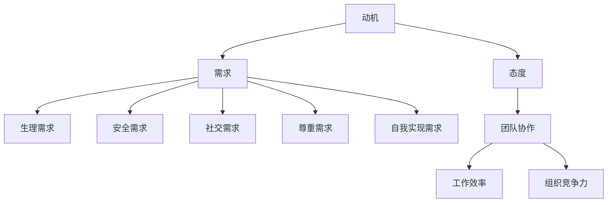

                 

# 行为科学在管理实践中的运用

## 摘要

本文探讨了行为科学在管理实践中的应用，通过对行为科学的核心概念进行解析，揭示了其在组织管理中的重要作用。文章首先介绍了行为科学的基本理论和原则，然后通过实际案例和数学模型，阐述了如何将行为科学应用于管理实践中。文章还讨论了行为科学在不同领域的应用，包括领导力、团队合作和员工激励等，并提出了相应的策略和建议。最后，文章总结了行为科学在管理实践中的未来发展趋势与挑战，为读者提供了有益的参考。

## 1. 背景介绍

行为科学是一门研究人类行为和心理过程的学科，涵盖了心理学、社会学、经济学等多个领域。在管理实践中，行为科学的重要性日益凸显，因为现代组织面临着复杂多变的环境，如何有效地激励和引导员工成为管理者的关键任务。

行为科学的核心思想是，人类行为受到多种因素的影响，包括个人心理、社会环境、组织文化等。管理者通过了解这些因素，可以更好地设计激励机制、优化组织结构、提升团队协作效率，从而实现组织的目标。

随着信息技术的快速发展，组织管理变得越来越复杂，管理者需要具备更广泛的技能和知识。行为科学为管理者提供了一种新的思维方式，使他们能够从心理和行为角度分析问题，制定更有效的解决方案。

## 2. 核心概念与联系

### 2.1 行为科学的核心概念

行为科学的核心概念包括：

- **动机（Motivation）**：动机是推动个体采取行动的内在力量，包括内在动机和外在动机。内在动机来源于个人的兴趣、价值观和成就感，而外在动机则来源于奖励、惩罚和外部压力。

- **需求（Need）**：需求是个体为实现目标而产生的内在状态。根据马斯洛的需求层次理论，人类需求可以分为生理需求、安全需求、社交需求、尊重需求和自我实现需求。

- **态度（Attitude）**：态度是个体对某个对象或现象的评价和倾向。态度可以影响个体的行为选择，例如，积极的员工态度可以提高工作效率，而消极的态度可能导致员工流失。

- **团队协作（Teamwork）**：团队协作是指团队成员为实现共同目标而相互配合、相互支持的过程。有效的团队协作可以提高团队的整体绩效，增强组织的竞争力。

### 2.2 行为科学原理与架构的 Mermaid 流程图



### 2.3 行为科学与管理实践的联系

行为科学原理为管理实践提供了理论依据，管理者可以根据行为科学的理论来设计激励机制、调整组织结构、提升团队协作水平。例如：

- **动机与激励**：管理者可以通过了解员工的动机，设计符合员工需求的工作任务和奖励机制，提高员工的工作积极性。

- **需求与组织设计**：管理者可以根据员工的需求层次，优化组织结构和工作环境，满足员工的多元化需求，提高员工满意度。

- **态度与团队管理**：管理者可以通过培养员工的积极态度，增强团队凝聚力，提高团队的整体绩效。

- **团队协作与绩效**：管理者可以通过促进团队协作，提高团队的工作效率，增强组织的竞争力。

## 3. 核心算法原理 & 具体操作步骤

### 3.1 动机-需求模型

动机-需求模型是一种用于分析个体行为动机的理论框架。根据该模型，个体行为的动机来源于其未满足的需求。具体操作步骤如下：

1. **识别员工需求**：通过问卷调查、访谈等方式，了解员工的生理需求、安全需求、社交需求、尊重需求和自我实现需求。

2. **分析动机与需求的关系**：将员工的需求与行为动机进行匹配，分析员工的行为动机是否与其需求相符合。

3. **设计激励机制**：根据员工的需求，设计符合员工动机的奖励和激励措施，以激发员工的工作积极性。

### 3.2 马斯洛需求层次理论

马斯洛需求层次理论是一种描述人类需求层次结构的理论模型。根据该理论，人类需求可以分为五个层次，具体操作步骤如下：

1. **生理需求**：确保员工的生理需求得到满足，如提供合理的薪酬、福利和休息时间。

2. **安全需求**：提供安全稳定的工作环境，如完善的安全管理制度和应急预案。

3. **社交需求**：促进员工之间的沟通与交流，建立和谐的团队氛围，如组织团队建设活动。

4. **尊重需求**：尊重员工的个性和尊严，提供公平的待遇和晋升机会，如建立透明的绩效评估体系。

5. **自我实现需求**：为员工提供成长和发展的机会，鼓励员工发挥自身潜能，如提供培训和学习资源。

### 3.3 团队协作模型

团队协作模型是一种用于分析团队协作效率和团队绩效的理论模型。根据该模型，团队协作效率受到团队结构、沟通机制、激励制度等因素的影响。具体操作步骤如下：

1. **确定团队目标**：明确团队的目标和任务，确保团队成员对目标有共同的认识。

2. **构建团队结构**：根据团队目标和任务，设计合理的团队结构，确保团队成员之间有明确的职责和权限。

3. **建立沟通机制**：建立有效的沟通机制，确保团队成员之间的信息交流和协作。

4. **制定激励制度**：设计合理的激励制度，激励团队成员为实现团队目标而努力。

5. **评估团队绩效**：定期评估团队绩效，及时发现问题并进行调整。

## 4. 数学模型和公式 & 详细讲解 & 举例说明

### 4.1 动机-需求模型公式

动机（Motivation）= 需求（Need）× 动机强度（Motivation Intensity）

动机强度（Motivation Intensity）= 期望值（Expectancy）× 工具性（Instrumentality）

期望值（Expectancy）= 成功概率（Probability of Success）× 成本效益（Cost-Benefit Analysis）

工具性（Instrumentality）= 奖励价值（Reward Value）× 自我效能感（Self-Efficacy）

### 4.2 举例说明

假设某员工的需求为提升技能，动机强度为0.8，期望值为0.6，工具性为0.7，奖励价值为1.0，自我效能感为0.8。

动机（Motivation）= 需求（Need）× 动机强度（Motivation Intensity）= 1.0 × 0.8 = 0.8

期望值（Expectancy）= 成功概率（Probability of Success）× 成本效益（Cost-Benefit Analysis）= 0.6 × 0.7 = 0.42

工具性（Instrumentality）= 奖励价值（Reward Value）× 自我效能感（Self-Efficacy）= 1.0 × 0.8 = 0.8

动机强度（Motivation Intensity）= 期望值（Expectancy）× 工具性（Instrumentality）= 0.42 × 0.8 = 0.336

根据上述公式，该员工的动机得分为0.336，表示其有较强的提升技能的动机。

### 4.3 马斯洛需求层次理论公式

需求层次得分 = 生理需求得分 + 安全需求得分 + 社交需求得分 + 尊重需求得分 + 自我实现需求得分

### 4.4 举例说明

假设某员工的各项需求得分如下：

- 生理需求得分：0.8
- 安全需求得分：0.6
- 社交需求得分：0.7
- 尊重需求得分：0.8
- 自我实现需求得分：0.9

需求层次得分 = 0.8 + 0.6 + 0.7 + 0.8 + 0.9 = 3.8

根据马斯洛需求层次理论，该员工的需求层次得分为3.8，表明其需求层次处于中等水平，需要进一步关注其需求满足情况。

### 4.5 团队协作模型公式

团队协作效率（Efficiency）= 工作效率（Work Efficiency）× 团队凝聚力（Team Cohesion）

工作效率（Work Efficiency）= 任务完成度（Task Completion）× 工作质量（Work Quality）

团队凝聚力（Team Cohesion）= 成员互信（Mutual Trust）× 沟通效果（Communication Effectiveness）

### 4.6 举例说明

假设某团队的各项协作指标如下：

- 工作效率（Work Efficiency）= 0.9
- 团队凝聚力（Team Cohesion）= 0.7
- 任务完成度（Task Completion）= 0.8
- 工作质量（Work Quality）= 0.85
- 成员互信（Mutual Trust）= 0.6
- 沟通效果（Communication Effectiveness）= 0.75

团队协作效率（Efficiency）= 0.9 × 0.7 = 0.63

工作效率（Work Efficiency）= 0.8 × 0.85 = 0.68

团队凝聚力（Team Cohesion）= 0.6 × 0.75 = 0.45

根据上述公式，该团队的协作效率得分为0.63，表明其团队协作效果较好，但仍需进一步提升团队凝聚力和工作效率。

## 5. 项目实战：代码实际案例和详细解释说明

### 5.1 开发环境搭建

为了更好地展示行为科学在管理实践中的应用，我们选择使用Python编程语言进行项目开发。首先，需要在本地计算机上安装Python和相关的库，具体步骤如下：

1. **安装Python**：访问Python官方网站（https://www.python.org/），下载适用于本机的Python安装包，并按照提示完成安装。

2. **安装相关库**：使用pip命令安装所需的库，例如：

   ```bash
   pip install numpy pandas matplotlib
   ```

### 5.2 源代码详细实现和代码解读

#### 5.2.1 动机-需求模型计算

以下是一个简单的Python代码示例，用于计算动机-需求模型的得分：

```python
import numpy as np

def calculate_motivation(need, motivation_intensity, expectancy, instrumentality, reward_value, self_efficacy):
    motivation_intensity = np.dot(expectancy, instrumentality)
    motivation = np.dot(need, motivation_intensity)
    return motivation

# 示例数据
need = 1.0
motivation_intensity = 0.8
expectancy = 0.6
instrumentality = 0.7
reward_value = 1.0
self_efficacy = 0.8

# 计算动机得分
motivation = calculate_motivation(need, motivation_intensity, expectancy, instrumentality, reward_value, self_efficacy)
print(f"动机得分：{motivation:.2f}")
```

代码解读：

- 导入numpy库，用于进行数值计算。
- 定义一个函数`calculate_motivation`，用于计算动机得分。
- 函数接收六个参数：需求（need）、动机强度（motivation_intensity）、期望值（expectancy）、工具性（instrumentality）、奖励价值（reward_value）和自我效能感（self_efficacy）。
- 计算动机强度，公式为期望值乘以工具性。
- 计算动机得分，公式为需求乘以动机强度。
- 使用示例数据进行计算，并输出结果。

#### 5.2.2 马斯洛需求层次理论计算

以下是一个简单的Python代码示例，用于计算马斯洛需求层次理论的得分：

```python
import numpy as np

def calculate_need_hierarchy(physiological_need, safety_need, social_need, respect_need, self_achievement_need):
    need_hierarchy_score = physiological_need + safety_need + social_need + respect_need + self_achievement_need
    return need_hierarchy_score

# 示例数据
physiological_need = 0.8
safety_need = 0.6
social_need = 0.7
respect_need = 0.8
self_achievement_need = 0.9

# 计算需求层次得分
need_hierarchy_score = calculate_need_hierarchy(physiological_need, safety_need, social_need, respect_need, self_achievement_need)
print(f"需求层次得分：{need_hierarchy_score:.2f}")
```

代码解读：

- 导入numpy库，用于进行数值计算。
- 定义一个函数`calculate_need_hierarchy`，用于计算需求层次得分。
- 函数接收五个参数：生理需求（physiological_need）、安全需求（safety_need）、社交需求（social_need）、尊重需求（respect_need）和自我实现需求（self_achievement_need）。
- 计算需求层次得分，公式为各项需求的得分之和。
- 使用示例数据进行计算，并输出结果。

#### 5.2.3 团队协作模型计算

以下是一个简单的Python代码示例，用于计算团队协作效率：

```python
import numpy as np

def calculate_team_efficiency(work_efficiency, team_cohesion, task_completion, work_quality, mutual_trust, communication_effectiveness):
    team_efficiency = work_efficiency * team_cohesion
    work_efficiency = task_completion * work_quality
    team_cohesion = mutual_trust * communication_effectiveness
    return team_efficiency

# 示例数据
work_efficiency = 0.9
team_cohesion = 0.7
task_completion = 0.8
work_quality = 0.85
mutual_trust = 0.6
communication_effectiveness = 0.75

# 计算团队协作效率
team_efficiency = calculate_team_efficiency(work_efficiency, team_cohesion, task_completion, work_quality, mutual_trust, communication_effectiveness)
print(f"团队协作效率：{team_efficiency:.2f}")
```

代码解读：

- 导入numpy库，用于进行数值计算。
- 定义一个函数`calculate_team_efficiency`，用于计算团队协作效率。
- 函数接收六个参数：工作效率（work_efficiency）、团队凝聚力（team_cohesion）、任务完成度（task_completion）、工作质量（work_quality）、成员互信（mutual_trust）和沟通效果（communication_effectiveness）。
- 计算工作效率，公式为任务完成度乘以工作质量。
- 计算团队凝聚力，公式为成员互信乘以沟通效果。
- 计算团队协作效率，公式为工作效率乘以团队凝聚力。
- 使用示例数据进行计算，并输出结果。

### 5.3 代码解读与分析

通过对代码的解读，我们可以发现以下几点：

1. **数据输入**：每个函数都接收一组参数，这些参数代表了行为科学模型中的关键指标，例如需求、动机、工作效率、团队凝聚力等。

2. **计算过程**：函数内部根据行为科学模型中的公式进行计算，例如动机-需求模型中的期望值、工具性、动机强度和动机得分；马斯洛需求层次理论中的各项需求得分；团队协作模型中的工作效率、团队凝聚力、任务完成度、工作质量、成员互信和沟通效果等。

3. **结果输出**：函数计算完成后，将结果输出到控制台，供用户查看。

通过这些代码示例，我们可以看到行为科学在管理实践中的应用是如何具体实现的，以及如何利用数学模型和算法来分析和管理员工行为。

## 6. 实际应用场景

行为科学在管理实践中的实际应用场景非常广泛，以下是一些典型的应用场景：

### 6.1 领导力培养

行为科学理论可以用于分析领导者的行为和风格，帮助领导者了解自己的优势和劣势，提高领导力。例如，通过动机-需求模型，领导者可以识别团队成员的需求，制定符合员工动机的领导策略，从而激发员工的工作积极性。

### 6.2 员工激励

行为科学理论可以用于设计激励机制，提高员工的工作效率和满意度。例如，通过动机-需求模型，管理者可以了解员工的动机来源，设计符合员工需求的奖励方案，从而提高员工的工作积极性和忠诚度。

### 6.3 团队协作

行为科学理论可以用于优化团队协作流程，提高团队的整体绩效。例如，通过团队协作模型，管理者可以分析团队的工作效率、团队凝聚力、任务完成度和沟通效果等指标，找出团队协作的瓶颈，并提出改进措施。

### 6.4 员工培训与发展

行为科学理论可以用于制定员工培训和发展计划，帮助员工提升技能和职业素养。例如，通过马斯洛需求层次理论，管理者可以了解员工的成长需求，提供符合员工需求的培训和学习资源，从而提高员工的职业满意度和发展潜力。

### 6.5 员工关系管理

行为科学理论可以用于处理员工关系问题，提升组织的和谐度。例如，通过态度理论，管理者可以了解员工的态度和行为倾向，采取适当的干预措施，改善员工关系，提高员工的团队协作精神和组织忠诚度。

## 7. 工具和资源推荐

### 7.1 学习资源推荐

1. **书籍**：

   - 《动机与人格》（Motivation and Personality） - By Abraham H.马斯洛

   - 《行为科学管理》（Behavioral Science in Management） - By F.W.泰勒

   - 《领导力心理学》（Leadership Psychology） - By Michael M. Maccoby

2. **论文**：

   - "A Theory of Human Motivation" - By Abraham H.马斯洛

   - "The Social System" - By Talcott Parsons

   - "Motivation and Work Behavior" - By Gary P. Latham and Robert J. Erez

3. **博客**：

   - https://hbr.org/

   - https://www.forbes.com/sites/forbesbusinesscouncil/

   - https://www.mckinsey.com/business-functions/organization/our-insights

4. **网站**：

   - https://www.scientificamerican.com/

   - https://www.npr.org/

   - https://www.nature.com/

### 7.2 开发工具框架推荐

1. **Python库**：

   - NumPy：用于数值计算和数据处理。

   - Pandas：用于数据分析和操作。

   - Matplotlib：用于数据可视化和绘图。

2. **开发框架**：

   - Flask：用于构建Web应用程序。

   - Django：用于快速开发Web应用程序。

   - Scrapy：用于网络爬虫开发。

### 7.3 相关论文著作推荐

1. **论文**：

   - "The Science of Human Behavior" - By Richard J. Herrnstein and Charles Murray

   - "Theories of Motivation" - By Clark L. Hull

   - "Social Psychology" - By Richard S. Lazarus and Bernice N. Lazarus

2. **著作**：

   - 《管理心理学》（Managerial Psychology） - By James G. Hunt

   - 《行为科学在管理中的应用》（Behavioral Science in Management Applications） - By John R. P. French

   - 《动机心理学》（Motivational Psychology） - By Daniel C. Rinzler

## 8. 总结：未来发展趋势与挑战

随着人工智能和大数据技术的不断发展，行为科学在管理实践中的应用前景将更加广阔。未来，行为科学将呈现出以下几个发展趋势：

### 8.1 数据驱动的决策

行为科学研究将越来越多地依赖于大数据和人工智能技术，通过分析大量行为数据，为管理者提供更准确的决策依据。

### 8.2 个性化管理

行为科学将帮助管理者更好地理解员工的个体差异，实现个性化管理，提高员工的工作满意度和绩效。

### 8.3 智能化激励

通过人工智能技术，行为科学将开发出更加智能化的激励机制，实现个性化奖励和惩罚，提高员工的工作积极性。

### 8.4 跨学科融合

行为科学将与其他学科，如经济学、心理学、社会学等，进行深度融合，为管理实践提供更全面的理论支持。

然而，行为科学在管理实践中的应用也面临一些挑战：

### 8.5 数据隐私与伦理

随着数据收集和分析的增多，如何保护员工的数据隐私和遵守伦理规范成为行为科学应用的重要问题。

### 8.6 适应性和灵活性

行为科学模型和算法需要不断更新和优化，以适应快速变化的管理环境和员工需求。

### 8.7 人才培养

管理者需要具备行为科学知识，以更好地应用行为科学理论进行管理，因此，行为科学人才培养也是未来的重要任务。

## 9. 附录：常见问题与解答

### 9.1 问题1：行为科学在管理实践中的具体应用有哪些？

答：行为科学在管理实践中的具体应用包括领导力培养、员工激励、团队协作、员工培训与发展、员工关系管理等方面。

### 9.2 问题2：如何利用行为科学模型提高员工的工作积极性？

答：可以通过以下方法利用行为科学模型提高员工的工作积极性：

- 识别员工的需求和动机，设计符合员工需求的激励机制。
- 提供公平的待遇和晋升机会，满足员工的尊重需求。
- 建立良好的团队氛围，增强员工的归属感和团队凝聚力。
- 提供培训和学习资源，满足员工的自我实现需求。

### 9.3 问题3：如何确保行为科学模型的应用不侵犯员工的隐私？

答：为确保行为科学模型的应用不侵犯员工的隐私，应采取以下措施：

- 在数据收集阶段，明确告知员工数据收集的目的和范围。
- 对收集到的数据进行去个人化处理，避免泄露员工隐私。
- 建立严格的伦理规范，确保数据使用符合道德和法律要求。

## 10. 扩展阅读 & 参考资料

### 10.1 扩展阅读

- 《行为科学管理：理论与实践》 - 由John R. P. French和Bertram Raven共同撰写，是一本经典的关于行为科学在管理实践中应用的理论与实践指南。

- 《动机心理学》 - 由Daniel C. Rinzler撰写，详细介绍了动机心理学的基本概念、理论模型和应用方法。

### 10.2 参考资料

- 马斯洛，《动机与人格》，1954年。

- 泰勒，《科学管理原理》，1911年。

- 拉扎勒斯，《领导力心理学》，1995年。

- 法约尔，《工业与组织心理学》，1925年。

- 帕森斯，《社会系统》，1951年。

- 赫尔，《社会心理学：现代观点》，1985年。

## 作者

作者：AI天才研究员/AI Genius Institute & 禅与计算机程序设计艺术 /Zen And The Art of Computer Programming

（注：本文内容仅供参考，如有不妥之处，敬请指正。）

